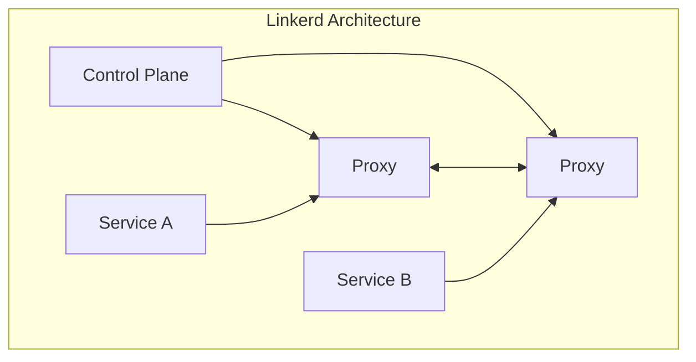
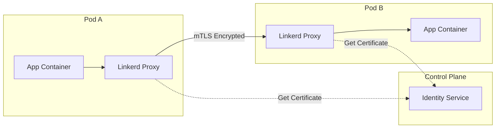
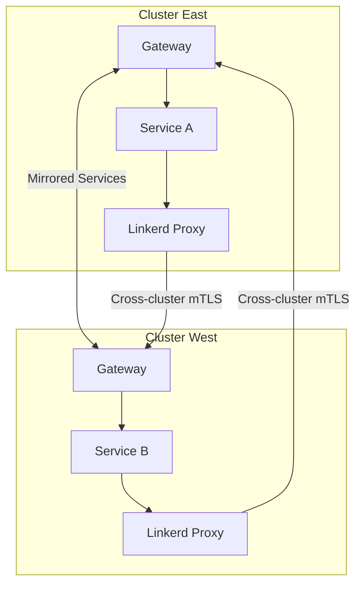

# How to Install Linkerd Service Mesh on Kubernetes

Author: [nawazdhandala](https://www.github.com/nawazdhandala)

Tags: Kubernetes, Linkerd, Service Mesh, Ubuntu, mTLS, Observability, Microservices, DevOps

Description: A comprehensive guide to installing and configuring Linkerd service mesh on Ubuntu Kubernetes clusters, covering CLI installation, Helm deployment, traffic management, and observability features.

---

Service meshes add a layer of infrastructure between your services that handles communication, security, and observability. Linkerd is the original service mesh, designed for simplicity and performance. Unlike heavier alternatives, Linkerd focuses on doing fewer things exceptionally well.

## What is Linkerd and How Does It Compare to Istio?

Linkerd is an ultralight, security-first service mesh for Kubernetes. It provides critical features like mutual TLS, observability, and reliability without the complexity overhead.



### Linkerd vs Istio Comparison

| Feature | Linkerd | Istio |
|---------|---------|-------|
| Resource Usage | ~10MB per proxy | ~50-100MB per proxy |
| Complexity | Minimal | High |
| Learning Curve | Low | Steep |
| mTLS | Automatic, always-on | Configurable |
| Protocol Support | HTTP/1.1, HTTP/2, gRPC, TCP | HTTP/1.1, HTTP/2, gRPC, TCP, plus more |
| Traffic Management | Basic but sufficient | Comprehensive |
| Multi-cluster | Supported | Supported |
| Installation Time | Minutes | Hours |
| CNCF Status | Graduated | Graduated |

### When to Choose Linkerd

- You want simplicity and minimal operational overhead
- Resource efficiency is important
- You need mTLS without complex configuration
- Your traffic management needs are straightforward
- You prefer convention over configuration

### When to Choose Istio

- You need advanced traffic management (fault injection, mirroring)
- You require extensive protocol support
- You need fine-grained policy control
- You have dedicated platform engineering resources

## Prerequisites

Before installing Linkerd, ensure your environment meets these requirements.

### System Requirements

```bash
# Check Ubuntu version (20.04 LTS or later recommended)
lsb_release -a

# Verify kernel version (5.4+ recommended)
uname -r

# Check available memory (minimum 4GB for control plane)
free -h

# Verify kubectl is installed and configured
kubectl version --client

# Check cluster access
kubectl cluster-info
```

### Kubernetes Cluster Requirements

Linkerd requires a functioning Kubernetes cluster. Verify your cluster meets the minimum requirements.

```bash
# Check Kubernetes version (1.21+ required)
kubectl version --short

# Verify cluster nodes are ready
kubectl get nodes

# Check for sufficient resources on nodes
kubectl describe nodes | grep -A 5 "Allocated resources"

# Ensure you have cluster-admin permissions
kubectl auth can-i create clusterrole --all-namespaces
```

### Network Requirements

Ensure your cluster networking supports Linkerd.

```bash
# Verify CNI plugin is running
kubectl get pods -n kube-system | grep -E 'calico|cilium|flannel|weave'

# Check if pod networking is functional
kubectl run test-pod --rm -it --image=busybox --restart=Never -- ping -c 3 kubernetes.default

# Verify DNS resolution works
kubectl run test-dns --rm -it --image=busybox --restart=Never -- nslookup kubernetes.default
```

## Installing Linkerd CLI

The Linkerd CLI is essential for installing, managing, and debugging your service mesh.

### Install via Official Script

The recommended way to install the Linkerd CLI on Ubuntu.

```bash
# Download and install the latest stable Linkerd CLI
# This script detects your OS and architecture automatically
curl --proto '=https' --tlsv1.2 -sSfL https://run.linkerd.io/install | sh

# Add Linkerd to your PATH for the current session
export PATH=$PATH:$HOME/.linkerd2/bin

# Make it permanent by adding to your shell profile
echo 'export PATH=$PATH:$HOME/.linkerd2/bin' >> ~/.bashrc
source ~/.bashrc

# Verify the installation
linkerd version --client
```

### Install Specific Version

Install a specific Linkerd version for compatibility or testing.

```bash
# Set the desired version
LINKERD_VERSION=stable-2.14.0

# Download and install the specific version
curl --proto '=https' --tlsv1.2 -sSfL https://run.linkerd.io/install | sh -s -- $LINKERD_VERSION

# Verify the installed version
linkerd version --client
```

### Install via Package Manager

Alternative installation methods using package managers.

```bash
# Using Homebrew (if installed on Linux)
brew install linkerd

# Or download the binary directly
LINKERD_VERSION=$(curl -s https://api.github.com/repos/linkerd/linkerd2/releases/latest | grep tag_name | cut -d '"' -f 4)
curl -sLO "https://github.com/linkerd/linkerd2/releases/download/${LINKERD_VERSION}/linkerd2-cli-${LINKERD_VERSION}-linux-amd64"
chmod +x linkerd2-cli-${LINKERD_VERSION}-linux-amd64
sudo mv linkerd2-cli-${LINKERD_VERSION}-linux-amd64 /usr/local/bin/linkerd

# Verify installation
linkerd version --client
```

## Cluster Pre-Checks

Before installing Linkerd, validate that your cluster is properly configured.

### Run Pre-Installation Checks

Linkerd provides a built-in command to verify cluster readiness.

```bash
# Run comprehensive pre-installation checks
# This validates Kubernetes version, permissions, and cluster configuration
linkerd check --pre

# Example output for a healthy cluster:
# kubernetes-api
# --------------
# can initialize the client.....................................[ok]
# can query the Kubernetes API..................................[ok]
# kubernetes-version
# ------------------
# is running the minimum Kubernetes API version.................[ok]
# linkerd-existence
# -----------------
# control plane is not installed................................[ok]
```

### Common Pre-Check Issues and Solutions

Address common issues that the pre-check might reveal.

```bash
# Issue: Kubernetes version too old
# Solution: Upgrade your cluster
kubectl version --short
# Minimum required: v1.21.0

# Issue: Insufficient RBAC permissions
# Solution: Ensure you have cluster-admin role
kubectl create clusterrolebinding cluster-admin-binding \
  --clusterrole=cluster-admin \
  --user=$(gcloud config get-value account)  # GKE example

# Issue: Clock skew detected
# Solution: Synchronize node clocks
sudo timedatectl set-ntp true
sudo systemctl restart systemd-timesyncd

# Issue: Pod Security Policies blocking installation
# Solution: Create appropriate PSP or disable PSP
kubectl get psp  # Check if PSPs are enabled
```

### Verify Network Connectivity

Ensure nodes can communicate properly for Linkerd installation.

```bash
# Test inter-node connectivity
kubectl run test-connectivity --rm -it --image=nicolaka/netshoot --restart=Never -- \
  /bin/bash -c "for node in \$(kubectl get nodes -o jsonpath='{.items[*].status.addresses[0].address}'); do ping -c 1 \$node; done"

# Verify required ports are open
# Linkerd control plane uses ports 8443, 8089, 9990, 9991
kubectl run port-test --rm -it --image=busybox --restart=Never -- \
  nc -zv kubernetes.default 443
```

## Installing Linkerd with CLI

Install Linkerd control plane using the CLI for quick setup.

### Generate and Install CRDs

Install Custom Resource Definitions first.

```bash
# Generate and apply Linkerd CRDs
# CRDs must be installed before the control plane
linkerd install --crds | kubectl apply -f -

# Verify CRDs are installed
kubectl get crds | grep linkerd
# Expected output:
# authorizationpolicies.policy.linkerd.io
# httproutes.policy.linkerd.io
# meshtlsauthentications.policy.linkerd.io
# networkauthentications.policy.linkerd.io
# servers.policy.linkerd.io
# serverauthorizations.policy.linkerd.io
# serviceprofiles.linkerd.io
```

### Install Control Plane

Deploy the Linkerd control plane components.

```bash
# Generate and apply control plane manifests
# This installs destination, identity, and proxy-injector components
linkerd install | kubectl apply -f -

# Watch the installation progress
kubectl get pods -n linkerd -w

# Wait for all pods to be running
kubectl wait --for=condition=ready pod --all -n linkerd --timeout=120s
```

### Verify Installation

Confirm Linkerd is properly installed and functioning.

```bash
# Run post-installation checks
# This validates all control plane components
linkerd check

# Expected output sections:
# kubernetes-api: API connectivity checks
# kubernetes-version: Version compatibility
# linkerd-existence: Control plane presence
# linkerd-config: Configuration validation
# linkerd-identity: Certificate authority checks
# linkerd-webhooks: Webhook configurations
# linkerd-version: Version consistency

# Check control plane components
kubectl get deployments -n linkerd
# Expected: destination, identity, proxy-injector

# View Linkerd version information
linkerd version
```

### Install with Custom Configuration

Customize Linkerd installation for your environment.

```bash
# Generate manifests with custom settings
linkerd install \
  --proxy-cpu-request=100m \
  --proxy-memory-request=64Mi \
  --proxy-cpu-limit=1 \
  --proxy-memory-limit=256Mi \
  --controller-replicas=3 \
  --enable-high-availability \
  | kubectl apply -f -

# Or generate manifests to a file for review
linkerd install \
  --enable-high-availability \
  > linkerd-install.yaml

# Review and apply
kubectl apply -f linkerd-install.yaml
```

### High Availability Installation

Deploy Linkerd in HA mode for production environments.

```bash
# Install with high availability configuration
# This increases replicas and adds anti-affinity rules
linkerd install --ha | kubectl apply -f -

# Verify HA deployment
kubectl get deployments -n linkerd
# Each component should have 3 replicas

# Check pod distribution across nodes
kubectl get pods -n linkerd -o wide
```

## Installing with Helm

Helm provides more flexibility for production deployments and GitOps workflows.

### Add Linkerd Helm Repository

Configure Helm to access Linkerd charts.

```bash
# Add the Linkerd stable repository
helm repo add linkerd https://helm.linkerd.io/stable

# Update repository cache
helm repo update

# List available Linkerd charts
helm search repo linkerd
# Expected charts:
# linkerd/linkerd-crds
# linkerd/linkerd-control-plane
# linkerd/linkerd-viz
# linkerd/linkerd-jaeger
# linkerd/linkerd-multicluster
```

### Generate Trust Anchor Certificate

Linkerd requires a trust anchor certificate for mTLS. Generate one for production use.

```bash
# Install step CLI for certificate generation
wget https://dl.step.sm/gh-release/cli/docs-cli-install/v0.24.4/step-cli_0.24.4_amd64.deb
sudo dpkg -i step-cli_0.24.4_amd64.deb

# Generate trust anchor certificate (valid for 10 years)
# This is the root CA for your service mesh
step certificate create root.linkerd.cluster.local ca.crt ca.key \
  --profile root-ca \
  --no-password \
  --insecure \
  --not-after=87600h

# Generate issuer certificate (valid for 1 year)
# This signs the individual proxy certificates
step certificate create identity.linkerd.cluster.local issuer.crt issuer.key \
  --profile intermediate-ca \
  --not-after=8760h \
  --no-password \
  --insecure \
  --ca ca.crt \
  --ca-key ca.key

# Verify certificates
openssl x509 -in ca.crt -text -noout | head -20
openssl x509 -in issuer.crt -text -noout | head -20
```

### Install CRDs with Helm

Install Linkerd CRDs using Helm.

```bash
# Install CRDs chart
# CRDs must be installed before the control plane
helm install linkerd-crds linkerd/linkerd-crds \
  --namespace linkerd \
  --create-namespace

# Verify CRDs installation
kubectl get crds | grep linkerd
```

### Install Control Plane with Helm

Deploy the control plane with your certificates.

```bash
# Install control plane with custom certificates
helm install linkerd-control-plane linkerd/linkerd-control-plane \
  --namespace linkerd \
  --set-file identityTrustAnchorsPEM=ca.crt \
  --set-file identity.issuer.tls.crtPEM=issuer.crt \
  --set-file identity.issuer.tls.keyPEM=issuer.key

# For high availability installation
helm install linkerd-control-plane linkerd/linkerd-control-plane \
  --namespace linkerd \
  --set-file identityTrustAnchorsPEM=ca.crt \
  --set-file identity.issuer.tls.crtPEM=issuer.crt \
  --set-file identity.issuer.tls.keyPEM=issuer.key \
  --set controllerReplicas=3 \
  --set enablePodAntiAffinity=true

# Verify installation
helm list -n linkerd
linkerd check
```

### Helm Values File for Production

Create a comprehensive values file for production deployments.

```yaml
# linkerd-values.yaml
# Production-ready Helm values for Linkerd control plane

# High availability settings
controllerReplicas: 3
enablePodAntiAffinity: true

# Proxy configuration
proxy:
  # Resource requests and limits for sidecar proxies
  resources:
    cpu:
      request: 100m
      limit: 1000m
    memory:
      request: 64Mi
      limit: 256Mi

  # Log level for proxies
  logLevel: warn,linkerd=info

  # Enable protocol detection timeout
  waitBeforeExitSeconds: 0

# Controller resource limits
controllerResources:
  cpu:
    request: 100m
    limit: 1000m
  memory:
    request: 128Mi
    limit: 512Mi

# Identity service configuration
identity:
  issuer:
    # Certificate validity period
    issuanceLifetime: 24h0m0s
    # Clock skew allowance
    clockSkewAllowance: 20s

# Webhook failure policy
webhookFailurePolicy: Fail

# Pod disruption budgets
podDisruptionBudget:
  enabled: true
  minAvailable: 1

# Node selector for control plane components
nodeSelector:
  kubernetes.io/os: linux

# Tolerations for control plane
tolerations: []

# Enable debug container in control plane pods
enablePodDebugContainer: false
```

```bash
# Apply the production configuration
helm install linkerd-control-plane linkerd/linkerd-control-plane \
  --namespace linkerd \
  --values linkerd-values.yaml \
  --set-file identityTrustAnchorsPEM=ca.crt \
  --set-file identity.issuer.tls.crtPEM=issuer.crt \
  --set-file identity.issuer.tls.keyPEM=issuer.key
```

## Sidecar Injection

Linkerd uses sidecar proxies to handle traffic for each pod.

### Automatic Injection with Namespace Annotation

Enable automatic sidecar injection for an entire namespace.

```bash
# Annotate namespace for automatic injection
# All new pods in this namespace will get Linkerd proxies
kubectl annotate namespace default linkerd.io/inject=enabled

# Verify annotation
kubectl get namespace default -o jsonpath='{.metadata.annotations}'

# Restart existing deployments to inject sidecars
kubectl rollout restart deployment -n default

# Verify sidecars are injected
kubectl get pods -n default -o jsonpath='{range .items[*]}{.metadata.name}{"\t"}{.spec.containers[*].name}{"\n"}{end}'
# Each pod should show: pod-name  container-name  linkerd-proxy
```

### Manual Injection

Inject sidecars into specific deployments without namespace annotation.

```bash
# Inject Linkerd proxy into a deployment
kubectl get deployment my-app -o yaml | linkerd inject - | kubectl apply -f -

# Or inject during initial deployment
cat <<EOF | linkerd inject - | kubectl apply -f -
apiVersion: apps/v1
kind: Deployment
metadata:
  name: my-app
spec:
  replicas: 3
  selector:
    matchLabels:
      app: my-app
  template:
    metadata:
      labels:
        app: my-app
    spec:
      containers:
        - name: my-app
          image: my-app:latest
          ports:
            - containerPort: 8080
EOF
```

### Annotation-Based Injection Control

Fine-tune injection behavior using pod annotations.

```yaml
# deployment-with-injection-config.yaml
# Control sidecar injection and proxy behavior with annotations
apiVersion: apps/v1
kind: Deployment
metadata:
  name: my-app
spec:
  replicas: 3
  selector:
    matchLabels:
      app: my-app
  template:
    metadata:
      labels:
        app: my-app
      annotations:
        # Enable injection for this pod
        linkerd.io/inject: enabled

        # Configure proxy resources
        config.linkerd.io/proxy-cpu-request: "100m"
        config.linkerd.io/proxy-memory-request: "64Mi"
        config.linkerd.io/proxy-cpu-limit: "1"
        config.linkerd.io/proxy-memory-limit: "256Mi"

        # Set proxy log level
        config.linkerd.io/proxy-log-level: "warn,linkerd=info"

        # Configure inbound ports to skip
        config.linkerd.io/skip-inbound-ports: "25,587"

        # Configure outbound ports to skip
        config.linkerd.io/skip-outbound-ports: "25,587"

        # Enable protocol detection for specific port
        config.linkerd.io/opaque-ports: "3306,5432"
    spec:
      containers:
        - name: my-app
          image: my-app:latest
          ports:
            - containerPort: 8080
```

### Skip Injection for Specific Pods

Exclude certain pods from sidecar injection.

```yaml
# deployment-skip-injection.yaml
# Disable injection for specific pods
apiVersion: apps/v1
kind: Deployment
metadata:
  name: legacy-app
spec:
  replicas: 2
  selector:
    matchLabels:
      app: legacy-app
  template:
    metadata:
      labels:
        app: legacy-app
      annotations:
        # Disable injection for this pod
        linkerd.io/inject: disabled
    spec:
      containers:
        - name: legacy-app
          image: legacy-app:latest
```

## Traffic Policies

Linkerd provides traffic management capabilities through Server and ServerAuthorization resources.

### Server Resource for Traffic Control

Define how traffic should be handled for specific ports.

```yaml
# server-http.yaml
# Define server configuration for HTTP traffic
apiVersion: policy.linkerd.io/v1beta1
kind: Server
metadata:
  name: my-app-http
  namespace: default
spec:
  # Select pods by label
  podSelector:
    matchLabels:
      app: my-app

  # Port configuration
  port: http

  # Protocol specification
  proxyProtocol: HTTP/2
```

```yaml
# server-grpc.yaml
# Server configuration for gRPC services
apiVersion: policy.linkerd.io/v1beta1
kind: Server
metadata:
  name: my-grpc-service
  namespace: default
spec:
  podSelector:
    matchLabels:
      app: grpc-service
  port: 50051
  proxyProtocol: gRPC
```

### HTTPRoute for Traffic Splitting

Implement traffic splitting for canary deployments.

```yaml
# httproute-canary.yaml
# Split traffic between stable and canary versions
apiVersion: policy.linkerd.io/v1beta2
kind: HTTPRoute
metadata:
  name: my-app-canary
  namespace: default
spec:
  parentRefs:
    - name: my-app
      kind: Service
      group: core
      port: 8080
  rules:
    - backendRefs:
        # 90% traffic to stable version
        - name: my-app-stable
          port: 8080
          weight: 90
        # 10% traffic to canary version
        - name: my-app-canary
          port: 8080
          weight: 10
```

### Header-Based Routing

Route traffic based on HTTP headers.

```yaml
# httproute-header-based.yaml
# Route traffic based on request headers
apiVersion: policy.linkerd.io/v1beta2
kind: HTTPRoute
metadata:
  name: header-routing
  namespace: default
spec:
  parentRefs:
    - name: my-app
      kind: Service
      group: core
      port: 8080
  rules:
    # Route requests with beta header to canary
    - matches:
        - headers:
            - name: x-beta-user
              value: "true"
      backendRefs:
        - name: my-app-canary
          port: 8080
    # Default route to stable
    - backendRefs:
        - name: my-app-stable
          port: 8080
```

### Retry and Timeout Configuration

Configure retries and timeouts for services.

```yaml
# service-profile-retries.yaml
# Configure retry behavior for a service
apiVersion: linkerd.io/v1alpha2
kind: ServiceProfile
metadata:
  name: my-app.default.svc.cluster.local
  namespace: default
spec:
  routes:
    - name: GET /api/data
      condition:
        method: GET
        pathRegex: /api/data
      # Configure retries
      isRetryable: true
      # Set timeout
      timeout: 5s
    - name: POST /api/submit
      condition:
        method: POST
        pathRegex: /api/submit
      # Don't retry POST requests
      isRetryable: false
      timeout: 10s
```

## Service Profiles

Service Profiles provide per-route metrics and configuration.

### Creating Service Profiles

Generate service profiles from OpenAPI specs or manually.

```bash
# Generate service profile from OpenAPI spec
linkerd profile --open-api my-app-openapi.yaml my-app > my-app-profile.yaml

# Generate from protobuf for gRPC services
linkerd profile --proto my-service.proto my-service > my-service-profile.yaml

# Generate profile by watching live traffic (requires tap permission)
linkerd profile --tap deploy/my-app --tap-duration 30s my-app > my-app-profile.yaml

# Apply the service profile
kubectl apply -f my-app-profile.yaml
```

### Manual Service Profile Definition

Define service profiles manually for fine-grained control.

```yaml
# service-profile-manual.yaml
# Complete service profile with routes, retries, and timeouts
apiVersion: linkerd.io/v1alpha2
kind: ServiceProfile
metadata:
  name: api-service.default.svc.cluster.local
  namespace: default
spec:
  routes:
    # Health check endpoint
    - name: GET /health
      condition:
        method: GET
        pathRegex: /health
      responseClasses:
        - condition:
            status:
              min: 200
              max: 299
          isSuccess: true

    # Get user endpoint
    - name: GET /api/users/{id}
      condition:
        method: GET
        pathRegex: /api/users/[^/]+
      isRetryable: true
      timeout: 2s
      responseClasses:
        - condition:
            status:
              min: 500
              max: 599
          isSuccess: false

    # Create user endpoint
    - name: POST /api/users
      condition:
        method: POST
        pathRegex: /api/users
      isRetryable: false
      timeout: 5s

    # Update user endpoint
    - name: PUT /api/users/{id}
      condition:
        method: PUT
        pathRegex: /api/users/[^/]+
      isRetryable: false
      timeout: 5s

    # Delete user endpoint
    - name: DELETE /api/users/{id}
      condition:
        method: DELETE
        pathRegex: /api/users/[^/]+
      isRetryable: false
      timeout: 2s
```

### Service Profile with Response Classes

Define what constitutes success or failure for metrics.

```yaml
# service-profile-response-classes.yaml
# Service profile with custom response class definitions
apiVersion: linkerd.io/v1alpha2
kind: ServiceProfile
metadata:
  name: payment-service.default.svc.cluster.local
  namespace: default
spec:
  routes:
    - name: POST /api/payments
      condition:
        method: POST
        pathRegex: /api/payments
      timeout: 30s
      isRetryable: false
      responseClasses:
        # 2xx responses are successful
        - condition:
            status:
              min: 200
              max: 299
          isSuccess: true
        # 400 bad request is expected (not a failure)
        - condition:
            status:
              min: 400
              max: 400
          isSuccess: true
        # 402 payment required is expected (declined card)
        - condition:
            status:
              min: 402
              max: 402
          isSuccess: true
        # 5xx responses are failures
        - condition:
            status:
              min: 500
              max: 599
          isSuccess: false
```

### View Per-Route Metrics

Check metrics for individual routes defined in service profiles.

```bash
# View per-route metrics for a deployment
linkerd routes deploy/my-app

# Example output:
# ROUTE                     SERVICE   SUCCESS   RPS    LATENCY_P50   LATENCY_P95   LATENCY_P99
# GET /api/users/{id}      my-app    100.00%   15.2   5ms           12ms          45ms
# POST /api/users          my-app     99.50%   8.4    25ms          89ms          120ms
# [DEFAULT]                my-app     98.00%   2.1    15ms          45ms          78ms

# Watch routes in real-time
linkerd routes deploy/my-app --watch

# Get routes for a specific service
linkerd routes svc/my-app
```

## mTLS (Automatic)

Linkerd provides automatic mutual TLS encryption for all meshed traffic.

### How Linkerd mTLS Works

Linkerd automatically encrypts traffic between meshed pods without configuration.



### Verify mTLS Status

Check that mTLS is active between services.

```bash
# Check mTLS status for all meshed pods
linkerd edges deployment

# Example output:
# SRC          DST          SRC_NS     DST_NS     SECURED
# frontend     api          default    default    true
# api          database     default    default    true
# api          cache        default    default    true

# View detailed mTLS information for a deployment
linkerd tap deploy/my-app --to deploy/api-service | head -20
# Look for "tls=true" in the output

# Check identity of a specific pod
linkerd identity deploy/my-app
# Shows the certificate issued to the pod
```

### Identity and Certificates

Understand how Linkerd manages certificates.

```bash
# View the trust anchor (root CA)
kubectl get secret -n linkerd linkerd-identity-trust-roots -o jsonpath='{.data.ca-bundle\.crt}' | base64 -d | openssl x509 -text -noout

# View the issuer certificate
kubectl get secret -n linkerd linkerd-identity-issuer -o jsonpath='{.data.crt\.pem}' | base64 -d | openssl x509 -text -noout

# Check certificate expiration
linkerd check --proxy | grep -A 5 "certificate"

# View proxy certificate for a pod
kubectl exec -n default deploy/my-app -c linkerd-proxy -- \
  cat /var/run/linkerd/identity/end-entity/certificate.crt | \
  openssl x509 -text -noout
```

### Certificate Rotation

Linkerd automatically rotates certificates. Monitor rotation events.

```bash
# Check current issuer certificate validity
kubectl get secret -n linkerd linkerd-identity-issuer -o jsonpath='{.data.crt\.pem}' | base64 -d | openssl x509 -dates -noout

# Monitor identity service logs for rotation events
kubectl logs -n linkerd deploy/linkerd-identity -f | grep -i rotation

# Force certificate refresh by restarting the identity service
kubectl rollout restart deployment/linkerd-identity -n linkerd

# Verify proxies get new certificates (monitor tap output)
linkerd tap deploy/my-app --to deploy/api-service
```

### Policy-Based Authorization

Control which services can communicate using Server Authorization.

```yaml
# server-authorization.yaml
# Restrict which clients can access a server
apiVersion: policy.linkerd.io/v1beta1
kind: ServerAuthorization
metadata:
  name: api-authorization
  namespace: default
spec:
  server:
    # Reference to the Server resource
    name: api-server
  client:
    # Allow only meshed clients (with valid certificates)
    meshTLS:
      # Require specific service accounts
      serviceAccounts:
        - name: frontend
          namespace: default
        - name: admin-service
          namespace: admin
```

```yaml
# server-require-mtls.yaml
# Server that requires mTLS for all connections
apiVersion: policy.linkerd.io/v1beta1
kind: Server
metadata:
  name: secure-api
  namespace: default
spec:
  podSelector:
    matchLabels:
      app: secure-api
  port: 8443
  proxyProtocol: HTTP/2
---
apiVersion: policy.linkerd.io/v1beta1
kind: ServerAuthorization
metadata:
  name: secure-api-auth
  namespace: default
spec:
  server:
    name: secure-api
  client:
    # Only allow authenticated mesh clients
    meshTLS:
      identities:
        - "*.default.serviceaccount.identity.linkerd.cluster.local"
```

## Linkerd Dashboard

Linkerd Viz provides a dashboard for monitoring your service mesh.

### Install Linkerd Viz Extension

Deploy the visualization components.

```bash
# Install viz extension using CLI
linkerd viz install | kubectl apply -f -

# Or install with Helm
helm install linkerd-viz linkerd/linkerd-viz \
  --namespace linkerd-viz \
  --create-namespace

# Wait for viz components to be ready
kubectl wait --for=condition=ready pod --all -n linkerd-viz --timeout=120s

# Verify viz installation
linkerd viz check
```

### Access the Dashboard

Open the Linkerd dashboard in your browser.

```bash
# Start dashboard with port forwarding
# This opens the dashboard in your default browser
linkerd viz dashboard

# Or manually port forward
kubectl port-forward -n linkerd-viz svc/web 8084:8084

# Access at http://localhost:8084

# For production, expose via ingress
cat <<EOF | kubectl apply -f -
apiVersion: networking.k8s.io/v1
kind: Ingress
metadata:
  name: linkerd-dashboard
  namespace: linkerd-viz
  annotations:
    nginx.ingress.kubernetes.io/upstream-vhost: \$service_name.\$namespace.svc.cluster.local:8084
    nginx.ingress.kubernetes.io/configuration-snippet: |
      proxy_set_header Origin "";
      proxy_hide_header l5d-remote-ip;
      proxy_hide_header l5d-server-id;
spec:
  ingressClassName: nginx
  rules:
    - host: linkerd.example.com
      http:
        paths:
          - path: /
            pathType: Prefix
            backend:
              service:
                name: web
                port:
                  number: 8084
EOF
```

### Dashboard CLI Commands

Use CLI commands to get dashboard-like information.

```bash
# View overall mesh status
linkerd viz stat deploy

# Example output:
# NAME      MESHED   SUCCESS   RPS    LATENCY_P50   LATENCY_P95   LATENCY_P99   TCP_CONN
# api       3/3      99.50%    45.2   10ms          35ms          89ms          12
# frontend  2/2      100.00%   120.5  5ms           15ms          45ms          8
# worker    3/3      98.75%    8.4    25ms          78ms          150ms         4

# View traffic topology
linkerd viz edges deploy

# View real-time traffic
linkerd viz tap deploy/frontend

# View top traffic by volume
linkerd viz top deploy/api

# Get stats for a specific namespace
linkerd viz stat deploy -n production

# View stats over time
linkerd viz stat deploy --window 1m
```

### Configure Dashboard Resources

Customize viz extension resources for production.

```yaml
# linkerd-viz-values.yaml
# Production configuration for Linkerd Viz
# Dashboard configuration
dashboard:
  replicas: 2
  resources:
    requests:
      cpu: 100m
      memory: 128Mi
    limits:
      cpu: 500m
      memory: 256Mi

# Metrics API configuration
metricsAPI:
  replicas: 2
  resources:
    requests:
      cpu: 100m
      memory: 128Mi
    limits:
      cpu: 500m
      memory: 256Mi

# Prometheus configuration
prometheus:
  # Use external Prometheus instead of built-in
  enabled: false

# Tap configuration
tap:
  replicas: 2
  resources:
    requests:
      cpu: 100m
      memory: 128Mi
    limits:
      cpu: 500m
      memory: 256Mi

# Web UI configuration
web:
  replicas: 2
  resources:
    requests:
      cpu: 50m
      memory: 64Mi
    limits:
      cpu: 250m
      memory: 128Mi
```

```bash
# Apply production viz configuration
helm upgrade linkerd-viz linkerd/linkerd-viz \
  --namespace linkerd-viz \
  --values linkerd-viz-values.yaml
```

## Prometheus Integration

Integrate Linkerd with external Prometheus for long-term metrics storage.

### Scrape Configuration

Configure Prometheus to scrape Linkerd metrics.

```yaml
# prometheus-linkerd-scrape.yaml
# Prometheus scrape configuration for Linkerd
apiVersion: v1
kind: ConfigMap
metadata:
  name: prometheus-config
  namespace: monitoring
data:
  prometheus.yml: |
    global:
      scrape_interval: 15s
      evaluation_interval: 15s

    scrape_configs:
      # Scrape Linkerd control plane
      - job_name: 'linkerd-controller'
        kubernetes_sd_configs:
          - role: pod
            namespaces:
              names:
                - linkerd
        relabel_configs:
          - source_labels: [__meta_kubernetes_pod_container_name]
            action: keep
            regex: (destination|identity|proxy-injector)
          - source_labels: [__meta_kubernetes_pod_container_port_name]
            action: keep
            regex: admin-http
          - source_labels: [__meta_kubernetes_namespace]
            action: replace
            target_label: namespace
          - source_labels: [__meta_kubernetes_pod_name]
            action: replace
            target_label: pod

      # Scrape Linkerd proxies
      - job_name: 'linkerd-proxy'
        kubernetes_sd_configs:
          - role: pod
        relabel_configs:
          - source_labels: [__meta_kubernetes_pod_container_name]
            action: keep
            regex: linkerd-proxy
          - source_labels: [__meta_kubernetes_pod_container_port_name]
            action: keep
            regex: linkerd-admin
          - source_labels: [__meta_kubernetes_namespace]
            action: replace
            target_label: namespace
          - source_labels: [__meta_kubernetes_pod_name]
            action: replace
            target_label: pod
          - source_labels: [__meta_kubernetes_pod_label_app]
            action: replace
            target_label: app
```

### Use External Prometheus with Viz

Configure Linkerd Viz to use your existing Prometheus.

```bash
# Install viz with external Prometheus
helm install linkerd-viz linkerd/linkerd-viz \
  --namespace linkerd-viz \
  --create-namespace \
  --set prometheus.enabled=false \
  --set prometheusUrl=http://prometheus.monitoring.svc.cluster.local:9090
```

### Key Linkerd Metrics

Important metrics to monitor for service mesh health.

```yaml
# prometheus-recording-rules.yaml
# Recording rules for Linkerd metrics
apiVersion: monitoring.coreos.com/v1
kind: PrometheusRule
metadata:
  name: linkerd-recording-rules
  namespace: monitoring
spec:
  groups:
    - name: linkerd.rules
      rules:
        # Success rate by deployment
        - record: linkerd:request_success_rate:5m
          expr: |
            sum(rate(request_total{status_code!~"5.*"}[5m])) by (deployment, namespace)
            /
            sum(rate(request_total[5m])) by (deployment, namespace)

        # Request rate by deployment
        - record: linkerd:request_rate:5m
          expr: |
            sum(rate(request_total[5m])) by (deployment, namespace)

        # P50 latency by deployment
        - record: linkerd:latency_p50:5m
          expr: |
            histogram_quantile(0.50, sum(rate(response_latency_ms_bucket[5m])) by (le, deployment, namespace))

        # P99 latency by deployment
        - record: linkerd:latency_p99:5m
          expr: |
            histogram_quantile(0.99, sum(rate(response_latency_ms_bucket[5m])) by (le, deployment, namespace))
```

### Grafana Dashboards

Import Linkerd dashboards into Grafana.

```bash
# Download official Linkerd Grafana dashboards
curl -sL https://raw.githubusercontent.com/linkerd/linkerd2/main/grafana/dashboards/top-line.json -o top-line.json
curl -sL https://raw.githubusercontent.com/linkerd/linkerd2/main/grafana/dashboards/deployment.json -o deployment.json
curl -sL https://raw.githubusercontent.com/linkerd/linkerd2/main/grafana/dashboards/pod.json -o pod.json

# Import via Grafana API
for dashboard in top-line.json deployment.json pod.json; do
  curl -X POST \
    -H "Content-Type: application/json" \
    -H "Authorization: Bearer $GRAFANA_API_KEY" \
    -d "{\"dashboard\": $(cat $dashboard), \"overwrite\": true}" \
    http://grafana.monitoring.svc:3000/api/dashboards/db
done
```

### Alerting Rules

Set up alerts for Linkerd metrics.

```yaml
# prometheus-alerting-rules.yaml
# Alerting rules for Linkerd service mesh
apiVersion: monitoring.coreos.com/v1
kind: PrometheusRule
metadata:
  name: linkerd-alerts
  namespace: monitoring
spec:
  groups:
    - name: linkerd.alerts
      rules:
        # High error rate alert
        - alert: LinkerdHighErrorRate
          expr: |
            sum(rate(request_total{status_code=~"5.*"}[5m])) by (deployment, namespace)
            /
            sum(rate(request_total[5m])) by (deployment, namespace)
            > 0.05
          for: 2m
          labels:
            severity: warning
          annotations:
            summary: "High error rate for {{ $labels.deployment }}"
            description: "Deployment {{ $labels.deployment }} in namespace {{ $labels.namespace }} has error rate > 5%"

        # High latency alert
        - alert: LinkerdHighLatency
          expr: |
            histogram_quantile(0.99, sum(rate(response_latency_ms_bucket[5m])) by (le, deployment, namespace))
            > 1000
          for: 5m
          labels:
            severity: warning
          annotations:
            summary: "High P99 latency for {{ $labels.deployment }}"
            description: "Deployment {{ $labels.deployment }} P99 latency > 1s"

        # Control plane health
        - alert: LinkerdControlPlaneDegraded
          expr: |
            sum(up{job="linkerd-controller"}) < 3
          for: 1m
          labels:
            severity: critical
          annotations:
            summary: "Linkerd control plane degraded"
            description: "Less than 3 control plane components are healthy"

        # Proxy injection failures
        - alert: LinkerdProxyInjectionFailure
          expr: |
            increase(admission_webhook_response_total{success="false"}[5m]) > 0
          for: 1m
          labels:
            severity: warning
          annotations:
            summary: "Linkerd proxy injection failures"
            description: "Proxy injection webhook is failing"
```

## Multi-Cluster Setup Basics

Connect multiple Kubernetes clusters with Linkerd for cross-cluster communication.

### Multi-Cluster Architecture

Understand how Linkerd multi-cluster works.



### Prerequisites for Multi-Cluster

Ensure clusters are properly configured for multi-cluster setup.

```bash
# Both clusters must share the same trust anchor
# Use the same ca.crt when installing Linkerd on each cluster

# Verify trust anchor matches across clusters
kubectl --context=cluster-east get secret -n linkerd linkerd-identity-trust-roots -o jsonpath='{.data.ca-bundle\.crt}' | base64 -d | openssl x509 -noout -fingerprint
kubectl --context=cluster-west get secret -n linkerd linkerd-identity-trust-roots -o jsonpath='{.data.ca-bundle\.crt}' | base64 -d | openssl x509 -noout -fingerprint

# Install multi-cluster extension on both clusters
linkerd --context=cluster-east multicluster install | kubectl --context=cluster-east apply -f -
linkerd --context=cluster-west multicluster install | kubectl --context=cluster-west apply -f -

# Verify multi-cluster installation
linkerd --context=cluster-east multicluster check
linkerd --context=cluster-west multicluster check
```

### Link Clusters Together

Establish the cluster link for service mirroring.

```bash
# Generate link credentials from cluster-west
linkerd --context=cluster-west multicluster link --cluster-name cluster-west > cluster-west-link.yaml

# Apply link on cluster-east
kubectl --context=cluster-east apply -f cluster-west-link.yaml

# Verify the link is established
linkerd --context=cluster-east multicluster check

# View linked clusters
linkerd --context=cluster-east multicluster gateways
# Expected output:
# CLUSTER       ALIVE    NUM_SVC    LATENCY
# cluster-west  True     5          10ms
```

### Export Services for Multi-Cluster

Make services available across clusters.

```bash
# Export a service to other clusters
# This makes the service discoverable in linked clusters
kubectl --context=cluster-west label svc/my-api mirror.linkerd.io/exported=true

# Verify service is exported
kubectl --context=cluster-west get svc my-api -o jsonpath='{.metadata.labels}'

# On cluster-east, verify mirrored service appears
kubectl --context=cluster-east get svc -l mirror.linkerd.io/mirrored=true
# Expected: my-api-cluster-west

# Access remote service from cluster-east
# Service is available as: my-api-cluster-west.default.svc.cluster.local
kubectl --context=cluster-east run test --rm -it --image=curlimages/curl -- \
  curl http://my-api-cluster-west.default.svc.cluster.local:8080/health
```

### Multi-Cluster Traffic Policies

Control traffic distribution across clusters.

```yaml
# traffic-split-multicluster.yaml
# Split traffic between local and remote service
apiVersion: split.smi-spec.io/v1alpha2
kind: TrafficSplit
metadata:
  name: my-api-split
  namespace: default
spec:
  service: my-api
  backends:
    # 80% to local cluster
    - service: my-api
      weight: 80
    # 20% to remote cluster
    - service: my-api-cluster-west
      weight: 20
```

```bash
# Apply traffic split
kubectl --context=cluster-east apply -f traffic-split-multicluster.yaml

# Verify traffic distribution
linkerd --context=cluster-east viz stat trafficsplit
```

## Troubleshooting

Common issues and their solutions when running Linkerd.

### Check Overall Health

Start troubleshooting with comprehensive health checks.

```bash
# Run all Linkerd health checks
linkerd check

# Check specific components
linkerd check --proxy    # Check proxies
linkerd check --pre      # Pre-installation checks

# View control plane component status
kubectl get pods -n linkerd
kubectl get pods -n linkerd-viz

# Check control plane logs
kubectl logs -n linkerd deploy/linkerd-destination -f
kubectl logs -n linkerd deploy/linkerd-identity -f
kubectl logs -n linkerd deploy/linkerd-proxy-injector -f
```

### Debug Proxy Issues

Troubleshoot sidecar proxy problems.

```bash
# Check if proxy is injected
kubectl get pods -o jsonpath='{range .items[*]}{.metadata.name}{"\t"}{.spec.containers[*].name}{"\n"}{end}'

# View proxy logs for a specific pod
kubectl logs deploy/my-app -c linkerd-proxy --tail=100

# Check proxy configuration
kubectl exec deploy/my-app -c linkerd-proxy -- cat /var/run/linkerd/config/linkerd-config.json

# Debug proxy admin interface
kubectl port-forward deploy/my-app 4191:4191
# Access http://localhost:4191/metrics
# Access http://localhost:4191/ready

# View proxy metrics directly
kubectl exec deploy/my-app -c linkerd-proxy -- \
  wget -qO- http://localhost:4191/metrics | grep -E "^request_total|^response_latency"
```

### Debug mTLS Issues

Troubleshoot certificate and encryption problems.

```bash
# Verify mTLS is working
linkerd viz edges deployment

# Check identity service
kubectl logs -n linkerd deploy/linkerd-identity --tail=100

# Verify certificate validity
kubectl exec deploy/my-app -c linkerd-proxy -- \
  cat /var/run/linkerd/identity/end-entity/certificate.crt | \
  openssl x509 -text -noout -dates

# Check for clock skew
kubectl get pods -o jsonpath='{range .items[*]}{.metadata.name}{"\t"}{.status.containerStatuses[*].state.waiting.reason}{"\n"}{end}'

# Debug identity with tap
linkerd viz tap deploy/my-app --to deploy/api-service | grep -i tls
```

### Debug Network Connectivity

Troubleshoot service-to-service communication.

```bash
# Use tap to see live traffic
linkerd viz tap deploy/my-app

# Filter tap output for errors
linkerd viz tap deploy/my-app --to deploy/api-service | grep -E "status_code=[45]"

# Check for failed connections
linkerd viz edges deployment --to deploy/api-service

# Test connectivity from within a pod
kubectl exec -it deploy/my-app -c my-app -- curl -v http://api-service:8080/health

# Check service profile routes
linkerd viz routes deploy/my-app

# View traffic statistics
linkerd viz stat deploy
```

### Common Issues and Solutions

Reference guide for frequent problems.

```bash
# Issue: Pods stuck in Init state
# Cause: Proxy injection webhook not responding
# Solution:
kubectl rollout restart deployment/linkerd-proxy-injector -n linkerd
kubectl delete pods -l app=my-app  # Recreate stuck pods

# Issue: Certificate errors in proxy logs
# Cause: Clock skew between nodes
# Solution:
sudo timedatectl set-ntp true
sudo systemctl restart systemd-timesyncd

# Issue: High latency after enabling Linkerd
# Cause: Protocol detection delay
# Solution: Mark opaque ports
kubectl annotate pod my-pod config.linkerd.io/opaque-ports="3306,5432,6379"

# Issue: Connection refused errors
# Cause: Service profile timeout too short
# Solution: Increase timeout in service profile
kubectl edit serviceprofile my-service.default.svc.cluster.local

# Issue: Metrics missing in dashboard
# Cause: Prometheus not scraping correctly
# Solution: Check prometheus targets
kubectl port-forward -n linkerd-viz svc/prometheus 9090:9090
# Access http://localhost:9090/targets

# Issue: Multi-cluster link not working
# Cause: Gateway not exposed or different trust anchors
# Solution:
linkerd multicluster check
linkerd multicluster gateways
```

### Diagnostic Commands Reference

Quick reference for common diagnostic commands.

```bash
# Control plane health
linkerd check
kubectl get pods -n linkerd

# Proxy status for all pods
linkerd viz stat deploy

# Live traffic view
linkerd viz tap deploy/my-app

# Top traffic sources
linkerd viz top deploy/my-app

# Service routes and metrics
linkerd viz routes deploy/my-app

# mTLS status
linkerd viz edges deployment

# Identity and certificates
linkerd identity deploy/my-app

# Multi-cluster status
linkerd multicluster check
linkerd multicluster gateways

# Version information
linkerd version

# Generate debug report
linkerd diagnostics proxy-metrics deploy/my-app > debug-report.txt
```

---

Linkerd provides a powerful yet simple service mesh for Kubernetes. Its focus on simplicity and performance makes it ideal for teams that want the benefits of a service mesh without the operational complexity. Start with basic installation and mTLS, then progressively add observability, traffic management, and multi-cluster capabilities as your needs grow.

For monitoring your Linkerd service mesh in production, OneUptime provides comprehensive observability for Kubernetes clusters and service meshes. With OneUptime, you can monitor Linkerd control plane health, track service-to-service communication latency, and receive alerts when mTLS certificates are nearing expiration or when error rates spike. OneUptime integrates with Prometheus metrics from Linkerd, giving you a unified view of your entire infrastructure. Visit [https://oneuptime.com](https://oneuptime.com) to learn more about monitoring your service mesh and Kubernetes infrastructure.
