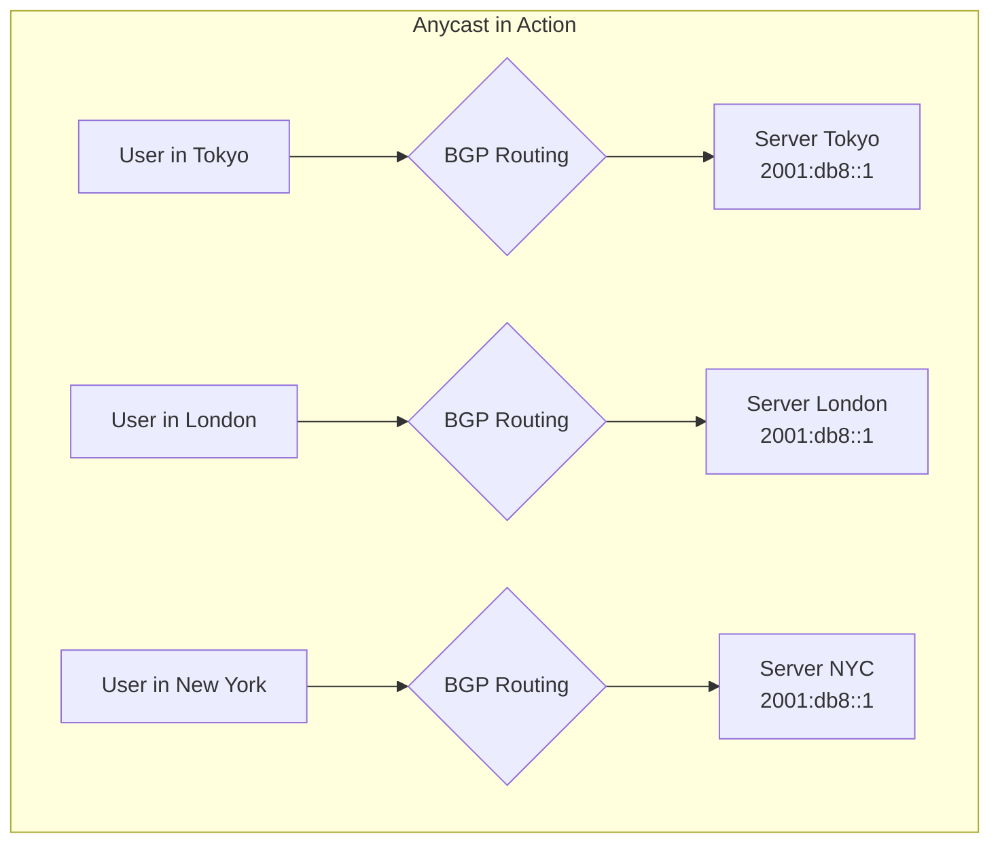
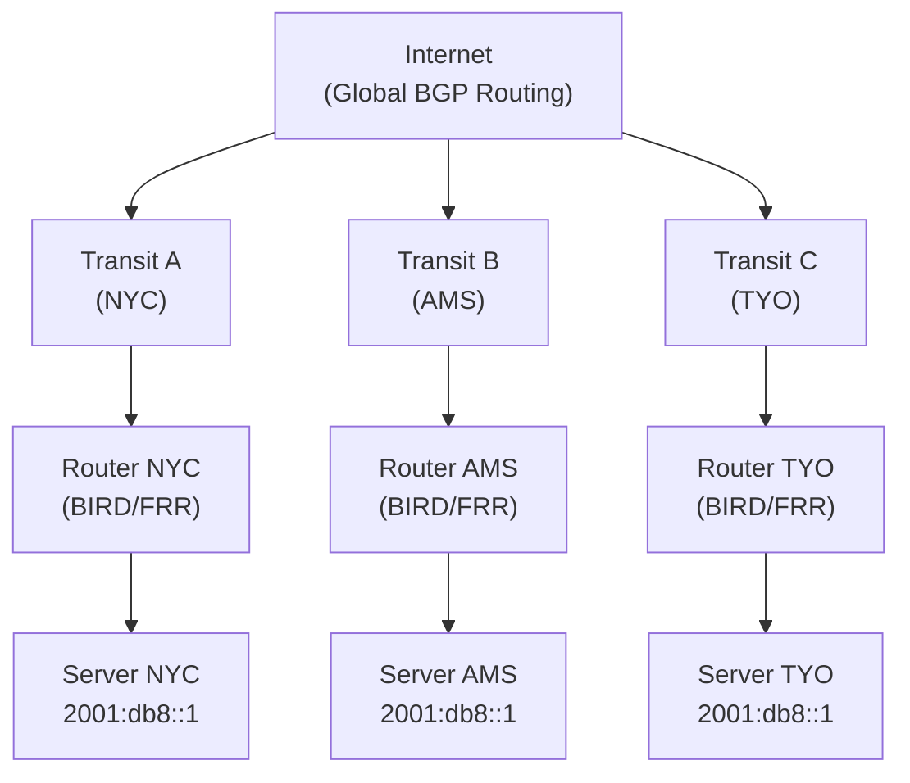
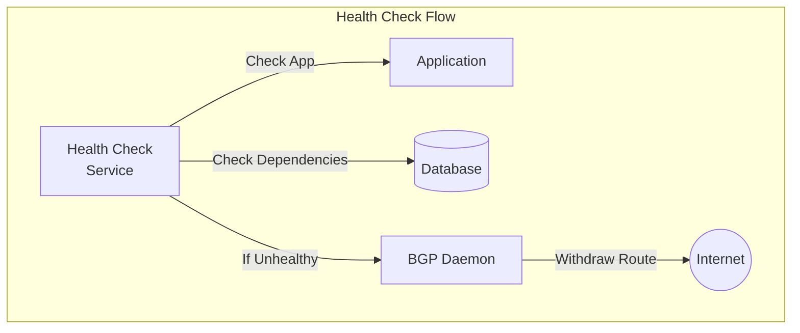

# How to Implement IPv6 Anycast for Global Load Distribution

Author: [nawazdhandala](https://github.com/nawazdhandala)

Tags: IPv6, Anycast, Load Balancing, Networking, Infrastructure, DevOps

Description: A comprehensive guide to implementing IPv6 anycast for distributing traffic globally, reducing latency, and building resilient infrastructure that routes users to the nearest healthy server automatically.

---

When Cloudflare, Google, or major CDNs serve your requests in milliseconds regardless of your location, there's a good chance anycast is doing the heavy lifting. Anycast allows multiple servers across the globe to share a single IP address, with BGP routing directing users to the nearest instance automatically. Combined with IPv6's massive address space, anycast becomes a powerful tool for global load distribution.

This guide covers everything you need to implement IPv6 anycast - from understanding the fundamentals to production configurations.

---

## Understanding Anycast

Before diving into implementation, let's understand what makes anycast different from traditional routing approaches.

### Unicast vs. Anycast vs. Multicast

```
Unicast:    One source -> One destination
            Client connects to a specific server IP

Multicast:  One source -> Many destinations
            Server sends to all subscribed clients simultaneously

Anycast:    Many sources -> One "virtual" destination
            Multiple servers share the same IP, nearest one responds
```

### How Anycast Works



All three servers share the IP address `2001:db8::1`. BGP routing tables naturally direct each user to the closest server based on network topology. No special client configuration required - it just works.

### Why IPv6 for Anycast?

IPv6 offers several advantages for anycast deployments:

**1. Abundant Address Space**
- IPv6 provides 2^128 addresses versus IPv4's 2^32
- Easier to obtain dedicated anycast prefixes from RIRs
- No NAT complications

**2. Simplified Headers**
- IPv6 has a streamlined header format
- Faster routing decisions at network edges
- Better performance for high-throughput scenarios

**3. Native Support for Global Routing**
- IPv6 was designed with global routing in mind
- Cleaner aggregation possibilities
- Better support in modern BGP implementations

**4. Future-Proofing**
- IPv4 exhaustion is real
- Major networks are IPv6-native or dual-stack
- Cloud providers offer robust IPv6 support

---

## Prerequisites for IPv6 Anycast

### What You Need

Before implementing anycast, ensure you have:

1. **IPv6 Address Space**
   - Obtain a /48 or larger from your RIR (ARIN, RIPE, APNIC, etc.)
   - Or use provider-allocated space with proper authorization
   - Minimum /48 for global announcements (some networks filter smaller prefixes)

2. **Autonomous System Number (ASN)**
   - Required for BGP peering
   - Can be 16-bit (legacy) or 32-bit ASN
   - Obtain from your RIR

3. **BGP-Capable Routers**
   - Physical routers (Juniper, Cisco, Arista) or
   - Software routers (BIRD, FRRouting, OpenBGPd) or
   - Cloud provider BGP services (AWS, GCP, Azure)

4. **Multiple Points of Presence (PoPs)**
   - At least 2-3 geographic locations
   - More PoPs = better coverage and resilience

5. **Transit Providers or Peering**
   - Upstream connectivity at each PoP
   - Ideally multiple upstream providers per location

### Network Topology Example



---

## Step 1: Obtaining IPv6 Address Space

### From a Regional Internet Registry (RIR)

Each RIR has specific requirements:

**ARIN (North America)**
```
Minimum allocation: /48 for end-users, /32 for ISPs
Requirements:
  - Demonstrate immediate need
  - Network plan showing utilization
  - Membership or sponsorship
Cost: ~$250-500/year for small allocations
```

**RIPE NCC (Europe, Middle East, Central Asia)**
```
Minimum allocation: /29 for LIRs
Requirements:
  - LIR membership required
  - Submit allocation request via portal
Cost: ~EUR 1,400/year membership
```

**APNIC (Asia Pacific)**
```
Minimum allocation: /48 for end-users
Requirements:
  - Membership or sponsorship
  - Justify address need
Cost: Varies by membership tier
```

### From Your ISP or Cloud Provider

Many providers offer IPv6 blocks that can be used for anycast:

**AWS BYOIP (Bring Your Own IP)**
```bash
# Register your IPv6 prefix with AWS
aws ec2 provision-byoip-cidr \
    --cidr "2001:db8:1234::/48" \
    --cidr-authorization-context Message="...",Signature="..."
```

**GCP BYOIP**
```bash
# Create a public delegated prefix
gcloud compute public-delegated-prefixes create my-prefix \
    --public-advertised-prefix=my-pap \
    --range="2001:db8:1234::/48" \
    --region=us-east1
```

### Recommended Prefix Sizes

| Use Case | Minimum Prefix | Notes |
|----------|----------------|-------|
| Single service anycast | /48 | Widely accepted globally |
| Multi-service anycast | /44 - /40 | More flexibility |
| CDN/Large scale | /32 or larger | Better aggregation |

---

## Step 2: Setting Up BGP Routers

### Option A: BIRD Internet Routing Daemon

BIRD is lightweight, powerful, and widely used for anycast deployments.

**Install BIRD on Ubuntu/Debian**
```bash
sudo apt update
sudo apt install bird2
```

**Basic BIRD Configuration for IPv6 Anycast**

Create `/etc/bird/bird.conf`:

```conf
# BIRD 2.x configuration for IPv6 anycast

log syslog all;
log "/var/log/bird.log" { debug, trace, info, remote, warning, error, auth, fatal, bug };

router id 192.0.2.1;  # Use your IPv4 router ID

# Define the anycast prefix
define ANYCAST_PREFIX = 2001:db8:abcd::/48;
define MY_ASN = 65000;
define UPSTREAM_ASN = 65001;

# Protocol for getting routes into kernel
protocol kernel {
    ipv6 {
        export all;
        import none;
    };
    scan time 10;
}

# Device protocol - required for interface awareness
protocol device {
    scan time 10;
}

# Direct protocol - for directly connected networks
protocol direct {
    ipv6;
    interface "lo";  # Anycast address on loopback
}

# Static route for the anycast prefix
protocol static anycast_route {
    ipv6;
    route 2001:db8:abcd::/48 blackhole;
}

# Filter for announcing our prefix
filter export_anycast {
    if net = ANYCAST_PREFIX then accept;
    reject;
}

# Filter for accepting upstream routes
filter import_upstream {
    # Accept default route and major prefixes
    if net = ::/0 then accept;
    # Optionally accept specific prefixes for traffic engineering
    reject;
}

# BGP session to upstream provider
protocol bgp upstream1 {
    description "Transit Provider 1";
    local as MY_ASN;
    neighbor 2001:db8:ffff::1 as UPSTREAM_ASN;

    ipv6 {
        import filter import_upstream;
        export filter export_anycast;
        next hop self;
    };

    # BGP timers
    hold time 90;
    keepalive time 30;

    # Graceful restart for hitless updates
    graceful restart on;
}

# Optional: Second upstream for redundancy
protocol bgp upstream2 {
    description "Transit Provider 2";
    local as MY_ASN;
    neighbor 2001:db8:fffe::1 as 65002;

    ipv6 {
        import filter import_upstream;
        export filter export_anycast;
        next hop self;
    };

    hold time 90;
    keepalive time 30;
    graceful restart on;
}
```

**Configure the Anycast Address on Loopback**

```bash
# Add anycast address to loopback interface
sudo ip -6 addr add 2001:db8:abcd::1/128 dev lo

# Make it permanent in /etc/network/interfaces
# or use netplan on Ubuntu 18.04+
```

Netplan configuration (`/etc/netplan/99-anycast.yaml`):

```yaml
network:
  version: 2
  ethernets:
    lo:
      addresses:
        - "2001:db8:abcd::1/128"
```

**Start and Verify BIRD**

```bash
# Check configuration syntax
sudo bird -p

# Start BIRD
sudo systemctl enable bird
sudo systemctl start bird

# Check BGP session status
sudo birdc show protocols all upstream1
sudo birdc show route export upstream1
```

### Option B: FRRouting (FRR)

FRR is the successor to Quagga, offering comprehensive routing protocol support.

**Install FRR**

```bash
# Add FRR repository
curl -s https://deb.frrouting.org/frr/keys.asc | sudo apt-key add -
echo "deb https://deb.frrouting.org/frr $(lsb_release -s -c) frr-stable" | \
    sudo tee /etc/apt/sources.list.d/frr.list

sudo apt update
sudo apt install frr frr-pythontools
```

**Enable BGP Daemon**

Edit `/etc/frr/daemons`:

```
bgpd=yes
zebra=yes
```

**Configure FRR for IPv6 Anycast**

Edit `/etc/frr/frr.conf`:

```conf
! FRRouting configuration for IPv6 anycast
frr version 8.4
frr defaults traditional
hostname anycast-nyc
log syslog informational
service integrated-vtysh-config

! Interface configuration
interface lo
  ipv6 address 2001:db8:abcd::1/128
exit

! BGP configuration
router bgp 65000
  bgp router-id 192.0.2.1
  no bgp default ipv4-unicast

  ! Neighbor definitions
  neighbor 2001:db8:ffff::1 remote-as 65001
  neighbor 2001:db8:ffff::1 description Transit-Provider-1
  neighbor 2001:db8:fffe::1 remote-as 65002
  neighbor 2001:db8:fffe::1 description Transit-Provider-2

  ! IPv6 address family
  address-family ipv6 unicast
    network 2001:db8:abcd::/48

    ! Neighbor activation
    neighbor 2001:db8:ffff::1 activate
    neighbor 2001:db8:ffff::1 soft-reconfiguration inbound
    neighbor 2001:db8:fffe::1 activate
    neighbor 2001:db8:fffe::1 soft-reconfiguration inbound

    ! Route-map for outbound announcements
    neighbor 2001:db8:ffff::1 route-map ANYCAST-OUT out
    neighbor 2001:db8:fffe::1 route-map ANYCAST-OUT out
  exit-address-family
exit

! Prefix list for our anycast prefix
ipv6 prefix-list ANYCAST-PREFIX seq 10 permit 2001:db8:abcd::/48

! Route-map for announcements
route-map ANYCAST-OUT permit 10
  match ipv6 address prefix-list ANYCAST-PREFIX
exit

! Blackhole route to originate the prefix
ipv6 route 2001:db8:abcd::/48 blackhole
```

**Start and Verify FRR**

```bash
# Start FRR
sudo systemctl enable frr
sudo systemctl start frr

# Enter FRR shell
sudo vtysh

# Check BGP status
show bgp ipv6 unicast summary
show bgp ipv6 unicast neighbors
show bgp ipv6 unicast advertised-routes neighbor 2001:db8:ffff::1
```

---

## Step 3: Health Checks and Automatic Failover

The beauty of anycast is automatic failover - when a server becomes unhealthy, BGP withdraws the route and traffic shifts to other locations. But you need health checks to trigger this.

### Health Check Architecture



### Implementing Health Checks with ExaBGP

ExaBGP is excellent for programmatic BGP control based on application health.

**Install ExaBGP**

```bash
pip3 install exabgp
```

**ExaBGP Configuration** (`/etc/exabgp/exabgp.conf`):

```conf
process health-check {
    run /etc/exabgp/healthcheck.py;
    encoder json;
}

neighbor 127.0.0.1 {
    router-id 192.0.2.1;
    local-address 127.0.0.1;
    local-as 65000;
    peer-as 65000;

    api {
        processes [ health-check ];
    }
}
```

**Health Check Script** (`/etc/exabgp/healthcheck.py`):

```python
#!/usr/bin/env python3
"""
Health check script for ExaBGP anycast announcements.
Announces route when healthy, withdraws when unhealthy.
"""

import sys
import time
import urllib.request
import json
from datetime import datetime

# Configuration
ANYCAST_PREFIX = "2001:db8:abcd::/48"
HEALTH_CHECK_URL = "http://localhost:8080/health"
CHECK_INTERVAL = 5  # seconds
FAILURE_THRESHOLD = 3  # consecutive failures before withdrawal
RECOVERY_THRESHOLD = 2  # consecutive successes before announcement

# State
current_failures = 0
current_successes = 0
route_announced = False


def log(message):
    """Log to stderr (ExaBGP captures stdout for commands)"""
    timestamp = datetime.now().isoformat()
    print(f"{timestamp} - {message}", file=sys.stderr)
    sys.stderr.flush()


def announce_route():
    """Announce the anycast route via ExaBGP"""
    global route_announced
    if not route_announced:
        command = f"announce route {ANYCAST_PREFIX} next-hop self"
        print(command)
        sys.stdout.flush()
        route_announced = True
        log(f"ANNOUNCED: {ANYCAST_PREFIX}")


def withdraw_route():
    """Withdraw the anycast route via ExaBGP"""
    global route_announced
    if route_announced:
        command = f"withdraw route {ANYCAST_PREFIX} next-hop self"
        print(command)
        sys.stdout.flush()
        route_announced = False
        log(f"WITHDRAWN: {ANYCAST_PREFIX}")


def check_health():
    """Perform health check against local application"""
    try:
        req = urllib.request.Request(
            HEALTH_CHECK_URL,
            headers={'User-Agent': 'anycast-healthcheck/1.0'}
        )
        with urllib.request.urlopen(req, timeout=3) as response:
            if response.status == 200:
                data = json.loads(response.read().decode())
                # Check that all components are healthy
                if data.get('status') == 'healthy':
                    return True
    except Exception as e:
        log(f"Health check failed: {e}")
    return False


def main():
    global current_failures, current_successes

    log("Starting anycast health check daemon")

    # Initial announcement (optimistic start)
    announce_route()

    while True:
        is_healthy = check_health()

        if is_healthy:
            current_successes += 1
            current_failures = 0

            if current_successes >= RECOVERY_THRESHOLD and not route_announced:
                log(f"Health restored after {RECOVERY_THRESHOLD} checks")
                announce_route()
        else:
            current_failures += 1
            current_successes = 0

            if current_failures >= FAILURE_THRESHOLD and route_announced:
                log(f"Health failed after {FAILURE_THRESHOLD} checks")
                withdraw_route()

        time.sleep(CHECK_INTERVAL)


if __name__ == "__main__":
    main()
```

### Health Check with BIRD and BFD

BIRD supports BFD (Bidirectional Forwarding Detection) for fast failover.

```conf
# Add to BIRD configuration

protocol bfd {
    interface "*" {
        min rx interval 100 ms;
        min tx interval 100 ms;
        idle tx interval 1 s;
        multiplier 3;
    };
}

# Modify BGP session to use BFD
protocol bgp upstream1 {
    # ... existing config ...
    bfd on;
}
```

### Application-Level Health Endpoint

Your application should expose a comprehensive health endpoint:

```python
# FastAPI health check endpoint example
from fastapi import FastAPI, Response
import asyncpg
import aioredis

app = FastAPI()

@app.get("/health")
async def health_check():
    """
    Comprehensive health check for anycast routing decisions.
    Returns 200 only if all critical components are healthy.
    """
    checks = {
        "database": await check_database(),
        "cache": await check_cache(),
        "disk": check_disk_space(),
        "memory": check_memory(),
    }

    all_healthy = all(checks.values())

    response_data = {
        "status": "healthy" if all_healthy else "unhealthy",
        "checks": checks,
        "timestamp": datetime.utcnow().isoformat(),
    }

    status_code = 200 if all_healthy else 503
    return Response(
        content=json.dumps(response_data),
        status_code=status_code,
        media_type="application/json"
    )


async def check_database():
    try:
        conn = await asyncpg.connect(DATABASE_URL, timeout=2)
        await conn.fetchval("SELECT 1")
        await conn.close()
        return True
    except Exception:
        return False


async def check_cache():
    try:
        redis = await aioredis.from_url(REDIS_URL, socket_timeout=2)
        await redis.ping()
        await redis.close()
        return True
    except Exception:
        return False


def check_disk_space():
    """Ensure at least 10% disk space available"""
    import shutil
    total, used, free = shutil.disk_usage("/")
    return (free / total) > 0.10


def check_memory():
    """Ensure at least 10% memory available"""
    import psutil
    mem = psutil.virtual_memory()
    return mem.available / mem.total > 0.10
```

---

## Step 4: Traffic Engineering with BGP Communities

BGP communities allow fine-grained control over how your anycast routes propagate.

### Common Community Use Cases

| Community | Purpose |
|-----------|---------|
| NO_EXPORT | Don't advertise beyond immediate peers |
| NO_ADVERTISE | Don't advertise to any peers |
| Local preference | Influence inbound traffic patterns |
| AS prepending | Make path less attractive |

### BIRD Community Configuration

```conf
# Define community values
define COMMUNITY_NO_EXPORT = (65535, 65281);
define COMMUNITY_PREPEND_1 = (65000, 1001);
define COMMUNITY_PREPEND_2 = (65000, 1002);
define COMMUNITY_BLACKHOLE = (65000, 666);

# Filter with communities for traffic engineering
filter export_anycast_engineered {
    if net = ANYCAST_PREFIX then {
        # Add informational community
        bgp_community.add((MY_ASN, 100));

        # For this specific upstream, prepend once to deprioritize
        if proto = "upstream2" then {
            bgp_path.prepend(MY_ASN);
        }

        accept;
    }
    reject;
}

# Filter to handle incoming community-based actions
filter import_with_communities {
    # Honor blackhole community
    if (COMMUNITY_BLACKHOLE ~ bgp_community) then {
        dest = RTD_BLACKHOLE;
        accept;
    }
    accept;
}
```

### FRR Community Configuration

```conf
! BGP community list
bgp community-list standard NO-EXPORT permit no-export
bgp community-list standard PREPEND-1 permit 65000:1001
bgp community-list standard PREPEND-2 permit 65000:1002

! Route-map with community actions
route-map ANYCAST-OUT permit 10
  match ipv6 address prefix-list ANYCAST-PREFIX
  set community 65000:100 additive
exit

route-map ANYCAST-OUT-PREPEND permit 10
  match ipv6 address prefix-list ANYCAST-PREFIX
  set as-path prepend 65000
  set community 65000:100 additive
exit

! Apply different route-maps to different upstreams
router bgp 65000
  address-family ipv6 unicast
    neighbor 2001:db8:ffff::1 route-map ANYCAST-OUT out
    neighbor 2001:db8:fffe::1 route-map ANYCAST-OUT-PREPEND out
  exit-address-family
exit
```

---

## Step 5: DNS Configuration for Anycast

For services that need hostname resolution, configure DNS records pointing to your anycast address.

### AAAA Records

```zone
; Zone file for example.com
$TTL 300

; Anycast service endpoint
api.example.com.     IN    AAAA    2001:db8:abcd::1
cdn.example.com.     IN    AAAA    2001:db8:abcd::2
```

### Low TTL Considerations

For anycast services, lower TTLs can help during failover:

| TTL | Use Case | Trade-offs |
|-----|----------|------------|
| 30-60s | Critical services, fast failover | Higher DNS query load |
| 300s | Standard services | Good balance |
| 3600s | Stable services | Lower DNS load, slower failover |

### Dual-Stack Considerations

Provide both IPv4 and IPv6 for maximum compatibility:

```zone
api.example.com.     IN    A       203.0.113.1
api.example.com.     IN    AAAA    2001:db8:abcd::1
```

---

## Step 6: Monitoring and Observability

### BGP Session Monitoring

**Prometheus metrics with bird_exporter:**

```bash
# Install bird_exporter
go install github.com/czerwonk/bird_exporter@latest

# Run exporter
bird_exporter -bird.v2 -bird.socket /run/bird/bird.ctl
```

**Prometheus scrape configuration:**

```yaml
scrape_configs:
  - job_name: 'bird'
    static_configs:
      - targets:
        - 'anycast-nyc:9324'
        - 'anycast-ams:9324'
        - 'anycast-tyo:9324'
```

**Key metrics to monitor:**

```promql
# BGP session state (1 = established)
bird_protocol_up{proto="bgp"}

# Received prefixes
bird_protocol_prefix_import_count{proto="bgp"}

# Exported prefixes (should be your anycast prefix)
bird_protocol_prefix_export_count{proto="bgp"}

# BGP state changes (alerts on instability)
rate(bird_protocol_state_changes_total[5m])
```

### Alerting Rules

```yaml
groups:
  - name: anycast
    rules:
      - alert: BGPSessionDown
        expr: bird_protocol_up{proto="bgp"} == 0
        for: 1m
        labels:
          severity: critical
        annotations:
          summary: "BGP session down on {{ $labels.instance }}"
          description: "BGP session {{ $labels.name }} has been down for 1 minute"

      - alert: NoRoutesExported
        expr: bird_protocol_prefix_export_count{proto="bgp"} == 0
        for: 2m
        labels:
          severity: critical
        annotations:
          summary: "No routes exported on {{ $labels.instance }}"
          description: "No anycast routes being exported - traffic will fail"

      - alert: BGPFlapping
        expr: rate(bird_protocol_state_changes_total{proto="bgp"}[5m]) > 0.1
        for: 5m
        labels:
          severity: warning
        annotations:
          summary: "BGP session flapping on {{ $labels.instance }}"
```

### Latency Monitoring

Monitor user-perceived latency from multiple vantage points:

```python
#!/usr/bin/env python3
"""
Monitor anycast latency from multiple probe locations.
"""

import subprocess
import time
import json
from prometheus_client import Gauge, start_http_server

ANYCAST_TARGET = "2001:db8:abcd::1"
PROBE_INTERVAL = 30

latency_gauge = Gauge(
    'anycast_latency_ms',
    'Latency to anycast address in milliseconds',
    ['target', 'probe_location']
)

def measure_latency(target):
    """Measure RTT to target using ping6"""
    try:
        result = subprocess.run(
            ['ping6', '-c', '3', '-q', target],
            capture_output=True,
            text=True,
            timeout=10
        )
        # Parse avg latency from ping output
        for line in result.stdout.split('\n'):
            if 'avg' in line:
                # Format: rtt min/avg/max/mdev = 1.234/2.345/3.456/0.123 ms
                avg = float(line.split('/')[4])
                return avg
    except Exception as e:
        print(f"Latency measurement failed: {e}")
    return None

def main():
    start_http_server(9100)

    while True:
        latency = measure_latency(ANYCAST_TARGET)
        if latency is not None:
            latency_gauge.labels(
                target=ANYCAST_TARGET,
                probe_location='local'
            ).set(latency)
        time.sleep(PROBE_INTERVAL)

if __name__ == "__main__":
    main()
```

### Looking Glass and Route Visibility

Verify your anycast routes are visible globally:

```bash
# Check route propagation using public looking glasses

# RIPE RIS
curl -s "https://stat.ripe.net/data/looking-glass/data.json?resource=2001:db8:abcd::/48" | jq

# Hurricane Electric BGP Toolkit
# Visit: https://bgp.he.net/net/2001:db8:abcd::/48

# BGPStream for historical data
bgpstream -w 1609459200,1609545600 -p 2001:db8:abcd::/48
```

---

## Step 7: Security Considerations

### Protecting Against BGP Hijacking

**RPKI (Resource Public Key Infrastructure)**

Create ROA (Route Origin Authorization) records:

```bash
# Example ROA creation via RIR portal
# Prefix: 2001:db8:abcd::/48
# Origin ASN: AS65000
# Max Length: /48
```

**Verify RPKI with routinator:**

```bash
# Install routinator
apt install routinator

# Check ROA validity
routinator vrps --filter-prefix 2001:db8:abcd::/48
```

**BIRD RPKI Configuration:**

```conf
# RPKI validator connection
roa6 table rpki_roa6;

protocol rpki rpki_validator {
    roa6 { table rpki_roa6; };
    remote "rpki-validator.example.com" port 8323;
    retry keep 90;
    refresh keep 900;
    expire keep 172800;
}

# Filter using RPKI
filter import_rpki_checked {
    if (roa_check(rpki_roa6, net, bgp_path.last) = ROA_INVALID) then {
        print "Rejecting RPKI invalid route: ", net;
        reject;
    }
    accept;
}
```

### DDoS Mitigation

Anycast inherently provides DDoS resilience by distributing attack traffic:

```
Attack traffic distributed:
  Location A: 33% of attack
  Location B: 33% of attack
  Location C: 33% of attack
```

**Additional protections:**

1. **Rate limiting per source prefix:**
   ```bash
   # Linux nftables rate limiting
   nft add rule inet filter input \
       ip6 saddr 2001:db8::/32 \
       limit rate 1000/second accept
   ```

2. **Flowspec for surgical filtering:**
   ```conf
   # BIRD flowspec configuration
   flow6 table flowtab;

   protocol static flowspec_rules {
       flow6 { table flowtab; };
       # Block UDP amplification to DNS port from specific source
       route flow6 {
           dst 2001:db8:abcd::1/128;
           proto 17;
           dport 53;
           sport 0..1023;
       } { drop; };
   }
   ```

3. **Remote triggered blackhole (RTBH):**
   ```conf
   # Announce with blackhole community to drop traffic
   protocol static blackhole {
       ipv6;
       route 2001:db8:bad::/128 blackhole {
           bgp_community.add((65535, 666));
       };
   }
   ```

---

## Step 8: Cloud Provider Implementations

### AWS Global Accelerator with IPv6

```bash
# Create Global Accelerator with IPv6
aws globalaccelerator create-accelerator \
    --name my-anycast-accelerator \
    --ip-address-type DUAL_STACK \
    --enabled

# Add listener
aws globalaccelerator create-listener \
    --accelerator-arn arn:aws:globalaccelerator::123456789012:accelerator/abc123 \
    --port-ranges FromPort=443,ToPort=443 \
    --protocol TCP

# Add endpoint group
aws globalaccelerator create-endpoint-group \
    --listener-arn arn:aws:globalaccelerator::123456789012:accelerator/abc123/listener/def456 \
    --endpoint-group-region us-east-1 \
    --endpoint-configurations EndpointId=arn:aws:elasticloadbalancing:us-east-1:123456789012:loadbalancer/app/my-alb/abc123,Weight=100
```

### GCP Anycast with Cloud Load Balancing

```bash
# Reserve global IPv6 address
gcloud compute addresses create anycast-ipv6 \
    --ip-version=IPV6 \
    --global

# Create health check
gcloud compute health-checks create http anycast-health \
    --port=8080 \
    --request-path=/health

# Create backend service
gcloud compute backend-services create anycast-backend \
    --protocol=HTTP \
    --health-checks=anycast-health \
    --global

# Add backends in multiple regions
gcloud compute backend-services add-backend anycast-backend \
    --instance-group=ig-us-east1 \
    --instance-group-region=us-east1 \
    --global

gcloud compute backend-services add-backend anycast-backend \
    --instance-group=ig-europe-west1 \
    --instance-group-region=europe-west1 \
    --global

# Create URL map and target proxy
gcloud compute url-maps create anycast-urlmap \
    --default-service=anycast-backend

gcloud compute target-http-proxies create anycast-proxy \
    --url-map=anycast-urlmap

# Create forwarding rule with anycast IP
gcloud compute forwarding-rules create anycast-rule \
    --address=anycast-ipv6 \
    --ip-protocol=TCP \
    --ports=80 \
    --target-http-proxy=anycast-proxy \
    --global
```

### Azure Front Door with IPv6

```bash
# Create Front Door profile
az afd profile create \
    --profile-name my-anycast-profile \
    --resource-group my-rg \
    --sku Standard_AzureFrontDoor

# Add endpoint
az afd endpoint create \
    --endpoint-name my-endpoint \
    --profile-name my-anycast-profile \
    --resource-group my-rg

# Create origin group with health probes
az afd origin-group create \
    --origin-group-name my-origins \
    --profile-name my-anycast-profile \
    --resource-group my-rg \
    --probe-request-type GET \
    --probe-protocol Https \
    --probe-path /health \
    --probe-interval-in-seconds 30

# Add origins in multiple regions
az afd origin create \
    --origin-name origin-eastus \
    --origin-group-name my-origins \
    --profile-name my-anycast-profile \
    --resource-group my-rg \
    --host-name eastus.example.com \
    --origin-host-header eastus.example.com \
    --priority 1 \
    --weight 100

az afd origin create \
    --origin-name origin-westeurope \
    --origin-group-name my-origins \
    --profile-name my-anycast-profile \
    --resource-group my-rg \
    --host-name westeurope.example.com \
    --origin-host-header westeurope.example.com \
    --priority 1 \
    --weight 100
```

---

## Best Practices Summary

### Do's

1. **Start with health checks** - Never announce routes for unhealthy servers
2. **Use RPKI** - Protect against route hijacking
3. **Monitor BGP sessions** - Alert on state changes and instability
4. **Test failover regularly** - Simulate failures in each location
5. **Document your network** - Topology, ASN relationships, communities
6. **Use multiple upstreams** - Redundancy at every PoP
7. **Implement graceful restart** - Minimize disruption during maintenance
8. **Keep prefix lengths reasonable** - /48 minimum for global visibility

### Don'ts

1. **Don't announce without health checks** - Leads to black holes
2. **Don't use anycast for stateful protocols carelessly** - TCP sessions can break
3. **Don't ignore RPKI invalid routes** - Filter them out
4. **Don't forget about IPv4** - Dual-stack is still necessary
5. **Don't set TTLs too high** - Slows failover
6. **Don't skip BFD** - Faster failure detection matters
7. **Don't forget egress filtering** - Prevent spoofing from your network
8. **Don't announce more-specifics** - May get filtered, breaks aggregation

---

## Comparison Table: IPv6 Anycast Implementation Options

| Feature | Self-Hosted (BIRD/FRR) | AWS Global Accelerator | GCP Cloud LB | Azure Front Door |
|---------|------------------------|------------------------|--------------|------------------|
| **Setup Complexity** | High | Low | Low | Low |
| **Cost** | Transit costs only | Per-hour + data | Per-hour + data | Per-request + data |
| **Control** | Full | Limited | Limited | Limited |
| **IPv6 Support** | Native | Dual-stack | Native | Native |
| **Health Checks** | Custom | Built-in | Built-in | Built-in |
| **BGP Control** | Full | None | None | None |
| **Failover Speed** | Depends on BFD/timers | ~30 seconds | ~30 seconds | ~30 seconds |
| **Global PoPs** | You provide | AWS edge locations | Google edge | Microsoft edge |
| **DDoS Protection** | DIY | Shield included | Cloud Armor available | DDoS Standard |
| **Best For** | ISPs, large deployments | AWS-native workloads | GCP-native workloads | Azure-native workloads |

---

## Troubleshooting Common Issues

### Route Not Propagating Globally

```bash
# Check if route is being announced
birdc show route export upstream1

# Check if prefix is too small (may be filtered)
# Minimum /48 for IPv6 global announcements

# Verify RPKI ROA exists and is valid
rpki-client -v 2001:db8:abcd::/48
```

### BGP Session Not Establishing

```bash
# Check BGP state
birdc show protocols upstream1

# Common issues:
# - Wrong neighbor IP
# - Wrong ASN configuration
# - Firewall blocking TCP port 179
# - MD5 password mismatch

# Check connectivity to neighbor
ping6 2001:db8:ffff::1

# Check if BGP port is reachable
nc -6 -zv 2001:db8:ffff::1 179
```

### Traffic Not Reaching Nearest Server

```bash
# Traceroute to anycast address from different locations
mtr -6 2001:db8:abcd::1

# Check BGP AS path from different vantage points
# Use looking glass tools

# May indicate:
# - Upstream not honoring your announcements
# - AS path too long from some perspectives
# - Communities not applied correctly
```

### Session Flapping

```bash
# Check logs for flap reasons
journalctl -u bird | grep -i "protocol.*down\|protocol.*up"

# Common causes:
# - MTU issues (especially with tunnels)
# - Intermittent connectivity
# - Hold timer too aggressive
# - Link errors

# Increase hold time for stability
# hold time 180;  # 3 minutes instead of 90 seconds
```

---

## Conclusion

IPv6 anycast is a powerful technique for global load distribution that provides:

- **Automatic failover** through BGP route withdrawal
- **Geographic load balancing** by routing to nearest PoP
- **DDoS resilience** by distributing attack traffic
- **Simplified client configuration** with a single IP address

The implementation requires careful planning - obtaining address space, setting up BGP routers, implementing health checks, and monitoring - but the result is a robust, scalable infrastructure that automatically handles failures and routes users to optimal locations.

Start small with two or three locations, get your BGP and health checks working correctly, then expand. The internet's routing system will do the rest.

---

## Additional Resources

- **RIPE NCC IPv6 Info Center** - https://www.ripe.net/ipv6
- **BIRD User Guide** - https://bird.network.cz/doc/
- **FRRouting Documentation** - https://docs.frrouting.org/
- **RPKI Documentation** - https://rpki.readthedocs.io/
- **BGP Best Current Practices** - RFC 7454
- **IPv6 Address Planning** - RFC 6177
