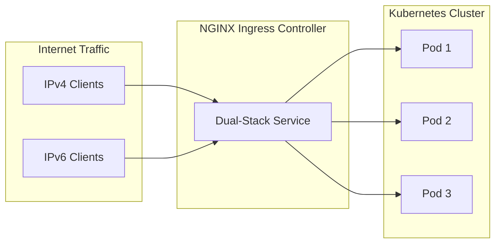

# How to Configure IPv6 Ingress with NGINX Ingress Controller

Author: [nawazdhandala](https://github.com/nawazdhandala)

Tags: IPv6, Kubernetes, NGINX, Ingress, Networking, DevOps

Description: A comprehensive guide to configuring IPv6 support in NGINX Ingress Controller for Kubernetes, including dual-stack networking, load balancer setup, and production best practices.

---

IPv4 address exhaustion is real. With over 340 undecillion IPv6 addresses available, transitioning to IPv6 is no longer optional - it's inevitable. If you're running Kubernetes in production, your ingress controller needs to handle IPv6 traffic. This guide walks through configuring NGINX Ingress Controller for IPv6, covering everything from basic setup to production-ready dual-stack configurations.

## Why IPv6 for Kubernetes Ingress?



### Benefits of IPv6 in Kubernetes

- **Future-proofing**: IPv4 addresses are exhausted; IPv6 is the path forward
- **End-to-end connectivity**: No NAT required, simplifying network architecture
- **Larger address space**: Every pod can have a globally routable address
- **Improved performance**: Modern networks optimize for IPv6
- **Compliance**: Some industries and governments require IPv6 support

### Prerequisites

Before configuring IPv6, ensure your environment supports it:

```bash
# Check if your cluster supports dual-stack
kubectl get nodes -o jsonpath='{.items[*].status.addresses}' | jq .

# Verify Kubernetes version (1.23+ recommended for stable dual-stack)
kubectl version --short

# Check if your CNI supports IPv6
kubectl get pods -n kube-system -l k8s-app=calico-node -o wide
```

**Supported CNIs for IPv6:**
- **Calico** - Full dual-stack support
- **Cilium** - Native IPv6 with eBPF
- **Flannel** - IPv6 support with proper configuration
- **Weave Net** - Dual-stack capable

## Understanding Dual-Stack Networking

Kubernetes supports three IP family modes:

| Mode | Description | Use Case |
|------|-------------|----------|
| `IPv4` | IPv4 only | Legacy systems, limited IPv6 infrastructure |
| `IPv6` | IPv6 only | Modern IPv6-native environments |
| `dual-stack` | Both IPv4 and IPv6 | Transition period, maximum compatibility |

### Cluster Configuration for Dual-Stack

Your cluster must be configured for dual-stack at the API server level:

```yaml
# kube-apiserver configuration
apiVersion: v1
kind: Pod
metadata:
  name: kube-apiserver
  namespace: kube-system
spec:
  containers:
    - name: kube-apiserver
      command:
        - kube-apiserver
        # Enable dual-stack feature gate (default in 1.23+)
        - --feature-gates=IPv6DualStack=true
        # Define service CIDR for both families
        - --service-cluster-ip-range=10.96.0.0/12,fd00:10:96::/112
```

```yaml
# kube-controller-manager configuration
apiVersion: v1
kind: Pod
metadata:
  name: kube-controller-manager
  namespace: kube-system
spec:
  containers:
    - name: kube-controller-manager
      command:
        - kube-controller-manager
        - --feature-gates=IPv6DualStack=true
        - --service-cluster-ip-range=10.96.0.0/12,fd00:10:96::/112
        # Node CIDR allocation for pods
        - --cluster-cidr=10.244.0.0/16,fd00:10:244::/56
        - --node-cidr-mask-size-ipv4=24
        - --node-cidr-mask-size-ipv6=64
```

## Installing NGINX Ingress Controller with IPv6 Support

### Option 1: Helm Installation (Recommended)

```bash
# Add the ingress-nginx repository
helm repo add ingress-nginx https://kubernetes.github.io/ingress-nginx
helm repo update

# Create namespace
kubectl create namespace ingress-nginx
```

Create a values file for IPv6 configuration:

```yaml
# nginx-ingress-values.yaml
# NGINX Ingress Controller with dual-stack IPv6 support

controller:
  # Enable IPv6 in the controller
  config:
    # Enable IPv6 listening
    use-forwarded-headers: "true"
    # Real IP handling for IPv6
    compute-full-forwarded-for: "true"
    # Proxy protocol for preserving client IPs
    use-proxy-protocol: "false"
    # Enable IPv6 resolver
    enable-real-ip: "true"
    # Log format with IPv6 support
    log-format-upstream: >-
      $remote_addr - $remote_user [$time_local] "$request"
      $status $body_bytes_sent "$http_referer"
      "$http_user_agent" $request_length $request_time
      [$proxy_upstream_name] [$proxy_alternative_upstream_name]
      $upstream_addr $upstream_response_length
      $upstream_response_time $upstream_status $req_id

  # Service configuration for dual-stack
  service:
    # Enable dual-stack service
    ipFamilyPolicy: PreferDualStack
    # Specify IP families (order matters - first is primary)
    ipFamilies:
      - IPv4
      - IPv6
    # External traffic policy
    externalTrafficPolicy: Local
    # Annotations for cloud providers
    annotations:
      # AWS NLB with IPv6 (if using AWS)
      # service.beta.kubernetes.io/aws-load-balancer-type: "nlb"
      # service.beta.kubernetes.io/aws-load-balancer-ip-address-type: "dualstack"
      # GCP (if using GCP)
      # cloud.google.com/l4-rbs: "enabled"

  # Pod configuration
  hostNetwork: false

  # Enable IPv6 in the pod
  extraArgs:
    # Enable IPv6 for upstream connections
    enable-ssl-chain-completion: "true"

  # Resource limits
  resources:
    requests:
      cpu: 100m
      memory: 128Mi
    limits:
      cpu: 1000m
      memory: 512Mi

  # Affinity rules for high availability
  affinity:
    podAntiAffinity:
      preferredDuringSchedulingIgnoredDuringExecution:
        - weight: 100
          podAffinityTerm:
            labelSelector:
              matchExpressions:
                - key: app.kubernetes.io/name
                  operator: In
                  values:
                    - ingress-nginx
            topologyKey: kubernetes.io/hostname

  # Replica count for production
  replicaCount: 2

  # Metrics for monitoring
  metrics:
    enabled: true
    serviceMonitor:
      enabled: true
      namespace: monitoring

# Default backend configuration
defaultBackend:
  enabled: true
  replicaCount: 1
```

Install with Helm:

```bash
# Install NGINX Ingress Controller with IPv6 configuration
helm install ingress-nginx ingress-nginx/ingress-nginx \
  --namespace ingress-nginx \
  --values nginx-ingress-values.yaml \
  --wait

# Verify installation
kubectl get pods -n ingress-nginx
kubectl get svc -n ingress-nginx
```

### Option 2: Manual YAML Installation

For environments where Helm isn't available, use manifests directly:

```yaml
# nginx-ingress-configmap.yaml
# ConfigMap for NGINX Ingress Controller with IPv6 settings
apiVersion: v1
kind: ConfigMap
metadata:
  name: ingress-nginx-controller
  namespace: ingress-nginx
  labels:
    app.kubernetes.io/name: ingress-nginx
    app.kubernetes.io/component: controller
data:
  # Enable IPv6 proxy handling
  use-forwarded-headers: "true"
  compute-full-forwarded-for: "true"
  enable-real-ip: "true"

  # IPv6-aware logging
  log-format-upstream: >-
    $remote_addr - $remote_user [$time_local] "$request"
    $status $body_bytes_sent "$http_referer"
    "$http_user_agent" $request_id

  # HTTP/2 with IPv6
  use-http2: "true"

  # Proxy settings optimized for dual-stack
  proxy-connect-timeout: "15"
  proxy-read-timeout: "600"
  proxy-send-timeout: "600"

  # Worker processes
  worker-processes: "auto"

  # Enable HSTS for IPv6 endpoints
  hsts: "true"
  hsts-include-subdomains: "true"
  hsts-max-age: "31536000"
```

```yaml
# nginx-ingress-service-dual-stack.yaml
# Service with dual-stack (IPv4 + IPv6) support
apiVersion: v1
kind: Service
metadata:
  name: ingress-nginx-controller
  namespace: ingress-nginx
  labels:
    app.kubernetes.io/name: ingress-nginx
    app.kubernetes.io/component: controller
  annotations:
    # Preserve client IP addresses
    service.beta.kubernetes.io/external-traffic: OnlyLocal
spec:
  # Dual-stack IP family policy
  # Options: SingleStack, PreferDualStack, RequireDualStack
  ipFamilyPolicy: PreferDualStack

  # IP families to use (order determines preference)
  # First family is used for .spec.clusterIP
  ipFamilies:
    - IPv4
    - IPv6

  type: LoadBalancer

  # Local external traffic policy preserves source IP
  externalTrafficPolicy: Local

  ports:
    - name: http
      port: 80
      targetPort: http
      protocol: TCP
    - name: https
      port: 443
      targetPort: https
      protocol: TCP

  selector:
    app.kubernetes.io/name: ingress-nginx
    app.kubernetes.io/component: controller
```

```yaml
# nginx-ingress-deployment.yaml
# Deployment with IPv6-aware configuration
apiVersion: apps/v1
kind: Deployment
metadata:
  name: ingress-nginx-controller
  namespace: ingress-nginx
  labels:
    app.kubernetes.io/name: ingress-nginx
    app.kubernetes.io/component: controller
spec:
  replicas: 2
  selector:
    matchLabels:
      app.kubernetes.io/name: ingress-nginx
      app.kubernetes.io/component: controller
  template:
    metadata:
      labels:
        app.kubernetes.io/name: ingress-nginx
        app.kubernetes.io/component: controller
    spec:
      # Service account for RBAC
      serviceAccountName: ingress-nginx

      # Termination grace period
      terminationGracePeriodSeconds: 300

      containers:
        - name: controller
          image: registry.k8s.io/ingress-nginx/controller:v1.9.5
          args:
            - /nginx-ingress-controller
            - --publish-service=$(POD_NAMESPACE)/ingress-nginx-controller
            - --election-id=ingress-nginx-leader
            - --controller-class=k8s.io/ingress-nginx
            - --ingress-class=nginx
            - --configmap=$(POD_NAMESPACE)/ingress-nginx-controller
            # Enable snippet annotations (use with caution)
            - --enable-annotation-snippets=false

          securityContext:
            capabilities:
              drop:
                - ALL
              add:
                - NET_BIND_SERVICE
            runAsUser: 101
            allowPrivilegeEscalation: true

          env:
            - name: POD_NAME
              valueFrom:
                fieldRef:
                  fieldPath: metadata.name
            - name: POD_NAMESPACE
              valueFrom:
                fieldRef:
                  fieldPath: metadata.namespace
            - name: LD_PRELOAD
              value: /usr/local/lib/libmimalloc.so

          ports:
            - name: http
              containerPort: 80
              protocol: TCP
            - name: https
              containerPort: 443
              protocol: TCP
            - name: metrics
              containerPort: 10254
              protocol: TCP

          # Liveness probe
          livenessProbe:
            httpGet:
              path: /healthz
              port: 10254
              scheme: HTTP
            initialDelaySeconds: 10
            periodSeconds: 10
            timeoutSeconds: 1
            successThreshold: 1
            failureThreshold: 5

          # Readiness probe
          readinessProbe:
            httpGet:
              path: /healthz
              port: 10254
              scheme: HTTP
            initialDelaySeconds: 10
            periodSeconds: 10
            timeoutSeconds: 1
            successThreshold: 1
            failureThreshold: 3

          resources:
            requests:
              cpu: 100m
              memory: 128Mi
            limits:
              cpu: 1000m
              memory: 512Mi

      # Node selector for ingress nodes
      nodeSelector:
        kubernetes.io/os: linux

      # Anti-affinity for high availability
      affinity:
        podAntiAffinity:
          requiredDuringSchedulingIgnoredDuringExecution:
            - labelSelector:
                matchExpressions:
                  - key: app.kubernetes.io/name
                    operator: In
                    values:
                      - ingress-nginx
              topologyKey: kubernetes.io/hostname
```

Apply the manifests:

```bash
# Apply all manifests
kubectl apply -f nginx-ingress-configmap.yaml
kubectl apply -f nginx-ingress-service-dual-stack.yaml
kubectl apply -f nginx-ingress-deployment.yaml

# Verify dual-stack service
kubectl get svc ingress-nginx-controller -n ingress-nginx -o yaml | grep -A5 "ipFamilies"
```

## Configuring Ingress Resources for IPv6

### Basic Dual-Stack Ingress

```yaml
# dual-stack-ingress.yaml
# Ingress resource that works with both IPv4 and IPv6
apiVersion: networking.k8s.io/v1
kind: Ingress
metadata:
  name: myapp-ingress
  namespace: default
  annotations:
    # Ingress class
    kubernetes.io/ingress.class: nginx

    # SSL redirect
    nginx.ingress.kubernetes.io/ssl-redirect: "true"

    # Backend protocol
    nginx.ingress.kubernetes.io/backend-protocol: "HTTP"

    # Proxy settings
    nginx.ingress.kubernetes.io/proxy-body-size: "50m"
    nginx.ingress.kubernetes.io/proxy-connect-timeout: "15"
    nginx.ingress.kubernetes.io/proxy-read-timeout: "600"
    nginx.ingress.kubernetes.io/proxy-send-timeout: "600"

    # Enable client IP preservation
    nginx.ingress.kubernetes.io/use-forwarded-headers: "true"

spec:
  ingressClassName: nginx

  # TLS configuration
  tls:
    - hosts:
        - myapp.example.com
      secretName: myapp-tls-secret

  rules:
    - host: myapp.example.com
      http:
        paths:
          - path: /
            pathType: Prefix
            backend:
              service:
                name: myapp-service
                port:
                  number: 80
```

### Ingress with IPv6-Specific Annotations

```yaml
# ipv6-optimized-ingress.yaml
# Ingress with IPv6-specific optimizations
apiVersion: networking.k8s.io/v1
kind: Ingress
metadata:
  name: ipv6-optimized-app
  namespace: production
  annotations:
    kubernetes.io/ingress.class: nginx

    # Real IP configuration for IPv6
    # Cloudflare IPv6 ranges (example)
    nginx.ingress.kubernetes.io/whitelist-source-range: >-
      2400:cb00::/32,
      2606:4700::/32,
      2803:f800::/32,
      2405:b500::/32,
      2405:8100::/32,
      2a06:98c0::/29,
      2c0f:f248::/32

    # Rate limiting (works with IPv6)
    nginx.ingress.kubernetes.io/limit-rps: "100"
    nginx.ingress.kubernetes.io/limit-connections: "50"

    # Enable CORS for IPv6 origins
    nginx.ingress.kubernetes.io/enable-cors: "true"
    nginx.ingress.kubernetes.io/cors-allow-origin: "*"

    # Custom NGINX configuration snippet
    nginx.ingress.kubernetes.io/configuration-snippet: |
      # Log IPv6 addresses properly
      set_real_ip_from 2400:cb00::/32;
      set_real_ip_from 2606:4700::/32;
      real_ip_header X-Forwarded-For;
      real_ip_recursive on;

spec:
  ingressClassName: nginx
  tls:
    - hosts:
        - api.example.com
      secretName: api-tls-secret
  rules:
    - host: api.example.com
      http:
        paths:
          - path: /api
            pathType: Prefix
            backend:
              service:
                name: api-service
                port:
                  number: 8080
```

### Backend Service with Dual-Stack

```yaml
# dual-stack-backend-service.yaml
# Backend service that supports both IPv4 and IPv6
apiVersion: v1
kind: Service
metadata:
  name: myapp-service
  namespace: default
  labels:
    app: myapp
spec:
  # Enable dual-stack for the backend service
  ipFamilyPolicy: PreferDualStack
  ipFamilies:
    - IPv4
    - IPv6

  type: ClusterIP

  ports:
    - name: http
      port: 80
      targetPort: 8080
      protocol: TCP
    - name: https
      port: 443
      targetPort: 8443
      protocol: TCP

  selector:
    app: myapp
---
# Deployment for the backend application
apiVersion: apps/v1
kind: Deployment
metadata:
  name: myapp
  namespace: default
spec:
  replicas: 3
  selector:
    matchLabels:
      app: myapp
  template:
    metadata:
      labels:
        app: myapp
    spec:
      containers:
        - name: myapp
          image: myapp:latest
          ports:
            - containerPort: 8080
              name: http
            - containerPort: 8443
              name: https
          env:
            # Configure app to listen on all interfaces (IPv4 + IPv6)
            - name: LISTEN_ADDRESS
              value: "::"  # Dual-stack listener
          resources:
            requests:
              cpu: 100m
              memory: 128Mi
            limits:
              cpu: 500m
              memory: 256Mi
```

## Cloud Provider Specific Configurations

### AWS Load Balancer Controller with IPv6

```yaml
# aws-nlb-ipv6-service.yaml
# AWS Network Load Balancer with IPv6 support
apiVersion: v1
kind: Service
metadata:
  name: ingress-nginx-controller
  namespace: ingress-nginx
  annotations:
    # Use NLB instead of Classic LB
    service.beta.kubernetes.io/aws-load-balancer-type: "nlb"

    # Enable dual-stack IP addressing
    service.beta.kubernetes.io/aws-load-balancer-ip-address-type: "dualstack"

    # Scheme for internet-facing LB
    service.beta.kubernetes.io/aws-load-balancer-scheme: "internet-facing"

    # Cross-zone load balancing
    service.beta.kubernetes.io/aws-load-balancer-cross-zone-load-balancing-enabled: "true"

    # Proxy protocol v2 for client IP preservation
    service.beta.kubernetes.io/aws-load-balancer-proxy-protocol: "*"

    # Target group attributes
    service.beta.kubernetes.io/aws-load-balancer-target-group-attributes: >-
      deregistration_delay.timeout_seconds=30,
      preserve_client_ip.enabled=true

    # Health check configuration
    service.beta.kubernetes.io/aws-load-balancer-healthcheck-protocol: "HTTP"
    service.beta.kubernetes.io/aws-load-balancer-healthcheck-path: "/healthz"
    service.beta.kubernetes.io/aws-load-balancer-healthcheck-port: "10254"

spec:
  ipFamilyPolicy: PreferDualStack
  ipFamilies:
    - IPv4
    - IPv6
  type: LoadBalancer
  externalTrafficPolicy: Local
  ports:
    - name: http
      port: 80
      targetPort: 80
      protocol: TCP
    - name: https
      port: 443
      targetPort: 443
      protocol: TCP
  selector:
    app.kubernetes.io/name: ingress-nginx
    app.kubernetes.io/component: controller
```

### Google Cloud Platform with IPv6

```yaml
# gcp-ipv6-service.yaml
# GCP Load Balancer with IPv6 support
apiVersion: v1
kind: Service
metadata:
  name: ingress-nginx-controller
  namespace: ingress-nginx
  annotations:
    # Enable GCP Regional Backend Service
    cloud.google.com/l4-rbs: "enabled"

    # Network tier
    cloud.google.com/network-tier: "Premium"

    # Enable Container-native load balancing
    cloud.google.com/neg: '{"ingress": true}'

spec:
  ipFamilyPolicy: PreferDualStack
  ipFamilies:
    - IPv4
    - IPv6
  type: LoadBalancer
  externalTrafficPolicy: Local
  ports:
    - name: http
      port: 80
      targetPort: 80
      protocol: TCP
    - name: https
      port: 443
      targetPort: 443
      protocol: TCP
  selector:
    app.kubernetes.io/name: ingress-nginx
    app.kubernetes.io/component: controller
```

### Azure with IPv6

```yaml
# azure-ipv6-service.yaml
# Azure Load Balancer with IPv6 support
apiVersion: v1
kind: Service
metadata:
  name: ingress-nginx-controller
  namespace: ingress-nginx
  annotations:
    # Use Standard SKU for dual-stack
    service.beta.kubernetes.io/azure-load-balancer-sku: "Standard"

    # Enable outbound SNAT
    service.beta.kubernetes.io/azure-load-balancer-disable-tcp-reset: "false"

    # Idle timeout
    service.beta.kubernetes.io/azure-load-balancer-tcp-idle-timeout: "30"

    # Internal or external
    service.beta.kubernetes.io/azure-load-balancer-internal: "false"

spec:
  ipFamilyPolicy: PreferDualStack
  ipFamilies:
    - IPv4
    - IPv6
  type: LoadBalancer
  externalTrafficPolicy: Local
  ports:
    - name: http
      port: 80
      targetPort: 80
      protocol: TCP
    - name: https
      port: 443
      targetPort: 443
      protocol: TCP
  selector:
    app.kubernetes.io/name: ingress-nginx
    app.kubernetes.io/component: controller
```

## Bare Metal Configuration with MetalLB

For bare metal Kubernetes clusters, use MetalLB for IPv6 load balancing:

```yaml
# metallb-ipv6-config.yaml
# MetalLB configuration for dual-stack
apiVersion: metallb.io/v1beta1
kind: IPAddressPool
metadata:
  name: dual-stack-pool
  namespace: metallb-system
spec:
  addresses:
    # IPv4 range
    - 192.168.1.100-192.168.1.110
    # IPv6 range
    - 2001:db8:1::100-2001:db8:1::110
---
apiVersion: metallb.io/v1beta1
kind: L2Advertisement
metadata:
  name: dual-stack-l2
  namespace: metallb-system
spec:
  ipAddressPools:
    - dual-stack-pool
  # Advertise on specific interfaces
  interfaces:
    - eth0
```

```yaml
# nginx-metallb-service.yaml
# NGINX Ingress Service for MetalLB dual-stack
apiVersion: v1
kind: Service
metadata:
  name: ingress-nginx-controller
  namespace: ingress-nginx
  annotations:
    # MetalLB specific annotations
    metallb.universe.tf/address-pool: dual-stack-pool
    metallb.universe.tf/allow-shared-ip: "ingress-nginx"
spec:
  ipFamilyPolicy: RequireDualStack
  ipFamilies:
    - IPv4
    - IPv6
  type: LoadBalancer
  # Allocate specific IPs if needed
  # loadBalancerIP: 192.168.1.100  # IPv4
  externalTrafficPolicy: Local
  ports:
    - name: http
      port: 80
      targetPort: 80
    - name: https
      port: 443
      targetPort: 443
  selector:
    app.kubernetes.io/name: ingress-nginx
    app.kubernetes.io/component: controller
```

## Testing IPv6 Connectivity

### Verify Service Configuration

```bash
# Check service IP families
kubectl get svc ingress-nginx-controller -n ingress-nginx -o jsonpath='{.spec.ipFamilies}'
# Expected output: ["IPv4","IPv6"]

# Check assigned cluster IPs
kubectl get svc ingress-nginx-controller -n ingress-nginx -o jsonpath='{.spec.clusterIPs}'
# Expected output: ["10.96.x.x","fd00:10:96::x"]

# Check external IPs (for LoadBalancer type)
kubectl get svc ingress-nginx-controller -n ingress-nginx -o jsonpath='{.status.loadBalancer.ingress}'
```

### Test IPv6 Connectivity from a Pod

```yaml
# ipv6-test-pod.yaml
# Test pod for IPv6 connectivity testing
apiVersion: v1
kind: Pod
metadata:
  name: ipv6-test
  namespace: default
spec:
  containers:
    - name: test
      image: curlimages/curl:latest
      command:
        - sleep
        - "3600"
      resources:
        requests:
          cpu: 10m
          memory: 32Mi
```

```bash
# Deploy test pod
kubectl apply -f ipv6-test-pod.yaml

# Test IPv6 DNS resolution
kubectl exec ipv6-test -- nslookup -type=AAAA kubernetes.default

# Test IPv6 connectivity to ingress
kubectl exec ipv6-test -- curl -6 -v http://[fd00:10:96::x]/healthz

# Test external IPv6 (if available)
kubectl exec ipv6-test -- curl -6 -v https://ipv6.google.com

# Check pod's IPv6 address
kubectl exec ipv6-test -- ip -6 addr show

# Trace route over IPv6
kubectl exec ipv6-test -- traceroute6 ipv6.google.com
```

### External Testing Script

```bash
#!/bin/bash
# test-ipv6-ingress.sh
# Script to test IPv6 ingress connectivity

INGRESS_HOST="myapp.example.com"
INGRESS_IPV6="2001:db8:1::100"  # Your external IPv6

echo "=== Testing IPv6 Ingress Connectivity ==="

# Test DNS AAAA record
echo -e "\n1. Checking DNS AAAA record..."
dig AAAA $INGRESS_HOST +short

# Test direct IPv6 connectivity
echo -e "\n2. Testing direct IPv6 connection..."
curl -6 -v --connect-timeout 10 https://[$INGRESS_IPV6]/ \
  -H "Host: $INGRESS_HOST" 2>&1 | head -20

# Test via hostname (if DNS is configured)
echo -e "\n3. Testing via hostname..."
curl -6 -v --connect-timeout 10 https://$INGRESS_HOST/ 2>&1 | head -20

# Test SSL certificate
echo -e "\n4. Checking SSL certificate..."
echo | openssl s_client -connect [$INGRESS_IPV6]:443 \
  -servername $INGRESS_HOST 2>/dev/null | \
  openssl x509 -noout -subject -dates

# Test HTTP/2
echo -e "\n5. Testing HTTP/2 support..."
curl -6 --http2 -v https://$INGRESS_HOST/ 2>&1 | grep "< HTTP"

echo -e "\n=== IPv6 Ingress Tests Complete ==="
```

## Monitoring IPv6 Traffic

### Prometheus Metrics

```yaml
# nginx-ingress-servicemonitor.yaml
# ServiceMonitor for IPv6-aware metrics collection
apiVersion: monitoring.coreos.com/v1
kind: ServiceMonitor
metadata:
  name: ingress-nginx-controller
  namespace: monitoring
  labels:
    app: ingress-nginx
spec:
  jobLabel: app
  namespaceSelector:
    matchNames:
      - ingress-nginx
  selector:
    matchLabels:
      app.kubernetes.io/name: ingress-nginx
  endpoints:
    - port: metrics
      interval: 30s
      path: /metrics
```

### Grafana Dashboard Queries

```promql
# Total requests by IP family
sum(rate(nginx_ingress_controller_requests[5m])) by (ip_family)

# Request latency by IP version
histogram_quantile(0.95,
  sum(rate(nginx_ingress_controller_request_duration_seconds_bucket[5m]))
  by (le, ip_family)
)

# Error rate by IP family
sum(rate(nginx_ingress_controller_requests{status=~"5.."}[5m])) by (ip_family)
/
sum(rate(nginx_ingress_controller_requests[5m])) by (ip_family)

# Bandwidth by IP family
sum(rate(nginx_ingress_controller_bytes_sent_total[5m])) by (ip_family)
```

### Custom NGINX Log Format for IPv6

```yaml
# configmap-ipv6-logging.yaml
apiVersion: v1
kind: ConfigMap
metadata:
  name: ingress-nginx-controller
  namespace: ingress-nginx
data:
  # Enhanced log format with IPv6 visibility
  log-format-upstream: >-
    {"time":"$time_iso8601",
    "remote_addr":"$remote_addr",
    "x_forwarded_for":"$http_x_forwarded_for",
    "request_id":"$req_id",
    "remote_user":"$remote_user",
    "bytes_sent":$bytes_sent,
    "request_time":$request_time,
    "status":$status,
    "vhost":"$host",
    "request_proto":"$server_protocol",
    "path":"$uri",
    "request_query":"$args",
    "request_length":$request_length,
    "duration":$request_time,
    "method":"$request_method",
    "http_referrer":"$http_referer",
    "http_user_agent":"$http_user_agent",
    "upstream_addr":"$upstream_addr",
    "upstream_status":"$upstream_status",
    "upstream_response_time":"$upstream_response_time"}

  # Enable JSON logging
  log-format-escape-json: "true"
```

## Troubleshooting IPv6 Issues

### Common Problems and Solutions

**Problem 1: Service not getting IPv6 address**

```bash
# Check if cluster supports dual-stack
kubectl get nodes -o jsonpath='{range .items[*]}{.metadata.name}{"\t"}{.status.addresses}{"\n"}{end}'

# Verify kube-proxy mode
kubectl get configmap kube-proxy -n kube-system -o yaml | grep mode

# Check CNI IPv6 configuration
kubectl logs -n kube-system -l k8s-app=calico-node | grep -i ipv6
```

**Problem 2: IPv6 traffic not reaching pods**

```bash
# Check if pods have IPv6 addresses
kubectl get pods -o wide
kubectl exec <pod> -- ip -6 addr

# Verify IPv6 routing
kubectl exec <pod> -- ip -6 route

# Check iptables/ip6tables rules
kubectl exec -n kube-system <kube-proxy-pod> -- ip6tables -L -n -v
```

**Problem 3: DNS resolution failing for IPv6**

```bash
# Check CoreDNS configuration
kubectl get configmap coredns -n kube-system -o yaml

# Test AAAA record resolution
kubectl exec <pod> -- nslookup -type=AAAA kubernetes.default

# Check CoreDNS logs
kubectl logs -n kube-system -l k8s-app=kube-dns
```

### Debugging Commands Reference

```bash
# Check NGINX Ingress Controller logs for IPv6 issues
kubectl logs -n ingress-nginx -l app.kubernetes.io/name=ingress-nginx --tail=100

# View NGINX configuration
kubectl exec -n ingress-nginx <ingress-pod> -- cat /etc/nginx/nginx.conf

# Check NGINX upstream configurations
kubectl exec -n ingress-nginx <ingress-pod> -- cat /etc/nginx/conf.d/*.conf

# Test connectivity from ingress pod
kubectl exec -n ingress-nginx <ingress-pod> -- curl -6 http://[::1]/healthz

# Check network namespace
kubectl exec -n ingress-nginx <ingress-pod> -- ip -6 addr
kubectl exec -n ingress-nginx <ingress-pod> -- ip -6 route
kubectl exec -n ingress-nginx <ingress-pod> -- ss -tlnp
```

## Security Considerations for IPv6

### Network Policies for IPv6

```yaml
# ipv6-network-policy.yaml
# Network policy that works with IPv6
apiVersion: networking.k8s.io/v1
kind: NetworkPolicy
metadata:
  name: allow-ipv6-ingress
  namespace: production
spec:
  podSelector:
    matchLabels:
      app: myapp
  policyTypes:
    - Ingress
  ingress:
    - from:
        # Allow from ingress namespace
        - namespaceSelector:
            matchLabels:
              kubernetes.io/metadata.name: ingress-nginx
        # Allow from specific IPv6 CIDR
        - ipBlock:
            cidr: 2001:db8::/32
            except:
              - 2001:db8:bad::/48
      ports:
        - protocol: TCP
          port: 8080
```

### Rate Limiting with IPv6

```yaml
# rate-limit-ingress.yaml
apiVersion: networking.k8s.io/v1
kind: Ingress
metadata:
  name: rate-limited-app
  namespace: production
  annotations:
    nginx.ingress.kubernetes.io/limit-rps: "10"
    nginx.ingress.kubernetes.io/limit-connections: "5"
    # Use X-Forwarded-For for rate limiting (important for IPv6 behind proxy)
    nginx.ingress.kubernetes.io/limit-whitelist: "2001:db8:trusted::/48"
spec:
  ingressClassName: nginx
  rules:
    - host: api.example.com
      http:
        paths:
          - path: /
            pathType: Prefix
            backend:
              service:
                name: api-service
                port:
                  number: 80
```

## Best Practices Summary

| Category | Best Practice | Notes |
|----------|---------------|-------|
| **Service Configuration** | Use `PreferDualStack` | Gracefully falls back to IPv4 if IPv6 unavailable |
| **IP Family Order** | List IPv4 first | Ensures compatibility with legacy systems |
| **External Traffic** | Set `externalTrafficPolicy: Local` | Preserves client IP addresses |
| **Load Balancer** | Use cloud-native dual-stack LB | AWS NLB, GCP, Azure Standard all support IPv6 |
| **DNS** | Configure both A and AAAA records | Enables Happy Eyeballs algorithm |
| **Monitoring** | Include IP family in metrics | Track IPv4 vs IPv6 traffic separately |
| **Security** | Apply Network Policies for IPv6 CIDRs | Don't assume IPv4-only threats |
| **Testing** | Test both protocols explicitly | Use `curl -4` and `curl -6` |
| **CNI Selection** | Use Calico or Cilium | Full dual-stack support |
| **Logging** | Log `$remote_addr` including IPv6 | Essential for debugging and auditing |

## Migration Checklist

- [ ] Verify Kubernetes version 1.23+ for stable dual-stack
- [ ] Confirm CNI supports IPv6 (Calico, Cilium, etc.)
- [ ] Update kube-apiserver and controller-manager for dual-stack CIDRs
- [ ] Configure NGINX Ingress Controller with dual-stack service
- [ ] Update cloud load balancer annotations for IPv6
- [ ] Configure DNS with AAAA records
- [ ] Update Network Policies for IPv6 CIDRs
- [ ] Update firewall rules for IPv6 ranges
- [ ] Configure monitoring for IPv6 metrics
- [ ] Test IPv6 connectivity from external clients
- [ ] Update documentation and runbooks

---

IPv6 adoption in Kubernetes is straightforward with NGINX Ingress Controller. Start with dual-stack configuration to maintain backward compatibility, then gradually move to IPv6-primary as your infrastructure matures. The key is proper planning - ensure your CNI, cloud provider, and monitoring stack all support IPv6 before flipping the switch in production.
