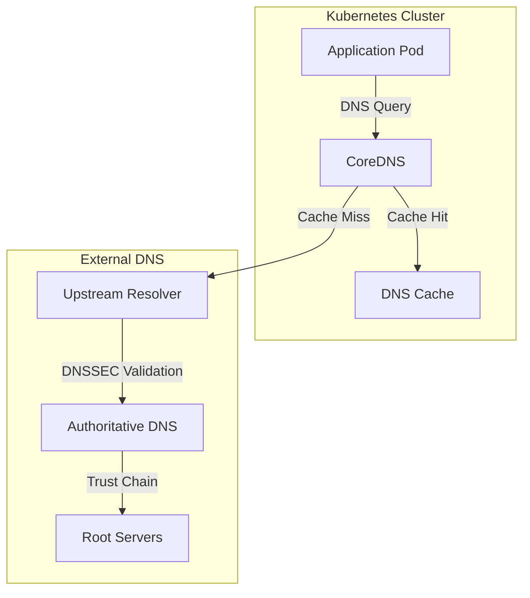

# How to Monitor DNSSEC Health in Kubernetes with OneUptime

Author: [nawazdhandala](https://github.com/nawazdhandala)

Tags: DNSSEC, OneUptime, Kubernetes, Monitoring, DNS, Security

Description: A comprehensive guide to monitoring DNSSEC validation, key rotation, and DNS security in Kubernetes environments using OneUptime's custom monitors and alerting capabilities.

---

DNSSEC (Domain Name System Security Extensions) protects your users from DNS spoofing and cache poisoning attacks. But what happens when DNSSEC validation fails silently in your Kubernetes cluster? Users get cryptic connection errors, applications fail to resolve domains, and debugging becomes a nightmare.

This guide shows you how to set up comprehensive DNSSEC health monitoring in Kubernetes using OneUptime, ensuring you catch validation failures, key rotation issues, and signature expirations before they impact your users.

---

## TL;DR

- DNSSEC validation failures can silently break DNS resolution in Kubernetes
- OneUptime monitors DNSSEC health through custom scripts, synthetic monitors, and incoming request heartbeats
- Track RRSIG expiration, key rotation schedules, and validation chain integrity
- Set up proactive alerts before signatures expire or validation fails
- Integrate monitoring with CoreDNS, external-dns, and cloud DNS providers

---

## Why DNSSEC Monitoring Matters in Kubernetes

Kubernetes clusters rely heavily on DNS for service discovery. Every pod-to-pod communication, external API call, and ingress routing depends on DNS resolution. When DNSSEC validation fails:

- **Pod DNS lookups fail**: Applications can't resolve internal or external services
- **Service mesh breaks**: Istio, Linkerd, and other meshes depend on DNS
- **External integrations fail**: API calls to third-party services time out
- **Certificate issuance breaks**: Let's Encrypt and cert-manager rely on DNS
- **Silent failures**: DNSSEC issues often manifest as generic connection errors

The worst part? Standard Kubernetes monitoring doesn't track DNSSEC health. You need specialized monitoring to catch these issues.

---

## Understanding DNSSEC in Kubernetes

Before diving into monitoring, let's understand how DNSSEC works in a Kubernetes context.

### DNSSEC Components

```
DNSSEC Trust Chain:
├── Root Zone (.)
│   └── Zone Signing Key (ZSK)
│   └── Key Signing Key (KSK)
├── TLD (.com, .io, .org)
│   └── DS Record pointing to parent
│   └── DNSKEY Records
│   └── RRSIG Signatures
├── Your Domain (example.com)
│   └── DS Record in parent zone
│   └── DNSKEY Records
│   └── RRSIG Signatures for all records
└── Your Records (api.example.com)
    └── Signed with RRSIG
```

### Kubernetes DNS Architecture



### Common DNSSEC Failure Modes

Understanding failure modes helps design effective monitoring:

| Failure Mode | Impact | Detection Method |
|-------------|--------|------------------|
| Expired RRSIG | DNS resolution fails | Check signature timestamps |
| Missing DS Record | Trust chain breaks | Validate chain integrity |
| Key Mismatch | Validation fails | Compare DNSKEY with DS |
| Algorithm Mismatch | Some resolvers fail | Test with multiple algorithms |
| NSEC/NSEC3 Issues | Negative responses fail | Test non-existent domains |
| Clock Skew | Premature expiration | Monitor time synchronization |

---

## Setting Up OneUptime for DNSSEC Monitoring

### Step 1: Create a DNSSEC Monitor Project

Start by organizing your DNSSEC monitors in OneUptime:

1. Navigate to your OneUptime dashboard
2. Create a new project or use an existing one
3. Add a resource group called "DNSSEC Health"
4. Tag monitors with `dnssec`, `kubernetes`, and environment labels

### Step 2: Configure DNS Validation Monitors

OneUptime's synthetic monitors can validate DNSSEC responses directly.

**Create a Synthetic Monitor for DNSSEC Validation:**

1. Go to **Monitors** > **Create Monitor**
2. Select **Synthetic Monitor** type
3. Configure the monitor:

```
Monitor Name: DNSSEC Validation - api.example.com
Description: Validates DNSSEC chain for production API domain
Check Interval: 5 minutes
```

4. Add the following script:

```typescript
// DNSSEC Validation Monitor Script
// This script validates the complete DNSSEC chain for a domain

import dns from 'dns';
import { promisify } from 'util';

const resolveTxt = promisify(dns.resolveTxt);
const resolve4 = promisify(dns.resolve4);

interface DNSSECResult {
  domain: string;
  valid: boolean;
  chainComplete: boolean;
  signatureExpiry: string | null;
  error: string | null;
}

async function validateDNSSEC(domain: string): Promise<DNSSECResult> {
  const result: DNSSECResult = {
    domain,
    valid: false,
    chainComplete: false,
    signatureExpiry: null,
    error: null
  };

  try {
    // Resolve the domain with DNSSEC validation
    // Using a DNSSEC-validating resolver
    const resolver = new dns.Resolver();
    resolver.setServers(['8.8.8.8', '1.1.1.1']); // Public DNSSEC validators

    const resolveWithValidation = promisify(resolver.resolve4.bind(resolver));
    const addresses = await resolveWithValidation(domain);

    if (addresses && addresses.length > 0) {
      result.valid = true;
      result.chainComplete = true;
    }
  } catch (error: any) {
    result.error = error.message;

    // Check for DNSSEC-specific errors
    if (error.code === 'ESERVFAIL') {
      result.error = 'DNSSEC validation failed - SERVFAIL response';
    } else if (error.code === 'ENOTFOUND') {
      result.error = 'Domain not found - check DS records';
    }
  }

  return result;
}

// Main execution
const domain = 'api.example.com';
const result = await validateDNSSEC(domain);

if (!result.valid) {
  throw new Error(`DNSSEC validation failed: ${result.error}`);
}

return {
  success: true,
  message: `DNSSEC validation passed for ${domain}`,
  data: result
};
```

---

## Custom DNSSEC Health Check Scripts

For deeper DNSSEC monitoring, deploy custom health check scripts in your Kubernetes cluster.

### DNSSEC Health Check CronJob

Create a Kubernetes CronJob that validates DNSSEC and reports to OneUptime:

```yaml
# dnssec-health-check.yaml
apiVersion: batch/v1
kind: CronJob
metadata:
  name: dnssec-health-check
  namespace: monitoring
  labels:
    app: dnssec-monitor
spec:
  schedule: "*/5 * * * *"  # Every 5 minutes
  concurrencyPolicy: Forbid
  successfulJobsHistoryLimit: 3
  failedJobsHistoryLimit: 3
  jobTemplate:
    spec:
      template:
        spec:
          restartPolicy: OnFailure
          containers:
            - name: dnssec-checker
              image: alpine:latest
              command:
                - /bin/sh
                - -c
                - |
                  apk add --no-cache bind-tools curl jq

                  # OneUptime heartbeat URL
                  HEARTBEAT_URL="${ONEUPTIME_HEARTBEAT_URL}"

                  # Domains to check
                  DOMAINS="api.example.com auth.example.com cdn.example.com"

                  FAILED=0
                  RESULTS=""

                  for domain in $DOMAINS; do
                    echo "Checking DNSSEC for $domain..."

                    # Query with DNSSEC validation using dig
                    RESULT=$(dig +dnssec +short $domain @8.8.8.8 2>&1)
                    RRSIG=$(dig +dnssec $domain @8.8.8.8 | grep RRSIG)

                    if [ -z "$RESULT" ] || echo "$RESULT" | grep -q "SERVFAIL"; then
                      echo "DNSSEC validation FAILED for $domain"
                      FAILED=$((FAILED + 1))
                      RESULTS="$RESULTS{\"domain\":\"$domain\",\"status\":\"failed\"},"
                    else
                      echo "DNSSEC validation PASSED for $domain"

                      # Extract RRSIG expiration
                      EXPIRY=$(echo "$RRSIG" | awk '{print $9}' | head -1)
                      RESULTS="$RESULTS{\"domain\":\"$domain\",\"status\":\"valid\",\"rrsig_expiry\":\"$EXPIRY\"},"
                    fi
                  done

                  # Remove trailing comma
                  RESULTS=$(echo "$RESULTS" | sed 's/,$//')

                  # Send heartbeat to OneUptime
                  if [ $FAILED -eq 0 ]; then
                    curl -X POST "$HEARTBEAT_URL" \
                      -H "Content-Type: application/json" \
                      -d "{\"status\":\"healthy\",\"domains_checked\":$(echo $DOMAINS | wc -w),\"results\":[$RESULTS]}"
                  else
                    curl -X POST "$HEARTBEAT_URL" \
                      -H "Content-Type: application/json" \
                      -d "{\"status\":\"degraded\",\"failed_count\":$FAILED,\"results\":[$RESULTS]}"
                    exit 1
                  fi
              env:
                - name: ONEUPTIME_HEARTBEAT_URL
                  valueFrom:
                    secretKeyRef:
                      name: oneuptime-secrets
                      key: dnssec-heartbeat-url
```

### Create the Required Secret

```yaml
# oneuptime-secrets.yaml
apiVersion: v1
kind: Secret
metadata:
  name: oneuptime-secrets
  namespace: monitoring
type: Opaque
stringData:
  dnssec-heartbeat-url: "https://oneuptime.com/heartbeat/dnssec_check_abc123"
```

Apply the configurations:

```bash
kubectl apply -f oneuptime-secrets.yaml
kubectl apply -f dnssec-health-check.yaml
```

---

## Monitoring RRSIG Expiration

RRSIG signatures have expiration dates. Monitoring these prevents surprise validation failures.

### RRSIG Expiration Monitor Script

Deploy this as a dedicated monitoring pod:

```python
#!/usr/bin/env python3
"""
DNSSEC RRSIG Expiration Monitor
Checks RRSIG expiration dates and alerts before they expire
"""

import dns.resolver
import dns.dnssec
import dns.rdatatype
import requests
import json
from datetime import datetime, timedelta
import os
import sys

# Configuration
ONEUPTIME_HEARTBEAT_URL = os.environ.get('ONEUPTIME_HEARTBEAT_URL')
WARNING_DAYS = int(os.environ.get('WARNING_DAYS', 7))
CRITICAL_DAYS = int(os.environ.get('CRITICAL_DAYS', 3))

# Domains to monitor
DOMAINS = [
    'api.example.com',
    'auth.example.com',
    'www.example.com',
    'mail.example.com',
]

def get_rrsig_expiration(domain: str) -> dict:
    """
    Query DNSSEC RRSIG records and extract expiration dates.

    Args:
        domain: The domain to check

    Returns:
        Dictionary with domain status and expiration info
    """
    result = {
        'domain': domain,
        'status': 'unknown',
        'rrsig_found': False,
        'expiration': None,
        'days_until_expiry': None,
        'error': None
    }

    try:
        # Create a resolver that requests DNSSEC records
        resolver = dns.resolver.Resolver()
        resolver.use_dnssec = True
        resolver.nameservers = ['8.8.8.8', '1.1.1.1']

        # Query for A records with DNSSEC
        answer = resolver.resolve(domain, 'A', raise_on_no_answer=False)

        # Look for RRSIG in the response
        for rrset in answer.response.answer:
            if rrset.rdtype == dns.rdatatype.RRSIG:
                result['rrsig_found'] = True

                for rrsig in rrset:
                    # RRSIG expiration is in the format YYYYMMDDHHMMSS
                    expiration_str = str(rrsig.expiration)
                    expiration_date = datetime.strptime(expiration_str, '%Y%m%d%H%M%S')

                    result['expiration'] = expiration_date.isoformat()

                    # Calculate days until expiry
                    now = datetime.utcnow()
                    delta = expiration_date - now
                    result['days_until_expiry'] = delta.days

                    # Determine status based on expiration
                    if delta.days < 0:
                        result['status'] = 'expired'
                    elif delta.days <= CRITICAL_DAYS:
                        result['status'] = 'critical'
                    elif delta.days <= WARNING_DAYS:
                        result['status'] = 'warning'
                    else:
                        result['status'] = 'healthy'

                    break  # Use first RRSIG found
                break

        if not result['rrsig_found']:
            result['status'] = 'no_rrsig'
            result['error'] = 'No RRSIG records found - DNSSEC may not be enabled'

    except dns.resolver.NXDOMAIN:
        result['status'] = 'error'
        result['error'] = 'Domain does not exist'
    except dns.resolver.NoAnswer:
        result['status'] = 'error'
        result['error'] = 'No answer from DNS server'
    except dns.resolver.Timeout:
        result['status'] = 'error'
        result['error'] = 'DNS query timeout'
    except Exception as e:
        result['status'] = 'error'
        result['error'] = str(e)

    return result


def send_heartbeat(status: str, results: list):
    """
    Send monitoring results to OneUptime heartbeat endpoint.

    Args:
        status: Overall status (healthy, warning, critical, error)
        results: List of domain check results
    """
    if not ONEUPTIME_HEARTBEAT_URL:
        print("Warning: ONEUPTIME_HEARTBEAT_URL not set, skipping heartbeat")
        return

    payload = {
        'status': status,
        'timestamp': datetime.utcnow().isoformat(),
        'domains_checked': len(results),
        'results': results,
        'warning_threshold_days': WARNING_DAYS,
        'critical_threshold_days': CRITICAL_DAYS
    }

    # Count domains by status
    status_counts = {}
    for r in results:
        s = r.get('status', 'unknown')
        status_counts[s] = status_counts.get(s, 0) + 1
    payload['status_counts'] = status_counts

    try:
        response = requests.post(
            ONEUPTIME_HEARTBEAT_URL,
            json=payload,
            timeout=10,
            headers={'Content-Type': 'application/json'}
        )
        response.raise_for_status()
        print(f"Heartbeat sent successfully: {status}")
    except requests.exceptions.RequestException as e:
        print(f"Failed to send heartbeat: {e}")


def main():
    """Main monitoring function."""
    print(f"Starting DNSSEC RRSIG expiration check at {datetime.utcnow().isoformat()}")
    print(f"Warning threshold: {WARNING_DAYS} days")
    print(f"Critical threshold: {CRITICAL_DAYS} days")
    print("-" * 50)

    results = []
    overall_status = 'healthy'

    for domain in DOMAINS:
        print(f"Checking {domain}...")
        result = get_rrsig_expiration(domain)
        results.append(result)

        print(f"  Status: {result['status']}")
        if result['days_until_expiry'] is not None:
            print(f"  Days until expiry: {result['days_until_expiry']}")
        if result['error']:
            print(f"  Error: {result['error']}")

        # Update overall status (worst status wins)
        if result['status'] in ['error', 'expired']:
            overall_status = 'critical'
        elif result['status'] == 'critical' and overall_status != 'critical':
            overall_status = 'critical'
        elif result['status'] == 'warning' and overall_status == 'healthy':
            overall_status = 'warning'

    print("-" * 50)
    print(f"Overall status: {overall_status}")

    # Send heartbeat to OneUptime
    send_heartbeat(overall_status, results)

    # Exit with appropriate code
    if overall_status == 'critical':
        sys.exit(1)
    elif overall_status == 'warning':
        sys.exit(0)  # Warning is not a failure
    else:
        sys.exit(0)


if __name__ == '__main__':
    main()
```

### Kubernetes Deployment for RRSIG Monitor

```yaml
# rrsig-monitor-deployment.yaml
apiVersion: apps/v1
kind: Deployment
metadata:
  name: rrsig-expiration-monitor
  namespace: monitoring
  labels:
    app: rrsig-monitor
spec:
  replicas: 1
  selector:
    matchLabels:
      app: rrsig-monitor
  template:
    metadata:
      labels:
        app: rrsig-monitor
    spec:
      containers:
        - name: monitor
          image: python:3.11-slim
          command:
            - /bin/sh
            - -c
            - |
              pip install dnspython requests
              while true; do
                python /scripts/rrsig_monitor.py
                sleep 300  # Check every 5 minutes
              done
          env:
            - name: ONEUPTIME_HEARTBEAT_URL
              valueFrom:
                secretKeyRef:
                  name: oneuptime-secrets
                  key: rrsig-heartbeat-url
            - name: WARNING_DAYS
              value: "7"
            - name: CRITICAL_DAYS
              value: "3"
          volumeMounts:
            - name: scripts
              mountPath: /scripts
          resources:
            requests:
              memory: "64Mi"
              cpu: "50m"
            limits:
              memory: "128Mi"
              cpu: "100m"
      volumes:
        - name: scripts
          configMap:
            name: rrsig-monitor-scripts
---
apiVersion: v1
kind: ConfigMap
metadata:
  name: rrsig-monitor-scripts
  namespace: monitoring
data:
  rrsig_monitor.py: |
    # Paste the Python script above here
```

---

## Monitoring CoreDNS DNSSEC Configuration

CoreDNS is the default DNS server in Kubernetes. Monitor its DNSSEC configuration:

### CoreDNS DNSSEC Plugin Configuration

First, ensure CoreDNS is configured for DNSSEC:

```yaml
# coredns-configmap.yaml
apiVersion: v1
kind: ConfigMap
metadata:
  name: coredns
  namespace: kube-system
data:
  Corefile: |
    .:53 {
        errors
        health {
            lameduck 5s
        }
        ready
        kubernetes cluster.local in-addr.arpa ip6.arpa {
            pods insecure
            fallthrough in-addr.arpa ip6.arpa
            ttl 30
        }
        prometheus :9153
        forward . /etc/resolv.conf {
            max_concurrent 1000
        }
        cache 30
        loop
        reload
        loadbalance

        # Enable DNSSEC validation
        dnssec {
            # Validate DNSSEC for upstream queries
        }
    }
```

### CoreDNS Metrics Monitor

Monitor CoreDNS DNSSEC metrics through Prometheus integration:

```yaml
# coredns-dnssec-servicemonitor.yaml
apiVersion: monitoring.coreos.com/v1
kind: ServiceMonitor
metadata:
  name: coredns-dnssec
  namespace: monitoring
  labels:
    app: coredns
spec:
  selector:
    matchLabels:
      k8s-app: kube-dns
  namespaceSelector:
    matchNames:
      - kube-system
  endpoints:
    - port: metrics
      interval: 30s
      path: /metrics
```

### CoreDNS Health Check Script

```bash
#!/bin/bash
# coredns-dnssec-check.sh
# Validates CoreDNS DNSSEC functionality

HEARTBEAT_URL="${ONEUPTIME_HEARTBEAT_URL}"

# Test domains for DNSSEC validation
TEST_DOMAINS=(
    "example.com"           # Known DNSSEC-enabled domain
    "dnssec-failed.org"     # Test domain that should fail DNSSEC
)

PASSED=0
FAILED=0
RESULTS=""

# Get CoreDNS pod IP
COREDNS_IP=$(kubectl get svc -n kube-system kube-dns -o jsonpath='{.spec.clusterIP}')

for domain in "${TEST_DOMAINS[@]}"; do
    echo "Testing DNSSEC for $domain via CoreDNS..."

    # Query through CoreDNS
    RESULT=$(dig +dnssec +short "$domain" @"$COREDNS_IP" 2>&1)
    AD_FLAG=$(dig +dnssec "$domain" @"$COREDNS_IP" | grep -c "ad;")

    if [ "$AD_FLAG" -gt 0 ]; then
        echo "  DNSSEC validated (AD flag set)"
        PASSED=$((PASSED + 1))
        RESULTS="$RESULTS{\"domain\":\"$domain\",\"validated\":true},"
    else
        echo "  DNSSEC NOT validated (AD flag not set)"
        # This might be expected for some domains
        RESULTS="$RESULTS{\"domain\":\"$domain\",\"validated\":false},"
    fi
done

# Remove trailing comma
RESULTS=$(echo "$RESULTS" | sed 's/,$//')

# Send heartbeat
curl -X POST "$HEARTBEAT_URL" \
    -H "Content-Type: application/json" \
    -d "{
        \"status\": \"completed\",
        \"coredns_ip\": \"$COREDNS_IP\",
        \"passed\": $PASSED,
        \"total\": ${#TEST_DOMAINS[@]},
        \"results\": [$RESULTS]
    }"

echo "CoreDNS DNSSEC check complete: $PASSED/${#TEST_DOMAINS[@]} validated"
```

---

## Setting Up OneUptime Alerts for DNSSEC

### Alert Configuration Strategy

Create a tiered alerting strategy for DNSSEC issues:

```
Alert Levels:
├── Information (P4)
│   └── RRSIG expiring in 14+ days
│   └── Scheduled key rotation detected
│
├── Warning (P3)
│   └── RRSIG expiring in 7-14 days
│   └── DNSSEC query latency increased
│
├── High (P2)
│   └── RRSIG expiring in 3-7 days
│   └── Intermittent validation failures
│
└── Critical (P1)
    └── RRSIG expiring in < 3 days
    └── DNSSEC validation failure
    └── Trust chain broken
```

### Creating Alert Rules in OneUptime

1. Navigate to **Alerts** > **Alert Rules**
2. Create rules for each scenario:

**Critical Alert - DNSSEC Validation Failure:**

```
Rule Name: DNSSEC Validation Failure
Condition: Monitor status = offline OR heartbeat contains "status": "critical"
Severity: Critical
Notification: On-call team, Slack #incidents, PagerDuty
Auto-incident: Yes
```

**Warning Alert - RRSIG Expiring Soon:**

```
Rule Name: RRSIG Expiration Warning
Condition: Heartbeat contains "status": "warning" OR days_until_expiry < 7
Severity: Warning
Notification: DNS team, Slack #dns-alerts
Auto-incident: No
```

**Information Alert - Routine Check:**

```
Rule Name: DNSSEC Health Check Complete
Condition: Heartbeat contains "status": "healthy"
Severity: Information
Notification: None (log only)
Auto-incident: No
```

### On-Call Integration

Configure on-call rotations for DNSSEC alerts:

```yaml
# Example on-call policy for DNSSEC
On-Call Policy: DNSSEC Critical
├── Primary: DNS Team Lead
├── Secondary: Platform Engineer (after 5 min)
├── Tertiary: SRE Manager (after 15 min)
└── Escalation: VP Engineering (after 30 min)

Notification Channels:
├── Immediate: PagerDuty, Phone Call
├── 5 minutes: SMS, Slack DM
└── 15 minutes: Email, Slack Channel
```

---

## Monitoring Key Rotation Events

DNSSEC key rotation is critical but often overlooked. Monitor these events proactively.

### Key Rotation Monitor Script

```python
#!/usr/bin/env python3
"""
DNSSEC Key Rotation Monitor
Tracks DNSKEY records and detects rotation events
"""

import dns.resolver
import dns.rdatatype
import hashlib
import json
import os
import requests
from datetime import datetime
from pathlib import Path

ONEUPTIME_HEARTBEAT_URL = os.environ.get('ONEUPTIME_HEARTBEAT_URL')
STATE_FILE = '/data/dnskey_state.json'

DOMAINS = [
    'example.com',
    'api.example.com',
]

def get_dnskey_fingerprints(domain: str) -> list:
    """
    Get DNSKEY record fingerprints for a domain.

    Args:
        domain: Domain to query

    Returns:
        List of key fingerprints with metadata
    """
    keys = []

    try:
        resolver = dns.resolver.Resolver()
        resolver.nameservers = ['8.8.8.8']

        answer = resolver.resolve(domain, 'DNSKEY')

        for rdata in answer:
            # Create a fingerprint of the key
            key_data = rdata.to_text()
            fingerprint = hashlib.sha256(key_data.encode()).hexdigest()[:16]

            keys.append({
                'fingerprint': fingerprint,
                'flags': rdata.flags,
                'protocol': rdata.protocol,
                'algorithm': rdata.algorithm,
                'is_ksk': (rdata.flags & 0x0001) == 0x0001,  # Key Signing Key
                'is_zsk': (rdata.flags & 0x0001) == 0x0000,  # Zone Signing Key
            })

    except Exception as e:
        print(f"Error getting DNSKEY for {domain}: {e}")

    return keys


def load_state() -> dict:
    """Load previous key state from file."""
    try:
        if Path(STATE_FILE).exists():
            with open(STATE_FILE, 'r') as f:
                return json.load(f)
    except Exception as e:
        print(f"Error loading state: {e}")
    return {}


def save_state(state: dict):
    """Save current key state to file."""
    try:
        Path(STATE_FILE).parent.mkdir(parents=True, exist_ok=True)
        with open(STATE_FILE, 'w') as f:
            json.dump(state, f, indent=2)
    except Exception as e:
        print(f"Error saving state: {e}")


def detect_rotation(domain: str, current_keys: list, previous_keys: list) -> dict:
    """
    Detect key rotation events by comparing current and previous keys.

    Args:
        domain: Domain being checked
        current_keys: Current DNSKEY fingerprints
        previous_keys: Previous DNSKEY fingerprints

    Returns:
        Dictionary describing any rotation events
    """
    result = {
        'domain': domain,
        'rotation_detected': False,
        'keys_added': [],
        'keys_removed': [],
        'current_key_count': len(current_keys),
        'previous_key_count': len(previous_keys)
    }

    current_fps = {k['fingerprint'] for k in current_keys}
    previous_fps = {k['fingerprint'] for k in previous_keys}

    added = current_fps - previous_fps
    removed = previous_fps - current_fps

    if added or removed:
        result['rotation_detected'] = True
        result['keys_added'] = list(added)
        result['keys_removed'] = list(removed)

    return result


def main():
    """Main monitoring function."""
    print(f"Starting DNSSEC key rotation check at {datetime.utcnow().isoformat()}")

    previous_state = load_state()
    current_state = {}
    results = []
    rotation_events = []

    for domain in DOMAINS:
        print(f"Checking keys for {domain}...")

        current_keys = get_dnskey_fingerprints(domain)
        previous_keys = previous_state.get(domain, [])

        # Store current state
        current_state[domain] = current_keys

        # Check for rotation
        rotation = detect_rotation(domain, current_keys, previous_keys)
        results.append(rotation)

        if rotation['rotation_detected']:
            print(f"  KEY ROTATION DETECTED!")
            print(f"  Keys added: {rotation['keys_added']}")
            print(f"  Keys removed: {rotation['keys_removed']}")
            rotation_events.append(rotation)
        else:
            print(f"  No rotation detected. {len(current_keys)} keys present.")

    # Save current state
    save_state(current_state)

    # Determine overall status
    status = 'rotation_detected' if rotation_events else 'stable'

    # Send heartbeat to OneUptime
    payload = {
        'status': status,
        'timestamp': datetime.utcnow().isoformat(),
        'domains_checked': len(DOMAINS),
        'rotation_events': len(rotation_events),
        'results': results
    }

    if ONEUPTIME_HEARTBEAT_URL:
        try:
            response = requests.post(
                ONEUPTIME_HEARTBEAT_URL,
                json=payload,
                timeout=10
            )
            print(f"Heartbeat sent: {response.status_code}")
        except Exception as e:
            print(f"Failed to send heartbeat: {e}")

    print(f"Check complete. Rotation events: {len(rotation_events)}")


if __name__ == '__main__':
    main()
```

---

## Monitoring External DNS Providers

If you use external-dns or cloud DNS providers, monitor their DNSSEC status too.

### AWS Route 53 DNSSEC Monitor

```python
#!/usr/bin/env python3
"""
AWS Route 53 DNSSEC Health Monitor
Monitors DNSSEC signing status for Route 53 hosted zones
"""

import boto3
import requests
import os
from datetime import datetime

ONEUPTIME_HEARTBEAT_URL = os.environ.get('ONEUPTIME_HEARTBEAT_URL')
HOSTED_ZONE_IDS = os.environ.get('HOSTED_ZONE_IDS', '').split(',')

def check_route53_dnssec():
    """Check DNSSEC status for Route 53 hosted zones."""
    client = boto3.client('route53')
    results = []

    for zone_id in HOSTED_ZONE_IDS:
        if not zone_id:
            continue

        zone_id = zone_id.strip()
        print(f"Checking DNSSEC for zone: {zone_id}")

        try:
            # Get DNSSEC status
            response = client.get_dnssec(HostedZoneId=zone_id)

            status = response.get('Status', {})
            signing_status = status.get('ServeSignature', 'UNKNOWN')

            # Get key signing keys
            key_signing_keys = response.get('KeySigningKeys', [])

            result = {
                'zone_id': zone_id,
                'signing_status': signing_status,
                'key_count': len(key_signing_keys),
                'keys': []
            }

            for ksk in key_signing_keys:
                key_info = {
                    'name': ksk.get('Name'),
                    'status': ksk.get('Status'),
                    'algorithm': ksk.get('SigningAlgorithmType'),
                    'created': ksk.get('CreatedDate', '').isoformat() if ksk.get('CreatedDate') else None
                }
                result['keys'].append(key_info)

            # Determine health
            if signing_status == 'SIGNING':
                result['health'] = 'healthy'
            elif signing_status == 'NOT_SIGNING':
                result['health'] = 'disabled'
            else:
                result['health'] = 'unknown'

            results.append(result)
            print(f"  Status: {signing_status}, Keys: {len(key_signing_keys)}")

        except Exception as e:
            results.append({
                'zone_id': zone_id,
                'health': 'error',
                'error': str(e)
            })
            print(f"  Error: {e}")

    return results


def main():
    """Main function."""
    print(f"Checking Route 53 DNSSEC at {datetime.utcnow().isoformat()}")

    results = check_route53_dnssec()

    # Determine overall status
    statuses = [r.get('health', 'unknown') for r in results]
    if 'error' in statuses:
        overall_status = 'error'
    elif all(s == 'healthy' for s in statuses):
        overall_status = 'healthy'
    else:
        overall_status = 'degraded'

    # Send heartbeat
    payload = {
        'status': overall_status,
        'timestamp': datetime.utcnow().isoformat(),
        'provider': 'AWS Route 53',
        'zones_checked': len(results),
        'results': results
    }

    if ONEUPTIME_HEARTBEAT_URL:
        try:
            response = requests.post(
                ONEUPTIME_HEARTBEAT_URL,
                json=payload,
                timeout=10
            )
            print(f"Heartbeat sent: {response.status_code}")
        except Exception as e:
            print(f"Failed to send heartbeat: {e}")

    print(f"Overall status: {overall_status}")


if __name__ == '__main__':
    main()
```

### Google Cloud DNS DNSSEC Monitor

```python
#!/usr/bin/env python3
"""
Google Cloud DNS DNSSEC Health Monitor
Monitors DNSSEC status for Cloud DNS managed zones
"""

from google.cloud import dns
import requests
import os
from datetime import datetime

ONEUPTIME_HEARTBEAT_URL = os.environ.get('ONEUPTIME_HEARTBEAT_URL')
PROJECT_ID = os.environ.get('GCP_PROJECT_ID')
MANAGED_ZONES = os.environ.get('MANAGED_ZONES', '').split(',')

def check_cloud_dns_dnssec():
    """Check DNSSEC status for Cloud DNS managed zones."""
    client = dns.Client(project=PROJECT_ID)
    results = []

    for zone_name in MANAGED_ZONES:
        if not zone_name:
            continue

        zone_name = zone_name.strip()
        print(f"Checking DNSSEC for zone: {zone_name}")

        try:
            zone = client.zone(zone_name)
            zone.reload()

            result = {
                'zone_name': zone_name,
                'dns_name': zone.dns_name,
                'dnssec_state': zone.dnssec_config.get('state', 'UNKNOWN') if zone.dnssec_config else 'NOT_CONFIGURED',
            }

            if zone.dnssec_config:
                result['algorithm'] = zone.dnssec_config.get('defaultKeySpecs', [{}])[0].get('algorithm', 'UNKNOWN')
                result['key_type'] = zone.dnssec_config.get('defaultKeySpecs', [{}])[0].get('keyType', 'UNKNOWN')

            # Determine health
            if result['dnssec_state'] == 'ON':
                result['health'] = 'healthy'
            elif result['dnssec_state'] == 'OFF':
                result['health'] = 'disabled'
            else:
                result['health'] = 'unknown'

            results.append(result)
            print(f"  DNSSEC State: {result['dnssec_state']}")

        except Exception as e:
            results.append({
                'zone_name': zone_name,
                'health': 'error',
                'error': str(e)
            })
            print(f"  Error: {e}")

    return results


def main():
    """Main function."""
    print(f"Checking Cloud DNS DNSSEC at {datetime.utcnow().isoformat()}")

    results = check_cloud_dns_dnssec()

    # Determine overall status
    statuses = [r.get('health', 'unknown') for r in results]
    if 'error' in statuses:
        overall_status = 'error'
    elif all(s == 'healthy' for s in statuses):
        overall_status = 'healthy'
    else:
        overall_status = 'degraded'

    # Send heartbeat
    payload = {
        'status': overall_status,
        'timestamp': datetime.utcnow().isoformat(),
        'provider': 'Google Cloud DNS',
        'zones_checked': len(results),
        'results': results
    }

    if ONEUPTIME_HEARTBEAT_URL:
        try:
            response = requests.post(
                ONEUPTIME_HEARTBEAT_URL,
                json=payload,
                timeout=10
            )
            print(f"Heartbeat sent: {response.status_code}")
        except Exception as e:
            print(f"Failed to send heartbeat: {e}")

    print(f"Overall status: {overall_status}")


if __name__ == '__main__':
    main()
```

---

## Comprehensive DNSSEC Dashboard

Create a unified dashboard in OneUptime for all DNSSEC monitors.

### Dashboard Layout

```
DNSSEC Health Dashboard
========================

┌─────────────────────────────────────────────────────────────────┐
│  Overall DNSSEC Status: HEALTHY                                 │
│  Last Check: 2 minutes ago                                      │
└─────────────────────────────────────────────────────────────────┘

┌─────────────────────────────────┐  ┌─────────────────────────────┐
│  Domain Validation Status       │  │  RRSIG Expiration Timeline  │
│  ├── api.example.com    ✓       │  │  api.example.com   45 days  │
│  ├── auth.example.com   ✓       │  │  auth.example.com  45 days  │
│  ├── www.example.com    ✓       │  │  www.example.com   45 days  │
│  └── mail.example.com   ✓       │  │  mail.example.com  45 days  │
└─────────────────────────────────┘  └─────────────────────────────┘

┌─────────────────────────────────┐  ┌─────────────────────────────┐
│  CoreDNS DNSSEC Metrics         │  │  Key Rotation Events        │
│  Queries/sec: 1,245             │  │  Last 24h: 0 events         │
│  Validation success: 99.9%      │  │  Last 7d: 1 event           │
│  Cache hit rate: 85%            │  │  Scheduled: None            │
└─────────────────────────────────┘  └─────────────────────────────┘

┌─────────────────────────────────────────────────────────────────┐
│  Recent Alerts                                                  │
│  - 3 days ago: RRSIG expiration warning for staging.example.com │
│  - 7 days ago: Key rotation completed for example.com           │
└─────────────────────────────────────────────────────────────────┘
```

### Monitor Summary Table

| Monitor Type | Check Interval | Alert Threshold | Heartbeat URL |
|-------------|----------------|-----------------|---------------|
| DNSSEC Validation | 5 min | Immediate on failure | `/heartbeat/dnssec_validation_*` |
| RRSIG Expiration | 1 hour | 7 days before expiry | `/heartbeat/rrsig_expiry_*` |
| Key Rotation | 6 hours | On rotation detected | `/heartbeat/key_rotation_*` |
| CoreDNS Health | 5 min | 3 consecutive failures | `/heartbeat/coredns_dnssec_*` |
| Route 53 Status | 15 min | Status change | `/heartbeat/route53_dnssec_*` |
| Cloud DNS Status | 15 min | Status change | `/heartbeat/clouddns_dnssec_*` |

---

## Troubleshooting DNSSEC Issues

### Common Issues and Solutions

**Issue: DNSSEC validation fails intermittently**

Symptoms:
- Random DNS resolution failures
- SERVFAIL responses from resolvers
- Applications report connection timeouts

Solutions:
```bash
# Check DNSSEC chain with delv
delv @8.8.8.8 example.com +rtrace

# Verify DS record in parent zone
dig DS example.com @a.gtld-servers.net

# Check DNSKEY records
dig DNSKEY example.com +dnssec

# Verify RRSIG signatures
dig A example.com +dnssec | grep RRSIG
```

**Issue: RRSIG expired prematurely**

Symptoms:
- Sudden validation failures
- All domains on same authoritative server affected

Solutions:
```bash
# Check RRSIG expiration times
dig +dnssec example.com | grep -A1 RRSIG

# Verify server time synchronization
ntpq -p

# Check zone file for RRSIG dates
dig AXFR example.com @ns1.example.com | grep RRSIG
```

**Issue: Trust chain broken**

Symptoms:
- DS record doesn't match DNSKEY
- Parent zone has wrong DS record

Solutions:
```bash
# Calculate DS record from DNSKEY
dnssec-dsfromkey -2 example.com

# Compare with parent zone DS
dig DS example.com @parent-ns

# Verify algorithm compatibility
dig DNSKEY example.com | awk '/257/ {print "KSK:", $0}'
```

### DNSSEC Debug Toolkit

Deploy a debug pod for troubleshooting:

```yaml
# dnssec-debug-pod.yaml
apiVersion: v1
kind: Pod
metadata:
  name: dnssec-debug
  namespace: monitoring
spec:
  containers:
    - name: debug
      image: alpine:latest
      command:
        - sleep
        - infinity
      securityContext:
        runAsNonRoot: false
  restartPolicy: Never
```

Access the debug pod:

```bash
kubectl exec -it dnssec-debug -n monitoring -- sh
apk add bind-tools drill ldns

# Run DNSSEC diagnostics
drill -TD example.com
ldns-walk example.com
dig +trace +dnssec example.com
```

---

## Best Practices Summary

### DNSSEC Monitoring Checklist

- [ ] Monitor DNSSEC validation for all critical domains
- [ ] Track RRSIG expiration with adequate warning time (7+ days)
- [ ] Monitor key rotation events
- [ ] Set up alerts for validation failures
- [ ] Configure on-call escalation for DNSSEC incidents
- [ ] Monitor CoreDNS DNSSEC configuration
- [ ] Track cloud DNS provider DNSSEC status
- [ ] Maintain debug tooling for incident response
- [ ] Document DNSSEC infrastructure and contacts
- [ ] Test monitoring during key rotation events

### Monitoring Frequency Guidelines

| Component | Recommended Interval | Reason |
|-----------|---------------------|--------|
| DNSSEC Validation | 5 minutes | Catch failures quickly |
| RRSIG Expiration | 1-6 hours | Daily awareness sufficient |
| Key Rotation | 6-12 hours | Rotation is planned event |
| CoreDNS Metrics | 1 minute | High-frequency service |
| Cloud DNS Status | 15-30 minutes | Status changes are rare |

### Alert Priority Matrix

| Condition | Priority | Response Time | Notification |
|-----------|----------|---------------|--------------|
| Validation failure | P1 Critical | Immediate | Phone + PagerDuty |
| RRSIG < 3 days | P2 High | 1 hour | Slack + SMS |
| RRSIG < 7 days | P3 Medium | 24 hours | Email + Slack |
| Key rotation | P4 Info | None | Log only |
| Metric anomaly | P3 Medium | 4 hours | Slack |

---

## Conclusion

DNSSEC monitoring in Kubernetes requires a multi-layered approach:

1. **Validate DNSSEC responses** from external resolvers
2. **Track RRSIG expiration** to prevent surprise failures
3. **Monitor key rotation** events for visibility
4. **Watch CoreDNS** DNSSEC configuration and metrics
5. **Track cloud DNS providers** for managed zone health

OneUptime provides the flexibility to implement all these monitoring patterns through:

- Synthetic monitors for active DNSSEC validation
- Incoming request monitors for heartbeat-based checks
- Custom scripts deployed in Kubernetes CronJobs
- Alert rules with intelligent escalation
- Dashboard integration for unified visibility

Start with the most critical domains, establish baseline monitoring, and expand coverage as you gain confidence in your DNSSEC infrastructure.

Your users depend on DNS security. Make sure you know when it breaks before they do.

---

## Quick Reference

### OneUptime Monitor Types for DNSSEC

| Use Case | Monitor Type | Configuration |
|----------|--------------|---------------|
| Domain validation | Synthetic | Custom TypeScript/JavaScript script |
| Heartbeat checks | Incoming Request | CronJob sends HTTP POST |
| External validation | Website | Check DNSSEC-enabled endpoints |
| Metrics collection | Custom | Prometheus + ServiceMonitor |

### Essential dig Commands

```bash
# Basic DNSSEC query
dig +dnssec example.com

# Trace DNSSEC chain
dig +trace +dnssec example.com

# Get DNSKEY records
dig DNSKEY example.com

# Get DS records from parent
dig DS example.com @parent-ns

# Check RRSIG details
dig +dnssec example.com | grep RRSIG

# Validate with specific resolver
dig +dnssec @8.8.8.8 example.com
```

### Useful Resources

- RFC 4033, 4034, 4035: DNSSEC Protocol Specification
- RFC 5155: NSEC3 for DNSSEC
- ICANN DNSSEC Deployment Initiative
- Verisign DNSSEC Debugger
- DNSViz Visualization Tool

---

Ready to monitor your DNSSEC infrastructure? OneUptime makes it easy to track DNSSEC health across your entire Kubernetes environment with intelligent alerting and comprehensive reporting.

Start monitoring your DNSSEC today and ensure your DNS security actually works when you need it.
