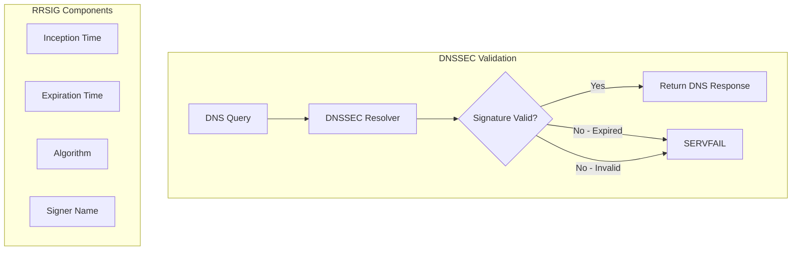
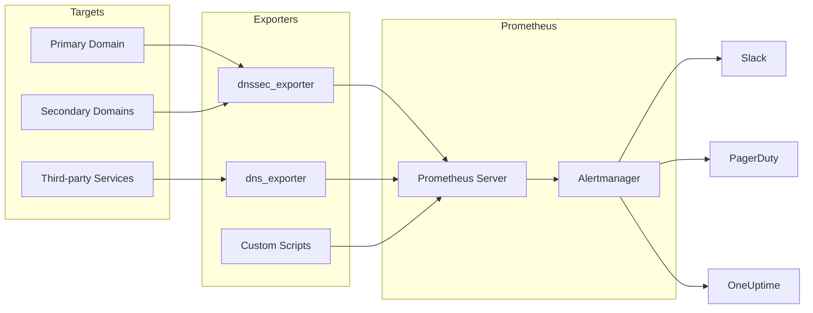

# How to Monitor DNSSEC Signature Expiration with Prometheus

Author: [nawazdhandala](https://github.com/nawazdhandala)

Tags: DNSSEC, Prometheus, Monitoring, DNS, Security, Alerting

Description: A comprehensive guide to monitoring DNSSEC signature expiration using Prometheus exporters, PromQL queries, and alerting rules to prevent DNS resolution failures.

---

DNSSEC (Domain Name System Security Extensions) protects DNS queries from tampering and cache poisoning. But here's the catch - DNSSEC signatures expire. When they do, your domain becomes unresolvable for DNSSEC-validating resolvers. This guide shows you how to monitor DNSSEC signature expiration with Prometheus before it becomes an outage.

## Understanding DNSSEC Signatures

### What Are RRSIG Records?

DNSSEC uses cryptographic signatures (RRSIG records) to authenticate DNS responses. Each RRSIG has:

- **Inception time**: When the signature becomes valid
- **Expiration time**: When the signature expires
- **Signature algorithm**: Cryptographic method used
- **Key tag**: Reference to the signing key



### Why Signatures Expire

DNSSEC signatures have limited validity periods (typically 1-4 weeks) to:

1. Limit damage from key compromise
2. Allow key rotation
3. Prevent replay attacks with old signatures

### The Expiration Problem

When RRSIG records expire:

- DNSSEC-validating resolvers return SERVFAIL
- Users with strict DNSSEC validation cannot reach your domain
- The issue is invisible to non-validating resolvers
- Debugging is difficult without proper monitoring

---

## DNSSEC Monitoring Architecture



---

## Option 1: Using dnssec_exporter

The `dnssec_exporter` is a purpose-built Prometheus exporter for DNSSEC monitoring.

### Installation

```bash
# Download the latest release
wget https://github.com/prometheus-community/dnssec_exporter/releases/download/v1.0.0/dnssec_exporter-1.0.0.linux-amd64.tar.gz

# Extract
tar xvfz dnssec_exporter-1.0.0.linux-amd64.tar.gz

# Move to system path
sudo mv dnssec_exporter-1.0.0.linux-amd64/dnssec_exporter /usr/local/bin/

# Verify installation
dnssec_exporter --version
```

### Configuration File

Create `/etc/dnssec_exporter/config.yml`:

```yaml
# DNSSEC Exporter Configuration
zones:
  # Primary domains
  - name: example.com
    nameservers:
      - 8.8.8.8:53
      - 1.1.1.1:53
    record_types:
      - A
      - AAAA
      - MX
      - NS
      - SOA

  - name: example.org
    nameservers:
      - 8.8.8.8:53
    record_types:
      - A
      - AAAA

  # Subdomains with separate DNSSEC
  - name: api.example.com
    nameservers:
      - 8.8.8.8:53
    record_types:
      - A
      - AAAA

  # Third-party services
  - name: mail.example.com
    nameservers:
      - 8.8.8.8:53
    record_types:
      - MX

# Global settings
settings:
  timeout: 10s
  retries: 3
  cache_ttl: 60s
```

### Systemd Service

Create `/etc/systemd/system/dnssec_exporter.service`:

```ini
[Unit]
Description=DNSSEC Exporter for Prometheus
Documentation=https://github.com/prometheus-community/dnssec_exporter
After=network-online.target
Wants=network-online.target

[Service]
Type=simple
User=prometheus
Group=prometheus
ExecStart=/usr/local/bin/dnssec_exporter \
    --config.file=/etc/dnssec_exporter/config.yml \
    --web.listen-address=:9204 \
    --web.telemetry-path=/metrics
Restart=always
RestartSec=5

# Security hardening
NoNewPrivileges=yes
ProtectSystem=strict
ProtectHome=yes
PrivateTmp=yes
PrivateDevices=yes

[Install]
WantedBy=multi-user.target
```

### Start the Exporter

```bash
# Create user and directories
sudo useradd --no-create-home --shell /bin/false prometheus
sudo mkdir -p /etc/dnssec_exporter
sudo chown prometheus:prometheus /etc/dnssec_exporter

# Enable and start
sudo systemctl daemon-reload
sudo systemctl enable dnssec_exporter
sudo systemctl start dnssec_exporter

# Verify
curl http://localhost:9204/metrics | grep dnssec
```

### Metrics Exposed

The exporter provides these key metrics:

| Metric | Type | Description |
|--------|------|-------------|
| `dnssec_rrsig_expiration_timestamp` | Gauge | Unix timestamp when RRSIG expires |
| `dnssec_rrsig_inception_timestamp` | Gauge | Unix timestamp when RRSIG became valid |
| `dnssec_rrsig_validity_seconds` | Gauge | Seconds until signature expires |
| `dnssec_validation_success` | Gauge | 1 if DNSSEC validation succeeded, 0 otherwise |
| `dnssec_probe_duration_seconds` | Gauge | Time taken to probe the zone |
| `dnssec_zone_signed` | Gauge | 1 if zone is DNSSEC signed, 0 otherwise |
| `dnssec_algorithm` | Gauge | DNSSEC algorithm number used |
| `dnssec_key_tag` | Gauge | Key tag of the signing key |

---

## Option 2: Using dns_exporter with DNSSEC Checks

The generic `dns_exporter` can also perform DNSSEC validation checks.

### Installation

```bash
# Using Docker
docker run -d \
  --name dns_exporter \
  -p 9153:9153 \
  -v /etc/dns_exporter:/config \
  prometheuscommunity/dns-exporter:latest \
  --config.file=/config/dns_exporter.yml
```

### Configuration

Create `/etc/dns_exporter/dns_exporter.yml`:

```yaml
modules:
  dnssec_check:
    prober: dns
    timeout: 10s
    dns:
      preferred_ip_protocol: ip4
      query_name: example.com
      query_type: A
      valid_rcodes:
        - NOERROR
      validate: true  # Enable DNSSEC validation
      recursion_desired: true

  dnssec_mx:
    prober: dns
    timeout: 10s
    dns:
      query_name: example.com
      query_type: MX
      validate: true
      recursion_desired: true

  dnssec_ns:
    prober: dns
    timeout: 10s
    dns:
      query_name: example.com
      query_type: NS
      validate: true
      recursion_desired: true
```

---

## Option 3: Custom Exporter Script

For maximum flexibility, create a custom exporter using Python.

### Python DNSSEC Exporter

Create `/opt/dnssec_monitor/exporter.py`:

```python
#!/usr/bin/env python3
"""
Custom DNSSEC Exporter for Prometheus
Monitors RRSIG expiration times for configured domains
"""

import dns.resolver
import dns.dnssec
import dns.rdatatype
import time
import argparse
from prometheus_client import start_http_server, Gauge, Counter, Histogram
from datetime import datetime
import yaml
import logging

# Configure logging
logging.basicConfig(
    level=logging.INFO,
    format='%(asctime)s - %(levelname)s - %(message)s'
)
logger = logging.getLogger(__name__)

# Prometheus metrics
RRSIG_EXPIRATION = Gauge(
    'dnssec_rrsig_expiration_timestamp',
    'Unix timestamp when RRSIG expires',
    ['zone', 'record_type', 'algorithm', 'key_tag']
)

RRSIG_VALIDITY = Gauge(
    'dnssec_rrsig_validity_seconds',
    'Seconds remaining until RRSIG expires',
    ['zone', 'record_type']
)

RRSIG_INCEPTION = Gauge(
    'dnssec_rrsig_inception_timestamp',
    'Unix timestamp when RRSIG became valid',
    ['zone', 'record_type', 'algorithm', 'key_tag']
)

DNSSEC_VALID = Gauge(
    'dnssec_validation_success',
    '1 if DNSSEC validation succeeded, 0 otherwise',
    ['zone', 'record_type']
)

DNSSEC_SIGNED = Gauge(
    'dnssec_zone_signed',
    '1 if zone has DNSSEC signatures, 0 otherwise',
    ['zone']
)

PROBE_DURATION = Histogram(
    'dnssec_probe_duration_seconds',
    'Time taken to probe DNSSEC for a zone',
    ['zone'],
    buckets=[0.1, 0.25, 0.5, 1.0, 2.5, 5.0, 10.0]
)

PROBE_ERRORS = Counter(
    'dnssec_probe_errors_total',
    'Total number of probe errors',
    ['zone', 'error_type']
)

SHORTEST_VALIDITY = Gauge(
    'dnssec_shortest_validity_seconds',
    'Shortest RRSIG validity across all monitored zones',
    []
)


def get_rrsig_info(zone: str, record_type: str, nameserver: str = None):
    """
    Query RRSIG records for a zone and record type.
    Returns expiration time, inception time, algorithm, and key tag.
    """
    resolver = dns.resolver.Resolver()
    if nameserver:
        resolver.nameservers = [nameserver]

    # Enable DNSSEC
    resolver.use_edns(edns=0, ednsflags=dns.flags.DO, payload=4096)

    try:
        rdtype = dns.rdatatype.from_text(record_type)
        answers = resolver.resolve(zone, rdtype)

        # Get RRSIG from response
        rrsig_rrset = answers.response.find_rrset(
            answers.response.answer,
            dns.name.from_text(zone),
            dns.rdataclass.IN,
            dns.rdatatype.RRSIG,
            rdtype
        )

        results = []
        for rrsig in rrsig_rrset:
            expiration = datetime.utcfromtimestamp(rrsig.expiration)
            inception = datetime.utcfromtimestamp(rrsig.inception)
            validity_seconds = (expiration - datetime.utcnow()).total_seconds()

            results.append({
                'expiration': rrsig.expiration,
                'inception': rrsig.inception,
                'validity_seconds': validity_seconds,
                'algorithm': rrsig.algorithm,
                'key_tag': rrsig.key_tag,
                'signer': str(rrsig.signer)
            })

        return results

    except dns.resolver.NoAnswer:
        logger.warning(f"No RRSIG found for {zone} {record_type}")
        return None
    except dns.resolver.NXDOMAIN:
        logger.error(f"Domain {zone} does not exist")
        return None
    except Exception as e:
        logger.error(f"Error querying {zone} {record_type}: {e}")
        raise


def check_dnssec_validation(zone: str, record_type: str, nameserver: str = None):
    """
    Attempt DNSSEC validation for a zone.
    Returns True if validation succeeds.
    """
    resolver = dns.resolver.Resolver()
    if nameserver:
        resolver.nameservers = [nameserver]

    resolver.use_edns(edns=0, ednsflags=dns.flags.DO, payload=4096)

    try:
        rdtype = dns.rdatatype.from_text(record_type)
        answers = resolver.resolve(zone, rdtype)

        # Check if AD (Authenticated Data) flag is set
        if answers.response.flags & dns.flags.AD:
            return True

        # Check for RRSIG presence
        for rrset in answers.response.answer:
            if rrset.rdtype == dns.rdatatype.RRSIG:
                return True

        return False

    except Exception as e:
        logger.error(f"Validation check failed for {zone}: {e}")
        return False


def probe_zone(zone_config: dict, global_nameserver: str = None):
    """
    Probe a zone for DNSSEC information and update metrics.
    """
    zone = zone_config['name']
    record_types = zone_config.get('record_types', ['A'])
    nameserver = zone_config.get('nameserver', global_nameserver)

    start_time = time.time()
    zone_signed = False
    min_validity = float('inf')

    for record_type in record_types:
        try:
            # Get RRSIG information
            rrsig_info = get_rrsig_info(zone, record_type, nameserver)

            if rrsig_info:
                zone_signed = True
                for info in rrsig_info:
                    # Update expiration timestamp
                    RRSIG_EXPIRATION.labels(
                        zone=zone,
                        record_type=record_type,
                        algorithm=str(info['algorithm']),
                        key_tag=str(info['key_tag'])
                    ).set(info['expiration'])

                    # Update inception timestamp
                    RRSIG_INCEPTION.labels(
                        zone=zone,
                        record_type=record_type,
                        algorithm=str(info['algorithm']),
                        key_tag=str(info['key_tag'])
                    ).set(info['inception'])

                    # Update validity seconds
                    validity = info['validity_seconds']
                    RRSIG_VALIDITY.labels(
                        zone=zone,
                        record_type=record_type
                    ).set(validity)

                    if validity < min_validity:
                        min_validity = validity

                    logger.info(
                        f"{zone} {record_type}: "
                        f"expires in {validity/86400:.1f} days"
                    )

            # Check DNSSEC validation
            is_valid = check_dnssec_validation(zone, record_type, nameserver)
            DNSSEC_VALID.labels(
                zone=zone,
                record_type=record_type
            ).set(1 if is_valid else 0)

        except Exception as e:
            PROBE_ERRORS.labels(
                zone=zone,
                error_type=type(e).__name__
            ).inc()
            logger.error(f"Error probing {zone} {record_type}: {e}")

    # Update zone-level metrics
    DNSSEC_SIGNED.labels(zone=zone).set(1 if zone_signed else 0)

    # Record probe duration
    duration = time.time() - start_time
    PROBE_DURATION.labels(zone=zone).observe(duration)

    return min_validity


def load_config(config_path: str):
    """Load configuration from YAML file."""
    with open(config_path, 'r') as f:
        return yaml.safe_load(f)


def main():
    parser = argparse.ArgumentParser(
        description='DNSSEC Prometheus Exporter'
    )
    parser.add_argument(
        '--config', '-c',
        default='/etc/dnssec_exporter/config.yml',
        help='Path to configuration file'
    )
    parser.add_argument(
        '--port', '-p',
        type=int,
        default=9204,
        help='Port to expose metrics on'
    )
    parser.add_argument(
        '--interval', '-i',
        type=int,
        default=300,
        help='Probe interval in seconds'
    )
    args = parser.parse_args()

    # Load configuration
    config = load_config(args.config)
    zones = config.get('zones', [])
    global_nameserver = config.get('settings', {}).get('nameserver')

    logger.info(f"Loaded {len(zones)} zones from configuration")

    # Start Prometheus HTTP server
    start_http_server(args.port)
    logger.info(f"Metrics server started on port {args.port}")

    # Main loop
    while True:
        global_min_validity = float('inf')

        for zone_config in zones:
            min_validity = probe_zone(zone_config, global_nameserver)
            if min_validity < global_min_validity:
                global_min_validity = min_validity

        # Update global shortest validity
        if global_min_validity != float('inf'):
            SHORTEST_VALIDITY.set(global_min_validity)

        logger.info(f"Probe cycle complete. Next probe in {args.interval}s")
        time.sleep(args.interval)


if __name__ == '__main__':
    main()
```

### Requirements

Create `/opt/dnssec_monitor/requirements.txt`:

```
dnspython>=2.4.0
prometheus-client>=0.17.0
PyYAML>=6.0
```

### Installation

```bash
# Create directory
sudo mkdir -p /opt/dnssec_monitor

# Install dependencies
cd /opt/dnssec_monitor
python3 -m venv venv
source venv/bin/activate
pip install -r requirements.txt

# Make executable
chmod +x exporter.py
```

### Systemd Service for Custom Exporter

Create `/etc/systemd/system/dnssec_monitor.service`:

```ini
[Unit]
Description=Custom DNSSEC Monitor for Prometheus
After=network-online.target
Wants=network-online.target

[Service]
Type=simple
User=prometheus
Group=prometheus
WorkingDirectory=/opt/dnssec_monitor
ExecStart=/opt/dnssec_monitor/venv/bin/python /opt/dnssec_monitor/exporter.py \
    --config /etc/dnssec_exporter/config.yml \
    --port 9204 \
    --interval 300
Restart=always
RestartSec=10

[Install]
WantedBy=multi-user.target
```

---

## Prometheus Configuration

### Add Scrape Targets

Add to `/etc/prometheus/prometheus.yml`:

```yaml
global:
  scrape_interval: 60s
  evaluation_interval: 60s

scrape_configs:
  # DNSSEC Exporter
  - job_name: 'dnssec'
    static_configs:
      - targets: ['localhost:9204']
    scrape_interval: 5m  # DNSSEC doesn't change frequently
    scrape_timeout: 30s

  # Multi-target probe (if using Blackbox-style exporter)
  - job_name: 'dnssec_probe'
    metrics_path: /probe
    params:
      module: [dnssec_check]
    static_configs:
      - targets:
        - example.com
        - example.org
        - api.example.com
    relabel_configs:
      - source_labels: [__address__]
        target_label: __param_target
      - source_labels: [__param_target]
        target_label: instance
      - target_label: __address__
        replacement: localhost:9204
```

### Recording Rules

Create `/etc/prometheus/rules/dnssec_recording.yml`:

```yaml
groups:
  - name: dnssec_recording
    interval: 5m
    rules:
      # Calculate days until expiration for easier alerting
      - record: dnssec:rrsig_days_until_expiration
        expr: |
          (dnssec_rrsig_expiration_timestamp - time()) / 86400

      # Minimum validity across all zones
      - record: dnssec:min_validity_seconds
        expr: |
          min(dnssec_rrsig_validity_seconds) by (zone)

      # Average validity per zone
      - record: dnssec:avg_validity_seconds
        expr: |
          avg(dnssec_rrsig_validity_seconds) by (zone)

      # Zones with critical validity (less than 3 days)
      - record: dnssec:critical_zones
        expr: |
          count(dnssec_rrsig_validity_seconds < 259200) by (zone)

      # Total monitored zones
      - record: dnssec:monitored_zones_total
        expr: |
          count(dnssec_zone_signed) by ()

      # Zones with failed validation
      - record: dnssec:failed_validation_zones
        expr: |
          count(dnssec_validation_success == 0) by (zone)

      # Probe success rate
      - record: dnssec:probe_success_rate
        expr: |
          1 - (
            sum(rate(dnssec_probe_errors_total[1h])) by (zone)
            /
            (sum(rate(dnssec_probe_errors_total[1h])) by (zone) + 1)
          )
```

---

## Essential PromQL Queries

### Expiration Time Queries

```promql
# Time until RRSIG expires (in seconds)
dnssec_rrsig_validity_seconds

# Days until expiration
dnssec_rrsig_validity_seconds / 86400

# Zones expiring within 7 days
dnssec_rrsig_validity_seconds < 604800

# Zones expiring within 3 days (critical)
dnssec_rrsig_validity_seconds < 259200

# Zones expiring within 24 hours (emergency)
dnssec_rrsig_validity_seconds < 86400

# Already expired signatures
dnssec_rrsig_validity_seconds < 0
```

### Zone Health Queries

```promql
# All monitored zones and their validity
sort_desc(dnssec_rrsig_validity_seconds)

# Zones with failed DNSSEC validation
dnssec_validation_success == 0

# Zones that are not signed
dnssec_zone_signed == 0

# Zone with shortest validity
bottomk(1, dnssec_rrsig_validity_seconds)

# Average validity across all zones
avg(dnssec_rrsig_validity_seconds)
```

### Trend Analysis Queries

```promql
# Validity trend (should be stable or increasing after re-signing)
deriv(dnssec_rrsig_validity_seconds[1h])

# Zones where validity is decreasing rapidly
deriv(dnssec_rrsig_validity_seconds[6h]) < -10000

# Predicted expiration time (linear extrapolation)
dnssec_rrsig_validity_seconds + (
  deriv(dnssec_rrsig_validity_seconds[1d]) * 86400
)

# Zones that will expire in the next week based on current trend
predict_linear(dnssec_rrsig_validity_seconds[1d], 604800) < 0
```

### Algorithm and Key Queries

```promql
# Zones using specific algorithm
dnssec_rrsig_expiration_timestamp{algorithm="13"}

# Count of zones by algorithm
count(dnssec_rrsig_expiration_timestamp) by (algorithm)

# Key tag distribution
count(dnssec_rrsig_expiration_timestamp) by (key_tag)
```

---

## Alerting Rules

Create `/etc/prometheus/rules/dnssec_alerts.yml`:

```yaml
groups:
  - name: dnssec_expiration
    rules:
      # Critical: Expires within 24 hours
      - alert: DNSSECSignatureExpiringCritical
        expr: dnssec_rrsig_validity_seconds < 86400
        for: 5m
        labels:
          severity: critical
          team: dns
        annotations:
          summary: "DNSSEC signature expiring within 24 hours"
          description: |
            Zone {{ $labels.zone }} ({{ $labels.record_type }})
            RRSIG expires in {{ $value | humanizeDuration }}.
            Immediate re-signing required.
          runbook_url: https://wiki.example.com/runbooks/dnssec-emergency

      # Warning: Expires within 3 days
      - alert: DNSSECSignatureExpiringWarning
        expr: dnssec_rrsig_validity_seconds < 259200 and dnssec_rrsig_validity_seconds >= 86400
        for: 15m
        labels:
          severity: warning
          team: dns
        annotations:
          summary: "DNSSEC signature expiring within 3 days"
          description: |
            Zone {{ $labels.zone }} ({{ $labels.record_type }})
            RRSIG expires in {{ $value | humanizeDuration }}.
            Schedule re-signing soon.

      # Info: Expires within 7 days
      - alert: DNSSECSignatureExpiringInfo
        expr: dnssec_rrsig_validity_seconds < 604800 and dnssec_rrsig_validity_seconds >= 259200
        for: 1h
        labels:
          severity: info
          team: dns
        annotations:
          summary: "DNSSEC signature expiring within 7 days"
          description: |
            Zone {{ $labels.zone }} ({{ $labels.record_type }})
            RRSIG expires in {{ $value | humanizeDuration }}.
            Plan re-signing in your next maintenance window.

      # Expired signature
      - alert: DNSSECSignatureExpired
        expr: dnssec_rrsig_validity_seconds < 0
        for: 1m
        labels:
          severity: critical
          team: dns
          priority: P1
        annotations:
          summary: "DNSSEC signature has EXPIRED"
          description: |
            CRITICAL: Zone {{ $labels.zone }} ({{ $labels.record_type }})
            RRSIG has expired! DNSSEC-validating resolvers will fail.
            Immediate action required.
          runbook_url: https://wiki.example.com/runbooks/dnssec-expired

  - name: dnssec_validation
    rules:
      # DNSSEC validation failing
      - alert: DNSSECValidationFailed
        expr: dnssec_validation_success == 0
        for: 5m
        labels:
          severity: critical
          team: dns
        annotations:
          summary: "DNSSEC validation failing"
          description: |
            DNSSEC validation failed for {{ $labels.zone }} ({{ $labels.record_type }}).
            This may indicate signature expiration, broken chain of trust,
            or DS record issues.

      # Zone not signed when expected
      - alert: DNSSECZoneNotSigned
        expr: dnssec_zone_signed == 0
        for: 10m
        labels:
          severity: warning
          team: dns
        annotations:
          summary: "Zone is not DNSSEC signed"
          description: |
            Zone {{ $labels.zone }} does not have DNSSEC signatures.
            Verify if this is intentional.

  - name: dnssec_monitoring_health
    rules:
      # Exporter not responding
      - alert: DNSSECExporterDown
        expr: up{job="dnssec"} == 0
        for: 5m
        labels:
          severity: critical
          team: monitoring
        annotations:
          summary: "DNSSEC exporter is down"
          description: |
            The DNSSEC exporter has been unreachable for 5 minutes.
            DNSSEC monitoring is not functioning.

      # Probe errors
      - alert: DNSSECProbeErrors
        expr: rate(dnssec_probe_errors_total[15m]) > 0.1
        for: 10m
        labels:
          severity: warning
          team: dns
        annotations:
          summary: "High rate of DNSSEC probe errors"
          description: |
            Zone {{ $labels.zone }} is experiencing probe errors.
            Error type: {{ $labels.error_type }}

      # Probe taking too long
      - alert: DNSSECProbeSlow
        expr: dnssec_probe_duration_seconds > 10
        for: 15m
        labels:
          severity: warning
          team: dns
        annotations:
          summary: "DNSSEC probe is slow"
          description: |
            Probe for {{ $labels.zone }} is taking {{ $value }}s.
            Check DNS server responsiveness.

      # No metrics for expected zone
      - alert: DNSSECMetricsMissing
        expr: absent(dnssec_rrsig_validity_seconds{zone="example.com"})
        for: 15m
        labels:
          severity: warning
          team: monitoring
        annotations:
          summary: "Missing DNSSEC metrics for critical zone"
          description: |
            No DNSSEC metrics are being collected for example.com.
            Check exporter configuration.
```

---

## Alertmanager Configuration

Configure `/etc/alertmanager/alertmanager.yml`:

```yaml
global:
  resolve_timeout: 5m

route:
  receiver: 'default'
  group_by: ['alertname', 'zone']
  group_wait: 30s
  group_interval: 5m
  repeat_interval: 4h
  routes:
    # Critical DNSSEC alerts go to PagerDuty
    - match:
        severity: critical
        team: dns
      receiver: 'pagerduty-dns'
      continue: true

    # All DNSSEC alerts also go to Slack
    - match:
        team: dns
      receiver: 'slack-dns'

    # Send to OneUptime
    - match:
        team: dns
      receiver: 'oneuptime'

receivers:
  - name: 'default'
    webhook_configs:
      - url: 'http://localhost:9093/webhook'

  - name: 'pagerduty-dns'
    pagerduty_configs:
      - service_key: '<YOUR_PAGERDUTY_KEY>'
        severity: critical
        description: '{{ .CommonAnnotations.summary }}'
        details:
          zone: '{{ .CommonLabels.zone }}'
          record_type: '{{ .CommonLabels.record_type }}'
          runbook: '{{ .CommonAnnotations.runbook_url }}'

  - name: 'slack-dns'
    slack_configs:
      - api_url: '<YOUR_SLACK_WEBHOOK>'
        channel: '#dns-alerts'
        username: 'DNSSEC Monitor'
        icon_emoji: ':lock:'
        title: '{{ .CommonAnnotations.summary }}'
        text: '{{ .CommonAnnotations.description }}'
        color: '{{ if eq .Status "firing" }}danger{{ else }}good{{ end }}'
        actions:
          - type: button
            text: 'Runbook'
            url: '{{ .CommonAnnotations.runbook_url }}'
          - type: button
            text: 'Silence'
            url: '{{ template "__alert_silence_link" . }}'

  - name: 'oneuptime'
    webhook_configs:
      - url: 'https://oneuptime.com/api/webhook/alert/<PROJECT_ID>'
        send_resolved: true
        http_config:
          bearer_token: '<YOUR_ONEUPTIME_TOKEN>'

templates:
  - '/etc/alertmanager/templates/*.tmpl'
```

---

## Grafana Dashboard

### Dashboard JSON

Create a Grafana dashboard for DNSSEC monitoring:

```json
{
  "dashboard": {
    "title": "DNSSEC Monitoring",
    "tags": ["dnssec", "dns", "security"],
    "panels": [
      {
        "title": "RRSIG Validity by Zone",
        "type": "stat",
        "gridPos": {"h": 4, "w": 24, "x": 0, "y": 0},
        "targets": [
          {
            "expr": "dnssec_rrsig_validity_seconds / 86400",
            "legendFormat": "{{zone}} ({{record_type}})"
          }
        ],
        "options": {
          "colorMode": "background",
          "graphMode": "area"
        },
        "fieldConfig": {
          "defaults": {
            "unit": "d",
            "thresholds": {
              "mode": "absolute",
              "steps": [
                {"color": "red", "value": 0},
                {"color": "orange", "value": 3},
                {"color": "yellow", "value": 7},
                {"color": "green", "value": 14}
              ]
            }
          }
        }
      },
      {
        "title": "Days Until Expiration",
        "type": "gauge",
        "gridPos": {"h": 8, "w": 12, "x": 0, "y": 4},
        "targets": [
          {
            "expr": "min(dnssec_rrsig_validity_seconds) by (zone) / 86400",
            "legendFormat": "{{zone}}"
          }
        ],
        "options": {
          "reduceOptions": {
            "calcs": ["lastNotNull"]
          }
        },
        "fieldConfig": {
          "defaults": {
            "unit": "d",
            "min": 0,
            "max": 30,
            "thresholds": {
              "mode": "absolute",
              "steps": [
                {"color": "red", "value": 0},
                {"color": "orange", "value": 3},
                {"color": "yellow", "value": 7},
                {"color": "green", "value": 14}
              ]
            }
          }
        }
      },
      {
        "title": "Validation Status",
        "type": "stat",
        "gridPos": {"h": 8, "w": 12, "x": 12, "y": 4},
        "targets": [
          {
            "expr": "dnssec_validation_success",
            "legendFormat": "{{zone}}"
          }
        ],
        "options": {
          "colorMode": "background"
        },
        "fieldConfig": {
          "defaults": {
            "mappings": [
              {"options": {"0": {"text": "FAILED", "color": "red"}}, "type": "value"},
              {"options": {"1": {"text": "OK", "color": "green"}}, "type": "value"}
            ]
          }
        }
      },
      {
        "title": "RRSIG Validity Trend",
        "type": "timeseries",
        "gridPos": {"h": 10, "w": 24, "x": 0, "y": 12},
        "targets": [
          {
            "expr": "dnssec_rrsig_validity_seconds / 86400",
            "legendFormat": "{{zone}} ({{record_type}})"
          }
        ],
        "fieldConfig": {
          "defaults": {
            "unit": "d",
            "custom": {
              "lineWidth": 2,
              "fillOpacity": 10
            }
          }
        }
      },
      {
        "title": "Expiration Timeline",
        "type": "table",
        "gridPos": {"h": 8, "w": 24, "x": 0, "y": 22},
        "targets": [
          {
            "expr": "sort_desc(dnssec_rrsig_validity_seconds)",
            "format": "table",
            "instant": true
          }
        ],
        "transformations": [
          {
            "id": "organize",
            "options": {
              "excludeByName": {"Time": true, "__name__": true},
              "renameByName": {
                "zone": "Zone",
                "record_type": "Record Type",
                "Value": "Seconds Until Expiration"
              }
            }
          }
        ]
      }
    ]
  }
}
```

---

## Docker Compose Setup

Deploy the complete monitoring stack:

```yaml
version: '3.8'

services:
  dnssec_exporter:
    build:
      context: ./dnssec_exporter
      dockerfile: Dockerfile
    container_name: dnssec_exporter
    restart: unless-stopped
    ports:
      - "9204:9204"
    volumes:
      - ./config/dnssec_exporter.yml:/etc/dnssec_exporter/config.yml:ro
    networks:
      - monitoring

  prometheus:
    image: prom/prometheus:v2.47.0
    container_name: prometheus
    restart: unless-stopped
    ports:
      - "9090:9090"
    volumes:
      - ./config/prometheus.yml:/etc/prometheus/prometheus.yml:ro
      - ./config/rules:/etc/prometheus/rules:ro
      - prometheus_data:/prometheus
    command:
      - '--config.file=/etc/prometheus/prometheus.yml'
      - '--storage.tsdb.path=/prometheus'
      - '--storage.tsdb.retention.time=30d'
      - '--web.enable-lifecycle'
    networks:
      - monitoring

  alertmanager:
    image: prom/alertmanager:v0.26.0
    container_name: alertmanager
    restart: unless-stopped
    ports:
      - "9093:9093"
    volumes:
      - ./config/alertmanager.yml:/etc/alertmanager/alertmanager.yml:ro
      - alertmanager_data:/alertmanager
    command:
      - '--config.file=/etc/alertmanager/alertmanager.yml'
      - '--storage.path=/alertmanager'
    networks:
      - monitoring

  grafana:
    image: grafana/grafana:10.1.0
    container_name: grafana
    restart: unless-stopped
    ports:
      - "3000:3000"
    environment:
      - GF_SECURITY_ADMIN_PASSWORD=admin
      - GF_USERS_ALLOW_SIGN_UP=false
    volumes:
      - grafana_data:/var/lib/grafana
      - ./config/grafana/dashboards:/etc/grafana/provisioning/dashboards:ro
      - ./config/grafana/datasources:/etc/grafana/provisioning/datasources:ro
    networks:
      - monitoring

volumes:
  prometheus_data:
  alertmanager_data:
  grafana_data:

networks:
  monitoring:
    driver: bridge
```

### Dockerfile for Custom Exporter

Create `dnssec_exporter/Dockerfile`:

```dockerfile
FROM python:3.11-slim

WORKDIR /app

RUN apt-get update && apt-get install -y --no-install-recommends \
    dnsutils \
    && rm -rf /var/lib/apt/lists/*

COPY requirements.txt .
RUN pip install --no-cache-dir -r requirements.txt

COPY exporter.py .

EXPOSE 9204

USER nobody

ENTRYPOINT ["python", "exporter.py"]
CMD ["--config", "/etc/dnssec_exporter/config.yml", "--port", "9204"]
```

---

## Kubernetes Deployment

### DNSSEC Exporter Deployment

```yaml
apiVersion: apps/v1
kind: Deployment
metadata:
  name: dnssec-exporter
  namespace: monitoring
  labels:
    app: dnssec-exporter
spec:
  replicas: 2
  selector:
    matchLabels:
      app: dnssec-exporter
  template:
    metadata:
      labels:
        app: dnssec-exporter
      annotations:
        prometheus.io/scrape: "true"
        prometheus.io/port: "9204"
    spec:
      containers:
        - name: dnssec-exporter
          image: your-registry/dnssec-exporter:latest
          ports:
            - containerPort: 9204
              name: metrics
          volumeMounts:
            - name: config
              mountPath: /etc/dnssec_exporter
          resources:
            requests:
              memory: "64Mi"
              cpu: "50m"
            limits:
              memory: "128Mi"
              cpu: "100m"
          livenessProbe:
            httpGet:
              path: /health
              port: 9204
            initialDelaySeconds: 10
            periodSeconds: 30
          readinessProbe:
            httpGet:
              path: /health
              port: 9204
            initialDelaySeconds: 5
            periodSeconds: 10
      volumes:
        - name: config
          configMap:
            name: dnssec-exporter-config
---
apiVersion: v1
kind: ConfigMap
metadata:
  name: dnssec-exporter-config
  namespace: monitoring
data:
  config.yml: |
    zones:
      - name: example.com
        record_types: [A, AAAA, MX, NS]
      - name: api.example.com
        record_types: [A, AAAA]
    settings:
      nameserver: 8.8.8.8
---
apiVersion: v1
kind: Service
metadata:
  name: dnssec-exporter
  namespace: monitoring
  labels:
    app: dnssec-exporter
spec:
  selector:
    app: dnssec-exporter
  ports:
    - port: 9204
      targetPort: 9204
      name: metrics
---
apiVersion: monitoring.coreos.com/v1
kind: ServiceMonitor
metadata:
  name: dnssec-exporter
  namespace: monitoring
  labels:
    release: prometheus
spec:
  selector:
    matchLabels:
      app: dnssec-exporter
  endpoints:
    - port: metrics
      interval: 5m
      scrapeTimeout: 30s
```

---

## Best Practices

### 1. Monitoring Configuration

| Practice | Recommendation |
|----------|----------------|
| Scrape interval | 5-15 minutes (DNSSEC changes slowly) |
| Alert threshold (critical) | 24 hours before expiration |
| Alert threshold (warning) | 3-7 days before expiration |
| Retention | Keep 90+ days for trend analysis |
| Probe timeout | 10-30 seconds |

### 2. Zone Coverage

| Zone Type | Priority | Monitoring Frequency |
|-----------|----------|---------------------|
| Primary domain | Critical | Every 5 minutes |
| API subdomains | High | Every 5 minutes |
| Marketing sites | Medium | Every 15 minutes |
| Internal services | Low | Every 30 minutes |
| Third-party services | Medium | Every 15 minutes |

### 3. Alert Escalation

| Time to Expiration | Severity | Action |
|--------------------|----------|--------|
| > 7 days | Info | Log for awareness |
| 3-7 days | Warning | Create ticket |
| 1-3 days | High | Notify DNS team |
| < 24 hours | Critical | Page on-call |
| Expired | Emergency | Incident response |

### 4. Record Types to Monitor

| Record Type | Importance | Notes |
|-------------|------------|-------|
| A/AAAA | Critical | Primary address records |
| MX | Critical | Email delivery |
| NS | High | Delegation |
| SOA | High | Zone authority |
| CNAME | Medium | Aliases |
| TXT | Medium | SPF, DKIM, verification |
| SRV | Medium | Service discovery |

---

## Troubleshooting

### Common Issues

**1. No RRSIG Records Found**

```bash
# Check if zone is signed
dig +dnssec example.com A

# Look for RRSIG in response
dig +dnssec example.com A | grep RRSIG
```

**2. Validation Failures**

```bash
# Check DNSSEC chain
delv example.com A

# Verbose validation
dig +sigchase +trusted-key=/etc/trusted-key.key example.com A
```

**3. DS Record Issues**

```bash
# Check DS at parent
dig DS example.com @<parent-ns>

# Compare with DNSKEY
dig DNSKEY example.com +short
```

**4. Exporter Not Collecting Metrics**

```bash
# Test DNS resolution
dig +dnssec @8.8.8.8 example.com A

# Check exporter logs
journalctl -u dnssec_exporter -f

# Verify metrics endpoint
curl -s http://localhost:9204/metrics | grep dnssec
```

### Debug Commands

```bash
# Full DNSSEC validation trace
dig +trace +dnssec example.com A

# Check signature expiration directly
dig +dnssec example.com A | grep -A1 RRSIG

# Validate with specific resolver
dig +dnssec @1.1.1.1 example.com A

# Check all DNSSEC records
dig +dnssec example.com DNSKEY
dig +dnssec example.com DS @<parent-ns>
dig +dnssec example.com NSEC
```

---

## Integration with OneUptime

OneUptime can receive DNSSEC alerts and create incidents automatically:

### Webhook Configuration

```yaml
# alertmanager.yml
receivers:
  - name: 'oneuptime-dnssec'
    webhook_configs:
      - url: 'https://oneuptime.com/api/alert-webhook/<PROJECT_ID>'
        send_resolved: true
        http_config:
          bearer_token: '<API_TOKEN>'
```

### Alert Payload Template

```yaml
# alertmanager templates
{{ define "oneuptime.dnssec" }}
{
  "title": "{{ .CommonAnnotations.summary }}",
  "description": "{{ .CommonAnnotations.description }}",
  "severity": "{{ .CommonLabels.severity }}",
  "source": "prometheus-dnssec",
  "labels": {
    "zone": "{{ .CommonLabels.zone }}",
    "record_type": "{{ .CommonLabels.record_type }}",
    "alertname": "{{ .CommonLabels.alertname }}"
  },
  "status": "{{ .Status }}"
}
{{ end }}
```

---

## Summary Table

| Component | Purpose | Configuration |
|-----------|---------|---------------|
| **dnssec_exporter** | Collect RRSIG metrics | Port 9204, 5-min scrape |
| **Prometheus** | Store and query metrics | 90-day retention |
| **Recording rules** | Pre-calculate useful metrics | Days until expiration |
| **Alert rules** | Notify on expiration risk | 24h/3d/7d thresholds |
| **Alertmanager** | Route and dedupe alerts | PagerDuty, Slack, OneUptime |
| **Grafana** | Visualize DNSSEC health | Dashboard with gauges |

---

## Conclusion

DNSSEC signature expiration is a silent killer. Unlike most outages, expired signatures only affect users with DNSSEC-validating resolvers, making the problem invisible in basic monitoring. By setting up Prometheus-based monitoring:

1. You get advance warning before signatures expire
2. You can track validity trends over time
3. You receive alerts at appropriate thresholds
4. You maintain visibility into your entire DNS infrastructure

Start with monitoring your most critical zones, set conservative alert thresholds (7 days warning, 3 days critical), and gradually expand coverage. The cost of monitoring is minimal compared to the potential impact of a DNSSEC expiration outage.

Remember: DNSSEC protects your users from DNS spoofing, but only if the signatures are valid. Monitor them like you would any other critical security control.
