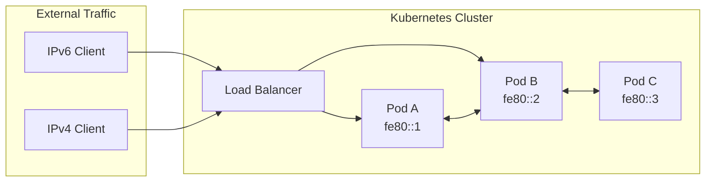
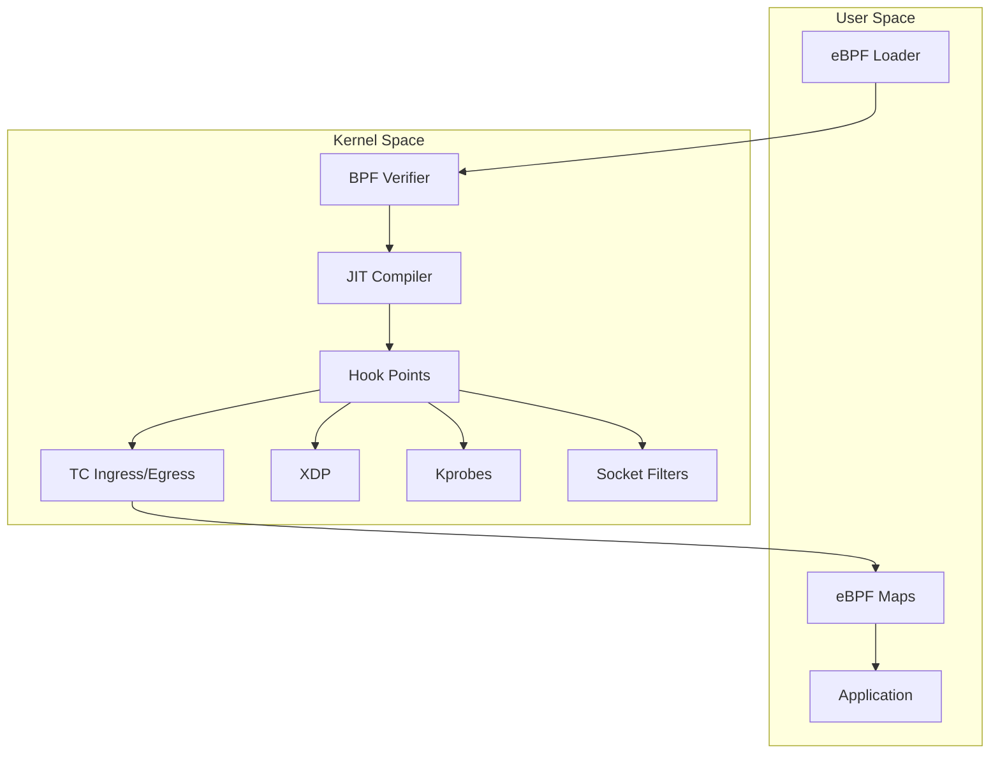

# How to Monitor IPv6 Network Traffic in Kubernetes with eBPF

Author: [nawazdhandala](https://github.com/nawazdhandala)

Tags: IPv6, Kubernetes, eBPF, Monitoring, Networking, Observability

Description: A comprehensive guide to implementing IPv6 network traffic monitoring in Kubernetes clusters using eBPF for deep observability without performance overhead.

---

IPv6 adoption in Kubernetes is accelerating. With IPv4 address exhaustion and cloud providers pushing dual-stack configurations, monitoring IPv6 traffic has become essential. Traditional packet capture tools struggle with the volume and complexity of container networking. eBPF (extended Berkeley Packet Filter) provides kernel-level visibility without the performance penalty of userspace tools.

## Why IPv6 Monitoring Matters in Kubernetes

Kubernetes clusters are increasingly running dual-stack (IPv4/IPv6) or IPv6-only configurations. Here's why you need dedicated IPv6 monitoring:



### The IPv6 Monitoring Challenges

1. **Larger address space** - IPv6 addresses are 128-bit vs 32-bit, making pattern matching and aggregation harder
2. **Extension headers** - IPv6 uses extension headers that can fragment across packets
3. **NDP instead of ARP** - Neighbor Discovery Protocol replaces ARP, requiring different monitoring approaches
4. **Link-local addresses** - Every interface has a link-local address (fe80::/10) that needs tracking
5. **Dual-stack complexity** - Pods may communicate over both IPv4 and IPv6 simultaneously

## Understanding eBPF for Network Monitoring

eBPF allows you to run sandboxed programs in the Linux kernel without modifying kernel source code or loading kernel modules.



### eBPF Hook Points for IPv6 Monitoring

| Hook Point | Use Case | Performance Impact |
|------------|----------|-------------------|
| XDP (eXpress Data Path) | High-performance packet filtering | Lowest |
| TC (Traffic Control) | Per-interface traffic analysis | Low |
| Socket filters | Application-level monitoring | Medium |
| Kprobes | Kernel function tracing | Medium |
| Tracepoints | Stable kernel event monitoring | Low |

## Prerequisites

Before diving into implementation, ensure your cluster meets these requirements.

### Check Kernel Version

eBPF features require Linux kernel 4.15+ for basic functionality, 5.x+ for advanced features.

```bash
# Check kernel version on nodes
kubectl get nodes -o wide

# SSH to a node and verify eBPF support
uname -r
# Expected: 5.4.0 or higher

# Check BPF filesystem is mounted
mount | grep bpf
# Expected: bpf on /sys/fs/bpf type bpf (rw,nosuid,nodev,noexec,relatime)
```

### Verify IPv6 is Enabled

```bash
# Check if IPv6 is enabled on the cluster
kubectl get nodes -o jsonpath='{range .items[*]}{.metadata.name}{"\t"}{.status.addresses[*].address}{"\n"}{end}'

# Verify IPv6 in a pod
kubectl run ipv6-test --image=busybox --rm -it --restart=Never -- cat /proc/net/if_inet6

# Check if your CNI supports IPv6
# For Calico:
kubectl get felixconfigurations default -o yaml | grep -i ipv6

# For Cilium:
kubectl get configmap cilium-config -n kube-system -o yaml | grep -i ipv6
```

### Enable IPv6 in Your CNI

For Cilium (recommended for eBPF-native monitoring):

```yaml
# cilium-config.yaml
apiVersion: v1
kind: ConfigMap
metadata:
  name: cilium-config
  namespace: kube-system
data:
  # Enable IPv6
  enable-ipv6: "true"

  # Enable native routing for IPv6
  ipv6-native-routing-cidr: "fd00::/8"

  # Enable eBPF-based monitoring
  monitor-aggregation: "medium"

  # Enable Hubble for observability
  enable-hubble: "true"
  hubble-listen-address: ":4244"
  hubble-metrics-server: ":9965"

  # Enable IPv6 metrics
  hubble-metrics: "dns,drop,tcp,flow,icmp,http"
```

## Implementing eBPF IPv6 Monitoring

### Option 1: Using Cilium Hubble (Recommended)

Cilium provides built-in eBPF-based network observability through Hubble.

```bash
# Install Cilium with Hubble enabled
cilium install --version 1.14.5 \
  --set ipv6.enabled=true \
  --set hubble.enabled=true \
  --set hubble.relay.enabled=true \
  --set hubble.ui.enabled=true \
  --set hubble.metrics.enabled="{dns,drop,tcp,flow,icmp,http}"

# Verify installation
cilium status

# Enable Hubble
cilium hubble enable

# Port-forward Hubble UI
cilium hubble ui
```

#### Monitor IPv6 Traffic with Hubble CLI

```bash
# Install Hubble CLI
HUBBLE_VERSION=$(curl -s https://raw.githubusercontent.com/cilium/hubble/master/stable.txt)
curl -L --remote-name-all https://github.com/cilium/hubble/releases/download/$HUBBLE_VERSION/hubble-linux-amd64.tar.gz
tar xzvf hubble-linux-amd64.tar.gz
sudo mv hubble /usr/local/bin/

# Port-forward Hubble relay
kubectl port-forward -n kube-system svc/hubble-relay 4245:80 &

# Observe IPv6 traffic
hubble observe --ipv6

# Filter by specific IPv6 address
hubble observe --ip "fd00::1"

# Monitor IPv6 traffic between namespaces
hubble observe --from-namespace production --to-namespace database --ipv6

# Watch for dropped IPv6 packets
hubble observe --verdict DROPPED --ipv6

# Monitor ICMPv6 traffic (NDP, ping6, etc.)
hubble observe --protocol ICMPv6

# Export flows for analysis
hubble observe --ipv6 -o json > ipv6-flows.json
```

### Option 2: Custom eBPF Program for IPv6 Monitoring

For more control, write custom eBPF programs. Here's a complete example using libbpf.

#### IPv6 Packet Counter (eBPF C Code)

```c
// ipv6_monitor.bpf.c
// Compile with: clang -O2 -target bpf -c ipv6_monitor.bpf.c -o ipv6_monitor.bpf.o

#include <linux/bpf.h>
#include <linux/if_ether.h>
#include <linux/ipv6.h>
#include <linux/in6.h>
#include <linux/tcp.h>
#include <linux/udp.h>
#include <bpf/bpf_helpers.h>
#include <bpf/bpf_endian.h>

// Define constants for IPv6 monitoring
#define MAX_ENTRIES 10000
#define IPV6_ADDR_LEN 16

// Structure to store IPv6 flow information
struct ipv6_flow_key {
    __u8 src_addr[IPV6_ADDR_LEN];   // Source IPv6 address (128 bits)
    __u8 dst_addr[IPV6_ADDR_LEN];   // Destination IPv6 address (128 bits)
    __u16 src_port;                  // Source port
    __u16 dst_port;                  // Destination port
    __u8 protocol;                   // Next header (TCP=6, UDP=17, ICMPv6=58)
    __u8 pad[3];                     // Padding for alignment
};

// Structure to store flow statistics
struct ipv6_flow_stats {
    __u64 packets;                   // Packet count
    __u64 bytes;                     // Byte count
    __u64 first_seen;                // First packet timestamp (ns)
    __u64 last_seen;                 // Last packet timestamp (ns)
};

// BPF map to store IPv6 flow statistics
// Using LRU hash to automatically evict old entries
struct {
    __uint(type, BPF_MAP_TYPE_LRU_HASH);
    __uint(max_entries, MAX_ENTRIES);
    __type(key, struct ipv6_flow_key);
    __type(value, struct ipv6_flow_stats);
} ipv6_flows SEC(".maps");

// BPF map for per-CPU packet counters (high performance)
struct {
    __uint(type, BPF_MAP_TYPE_PERCPU_ARRAY);
    __uint(max_entries, 256);        // One entry per next-header protocol
    __type(key, __u32);
    __type(value, __u64);
} protocol_counters SEC(".maps");

// BPF map for dropped packets tracking
struct {
    __uint(type, BPF_MAP_TYPE_PERCPU_ARRAY);
    __uint(max_entries, 1);
    __type(key, __u32);
    __type(value, __u64);
} drop_counter SEC(".maps");

// Helper function to check if address is link-local (fe80::/10)
static __always_inline int is_link_local(const __u8 *addr) {
    return (addr[0] == 0xfe) && ((addr[1] & 0xc0) == 0x80);
}

// Helper function to check if address is multicast (ff00::/8)
static __always_inline int is_multicast(const __u8 *addr) {
    return addr[0] == 0xff;
}

// Helper function to extract ports from TCP/UDP headers
static __always_inline int extract_ports(void *data, void *data_end,
                                          struct ipv6hdr *ip6,
                                          __u16 *src_port, __u16 *dst_port) {
    void *transport_header = (void *)(ip6 + 1);

    // Handle TCP
    if (ip6->nexthdr == IPPROTO_TCP) {
        struct tcphdr *tcp = transport_header;
        if ((void *)(tcp + 1) > data_end)
            return -1;
        *src_port = bpf_ntohs(tcp->source);
        *dst_port = bpf_ntohs(tcp->dest);
        return 0;
    }

    // Handle UDP
    if (ip6->nexthdr == IPPROTO_UDP) {
        struct udphdr *udp = transport_header;
        if ((void *)(udp + 1) > data_end)
            return -1;
        *src_port = bpf_ntohs(udp->source);
        *dst_port = bpf_ntohs(udp->dest);
        return 0;
    }

    // No ports for other protocols (ICMPv6, etc.)
    *src_port = 0;
    *dst_port = 0;
    return 0;
}

// XDP program for high-performance IPv6 monitoring
// Runs at the earliest possible point in the network stack
SEC("xdp")
int xdp_ipv6_monitor(struct xdp_md *ctx) {
    // Get packet data boundaries
    void *data = (void *)(long)ctx->data;
    void *data_end = (void *)(long)ctx->data_end;

    // Parse Ethernet header
    struct ethhdr *eth = data;
    if ((void *)(eth + 1) > data_end)
        return XDP_PASS;

    // Check if this is an IPv6 packet (EtherType 0x86DD)
    if (eth->h_proto != bpf_htons(ETH_P_IPV6))
        return XDP_PASS;

    // Parse IPv6 header
    struct ipv6hdr *ip6 = (void *)(eth + 1);
    if ((void *)(ip6 + 1) > data_end)
        return XDP_PASS;

    // Update protocol counter
    __u32 protocol = ip6->nexthdr;
    __u64 *counter = bpf_map_lookup_elem(&protocol_counters, &protocol);
    if (counter)
        __sync_fetch_and_add(counter, 1);

    // Build flow key
    struct ipv6_flow_key key = {};
    __builtin_memcpy(key.src_addr, &ip6->saddr, IPV6_ADDR_LEN);
    __builtin_memcpy(key.dst_addr, &ip6->daddr, IPV6_ADDR_LEN);
    key.protocol = ip6->nexthdr;

    // Extract ports if TCP/UDP
    extract_ports(data, data_end, ip6, &key.src_port, &key.dst_port);

    // Calculate packet length
    __u64 pkt_len = data_end - data;
    __u64 now = bpf_ktime_get_ns();

    // Update or create flow entry
    struct ipv6_flow_stats *stats = bpf_map_lookup_elem(&ipv6_flows, &key);
    if (stats) {
        // Update existing flow
        __sync_fetch_and_add(&stats->packets, 1);
        __sync_fetch_and_add(&stats->bytes, pkt_len);
        stats->last_seen = now;
    } else {
        // Create new flow entry
        struct ipv6_flow_stats new_stats = {
            .packets = 1,
            .bytes = pkt_len,
            .first_seen = now,
            .last_seen = now,
        };
        bpf_map_update_elem(&ipv6_flows, &key, &new_stats, BPF_ANY);
    }

    // Pass the packet through (we're just monitoring)
    return XDP_PASS;
}

// TC (Traffic Control) program for egress monitoring
// Captures outgoing IPv6 traffic
SEC("tc")
int tc_ipv6_egress(struct __sk_buff *skb) {
    void *data = (void *)(long)skb->data;
    void *data_end = (void *)(long)skb->data_end;

    // Parse Ethernet header
    struct ethhdr *eth = data;
    if ((void *)(eth + 1) > data_end)
        return TC_ACT_OK;

    // Check for IPv6
    if (eth->h_proto != bpf_htons(ETH_P_IPV6))
        return TC_ACT_OK;

    // Parse IPv6 header
    struct ipv6hdr *ip6 = (void *)(eth + 1);
    if ((void *)(ip6 + 1) > data_end)
        return TC_ACT_OK;

    // Log egress traffic (using bpf_trace_printk for debugging)
    // In production, use perf events or ring buffers
    bpf_printk("IPv6 egress: proto=%d, len=%d",
               ip6->nexthdr, bpf_ntohs(ip6->payload_len));

    return TC_ACT_OK;
}

// License declaration (required for BPF programs)
char LICENSE[] SEC("license") = "GPL";
```

#### Userspace Loader (Go)

```go
// main.go
// IPv6 eBPF Monitor - Userspace component
// Build: go build -o ipv6-monitor main.go

package main

import (
	"encoding/binary"
	"encoding/hex"
	"fmt"
	"log"
	"net"
	"os"
	"os/signal"
	"syscall"
	"time"

	"github.com/cilium/ebpf"
	"github.com/cilium/ebpf/link"
	"github.com/cilium/ebpf/rlimit"
)

// IPv6FlowKey matches the eBPF struct
type IPv6FlowKey struct {
	SrcAddr  [16]byte // 128-bit IPv6 source address
	DstAddr  [16]byte // 128-bit IPv6 destination address
	SrcPort  uint16   // Source port
	DstPort  uint16   // Destination port
	Protocol uint8    // Next header protocol
	Pad      [3]byte  // Padding for alignment
}

// IPv6FlowStats matches the eBPF struct
type IPv6FlowStats struct {
	Packets   uint64 // Total packets in this flow
	Bytes     uint64 // Total bytes in this flow
	FirstSeen uint64 // First packet timestamp (nanoseconds)
	LastSeen  uint64 // Last packet timestamp (nanoseconds)
}

// ProtocolNames maps protocol numbers to human-readable names
var ProtocolNames = map[uint8]string{
	6:  "TCP",
	17: "UDP",
	58: "ICMPv6",
	0:  "Hop-by-Hop",
	43: "Routing",
	44: "Fragment",
	50: "ESP",
	51: "AH",
	59: "No Next Header",
	60: "Destination Options",
}

// formatIPv6 converts a 16-byte array to a human-readable IPv6 address
func formatIPv6(addr [16]byte) string {
	ip := net.IP(addr[:])
	return ip.String()
}

// formatDuration converts nanoseconds to a human-readable duration
func formatDuration(ns uint64) string {
	d := time.Duration(ns) * time.Nanosecond
	if d < time.Second {
		return fmt.Sprintf("%dms", d.Milliseconds())
	}
	return d.Round(time.Second).String()
}

// isLinkLocal checks if an IPv6 address is link-local (fe80::/10)
func isLinkLocal(addr [16]byte) bool {
	return addr[0] == 0xfe && (addr[1]&0xc0) == 0x80
}

// isMulticast checks if an IPv6 address is multicast (ff00::/8)
func isMulticast(addr [16]byte) bool {
	return addr[0] == 0xff
}

func main() {
	// Remove memory lock limit for eBPF
	// This is required for loading BPF maps
	if err := rlimit.RemoveMemlock(); err != nil {
		log.Fatalf("Failed to remove memlock limit: %v", err)
	}

	// Get network interface from command line
	if len(os.Args) < 2 {
		log.Fatal("Usage: ipv6-monitor <interface>")
	}
	ifaceName := os.Args[1]

	// Get interface index
	iface, err := net.InterfaceByName(ifaceName)
	if err != nil {
		log.Fatalf("Failed to find interface %s: %v", ifaceName, err)
	}

	// Load the compiled eBPF program
	spec, err := ebpf.LoadCollectionSpec("ipv6_monitor.bpf.o")
	if err != nil {
		log.Fatalf("Failed to load eBPF spec: %v", err)
	}

	// Create the eBPF collection (programs and maps)
	coll, err := ebpf.NewCollection(spec)
	if err != nil {
		log.Fatalf("Failed to create eBPF collection: %v", err)
	}
	defer coll.Close()

	// Attach XDP program to the interface
	xdpLink, err := link.AttachXDP(link.XDPOptions{
		Program:   coll.Programs["xdp_ipv6_monitor"],
		Interface: iface.Index,
		Flags:     link.XDPGenericMode, // Use generic mode for compatibility
	})
	if err != nil {
		log.Fatalf("Failed to attach XDP program: %v", err)
	}
	defer xdpLink.Close()

	log.Printf("eBPF IPv6 monitor attached to %s (index %d)", ifaceName, iface.Index)
	log.Println("Press Ctrl+C to stop...")

	// Get references to the BPF maps
	flowsMap := coll.Maps["ipv6_flows"]
	protocolMap := coll.Maps["protocol_counters"]

	// Setup signal handler for graceful shutdown
	sig := make(chan os.Signal, 1)
	signal.Notify(sig, syscall.SIGINT, syscall.SIGTERM)

	// Ticker for periodic stats output
	ticker := time.NewTicker(5 * time.Second)
	defer ticker.Stop()

	// Main monitoring loop
	for {
		select {
		case <-sig:
			log.Println("Shutting down...")
			printFinalStats(flowsMap, protocolMap)
			return
		case <-ticker.C:
			printStats(flowsMap, protocolMap)
		}
	}
}

// printStats outputs current monitoring statistics
func printStats(flowsMap, protocolMap *ebpf.Map) {
	fmt.Println("\n========== IPv6 Traffic Statistics ==========")
	fmt.Printf("Timestamp: %s\n\n", time.Now().Format(time.RFC3339))

	// Print protocol counters
	fmt.Println("--- Protocol Distribution ---")
	var key uint32
	var value uint64
	iter := protocolMap.Iterate()
	for iter.Next(&key, &value) {
		if value > 0 {
			protoName := ProtocolNames[uint8(key)]
			if protoName == "" {
				protoName = fmt.Sprintf("Protocol-%d", key)
			}
			fmt.Printf("  %s: %d packets\n", protoName, value)
		}
	}

	// Print top flows
	fmt.Println("\n--- Active IPv6 Flows (Top 10) ---")
	fmt.Printf("%-45s %-45s %-8s %-10s %-12s\n",
		"Source", "Destination", "Proto", "Packets", "Bytes")
	fmt.Println(strings.Repeat("-", 130))

	var flowKey IPv6FlowKey
	var flowStats IPv6FlowStats
	flowIter := flowsMap.Iterate()
	count := 0
	for flowIter.Next(&flowKey, &flowStats) && count < 10 {
		srcAddr := formatIPv6(flowKey.SrcAddr)
		dstAddr := formatIPv6(flowKey.DstAddr)

		// Add port info if available
		if flowKey.SrcPort > 0 {
			srcAddr = fmt.Sprintf("[%s]:%d", srcAddr, flowKey.SrcPort)
		}
		if flowKey.DstPort > 0 {
			dstAddr = fmt.Sprintf("[%s]:%d", dstAddr, flowKey.DstPort)
		}

		protoName := ProtocolNames[flowKey.Protocol]
		if protoName == "" {
			protoName = fmt.Sprintf("%d", flowKey.Protocol)
		}

		fmt.Printf("%-45s %-45s %-8s %-10d %-12d\n",
			srcAddr, dstAddr, protoName, flowStats.Packets, flowStats.Bytes)
		count++
	}
}

// printFinalStats outputs final summary before shutdown
func printFinalStats(flowsMap, protocolMap *ebpf.Map) {
	fmt.Println("\n========== Final IPv6 Traffic Summary ==========")

	var totalPackets, totalBytes uint64
	var flowKey IPv6FlowKey
	var flowStats IPv6FlowStats
	flowCount := 0

	iter := flowsMap.Iterate()
	for iter.Next(&flowKey, &flowStats) {
		totalPackets += flowStats.Packets
		totalBytes += flowStats.Bytes
		flowCount++
	}

	fmt.Printf("Total unique flows: %d\n", flowCount)
	fmt.Printf("Total packets: %d\n", totalPackets)
	fmt.Printf("Total bytes: %d (%.2f MB)\n", totalBytes, float64(totalBytes)/(1024*1024))
}
```

#### Build and Deploy Script

```bash
#!/bin/bash
# build-and-deploy.sh
# Script to build and deploy the IPv6 eBPF monitor

set -e

echo "=== Building IPv6 eBPF Monitor ==="

# Check for required tools
command -v clang >/dev/null 2>&1 || { echo "clang is required"; exit 1; }
command -v go >/dev/null 2>&1 || { echo "go is required"; exit 1; }
command -v kubectl >/dev/null 2>&1 || { echo "kubectl is required"; exit 1; }

# Set variables
BPF_CLANG_FLAGS="-O2 -g -target bpf"
KERNEL_HEADERS="/usr/include"

# Compile eBPF program
echo "Compiling eBPF program..."
clang $BPF_CLANG_FLAGS \
    -I$KERNEL_HEADERS \
    -c ipv6_monitor.bpf.c \
    -o ipv6_monitor.bpf.o

# Verify the compiled object
echo "Verifying eBPF object..."
llvm-objdump -S ipv6_monitor.bpf.o | head -50

# Build Go userspace program
echo "Building userspace loader..."
CGO_ENABLED=0 go build -o ipv6-monitor main.go

echo "=== Build complete ==="
echo "Binary: ./ipv6-monitor"
echo "Usage: ./ipv6-monitor <interface>"
```

### Option 3: Deploy as DaemonSet

Deploy the eBPF monitor across all nodes using a DaemonSet.

```yaml
# ipv6-monitor-daemonset.yaml
# DaemonSet to deploy IPv6 eBPF monitor on all nodes
apiVersion: apps/v1
kind: DaemonSet
metadata:
  name: ipv6-ebpf-monitor
  namespace: monitoring
  labels:
    app: ipv6-monitor
    component: ebpf
spec:
  selector:
    matchLabels:
      app: ipv6-monitor
  template:
    metadata:
      labels:
        app: ipv6-monitor
      annotations:
        # Prometheus scrape configuration
        prometheus.io/scrape: "true"
        prometheus.io/port: "9100"
        prometheus.io/path: "/metrics"
    spec:
      # Run on all nodes including control plane
      tolerations:
        - operator: Exists
      # Use host network to monitor node-level traffic
      hostNetwork: true
      hostPID: true
      # Run as privileged for eBPF
      containers:
        - name: ipv6-monitor
          image: your-registry/ipv6-ebpf-monitor:latest
          # Privileged required for eBPF
          securityContext:
            privileged: true
            capabilities:
              add:
                - SYS_ADMIN      # Required for BPF
                - NET_ADMIN      # Required for network monitoring
                - SYS_PTRACE     # Required for tracing
                - SYS_RESOURCE   # Required for memlock
          # Resource limits
          resources:
            requests:
              cpu: 100m
              memory: 128Mi
            limits:
              cpu: 500m
              memory: 512Mi
          # Mount required filesystems
          volumeMounts:
            # BPF filesystem for maps
            - name: bpf-fs
              mountPath: /sys/fs/bpf
            # Debug filesystem for tracing
            - name: debug-fs
              mountPath: /sys/kernel/debug
            # Kernel headers for BTF
            - name: modules
              mountPath: /lib/modules
              readOnly: true
          # Environment variables
          env:
            # Interface to monitor (usually the main CNI interface)
            - name: MONITOR_INTERFACE
              value: "eth0"
            # Metrics port
            - name: METRICS_PORT
              value: "9100"
            # Log level
            - name: LOG_LEVEL
              value: "info"
            # Node name from downward API
            - name: NODE_NAME
              valueFrom:
                fieldRef:
                  fieldPath: spec.nodeName
          # Health checks
          livenessProbe:
            httpGet:
              path: /healthz
              port: 9100
            initialDelaySeconds: 10
            periodSeconds: 30
          readinessProbe:
            httpGet:
              path: /ready
              port: 9100
            initialDelaySeconds: 5
            periodSeconds: 10
      # Required volumes
      volumes:
        - name: bpf-fs
          hostPath:
            path: /sys/fs/bpf
            type: DirectoryOrCreate
        - name: debug-fs
          hostPath:
            path: /sys/kernel/debug
            type: Directory
        - name: modules
          hostPath:
            path: /lib/modules
            type: Directory
      # Service account with required permissions
      serviceAccountName: ipv6-monitor
---
# ServiceAccount for the monitor
apiVersion: v1
kind: ServiceAccount
metadata:
  name: ipv6-monitor
  namespace: monitoring
---
# ClusterRole for node access
apiVersion: rbac.authorization.k8s.io/v1
kind: ClusterRole
metadata:
  name: ipv6-monitor
rules:
  - apiGroups: [""]
    resources: ["nodes", "pods", "namespaces"]
    verbs: ["get", "list", "watch"]
  - apiGroups: [""]
    resources: ["nodes/proxy"]
    verbs: ["get"]
---
# ClusterRoleBinding
apiVersion: rbac.authorization.k8s.io/v1
kind: ClusterRoleBinding
metadata:
  name: ipv6-monitor
roleRef:
  apiGroup: rbac.authorization.k8s.io
  kind: ClusterRole
  name: ipv6-monitor
subjects:
  - kind: ServiceAccount
    name: ipv6-monitor
    namespace: monitoring
---
# Service for Prometheus scraping
apiVersion: v1
kind: Service
metadata:
  name: ipv6-monitor-metrics
  namespace: monitoring
  labels:
    app: ipv6-monitor
spec:
  selector:
    app: ipv6-monitor
  ports:
    - name: metrics
      port: 9100
      targetPort: 9100
  clusterIP: None  # Headless for direct pod access
```

## Prometheus Metrics for IPv6 Monitoring

Export eBPF data as Prometheus metrics for integration with existing monitoring.

```go
// metrics.go
// Prometheus metrics exporter for IPv6 eBPF data

package main

import (
	"net/http"
	"sync"
	"time"

	"github.com/prometheus/client_golang/prometheus"
	"github.com/prometheus/client_golang/prometheus/promhttp"
)

// IPv6Metrics holds all Prometheus metrics for IPv6 monitoring
type IPv6Metrics struct {
	// Counter for total IPv6 packets by protocol
	packetsTotal *prometheus.CounterVec

	// Counter for total IPv6 bytes by protocol
	bytesTotal *prometheus.CounterVec

	// Gauge for active flow count
	activeFlows prometheus.Gauge

	// Histogram for packet sizes
	packetSize prometheus.Histogram

	// Counter for dropped packets
	droppedPackets prometheus.Counter

	// Gauge for flows by address type
	flowsByType *prometheus.GaugeVec

	// Counter for ICMPv6 message types
	icmpv6Types *prometheus.CounterVec
}

// NewIPv6Metrics creates and registers all Prometheus metrics
func NewIPv6Metrics(registry *prometheus.Registry) *IPv6Metrics {
	m := &IPv6Metrics{
		// Total packets counter with protocol label
		packetsTotal: prometheus.NewCounterVec(
			prometheus.CounterOpts{
				Name: "ipv6_packets_total",
				Help: "Total number of IPv6 packets processed",
			},
			[]string{"protocol", "direction", "node"},
		),

		// Total bytes counter with protocol label
		bytesTotal: prometheus.NewCounterVec(
			prometheus.CounterOpts{
				Name: "ipv6_bytes_total",
				Help: "Total bytes of IPv6 traffic processed",
			},
			[]string{"protocol", "direction", "node"},
		),

		// Active flows gauge
		activeFlows: prometheus.NewGauge(
			prometheus.GaugeOpts{
				Name: "ipv6_active_flows",
				Help: "Number of currently active IPv6 flows",
			},
		),

		// Packet size histogram with IPv6-appropriate buckets
		packetSize: prometheus.NewHistogram(
			prometheus.HistogramOpts{
				Name:    "ipv6_packet_size_bytes",
				Help:    "Distribution of IPv6 packet sizes",
				Buckets: []float64{64, 128, 256, 512, 1024, 1280, 1500, 4096, 9000},
			},
		),

		// Dropped packets counter
		droppedPackets: prometheus.NewCounter(
			prometheus.CounterOpts{
				Name: "ipv6_dropped_packets_total",
				Help: "Total number of dropped IPv6 packets",
			},
		),

		// Flows by address type (link-local, global, multicast)
		flowsByType: prometheus.NewGaugeVec(
			prometheus.GaugeOpts{
				Name: "ipv6_flows_by_type",
				Help: "Number of flows by IPv6 address type",
			},
			[]string{"type"},
		),

		// ICMPv6 message types counter
		icmpv6Types: prometheus.NewCounterVec(
			prometheus.CounterOpts{
				Name: "ipv6_icmpv6_messages_total",
				Help: "Total ICMPv6 messages by type",
			},
			[]string{"type", "code"},
		),
	}

	// Register all metrics
	registry.MustRegister(
		m.packetsTotal,
		m.bytesTotal,
		m.activeFlows,
		m.packetSize,
		m.droppedPackets,
		m.flowsByType,
		m.icmpv6Types,
	)

	return m
}

// RecordPacket records a single packet observation
func (m *IPv6Metrics) RecordPacket(protocol, direction, node string, size float64) {
	m.packetsTotal.WithLabelValues(protocol, direction, node).Inc()
	m.bytesTotal.WithLabelValues(protocol, direction, node).Add(size)
	m.packetSize.Observe(size)
}

// UpdateActiveFlows updates the active flow count
func (m *IPv6Metrics) UpdateActiveFlows(count float64) {
	m.activeFlows.Set(count)
}

// RecordDrop records a dropped packet
func (m *IPv6Metrics) RecordDrop() {
	m.droppedPackets.Inc()
}

// UpdateFlowTypes updates flow counts by address type
func (m *IPv6Metrics) UpdateFlowTypes(global, linkLocal, multicast int) {
	m.flowsByType.WithLabelValues("global").Set(float64(global))
	m.flowsByType.WithLabelValues("link_local").Set(float64(linkLocal))
	m.flowsByType.WithLabelValues("multicast").Set(float64(multicast))
}

// RecordICMPv6 records an ICMPv6 message
func (m *IPv6Metrics) RecordICMPv6(msgType, code string) {
	m.icmpv6Types.WithLabelValues(msgType, code).Inc()
}

// StartMetricsServer starts the Prometheus HTTP server
func StartMetricsServer(addr string, registry *prometheus.Registry) *http.Server {
	mux := http.NewServeMux()

	// Prometheus metrics endpoint
	mux.Handle("/metrics", promhttp.HandlerFor(registry, promhttp.HandlerOpts{}))

	// Health check endpoint
	mux.HandleFunc("/healthz", func(w http.ResponseWriter, r *http.Request) {
		w.WriteHeader(http.StatusOK)
		w.Write([]byte("ok"))
	})

	// Readiness endpoint
	mux.HandleFunc("/ready", func(w http.ResponseWriter, r *http.Request) {
		w.WriteHeader(http.StatusOK)
		w.Write([]byte("ready"))
	})

	server := &http.Server{
		Addr:    addr,
		Handler: mux,
	}

	go func() {
		if err := server.ListenAndServe(); err != http.ErrServerClosed {
			log.Printf("Metrics server error: %v", err)
		}
	}()

	return server
}
```

### Prometheus Scrape Configuration

```yaml
# prometheus-scrape-config.yaml
# Add to your Prometheus configuration

scrape_configs:
  # Scrape IPv6 eBPF monitors
  - job_name: 'ipv6-ebpf-monitor'
    kubernetes_sd_configs:
      - role: pod
    relabel_configs:
      # Only scrape pods with the ipv6-monitor label
      - source_labels: [__meta_kubernetes_pod_label_app]
        action: keep
        regex: ipv6-monitor
      # Use pod IP for scraping
      - source_labels: [__meta_kubernetes_pod_ip]
        action: replace
        target_label: __address__
        regex: (.+)
        replacement: ${1}:9100
      # Add node name label
      - source_labels: [__meta_kubernetes_pod_node_name]
        action: replace
        target_label: node
      # Add namespace label
      - source_labels: [__meta_kubernetes_namespace]
        action: replace
        target_label: namespace
```

### Grafana Dashboard

```json
{
  "title": "IPv6 Network Traffic - eBPF",
  "uid": "ipv6-ebpf-dashboard",
  "description": "IPv6 traffic monitoring using eBPF",
  "panels": [
    {
      "title": "IPv6 Packets per Second by Protocol",
      "type": "timeseries",
      "gridPos": { "x": 0, "y": 0, "w": 12, "h": 8 },
      "targets": [
        {
          "expr": "rate(ipv6_packets_total[5m])",
          "legendFormat": "{{protocol}} - {{direction}} - {{node}}"
        }
      ]
    },
    {
      "title": "IPv6 Traffic Bandwidth",
      "type": "timeseries",
      "gridPos": { "x": 12, "y": 0, "w": 12, "h": 8 },
      "targets": [
        {
          "expr": "rate(ipv6_bytes_total[5m]) * 8",
          "legendFormat": "{{protocol}} - {{direction}}"
        }
      ],
      "fieldConfig": {
        "defaults": {
          "unit": "bps"
        }
      }
    },
    {
      "title": "Active IPv6 Flows",
      "type": "stat",
      "gridPos": { "x": 0, "y": 8, "w": 6, "h": 4 },
      "targets": [
        {
          "expr": "sum(ipv6_active_flows)"
        }
      ]
    },
    {
      "title": "Dropped Packets",
      "type": "stat",
      "gridPos": { "x": 6, "y": 8, "w": 6, "h": 4 },
      "targets": [
        {
          "expr": "sum(rate(ipv6_dropped_packets_total[5m]))"
        }
      ],
      "fieldConfig": {
        "defaults": {
          "thresholds": {
            "mode": "absolute",
            "steps": [
              { "color": "green", "value": null },
              { "color": "yellow", "value": 10 },
              { "color": "red", "value": 100 }
            ]
          }
        }
      }
    },
    {
      "title": "Flows by Address Type",
      "type": "piechart",
      "gridPos": { "x": 12, "y": 8, "w": 6, "h": 8 },
      "targets": [
        {
          "expr": "sum(ipv6_flows_by_type) by (type)",
          "legendFormat": "{{type}}"
        }
      ]
    },
    {
      "title": "Packet Size Distribution",
      "type": "histogram",
      "gridPos": { "x": 18, "y": 8, "w": 6, "h": 8 },
      "targets": [
        {
          "expr": "rate(ipv6_packet_size_bytes_bucket[5m])",
          "format": "heatmap"
        }
      ]
    },
    {
      "title": "ICMPv6 Messages",
      "type": "timeseries",
      "gridPos": { "x": 0, "y": 12, "w": 12, "h": 8 },
      "targets": [
        {
          "expr": "rate(ipv6_icmpv6_messages_total[5m])",
          "legendFormat": "Type {{type}} Code {{code}}"
        }
      ]
    }
  ]
}
```

## Monitoring Specific IPv6 Scenarios

### Monitor Neighbor Discovery Protocol (NDP)

NDP is critical for IPv6 operation. Monitor these ICMPv6 types:

```c
// ndp_monitor.bpf.c
// Monitor IPv6 Neighbor Discovery Protocol messages

#include <linux/bpf.h>
#include <linux/if_ether.h>
#include <linux/ipv6.h>
#include <linux/icmpv6.h>
#include <bpf/bpf_helpers.h>

// ICMPv6 NDP message types
#define ICMPV6_ROUTER_SOLICITATION    133
#define ICMPV6_ROUTER_ADVERTISEMENT   134
#define ICMPV6_NEIGHBOR_SOLICITATION  135
#define ICMPV6_NEIGHBOR_ADVERTISEMENT 136
#define ICMPV6_REDIRECT               137

// Structure for NDP events
struct ndp_event {
    __u64 timestamp;               // Event timestamp
    __u8 src_addr[16];             // Source IPv6 address
    __u8 dst_addr[16];             // Destination IPv6 address
    __u8 target_addr[16];          // Target address (for NS/NA)
    __u8 type;                     // ICMPv6 type
    __u8 code;                     // ICMPv6 code
    __u16 pad;                     // Padding
};

// Ring buffer for NDP events
struct {
    __uint(type, BPF_MAP_TYPE_RINGBUF);
    __uint(max_entries, 256 * 1024);  // 256KB ring buffer
} ndp_events SEC(".maps");

// Counter for NDP message types
struct {
    __uint(type, BPF_MAP_TYPE_PERCPU_ARRAY);
    __uint(max_entries, 256);
    __type(key, __u32);
    __type(value, __u64);
} ndp_counters SEC(".maps");

SEC("xdp")
int xdp_ndp_monitor(struct xdp_md *ctx) {
    void *data = (void *)(long)ctx->data;
    void *data_end = (void *)(long)ctx->data_end;

    // Parse Ethernet header
    struct ethhdr *eth = data;
    if ((void *)(eth + 1) > data_end)
        return XDP_PASS;

    // Check for IPv6
    if (eth->h_proto != bpf_htons(ETH_P_IPV6))
        return XDP_PASS;

    // Parse IPv6 header
    struct ipv6hdr *ip6 = (void *)(eth + 1);
    if ((void *)(ip6 + 1) > data_end)
        return XDP_PASS;

    // Check for ICMPv6 (next header = 58)
    if (ip6->nexthdr != IPPROTO_ICMPV6)
        return XDP_PASS;

    // Parse ICMPv6 header
    struct icmp6hdr *icmp6 = (void *)(ip6 + 1);
    if ((void *)(icmp6 + 1) > data_end)
        return XDP_PASS;

    // Check if this is an NDP message
    __u8 type = icmp6->icmp6_type;
    if (type < ICMPV6_ROUTER_SOLICITATION || type > ICMPV6_REDIRECT)
        return XDP_PASS;

    // Update counter
    __u32 key = type;
    __u64 *counter = bpf_map_lookup_elem(&ndp_counters, &key);
    if (counter)
        __sync_fetch_and_add(counter, 1);

    // Reserve space in ring buffer for event
    struct ndp_event *event = bpf_ringbuf_reserve(&ndp_events,
                                                   sizeof(*event), 0);
    if (!event)
        return XDP_PASS;

    // Fill event data
    event->timestamp = bpf_ktime_get_ns();
    __builtin_memcpy(event->src_addr, &ip6->saddr, 16);
    __builtin_memcpy(event->dst_addr, &ip6->daddr, 16);
    event->type = type;
    event->code = icmp6->icmp6_code;

    // Extract target address for NS/NA messages
    if (type == ICMPV6_NEIGHBOR_SOLICITATION ||
        type == ICMPV6_NEIGHBOR_ADVERTISEMENT) {
        // Target address follows ICMPv6 header
        __u8 *target = (__u8 *)(icmp6 + 1);
        if ((void *)(target + 16) <= data_end) {
            __builtin_memcpy(event->target_addr, target, 16);
        }
    }

    // Submit event to userspace
    bpf_ringbuf_submit(event, 0);

    return XDP_PASS;
}

char LICENSE[] SEC("license") = "GPL";
```

### Monitor IPv6 Extension Headers

IPv6 extension headers can indicate fragmentation, routing, or security issues.

```c
// extension_header_monitor.bpf.c
// Monitor IPv6 extension headers for anomalies

#include <linux/bpf.h>
#include <linux/if_ether.h>
#include <linux/ipv6.h>
#include <bpf/bpf_helpers.h>

// IPv6 extension header types
#define IPV6_EXT_HOP_BY_HOP    0
#define IPV6_EXT_ROUTING       43
#define IPV6_EXT_FRAGMENT      44
#define IPV6_EXT_ESP           50
#define IPV6_EXT_AUTH          51
#define IPV6_EXT_DEST_OPTS     60

// Extension header statistics
struct ext_header_stats {
    __u64 count;                    // Number of packets with this header
    __u64 total_length;             // Total bytes in these headers
    __u64 max_chain_depth;          // Maximum extension header chain depth
};

// Map for extension header statistics
struct {
    __uint(type, BPF_MAP_TYPE_HASH);
    __uint(max_entries, 256);
    __type(key, __u8);              // Extension header type
    __type(value, struct ext_header_stats);
} ext_header_map SEC(".maps");

// Alert map for suspicious patterns
struct {
    __uint(type, BPF_MAP_TYPE_PERF_EVENT_ARRAY);
    __uint(key_size, sizeof(__u32));
    __uint(value_size, sizeof(__u32));
} alerts SEC(".maps");

// Structure for extension header alert
struct ext_alert {
    __u64 timestamp;
    __u8 src_addr[16];
    __u8 dst_addr[16];
    __u8 alert_type;                // 1=deep chain, 2=fragment, 3=routing
    __u8 chain_depth;
    __u16 pad;
};

// Parse extension header chain
static __always_inline int parse_ext_headers(struct ipv6hdr *ip6,
                                              void *data_end,
                                              __u8 *chain_depth) {
    __u8 next_header = ip6->nexthdr;
    void *header = (void *)(ip6 + 1);
    *chain_depth = 0;

    // Limit parsing to prevent infinite loops (max 8 headers)
    #pragma unroll
    for (int i = 0; i < 8; i++) {
        if (header >= data_end)
            break;

        // Check if this is an extension header
        switch (next_header) {
            case IPV6_EXT_HOP_BY_HOP:
            case IPV6_EXT_ROUTING:
            case IPV6_EXT_DEST_OPTS: {
                // These have length field
                struct ipv6_opt_hdr *opt = header;
                if ((void *)(opt + 1) > data_end)
                    return -1;

                // Update stats
                struct ext_header_stats *stats;
                stats = bpf_map_lookup_elem(&ext_header_map, &next_header);
                if (stats) {
                    __sync_fetch_and_add(&stats->count, 1);
                    __sync_fetch_and_add(&stats->total_length,
                                        (opt->hdrlen + 1) * 8);
                }

                next_header = opt->nexthdr;
                header = (void *)opt + (opt->hdrlen + 1) * 8;
                (*chain_depth)++;
                break;
            }
            case IPV6_EXT_FRAGMENT: {
                // Fragment header is fixed 8 bytes
                struct frag_hdr *frag = header;
                if ((void *)(frag + 1) > data_end)
                    return -1;

                // Update stats
                struct ext_header_stats *stats;
                stats = bpf_map_lookup_elem(&ext_header_map, &next_header);
                if (stats) {
                    __sync_fetch_and_add(&stats->count, 1);
                    __sync_fetch_and_add(&stats->total_length, 8);
                }

                next_header = frag->nexthdr;
                header = (void *)(frag + 1);
                (*chain_depth)++;
                break;
            }
            case IPV6_EXT_ESP:
            case IPV6_EXT_AUTH:
                // Stop parsing at security headers
                return 0;
            default:
                // Reached upper layer protocol
                return 0;
        }
    }

    return 0;
}

SEC("xdp")
int xdp_ext_header_monitor(struct xdp_md *ctx) {
    void *data = (void *)(long)ctx->data;
    void *data_end = (void *)(long)ctx->data_end;

    struct ethhdr *eth = data;
    if ((void *)(eth + 1) > data_end)
        return XDP_PASS;

    if (eth->h_proto != bpf_htons(ETH_P_IPV6))
        return XDP_PASS;

    struct ipv6hdr *ip6 = (void *)(eth + 1);
    if ((void *)(ip6 + 1) > data_end)
        return XDP_PASS;

    __u8 chain_depth = 0;
    parse_ext_headers(ip6, data_end, &chain_depth);

    // Alert on deep extension header chains (potential evasion)
    if (chain_depth > 3) {
        struct ext_alert alert = {
            .timestamp = bpf_ktime_get_ns(),
            .alert_type = 1,
            .chain_depth = chain_depth,
        };
        __builtin_memcpy(alert.src_addr, &ip6->saddr, 16);
        __builtin_memcpy(alert.dst_addr, &ip6->daddr, 16);
        bpf_perf_event_output(ctx, &alerts, BPF_F_CURRENT_CPU,
                             &alert, sizeof(alert));
    }

    return XDP_PASS;
}

char LICENSE[] SEC("license") = "GPL";
```

## Troubleshooting Common Issues

### Issue 1: eBPF Program Won't Load

```bash
# Check kernel BTF support
ls /sys/kernel/btf/vmlinux

# If missing, install BTF-enabled kernel or generate BTF
# For Ubuntu/Debian:
apt install linux-image-$(uname -r)-dbgsym

# Verify BPF filesystem
mount | grep bpf
# If not mounted:
mount -t bpf bpf /sys/fs/bpf

# Check capabilities
capsh --print | grep cap_bpf
```

### Issue 2: No IPv6 Traffic Captured

```bash
# Verify IPv6 is enabled on the node
sysctl net.ipv6.conf.all.disable_ipv6
# Should be 0

# Check interface has IPv6 address
ip -6 addr show eth0

# Verify CNI IPv6 configuration
kubectl get pods -o wide | grep -v "^NAME" | while read line; do
    pod=$(echo $line | awk '{print $1}')
    ns=$(echo $line | awk '{print $2}')
    kubectl exec $pod -n $ns -- cat /proc/net/if_inet6 2>/dev/null | head -1
done

# Test IPv6 connectivity between pods
kubectl run test1 --image=busybox --rm -it -- ping6 -c 3 <pod-ipv6-address>
```

### Issue 3: High CPU Usage

```bash
# Check eBPF program complexity
bpftool prog show

# View program statistics
bpftool prog profile id <prog_id> duration 10

# Reduce map sizes if needed
# In your BPF code, reduce MAX_ENTRIES

# Use per-CPU maps to avoid lock contention
# Change BPF_MAP_TYPE_HASH to BPF_MAP_TYPE_PERCPU_HASH
```

### Issue 4: Missing Packets

```bash
# Check for kernel drops
cat /proc/net/softnet_stat

# Verify XDP mode (native vs generic)
ip link show eth0 | grep xdp

# Use native mode if available
ip link set eth0 xdp obj ipv6_monitor.bpf.o sec xdp

# Check ring buffer overflows
cat /sys/kernel/debug/tracing/trace_pipe | grep -i "lost"
```

## Best Practices Summary

| Practice | Description | Priority |
|----------|-------------|----------|
| Use native XDP mode | Better performance than generic mode | High |
| Implement per-CPU maps | Avoid lock contention in hot paths | High |
| Set appropriate map sizes | Balance memory vs tracking capability | Medium |
| Use ring buffers for events | More efficient than perf buffers | Medium |
| Monitor extension headers | Detect evasion and fragmentation attacks | Medium |
| Track NDP traffic | Essential for IPv6 network health | High |
| Export Prometheus metrics | Integrate with existing monitoring | High |
| Set resource limits | Prevent eBPF from consuming excess resources | Medium |
| Use BTF for portability | Programs work across kernel versions | Medium |
| Implement health checks | Ensure monitor is functioning | High |

## Complete Deployment Checklist

- [ ] Verify kernel version (5.x+ recommended)
- [ ] Enable IPv6 in CNI configuration
- [ ] Mount BPF filesystem on all nodes
- [ ] Deploy eBPF monitor as DaemonSet
- [ ] Configure Prometheus scraping
- [ ] Import Grafana dashboards
- [ ] Set up alerting rules for:
  - [ ] High packet drop rates
  - [ ] Unusual NDP activity
  - [ ] Deep extension header chains
  - [ ] Traffic spikes
- [ ] Test with sample workloads
- [ ] Document baseline metrics
- [ ] Configure log retention

## Alerting Rules

```yaml
# prometheus-alerts.yaml
# Alerting rules for IPv6 eBPF monitoring

groups:
  - name: ipv6-ebpf-alerts
    rules:
      # High IPv6 packet drop rate
      - alert: IPv6HighDropRate
        expr: rate(ipv6_dropped_packets_total[5m]) > 100
        for: 5m
        labels:
          severity: warning
        annotations:
          summary: "High IPv6 packet drop rate on {{ $labels.node }}"
          description: "IPv6 packet drops are {{ $value }} per second"

      # Unusual NDP activity (potential attack)
      - alert: IPv6NDPAnomaly
        expr: rate(ipv6_icmpv6_messages_total{type="135"}[5m]) > 1000
        for: 2m
        labels:
          severity: critical
        annotations:
          summary: "Unusual NDP solicitation activity on {{ $labels.node }}"
          description: "High rate of Neighbor Solicitation messages detected"

      # No IPv6 traffic (potential connectivity issue)
      - alert: IPv6NoTraffic
        expr: sum(rate(ipv6_packets_total[5m])) == 0
        for: 10m
        labels:
          severity: warning
        annotations:
          summary: "No IPv6 traffic detected"
          description: "No IPv6 packets observed for 10 minutes"

      # eBPF monitor down
      - alert: IPv6MonitorDown
        expr: up{job="ipv6-ebpf-monitor"} == 0
        for: 2m
        labels:
          severity: critical
        annotations:
          summary: "IPv6 eBPF monitor is down on {{ $labels.node }}"
          description: "The IPv6 monitoring daemon is not responding"
```

---

eBPF provides the most efficient way to monitor IPv6 traffic in Kubernetes without impacting application performance. Start with Cilium Hubble for quick wins, then add custom eBPF programs for specific monitoring needs. The key is capturing the right data - flow statistics, NDP activity, and extension header anomalies - while keeping overhead minimal. With proper alerting and dashboards, you'll have complete visibility into your cluster's IPv6 network behavior.
