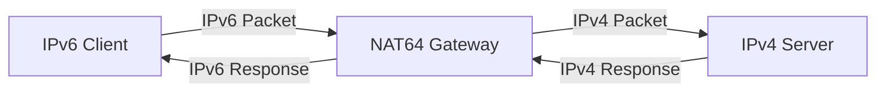
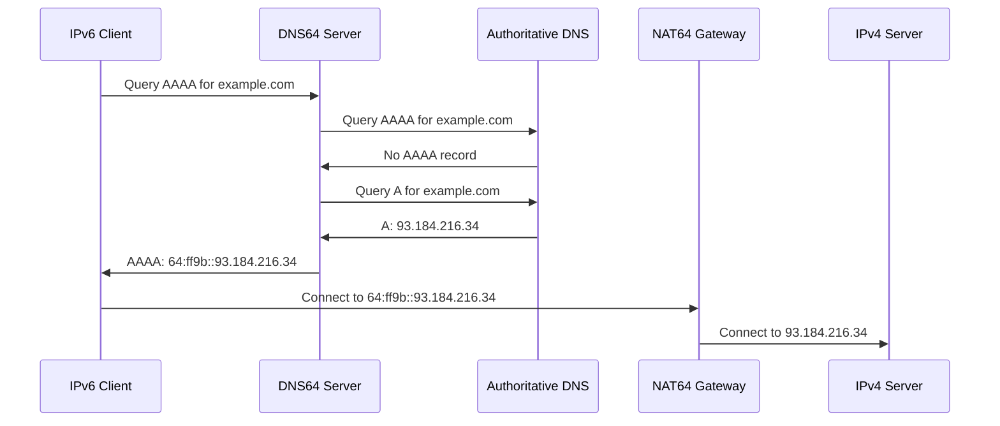

# How to Set Up NAT64 and DNS64 for IPv6-Only Networks

Author: [nawazdhandala](https://github.com/nawazdhandala)

Tags: IPv6, NAT64, DNS64, Networking, Infrastructure, DevOps

Description: A comprehensive guide to configuring NAT64 and DNS64 to enable IPv6-only networks to communicate with legacy IPv4 services, with practical examples and best practices.

---

IPv4 addresses are exhausted. IPv6 adoption is accelerating. But there's a problem: much of the internet still runs on IPv4. If you're building an IPv6-only network (and you should be), you need a way to reach those legacy IPv4 destinations.

Enter NAT64 and DNS64 - the bridge between IPv6-only clients and the IPv4 world.

## Why IPv6-Only Networks?

Before diving into configuration, let's understand why you'd want an IPv6-only network:

**Simplified network management.** No more dual-stack complexity. One protocol to rule, debug, and secure.

**Address abundance.** IPv6 gives you 340 undecillion addresses. No more NAT gymnastics, no more address exhaustion planning.

**Better for mobile and IoT.** Devices can have globally routable addresses without NAT traversal issues.

**Future-proof.** IPv4 is legacy. The internet is moving to IPv6 whether we like it or not.

Major cloud providers (AWS, Google Cloud, Azure) and mobile carriers already support IPv6-only networks. Apple requires apps to work in IPv6-only environments.

---

## Understanding NAT64 and DNS64

### What is NAT64?

NAT64 translates IPv6 packets to IPv4 packets and vice versa. It allows IPv6-only hosts to communicate with IPv4-only servers.



The NAT64 gateway:
1. Receives an IPv6 packet destined for a synthesized address
2. Extracts the embedded IPv4 address
3. Translates the packet to IPv4
4. Forwards it to the IPv4 destination
5. Translates the response back to IPv6

### What is DNS64?

DNS64 synthesizes AAAA records (IPv6) for domains that only have A records (IPv4). It works alongside NAT64.



The DNS64 server:
1. Receives a AAAA query
2. Checks if the domain has a native AAAA record
3. If not, queries for the A record
4. Synthesizes a AAAA record using the NAT64 prefix + IPv4 address
5. Returns the synthesized address to the client

### The NAT64 Prefix

The well-known NAT64 prefix is `64:ff9b::/96`. The last 32 bits contain the IPv4 address.

Example:
- IPv4 address: `93.184.216.34`
- NAT64 synthesized IPv6: `64:ff9b::93.184.216.34` or `64:ff9b::5db8:d822`

You can also use a custom prefix from your IPv6 allocation.

---

## Setting Up NAT64 with Jool

Jool is a robust, open-source NAT64 implementation for Linux. It's used in production by ISPs and enterprises.

### Prerequisites

- Linux kernel 4.4 or later
- A server with both IPv6 and IPv4 connectivity (this will be your NAT64 gateway)
- Root access

### Installing Jool

```bash
# For Ubuntu/Debian
sudo apt update
sudo apt install -y linux-headers-$(uname -r) build-essential dkms

# Add Jool repository
sudo apt-key adv --keyserver keyserver.ubuntu.com --recv-keys 5B2C6B94B3AA27A7
echo "deb http://jool.mx/debian bullseye main" | sudo tee /etc/apt/sources.list.d/jool.list

sudo apt update
sudo apt install -y jool-dkms jool-tools

# Load the kernel module
sudo modprobe jool

# Verify installation
jool --version
```

For RHEL/CentOS/Rocky Linux:

```bash
# Install dependencies
sudo dnf install -y kernel-devel kernel-headers gcc make dkms

# Install Jool from source
git clone https://github.com/NICMx/Jool.git
cd Jool
git checkout v4.1.11  # Use latest stable version

# Build and install kernel module
cd src/mod
make
sudo make install

# Build and install userspace tools
cd ../usr
./configure
make
sudo make install

# Load module
sudo modprobe jool
```

### Basic NAT64 Configuration

```bash
# Enable IPv4 and IPv6 forwarding
sudo sysctl -w net.ipv4.ip_forward=1
sudo sysctl -w net.ipv6.conf.all.forwarding=1

# Make persistent
echo "net.ipv4.ip_forward=1" | sudo tee -a /etc/sysctl.conf
echo "net.ipv6.conf.all.forwarding=1" | sudo tee -a /etc/sysctl.conf

# Configure Jool NAT64 instance
# Using the well-known prefix 64:ff9b::/96
sudo jool instance add "nat64" --iptables --pool6 64:ff9b::/96

# Add IPv4 pool (addresses for NAT)
# This is the IPv4 address(es) that will be used for outgoing connections
sudo jool -i nat64 pool4 add 192.0.2.1 --tcp
sudo jool -i nat64 pool4 add 192.0.2.1 --udp
sudo jool -i nat64 pool4 add 192.0.2.1 --icmp

# Configure iptables to direct traffic to Jool
sudo ip6tables -t mangle -A PREROUTING -d 64:ff9b::/96 -j JOOL --instance nat64
sudo iptables -t mangle -A PREROUTING -j JOOL --instance nat64

# Verify configuration
jool -i nat64 instance display
jool -i nat64 pool4 display
jool -i nat64 pool6 display
```

### Production Jool Configuration File

Create `/etc/jool/nat64.conf`:

```json
{
    "comment": "NAT64 production configuration",
    "instance": "nat64",
    "framework": "iptables",

    "global": {
        "comment": "Global NAT64 settings",

        "pool6": "64:ff9b::/96",

        "comment": "Enable/disable protocols",
        "manually-enabled": true,

        "comment": "Timeouts (in seconds)",
        "tcp-est-timeout": 7200,
        "tcp-trans-timeout": 240,
        "udp-timeout": 300,
        "icmp-timeout": 60,

        "comment": "Maximum simultaneous connections per IPv4",
        "max-stored-pkts": 10,

        "comment": "Fragment handling",
        "handle-rst-during-fin-rcv": false,

        "comment": "Source address algorithm",
        "source-icmpv6-errors-better": true,

        "comment": "Logging",
        "logging-bib": false,
        "logging-session": false,

        "comment": "MTU plateaus for ICMP needs-frag translation",
        "mtu-plateaus": [65535, 32000, 17914, 8166, 4352, 2002, 1492, 1280, 1006, 508, 296, 68],

        "comment": "F() function - hairpinning mode",
        "f-args": 11,

        "comment": "Drop externally initiated TCP connections",
        "drop-externally-initiated-tcp": true,

        "comment": "Address-dependent filtering",
        "address-dependent-filtering": false
    },

    "pool4": [
        {
            "comment": "TCP pool",
            "protocol": "TCP",
            "prefix": "192.0.2.1/32",
            "port range": "1-65535"
        },
        {
            "comment": "UDP pool",
            "protocol": "UDP",
            "prefix": "192.0.2.1/32",
            "port range": "1-65535"
        },
        {
            "comment": "ICMP pool",
            "protocol": "ICMP",
            "prefix": "192.0.2.1/32",
            "port range": "0-65535"
        }
    ],

    "bib": []
}
```

Load the configuration:

```bash
# Load configuration
sudo jool file handle /etc/jool/nat64.conf

# Verify
sudo jool -i nat64 global display
```

### Systemd Service for Jool

Create `/etc/systemd/system/jool-nat64.service`:

```ini
[Unit]
Description=Jool NAT64 Gateway
After=network.target
Wants=network.target

[Service]
Type=oneshot
RemainAfterExit=yes

# Load kernel module
ExecStartPre=/sbin/modprobe jool

# Enable forwarding
ExecStartPre=/sbin/sysctl -w net.ipv4.ip_forward=1
ExecStartPre=/sbin/sysctl -w net.ipv6.conf.all.forwarding=1

# Load Jool configuration
ExecStart=/usr/bin/jool file handle /etc/jool/nat64.conf

# Configure iptables
ExecStartPost=/sbin/ip6tables -t mangle -A PREROUTING -d 64:ff9b::/96 -j JOOL --instance nat64
ExecStartPost=/sbin/iptables -t mangle -A PREROUTING -j JOOL --instance nat64

# Cleanup
ExecStop=/sbin/ip6tables -t mangle -D PREROUTING -d 64:ff9b::/96 -j JOOL --instance nat64
ExecStop=/sbin/iptables -t mangle -D PREROUTING -j JOOL --instance nat64
ExecStop=/usr/bin/jool instance remove nat64
ExecStopPost=/sbin/modprobe -r jool

[Install]
WantedBy=multi-user.target
```

Enable and start:

```bash
sudo systemctl daemon-reload
sudo systemctl enable jool-nat64
sudo systemctl start jool-nat64
sudo systemctl status jool-nat64
```

---

## Setting Up DNS64 with BIND

BIND is the most widely deployed DNS server and has excellent DNS64 support.

### Installing BIND

```bash
# Ubuntu/Debian
sudo apt update
sudo apt install -y bind9 bind9utils

# RHEL/CentOS/Rocky
sudo dnf install -y bind bind-utils
```

### BIND DNS64 Configuration

Edit `/etc/bind/named.conf.options`:

```bind
// /etc/bind/named.conf.options
// DNS64 configuration for IPv6-only networks

acl "ipv6-clients" {
    // Your IPv6 network ranges
    2001:db8::/32;
    fd00::/8;  // ULA range if using private IPv6
    ::1;       // localhost
};

options {
    directory "/var/cache/bind";

    // Listen on IPv6 only (adjust as needed)
    listen-on { none; };
    listen-on-v6 { any; };

    // Allow queries from IPv6 clients
    allow-query { ipv6-clients; localhost; };

    // Forwarding (adjust to your upstream DNS)
    forwarders {
        // Google Public DNS IPv6
        2001:4860:4860::8888;
        2001:4860:4860::8844;
        // Cloudflare DNS IPv6
        2606:4700:4700::1111;
        2606:4700:4700::1001;
    };

    // DNSSEC validation
    dnssec-validation auto;

    // DNS64 configuration
    dns64 64:ff9b::/96 {
        // Apply DNS64 to clients in this ACL
        clients { ipv6-clients; };

        // Exclude these IPv6 ranges from synthesis
        // (addresses that should use native IPv6)
        exclude {
            // Well-known IPv6 ranges
            64:ff9b::/96;      // NAT64 prefix itself
            ::ffff:0:0/96;     // IPv4-mapped IPv6
        };

        // Only synthesize for IPv4-only domains
        // DNS64 only triggers when no AAAA exists
        mapped { any; };

        // Suffix (optional, usually leave as default)
        suffix ::;

        // Don't synthesize for recursive lookups
        recursive-only yes;

        // Break DNSSEC for synthesized records
        // (synthesized records can't be signed)
        break-dnssec yes;
    };

    // Query logging (useful for debugging)
    querylog yes;

    // Response policy zone for blocking (optional)
    // response-policy { zone "rpz.local"; };
};

// Logging configuration
logging {
    channel dns64_log {
        file "/var/log/bind/dns64.log" versions 3 size 10m;
        severity info;
        print-time yes;
        print-severity yes;
        print-category yes;
    };

    channel query_log {
        file "/var/log/bind/queries.log" versions 3 size 50m;
        severity info;
        print-time yes;
    };

    category queries { query_log; };
    category dns64 { dns64_log; };
};
```

### Zone Configuration

Edit `/etc/bind/named.conf.local`:

```bind
// /etc/bind/named.conf.local
// Local zone configuration

// Root hints
zone "." {
    type hint;
    file "/usr/share/dns/root.hints";
};

// Localhost zones
zone "localhost" {
    type master;
    file "/etc/bind/db.local";
    allow-update { none; };
};

zone "0.0.127.in-addr.arpa" {
    type master;
    file "/etc/bind/db.127";
    allow-update { none; };
};

// IPv6 localhost reverse
zone "0.0.0.0.0.0.0.0.0.0.0.0.0.0.0.0.0.0.0.0.0.0.0.0.0.0.0.0.0.0.0.ip6.arpa" {
    type master;
    file "/etc/bind/db.ip6.local";
    allow-update { none; };
};

// Optional: internal zone for your network
zone "internal.example.com" {
    type master;
    file "/etc/bind/zones/db.internal.example.com";
    allow-update { none; };
    allow-transfer { none; };
};
```

### Create Log Directory

```bash
sudo mkdir -p /var/log/bind
sudo chown bind:bind /var/log/bind
```

### Validate and Start BIND

```bash
# Check configuration syntax
sudo named-checkconf

# Check zone files
sudo named-checkzone internal.example.com /etc/bind/zones/db.internal.example.com

# Start/restart BIND
sudo systemctl restart bind9   # Debian/Ubuntu
sudo systemctl restart named   # RHEL/CentOS

# Check status
sudo systemctl status bind9
sudo journalctl -u bind9 -f

# Test DNS64
# This should return a synthesized AAAA if the domain has no native IPv6
dig @localhost AAAA ipv4only.arpa
# Expected: 64:ff9b::c000:aa (192.0.0.170)
```

---

## Alternative: DNS64 with Unbound

Unbound is a lightweight, secure, validating DNS resolver. It's excellent for DNS64.

### Installing Unbound

```bash
# Ubuntu/Debian
sudo apt update
sudo apt install -y unbound

# RHEL/CentOS/Rocky
sudo dnf install -y unbound
```

### Unbound DNS64 Configuration

Create `/etc/unbound/unbound.conf.d/dns64.conf`:

```yaml
# /etc/unbound/unbound.conf.d/dns64.conf
# Unbound DNS64 configuration

server:
    # Interface binding
    interface: ::0
    interface: 0.0.0.0
    port: 53

    # Access control - allow your IPv6 networks
    access-control: ::1/128 allow
    access-control: 127.0.0.0/8 allow
    access-control: 2001:db8::/32 allow
    access-control: fd00::/8 allow

    # Logging
    verbosity: 1
    log-queries: yes
    log-replies: yes
    log-tag-queryreply: yes
    logfile: "/var/log/unbound/unbound.log"

    # Performance tuning
    num-threads: 4
    msg-cache-size: 128m
    rrset-cache-size: 256m
    cache-min-ttl: 300
    cache-max-ttl: 86400

    # Security
    hide-identity: yes
    hide-version: yes
    harden-glue: yes
    harden-dnssec-stripped: yes
    use-caps-for-id: yes

    # Private addresses (don't forward queries for these)
    private-address: 10.0.0.0/8
    private-address: 172.16.0.0/12
    private-address: 192.168.0.0/16
    private-address: 169.254.0.0/16

    # DNS64 configuration
    # Use the well-known NAT64 prefix
    module-config: "dns64 validator iterator"

    # NAT64 prefix - must match your NAT64 gateway
    dns64-prefix: 64:ff9b::/96

    # Synthesize AAAA only when no native AAAA exists
    dns64-synthall: no

    # Don't synthesize for these domains (have native IPv6)
    # dns64-ignore: example.com

    # Root hints
    root-hints: "/usr/share/dns/root.hints"

    # Trust anchors for DNSSEC
    auto-trust-anchor-file: "/var/lib/unbound/root.key"

    # Prefetch popular domains
    prefetch: yes
    prefetch-key: yes

# Upstream DNS servers (forwarders)
forward-zone:
    name: "."
    # Cloudflare DNS over TLS
    forward-tls-upstream: yes
    forward-addr: 2606:4700:4700::1111@853#cloudflare-dns.com
    forward-addr: 2606:4700:4700::1001@853#cloudflare-dns.com
    # Google DNS over TLS
    forward-addr: 2001:4860:4860::8888@853#dns.google
    forward-addr: 2001:4860:4860::8844@853#dns.google

# Remote control for statistics
remote-control:
    control-enable: yes
    control-interface: 127.0.0.1
    control-interface: ::1
    control-port: 8953
    server-key-file: "/etc/unbound/unbound_server.key"
    server-cert-file: "/etc/unbound/unbound_server.pem"
    control-key-file: "/etc/unbound/unbound_control.key"
    control-cert-file: "/etc/unbound/unbound_control.pem"
```

### Setup and Start Unbound

```bash
# Create log directory
sudo mkdir -p /var/log/unbound
sudo chown unbound:unbound /var/log/unbound

# Generate control keys
sudo unbound-control-setup

# Fetch root hints
sudo wget -O /usr/share/dns/root.hints https://www.internic.net/domain/named.root

# Fetch root trust anchor
sudo unbound-anchor -a /var/lib/unbound/root.key

# Validate configuration
sudo unbound-checkconf

# Start Unbound
sudo systemctl enable unbound
sudo systemctl restart unbound
sudo systemctl status unbound

# Test DNS64
dig @::1 AAAA ipv4only.arpa
# Expected: 64:ff9b::c000:aa
```

---

## DNS64 with dnsmasq (Lightweight Option)

For smaller deployments, dnsmasq provides simple DNS64 support.

### Installing dnsmasq

```bash
# Ubuntu/Debian
sudo apt install -y dnsmasq

# RHEL/CentOS
sudo dnf install -y dnsmasq
```

### dnsmasq DNS64 Configuration

Create `/etc/dnsmasq.d/dns64.conf`:

```bash
# /etc/dnsmasq.d/dns64.conf
# dnsmasq DNS64 configuration

# Listen on IPv6
listen-address=::1
listen-address=2001:db8::1

# DNS64 prefix
dns64-prefix=64:ff9b::/96

# Upstream DNS servers (IPv6)
server=2606:4700:4700::1111
server=2606:4700:4700::1001
server=2001:4860:4860::8888
server=2001:4860:4860::8844

# Don't use /etc/resolv.conf
no-resolv

# Cache size
cache-size=10000

# Log queries (for debugging)
log-queries
log-facility=/var/log/dnsmasq.log

# Don't forward short names
domain-needed

# Never forward addresses in the non-routed spaces
bogus-priv
```

Start dnsmasq:

```bash
sudo systemctl enable dnsmasq
sudo systemctl restart dnsmasq
```

---

## Client Configuration

### Linux Client Configuration

Configure IPv6-only clients to use your DNS64 server.

Edit `/etc/netplan/01-netcfg.yaml` (Ubuntu/Netplan):

```yaml
# /etc/netplan/01-netcfg.yaml
network:
  version: 2
  renderer: networkd
  ethernets:
    eth0:
      dhcp4: false
      dhcp6: true
      # Static IPv6 configuration (alternative to DHCPv6)
      addresses:
        - 2001:db8::10/64
      routes:
        - to: default
          via: 2001:db8::1
      nameservers:
        addresses:
          - 2001:db8::53   # Your DNS64 server
        search:
          - example.com
```

Apply configuration:

```bash
sudo netplan apply
```

For `/etc/resolv.conf` (manual):

```bash
# /etc/resolv.conf
nameserver 2001:db8::53
options inet6
```

### Router Advertisement (RA) Configuration

For automatic client configuration, configure your router to advertise the DNS64 server via RDNSS (Router Advertisement DNS).

Using radvd (`/etc/radvd.conf`):

```conf
# /etc/radvd.conf
# Router Advertisement Daemon configuration

interface eth0
{
    AdvSendAdvert on;
    MinRtrAdvInterval 30;
    MaxRtrAdvInterval 100;

    # Advertise default route
    AdvDefaultLifetime 9000;

    prefix 2001:db8::/64
    {
        AdvOnLink on;
        AdvAutonomous on;
        AdvRouterAddr on;
    };

    # DNS64 server via RDNSS
    RDNSS 2001:db8::53
    {
        AdvRDNSSLifetime 300;
    };

    # Search domain
    DNSSL example.com
    {
        AdvDNSSLLifetime 300;
    };
};
```

Start radvd:

```bash
sudo apt install -y radvd
sudo systemctl enable radvd
sudo systemctl start radvd
```

### DHCPv6 Server Configuration

Using ISC DHCP server for stateful DHCPv6:

```conf
# /etc/dhcp/dhcpd6.conf
# DHCPv6 server configuration

# DNS64 server
option dhcp6.name-servers 2001:db8::53;
option dhcp6.domain-search "example.com";

# Subnet configuration
subnet6 2001:db8::/64 {
    # Address range for clients
    range6 2001:db8::1000 2001:db8::ffff;

    # Preferred and valid lifetimes
    preferred-lifetime 3600;
    max-lease-time 7200;
}
```

---

## Testing Your NAT64/DNS64 Setup

### Basic Connectivity Tests

```bash
# Test DNS64 synthesis
# ipv4only.arpa is specifically designed to test DNS64
dig AAAA ipv4only.arpa @your-dns64-server
# Expected: 64:ff9b::c000:aa (192.0.0.170)
# and: 64:ff9b::c000:ab (192.0.0.171)

# Test NAT64 connectivity
# From an IPv6-only host
ping6 64:ff9b::8.8.8.8
# This pings Google DNS (8.8.8.8) via NAT64

# Test HTTP via NAT64
curl -6 http://ipv4only.arpa/
# Should return test page content

# Test HTTPS
curl -6 https://www.google.com/
# If the site has native IPv6, uses that
# If IPv4 only, uses NAT64

# Check which IP you're using
curl -6 https://ifconfig.co
```

### Debugging Commands

```bash
# Check DNS64 is working
dig +short AAAA example.com @your-dns64-server
# Compare with:
dig +short A example.com @8.8.8.8

# Trace DNS resolution
dig +trace AAAA example.com @your-dns64-server

# Check NAT64 session table
sudo jool -i nat64 session display
sudo jool -i nat64 session display --numeric

# Check BIB (Binding Information Base)
sudo jool -i nat64 bib display

# Monitor NAT64 statistics
watch -n 1 'sudo jool -i nat64 stats display'

# Packet capture on NAT64 gateway
# Capture IPv6 side
sudo tcpdump -i eth0 -n ip6 and host 64:ff9b::8.8.8.8

# Capture IPv4 side
sudo tcpdump -i eth1 -n ip and host 8.8.8.8
```

### Automated Testing Script

```bash
#!/bin/bash
# nat64-test.sh - Test NAT64/DNS64 functionality

DNS64_SERVER="${1:-::1}"
NAT64_PREFIX="64:ff9b::"

echo "=== NAT64/DNS64 Test Suite ==="
echo "DNS64 Server: $DNS64_SERVER"
echo "NAT64 Prefix: $NAT64_PREFIX"
echo ""

# Test 1: DNS64 synthesis
echo "[Test 1] DNS64 Synthesis (ipv4only.arpa)"
RESULT=$(dig +short AAAA ipv4only.arpa @$DNS64_SERVER 2>/dev/null)
if echo "$RESULT" | grep -q "64:ff9b::"; then
    echo "  PASS: DNS64 is synthesizing addresses"
    echo "  Result: $RESULT"
else
    echo "  FAIL: DNS64 synthesis not working"
    echo "  Result: $RESULT"
fi
echo ""

# Test 2: Native IPv6 not synthesized
echo "[Test 2] Native IPv6 (google.com)"
RESULT=$(dig +short AAAA google.com @$DNS64_SERVER 2>/dev/null)
if echo "$RESULT" | grep -qv "64:ff9b::"; then
    echo "  PASS: Native IPv6 addresses returned"
    echo "  Result: $RESULT"
else
    echo "  WARN: May be synthesizing when native IPv6 exists"
fi
echo ""

# Test 3: NAT64 ping
echo "[Test 3] NAT64 ICMP (ping 8.8.8.8 via NAT64)"
if ping6 -c 3 ${NAT64_PREFIX}8.8.8.8 &>/dev/null; then
    echo "  PASS: NAT64 ICMP translation working"
else
    echo "  FAIL: Cannot reach IPv4 via NAT64"
fi
echo ""

# Test 4: NAT64 HTTP
echo "[Test 4] NAT64 HTTP (curl ipv4only.arpa)"
if curl -6 -s --max-time 10 http://ipv4only.arpa/ | grep -q "IPv4"; then
    echo "  PASS: NAT64 HTTP working"
else
    echo "  FAIL: HTTP via NAT64 not working"
fi
echo ""

# Test 5: NAT64 HTTPS
echo "[Test 5] NAT64 HTTPS"
if curl -6 -s --max-time 10 https://httpbin.org/ip | grep -q "origin"; then
    echo "  PASS: NAT64 HTTPS working"
else
    echo "  FAIL: HTTPS via NAT64 not working"
fi
echo ""

echo "=== Tests Complete ==="
```

---

## High Availability Setup

For production, you need redundant NAT64 and DNS64 services.

### NAT64 High Availability with Keepalived

```bash
# /etc/keepalived/keepalived.conf
# NAT64 HA configuration - Primary node

global_defs {
    router_id NAT64_PRIMARY
    vrrp_garp_master_delay 5
}

vrrp_script check_jool {
    script "/usr/local/bin/check-jool.sh"
    interval 2
    weight -20
    fall 3
    rise 2
}

vrrp_instance NAT64_VIP {
    state MASTER
    interface eth0
    virtual_router_id 64
    priority 100
    advert_int 1

    authentication {
        auth_type PASS
        auth_pass nat64secret
    }

    virtual_ipaddress {
        2001:db8::64/128    # NAT64 service VIP
    }

    track_script {
        check_jool
    }

    notify_master "/usr/local/bin/nat64-master.sh"
    notify_backup "/usr/local/bin/nat64-backup.sh"
}
```

Health check script (`/usr/local/bin/check-jool.sh`):

```bash
#!/bin/bash
# Check if Jool NAT64 is running and functional

# Check module is loaded
if ! lsmod | grep -q jool; then
    exit 1
fi

# Check instance exists
if ! jool -i nat64 instance display &>/dev/null; then
    exit 1
fi

# Test NAT64 translation (optional, more thorough)
# if ! ping6 -c 1 -W 2 64:ff9b::8.8.8.8 &>/dev/null; then
#     exit 1
# fi

exit 0
```

### DNS64 High Availability

Run multiple DNS64 servers and use anycast or load balancing:

```yaml
# Kubernetes deployment for DNS64 (Unbound)
apiVersion: apps/v1
kind: Deployment
metadata:
  name: dns64
  namespace: network-services
spec:
  replicas: 3
  selector:
    matchLabels:
      app: dns64
  template:
    metadata:
      labels:
        app: dns64
    spec:
      containers:
        - name: unbound
          image: mvance/unbound:latest
          ports:
            - containerPort: 53
              protocol: UDP
            - containerPort: 53
              protocol: TCP
          volumeMounts:
            - name: config
              mountPath: /opt/unbound/etc/unbound/
          resources:
            requests:
              memory: "128Mi"
              cpu: "100m"
            limits:
              memory: "512Mi"
              cpu: "500m"
          livenessProbe:
            exec:
              command:
                - drill
                - "@127.0.0.1"
                - google.com
            initialDelaySeconds: 10
            periodSeconds: 10
          readinessProbe:
            exec:
              command:
                - drill
                - "@127.0.0.1"
                - ipv4only.arpa
                - AAAA
            initialDelaySeconds: 5
            periodSeconds: 5
      volumes:
        - name: config
          configMap:
            name: dns64-config
---
apiVersion: v1
kind: Service
metadata:
  name: dns64
  namespace: network-services
spec:
  selector:
    app: dns64
  ports:
    - port: 53
      targetPort: 53
      protocol: UDP
      name: dns-udp
    - port: 53
      targetPort: 53
      protocol: TCP
      name: dns-tcp
  type: LoadBalancer
  ipFamilies:
    - IPv6
  ipFamilyPolicy: SingleStack
```

---

## Monitoring and Observability

### NAT64 Metrics with Prometheus

Create a metrics exporter script:

```python
#!/usr/bin/env python3
# /usr/local/bin/jool-exporter.py
# Prometheus exporter for Jool NAT64 metrics

import subprocess
import json
import re
from prometheus_client import start_http_server, Gauge
import time

# Define metrics
SESSIONS_TCP = Gauge('nat64_sessions_tcp', 'Active TCP sessions')
SESSIONS_UDP = Gauge('nat64_sessions_udp', 'Active UDP sessions')
SESSIONS_ICMP = Gauge('nat64_sessions_icmp', 'Active ICMP sessions')
PKTS_TRANSLATED_V6_TO_V4 = Gauge('nat64_packets_translated_v6_to_v4', 'Packets translated from IPv6 to IPv4')
PKTS_TRANSLATED_V4_TO_V6 = Gauge('nat64_packets_translated_v4_to_v6', 'Packets translated from IPv4 to IPv6')

def get_jool_stats():
    """Get statistics from Jool"""
    try:
        result = subprocess.run(
            ['jool', '-i', 'nat64', 'stats', 'display', '--json'],
            capture_output=True,
            text=True,
            timeout=5
        )
        return json.loads(result.stdout)
    except Exception as e:
        print(f"Error getting stats: {e}")
        return None

def get_session_counts():
    """Count active sessions by protocol"""
    counts = {'tcp': 0, 'udp': 0, 'icmp': 0}

    for proto in ['tcp', 'udp', 'icmp']:
        try:
            result = subprocess.run(
                ['jool', '-i', 'nat64', 'session', 'display', '--' + proto, '--count'],
                capture_output=True,
                text=True,
                timeout=5
            )
            match = re.search(r'(\d+)', result.stdout)
            if match:
                counts[proto] = int(match.group(1))
        except Exception as e:
            print(f"Error counting {proto} sessions: {e}")

    return counts

def update_metrics():
    """Update Prometheus metrics"""
    # Get session counts
    sessions = get_session_counts()
    SESSIONS_TCP.set(sessions['tcp'])
    SESSIONS_UDP.set(sessions['udp'])
    SESSIONS_ICMP.set(sessions['icmp'])

    # Get packet statistics
    stats = get_jool_stats()
    if stats:
        # Parse and set packet metrics
        # (Exact fields depend on Jool version)
        pass

if __name__ == '__main__':
    # Start Prometheus HTTP server
    start_http_server(9464)
    print("NAT64 exporter listening on port 9464")

    while True:
        update_metrics()
        time.sleep(15)
```

Systemd service for the exporter:

```ini
# /etc/systemd/system/jool-exporter.service
[Unit]
Description=Prometheus Jool NAT64 Exporter
After=jool-nat64.service

[Service]
Type=simple
ExecStart=/usr/bin/python3 /usr/local/bin/jool-exporter.py
Restart=always
User=prometheus

[Install]
WantedBy=multi-user.target
```

### Grafana Dashboard Queries

```promql
# Active NAT64 sessions
sum(nat64_sessions_tcp) + sum(nat64_sessions_udp) + sum(nat64_sessions_icmp)

# Sessions by protocol
nat64_sessions_tcp
nat64_sessions_udp
nat64_sessions_icmp

# Translation rate
rate(nat64_packets_translated_v6_to_v4[5m])
rate(nat64_packets_translated_v4_to_v6[5m])
```

### Alerting Rules

```yaml
# /etc/prometheus/rules/nat64.yml
groups:
  - name: nat64
    rules:
      - alert: NAT64SessionsHigh
        expr: sum(nat64_sessions_tcp) > 50000
        for: 5m
        labels:
          severity: warning
        annotations:
          summary: "NAT64 TCP sessions high"
          description: "NAT64 gateway has {{ $value }} active TCP sessions"

      - alert: NAT64Down
        expr: up{job="nat64-exporter"} == 0
        for: 1m
        labels:
          severity: critical
        annotations:
          summary: "NAT64 gateway is down"
          description: "NAT64 exporter is not responding"

      - alert: DNS64ResolutionSlow
        expr: histogram_quantile(0.95, rate(dns_query_duration_seconds_bucket{type="AAAA"}[5m])) > 0.5
        for: 5m
        labels:
          severity: warning
        annotations:
          summary: "DNS64 resolution slow"
          description: "95th percentile DNS64 resolution time is {{ $value }}s"
```

---

## Security Considerations

### Firewall Rules for NAT64 Gateway

```bash
#!/bin/bash
# nat64-firewall.sh - Firewall rules for NAT64 gateway

# Variables
NAT64_PREFIX="64:ff9b::/96"
IPV6_NETWORK="2001:db8::/32"
NAT64_IPV4="192.0.2.1"

# Clear existing rules
ip6tables -F
ip6tables -X
iptables -F
iptables -X

# Default policies
ip6tables -P INPUT DROP
ip6tables -P FORWARD DROP
ip6tables -P OUTPUT ACCEPT
iptables -P INPUT DROP
iptables -P FORWARD DROP
iptables -P OUTPUT ACCEPT

# Allow loopback
ip6tables -A INPUT -i lo -j ACCEPT
iptables -A INPUT -i lo -j ACCEPT

# Allow established connections
ip6tables -A INPUT -m state --state ESTABLISHED,RELATED -j ACCEPT
ip6tables -A FORWARD -m state --state ESTABLISHED,RELATED -j ACCEPT
iptables -A INPUT -m state --state ESTABLISHED,RELATED -j ACCEPT
iptables -A FORWARD -m state --state ESTABLISHED,RELATED -j ACCEPT

# Allow ICMPv6 (essential for IPv6)
ip6tables -A INPUT -p icmpv6 -j ACCEPT
ip6tables -A FORWARD -p icmpv6 -j ACCEPT

# Allow ICMP (limited)
iptables -A INPUT -p icmp --icmp-type echo-reply -j ACCEPT
iptables -A INPUT -p icmp --icmp-type destination-unreachable -j ACCEPT
iptables -A INPUT -p icmp --icmp-type time-exceeded -j ACCEPT

# Allow SSH (for management)
ip6tables -A INPUT -p tcp --dport 22 -j ACCEPT

# NAT64 traffic - allow from your IPv6 network to NAT64 prefix
ip6tables -A FORWARD -s $IPV6_NETWORK -d $NAT64_PREFIX -j ACCEPT
ip6tables -A FORWARD -s $NAT64_PREFIX -d $IPV6_NETWORK -j ACCEPT

# IPv4 forwarding (NAT64 translated traffic)
iptables -A FORWARD -s $NAT64_IPV4 -j ACCEPT
iptables -A FORWARD -d $NAT64_IPV4 -j ACCEPT

# Rate limiting (prevent abuse)
ip6tables -A FORWARD -d $NAT64_PREFIX -m limit --limit 10000/second --limit-burst 20000 -j ACCEPT
ip6tables -A FORWARD -d $NAT64_PREFIX -j DROP

# Log dropped packets (for debugging)
ip6tables -A INPUT -j LOG --log-prefix "IP6TABLES-INPUT-DROP: " --log-level 4
ip6tables -A FORWARD -j LOG --log-prefix "IP6TABLES-FORWARD-DROP: " --log-level 4
iptables -A INPUT -j LOG --log-prefix "IPTABLES-INPUT-DROP: " --log-level 4
iptables -A FORWARD -j LOG --log-prefix "IPTABLES-FORWARD-DROP: " --log-level 4

echo "Firewall rules applied"
```

### DNS64 Security

```bind
// Additional BIND security options
options {
    // ... existing options ...

    // Prevent cache poisoning
    dnssec-validation auto;

    // Rate limiting
    rate-limit {
        responses-per-second 10;
        window 5;
    };

    // Prevent information disclosure
    version "DNS Server";
    hostname none;
    server-id none;

    // Prevent DNS amplification attacks
    minimal-responses yes;

    // Restrict zone transfers
    allow-transfer { none; };

    // Restrict recursion to known clients
    allow-recursion { ipv6-clients; localhost; };
};
```

---

## Troubleshooting Guide

### Common Issues and Solutions

| Issue | Symptoms | Solution |
|-------|----------|----------|
| DNS64 not synthesizing | AAAA queries return NXDOMAIN | Check dns64 prefix matches NAT64 prefix |
| NAT64 timeout | Connections hang, then fail | Verify IPv4 pool has addresses, check routing |
| Slow DNS resolution | High latency on all queries | Check upstream DNS servers are reachable |
| DNSSEC failures | Bogus responses for synthesized records | Set `break-dnssec yes` in BIND |
| Partial connectivity | Some sites work, others don't | Check if sites use IP literals or have IPv6 |
| Session table full | New connections refused | Increase pool4 size or reduce timeouts |
| MTU issues | Large transfers fail | Ensure Path MTU Discovery works, check MSS clamping |

### Diagnostic Commands

```bash
# DNS64 diagnostics
# -----------------

# Check if DNS64 is synthesizing
dig +short AAAA ipv4only.arpa @dns64-server
# Expected: 64:ff9b::192.0.0.170

# Check native IPv6 is returned (not synthesized)
dig +short AAAA google.com @dns64-server
# Should NOT start with 64:ff9b::

# Check DNS64 server is responding
dig +short SOA . @dns64-server

# Query timing
dig AAAA example.com @dns64-server +stats | grep "Query time"

# NAT64 diagnostics
# -----------------

# Check Jool module is loaded
lsmod | grep jool

# Check Jool instance status
jool -i nat64 instance display

# View NAT64 configuration
jool -i nat64 global display

# Check IPv4 pool
jool -i nat64 pool4 display

# Check IPv6 pool (prefix)
jool -i nat64 pool6 display

# View active sessions
jool -i nat64 session display --tcp
jool -i nat64 session display --udp

# View BIB entries
jool -i nat64 bib display

# Statistics
jool -i nat64 stats display

# Network diagnostics
# -------------------

# Check routing to NAT64 prefix
ip -6 route get 64:ff9b::8.8.8.8

# Check IPv4 routing from NAT64 gateway
ip route get 8.8.8.8

# Verify forwarding is enabled
sysctl net.ipv6.conf.all.forwarding
sysctl net.ipv4.ip_forward

# Packet capture - IPv6 side
tcpdump -i eth0 -n 'ip6 and net 64:ff9b::/96'

# Packet capture - IPv4 side
tcpdump -i eth1 -n 'ip and host 192.0.2.1'
```

---

## Best Practices Summary

### Design Principles

1. **Use the well-known prefix** (`64:ff9b::/96`) unless you have a specific reason not to
2. **Deploy DNS64 and NAT64 together** - they're designed to work as a pair
3. **Size your IPv4 pool appropriately** - each IPv4 address supports ~64k concurrent connections
4. **Monitor session counts** - high session counts indicate scaling issues
5. **Plan for failure** - use redundant DNS64 and NAT64 servers

### Performance Optimization

1. **Place NAT64 gateways close to users** to minimize latency
2. **Use multiple NAT64 gateways** with anycast for scalability
3. **Cache aggressively on DNS64** to reduce synthesis overhead
4. **Tune timeouts** based on your traffic patterns
5. **Monitor and adjust pool4 size** based on session usage

### Security Checklist

- [ ] Restrict DNS64 access to your networks only
- [ ] Filter NAT64 prefix to prevent external abuse
- [ ] Rate limit DNS queries and NAT64 connections
- [ ] Monitor for unusual traffic patterns
- [ ] Keep NAT64/DNS64 software updated
- [ ] Use DNSSEC where possible (but understand synthesis limitations)
- [ ] Log and alert on security events

---

## Quick Reference Summary

| Component | Software Options | Default Port | Config Location |
|-----------|-----------------|--------------|-----------------|
| NAT64 | Jool, Tayga | N/A (kernel) | `/etc/jool/` |
| DNS64 | BIND, Unbound, dnsmasq | 53 | `/etc/bind/`, `/etc/unbound/` |
| RA/RDNSS | radvd | N/A | `/etc/radvd.conf` |
| DHCPv6 | ISC DHCP, Kea | 547 | `/etc/dhcp/dhcpd6.conf` |

| Address Type | Example | Description |
|--------------|---------|-------------|
| NAT64 Prefix | `64:ff9b::/96` | Well-known prefix for NAT64 |
| Synthesized IPv6 | `64:ff9b::93.184.216.34` | IPv4 address embedded in IPv6 |
| Test Domain | `ipv4only.arpa` | Returns only A records, tests DNS64 |

---

The transition to IPv6 is inevitable. NAT64 and DNS64 let you embrace IPv6-only infrastructure while maintaining connectivity to the legacy IPv4 internet. Start with a single NAT64 gateway and DNS64 server, test thoroughly, and scale as needed.

The future is IPv6. NAT64/DNS64 is how you get there without leaving the IPv4 world behind.
