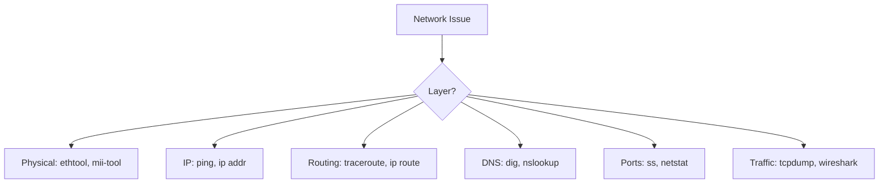

# Essential Network Troubleshooting Tools on Ubuntu

Author: [nawazdhandala](https://www.github.com/nawazdhandala)

Tags: Ubuntu, Networking, Troubleshooting, Diagnostics, Tools, Tutorial

Description: Comprehensive guide to network troubleshooting tools on Ubuntu for diagnosing connectivity, performance, and configuration issues.

---

Network issues can be challenging to diagnose. Ubuntu provides powerful tools for troubleshooting connectivity, analyzing traffic, and debugging network problems. This guide covers essential network diagnostic tools and their practical usage.

## Quick Reference



## Install Essential Tools

```bash
# Install comprehensive network tools
sudo apt update
sudo apt install net-tools iputils-ping dnsutils traceroute mtr-tiny tcpdump nmap netcat-openbsd iftop iperf3 ethtool -y
```

## Basic Connectivity Tests

### ping - Test Reachability

```bash
# Basic ping
ping google.com

# Limit count
ping -c 4 google.com

# Set interval
ping -i 0.5 google.com

# Set packet size
ping -s 1472 google.com  # MTU test

# Flood ping (requires root)
sudo ping -f google.com

# Ping with timestamp
ping -D google.com
```

### Test Local Network

```bash
# Ping gateway
ping 192.168.1.1

# Ping broadcast (find active hosts)
ping -b 192.168.1.255
```

## IP and Interface Information

### ip command (Modern)

```bash
# Show all interfaces
ip addr show

# Show specific interface
ip addr show eth0

# Show routing table
ip route show

# Show neighbor (ARP) table
ip neigh show

# Show link statistics
ip -s link show eth0

# Show interface details
ip -d link show eth0
```

### ifconfig (Legacy)

```bash
# Show all interfaces
ifconfig

# Show specific interface
ifconfig eth0
```

## Routing Diagnostics

### traceroute - Path Discovery

```bash
# Basic traceroute
traceroute google.com

# Use ICMP instead of UDP
traceroute -I google.com

# Use TCP
traceroute -T google.com

# Set max hops
traceroute -m 20 google.com

# Don't resolve hostnames
traceroute -n google.com
```

### mtr - Combined ping/traceroute

```bash
# Interactive mode
mtr google.com

# Report mode
mtr -r -c 10 google.com

# No DNS resolution
mtr -n google.com

# Use TCP
mtr --tcp google.com

# Show AS numbers
mtr -z google.com
```

### Route Table

```bash
# Show routing table
ip route show

# Show routing cache
ip route show cache

# Trace route decision
ip route get 8.8.8.8
```

## DNS Troubleshooting

### dig - DNS Lookup

```bash
# Basic lookup
dig google.com

# Query specific record type
dig google.com A
dig google.com MX
dig google.com NS
dig google.com TXT

# Short answer
dig +short google.com

# Query specific DNS server
dig @8.8.8.8 google.com

# Reverse lookup
dig -x 8.8.8.8

# Trace DNS resolution
dig +trace google.com

# Show all records
dig google.com ANY
```

### nslookup

```bash
# Basic lookup
nslookup google.com

# Query specific server
nslookup google.com 8.8.8.8

# Query specific type
nslookup -type=mx google.com
```

### host

```bash
# Simple lookup
host google.com

# Verbose output
host -v google.com

# Specific type
host -t MX google.com
```

### Test DNS Configuration

```bash
# Check resolver configuration
cat /etc/resolv.conf

# Test systemd-resolved
resolvectl status

# Test DNS resolution time
time dig google.com
```

## Port and Connection Analysis

### ss - Socket Statistics (Modern)

```bash
# Show all listening ports
ss -tlnp

# Show all connections
ss -tanp

# Show UDP sockets
ss -ulnp

# Show established connections
ss -t state established

# Filter by port
ss -tlnp | grep :80

# Show socket memory usage
ss -m

# Show timer information
ss -to

# Show specific port connections
ss -tn sport = :443 or dport = :443
```

### netstat (Legacy)

```bash
# Show listening ports
netstat -tlnp

# Show all connections
netstat -tanp

# Show routing table
netstat -rn

# Show interface statistics
netstat -i
```

### Test Port Connectivity

```bash
# Using netcat
nc -zv google.com 443

# Test range of ports
nc -zv google.com 80-443

# Using telnet
telnet google.com 80

# Using curl
curl -v telnet://google.com:443
```

## Traffic Analysis

### tcpdump - Packet Capture

```bash
# Capture all traffic on interface
sudo tcpdump -i eth0

# Capture specific port
sudo tcpdump -i eth0 port 80

# Capture specific host
sudo tcpdump -i eth0 host 192.168.1.100

# Capture and save to file
sudo tcpdump -i eth0 -w capture.pcap

# Read capture file
tcpdump -r capture.pcap

# Show ASCII output
sudo tcpdump -i eth0 -A port 80

# Show hex output
sudo tcpdump -i eth0 -X port 80

# Filter by protocol
sudo tcpdump -i eth0 icmp
sudo tcpdump -i eth0 tcp
sudo tcpdump -i eth0 udp

# Complex filters
sudo tcpdump -i eth0 'tcp port 80 and host 192.168.1.100'
```

### iftop - Bandwidth Monitoring

```bash
# Monitor interface
sudo iftop -i eth0

# Don't resolve hostnames
sudo iftop -n -i eth0

# Show port numbers
sudo iftop -P -i eth0

# Filter traffic
sudo iftop -f "port 80" -i eth0
```

### nethogs - Per-Process Bandwidth

```bash
# Install
sudo apt install nethogs -y

# Monitor all interfaces
sudo nethogs

# Monitor specific interface
sudo nethogs eth0
```

## Performance Testing

### iperf3 - Bandwidth Test

```bash
# Start server
iperf3 -s

# Run client test
iperf3 -c server_ip

# Test upload (reverse)
iperf3 -c server_ip -R

# UDP test
iperf3 -c server_ip -u

# Set duration
iperf3 -c server_ip -t 30

# Multiple parallel streams
iperf3 -c server_ip -P 4
```

### Speed Test CLI

```bash
# Install speedtest-cli
sudo apt install speedtest-cli -y

# Run speed test
speedtest-cli

# Simple output
speedtest-cli --simple
```

## Network Scanning

### nmap - Port Scanner

```bash
# Scan common ports
nmap 192.168.1.100

# Scan all ports
nmap -p- 192.168.1.100

# Service detection
nmap -sV 192.168.1.100

# OS detection
sudo nmap -O 192.168.1.100

# Scan network range
nmap 192.168.1.0/24

# Fast scan
nmap -F 192.168.1.0/24

# Ping scan (find live hosts)
nmap -sn 192.168.1.0/24
```

## Physical Layer Diagnostics

### ethtool - Interface Details

```bash
# Show interface info
sudo ethtool eth0

# Show driver info
sudo ethtool -i eth0

# Show statistics
sudo ethtool -S eth0

# Show ring buffer
sudo ethtool -g eth0

# Test cable
sudo ethtool -t eth0
```

### mii-tool - Media Status

```bash
# Show link status
sudo mii-tool eth0

# Verbose output
sudo mii-tool -v eth0
```

## ARP and Neighbor Discovery

### ARP Table

```bash
# Show ARP table
ip neigh show

# Or using arp
arp -a

# Clear ARP cache
sudo ip neigh flush all

# Add static ARP entry
sudo ip neigh add 192.168.1.100 lladdr aa:bb:cc:dd:ee:ff dev eth0
```

### arping - ARP Ping

```bash
# ARP ping
sudo arping -c 4 192.168.1.1

# Find duplicate IPs
sudo arping -D 192.168.1.100
```

## Troubleshooting Workflow

### Step 1: Check Local Configuration

```bash
# Check interface status
ip addr show
ip link show

# Check routing
ip route show

# Check DNS
cat /etc/resolv.conf
```

### Step 2: Test Local Network

```bash
# Ping gateway
ping -c 4 $(ip route | grep default | awk '{print $3}')

# Check ARP
ip neigh show
```

### Step 3: Test Internet Connectivity

```bash
# Ping external IP
ping -c 4 8.8.8.8

# Ping with DNS
ping -c 4 google.com

# Trace route
mtr -r -c 5 google.com
```

### Step 4: Test Specific Service

```bash
# Test port
nc -zv example.com 443

# Test HTTP
curl -I https://example.com
```

## Common Issues and Solutions

### No Network Connectivity

```bash
# Check interface is up
ip link show eth0

# Bring interface up
sudo ip link set eth0 up

# Request DHCP
sudo dhclient eth0
```

### DNS Not Resolving

```bash
# Test with direct IP
ping 8.8.8.8

# Test DNS server
dig @8.8.8.8 google.com

# Flush DNS cache
sudo systemd-resolve --flush-caches
```

### Slow Connection

```bash
# Check for packet loss
mtr -r -c 100 google.com

# Check bandwidth
iperf3 -c speedtest.server.com

# Check for network congestion
sudo tcpdump -i eth0 -c 100
```

### Port Not Accessible

```bash
# Check if service is listening
ss -tlnp | grep :80

# Check firewall
sudo iptables -L -n
sudo ufw status
```

---

These network troubleshooting tools are essential for any system administrator. Master them to quickly diagnose and resolve network issues. For proactive monitoring and alerting, consider using OneUptime to catch network problems before they impact users.
