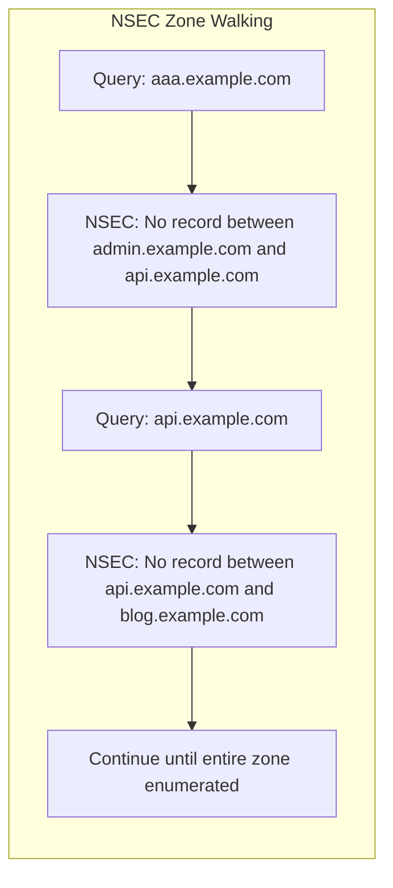
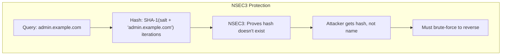

# How to Configure NSEC3 for Enhanced DNSSEC Zone Privacy

Author: [nawazdhandala](https://www.github.com/nawazdhandala)

Tags: DNSSEC, NSEC3, DNS, Security, Privacy, Infrastructure

Description: A comprehensive guide to configuring NSEC3 records for DNSSEC zones, preventing zone enumeration attacks while maintaining cryptographic authentication of DNS responses.

---

DNSSEC provides cryptographic authentication for DNS responses, but the original NSEC (Next Secure) records had a critical flaw: they made zone enumeration trivial. NSEC3 fixes this by hashing domain names, making it computationally expensive to walk through your entire zone. This guide covers everything you need to know about configuring NSEC3 properly.

## Understanding the Zone Enumeration Problem

### How NSEC Exposes Your Zone

NSEC records prove that a domain name doesn't exist by providing a signed statement of what names do exist. The problem? They list names in alphabetical order.



An attacker can query for `aaa.example.com`, receive an NSEC record saying "nothing exists between `admin.example.com` and `api.example.com`", and now they know both those subdomains exist. Repeat this process and you can enumerate every record in the zone.

### What Attackers Learn from Zone Enumeration

- **All subdomains** - Including internal services, staging environments, and forgotten systems
- **Infrastructure topology** - Mail servers, VPN endpoints, database hosts
- **Naming conventions** - Patterns that reveal organizational structure
- **Attack surface** - Every hostname is a potential target

### How NSEC3 Solves This

NSEC3 replaces plaintext domain names with hashed values. Instead of revealing `admin.example.com`, the NSEC3 record contains something like `1AVVQN74SG75UKFVF25DGCETHGQ638EK`.



## NSEC3 Parameters Explained

NSEC3 records have four key parameters that affect security and performance.

### Hash Algorithm

Currently, only SHA-1 (algorithm 1) is standardized for NSEC3. While SHA-1 has known weaknesses for digital signatures, it remains acceptable for NSEC3's purpose of preventing casual zone enumeration.

```bash
# SHA-1 is the only supported algorithm
# Algorithm number: 1
```

### Iterations

The number of times the hash function is applied. More iterations make dictionary attacks slower but also increase server CPU load.

```bash
# Low iterations (0-10): Fast responses, easier to crack
# Medium iterations (10-50): Balanced approach
# High iterations (100+): Slow responses, harder to crack

# RFC 9276 recommends 0 iterations for most cases
# The salt provides sufficient protection
```

### Salt

A random value added to the hash input to prevent precomputed rainbow table attacks.

```bash
# Generate a random salt (recommended: 8-16 hex characters)
openssl rand -hex 8
# Output: a1b2c3d4e5f6a7b8

# Empty salt is now acceptable per RFC 9276
# Salt rotation provides limited security benefit
```

### Opt-Out Flag

Allows unsigned delegations to be skipped in NSEC3 chains. Useful for zones with many unsigned child zones (like TLDs).

```bash
# Opt-out enabled: Unsigned delegations not covered
# Opt-out disabled: All delegations must be signed (recommended)
```

## Configuring NSEC3 with BIND

BIND is the most widely deployed DNS server software. Here's how to configure NSEC3.

### Basic NSEC3 Configuration

Add NSEC3 parameters to your zone configuration:

```bash
# named.conf zone configuration
zone "example.com" {
    type master;
    file "/var/named/zones/example.com.zone";
    key-directory "/var/named/keys";
    auto-dnssec maintain;
    inline-signing yes;
    dnssec-policy default;
};
```

### Setting NSEC3 Parameters via rndc

```bash
# Enable NSEC3 with recommended parameters
# Algorithm 1 (SHA-1), 0 iterations, 8-byte salt
rndc signing -nsec3param 1 0 8 $(openssl rand -hex 8) example.com

# Verify NSEC3 is active
rndc signing -list example.com
```

### Using DNSSEC Policy (BIND 9.16+)

```bash
# named.conf dnssec-policy configuration
dnssec-policy "nsec3-policy" {
    nsec3param iterations 0 optout no salt-length 8;

    keys {
        ksk key-directory lifetime unlimited algorithm ECDSAP256SHA256;
        zsk key-directory lifetime 30d algorithm ECDSAP256SHA256;
    };

    dnskey-ttl 3600;
    publish-safety 1h;
    retire-safety 1h;
    signatures-refresh 5d;
    signatures-validity 14d;
    signatures-validity-dnskey 14d;
    max-zone-ttl 86400;
    zone-propagation-delay 300;
    parent-ds-ttl 3600;
    parent-propagation-delay 1h;
};

zone "example.com" {
    type master;
    file "/var/named/zones/example.com.zone";
    dnssec-policy "nsec3-policy";
    inline-signing yes;
};
```

### Generating Keys for BIND

```bash
# Generate Key Signing Key (KSK)
dnssec-keygen -a ECDSAP256SHA256 -f KSK example.com

# Generate Zone Signing Key (ZSK)
dnssec-keygen -a ECDSAP256SHA256 example.com

# Move keys to the key directory
mv Kexample.com.* /var/named/keys/

# Set proper permissions
chown named:named /var/named/keys/*
chmod 600 /var/named/keys/*.private
```

### Signing the Zone

```bash
# Sign zone with NSEC3 parameters
dnssec-signzone -3 $(openssl rand -hex 8) \
    -A -N INCREMENT \
    -o example.com \
    -t /var/named/zones/example.com.zone

# Or let BIND handle signing automatically with inline-signing
# Just reload the zone
rndc reload example.com
```

## Configuring NSEC3 with PowerDNS

PowerDNS offers straightforward NSEC3 configuration through its API or command-line tools.

### Enable DNSSEC on Zone

```bash
# Create zone if not exists
pdnsutil create-zone example.com

# Enable DNSSEC
pdnsutil secure-zone example.com
```

### Set NSEC3 Parameters

```bash
# Enable NSEC3 with parameters
# Format: pdnsutil set-nsec3 ZONE 'HASH_ALGO FLAGS ITERATIONS SALT'
pdnsutil set-nsec3 example.com '1 0 0 ab'

# Using empty salt (recommended per RFC 9276)
pdnsutil set-nsec3 example.com '1 0 0 -'

# Verify NSEC3 configuration
pdnsutil show-zone example.com
```

### PowerDNS Configuration File

```bash
# pdns.conf
launch=gpgsql
gpgsql-host=127.0.0.1
gpgsql-dbname=pdns
gpgsql-user=pdns
gpgsql-password=secret

# DNSSEC settings
default-soa-content=ns1.example.com hostmaster.@ 0 10800 3600 604800 3600
default-ttl=3600

# Enable DNSSEC
dnssec=yes

# NSEC3 defaults (can be overridden per zone)
default-nsec3-params=1 0 0 -
```

### Using PowerDNS API

```bash
# Enable NSEC3 via API
curl -X PATCH http://localhost:8081/api/v1/servers/localhost/zones/example.com \
    -H "X-API-Key: your-api-key" \
    -H "Content-Type: application/json" \
    -d '{
        "nsec3param": "1 0 0 ab",
        "nsec3narrow": false
    }'
```

### PowerDNS NSEC3 Narrow Mode

PowerDNS offers a "narrow" NSEC3 mode that generates NSEC3 records on-the-fly rather than pre-computing them.

```bash
# Enable narrow NSEC3 mode
pdnsutil set-nsec3 example.com '1 0 0 ab' narrow

# Benefits:
# - Smaller zone size (no stored NSEC3 records)
# - Instant updates (no re-signing needed)

# Drawbacks:
# - Higher CPU usage on queries
# - Not compatible with zone transfers to standard secondaries
```

## Configuring NSEC3 with Knot DNS

Knot DNS provides excellent DNSSEC support with automatic key management.

### Knot DNS Configuration

```yaml
# knot.conf
server:
    listen: 0.0.0.0@53
    listen: ::@53

log:
  - target: syslog
    any: info

database:
    storage: /var/lib/knot

keystore:
  - id: default
    backend: pem
    config: /var/lib/knot/keys

key:
  - id: example-ksk
    algorithm: ECDSAP256SHA256
    ksk: yes

  - id: example-zsk
    algorithm: ECDSAP256SHA256

policy:
  - id: nsec3-policy
    algorithm: ECDSAP256SHA256
    ksk-lifetime: 0
    zsk-lifetime: 30d
    nsec3: on
    nsec3-iterations: 0
    nsec3-opt-out: off
    nsec3-salt-length: 8
    nsec3-salt-lifetime: 30d

zone:
  - domain: example.com
    storage: /var/lib/knot/zones
    file: example.com.zone
    dnssec-signing: on
    dnssec-policy: nsec3-policy
```

### Knot DNS Key Generation

```bash
# Generate keys automatically (Knot handles this with the policy)
knotc zone-sign example.com

# Or manually generate keys
keymgr example.com generate algorithm=ECDSAP256SHA256 ksk=yes
keymgr example.com generate algorithm=ECDSAP256SHA256

# List keys
keymgr example.com list
```

### Managing NSEC3 Salt Rotation

```bash
# Rotate salt manually
knotc zone-nsec3-salt example.com

# Salt rotation is automatic based on nsec3-salt-lifetime in policy
```

## Configuring NSEC3 with NSD

NSD (Name Server Daemon) from NLnet Labs requires external tools for DNSSEC signing.

### NSD Zone Configuration

```bash
# nsd.conf
server:
    port: 53
    server-count: 4
    verbosity: 1

zone:
    name: "example.com"
    zonefile: "example.com.zone.signed"
```

### Using ldns-signzone

```bash
# Install ldns tools
apt-get install ldns-utils

# Generate keys
ldns-keygen -a ECDSAP256SHA256 -k example.com  # KSK
ldns-keygen -a ECDSAP256SHA256 example.com     # ZSK

# Sign zone with NSEC3
ldns-signzone -n -p \
    -s $(openssl rand -hex 8) \
    -t 0 \
    example.com.zone \
    Kexample.com.+013+*.private

# Options:
# -n : Use NSEC3 instead of NSEC
# -p : Add time-based salt
# -s : Salt value
# -t : Number of iterations (0 recommended)
```

### Automating Zone Signing

```bash
#!/bin/bash
# sign-zone.sh

ZONE="example.com"
ZONE_DIR="/var/nsd/zones"
KEY_DIR="/var/nsd/keys"

# Generate new salt
SALT=$(openssl rand -hex 8)

# Sign zone with NSEC3
ldns-signzone -n \
    -s $SALT \
    -t 0 \
    -o $ZONE \
    $ZONE_DIR/$ZONE.zone \
    $KEY_DIR/K$ZONE.+013+*.private

# Reload NSD
nsd-control reload $ZONE
```

## Verifying NSEC3 Configuration

### Using dig

```bash
# Query for NSEC3PARAM record
dig @localhost example.com NSEC3PARAM +dnssec

# Expected output:
# example.com.  3600  IN  NSEC3PARAM  1 0 0 A1B2C3D4

# Query for non-existent domain to see NSEC3 records
dig @localhost nonexistent.example.com A +dnssec

# Look for NSEC3 records in the response
```

### Using delv (BIND's DNSSEC validator)

```bash
# Validate DNSSEC chain
delv @localhost example.com A +rtrace

# Check specific NSEC3 parameters
delv @localhost example.com NSEC3PARAM

# Output shows validation path
```

### Using drill

```bash
# Install drill (part of ldns)
apt-get install ldns-utils

# Chase DNSSEC chain
drill -TD example.com

# Query NSEC3PARAM
drill example.com NSEC3PARAM

# Verify DNSSEC signature
drill -S example.com
```

### Online Validation Tools

```bash
# DNSViz - Visual DNSSEC validation
# https://dnsviz.net/

# Verisign DNSSEC Debugger
# https://dnssec-debugger.verisignlabs.com/

# SIDN Labs DNSSEC Analyzer
# https://check.sidnlabs.nl/
```

## NSEC3 Security Considerations

### Iteration Count Recommendations

RFC 9276 updated the guidance on NSEC3 iterations:

```bash
# Previous recommendations (RFC 5155):
# - 150 iterations for 1024-bit RSA/DSA
# - 500 iterations for 2048-bit RSA/DSA
# - 2500 iterations for 4096-bit RSA

# Current recommendations (RFC 9276):
# - 0 iterations for all key sizes
# - Iterations provide minimal security benefit
# - Higher iterations cause denial-of-service vulnerability
```

### Why Zero Iterations?

```bash
# The math:
# - GPU cracking: ~1 billion hashes/second
# - Average zone: ~100,000 records
# - 10 iterations: 10 * 100,000 = 1,000,000 hashes
# - Cracking time: 0.001 seconds

# Iterations don't meaningfully slow attackers
# But they DO slow your authoritative servers
# Every query requires iterations * hash operations
```

### Salt Best Practices

```bash
# Salt purposes:
# 1. Prevent precomputed rainbow tables
# 2. Make zone-specific attacks necessary

# Salt rotation:
# - Provides limited security benefit
# - Requires re-signing entire zone
# - Can cause validation failures during transition

# RFC 9276 recommendation:
# - Use empty salt (value: -)
# - Or use static salt and never rotate
```

### Opt-Out Considerations

```bash
# Opt-out (flag bit 1) allows unsigned delegations

# Use cases:
# - Large zones (TLDs) with many unsigned delegations
# - Reduces zone size and signing overhead

# Security implications:
# - Attackers can prove unsigned delegations don't exist
# - Cannot distinguish between "doesn't exist" and "exists but unsigned"

# Recommendation:
# - Disable opt-out for most zones
# - Only enable for TLDs or very large zones
```

## Migrating from NSEC to NSEC3

### Step-by-Step Migration

```bash
# Step 1: Verify current DNSSEC status
dig example.com DNSKEY +dnssec
dig example.com NSEC +dnssec

# Step 2: Prepare NSEC3 parameters
# Algorithm: 1 (SHA-1)
# Flags: 0 (no opt-out)
# Iterations: 0
# Salt: empty or random 8-byte value

# Step 3: Apply NSEC3 (BIND)
rndc signing -nsec3param 1 0 0 - example.com

# Step 4: Verify migration
dig example.com NSEC3PARAM +dnssec
dig nonexistent.example.com A +dnssec  # Should return NSEC3

# Step 5: Monitor for issues
tail -f /var/log/named/named.log
```

### Rollback Procedure

```bash
# If issues arise, revert to NSEC

# BIND
rndc signing -nsec3param none example.com

# PowerDNS
pdnsutil unset-nsec3 example.com

# Verify rollback
dig example.com NSEC +dnssec
```

### Migration Checklist

```markdown
Pre-Migration:
- [ ] Backup zone files and keys
- [ ] Verify current DNSSEC is working
- [ ] Test NSEC3 in staging environment
- [ ] Notify operations team

Migration:
- [ ] Apply NSEC3 parameters
- [ ] Verify NSEC3PARAM record appears
- [ ] Test non-existent domain queries
- [ ] Validate DNSSEC chain

Post-Migration:
- [ ] Monitor query latency
- [ ] Check validation rates
- [ ] Review error logs
- [ ] Update documentation
```

## Troubleshooting NSEC3

### Common Issues and Solutions

#### NSEC3 Records Not Appearing

```bash
# Check zone signing status (BIND)
rndc signing -list example.com

# Expected output:
# - Done signing with key 12345/ECDSAP256SHA256
# - NSEC3: NSEC3 (salt=..., iterations=0)

# If not signed, verify:
# 1. Keys exist and are readable
ls -la /var/named/keys/

# 2. auto-dnssec is enabled
grep auto-dnssec /etc/named.conf

# 3. Zone is master/primary
grep "type master" /etc/named.conf
```

#### Validation Failures After NSEC3

```bash
# Check for common issues:

# 1. DS record mismatch
dig example.com DS +trace
dnssec-dsfromkey /var/named/keys/Kexample.com.+013+*.key

# 2. Serial number not incremented
dig @localhost example.com SOA +short

# 3. Signature expired
dig @localhost example.com RRSIG +dnssec
# Check expiration dates

# 4. NSEC3 parameter mismatch between servers
dig @ns1.example.com example.com NSEC3PARAM
dig @ns2.example.com example.com NSEC3PARAM
```

#### High CPU Usage

```bash
# Symptoms: Slow DNS responses, high server load

# Cause: Too many NSEC3 iterations

# Solution: Reduce iterations to 0
rndc signing -nsec3param 1 0 0 - example.com

# Monitor CPU usage
top -p $(pgrep named)
```

#### Zone Transfer Failures

```bash
# NSEC3 narrow mode (PowerDNS) can cause issues

# Check transfer status
dig @secondary.example.com example.com AXFR

# Solution: Disable narrow mode for zones with standard secondaries
pdnsutil set-nsec3 example.com '1 0 0 -'
# Note: no 'narrow' parameter
```

### Diagnostic Commands

```bash
# Complete NSEC3 diagnostic script
#!/bin/bash

ZONE=$1
NS=${2:-localhost}

echo "=== NSEC3 Diagnostics for $ZONE ==="

echo -e "\n[1] NSEC3PARAM Record:"
dig @$NS $ZONE NSEC3PARAM +short

echo -e "\n[2] Testing Non-Existent Domain:"
dig @$NS nonexistent-test-$(date +%s).$ZONE A +dnssec +noall +authority

echo -e "\n[3] DNSSEC Validation:"
delv @$NS $ZONE SOA +rtrace 2>&1 | tail -5

echo -e "\n[4] Key Status:"
dig @$NS $ZONE DNSKEY +short | while read line; do
    echo "  - Algorithm: $(echo $line | awk '{print $3}')"
done

echo -e "\n[5] Response Times:"
for i in 1 2 3; do
    time=$(dig @$NS nonexistent$i.$ZONE A +dnssec +stats 2>&1 | grep "Query time" | awk '{print $4}')
    echo "  Query $i: ${time}ms"
done
```

## Performance Optimization

### Zone Size Considerations

```bash
# NSEC3 increases zone size due to additional records

# Calculate approximate zone size increase
# Original: N records
# With NSEC3: N + N (NSEC3) + 1 (NSEC3PARAM) records
# Plus: RRSIG records for each NSEC3

# Optimization strategies:
# 1. Use ECDSA instead of RSA (smaller signatures)
# 2. Reduce signature validity period
# 3. Use aggressive NSEC caching on resolvers
```

### Response Time Optimization

```bash
# NSEC3 adds overhead to NXDOMAIN responses

# Optimization:
# 1. Use 0 iterations (critical)
# 2. Enable NSEC3 caching
# 3. Use fast storage for zone data

# BIND optimization
options {
    max-cache-size 512M;
    minimal-responses yes;
    dnssec-accept-expired no;
};
```

### Secondary Server Considerations

```bash
# NSEC3 zone transfers include all NSEC3 records

# Ensure secondaries support NSEC3:
# - BIND 9.6+
# - PowerDNS 4.0+
# - Knot DNS 2.0+
# - NSD 4.0+

# Monitor transfer times
dig @secondary.example.com example.com SOA +short
```

## NSEC3 and Modern DNS

### NSEC3 White Lies

Some implementations use "white lies" to provide minimal NSEC3 responses:

```bash
# Traditional NSEC3: Returns actual surrounding hashes
# White lies: Returns synthesized NSEC3 covering only the queried name

# Benefits:
# - Smaller responses
# - No zone enumeration possible
# - Faster response generation

# Implementations:
# - Knot DNS: On by default
# - PowerDNS: Narrow mode
# - BIND: Not supported
```

### NSEC3 vs NSEC5

```bash
# NSEC5 is a proposed improvement (not yet standardized)

# NSEC5 features:
# - Uses elliptic curve VRF instead of hashing
# - Provably prevents zone enumeration
# - No iterations needed
# - Smaller responses

# Current status:
# - Internet Draft
# - Not implemented in production software
# - NSEC3 remains the standard choice
```

### Compact Denial of Existence

```bash
# RFC 9077 introduces improvements:

# 1. Aggressive Use of DNSSEC-Validated Cache
# Resolvers can synthesize NXDOMAIN from cached NSEC3

# 2. NSEC3 Parameter Recommendations (RFC 9276)
# - 0 iterations
# - Empty or no salt rotation

# 3. Implementation status:
# - Supported by major resolvers
# - Reduces authoritative server load
```

## NSEC3 Parameter Summary Table

| Parameter | Recommended Value | Description | Security Impact |
|-----------|------------------|-------------|-----------------|
| Algorithm | 1 (SHA-1) | Hash algorithm | Only option currently standardized |
| Iterations | 0 | Hash rounds | 0 per RFC 9276; higher values cause DoS vulnerability |
| Salt | Empty (-) or fixed | Random value | Prevents rainbow tables; rotation unnecessary |
| Opt-Out | 0 (disabled) | Skip unsigned delegations | Enable only for TLDs with many unsigned zones |
| Salt Length | 0 or 8 bytes | Salt size | Empty salt acceptable per RFC 9276 |
| Salt Lifetime | Never/30d+ | Rotation frequency | Rotation provides minimal benefit |

## Implementation Quick Reference

| DNS Server | Enable NSEC3 Command | NSEC3 Parameters |
|------------|---------------------|------------------|
| BIND | `rndc signing -nsec3param 1 0 0 - zone` | In zone or via rndc |
| PowerDNS | `pdnsutil set-nsec3 zone '1 0 0 -'` | Per-zone setting |
| Knot DNS | `nsec3: on` in policy | In knot.conf policy |
| NSD | `ldns-signzone -n -t 0 -s salt` | External signing required |

## Best Practices Summary

### Do

```markdown
- Use 0 iterations (RFC 9276)
- Use empty salt or fixed salt without rotation
- Monitor response times after enabling NSEC3
- Test in staging before production
- Keep DNSSEC keys secure with proper file permissions
- Use ECDSA algorithms for smaller signatures
- Enable NSEC3 on all authoritative servers simultaneously
- Document your NSEC3 parameters
```

### Don't

```markdown
- Use high iteration counts (causes DoS vulnerability)
- Rotate salt frequently (unnecessary churn)
- Enable opt-out unless you're a TLD
- Mix NSEC and NSEC3 in the same zone
- Forget to update DS records when rolling keys
- Ignore validation failures from resolvers
- Use NSEC3 narrow mode with standard secondaries
```

## Monitoring NSEC3 Health

### Key Metrics to Track

```bash
# Query response times
# - NXDOMAIN responses should be similar to positive responses
# - Alert if NSEC3 responses take >2x normal time

# Validation success rate
# - Track SERVFAIL responses from resolvers
# - Alert on sudden increase in validation failures

# Zone signing status
# - Monitor signature expiration
# - Alert 7 days before expiration
```

### Prometheus Metrics (BIND)

```yaml
# bind_exporter configuration
- job_name: 'bind'
  static_configs:
    - targets: ['localhost:9119']
  metrics_path: /metrics

# Key metrics:
# bind_responses_total{result="NXDOMAIN"}
# bind_query_duration_seconds
# bind_zone_serial
```

### Alerting Rules

```yaml
# Prometheus alerting rules
groups:
  - name: dnssec
    rules:
      - alert: DNSSECSignatureExpiringSoon
        expr: bind_zone_dnssec_signature_expiration_seconds < 604800
        for: 1h
        labels:
          severity: warning
        annotations:
          summary: "DNSSEC signatures expiring in less than 7 days"

      - alert: DNSSECValidationFailures
        expr: rate(bind_responses_total{result="SERVFAIL"}[5m]) > 0.1
        for: 5m
        labels:
          severity: critical
        annotations:
          summary: "High DNSSEC validation failure rate"
```

---

NSEC3 remains the standard for preventing DNS zone enumeration while maintaining DNSSEC's security guarantees. With RFC 9276's updated recommendations, configuration is simpler than ever: use 0 iterations, skip the salt rotation, and focus on keeping your keys secure. Your zone's privacy is important - don't let attackers map your entire infrastructure with a simple zone walk.
