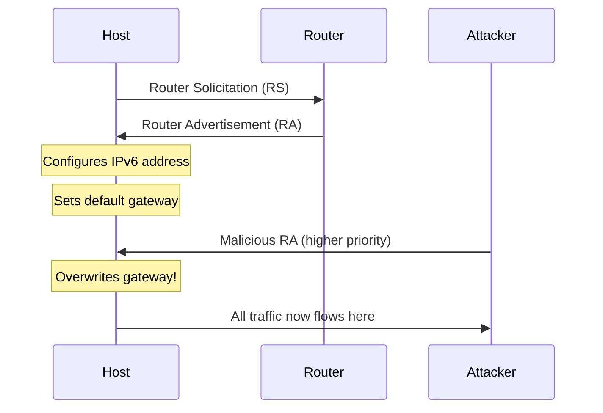

# How to Prevent IPv6 Router Advertisement Attacks

Author: [nawazdhandala](https://github.com/nawazdhandala)

Tags: IPv6, Security, Networking, Linux, DevOps, Infrastructure

Description: A comprehensive guide to understanding, detecting, and preventing IPv6 Router Advertisement attacks in enterprise networks through configuration hardening, monitoring, and defense-in-depth strategies.

---

IPv6 Router Advertisement (RA) attacks are among the most overlooked network security threats. An attacker on your local network can send malicious router advertisements, becoming the default gateway for all IPv6 traffic. This enables man-in-the-middle attacks, traffic interception, and denial of service. Let's fix that.

## Understanding IPv6 Router Advertisements

In IPv6, Router Advertisements are part of the Neighbor Discovery Protocol (NDP), defined in RFC 4861. Unlike IPv4's DHCP-centric approach, IPv6 uses Stateless Address Autoconfiguration (SLAAC) where routers broadcast their presence.



### How SLAAC Works

1. A host sends a Router Solicitation (RS) to the all-routers multicast address (ff02::2)
2. Routers respond with Router Advertisements (RA) to the all-nodes multicast address (ff02::1)
3. The host uses the RA information to configure its IPv6 address and default gateway
4. Routers also periodically broadcast unsolicited RAs

### What's in a Router Advertisement?

```
Router Advertisement Message:
+---------------------------------------+
| Cur Hop Limit (8 bits)               |
| M Flag | O Flag | Reserved (6 bits)  |
| Router Lifetime (16 bits)            |
| Reachable Time (32 bits)             |
| Retrans Timer (32 bits)              |
+---------------------------------------+
| Options:                              |
|   - Source Link-Layer Address         |
|   - MTU                               |
|   - Prefix Information                |
|   - Route Information                 |
|   - RDNSS (DNS Servers)              |
+---------------------------------------+
```

## The Attack Vectors

### Attack 1: Rogue Router Advertisement

An attacker broadcasts RAs with a higher router preference, becoming the default gateway.

```bash
# Attacker's perspective (for educational purposes)
# Using tools like radvd, THC-IPv6, or Scapy

# Legitimate router sends:
#   Router Lifetime: 1800
#   Router Preference: Medium
#   Prefix: 2001:db8:1::/64

# Attacker sends:
#   Router Lifetime: 9000
#   Router Preference: High
#   Prefix: 2001:db8:1::/64 (same prefix)
#   Default Gateway: fe80::evil
```

### Attack 2: SLAAC Attack (IPv6 Address Spoofing)

The attacker advertises a new prefix, causing hosts to generate addresses in that prefix.

```bash
# Attacker advertises:
#   Prefix: 2001:db8:bad::/64
#   Autonomous Flag: 1
#   On-Link Flag: 1

# Victim generates:
#   2001:db8:bad::host-eui64
#   Gateway: Attacker's link-local
```

### Attack 3: Router Lifetime Attack (DoS)

Setting router lifetime to 0 causes hosts to remove the router from their default router list.

```bash
# Attacker sends RA with:
#   Router Lifetime: 0
#   Source: Legitimate router's link-local

# Effect: Hosts remove legitimate router
# Result: No IPv6 connectivity (DoS)
```

### Attack 4: DNS Hijacking via RDNSS

RFC 6106 allows routers to advertise DNS servers in RAs.

```bash
# Attacker advertises:
#   RDNSS Option:
#     Lifetime: 3600
#     DNS Servers: 2001:db8:evil::53

# Victim now uses attacker's DNS
# All DNS queries intercepted
```

### Attack 5: MTU Manipulation

Advertising an extremely low MTU causes performance degradation or DoS.

```bash
# Attacker advertises:
#   MTU Option: 68 (minimum valid)

# Effect: Severe fragmentation
# Result: Connection failures, DoS
```

## Detection Methods

### Method 1: NDPMon - Neighbor Discovery Protocol Monitor

NDPMon passively monitors NDP traffic and alerts on anomalies.

```bash
# Install NDPMon
apt-get install ndpmon

# Configure /etc/ndpmon/config_ndpmon.xml
```

```xml
<?xml version="1.0" encoding="UTF-8"?>
<config_ndpmon>
  <settings>
    <actions_low_pri>syslog</actions_low_pri>
    <actions_high_pri>syslog,exec</actions_high_pri>
    <mail_notification>0</mail_notification>
    <syslog_facility>LOG_DAEMON</syslog_facility>
    <exec_pipe_program>/usr/local/bin/ra_alert.sh</exec_pipe_program>
  </settings>

  <probes>
    <!-- Monitor all interfaces -->
    <probe>
      <name>eth0</name>
      <type>interface</type>
    </probe>
  </probes>

  <countermeasures>
    <kill_illegitimate_router>1</kill_illegitimate_router>
    <kill_wrong_prefix>1</kill_wrong_prefix>
    <propagate_router_params>1</propagate_router_params>
  </countermeasures>

  <routers>
    <!-- Define legitimate routers -->
    <router>
      <mac>00:11:22:33:44:55</mac>
      <lla>fe80::1</lla>
      <param_curhoplimit>64</param_curhoplimit>
      <param_flags_reserved>0</param_flags_reserved>
      <param_router_lifetime>1800</param_router_lifetime>
      <param_reachable_timer>0</param_reachable_timer>
      <param_retrans_timer>0</param_retrans_timer>
      <params_volatile>0</params_volatile>
      <prefixes>
        <prefix>
          <address>2001:db8:1::</address>
          <mask>64</mask>
          <param_flags_reserved>192</param_flags_reserved>
          <param_valid_time>2592000</param_valid_time>
          <param_preferred_time>604800</param_preferred_time>
        </prefix>
      </prefixes>
    </router>
  </routers>
</config_ndpmon>
```

### Method 2: Ramond - Router Advertisement Monitor Daemon

```bash
# Install ramond
git clone https://github.com/IETF/ramond.git
cd ramond && make && make install

# Run monitoring
ramond -i eth0 -c /etc/ramond.conf
```

### Method 3: Custom Detection Script

```python
#!/usr/bin/env python3
"""
IPv6 RA Attack Detection Script
Monitors for unauthorized Router Advertisements
"""

from scapy.all import *
from scapy.layers.inet6 import *
import logging
import json
from datetime import datetime

# Configure logging
logging.basicConfig(
    level=logging.INFO,
    format='%(asctime)s - %(levelname)s - %(message)s',
    handlers=[
        logging.FileHandler('/var/log/ra_monitor.log'),
        logging.StreamHandler()
    ]
)

# Authorized routers configuration
AUTHORIZED_ROUTERS = {
    'fe80::1': {
        'mac': '00:11:22:33:44:55',
        'prefixes': ['2001:db8:1::/64'],
        'dns_servers': ['2001:db8:1::53']
    }
}

AUTHORIZED_PREFIXES = ['2001:db8:1::/64']

class RAMonitor:
    def __init__(self, interface):
        self.interface = interface
        self.seen_routers = {}
        self.alert_count = 0

    def analyze_ra(self, packet):
        """Analyze Router Advertisement packet"""
        if ICMPv6ND_RA not in packet:
            return

        src_ip = packet[IPv6].src
        src_mac = packet.src

        ra = packet[ICMPv6ND_RA]

        alert_reasons = []
        severity = 'LOW'

        # Check 1: Is this an authorized router?
        if src_ip not in AUTHORIZED_ROUTERS:
            alert_reasons.append(f"Unknown router: {src_ip}")
            severity = 'CRITICAL'
        else:
            # Verify MAC address matches
            expected_mac = AUTHORIZED_ROUTERS[src_ip]['mac']
            if src_mac.lower() != expected_mac.lower():
                alert_reasons.append(
                    f"MAC mismatch: expected {expected_mac}, got {src_mac}"
                )
                severity = 'CRITICAL'

        # Check 2: Analyze prefixes
        prefixes = []
        for layer in packet.iterpayloads():
            if isinstance(layer, ICMPv6NDOptPrefixInfo):
                prefix = f"{layer.prefix}/{layer.prefixlen}"
                prefixes.append(prefix)

                if prefix not in AUTHORIZED_PREFIXES:
                    alert_reasons.append(f"Unauthorized prefix: {prefix}")
                    severity = 'CRITICAL'

        # Check 3: Check for suspicious router lifetime
        if ra.routerlifetime == 0:
            alert_reasons.append("Router lifetime is 0 (deauth attack?)")
            severity = 'HIGH'
        elif ra.routerlifetime > 9000:
            alert_reasons.append(f"Unusually high router lifetime: {ra.routerlifetime}")
            severity = 'MEDIUM'

        # Check 4: Check for RDNSS manipulation
        for layer in packet.iterpayloads():
            if isinstance(layer, ICMPv6NDOptRDNSS):
                for dns in layer.dns:
                    if src_ip in AUTHORIZED_ROUTERS:
                        auth_dns = AUTHORIZED_ROUTERS[src_ip].get('dns_servers', [])
                        if str(dns) not in auth_dns:
                            alert_reasons.append(f"Unauthorized DNS server: {dns}")
                            severity = 'CRITICAL'

        # Check 5: Check MTU manipulation
        for layer in packet.iterpayloads():
            if isinstance(layer, ICMPv6NDOptMTU):
                if layer.mtu < 1280:  # Minimum IPv6 MTU
                    alert_reasons.append(f"Suspiciously low MTU: {layer.mtu}")
                    severity = 'HIGH'

        # Check 6: Router preference analysis
        prf = (ra.prf >> 3) & 0x03
        prf_map = {0: 'Medium', 1: 'High', 2: 'Reserved', 3: 'Low'}
        if prf == 1 and src_ip not in AUTHORIZED_ROUTERS:
            alert_reasons.append(f"High router preference from unknown router")
            severity = 'CRITICAL'

        # Log the analysis
        if alert_reasons:
            self.alert_count += 1
            alert = {
                'timestamp': datetime.now().isoformat(),
                'severity': severity,
                'source_ip': src_ip,
                'source_mac': src_mac,
                'router_lifetime': ra.routerlifetime,
                'prefixes': prefixes,
                'reasons': alert_reasons,
                'alert_number': self.alert_count
            }

            if severity == 'CRITICAL':
                logging.critical(json.dumps(alert))
                self.send_alert(alert)
            elif severity == 'HIGH':
                logging.warning(json.dumps(alert))
            else:
                logging.info(json.dumps(alert))

        # Track router
        self.seen_routers[src_ip] = {
            'mac': src_mac,
            'last_seen': datetime.now(),
            'lifetime': ra.routerlifetime,
            'prefixes': prefixes
        }

    def send_alert(self, alert):
        """Send alert via webhook, email, or SIEM"""
        # Integration with monitoring systems
        # Example: Send to OneUptime webhook
        import requests
        try:
            webhook_url = os.environ.get('ONEUPTIME_WEBHOOK_URL')
            if webhook_url:
                requests.post(webhook_url, json={
                    'alertType': 'IPv6_RA_Attack',
                    'severity': alert['severity'],
                    'details': alert
                }, timeout=5)
        except Exception as e:
            logging.error(f"Failed to send alert: {e}")

    def start(self):
        """Start monitoring"""
        logging.info(f"Starting RA monitor on {self.interface}")
        logging.info(f"Authorized routers: {list(AUTHORIZED_ROUTERS.keys())}")

        # Filter for Router Advertisements (ICMPv6 type 134)
        sniff(
            iface=self.interface,
            filter="icmp6 and ip6[40] == 134",
            prn=self.analyze_ra,
            store=0
        )

if __name__ == '__main__':
    import sys
    interface = sys.argv[1] if len(sys.argv) > 1 else 'eth0'
    monitor = RAMonitor(interface)
    monitor.start()
```

### Method 4: Using tcpdump for Quick Analysis

```bash
#!/bin/bash
# Quick RA monitoring with tcpdump

INTERFACE="${1:-eth0}"
LOG_FILE="/var/log/ra_capture.log"

echo "Monitoring Router Advertisements on $INTERFACE"
echo "Press Ctrl+C to stop"

tcpdump -i "$INTERFACE" -n -vvv \
    'icmp6 and ip6[40] == 134' \
    2>&1 | while read line; do

    echo "[$(date '+%Y-%m-%d %H:%M:%S')] $line" >> "$LOG_FILE"

    # Alert on any RA
    if echo "$line" | grep -q "router advertisement"; then
        echo "ALERT: Router Advertisement detected"
        echo "$line"
    fi
done
```

### Method 5: Wireshark Display Filter

```
# Wireshark filter for RA analysis
icmpv6.type == 134

# Filter for specific source
icmpv6.type == 134 && ipv6.src != fe80::1

# Filter for suspicious characteristics
icmpv6.type == 134 && icmpv6.nd.ra.router_lifetime == 0
```

## Prevention Techniques

### Prevention 1: RA Guard (Switch-Level)

RA Guard is the most effective defense, implemented at the network switch level.

#### Cisco IOS Configuration

```
! Enable IPv6 snooping
ipv6 snooping policy RA_GUARD_POLICY
  device-role host
  limit address-count 10

! Apply to access ports
interface GigabitEthernet0/1
  description User Access Port
  switchport mode access
  ipv6 nd raguard attach-policy RA_GUARD_POLICY

! Allow RAs only on uplink
interface GigabitEthernet0/24
  description Router Uplink
  switchport mode trunk
  ipv6 nd raguard attach-policy RA_GUARD_ROUTER

! Define router policy
ipv6 nd raguard policy RA_GUARD_ROUTER
  device-role router
  trusted-port
```

#### Cisco Nexus Configuration

```
! Enable RA Guard globally
feature ipv6 nd raguard

! Create policy for hosts
ipv6 nd raguard policy HOST_POLICY
  device-role host

! Create policy for routers
ipv6 nd raguard policy ROUTER_POLICY
  device-role router

! Apply to interfaces
interface Ethernet1/1
  ipv6 nd raguard attach-policy HOST_POLICY

interface Ethernet1/48
  ipv6 nd raguard attach-policy ROUTER_POLICY
```

#### Juniper Junos Configuration

```
# Configure router advertisement guard
set ethernet-switching-options secure-access-port ra-guard action block
set ethernet-switching-options secure-access-port ra-guard policy raguard-hosts

# Create policy to block RAs on access ports
set policy-options prefix-list allowed-ra-sources fe80::1/128

# Apply to interface
set interfaces ge-0/0/1 unit 0 family ethernet-switching ra-guard
```

#### Arista EOS Configuration

```
! Enable RA Guard
ipv6 neighbor binding
   recovery interval 300
   local-interface Vlan100

ipv6 nd raguard policy BLOCK_RA
   device-role host

interface Ethernet1
   ipv6 nd raguard attach-policy BLOCK_RA
```

### Prevention 2: Host-Level Protection (Linux)

#### Disable IPv6 Router Advertisement Processing

```bash
# Disable RA processing entirely
sysctl -w net.ipv6.conf.all.accept_ra=0
sysctl -w net.ipv6.conf.default.accept_ra=0
sysctl -w net.ipv6.conf.eth0.accept_ra=0

# Make persistent in /etc/sysctl.conf
cat >> /etc/sysctl.conf << 'EOF'
# Disable IPv6 Router Advertisement acceptance
net.ipv6.conf.all.accept_ra = 0
net.ipv6.conf.default.accept_ra = 0

# Disable IPv6 router solicitations
net.ipv6.conf.all.router_solicitations = 0
net.ipv6.conf.default.router_solicitations = 0

# Disable IPv6 autoconfiguration
net.ipv6.conf.all.autoconf = 0
net.ipv6.conf.default.autoconf = 0

# Accept RA only from gateway (if needed)
# net.ipv6.conf.eth0.accept_ra_from_local = 0
EOF

# Apply changes
sysctl -p
```

#### Use Static IPv6 Configuration

```bash
# /etc/network/interfaces (Debian/Ubuntu)
auto eth0
iface eth0 inet6 static
    address 2001:db8:1::10
    netmask 64
    gateway 2001:db8:1::1
    # Disable SLAAC
    autoconf 0
    accept_ra 0

# NetworkManager (nmcli)
nmcli connection modify eth0 ipv6.method manual \
    ipv6.addresses "2001:db8:1::10/64" \
    ipv6.gateway "2001:db8:1::1" \
    ipv6.ignore-auto-routes yes \
    ipv6.ignore-auto-dns yes

# Netplan (Ubuntu 18.04+)
# /etc/netplan/01-static-ipv6.yaml
network:
  version: 2
  ethernets:
    eth0:
      accept-ra: false
      addresses:
        - 2001:db8:1::10/64
      gateway6: 2001:db8:1::1
      nameservers:
        addresses:
          - 2001:db8:1::53
```

#### IP6Tables Filtering

```bash
#!/bin/bash
# Block unauthorized Router Advertisements with ip6tables

# Define authorized router's link-local address
AUTHORIZED_ROUTER="fe80::1"
INTERFACE="eth0"

# Flush existing rules
ip6tables -F INPUT
ip6tables -F OUTPUT

# Default policies
ip6tables -P INPUT ACCEPT
ip6tables -P OUTPUT ACCEPT

# Allow RAs only from authorized router
ip6tables -A INPUT -i $INTERFACE \
    -p icmpv6 --icmpv6-type router-advertisement \
    -s $AUTHORIZED_ROUTER \
    -j ACCEPT

# Block all other RAs
ip6tables -A INPUT -i $INTERFACE \
    -p icmpv6 --icmpv6-type router-advertisement \
    -j DROP

# Log dropped RAs (optional)
ip6tables -A INPUT -i $INTERFACE \
    -p icmpv6 --icmpv6-type router-advertisement \
    -j LOG --log-prefix "IPv6_RA_BLOCKED: " --log-level warning

# Block rogue router solicitation responses
ip6tables -A INPUT -i $INTERFACE \
    -p icmpv6 --icmpv6-type router-solicitation \
    ! -s $AUTHORIZED_ROUTER \
    -j DROP

# Save rules
ip6tables-save > /etc/ip6tables.rules

# Make persistent (Debian/Ubuntu)
cat > /etc/network/if-pre-up.d/ip6tables << 'EOF'
#!/bin/bash
/sbin/ip6tables-restore < /etc/ip6tables.rules
EOF
chmod +x /etc/network/if-pre-up.d/ip6tables
```

#### nftables Configuration

```bash
#!/usr/sbin/nft -f
# /etc/nftables.conf - IPv6 RA filtering

table ip6 ra_filter {
    set authorized_routers {
        type ipv6_addr
        elements = { fe80::1 }
    }

    chain input {
        type filter hook input priority 0; policy accept;

        # Allow RAs from authorized routers
        icmpv6 type nd-router-advert ip6 saddr @authorized_routers accept

        # Log and drop unauthorized RAs
        icmpv6 type nd-router-advert log prefix "RA_BLOCKED: " drop

        # Block router solicitation floods
        icmpv6 type nd-router-solicit limit rate 1/second accept
        icmpv6 type nd-router-solicit drop
    }
}
```

### Prevention 3: Host-Level Protection (Windows)

#### PowerShell Configuration

```powershell
# Disable Router Discovery on Windows
# Run as Administrator

# Get current settings
Get-NetIPInterface | Select-Object InterfaceAlias, RouterDiscovery

# Disable router discovery on all interfaces
Get-NetIPInterface -AddressFamily IPv6 | Set-NetIPInterface -RouterDiscovery Disabled

# Or for specific interface
Set-NetIPInterface -InterfaceAlias "Ethernet" -RouterDiscovery Disabled

# Configure static IPv6
New-NetIPAddress -InterfaceAlias "Ethernet" `
    -IPAddress "2001:db8:1::10" `
    -PrefixLength 64 `
    -DefaultGateway "2001:db8:1::1"

# Set DNS
Set-DnsClientServerAddress -InterfaceAlias "Ethernet" `
    -ServerAddresses "2001:db8:1::53"

# Verify settings
Get-NetIPInterface -InterfaceAlias "Ethernet" -AddressFamily IPv6
```

#### Group Policy Configuration

```
Computer Configuration
  -> Administrative Templates
    -> Network
      -> TCPIP Settings
        -> IPv6 Transition Technologies
          -> Set Router Discovery: Disabled

Or via registry:
HKEY_LOCAL_MACHINE\SYSTEM\CurrentControlSet\Services\Tcpip6\Parameters
  DisableRouterDiscovery = 1 (DWORD)
```

### Prevention 4: SELinux/AppArmor Hardening

```bash
# AppArmor profile for RA protection
# /etc/apparmor.d/usr.sbin.radvd

#include <tunables/global>

/usr/sbin/radvd {
  #include <abstractions/base>
  #include <abstractions/nameservice>

  capability net_raw,
  capability setgid,
  capability setuid,

  network inet6 raw,
  network packet raw,

  /etc/radvd.conf r,
  /run/radvd/radvd.pid rw,
  /var/log/radvd.log rw,

  # Deny network interfaces except authorized
  deny network inet raw,
}
```

### Prevention 5: SEND (SEcure Neighbor Discovery)

SEND (RFC 3971) provides cryptographic protection for NDP, but has limited adoption.

```bash
# SEND configuration (where supported)
# Most Linux distributions require kernel patches

# Check SEND support
grep -i send /boot/config-$(uname -r)

# CGa (Cryptographically Generated Address) configuration
# Requires specialized tools and certificates
```

### Prevention 6: DHCPv6 Shield

Configure switches to block DHCPv6 server messages from unauthorized sources.

#### Cisco Configuration

```
! Enable DHCPv6 Guard
ipv6 dhcp guard policy DHCP_GUARD_POLICY
  device-role client

interface GigabitEthernet0/1
  ipv6 dhcp guard attach-policy DHCP_GUARD_POLICY
```

## Kubernetes and Container Environments

### Prevention in Kubernetes

```yaml
# Network Policy to restrict IPv6 traffic
apiVersion: networking.k8s.io/v1
kind: NetworkPolicy
metadata:
  name: block-ipv6-ra
  namespace: default
spec:
  podSelector: {}
  policyTypes:
    - Ingress
    - Egress
  ingress:
    - from:
        - ipBlock:
            cidr: 10.0.0.0/8
    # IPv6 blocking via CNI plugin configuration
  egress:
    - to:
        - ipBlock:
            cidr: 0.0.0.0/0
```

### Calico IPv6 Security Policy

```yaml
apiVersion: projectcalico.org/v3
kind: GlobalNetworkPolicy
metadata:
  name: block-ra-attacks
spec:
  order: 10
  selector: all()
  types:
    - Ingress
  ingress:
    # Block ICMPv6 RA from non-infrastructure
    - action: Deny
      protocol: ICMPv6
      icmp:
        type: 134  # Router Advertisement
      source:
        notSelector: infrastructure == 'true'
```

### Docker Host Hardening

```bash
#!/bin/bash
# Harden Docker host against IPv6 RA attacks

# Disable IPv6 RA on docker bridge
sysctl -w net.ipv6.conf.docker0.accept_ra=0
sysctl -w net.ipv6.conf.docker0.autoconf=0

# For all docker networks
for iface in $(ip link show | grep docker | awk -F: '{print $2}'); do
    sysctl -w net.ipv6.conf.${iface}.accept_ra=0
done

# Docker daemon configuration
cat > /etc/docker/daemon.json << 'EOF'
{
  "ipv6": false,
  "fixed-cidr-v6": "",
  "ip6tables": false
}
EOF

systemctl restart docker
```

## Monitoring and Alerting

### Prometheus Metrics

```yaml
# Custom exporter for RA monitoring
# Prometheus alert rules

groups:
  - name: ipv6_ra_attacks
    rules:
      - alert: UnauthorizedRouterAdvertisement
        expr: ipv6_ra_unauthorized_count > 0
        for: 0m
        labels:
          severity: critical
        annotations:
          summary: "Unauthorized IPv6 Router Advertisement detected"
          description: "An unauthorized RA was detected from {{ $labels.source_ip }} on {{ $labels.interface }}"

      - alert: RouterLifetimeZero
        expr: ipv6_ra_lifetime_zero_count > 0
        for: 0m
        labels:
          severity: high
        annotations:
          summary: "IPv6 RA with lifetime=0 detected (possible DoS attack)"
          description: "Router Advertisement with lifetime 0 detected, possible deauthentication attack"

      - alert: HighRARate
        expr: rate(ipv6_ra_total[5m]) > 10
        for: 1m
        labels:
          severity: warning
        annotations:
          summary: "High rate of Router Advertisements detected"
          description: "RA rate is {{ $value }} per second, possible flood attack"
```

### Splunk Query

```spl
# Search for RA attack indicators
index=network sourcetype=ndpmon OR sourcetype=ra_monitor
| eval severity=case(
    match(message, "unauthorized|unknown router"), "CRITICAL",
    match(message, "lifetime.*0|lifetime=0"), "HIGH",
    match(message, "high.*preference"), "MEDIUM",
    1=1, "LOW"
)
| stats count by src_ip, src_mac, severity
| where severity IN ("CRITICAL", "HIGH")
| sort -count
```

### ELK Stack Dashboard

```json
{
  "query": {
    "bool": {
      "must": [
        { "match": { "event.category": "network" } },
        { "match": { "network.protocol": "icmpv6" } },
        { "match": { "icmpv6.type": 134 } }
      ],
      "must_not": [
        { "terms": { "source.ip": ["fe80::1", "fe80::2"] } }
      ]
    }
  },
  "aggs": {
    "by_source": {
      "terms": { "field": "source.ip" }
    }
  }
}
```

## Incident Response

### Immediate Actions

```bash
#!/bin/bash
# RA Attack Response Script

# 1. Identify the attacker
echo "=== Identifying RA sources ==="
tcpdump -i eth0 -c 10 -n 'icmp6 and ip6[40] == 134' 2>/dev/null | \
    grep -oP 'fe80::[a-f0-9:]+' | sort -u

# 2. Block at firewall immediately
ATTACKER_IP="fe80::attacker"
ip6tables -I INPUT -s $ATTACKER_IP -p icmpv6 --icmpv6-type 134 -j DROP
echo "Blocked $ATTACKER_IP"

# 3. Force reconfiguration to legitimate router
echo "=== Forcing router rediscovery ==="
ip -6 route del default 2>/dev/null
ip -6 route add default via fe80::1 dev eth0

# 4. Clear neighbor cache
ip -6 neigh flush dev eth0

# 5. Restart networking (if needed)
# systemctl restart NetworkManager

# 6. Collect evidence
echo "=== Collecting evidence ==="
mkdir -p /var/log/ra_incident_$(date +%Y%m%d)
tcpdump -i eth0 -w /var/log/ra_incident_$(date +%Y%m%d)/capture.pcap \
    'icmp6' &
TCPDUMP_PID=$!
sleep 60
kill $TCPDUMP_PID

echo "Evidence saved to /var/log/ra_incident_$(date +%Y%m%d)/"
```

### Post-Incident Analysis

```bash
#!/bin/bash
# Analyze captured RA traffic

PCAP_FILE="$1"

if [ -z "$PCAP_FILE" ]; then
    echo "Usage: $0 <pcap_file>"
    exit 1
fi

echo "=== Router Advertisement Analysis ==="

# Extract all RAs
tshark -r "$PCAP_FILE" -Y "icmpv6.type == 134" -T fields \
    -e frame.time \
    -e ipv6.src \
    -e eth.src \
    -e icmpv6.nd.ra.router_lifetime \
    -e icmpv6.nd.ra.cur_hop_limit \
    -E separator="|" | while IFS='|' read time src_ip src_mac lifetime hop; do

    echo "Time: $time"
    echo "Source IP: $src_ip"
    echo "Source MAC: $src_mac"
    echo "Router Lifetime: $lifetime"
    echo "Hop Limit: $hop"
    echo "---"
done

# Count by source
echo "=== RA Count by Source ==="
tshark -r "$PCAP_FILE" -Y "icmpv6.type == 134" -T fields -e ipv6.src | \
    sort | uniq -c | sort -rn

# Check for suspicious patterns
echo "=== Suspicious Patterns ==="
echo "RAs with lifetime=0:"
tshark -r "$PCAP_FILE" -Y "icmpv6.type == 134 && icmpv6.nd.ra.router_lifetime == 0" -c 1

echo "RAs with very high lifetime (>7200):"
tshark -r "$PCAP_FILE" -Y "icmpv6.type == 134 && icmpv6.nd.ra.router_lifetime > 7200" -c 1
```

## Best Practices Checklist

Before deploying IPv6 in your environment, ensure these controls are in place:

### Network Infrastructure
- [ ] RA Guard enabled on all access switch ports
- [ ] DHCPv6 Guard enabled where applicable
- [ ] Legitimate routers defined in switch ACLs
- [ ] Port security enabled to limit MAC addresses
- [ ] 802.1X authentication on access ports

### Host Configuration
- [ ] Static IPv6 addresses where feasible
- [ ] RA acceptance disabled on servers
- [ ] Host-based firewall rules for ICMPv6
- [ ] IPv6 disabled entirely if not needed

### Monitoring
- [ ] NDP monitoring solution deployed
- [ ] Alerts configured for unauthorized RAs
- [ ] Regular audits of IPv6 address assignments
- [ ] Traffic analysis for IPv6 anomalies

### Documentation
- [ ] Authorized router inventory maintained
- [ ] Prefix allocation documented
- [ ] Incident response procedures for RA attacks
- [ ] Regular security assessments scheduled

## Summary Table

| Protection Method | Layer | Effectiveness | Deployment Complexity | Coverage |
|------------------|-------|---------------|----------------------|----------|
| RA Guard (Switch) | L2 | Very High | Medium | Network-wide |
| DHCPv6 Guard | L2 | High | Medium | Network-wide |
| Host ip6tables | L3 | High | Low | Per-host |
| Disable accept_ra | OS | Very High | Low | Per-host |
| Static IPv6 Config | OS | Very High | Medium | Per-host |
| NDPMon | Detection | Medium | Low | Network-wide |
| SEND | L3 | Very High | Very High | Network-wide |
| 802.1X + Profiling | L2 | High | High | Network-wide |

## Quick Reference Commands

```bash
# Check if RA acceptance is enabled (Linux)
cat /proc/sys/net/ipv6/conf/*/accept_ra

# Disable RA acceptance immediately
sysctl -w net.ipv6.conf.all.accept_ra=0

# View current IPv6 routes
ip -6 route show

# View neighbor cache
ip -6 neigh show

# Monitor RAs in real-time
tcpdump -i eth0 -n 'icmp6 and ip6[40] == 134'

# Check Windows router discovery
Get-NetIPInterface -AddressFamily IPv6 | Select-Object InterfaceAlias, RouterDiscovery

# Block all RAs except from specific source
ip6tables -A INPUT -p icmpv6 --icmpv6-type 134 ! -s fe80::1 -j DROP
```

---

IPv6 Router Advertisement attacks are simple to execute but devastating in impact. The good news is that prevention is straightforward once you understand the attack surface. Start with RA Guard at the switch level, disable RA acceptance on servers, and monitor continuously. Your network's IPv6 security depends on it.
