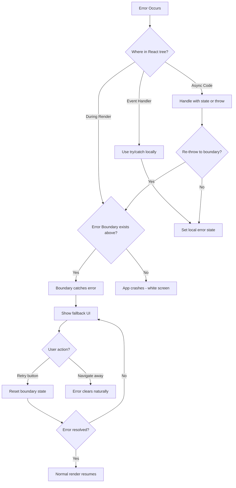

# How to Implement Error Boundaries for Graceful Error Handling in React

Author: [nawazdhandala](https://github.com/nawazdhandala)

Tags: React, Error Handling, TypeScript, Frontend, Reliability, Best Practices

Description: Learn how to implement Error Boundaries in React to gracefully handle JavaScript errors, prevent app crashes, and provide better user experiences with fallback UIs and error reporting.

---

React applications can crash entirely when a JavaScript error occurs during rendering. A single unhandled error in a component can bring down your entire app, leaving users staring at a blank screen. Error Boundaries solve this problem by catching errors in the component tree and displaying a fallback UI instead of crashing.

## What Are Error Boundaries?

Error Boundaries are React components that catch JavaScript errors anywhere in their child component tree, log those errors, and display a fallback UI instead of the crashed component tree. They work like a `try/catch` block but for React components.

Error Boundaries catch errors in:
- Rendering
- Lifecycle methods
- Constructors of the whole tree below them

Error Boundaries do NOT catch errors in:
- Event handlers (use regular `try/catch` for these)
- Asynchronous code (setTimeout, requestAnimationFrame, etc.)
- Server-side rendering
- Errors thrown in the Error Boundary itself

## Basic Error Boundary Implementation

Error Boundaries must be class components because they rely on the `componentDidCatch` lifecycle method and `getDerivedStateFromError` static method. Here's a basic implementation.

```typescript
import React, { Component, ReactNode } from 'react';

// Props interface defines what can be passed to the Error Boundary
interface ErrorBoundaryProps {
  children: ReactNode;            // Components to wrap
  fallback?: ReactNode;           // Optional custom fallback UI
}

// State tracks whether an error has occurred
interface ErrorBoundaryState {
  hasError: boolean;
  error: Error | null;
}

class ErrorBoundary extends Component<ErrorBoundaryProps, ErrorBoundaryState> {
  constructor(props: ErrorBoundaryProps) {
    super(props);
    // Initialize state with no error
    this.state = { hasError: false, error: null };
  }

  // This static method is called when an error is thrown
  // It updates state to trigger a re-render with fallback UI
  static getDerivedStateFromError(error: Error): ErrorBoundaryState {
    return { hasError: true, error };
  }

  // This method is called after an error is caught
  // Use it for logging errors to an error reporting service
  componentDidCatch(error: Error, errorInfo: React.ErrorInfo): void {
    console.error('Error caught by boundary:', error);
    console.error('Component stack:', errorInfo.componentStack);
  }

  render(): ReactNode {
    // If an error occurred, show fallback UI
    if (this.state.hasError) {
      // Use custom fallback if provided, otherwise show default message
      if (this.props.fallback) {
        return this.props.fallback;
      }
      return (
        <div role="alert">
          <h2>Something went wrong</h2>
          <p>Please try refreshing the page.</p>
        </div>
      );
    }

    // No error - render children normally
    return this.props.children;
  }
}

export default ErrorBoundary;
```

## Using Error Boundaries

Wrap components that might throw errors with your Error Boundary.

```typescript
import React from 'react';
import ErrorBoundary from './ErrorBoundary';
import Dashboard from './Dashboard';
import Sidebar from './Sidebar';

function App(): React.ReactElement {
  return (
    <div className="app">
      {/* Wrap the entire app for top-level protection */}
      <ErrorBoundary>
        <header>
          <h1>My Application</h1>
        </header>

        {/* Wrap individual sections for granular error handling */}
        <main>
          <ErrorBoundary fallback={<p>Dashboard failed to load</p>}>
            <Dashboard />
          </ErrorBoundary>

          <ErrorBoundary fallback={<p>Sidebar unavailable</p>}>
            <Sidebar />
          </ErrorBoundary>
        </main>
      </ErrorBoundary>
    </div>
  );
}

export default App;
```

## Advanced Error Boundary with Reset Capability

A more sophisticated Error Boundary allows users to retry after an error. This is useful for transient errors that might resolve themselves.

```typescript
import React, { Component, ReactNode } from 'react';

interface ErrorBoundaryProps {
  children: ReactNode;
  fallback?: (error: Error, reset: () => void) => ReactNode;
  onError?: (error: Error, errorInfo: React.ErrorInfo) => void;
  resetKeys?: unknown[];  // Reset when these values change
}

interface ErrorBoundaryState {
  hasError: boolean;
  error: Error | null;
}

class ErrorBoundary extends Component<ErrorBoundaryProps, ErrorBoundaryState> {
  constructor(props: ErrorBoundaryProps) {
    super(props);
    this.state = { hasError: false, error: null };
  }

  static getDerivedStateFromError(error: Error): ErrorBoundaryState {
    return { hasError: true, error };
  }

  componentDidCatch(error: Error, errorInfo: React.ErrorInfo): void {
    // Call optional error handler for logging/reporting
    this.props.onError?.(error, errorInfo);
  }

  // Check if resetKeys have changed and reset error state
  componentDidUpdate(prevProps: ErrorBoundaryProps): void {
    if (this.state.hasError && this.props.resetKeys) {
      const keysChanged = this.props.resetKeys.some(
        (key, index) => key !== prevProps.resetKeys?.[index]
      );

      if (keysChanged) {
        this.reset();
      }
    }
  }

  // Method to reset error state and try rendering children again
  reset = (): void => {
    this.setState({ hasError: false, error: null });
  };

  render(): ReactNode {
    if (this.state.hasError && this.state.error) {
      // If custom fallback function provided, call it with error and reset
      if (this.props.fallback) {
        return this.props.fallback(this.state.error, this.reset);
      }

      // Default fallback UI with retry button
      return (
        <div role="alert" className="error-boundary">
          <h2>Something went wrong</h2>
          <pre>{this.state.error.message}</pre>
          <button onClick={this.reset}>Try Again</button>
        </div>
      );
    }

    return this.props.children;
  }
}

export default ErrorBoundary;
```

Usage with the advanced Error Boundary:

```typescript
import React, { useState } from 'react';
import ErrorBoundary from './ErrorBoundary';
import UserProfile from './UserProfile';

function UserPage(): React.ReactElement {
  const [userId, setUserId] = useState<string>('1');

  return (
    <ErrorBoundary
      // Reset error state when userId changes
      resetKeys={[userId]}
      // Custom fallback with error details and retry button
      fallback={(error, reset) => (
        <div className="error-container">
          <h3>Failed to load user profile</h3>
          <p>{error.message}</p>
          <button onClick={reset}>Retry</button>
          <button onClick={() => setUserId('1')}>Load Default User</button>
        </div>
      )}
      // Log errors to monitoring service
      onError={(error, info) => {
        console.error('User profile error:', error, info.componentStack);
      }}
    >
      <UserProfile userId={userId} />
    </ErrorBoundary>
  );
}

export default UserPage;
```

## Integrating with Error Reporting Services

Connect your Error Boundary to monitoring services like OneUptime to track errors in production. This gives you visibility into what's failing for real users.

```typescript
import React, { Component, ReactNode } from 'react';

interface ErrorBoundaryProps {
  children: ReactNode;
  componentName?: string;  // Identify which component failed
}

interface ErrorBoundaryState {
  hasError: boolean;
  error: Error | null;
  eventId: string | null;  // For error tracking reference
}

class MonitoredErrorBoundary extends Component<ErrorBoundaryProps, ErrorBoundaryState> {
  constructor(props: ErrorBoundaryProps) {
    super(props);
    this.state = { hasError: false, error: null, eventId: null };
  }

  static getDerivedStateFromError(error: Error): Partial<ErrorBoundaryState> {
    return { hasError: true, error };
  }

  async componentDidCatch(error: Error, errorInfo: React.ErrorInfo): Promise<void> {
    // Generate a unique event ID for tracking
    const eventId = crypto.randomUUID();

    // Prepare error payload for monitoring service
    const errorPayload = {
      eventId,
      error: {
        name: error.name,
        message: error.message,
        stack: error.stack,
      },
      componentStack: errorInfo.componentStack,
      componentName: this.props.componentName || 'Unknown',
      timestamp: new Date().toISOString(),
      userAgent: navigator.userAgent,
      url: window.location.href,
    };

    // Send to your monitoring endpoint
    try {
      await fetch('/api/errors', {
        method: 'POST',
        headers: { 'Content-Type': 'application/json' },
        body: JSON.stringify(errorPayload),
      });
    } catch (reportingError) {
      console.error('Failed to report error:', reportingError);
    }

    this.setState({ eventId });
  }

  render(): ReactNode {
    if (this.state.hasError) {
      return (
        <div role="alert" className="error-boundary">
          <h2>Something went wrong</h2>
          <p>Our team has been notified and is working on a fix.</p>
          {this.state.eventId && (
            <p className="error-id">
              Error ID: <code>{this.state.eventId}</code>
            </p>
          )}
          <button onClick={() => window.location.reload()}>
            Refresh Page
          </button>
        </div>
      );
    }

    return this.props.children;
  }
}

export default MonitoredErrorBoundary;
```

## Error Boundary Patterns and Best Practices

### Strategic Placement

Place Error Boundaries at different levels based on how much of your UI should be affected by an error.

```typescript
import React from 'react';
import ErrorBoundary from './ErrorBoundary';
import Header from './Header';
import MainContent from './MainContent';
import WidgetA from './WidgetA';
import WidgetB from './WidgetB';

function App(): React.ReactElement {
  return (
    // Top-level boundary catches catastrophic errors
    <ErrorBoundary fallback={<FullPageError />}>
      <Header />

      <main>
        {/* Route-level boundary - one route failure doesn't break others */}
        <ErrorBoundary fallback={<RouteError />}>
          <MainContent>
            {/* Widget-level boundaries - isolated failures */}
            <ErrorBoundary fallback={<WidgetPlaceholder name="Widget A" />}>
              <WidgetA />
            </ErrorBoundary>

            <ErrorBoundary fallback={<WidgetPlaceholder name="Widget B" />}>
              <WidgetB />
            </ErrorBoundary>
          </MainContent>
        </ErrorBoundary>
      </main>
    </ErrorBoundary>
  );
}

// Fallback components
function FullPageError(): React.ReactElement {
  return (
    <div className="full-page-error">
      <h1>Application Error</h1>
      <p>Please refresh the page or contact support.</p>
    </div>
  );
}

function RouteError(): React.ReactElement {
  return (
    <div className="route-error">
      <h2>This page couldn't be loaded</h2>
      <a href="/">Go to Home</a>
    </div>
  );
}

function WidgetPlaceholder({ name }: { name: string }): React.ReactElement {
  return (
    <div className="widget-placeholder">
      <p>{name} is temporarily unavailable</p>
    </div>
  );
}

export default App;
```

### Handling Event Handler Errors

Error Boundaries don't catch errors in event handlers. Use `try/catch` for those.

```typescript
import React, { useState } from 'react';

function FormComponent(): React.ReactElement {
  const [error, setError] = useState<string | null>(null);

  // Event handler errors need try/catch - Error Boundaries won't catch these
  const handleSubmit = async (event: React.FormEvent): Promise<void> => {
    event.preventDefault();
    setError(null);

    try {
      await submitForm();
    } catch (err) {
      // Handle the error locally or set state to show error UI
      const errorMessage = err instanceof Error ? err.message : 'Unknown error';
      setError(errorMessage);

      // Optionally report to monitoring
      reportError(err);
    }
  };

  return (
    <form onSubmit={handleSubmit}>
      {error && (
        <div role="alert" className="form-error">
          {error}
        </div>
      )}
      <button type="submit">Submit</button>
    </form>
  );
}

async function submitForm(): Promise<void> {
  // Form submission logic
}

function reportError(error: unknown): void {
  // Send to monitoring service
  console.error('Form error:', error);
}

export default FormComponent;
```

### Async Error Handling Pattern

For async operations inside components, combine Error Boundaries with local error state.

```typescript
import React, { useEffect, useState, ReactElement } from 'react';

interface DataFetcherProps {
  url: string;
  children: (data: unknown) => ReactElement;
}

function DataFetcher({ url, children }: DataFetcherProps): ReactElement {
  const [data, setData] = useState<unknown>(null);
  const [error, setError] = useState<Error | null>(null);
  const [loading, setLoading] = useState(true);

  useEffect(() => {
    let cancelled = false;

    async function fetchData(): Promise<void> {
      try {
        setLoading(true);
        setError(null);

        const response = await fetch(url);
        if (!response.ok) {
          throw new Error(`HTTP ${response.status}: ${response.statusText}`);
        }

        const result = await response.json();

        if (!cancelled) {
          setData(result);
        }
      } catch (err) {
        if (!cancelled) {
          // For async errors, we can either:
          // 1. Set local error state (shown below)
          // 2. Re-throw to trigger Error Boundary (uncomment next line)
          // throw err;

          setError(err instanceof Error ? err : new Error('Unknown error'));
        }
      } finally {
        if (!cancelled) {
          setLoading(false);
        }
      }
    }

    fetchData();

    // Cleanup function to prevent state updates on unmounted components
    return () => {
      cancelled = true;
    };
  }, [url]);

  if (loading) {
    return <div>Loading...</div>;
  }

  if (error) {
    return (
      <div role="alert">
        <h3>Failed to load data</h3>
        <p>{error.message}</p>
      </div>
    );
  }

  return children(data);
}

export default DataFetcher;
```

## Creating a Reusable Error Boundary Hook

While Error Boundaries must be class components, you can create a hook to help with error state management and pair it with a boundary component.

```typescript
import React, { useState, useCallback, ReactNode, Component } from 'react';

// Custom hook for error handling in function components
interface UseErrorHandlerReturn {
  error: Error | null;
  setError: (error: Error | null) => void;
  clearError: () => void;
  handleError: (error: unknown) => void;
}

function useErrorHandler(): UseErrorHandlerReturn {
  const [error, setError] = useState<Error | null>(null);

  const clearError = useCallback(() => {
    setError(null);
  }, []);

  const handleError = useCallback((err: unknown) => {
    if (err instanceof Error) {
      setError(err);
    } else {
      setError(new Error(String(err)));
    }
  }, []);

  return { error, setError, clearError, handleError };
}

// Component that throws error to trigger Error Boundary
function ErrorThrower({ error }: { error: Error }): never {
  throw error;
}

// Usage example combining hook with Error Boundary
function MyComponent(): React.ReactElement {
  const { error, handleError, clearError } = useErrorHandler();

  const handleClick = async (): Promise<void> => {
    try {
      await someAsyncOperation();
    } catch (err) {
      handleError(err);
    }
  };

  // If we have an error, throw it to let Error Boundary catch it
  if (error) {
    return <ErrorThrower error={error} />;
  }

  return (
    <div>
      <button onClick={handleClick}>Perform Action</button>
    </div>
  );
}

async function someAsyncOperation(): Promise<void> {
  // Async operation that might fail
}

export { useErrorHandler };
export default MyComponent;
```

## Error Boundary Decision Flow

The following diagram shows how to decide where to place Error Boundaries in your application.



## Common Mistakes to Avoid

### Don't Catch Too Much

Avoid wrapping your entire app in a single Error Boundary. This provides poor user experience because any error crashes everything.

```typescript
// Too coarse - one error breaks everything
function BadApp(): React.ReactElement {
  return (
    <ErrorBoundary>
      <EntireApp />  {/* Everything fails if anything fails */}
    </ErrorBoundary>
  );
}

// Better - isolated error handling
function GoodApp(): React.ReactElement {
  return (
    <div>
      <Header />  {/* Header stays visible */}
      <ErrorBoundary>
        <MainContent />  {/* Only main content affected */}
      </ErrorBoundary>
      <Footer />  {/* Footer stays visible */}
    </div>
  );
}
```

### Don't Swallow Errors Silently

Always log errors for debugging. Silent failures make problems hard to diagnose.

```typescript
// Bad - error is swallowed silently
componentDidCatch(error: Error, errorInfo: React.ErrorInfo): void {
  // Nothing here - error disappears into the void
}

// Good - error is logged and reported
componentDidCatch(error: Error, errorInfo: React.ErrorInfo): void {
  console.error('Caught error:', error, errorInfo);
  // Send to monitoring service
  reportErrorToService(error, errorInfo);
}
```

## Summary

| Concept | Implementation |
|---------|----------------|
| **Basic Boundary** | Class component with `getDerivedStateFromError` and `componentDidCatch` |
| **Fallback UI** | Custom component or JSX shown when error occurs |
| **Reset Capability** | Method to clear error state and retry rendering |
| **Error Reporting** | Integration with monitoring services in `componentDidCatch` |
| **Strategic Placement** | Multiple boundaries at different levels for granular recovery |
| **Event Handlers** | Use `try/catch` - not caught by boundaries |
| **Async Errors** | Handle locally or re-throw to trigger boundary |

Error Boundaries are essential for building resilient React applications. They prevent the dreaded white screen of death, provide meaningful feedback to users, and give you the error data you need to fix problems. Place them strategically throughout your component tree, integrate them with your monitoring stack, and always provide users with a way to recover.
