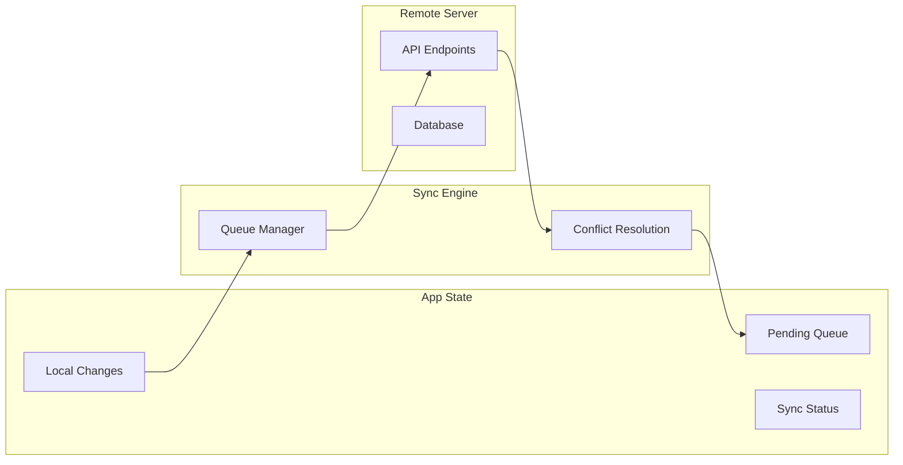

# How to Implement Background Sync in React Native

Author: [nawazdhandala](https://github.com/nawazdhandala)

Tags: React Native, Background Sync, Offline, Mobile Development, Data Synchronization

Description: Learn how to implement background synchronization in React Native to keep data in sync even when the app is not in the foreground.

---

## Introduction

Background synchronization is a critical feature for modern mobile applications that need to maintain data consistency between the device and server. Whether you are building a messaging app, a note-taking application, or an enterprise solution, users expect their data to be up-to-date regardless of network conditions or app state.

In this comprehensive guide, we will explore how to implement robust background sync in React Native applications. We will cover platform-specific configurations, third-party libraries, and best practices to ensure reliable data synchronization.

## Understanding Background Sync

Background sync allows your application to synchronize data with a remote server even when the app is not actively being used. This is essential for:

- **Offline-first applications**: Users can work offline, and changes sync automatically when connectivity is restored
- **Real-time data consistency**: Keep local and remote data in sync without user intervention
- **Improved user experience**: No need to wait for data to load when opening the app
- **Resource efficiency**: Batch sync operations during optimal conditions

### How Background Sync Works



The typical background sync flow involves:

1. Detecting changes in local data
2. Queuing changes for synchronization
3. Triggering sync when conditions are favorable
4. Handling conflicts between local and remote data
5. Updating local state with server responses

## iOS Background Modes Configuration

iOS provides several background execution modes that enable background sync. You need to configure these in your Xcode project.

### Enabling Background Modes

First, update your `ios/YourApp/Info.plist`:

```xml
<key>UIBackgroundModes</key>
<array>
    <string>fetch</string>
    <string>remote-notification</string>
    <string>processing</string>
</array>
```

### Understanding iOS Background Modes

**Background Fetch (`fetch`)**: Allows iOS to wake your app periodically to fetch new content. The system determines the optimal time based on usage patterns.

```typescript
// ios/AppDelegate.m
- (void)application:(UIApplication *)application
    performFetchWithCompletionHandler:(void (^)(UIBackgroundFetchResult))completionHandler
{
    // Notify React Native about background fetch
    [[NSNotificationCenter defaultCenter]
        postNotificationName:@"BackgroundFetchTriggered"
        object:nil];

    // Call completion handler with result
    completionHandler(UIBackgroundFetchResultNewData);
}
```

**Background Processing (`processing`)**: iOS 13+ feature for longer background tasks.

```swift
// Register background task identifier in Info.plist
<key>BGTaskSchedulerPermittedIdentifiers</key>
<array>
    <string>com.yourapp.datasync</string>
</array>
```

### iOS Background Task Scheduling

```typescript
// BackgroundTaskManager.ios.ts
import { NativeModules, NativeEventEmitter } from 'react-native';

const { BackgroundTaskModule } = NativeModules;
const eventEmitter = new NativeEventEmitter(BackgroundTaskModule);

export const scheduleBackgroundSync = async (
  identifier: string,
  earliestBeginDate: Date
): Promise<void> => {
  try {
    await BackgroundTaskModule.scheduleTask({
      identifier,
      earliestBeginDate: earliestBeginDate.getTime(),
      requiresNetworkConnectivity: true,
      requiresExternalPower: false,
    });
  } catch (error) {
    console.error('Failed to schedule background task:', error);
  }
};

export const registerBackgroundTaskHandler = (
  handler: () => Promise<void>
): (() => void) => {
  const subscription = eventEmitter.addListener(
    'onBackgroundTask',
    async () => {
      try {
        await handler();
        BackgroundTaskModule.completeTask(true);
      } catch (error) {
        BackgroundTaskModule.completeTask(false);
      }
    }
  );

  return () => subscription.remove();
};
```

## Android WorkManager Integration

Android WorkManager is the recommended solution for deferrable, guaranteed background work on Android. It handles backward compatibility and respects system constraints.

### Setting Up WorkManager

Add the dependency to your `android/app/build.gradle`:

```groovy
dependencies {
    implementation "androidx.work:work-runtime:2.9.0"
}
```

### Creating a Sync Worker

```java
// android/app/src/main/java/com/yourapp/SyncWorker.java
package com.yourapp;

import android.content.Context;
import androidx.annotation.NonNull;
import androidx.work.Worker;
import androidx.work.WorkerParameters;
import androidx.work.Data;

public class SyncWorker extends Worker {

    public static final String TAG = "SyncWorker";

    public SyncWorker(
        @NonNull Context context,
        @NonNull WorkerParameters params
    ) {
        super(context, params);
    }

    @NonNull
    @Override
    public Result doWork() {
        try {
            // Get sync parameters
            String syncType = getInputData().getString("syncType");

            // Perform synchronization
            boolean success = performSync(syncType);

            if (success) {
                // Return success with output data
                Data outputData = new Data.Builder()
                    .putBoolean("syncCompleted", true)
                    .putLong("syncTimestamp", System.currentTimeMillis())
                    .build();
                return Result.success(outputData);
            } else {
                // Retry if sync failed
                return Result.retry();
            }
        } catch (Exception e) {
            e.printStackTrace();
            return Result.failure();
        }
    }

    private boolean performSync(String syncType) {
        // Implement your sync logic here
        // This runs in a background thread
        return true;
    }
}
```

### Scheduling Work with Constraints

```java
// android/app/src/main/java/com/yourapp/SyncScheduler.java
package com.yourapp;

import android.content.Context;
import androidx.work.*;
import java.util.concurrent.TimeUnit;

public class SyncScheduler {

    public static void schedulePeriodicSync(Context context) {
        // Define constraints
        Constraints constraints = new Constraints.Builder()
            .setRequiredNetworkType(NetworkType.CONNECTED)
            .setRequiresBatteryNotLow(true)
            .setRequiresStorageNotLow(true)
            .build();

        // Create periodic work request
        PeriodicWorkRequest syncRequest = new PeriodicWorkRequest.Builder(
            SyncWorker.class,
            15, TimeUnit.MINUTES  // Minimum interval is 15 minutes
        )
            .setConstraints(constraints)
            .setBackoffCriteria(
                BackoffPolicy.EXPONENTIAL,
                WorkRequest.MIN_BACKOFF_MILLIS,
                TimeUnit.MILLISECONDS
            )
            .addTag("periodic_sync")
            .build();

        // Enqueue the work
        WorkManager.getInstance(context)
            .enqueueUniquePeriodicWork(
                "data_sync",
                ExistingPeriodicWorkPolicy.KEEP,
                syncRequest
            );
    }

    public static void scheduleOneTimeSync(Context context, String syncType) {
        Constraints constraints = new Constraints.Builder()
            .setRequiredNetworkType(NetworkType.CONNECTED)
            .build();

        Data inputData = new Data.Builder()
            .putString("syncType", syncType)
            .build();

        OneTimeWorkRequest syncRequest = new OneTimeWorkRequest.Builder(
            SyncWorker.class
        )
            .setConstraints(constraints)
            .setInputData(inputData)
            .setExpedited(OutOfQuotaPolicy.RUN_AS_NON_EXPEDITED_WORK_REQUEST)
            .build();

        WorkManager.getInstance(context)
            .enqueue(syncRequest);
    }
}
```

### Native Module Bridge for React Native

```java
// android/app/src/main/java/com/yourapp/SyncModule.java
package com.yourapp;

import com.facebook.react.bridge.*;

public class SyncModule extends ReactContextBaseJavaModule {

    public SyncModule(ReactApplicationContext reactContext) {
        super(reactContext);
    }

    @Override
    public String getName() {
        return "SyncModule";
    }

    @ReactMethod
    public void schedulePeriodicSync(Promise promise) {
        try {
            SyncScheduler.schedulePeriodicSync(getReactApplicationContext());
            promise.resolve(true);
        } catch (Exception e) {
            promise.reject("SCHEDULE_ERROR", e.getMessage());
        }
    }

    @ReactMethod
    public void scheduleOneTimeSync(String syncType, Promise promise) {
        try {
            SyncScheduler.scheduleOneTimeSync(
                getReactApplicationContext(),
                syncType
            );
            promise.resolve(true);
        } catch (Exception e) {
            promise.reject("SCHEDULE_ERROR", e.getMessage());
        }
    }

    @ReactMethod
    public void cancelAllSync(Promise promise) {
        try {
            WorkManager.getInstance(getReactApplicationContext())
                .cancelAllWorkByTag("periodic_sync");
            promise.resolve(true);
        } catch (Exception e) {
            promise.reject("CANCEL_ERROR", e.getMessage());
        }
    }
}
```

## Using react-native-background-fetch

`react-native-background-fetch` is a popular library that provides a unified API for background fetch on both iOS and Android.

### Installation

```bash
npm install react-native-background-fetch
cd ios && pod install
```

### Configuration

For iOS, add to `Info.plist`:

```xml
<key>UIBackgroundModes</key>
<array>
    <string>fetch</string>
</array>
```

For Android, update `android/app/build.gradle`:

```groovy
android {
    defaultConfig {
        // Enable background fetch
        manifestPlaceholders = [
            appAuthRedirectScheme: 'yourapp'
        ]
    }
}
```

### Implementing Background Fetch

```typescript
// src/services/BackgroundSyncService.ts
import BackgroundFetch, {
  BackgroundFetchStatus,
  BackgroundFetchConfig,
} from 'react-native-background-fetch';

interface SyncConfig {
  minimumFetchInterval: number;
  stopOnTerminate: boolean;
  startOnBoot: boolean;
  enableHeadless: boolean;
  requiresNetworkConnectivity: boolean;
  requiresBatteryNotLow: boolean;
}

const DEFAULT_CONFIG: SyncConfig = {
  minimumFetchInterval: 15, // minutes
  stopOnTerminate: false,
  startOnBoot: true,
  enableHeadless: true,
  requiresNetworkConnectivity: true,
  requiresBatteryNotLow: true,
};

export class BackgroundSyncService {
  private static instance: BackgroundSyncService;
  private isConfigured: boolean = false;
  private syncHandler: (() => Promise<void>) | null = null;

  static getInstance(): BackgroundSyncService {
    if (!BackgroundSyncService.instance) {
      BackgroundSyncService.instance = new BackgroundSyncService();
    }
    return BackgroundSyncService.instance;
  }

  async configure(
    syncHandler: () => Promise<void>,
    config: Partial<SyncConfig> = {}
  ): Promise<BackgroundFetchStatus> {
    const finalConfig = { ...DEFAULT_CONFIG, ...config };
    this.syncHandler = syncHandler;

    const backgroundFetchConfig: BackgroundFetchConfig = {
      minimumFetchInterval: finalConfig.minimumFetchInterval,
      stopOnTerminate: finalConfig.stopOnTerminate,
      startOnBoot: finalConfig.startOnBoot,
      enableHeadless: finalConfig.enableHeadless,
      requiredNetworkType: finalConfig.requiresNetworkConnectivity
        ? BackgroundFetch.NETWORK_TYPE_ANY
        : BackgroundFetch.NETWORK_TYPE_NONE,
      requiresBatteryNotLow: finalConfig.requiresBatteryNotLow,
      requiresCharging: false,
      requiresDeviceIdle: false,
      requiresStorageNotLow: false,
    };

    const status = await BackgroundFetch.configure(
      backgroundFetchConfig,
      this.onBackgroundFetch.bind(this),
      this.onBackgroundFetchTimeout.bind(this)
    );

    this.isConfigured = true;
    console.log('[BackgroundSync] Configured with status:', status);

    return status;
  }

  private async onBackgroundFetch(taskId: string): Promise<void> {
    console.log('[BackgroundSync] Event received:', taskId);

    try {
      if (this.syncHandler) {
        await this.syncHandler();
      }
      BackgroundFetch.finish(taskId);
    } catch (error) {
      console.error('[BackgroundSync] Sync failed:', error);
      BackgroundFetch.finish(taskId);
    }
  }

  private onBackgroundFetchTimeout(taskId: string): void {
    console.warn('[BackgroundSync] Task timeout:', taskId);
    BackgroundFetch.finish(taskId);
  }

  async scheduleTask(
    taskId: string,
    delay: number = 0,
    periodic: boolean = false
  ): Promise<void> {
    await BackgroundFetch.scheduleTask({
      taskId,
      delay,
      periodic,
      enableHeadless: true,
      stopOnTerminate: false,
      requiredNetworkType: BackgroundFetch.NETWORK_TYPE_ANY,
    });
  }

  async start(): Promise<void> {
    if (!this.isConfigured) {
      throw new Error('BackgroundSyncService not configured');
    }
    await BackgroundFetch.start();
  }

  async stop(): Promise<void> {
    await BackgroundFetch.stop();
  }

  async getStatus(): Promise<BackgroundFetchStatus> {
    return BackgroundFetch.status();
  }
}
```

### Headless Task for Android

```typescript
// src/services/HeadlessTask.ts
import BackgroundFetch from 'react-native-background-fetch';
import { syncData } from './SyncEngine';

const HeadlessTask = async (event: { taskId: string; timeout: boolean }) => {
  const { taskId, timeout } = event;

  if (timeout) {
    console.log('[HeadlessTask] Task timed out:', taskId);
    BackgroundFetch.finish(taskId);
    return;
  }

  console.log('[HeadlessTask] Executing:', taskId);

  try {
    await syncData();
    console.log('[HeadlessTask] Sync completed');
  } catch (error) {
    console.error('[HeadlessTask] Sync failed:', error);
  }

  BackgroundFetch.finish(taskId);
};

// Register the headless task
BackgroundFetch.registerHeadlessTask(HeadlessTask);

export default HeadlessTask;
```

## Network Condition Checks

Checking network conditions before syncing ensures efficient resource usage and prevents failed sync attempts.

```typescript
// src/utils/NetworkUtils.ts
import NetInfo, {
  NetInfoState,
  NetInfoStateType,
} from '@react-native-community/netinfo';

export interface NetworkConditions {
  isConnected: boolean;
  isWifi: boolean;
  isCellular: boolean;
  isMetered: boolean;
  effectiveType: string | null;
}

export class NetworkMonitor {
  private static instance: NetworkMonitor;
  private currentState: NetInfoState | null = null;
  private listeners: ((conditions: NetworkConditions) => void)[] = [];
  private unsubscribe: (() => void) | null = null;

  static getInstance(): NetworkMonitor {
    if (!NetworkMonitor.instance) {
      NetworkMonitor.instance = new NetworkMonitor();
    }
    return NetworkMonitor.instance;
  }

  start(): void {
    this.unsubscribe = NetInfo.addEventListener((state) => {
      this.currentState = state;
      const conditions = this.getConditions();
      this.listeners.forEach((listener) => listener(conditions));
    });
  }

  stop(): void {
    if (this.unsubscribe) {
      this.unsubscribe();
      this.unsubscribe = null;
    }
  }

  async getCurrentConditions(): Promise<NetworkConditions> {
    const state = await NetInfo.fetch();
    this.currentState = state;
    return this.getConditions();
  }

  private getConditions(): NetworkConditions {
    if (!this.currentState) {
      return {
        isConnected: false,
        isWifi: false,
        isCellular: false,
        isMetered: true,
        effectiveType: null,
      };
    }

    return {
      isConnected: this.currentState.isConnected ?? false,
      isWifi: this.currentState.type === 'wifi',
      isCellular: this.currentState.type === 'cellular',
      isMetered: this.currentState.details?.isConnectionExpensive ?? true,
      effectiveType:
        this.currentState.type === 'cellular'
          ? (this.currentState.details as any)?.cellularGeneration ?? null
          : null,
    };
  }

  addListener(listener: (conditions: NetworkConditions) => void): () => void {
    this.listeners.push(listener);
    return () => {
      this.listeners = this.listeners.filter((l) => l !== listener);
    };
  }

  shouldSync(
    preferWifi: boolean = false,
    requireUnmetered: boolean = false
  ): boolean {
    const conditions = this.getConditions();

    if (!conditions.isConnected) {
      return false;
    }

    if (preferWifi && !conditions.isWifi) {
      return false;
    }

    if (requireUnmetered && conditions.isMetered) {
      return false;
    }

    return true;
  }
}

// Hook for React components
import { useState, useEffect } from 'react';

export const useNetworkConditions = (): NetworkConditions => {
  const [conditions, setConditions] = useState<NetworkConditions>({
    isConnected: false,
    isWifi: false,
    isCellular: false,
    isMetered: true,
    effectiveType: null,
  });

  useEffect(() => {
    const monitor = NetworkMonitor.getInstance();

    const fetchInitial = async () => {
      const current = await monitor.getCurrentConditions();
      setConditions(current);
    };

    fetchInitial();
    const unsubscribe = monitor.addListener(setConditions);

    return () => unsubscribe();
  }, []);

  return conditions;
};
```

## Battery-Aware Syncing

Implementing battery-aware syncing prevents draining the user's device during low battery situations.

```typescript
// src/utils/BatteryUtils.ts
import { NativeModules, NativeEventEmitter, Platform } from 'react-native';

export interface BatteryState {
  level: number; // 0 to 1
  isCharging: boolean;
  isLow: boolean; // typically below 20%
}

const BATTERY_LOW_THRESHOLD = 0.2;
const BATTERY_CRITICAL_THRESHOLD = 0.1;

// For a complete implementation, you might use react-native-device-info
// or create a native module

export class BatteryMonitor {
  private static instance: BatteryMonitor;
  private currentState: BatteryState = {
    level: 1,
    isCharging: false,
    isLow: false,
  };
  private listeners: ((state: BatteryState) => void)[] = [];

  static getInstance(): BatteryMonitor {
    if (!BatteryMonitor.instance) {
      BatteryMonitor.instance = new BatteryMonitor();
    }
    return BatteryMonitor.instance;
  }

  async getCurrentState(): Promise<BatteryState> {
    // In a real implementation, this would query the native module
    // For now, we'll return a mock state
    return this.currentState;
  }

  shouldAllowSync(options: {
    allowOnLowBattery?: boolean;
    requireCharging?: boolean;
    minimumLevel?: number;
  } = {}): boolean {
    const {
      allowOnLowBattery = false,
      requireCharging = false,
      minimumLevel = BATTERY_LOW_THRESHOLD,
    } = options;

    if (requireCharging && !this.currentState.isCharging) {
      return false;
    }

    if (!allowOnLowBattery && this.currentState.level < minimumLevel) {
      return false;
    }

    if (this.currentState.level < BATTERY_CRITICAL_THRESHOLD) {
      return false; // Never sync at critical battery
    }

    return true;
  }

  getSyncStrategy(): 'full' | 'partial' | 'defer' {
    if (this.currentState.isCharging) {
      return 'full'; // Sync everything when charging
    }

    if (this.currentState.level > 0.5) {
      return 'full'; // Good battery, sync everything
    }

    if (this.currentState.level > BATTERY_LOW_THRESHOLD) {
      return 'partial'; // Sync only high priority items
    }

    return 'defer'; // Wait for better conditions
  }
}

// Sync strategy implementation
export interface SyncItem {
  id: string;
  priority: 'high' | 'medium' | 'low';
  data: any;
  size: number;
}

export const filterItemsByBatteryStrategy = (
  items: SyncItem[],
  strategy: 'full' | 'partial' | 'defer'
): SyncItem[] => {
  switch (strategy) {
    case 'full':
      return items;
    case 'partial':
      return items.filter((item) => item.priority === 'high');
    case 'defer':
      return [];
    default:
      return items;
  }
};
```

## Sync Queue Management

A robust queue management system ensures reliable synchronization with proper ordering, retry logic, and persistence.

```typescript
// src/services/SyncQueue.ts
import AsyncStorage from '@react-native-async-storage/async-storage';

export interface SyncOperation {
  id: string;
  type: 'create' | 'update' | 'delete';
  entity: string;
  payload: any;
  priority: number;
  createdAt: number;
  retryCount: number;
  maxRetries: number;
  lastError?: string;
  status: 'pending' | 'processing' | 'failed' | 'completed';
}

const QUEUE_STORAGE_KEY = '@sync_queue';
const MAX_QUEUE_SIZE = 1000;

export class SyncQueue {
  private static instance: SyncQueue;
  private queue: SyncOperation[] = [];
  private isProcessing: boolean = false;
  private processingPromise: Promise<void> | null = null;

  static getInstance(): SyncQueue {
    if (!SyncQueue.instance) {
      SyncQueue.instance = new SyncQueue();
    }
    return SyncQueue.instance;
  }

  async initialize(): Promise<void> {
    await this.loadFromStorage();
  }

  private async loadFromStorage(): Promise<void> {
    try {
      const stored = await AsyncStorage.getItem(QUEUE_STORAGE_KEY);
      if (stored) {
        this.queue = JSON.parse(stored);
        // Reset any processing items back to pending
        this.queue = this.queue.map((op) => ({
          ...op,
          status: op.status === 'processing' ? 'pending' : op.status,
        }));
      }
    } catch (error) {
      console.error('[SyncQueue] Failed to load from storage:', error);
      this.queue = [];
    }
  }

  private async saveToStorage(): Promise<void> {
    try {
      await AsyncStorage.setItem(QUEUE_STORAGE_KEY, JSON.stringify(this.queue));
    } catch (error) {
      console.error('[SyncQueue] Failed to save to storage:', error);
    }
  }

  async enqueue(operation: Omit<SyncOperation, 'id' | 'status' | 'retryCount' | 'createdAt'>): Promise<string> {
    if (this.queue.length >= MAX_QUEUE_SIZE) {
      // Remove oldest completed or failed operations
      this.queue = this.queue.filter(
        (op) => op.status !== 'completed' && op.status !== 'failed'
      );
    }

    const id = `sync_${Date.now()}_${Math.random().toString(36).substr(2, 9)}`;
    const newOperation: SyncOperation = {
      ...operation,
      id,
      status: 'pending',
      retryCount: 0,
      createdAt: Date.now(),
    };

    this.queue.push(newOperation);
    this.sortQueue();
    await this.saveToStorage();

    return id;
  }

  private sortQueue(): void {
    this.queue.sort((a, b) => {
      // Sort by priority (higher first), then by creation time (older first)
      if (a.priority !== b.priority) {
        return b.priority - a.priority;
      }
      return a.createdAt - b.createdAt;
    });
  }

  async dequeue(): Promise<SyncOperation | null> {
    const pendingOp = this.queue.find((op) => op.status === 'pending');
    if (!pendingOp) {
      return null;
    }

    pendingOp.status = 'processing';
    await this.saveToStorage();

    return pendingOp;
  }

  async markCompleted(id: string): Promise<void> {
    const operation = this.queue.find((op) => op.id === id);
    if (operation) {
      operation.status = 'completed';
      await this.saveToStorage();
    }
  }

  async markFailed(id: string, error: string): Promise<boolean> {
    const operation = this.queue.find((op) => op.id === id);
    if (!operation) {
      return false;
    }

    operation.retryCount++;
    operation.lastError = error;

    if (operation.retryCount >= operation.maxRetries) {
      operation.status = 'failed';
      await this.saveToStorage();
      return false; // No more retries
    }

    operation.status = 'pending';
    await this.saveToStorage();
    return true; // Will retry
  }

  async removeCompleted(): Promise<number> {
    const initialLength = this.queue.length;
    this.queue = this.queue.filter((op) => op.status !== 'completed');
    await this.saveToStorage();
    return initialLength - this.queue.length;
  }

  getPendingCount(): number {
    return this.queue.filter((op) => op.status === 'pending').length;
  }

  getFailedOperations(): SyncOperation[] {
    return this.queue.filter((op) => op.status === 'failed');
  }

  async retryFailed(): Promise<void> {
    this.queue = this.queue.map((op) => {
      if (op.status === 'failed') {
        return { ...op, status: 'pending', retryCount: 0 };
      }
      return op;
    });
    await this.saveToStorage();
  }

  async clear(): Promise<void> {
    this.queue = [];
    await this.saveToStorage();
  }
}
```

## Handling Sync Conflicts

Conflict resolution is crucial when the same data is modified both locally and on the server.

```typescript
// src/services/ConflictResolver.ts

export interface ConflictData<T> {
  local: T;
  remote: T;
  base?: T; // Original state before modifications
  localModifiedAt: number;
  remoteModifiedAt: number;
}

export type ConflictResolutionStrategy =
  | 'local_wins'
  | 'remote_wins'
  | 'latest_wins'
  | 'merge'
  | 'manual';

export interface ConflictResolution<T> {
  resolved: T;
  strategy: ConflictResolutionStrategy;
  requiresUserInput: boolean;
  conflicts?: string[]; // List of conflicting fields
}

export class ConflictResolver<T extends Record<string, any>> {
  private defaultStrategy: ConflictResolutionStrategy;
  private fieldPriorities: Record<string, ConflictResolutionStrategy>;

  constructor(
    defaultStrategy: ConflictResolutionStrategy = 'latest_wins',
    fieldPriorities: Record<string, ConflictResolutionStrategy> = {}
  ) {
    this.defaultStrategy = defaultStrategy;
    this.fieldPriorities = fieldPriorities;
  }

  resolve(conflict: ConflictData<T>): ConflictResolution<T> {
    const { local, remote, localModifiedAt, remoteModifiedAt } = conflict;

    switch (this.defaultStrategy) {
      case 'local_wins':
        return {
          resolved: local,
          strategy: 'local_wins',
          requiresUserInput: false,
        };

      case 'remote_wins':
        return {
          resolved: remote,
          strategy: 'remote_wins',
          requiresUserInput: false,
        };

      case 'latest_wins':
        return {
          resolved: localModifiedAt > remoteModifiedAt ? local : remote,
          strategy: 'latest_wins',
          requiresUserInput: false,
        };

      case 'merge':
        return this.mergeStrategy(conflict);

      case 'manual':
        return {
          resolved: local, // Default to local until user decides
          strategy: 'manual',
          requiresUserInput: true,
          conflicts: this.findConflictingFields(local, remote),
        };

      default:
        return {
          resolved: remote,
          strategy: 'remote_wins',
          requiresUserInput: false,
        };
    }
  }

  private mergeStrategy(conflict: ConflictData<T>): ConflictResolution<T> {
    const { local, remote, base, localModifiedAt, remoteModifiedAt } = conflict;
    const merged: Record<string, any> = {};
    const conflicts: string[] = [];

    const allKeys = new Set([
      ...Object.keys(local),
      ...Object.keys(remote),
    ]);

    for (const key of allKeys) {
      const localValue = local[key];
      const remoteValue = remote[key];
      const baseValue = base?.[key];

      // If values are the same, no conflict
      if (JSON.stringify(localValue) === JSON.stringify(remoteValue)) {
        merged[key] = localValue;
        continue;
      }

      // Check if field has specific priority
      const fieldStrategy = this.fieldPriorities[key];
      if (fieldStrategy) {
        merged[key] = fieldStrategy === 'local_wins' ? localValue : remoteValue;
        continue;
      }

      // If we have base, use three-way merge logic
      if (base !== undefined) {
        const localChanged = JSON.stringify(localValue) !== JSON.stringify(baseValue);
        const remoteChanged = JSON.stringify(remoteValue) !== JSON.stringify(baseValue);

        if (localChanged && !remoteChanged) {
          merged[key] = localValue;
        } else if (!localChanged && remoteChanged) {
          merged[key] = remoteValue;
        } else {
          // Both changed - conflict
          conflicts.push(key);
          // Use latest modification timestamp
          merged[key] = localModifiedAt > remoteModifiedAt ? localValue : remoteValue;
        }
      } else {
        // No base, use latest wins for this field
        conflicts.push(key);
        merged[key] = localModifiedAt > remoteModifiedAt ? localValue : remoteValue;
      }
    }

    return {
      resolved: merged as T,
      strategy: 'merge',
      requiresUserInput: conflicts.length > 0,
      conflicts,
    };
  }

  private findConflictingFields(local: T, remote: T): string[] {
    const conflicts: string[] = [];
    const allKeys = new Set([...Object.keys(local), ...Object.keys(remote)]);

    for (const key of allKeys) {
      if (JSON.stringify(local[key]) !== JSON.stringify(remote[key])) {
        conflicts.push(key);
      }
    }

    return conflicts;
  }
}

// Usage example
export const createUserConflictResolver = () => {
  return new ConflictResolver<{
    id: string;
    name: string;
    email: string;
    settings: Record<string, any>;
    lastSyncedAt: number;
  }>('merge', {
    // Server is always authoritative for email
    email: 'remote_wins',
    // Local settings take priority
    settings: 'local_wins',
  });
};
```

## Progress Persistence

Tracking and persisting sync progress ensures the application can resume from where it left off after interruptions.

```typescript
// src/services/SyncProgress.ts
import AsyncStorage from '@react-native-async-storage/async-storage';

export interface SyncProgressState {
  sessionId: string;
  startedAt: number;
  lastUpdatedAt: number;
  totalItems: number;
  processedItems: number;
  failedItems: number;
  currentBatch: number;
  totalBatches: number;
  status: 'idle' | 'syncing' | 'paused' | 'completed' | 'failed';
  lastSyncedEntityId?: string;
  errorMessage?: string;
}

const PROGRESS_STORAGE_KEY = '@sync_progress';

export class SyncProgressManager {
  private static instance: SyncProgressManager;
  private state: SyncProgressState | null = null;
  private listeners: ((state: SyncProgressState | null) => void)[] = [];

  static getInstance(): SyncProgressManager {
    if (!SyncProgressManager.instance) {
      SyncProgressManager.instance = new SyncProgressManager();
    }
    return SyncProgressManager.instance;
  }

  async initialize(): Promise<SyncProgressState | null> {
    try {
      const stored = await AsyncStorage.getItem(PROGRESS_STORAGE_KEY);
      if (stored) {
        this.state = JSON.parse(stored);
        // Check if previous sync was interrupted
        if (this.state?.status === 'syncing') {
          this.state.status = 'paused';
          await this.save();
        }
      }
      return this.state;
    } catch (error) {
      console.error('[SyncProgress] Failed to initialize:', error);
      return null;
    }
  }

  async startSession(totalItems: number, totalBatches: number): Promise<string> {
    const sessionId = `sync_${Date.now()}`;

    this.state = {
      sessionId,
      startedAt: Date.now(),
      lastUpdatedAt: Date.now(),
      totalItems,
      processedItems: 0,
      failedItems: 0,
      currentBatch: 0,
      totalBatches,
      status: 'syncing',
    };

    await this.save();
    this.notifyListeners();

    return sessionId;
  }

  async updateProgress(
    processedItems: number,
    currentBatch: number,
    lastSyncedEntityId?: string
  ): Promise<void> {
    if (!this.state) return;

    this.state = {
      ...this.state,
      processedItems,
      currentBatch,
      lastUpdatedAt: Date.now(),
      lastSyncedEntityId,
    };

    await this.save();
    this.notifyListeners();
  }

  async incrementFailed(): Promise<void> {
    if (!this.state) return;

    this.state = {
      ...this.state,
      failedItems: this.state.failedItems + 1,
      lastUpdatedAt: Date.now(),
    };

    await this.save();
    this.notifyListeners();
  }

  async completeSession(): Promise<void> {
    if (!this.state) return;

    this.state = {
      ...this.state,
      status: 'completed',
      lastUpdatedAt: Date.now(),
    };

    await this.save();
    this.notifyListeners();
  }

  async failSession(errorMessage: string): Promise<void> {
    if (!this.state) return;

    this.state = {
      ...this.state,
      status: 'failed',
      errorMessage,
      lastUpdatedAt: Date.now(),
    };

    await this.save();
    this.notifyListeners();
  }

  async pauseSession(): Promise<void> {
    if (!this.state || this.state.status !== 'syncing') return;

    this.state = {
      ...this.state,
      status: 'paused',
      lastUpdatedAt: Date.now(),
    };

    await this.save();
    this.notifyListeners();
  }

  async resumeSession(): Promise<boolean> {
    if (!this.state || this.state.status !== 'paused') {
      return false;
    }

    this.state = {
      ...this.state,
      status: 'syncing',
      lastUpdatedAt: Date.now(),
    };

    await this.save();
    this.notifyListeners();
    return true;
  }

  getState(): SyncProgressState | null {
    return this.state;
  }

  getPercentComplete(): number {
    if (!this.state || this.state.totalItems === 0) return 0;
    return Math.round((this.state.processedItems / this.state.totalItems) * 100);
  }

  canResume(): boolean {
    return this.state?.status === 'paused';
  }

  addListener(listener: (state: SyncProgressState | null) => void): () => void {
    this.listeners.push(listener);
    return () => {
      this.listeners = this.listeners.filter((l) => l !== listener);
    };
  }

  private async save(): Promise<void> {
    try {
      await AsyncStorage.setItem(PROGRESS_STORAGE_KEY, JSON.stringify(this.state));
    } catch (error) {
      console.error('[SyncProgress] Failed to save:', error);
    }
  }

  private notifyListeners(): void {
    this.listeners.forEach((listener) => listener(this.state));
  }

  async clear(): Promise<void> {
    this.state = null;
    await AsyncStorage.removeItem(PROGRESS_STORAGE_KEY);
    this.notifyListeners();
  }
}

// React Hook
import { useState, useEffect } from 'react';

export const useSyncProgress = (): SyncProgressState | null => {
  const [progress, setProgress] = useState<SyncProgressState | null>(null);

  useEffect(() => {
    const manager = SyncProgressManager.getInstance();
    setProgress(manager.getState());
    return manager.addListener(setProgress);
  }, []);

  return progress;
};
```

## Debugging Background Tasks

Debugging background tasks can be challenging. Here are strategies and tools to help.

```typescript
// src/utils/SyncLogger.ts
import AsyncStorage from '@react-native-async-storage/async-storage';

export interface LogEntry {
  timestamp: number;
  level: 'debug' | 'info' | 'warn' | 'error';
  category: string;
  message: string;
  data?: any;
}

const LOG_STORAGE_KEY = '@sync_logs';
const MAX_LOG_ENTRIES = 500;

export class SyncLogger {
  private static instance: SyncLogger;
  private logs: LogEntry[] = [];
  private isInitialized: boolean = false;

  static getInstance(): SyncLogger {
    if (!SyncLogger.instance) {
      SyncLogger.instance = new SyncLogger();
    }
    return SyncLogger.instance;
  }

  async initialize(): Promise<void> {
    if (this.isInitialized) return;

    try {
      const stored = await AsyncStorage.getItem(LOG_STORAGE_KEY);
      if (stored) {
        this.logs = JSON.parse(stored);
      }
      this.isInitialized = true;
    } catch (error) {
      console.error('Failed to initialize SyncLogger:', error);
      this.logs = [];
      this.isInitialized = true;
    }
  }

  private async addEntry(entry: LogEntry): Promise<void> {
    this.logs.push(entry);

    // Trim logs if they exceed max
    if (this.logs.length > MAX_LOG_ENTRIES) {
      this.logs = this.logs.slice(-MAX_LOG_ENTRIES);
    }

    // Persist logs
    try {
      await AsyncStorage.setItem(LOG_STORAGE_KEY, JSON.stringify(this.logs));
    } catch (error) {
      console.error('Failed to persist logs:', error);
    }

    // Also log to console in development
    if (__DEV__) {
      const prefix = `[${entry.category}]`;
      switch (entry.level) {
        case 'debug':
          console.debug(prefix, entry.message, entry.data);
          break;
        case 'info':
          console.info(prefix, entry.message, entry.data);
          break;
        case 'warn':
          console.warn(prefix, entry.message, entry.data);
          break;
        case 'error':
          console.error(prefix, entry.message, entry.data);
          break;
      }
    }
  }

  debug(category: string, message: string, data?: any): void {
    this.addEntry({
      timestamp: Date.now(),
      level: 'debug',
      category,
      message,
      data,
    });
  }

  info(category: string, message: string, data?: any): void {
    this.addEntry({
      timestamp: Date.now(),
      level: 'info',
      category,
      message,
      data,
    });
  }

  warn(category: string, message: string, data?: any): void {
    this.addEntry({
      timestamp: Date.now(),
      level: 'warn',
      category,
      message,
      data,
    });
  }

  error(category: string, message: string, data?: any): void {
    this.addEntry({
      timestamp: Date.now(),
      level: 'error',
      category,
      message,
      data,
    });
  }

  getLogs(filter?: {
    level?: LogEntry['level'];
    category?: string;
    since?: number;
  }): LogEntry[] {
    let filtered = [...this.logs];

    if (filter?.level) {
      filtered = filtered.filter((log) => log.level === filter.level);
    }

    if (filter?.category) {
      filtered = filtered.filter((log) => log.category === filter.category);
    }

    if (filter?.since) {
      filtered = filtered.filter((log) => log.timestamp >= filter.since);
    }

    return filtered;
  }

  exportLogs(): string {
    return this.logs
      .map((log) => {
        const date = new Date(log.timestamp).toISOString();
        const data = log.data ? JSON.stringify(log.data) : '';
        return `${date} [${log.level.toUpperCase()}] [${log.category}] ${log.message} ${data}`;
      })
      .join('\n');
  }

  async clearLogs(): Promise<void> {
    this.logs = [];
    await AsyncStorage.removeItem(LOG_STORAGE_KEY);
  }
}

// Debug screen component
import React from 'react';
import { View, Text, ScrollView, StyleSheet, Button } from 'react-native';

export const SyncDebugScreen: React.FC = () => {
  const [logs, setLogs] = React.useState<LogEntry[]>([]);
  const logger = SyncLogger.getInstance();

  React.useEffect(() => {
    const loadLogs = async () => {
      await logger.initialize();
      setLogs(logger.getLogs());
    };
    loadLogs();
  }, []);

  const getLevelColor = (level: LogEntry['level']): string => {
    switch (level) {
      case 'debug': return '#888';
      case 'info': return '#0066cc';
      case 'warn': return '#cc6600';
      case 'error': return '#cc0000';
      default: return '#000';
    }
  };

  return (
    <View style={styles.container}>
      <View style={styles.header}>
        <Text style={styles.title}>Sync Debug Logs</Text>
        <Button
          title="Clear"
          onPress={async () => {
            await logger.clearLogs();
            setLogs([]);
          }}
        />
      </View>
      <ScrollView style={styles.logContainer}>
        {logs.map((log, index) => (
          <View key={index} style={styles.logEntry}>
            <Text style={[styles.logLevel, { color: getLevelColor(log.level) }]}>
              [{log.level.toUpperCase()}]
            </Text>
            <Text style={styles.logCategory}>[{log.category}]</Text>
            <Text style={styles.logMessage}>{log.message}</Text>
            {log.data && (
              <Text style={styles.logData}>
                {JSON.stringify(log.data, null, 2)}
              </Text>
            )}
          </View>
        ))}
      </ScrollView>
    </View>
  );
};

const styles = StyleSheet.create({
  container: { flex: 1, backgroundColor: '#fff' },
  header: {
    flexDirection: 'row',
    justifyContent: 'space-between',
    alignItems: 'center',
    padding: 16,
    borderBottomWidth: 1,
    borderBottomColor: '#eee',
  },
  title: { fontSize: 18, fontWeight: 'bold' },
  logContainer: { flex: 1, padding: 8 },
  logEntry: { marginBottom: 8, padding: 8, backgroundColor: '#f9f9f9' },
  logLevel: { fontWeight: 'bold', fontSize: 12 },
  logCategory: { fontSize: 12, color: '#666' },
  logMessage: { fontSize: 14, marginTop: 4 },
  logData: { fontSize: 12, color: '#666', marginTop: 4, fontFamily: 'monospace' },
});
```

## Best Practices and Limitations

### Best Practices

1. **Batch Operations**: Group multiple sync operations together to reduce network overhead and battery usage.

```typescript
// Good: Batch sync
const batchSync = async (items: SyncItem[]): Promise<void> => {
  const BATCH_SIZE = 50;

  for (let i = 0; i < items.length; i += BATCH_SIZE) {
    const batch = items.slice(i, i + BATCH_SIZE);
    await syncBatch(batch);
  }
};
```

2. **Exponential Backoff**: Use exponential backoff for retry logic to avoid overwhelming servers.

```typescript
const calculateBackoff = (retryCount: number, baseDelay: number = 1000): number => {
  const maxDelay = 60000; // 1 minute max
  const delay = Math.min(baseDelay * Math.pow(2, retryCount), maxDelay);
  // Add jitter to prevent thundering herd
  return delay + Math.random() * 1000;
};
```

3. **Delta Sync**: Only sync changes since the last successful sync.

```typescript
interface DeltaSyncRequest {
  lastSyncTimestamp: number;
  entityTypes: string[];
}

const performDeltaSync = async (lastSync: number): Promise<void> => {
  const changes = await api.getChangesSince(lastSync);
  await applyChanges(changes);
  await saveLastSyncTimestamp(Date.now());
};
```

4. **Idempotent Operations**: Design sync operations to be safely retryable.

```typescript
// Use unique IDs for operations
const createSyncOperation = (data: any): SyncOperation => ({
  id: generateUUID(),
  idempotencyKey: `${data.entityId}_${data.version}`,
  // ...
});
```

5. **Compression**: Compress large payloads to reduce bandwidth.

```typescript
import { gzip, ungzip } from 'pako';

const compressPayload = (data: any): Uint8Array => {
  const json = JSON.stringify(data);
  return gzip(json);
};
```

### Platform Limitations

**iOS Limitations:**
- Background fetch is not guaranteed to run at specific intervals
- iOS may throttle background activity based on app usage
- Maximum of 30 seconds execution time for background fetch
- Background tasks may be terminated if device is low on resources

**Android Limitations:**
- WorkManager minimum interval is 15 minutes
- Doze mode and App Standby can delay background work
- Background execution limits in Android 8.0+
- Battery optimization may prevent background execution

### Common Pitfalls to Avoid

```typescript
// DON'T: Sync everything every time
const badSync = async () => {
  const allData = await getAllLocalData();
  await uploadAllData(allData); // Wasteful!
};

// DO: Track and sync only changes
const goodSync = async () => {
  const changes = await getLocalChangesSince(lastSyncTime);
  if (changes.length > 0) {
    await uploadChanges(changes);
  }
};

// DON'T: Ignore errors
const badErrorHandling = async () => {
  try {
    await sync();
  } catch (e) {
    // Silent failure - bad!
  }
};

// DO: Handle errors properly
const goodErrorHandling = async () => {
  try {
    await sync();
  } catch (error) {
    logger.error('Sync', 'Sync failed', { error: error.message });
    await markSyncFailed(error);
    throw error; // Re-throw for proper handling
  }
};
```

## Conclusion

Implementing background sync in React Native requires careful consideration of platform-specific APIs, resource constraints, and user experience. Key takeaways include:

1. **Use platform-appropriate APIs**: iOS Background Tasks and Android WorkManager provide the most reliable background execution
2. **Implement proper queue management**: Persist sync operations and handle failures gracefully
3. **Be resource-conscious**: Check network and battery conditions before syncing
4. **Handle conflicts intelligently**: Use appropriate conflict resolution strategies for your use case
5. **Debug thoroughly**: Implement comprehensive logging for background tasks
6. **Test on real devices**: Background behavior differs significantly between simulators and real devices

By following these patterns and best practices, you can build a robust background sync system that keeps your users' data in sync while respecting device resources and platform limitations.

## Additional Resources

- [Apple Background Execution Documentation](https://developer.apple.com/documentation/backgroundtasks)
- [Android WorkManager Guide](https://developer.android.com/topic/libraries/architecture/workmanager)
- [react-native-background-fetch GitHub](https://github.com/transistorsoft/react-native-background-fetch)
- [React Native Offline First Patterns](https://reactnative.dev/docs/network)
