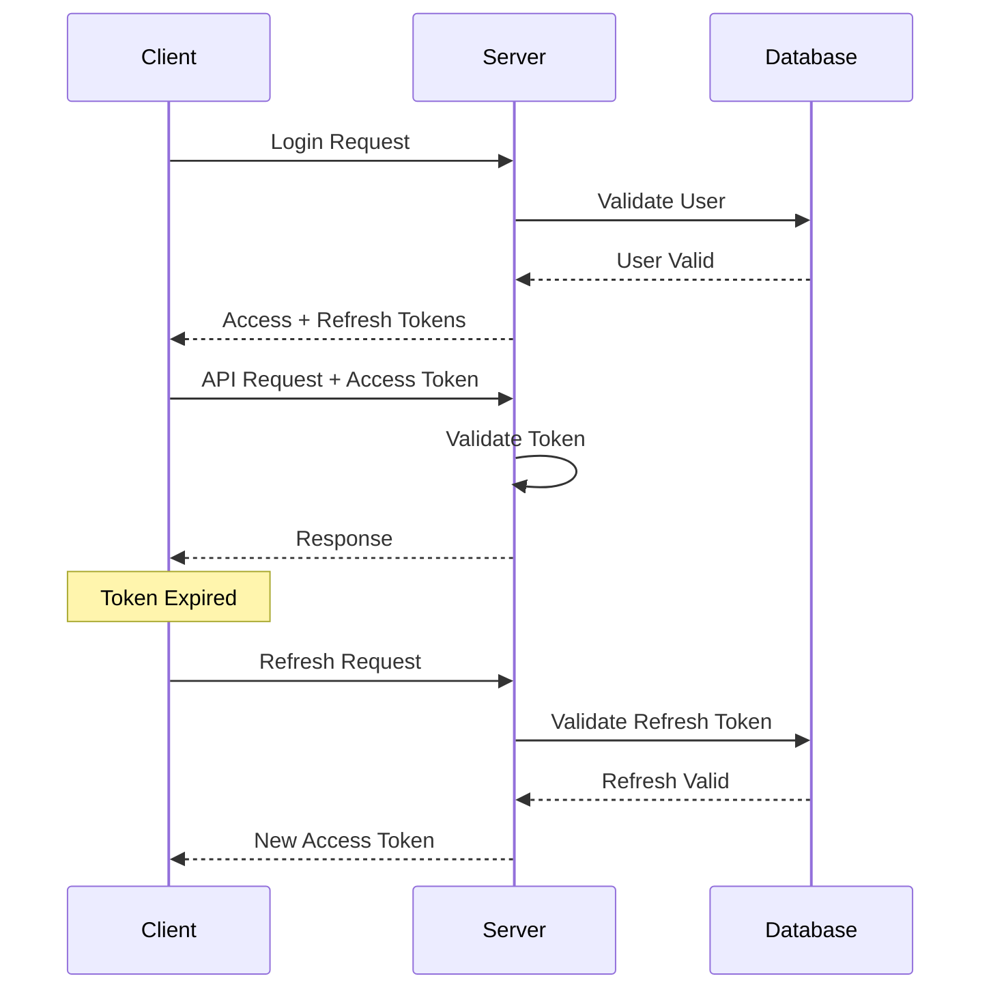

# How to Secure React Native Apps with JWT and Refresh Tokens

Author: [nawazdhandala](https://github.com/nawazdhandala)

Tags: React Native, JWT, Refresh Tokens, Authentication, Security, Mobile Development

Description: Learn how to implement secure JWT authentication with refresh token rotation in React Native applications.

---

## Introduction

Authentication is the cornerstone of mobile application security. When building React Native applications, implementing a robust authentication system that balances security with user experience is crucial. JSON Web Tokens (JWT) combined with refresh tokens provide an elegant solution that offers both security and seamless user sessions.

In this comprehensive guide, we will explore how to implement JWT authentication with refresh token rotation in React Native applications. We will cover everything from basic concepts to advanced patterns like race condition handling and silent authentication.

## Understanding JWT Authentication

### What is a JWT?

A JSON Web Token (JWT) is a compact, URL-safe means of representing claims between two parties. It consists of three parts separated by dots:

```
header.payload.signature
```

Here is a typical JWT structure:

```typescript
// Header
{
  "alg": "HS256",
  "typ": "JWT"
}

// Payload
{
  "sub": "1234567890",
  "name": "John Doe",
  "iat": 1516239022,
  "exp": 1516242622
}

// Signature
HMACSHA256(
  base64UrlEncode(header) + "." + base64UrlEncode(payload),
  secret
)
```

### Why Use JWTs in Mobile Apps?

JWTs offer several advantages for mobile applications:

1. **Stateless Authentication**: The server does not need to maintain session state
2. **Scalability**: Easy to scale across multiple servers
3. **Cross-Platform**: Works seamlessly across iOS and Android
4. **Self-Contained**: Contains all necessary user information
5. **Tamper-Proof**: Cryptographically signed to prevent modification

## Access Tokens vs Refresh Tokens

Understanding the distinction between access tokens and refresh tokens is fundamental to implementing secure authentication.

### Access Tokens

Access tokens are short-lived credentials used to access protected resources:

```typescript
interface AccessToken {
  token: string;
  expiresIn: number; // Typically 15-30 minutes
  tokenType: 'Bearer';
}
```

**Characteristics:**
- Short expiration time (15-30 minutes)
- Sent with every API request
- Contains user claims and permissions
- Should be stored in memory when possible

### Refresh Tokens

Refresh tokens are long-lived credentials used to obtain new access tokens:

```typescript
interface RefreshToken {
  token: string;
  expiresIn: number; // Days to weeks
  family: string; // For rotation tracking
}
```

**Characteristics:**
- Longer expiration time (days to weeks)
- Used only to refresh access tokens
- Should be stored securely
- Can be rotated for enhanced security

### Token Flow Diagram



## Secure Token Storage in React Native

Storing tokens securely is critical for mobile application security. Let us explore the available options and best practices.

### Storage Options Comparison

| Storage Method | Security Level | Use Case |
|---------------|----------------|----------|
| AsyncStorage | Low | Non-sensitive data only |
| SecureStore (Expo) | High | Refresh tokens |
| Keychain (iOS) | High | Sensitive credentials |
| Keystore (Android) | High | Sensitive credentials |
| Memory | Highest | Access tokens |

### Implementing Secure Storage

First, install the required dependencies:

```bash
npm install react-native-keychain
# or for Expo
npx expo install expo-secure-store
```

Create a secure storage service:

```typescript
// src/services/secureStorage.ts
import * as Keychain from 'react-native-keychain';

export interface TokenPair {
  accessToken: string;
  refreshToken: string;
}

const ACCESS_TOKEN_KEY = 'access_token';
const REFRESH_TOKEN_KEY = 'refresh_token';

class SecureStorageService {
  // Store refresh token securely using Keychain/Keystore
  async storeRefreshToken(token: string): Promise<boolean> {
    try {
      await Keychain.setGenericPassword(REFRESH_TOKEN_KEY, token, {
        service: REFRESH_TOKEN_KEY,
        accessible: Keychain.ACCESSIBLE.WHEN_UNLOCKED_THIS_DEVICE_ONLY,
      });
      return true;
    } catch (error) {
      console.error('Failed to store refresh token:', error);
      return false;
    }
  }

  // Retrieve refresh token from secure storage
  async getRefreshToken(): Promise<string | null> {
    try {
      const credentials = await Keychain.getGenericPassword({
        service: REFRESH_TOKEN_KEY,
      });
      if (credentials) {
        return credentials.password;
      }
      return null;
    } catch (error) {
      console.error('Failed to retrieve refresh token:', error);
      return null;
    }
  }

  // Remove refresh token from storage
  async removeRefreshToken(): Promise<boolean> {
    try {
      await Keychain.resetGenericPassword({
        service: REFRESH_TOKEN_KEY,
      });
      return true;
    } catch (error) {
      console.error('Failed to remove refresh token:', error);
      return false;
    }
  }

  // Clear all authentication data
  async clearAllTokens(): Promise<void> {
    await this.removeRefreshToken();
  }
}

export const secureStorage = new SecureStorageService();
```

### In-Memory Access Token Storage

For access tokens, memory storage provides the highest security:

```typescript
// src/services/tokenManager.ts
import { secureStorage } from './secureStorage';

interface TokenState {
  accessToken: string | null;
  accessTokenExpiry: number | null;
}

class TokenManager {
  private state: TokenState = {
    accessToken: null,
    accessTokenExpiry: null,
  };

  // Store access token in memory
  setAccessToken(token: string, expiresIn: number): void {
    this.state.accessToken = token;
    this.state.accessTokenExpiry = Date.now() + expiresIn * 1000;
  }

  // Get current access token
  getAccessToken(): string | null {
    if (this.isAccessTokenExpired()) {
      return null;
    }
    return this.state.accessToken;
  }

  // Check if access token is expired
  isAccessTokenExpired(): boolean {
    if (!this.state.accessTokenExpiry) {
      return true;
    }
    // Add 30-second buffer before expiration
    return Date.now() >= this.state.accessTokenExpiry - 30000;
  }

  // Get time until expiration in seconds
  getTimeUntilExpiry(): number {
    if (!this.state.accessTokenExpiry) {
      return 0;
    }
    return Math.max(0, Math.floor((this.state.accessTokenExpiry - Date.now()) / 1000));
  }

  // Clear access token from memory
  clearAccessToken(): void {
    this.state.accessToken = null;
    this.state.accessTokenExpiry = null;
  }

  // Store refresh token securely
  async setRefreshToken(token: string): Promise<boolean> {
    return secureStorage.storeRefreshToken(token);
  }

  // Get refresh token from secure storage
  async getRefreshToken(): Promise<string | null> {
    return secureStorage.getRefreshToken();
  }

  // Clear all tokens (logout)
  async clearAllTokens(): Promise<void> {
    this.clearAccessToken();
    await secureStorage.clearAllTokens();
  }
}

export const tokenManager = new TokenManager();
```

## Setting Up Axios Interceptors

Axios interceptors are essential for automatic token injection and refresh handling. Let us build a robust API client.

### Creating the API Client

```typescript
// src/services/api.ts
import axios, {
  AxiosInstance,
  AxiosError,
  InternalAxiosRequestConfig,
  AxiosResponse,
} from 'axios';
import { tokenManager } from './tokenManager';

const API_BASE_URL = 'https://api.yourapp.com';

// Create axios instance
const apiClient: AxiosInstance = axios.create({
  baseURL: API_BASE_URL,
  timeout: 30000,
  headers: {
    'Content-Type': 'application/json',
  },
});

// Request interceptor - inject access token
apiClient.interceptors.request.use(
  async (config: InternalAxiosRequestConfig) => {
    const accessToken = tokenManager.getAccessToken();

    if (accessToken) {
      config.headers.Authorization = `Bearer ${accessToken}`;
    }

    return config;
  },
  (error: AxiosError) => {
    return Promise.reject(error);
  }
);

export default apiClient;
```

### Implementing the Response Interceptor

The response interceptor handles token refresh automatically:

```typescript
// src/services/api.ts (continued)

interface RefreshResponse {
  accessToken: string;
  refreshToken: string;
  expiresIn: number;
}

// Track refresh state to prevent multiple simultaneous refreshes
let isRefreshing = false;
let failedQueue: Array<{
  resolve: (token: string) => void;
  reject: (error: Error) => void;
}> = [];

// Process queued requests after refresh
const processQueue = (error: Error | null, token: string | null = null) => {
  failedQueue.forEach((promise) => {
    if (error) {
      promise.reject(error);
    } else if (token) {
      promise.resolve(token);
    }
  });
  failedQueue = [];
};

// Refresh token function
const refreshAccessToken = async (): Promise<string> => {
  const refreshToken = await tokenManager.getRefreshToken();

  if (!refreshToken) {
    throw new Error('No refresh token available');
  }

  const response = await axios.post<RefreshResponse>(
    `${API_BASE_URL}/auth/refresh`,
    { refreshToken },
    {
      headers: { 'Content-Type': 'application/json' },
    }
  );

  const { accessToken, refreshToken: newRefreshToken, expiresIn } = response.data;

  // Store new tokens
  tokenManager.setAccessToken(accessToken, expiresIn);
  await tokenManager.setRefreshToken(newRefreshToken);

  return accessToken;
};

// Response interceptor - handle 401 errors
apiClient.interceptors.response.use(
  (response: AxiosResponse) => response,
  async (error: AxiosError) => {
    const originalRequest = error.config as InternalAxiosRequestConfig & {
      _retry?: boolean;
    };

    // Check if error is 401 and we haven't already retried
    if (error.response?.status === 401 && !originalRequest._retry) {
      if (isRefreshing) {
        // If already refreshing, queue this request
        return new Promise((resolve, reject) => {
          failedQueue.push({
            resolve: (token: string) => {
              originalRequest.headers.Authorization = `Bearer ${token}`;
              resolve(apiClient(originalRequest));
            },
            reject: (err: Error) => {
              reject(err);
            },
          });
        });
      }

      originalRequest._retry = true;
      isRefreshing = true;

      try {
        const newToken = await refreshAccessToken();
        processQueue(null, newToken);
        originalRequest.headers.Authorization = `Bearer ${newToken}`;
        return apiClient(originalRequest);
      } catch (refreshError) {
        processQueue(refreshError as Error, null);
        // Trigger logout on refresh failure
        await tokenManager.clearAllTokens();
        // Emit logout event (implement based on your navigation setup)
        throw refreshError;
      } finally {
        isRefreshing = false;
      }
    }

    return Promise.reject(error);
  }
);
```

## Automatic Token Refresh Strategy

Implementing proactive token refresh improves user experience by refreshing tokens before they expire.

### Proactive Refresh Implementation

```typescript
// src/services/tokenRefreshService.ts
import { tokenManager } from './tokenManager';
import apiClient from './api';

interface RefreshResponse {
  accessToken: string;
  refreshToken: string;
  expiresIn: number;
}

class TokenRefreshService {
  private refreshTimer: NodeJS.Timeout | null = null;
  private readonly REFRESH_THRESHOLD = 60; // Refresh 60 seconds before expiry

  // Start the automatic refresh cycle
  startAutoRefresh(): void {
    this.scheduleRefresh();
  }

  // Stop automatic refresh
  stopAutoRefresh(): void {
    if (this.refreshTimer) {
      clearTimeout(this.refreshTimer);
      this.refreshTimer = null;
    }
  }

  // Schedule the next refresh
  private scheduleRefresh(): void {
    this.stopAutoRefresh();

    const timeUntilExpiry = tokenManager.getTimeUntilExpiry();

    if (timeUntilExpiry <= 0) {
      // Token already expired, refresh immediately
      this.performRefresh();
      return;
    }

    // Schedule refresh before expiration
    const refreshDelay = Math.max(
      (timeUntilExpiry - this.REFRESH_THRESHOLD) * 1000,
      0
    );

    this.refreshTimer = setTimeout(() => {
      this.performRefresh();
    }, refreshDelay);
  }

  // Perform the token refresh
  private async performRefresh(): Promise<void> {
    try {
      const refreshToken = await tokenManager.getRefreshToken();

      if (!refreshToken) {
        throw new Error('No refresh token available');
      }

      const response = await apiClient.post<RefreshResponse>('/auth/refresh', {
        refreshToken,
      });

      const { accessToken, refreshToken: newRefreshToken, expiresIn } = response.data;

      tokenManager.setAccessToken(accessToken, expiresIn);
      await tokenManager.setRefreshToken(newRefreshToken);

      // Schedule the next refresh
      this.scheduleRefresh();
    } catch (error) {
      console.error('Token refresh failed:', error);
      // Handle refresh failure - typically logout user
      this.handleRefreshFailure();
    }
  }

  // Handle refresh failure
  private async handleRefreshFailure(): Promise<void> {
    await tokenManager.clearAllTokens();
    this.stopAutoRefresh();
    // Trigger navigation to login screen
    // This depends on your navigation setup
  }
}

export const tokenRefreshService = new TokenRefreshService();
```

## Handling Token Expiration Gracefully

When tokens expire, we need to handle the situation gracefully without disrupting the user experience.

### Token Expiration Handler

```typescript
// src/services/tokenExpirationHandler.ts
import { tokenManager } from './tokenManager';
import { tokenRefreshService } from './tokenRefreshService';
import { AppState, AppStateStatus } from 'react-native';

class TokenExpirationHandler {
  private appStateSubscription: any = null;

  // Initialize the handler
  initialize(): void {
    this.setupAppStateListener();
  }

  // Clean up when not needed
  cleanup(): void {
    if (this.appStateSubscription) {
      this.appStateSubscription.remove();
    }
  }

  // Listen to app state changes
  private setupAppStateListener(): void {
    this.appStateSubscription = AppState.addEventListener(
      'change',
      this.handleAppStateChange.bind(this)
    );
  }

  // Handle app coming to foreground
  private async handleAppStateChange(nextAppState: AppStateStatus): Promise<void> {
    if (nextAppState === 'active') {
      await this.checkAndRefreshToken();
    }
  }

  // Check token validity when app becomes active
  private async checkAndRefreshToken(): Promise<void> {
    const refreshToken = await tokenManager.getRefreshToken();

    if (!refreshToken) {
      // No refresh token, user needs to login
      return;
    }

    if (tokenManager.isAccessTokenExpired()) {
      // Access token expired, trigger refresh
      tokenRefreshService.startAutoRefresh();
    }
  }
}

export const tokenExpirationHandler = new TokenExpirationHandler();
```

## Implementing Refresh Token Rotation

Refresh token rotation enhances security by issuing a new refresh token with each use.

### Server-Side Rotation Logic

Your backend should implement refresh token rotation:

```typescript
// Backend pseudo-code for reference
interface RefreshTokenFamily {
  familyId: string;
  currentToken: string;
  usedTokens: string[];
  userId: string;
  createdAt: Date;
  expiresAt: Date;
}

async function handleTokenRefresh(refreshToken: string) {
  // Find the token family
  const family = await findTokenFamily(refreshToken);

  if (!family) {
    throw new Error('Invalid refresh token');
  }

  // Check if token was already used (replay attack)
  if (family.usedTokens.includes(refreshToken)) {
    // Potential replay attack - invalidate entire family
    await invalidateTokenFamily(family.familyId);
    throw new Error('Token reuse detected');
  }

  // Check if this is the current valid token
  if (family.currentToken !== refreshToken) {
    // Invalid token
    throw new Error('Invalid refresh token');
  }

  // Generate new tokens
  const newAccessToken = generateAccessToken(family.userId);
  const newRefreshToken = generateRefreshToken();

  // Update family with new token
  await updateTokenFamily(family.familyId, {
    currentToken: newRefreshToken,
    usedTokens: [...family.usedTokens, refreshToken],
  });

  return { accessToken: newAccessToken, refreshToken: newRefreshToken };
}
```

### Client-Side Rotation Handling

```typescript
// src/services/tokenRotationHandler.ts
import { tokenManager } from './tokenManager';

interface RotatedTokens {
  accessToken: string;
  refreshToken: string;
  expiresIn: number;
  rotationId?: string;
}

class TokenRotationHandler {
  private lastRotationId: string | null = null;

  // Handle token rotation response
  async handleRotation(tokens: RotatedTokens): Promise<void> {
    // Prevent processing duplicate rotations
    if (tokens.rotationId && tokens.rotationId === this.lastRotationId) {
      console.warn('Duplicate rotation detected, skipping');
      return;
    }

    // Update tokens
    tokenManager.setAccessToken(tokens.accessToken, tokens.expiresIn);
    await tokenManager.setRefreshToken(tokens.refreshToken);

    // Track rotation
    if (tokens.rotationId) {
      this.lastRotationId = tokens.rotationId;
    }
  }

  // Clear rotation tracking on logout
  clearRotationState(): void {
    this.lastRotationId = null;
  }
}

export const tokenRotationHandler = new TokenRotationHandler();
```

## Silent Authentication

Silent authentication allows the app to authenticate users without requiring credentials on app launch.

### Silent Auth Implementation

```typescript
// src/services/silentAuthService.ts
import { tokenManager } from './tokenManager';
import { tokenRefreshService } from './tokenRefreshService';
import apiClient from './api';

interface UserProfile {
  id: string;
  email: string;
  name: string;
}

interface AuthState {
  isAuthenticated: boolean;
  isLoading: boolean;
  user: UserProfile | null;
  error: string | null;
}

class SilentAuthService {
  // Attempt silent authentication on app launch
  async attemptSilentAuth(): Promise<AuthState> {
    try {
      const refreshToken = await tokenManager.getRefreshToken();

      if (!refreshToken) {
        return {
          isAuthenticated: false,
          isLoading: false,
          user: null,
          error: null,
        };
      }

      // Try to refresh the access token
      const response = await apiClient.post('/auth/refresh', {
        refreshToken,
      });

      const { accessToken, refreshToken: newRefreshToken, expiresIn } = response.data;

      // Store new tokens
      tokenManager.setAccessToken(accessToken, expiresIn);
      await tokenManager.setRefreshToken(newRefreshToken);

      // Fetch user profile
      const userResponse = await apiClient.get<UserProfile>('/auth/me');

      // Start automatic refresh
      tokenRefreshService.startAutoRefresh();

      return {
        isAuthenticated: true,
        isLoading: false,
        user: userResponse.data,
        error: null,
      };
    } catch (error) {
      // Silent auth failed, clear tokens
      await tokenManager.clearAllTokens();

      return {
        isAuthenticated: false,
        isLoading: false,
        user: null,
        error: 'Session expired. Please login again.',
      };
    }
  }
}

export const silentAuthService = new SilentAuthService();
```

### Using Silent Auth in React Context

```typescript
// src/context/AuthContext.tsx
import React, {
  createContext,
  useContext,
  useState,
  useEffect,
  ReactNode,
} from 'react';
import { silentAuthService } from '../services/silentAuthService';
import { tokenManager } from '../services/tokenManager';
import { tokenRefreshService } from '../services/tokenRefreshService';

interface UserProfile {
  id: string;
  email: string;
  name: string;
}

interface AuthContextType {
  isAuthenticated: boolean;
  isLoading: boolean;
  user: UserProfile | null;
  login: (email: string, password: string) => Promise<void>;
  logout: () => Promise<void>;
}

const AuthContext = createContext<AuthContextType | undefined>(undefined);

export function AuthProvider({ children }: { children: ReactNode }) {
  const [isAuthenticated, setIsAuthenticated] = useState(false);
  const [isLoading, setIsLoading] = useState(true);
  const [user, setUser] = useState<UserProfile | null>(null);

  useEffect(() => {
    initializeAuth();
  }, []);

  const initializeAuth = async () => {
    const authState = await silentAuthService.attemptSilentAuth();
    setIsAuthenticated(authState.isAuthenticated);
    setUser(authState.user);
    setIsLoading(false);
  };

  const login = async (email: string, password: string) => {
    // Implementation for login
  };

  const logout = async () => {
    tokenRefreshService.stopAutoRefresh();
    await tokenManager.clearAllTokens();
    setIsAuthenticated(false);
    setUser(null);
  };

  return (
    <AuthContext.Provider
      value={{ isAuthenticated, isLoading, user, login, logout }}
    >
      {children}
    </AuthContext.Provider>
  );
}

export function useAuth() {
  const context = useContext(AuthContext);
  if (!context) {
    throw new Error('useAuth must be used within an AuthProvider');
  }
  return context;
}
```

## Logout and Token Cleanup

Proper logout implementation ensures complete cleanup of authentication state.

### Comprehensive Logout Service

```typescript
// src/services/logoutService.ts
import { tokenManager } from './tokenManager';
import { tokenRefreshService } from './tokenRefreshService';
import { tokenRotationHandler } from './tokenRotationHandler';
import apiClient from './api';

interface LogoutOptions {
  revokeRemotely?: boolean;
  clearAllDevices?: boolean;
}

class LogoutService {
  // Perform complete logout
  async logout(options: LogoutOptions = {}): Promise<void> {
    const { revokeRemotely = true, clearAllDevices = false } = options;

    try {
      // Stop automatic refresh first
      tokenRefreshService.stopAutoRefresh();

      // Revoke tokens on server if requested
      if (revokeRemotely) {
        await this.revokeTokensOnServer(clearAllDevices);
      }
    } catch (error) {
      console.error('Error revoking tokens on server:', error);
      // Continue with local cleanup even if server revocation fails
    } finally {
      // Always perform local cleanup
      await this.performLocalCleanup();
    }
  }

  // Revoke tokens on the server
  private async revokeTokensOnServer(allDevices: boolean): Promise<void> {
    const refreshToken = await tokenManager.getRefreshToken();

    if (!refreshToken) {
      return;
    }

    await apiClient.post('/auth/logout', {
      refreshToken,
      allDevices,
    });
  }

  // Clear all local authentication data
  private async performLocalCleanup(): Promise<void> {
    // Clear all tokens
    await tokenManager.clearAllTokens();

    // Clear rotation state
    tokenRotationHandler.clearRotationState();

    // Clear any cached user data
    // Add additional cleanup as needed
  }

  // Force logout (used when refresh token is compromised)
  async forceLogout(): Promise<void> {
    tokenRefreshService.stopAutoRefresh();
    await this.performLocalCleanup();
  }
}

export const logoutService = new LogoutService();
```

## Handling Race Conditions

Race conditions can occur when multiple requests simultaneously detect token expiration. Our implementation handles this with a queue-based approach.

### Enhanced Race Condition Handler

```typescript
// src/services/raceConditionHandler.ts
import { Mutex } from 'async-mutex';

class RaceConditionHandler {
  private mutex = new Mutex();
  private refreshPromise: Promise<string> | null = null;

  // Execute refresh with mutex protection
  async executeRefresh(
    refreshFn: () => Promise<string>
  ): Promise<string> {
    // If a refresh is already in progress, wait for it
    if (this.refreshPromise) {
      return this.refreshPromise;
    }

    // Acquire mutex to ensure single execution
    const release = await this.mutex.acquire();

    try {
      // Double-check after acquiring mutex
      if (this.refreshPromise) {
        return this.refreshPromise;
      }

      // Create and store the refresh promise
      this.refreshPromise = refreshFn();

      const result = await this.refreshPromise;
      return result;
    } finally {
      // Clear the promise and release mutex
      this.refreshPromise = null;
      release();
    }
  }
}

export const raceConditionHandler = new RaceConditionHandler();
```

### Integrating with API Client

```typescript
// Updated interceptor using race condition handler
import { raceConditionHandler } from './raceConditionHandler';

apiClient.interceptors.response.use(
  (response) => response,
  async (error: AxiosError) => {
    const originalRequest = error.config as InternalAxiosRequestConfig & {
      _retry?: boolean;
    };

    if (error.response?.status === 401 && !originalRequest._retry) {
      originalRequest._retry = true;

      try {
        // Use race condition handler for refresh
        const newToken = await raceConditionHandler.executeRefresh(
          async () => {
            const refreshToken = await tokenManager.getRefreshToken();
            if (!refreshToken) {
              throw new Error('No refresh token');
            }

            const response = await axios.post('/auth/refresh', {
              refreshToken,
            });

            const { accessToken, refreshToken: newRefresh, expiresIn } = response.data;
            tokenManager.setAccessToken(accessToken, expiresIn);
            await tokenManager.setRefreshToken(newRefresh);

            return accessToken;
          }
        );

        originalRequest.headers.Authorization = `Bearer ${newToken}`;
        return apiClient(originalRequest);
      } catch (refreshError) {
        await tokenManager.clearAllTokens();
        throw refreshError;
      }
    }

    return Promise.reject(error);
  }
);
```

## Security Best Practices

### Token Security Checklist

```typescript
// src/utils/securityChecklist.ts

export const SecurityBestPractices = {
  // 1. Always use HTTPS
  useHttps: true,

  // 2. Set appropriate token expiration times
  tokenExpiration: {
    accessToken: 15 * 60, // 15 minutes
    refreshToken: 7 * 24 * 60 * 60, // 7 days
  },

  // 3. Implement certificate pinning
  certificatePinning: {
    enabled: true,
    pins: ['sha256/AAAA...', 'sha256/BBBB...'],
  },

  // 4. Detect rooted/jailbroken devices
  rootDetection: true,

  // 5. Use secure storage for sensitive data
  secureStorage: {
    accessToken: 'memory',
    refreshToken: 'keychain',
  },

  // 6. Implement token binding
  tokenBinding: true,

  // 7. Enable refresh token rotation
  refreshTokenRotation: true,

  // 8. Detect token theft through reuse detection
  tokenReuseDetection: true,
};
```

### Implementing Certificate Pinning

```typescript
// src/services/certificatePinning.ts
import { Platform } from 'react-native';

interface PinningConfig {
  hostname: string;
  publicKeyHashes: string[];
}

const PINNING_CONFIG: PinningConfig[] = [
  {
    hostname: 'api.yourapp.com',
    publicKeyHashes: [
      'sha256/AAAAAAAAAAAAAAAAAAAAAAAAAAAAAAAAAAAAAAAAAAA=',
      'sha256/BBBBBBBBBBBBBBBBBBBBBBBBBBBBBBBBBBBBBBBBBBB=',
    ],
  },
];

// Configure certificate pinning for API client
export function configureCertificatePinning() {
  // Implementation depends on your HTTP client
  // For React Native, consider using TrustKit or ssl-pinning
  console.log('Certificate pinning configured');
}
```

### Root/Jailbreak Detection

```typescript
// src/services/deviceSecurityService.ts
import { Platform } from 'react-native';

class DeviceSecurityService {
  // Check if device is compromised
  async isDeviceSecure(): Promise<boolean> {
    const checks = await Promise.all([
      this.checkRootStatus(),
      this.checkDebugger(),
      this.checkEmulator(),
    ]);

    return checks.every((check) => check);
  }

  private async checkRootStatus(): Promise<boolean> {
    // Use a library like jail-monkey for actual implementation
    // This is a placeholder
    return true;
  }

  private async checkDebugger(): Promise<boolean> {
    if (__DEV__) {
      return true; // Allow debugger in development
    }
    // Check for debugger in production
    return true;
  }

  private async checkEmulator(): Promise<boolean> {
    // Check if running on emulator
    return true;
  }
}

export const deviceSecurityService = new DeviceSecurityService();
```

## Testing Authentication Flows

### Unit Tests for Token Manager

```typescript
// __tests__/tokenManager.test.ts
import { tokenManager } from '../src/services/tokenManager';

describe('TokenManager', () => {
  beforeEach(() => {
    tokenManager.clearAccessToken();
  });

  describe('setAccessToken', () => {
    it('should store access token in memory', () => {
      tokenManager.setAccessToken('test-token', 3600);
      expect(tokenManager.getAccessToken()).toBe('test-token');
    });

    it('should calculate correct expiry time', () => {
      const expiresIn = 3600; // 1 hour
      tokenManager.setAccessToken('test-token', expiresIn);

      const timeUntilExpiry = tokenManager.getTimeUntilExpiry();
      expect(timeUntilExpiry).toBeGreaterThan(3500);
      expect(timeUntilExpiry).toBeLessThanOrEqual(3600);
    });
  });

  describe('isAccessTokenExpired', () => {
    it('should return true when no token is set', () => {
      expect(tokenManager.isAccessTokenExpired()).toBe(true);
    });

    it('should return false for valid token', () => {
      tokenManager.setAccessToken('test-token', 3600);
      expect(tokenManager.isAccessTokenExpired()).toBe(false);
    });

    it('should return true when token is about to expire', () => {
      tokenManager.setAccessToken('test-token', 20); // 20 seconds
      expect(tokenManager.isAccessTokenExpired()).toBe(true); // 30-second buffer
    });
  });
});
```

### Integration Tests for Auth Flow

```typescript
// __tests__/authFlow.test.ts
import { silentAuthService } from '../src/services/silentAuthService';
import { tokenManager } from '../src/services/tokenManager';
import { secureStorage } from '../src/services/secureStorage';

jest.mock('../src/services/secureStorage');

describe('Authentication Flow', () => {
  beforeEach(() => {
    jest.clearAllMocks();
    tokenManager.clearAccessToken();
  });

  describe('Silent Authentication', () => {
    it('should authenticate with valid refresh token', async () => {
      (secureStorage.getRefreshToken as jest.Mock).mockResolvedValue('valid-refresh-token');

      // Mock API response
      global.fetch = jest.fn().mockResolvedValue({
        ok: true,
        json: () => Promise.resolve({
          accessToken: 'new-access-token',
          refreshToken: 'new-refresh-token',
          expiresIn: 3600,
        }),
      });

      const result = await silentAuthService.attemptSilentAuth();

      expect(result.isAuthenticated).toBe(true);
      expect(result.error).toBeNull();
    });

    it('should fail silently with invalid refresh token', async () => {
      (secureStorage.getRefreshToken as jest.Mock).mockResolvedValue(null);

      const result = await silentAuthService.attemptSilentAuth();

      expect(result.isAuthenticated).toBe(false);
      expect(result.user).toBeNull();
    });
  });
});
```

### E2E Tests with Detox

```typescript
// e2e/auth.e2e.ts
describe('Authentication E2E Tests', () => {
  beforeAll(async () => {
    await device.launchApp();
  });

  beforeEach(async () => {
    await device.reloadReactNative();
  });

  it('should login successfully with valid credentials', async () => {
    await element(by.id('email-input')).typeText('test@example.com');
    await element(by.id('password-input')).typeText('password123');
    await element(by.id('login-button')).tap();

    await expect(element(by.id('home-screen'))).toBeVisible();
  });

  it('should handle session expiration gracefully', async () => {
    // Login first
    await element(by.id('email-input')).typeText('test@example.com');
    await element(by.id('password-input')).typeText('password123');
    await element(by.id('login-button')).tap();

    // Simulate token expiration
    await device.setURLBlacklist(['.*refresh.*']);

    // Trigger API request
    await element(by.id('refresh-data-button')).tap();

    // Should redirect to login
    await expect(element(by.id('login-screen'))).toBeVisible();
  });

  it('should logout and clear all tokens', async () => {
    // Login first
    await element(by.id('email-input')).typeText('test@example.com');
    await element(by.id('password-input')).typeText('password123');
    await element(by.id('login-button')).tap();

    // Logout
    await element(by.id('logout-button')).tap();

    // Verify redirected to login
    await expect(element(by.id('login-screen'))).toBeVisible();

    // Restart app and verify not authenticated
    await device.reloadReactNative();
    await expect(element(by.id('login-screen'))).toBeVisible();
  });
});
```

## Complete Example: Putting It All Together

Here is a complete implementation of a secure authentication service:

```typescript
// src/services/authService.ts
import { tokenManager } from './tokenManager';
import { tokenRefreshService } from './tokenRefreshService';
import { logoutService } from './logoutService';
import { silentAuthService } from './silentAuthService';
import apiClient from './api';

interface LoginCredentials {
  email: string;
  password: string;
}

interface LoginResponse {
  accessToken: string;
  refreshToken: string;
  expiresIn: number;
  user: {
    id: string;
    email: string;
    name: string;
  };
}

class AuthService {
  // Login with credentials
  async login(credentials: LoginCredentials): Promise<LoginResponse> {
    const response = await apiClient.post<LoginResponse>('/auth/login', credentials);
    const { accessToken, refreshToken, expiresIn, user } = response.data;

    // Store tokens
    tokenManager.setAccessToken(accessToken, expiresIn);
    await tokenManager.setRefreshToken(refreshToken);

    // Start automatic refresh
    tokenRefreshService.startAutoRefresh();

    return response.data;
  }

  // Logout user
  async logout(): Promise<void> {
    await logoutService.logout({ revokeRemotely: true });
  }

  // Check if user is authenticated
  async isAuthenticated(): Promise<boolean> {
    const accessToken = tokenManager.getAccessToken();
    if (accessToken) {
      return true;
    }

    const refreshToken = await tokenManager.getRefreshToken();
    return refreshToken !== null;
  }

  // Initialize authentication state
  async initialize(): Promise<{
    isAuthenticated: boolean;
    user: any | null;
  }> {
    const authState = await silentAuthService.attemptSilentAuth();
    return {
      isAuthenticated: authState.isAuthenticated,
      user: authState.user,
    };
  }
}

export const authService = new AuthService();
```

## Conclusion

Implementing secure JWT authentication with refresh tokens in React Native requires careful consideration of multiple factors:

1. **Token Storage**: Use secure storage (Keychain/Keystore) for refresh tokens and memory for access tokens
2. **Automatic Refresh**: Implement proactive token refresh to ensure seamless user experience
3. **Token Rotation**: Rotate refresh tokens to minimize the impact of token theft
4. **Race Conditions**: Handle concurrent token refresh requests properly
5. **Proper Cleanup**: Ensure complete token cleanup on logout
6. **Security Hardening**: Implement certificate pinning, root detection, and other security measures

By following the patterns and implementations outlined in this guide, you can build a robust authentication system that provides both security and excellent user experience.

Remember that security is an ongoing process. Regularly audit your authentication implementation, stay updated with security best practices, and promptly address any vulnerabilities that may be discovered.

## Additional Resources

- [JSON Web Tokens (JWT) Introduction](https://jwt.io/introduction)
- [OAuth 2.0 Security Best Practices](https://datatracker.ietf.org/doc/html/draft-ietf-oauth-security-topics)
- [React Native Security Guide](https://reactnative.dev/docs/security)
- [OWASP Mobile Security Testing Guide](https://owasp.org/www-project-mobile-security-testing-guide/)
