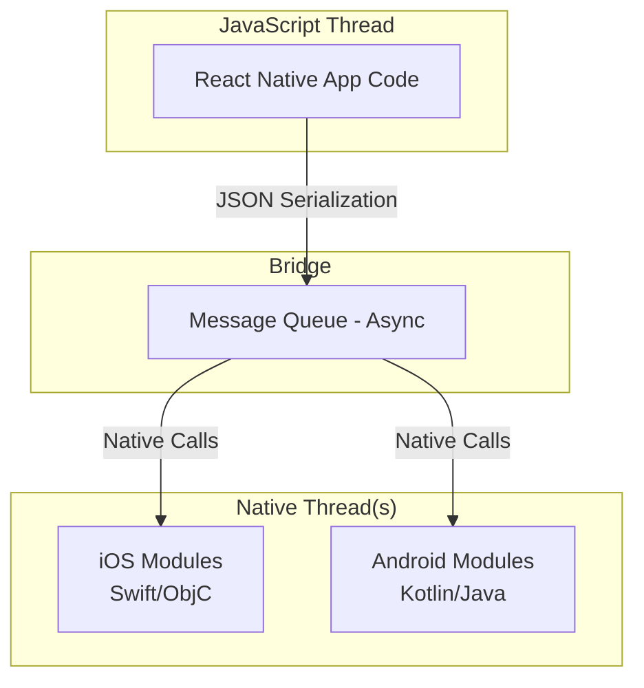

# How to Implement Native Modules for CPU-Intensive Tasks in React Native

Author: [nawazdhandala](https://github.com/nawazdhandala)

Tags: React Native, Native Modules, Performance, iOS, Android, Bridge, TypeScript

Description: Learn how to create native modules in React Native to handle CPU-intensive tasks with native performance on iOS and Android.

---

## Introduction

React Native is a powerful framework for building cross-platform mobile applications using JavaScript. However, JavaScript runs on a single thread, and certain CPU-intensive operations can cause performance bottlenecks, leading to janky UI and poor user experience. This is where native modules come to the rescue.

Native modules allow you to write platform-specific code in Swift/Objective-C for iOS and Kotlin/Java for Android, exposing that functionality to your JavaScript code. This approach gives you the best of both worlds: the developer experience of React Native with the raw performance of native code.

In this comprehensive guide, we'll explore everything you need to know about implementing native modules for CPU-intensive tasks in React Native.

## When to Use Native Modules

Before diving into implementation, it's crucial to understand when native modules are the right solution. Not every performance problem requires native code.

### Ideal Use Cases for Native Modules

1. **Image Processing**: Operations like resizing, filtering, or applying effects to images
2. **Cryptographic Operations**: Encryption, decryption, hashing large datasets
3. **Audio/Video Processing**: Real-time audio manipulation, video encoding/decoding
4. **Complex Mathematical Computations**: Machine learning inference, scientific calculations
5. **File System Operations**: Processing large files, compression/decompression
6. **Database Operations**: Complex queries on large local databases
7. **Biometric Authentication**: Fingerprint, Face ID integration
8. **Hardware Access**: Bluetooth, NFC, sensors requiring low-level access

### Signs You Might Need a Native Module

```javascript
// If your JavaScript code looks like this and causes UI freezes:
const processLargeDataset = (data) => {
  // Processing millions of records
  for (let i = 0; i < data.length; i++) {
    // Heavy computation
    result = complexCalculation(data[i]);
  }
  return result;
};
```

When such operations take more than 16ms (to maintain 60fps), you should consider moving them to native code.

## Understanding the React Native Bridge

The React Native bridge is the communication layer between JavaScript and native code. Understanding how it works is essential for writing efficient native modules.

### Bridge Architecture



### Key Concepts

1. **Asynchronous Communication**: All bridge communication is asynchronous by default
2. **JSON Serialization**: Data is serialized to JSON when crossing the bridge
3. **Batched Calls**: Multiple calls are batched together for efficiency
4. **Thread Safety**: Native modules must handle thread safety appropriately

## Creating iOS Native Modules

Let's create a native module for image processing on iOS. We'll implement it in both Swift and Objective-C.

### Swift Implementation

First, create a new Swift file in your iOS project:

```swift
// ImageProcessor.swift

import Foundation
import UIKit
import Accelerate

@objc(ImageProcessor)
class ImageProcessor: NSObject {

  // Mark this module to run on a background queue
  @objc
  static func requiresMainQueueSetup() -> Bool {
    return false
  }

  // Expose a method to apply grayscale filter
  @objc
  func applyGrayscale(
    _ imagePath: String,
    resolver resolve: @escaping RCTPromiseResolveBlock,
    rejecter reject: @escaping RCTPromiseRejectBlock
  ) {
    // Run on background thread for CPU-intensive work
    DispatchQueue.global(qos: .userInitiated).async {
      guard let image = UIImage(contentsOfFile: imagePath) else {
        reject("ERROR", "Failed to load image", nil)
        return
      }

      guard let cgImage = image.cgImage else {
        reject("ERROR", "Failed to get CGImage", nil)
        return
      }

      // Use Accelerate framework for optimized image processing
      let width = cgImage.width
      let height = cgImage.height
      let bytesPerPixel = 4
      let bytesPerRow = bytesPerPixel * width
      let bitsPerComponent = 8

      var rawData = [UInt8](repeating: 0, count: width * height * bytesPerPixel)

      guard let context = CGContext(
        data: &rawData,
        width: width,
        height: height,
        bitsPerComponent: bitsPerComponent,
        bytesPerRow: bytesPerRow,
        space: CGColorSpaceCreateDeviceRGB(),
        bitmapInfo: CGImageAlphaInfo.premultipliedLast.rawValue
      ) else {
        reject("ERROR", "Failed to create context", nil)
        return
      }

      context.draw(cgImage, in: CGRect(x: 0, y: 0, width: width, height: height))

      // Apply grayscale using vectorized operations
      for i in stride(from: 0, to: rawData.count, by: 4) {
        let r = Float(rawData[i])
        let g = Float(rawData[i + 1])
        let b = Float(rawData[i + 2])

        // Luminosity method for grayscale
        let gray = UInt8(0.299 * r + 0.587 * g + 0.114 * b)

        rawData[i] = gray
        rawData[i + 1] = gray
        rawData[i + 2] = gray
      }

      // Create output image
      guard let outputCGImage = context.makeImage() else {
        reject("ERROR", "Failed to create output image", nil)
        return
      }

      let outputImage = UIImage(cgImage: outputCGImage)

      // Save to temporary file
      let outputPath = NSTemporaryDirectory() + UUID().uuidString + ".png"

      guard let data = outputImage.pngData() else {
        reject("ERROR", "Failed to encode image", nil)
        return
      }

      do {
        try data.write(to: URL(fileURLWithPath: outputPath))
        resolve(outputPath)
      } catch {
        reject("ERROR", "Failed to save image: \(error.localizedDescription)", nil)
      }
    }
  }

  // Heavy computation example - Matrix multiplication
  @objc
  func multiplyMatrices(
    _ matrixA: [[Double]],
    matrixB: [[Double]],
    resolver resolve: @escaping RCTPromiseResolveBlock,
    rejecter reject: @escaping RCTPromiseRejectBlock
  ) {
    DispatchQueue.global(qos: .userInitiated).async {
      let rowsA = matrixA.count
      guard rowsA > 0 else {
        reject("ERROR", "Matrix A is empty", nil)
        return
      }

      let colsA = matrixA[0].count
      let rowsB = matrixB.count

      guard rowsB > 0, colsA == rowsB else {
        reject("ERROR", "Invalid matrix dimensions", nil)
        return
      }

      let colsB = matrixB[0].count

      // Flatten matrices for Accelerate
      var flatA = matrixA.flatMap { $0 }
      var flatB = matrixB.flatMap { $0 }
      var result = [Double](repeating: 0.0, count: rowsA * colsB)

      // Use vDSP for optimized matrix multiplication
      vDSP_mmulD(
        flatA, 1,
        flatB, 1,
        &result, 1,
        vDSP_Length(rowsA),
        vDSP_Length(colsB),
        vDSP_Length(colsA)
      )

      // Convert back to 2D array
      var resultMatrix: [[Double]] = []
      for i in 0..<rowsA {
        let start = i * colsB
        let end = start + colsB
        resultMatrix.append(Array(result[start..<end]))
      }

      resolve(resultMatrix)
    }
  }

  // Synchronous method for quick operations
  @objc(computeHash:)
  func computeHash(_ data: String) -> String {
    guard let inputData = data.data(using: .utf8) else {
      return ""
    }

    var hash = [UInt8](repeating: 0, count: Int(CC_SHA256_DIGEST_LENGTH))
    inputData.withUnsafeBytes {
      _ = CC_SHA256($0.baseAddress, CC_LONG(inputData.count), &hash)
    }

    return hash.map { String(format: "%02x", $0) }.joined()
  }
}
```

### Objective-C Bridge Header

Create the bridging macro file:

```objc
// ImageProcessor.m

#import <React/RCTBridgeModule.h>

@interface RCT_EXTERN_MODULE(ImageProcessor, NSObject)

RCT_EXTERN_METHOD(applyGrayscale:(NSString *)imagePath
                  resolver:(RCTPromiseResolveBlock)resolve
                  rejecter:(RCTPromiseRejectBlock)reject)

RCT_EXTERN_METHOD(multiplyMatrices:(NSArray *)matrixA
                  matrixB:(NSArray *)matrixB
                  resolver:(RCTPromiseResolveBlock)resolve
                  rejecter:(RCTPromiseRejectBlock)reject)

RCT_EXTERN__BLOCKING_SYNCHRONOUS_METHOD(computeHash:(NSString *)data)

@end
```

### Pure Objective-C Implementation

For those preferring Objective-C:

```objc
// ImageProcessorObjC.h

#import <React/RCTBridgeModule.h>

@interface ImageProcessorObjC : NSObject <RCTBridgeModule>
@end
```

```objc
// ImageProcessorObjC.m

#import "ImageProcessorObjC.h"
#import <Accelerate/Accelerate.h>
#import <CommonCrypto/CommonCrypto.h>

@implementation ImageProcessorObjC

RCT_EXPORT_MODULE();

+ (BOOL)requiresMainQueueSetup {
  return NO;
}

- (dispatch_queue_t)methodQueue {
  // Return a custom queue for all module methods
  return dispatch_queue_create("com.app.imageprocessor", DISPATCH_QUEUE_SERIAL);
}

RCT_EXPORT_METHOD(processImage:(NSString *)imagePath
                  options:(NSDictionary *)options
                  resolver:(RCTPromiseResolveBlock)resolve
                  rejecter:(RCTPromiseRejectBlock)reject) {

  UIImage *image = [UIImage imageWithContentsOfFile:imagePath];
  if (!image) {
    reject(@"ERROR", @"Failed to load image", nil);
    return;
  }

  // Process based on options
  NSString *filter = options[@"filter"] ?: @"none";
  CGFloat quality = [options[@"quality"] floatValue] ?: 1.0;

  UIImage *processedImage = [self applyFilter:filter toImage:image];

  // Save result
  NSString *outputPath = [NSTemporaryDirectory()
    stringByAppendingPathComponent:[[NSUUID UUID] UUIDString]];
  outputPath = [outputPath stringByAppendingPathExtension:@"jpg"];

  NSData *imageData = UIImageJPEGRepresentation(processedImage, quality);
  [imageData writeToFile:outputPath atomically:YES];

  resolve(outputPath);
}

- (UIImage *)applyFilter:(NSString *)filter toImage:(UIImage *)image {
  CIImage *ciImage = [[CIImage alloc] initWithImage:image];
  CIFilter *ciFilter;

  if ([filter isEqualToString:@"sepia"]) {
    ciFilter = [CIFilter filterWithName:@"CISepiaTone"];
    [ciFilter setValue:ciImage forKey:kCIInputImageKey];
    [ciFilter setValue:@0.8 forKey:kCIInputIntensityKey];
  } else if ([filter isEqualToString:@"blur"]) {
    ciFilter = [CIFilter filterWithName:@"CIGaussianBlur"];
    [ciFilter setValue:ciImage forKey:kCIInputImageKey];
    [ciFilter setValue:@10.0 forKey:kCIInputRadiusKey];
  } else {
    return image;
  }

  CIContext *context = [CIContext contextWithOptions:nil];
  CGImageRef cgImage = [context createCGImage:ciFilter.outputImage
                                     fromRect:ciImage.extent];
  UIImage *result = [UIImage imageWithCGImage:cgImage];
  CGImageRelease(cgImage);

  return result;
}

@end
```

## Creating Android Native Modules

Now let's implement the same functionality for Android using both Kotlin and Java.

### Kotlin Implementation

```kotlin
// ImageProcessorModule.kt

package com.yourapp.nativemodules

import android.graphics.Bitmap
import android.graphics.BitmapFactory
import android.graphics.Color
import com.facebook.react.bridge.*
import com.facebook.react.module.annotations.ReactModule
import kotlinx.coroutines.*
import java.io.File
import java.io.FileOutputStream
import java.security.MessageDigest
import java.util.UUID

@ReactModule(name = ImageProcessorModule.NAME)
class ImageProcessorModule(reactContext: ReactApplicationContext) :
    ReactContextBaseJavaModule(reactContext) {

    companion object {
        const val NAME = "ImageProcessor"
    }

    private val scope = CoroutineScope(Dispatchers.Default + SupervisorJob())

    override fun getName(): String = NAME

    @ReactMethod
    fun applyGrayscale(imagePath: String, promise: Promise) {
        scope.launch {
            try {
                val bitmap = BitmapFactory.decodeFile(imagePath)
                    ?: throw Exception("Failed to load image")

                val width = bitmap.width
                val height = bitmap.height
                val pixels = IntArray(width * height)

                // Get all pixels
                bitmap.getPixels(pixels, 0, width, 0, 0, width, height)

                // Process in parallel chunks for better performance
                val chunkSize = pixels.size / Runtime.getRuntime().availableProcessors()
                val jobs = pixels.indices.chunked(chunkSize).map { range ->
                    async {
                        for (i in range) {
                            val pixel = pixels[i]
                            val r = Color.red(pixel)
                            val g = Color.green(pixel)
                            val b = Color.blue(pixel)
                            val a = Color.alpha(pixel)

                            // Luminosity method
                            val gray = (0.299 * r + 0.587 * g + 0.114 * b).toInt()
                            pixels[i] = Color.argb(a, gray, gray, gray)
                        }
                    }
                }

                jobs.awaitAll()

                // Create output bitmap
                val outputBitmap = Bitmap.createBitmap(width, height, Bitmap.Config.ARGB_8888)
                outputBitmap.setPixels(pixels, 0, width, 0, 0, width, height)

                // Save to file
                val outputPath = "${reactApplicationContext.cacheDir}/${UUID.randomUUID()}.png"
                FileOutputStream(outputPath).use { out ->
                    outputBitmap.compress(Bitmap.CompressFormat.PNG, 100, out)
                }

                bitmap.recycle()
                outputBitmap.recycle()

                withContext(Dispatchers.Main) {
                    promise.resolve(outputPath)
                }
            } catch (e: Exception) {
                withContext(Dispatchers.Main) {
                    promise.reject("ERROR", e.message, e)
                }
            }
        }
    }

    @ReactMethod
    fun multiplyMatrices(matrixA: ReadableArray, matrixB: ReadableArray, promise: Promise) {
        scope.launch {
            try {
                val a = matrixA.toDoubleMatrix()
                val b = matrixB.toDoubleMatrix()

                val rowsA = a.size
                val colsA = a[0].size
                val rowsB = b.size
                val colsB = b[0].size

                if (colsA != rowsB) {
                    throw Exception("Invalid matrix dimensions")
                }

                // Parallel matrix multiplication
                val result = Array(rowsA) { DoubleArray(colsB) }

                val jobs = (0 until rowsA).map { i ->
                    async {
                        for (j in 0 until colsB) {
                            var sum = 0.0
                            for (k in 0 until colsA) {
                                sum += a[i][k] * b[k][j]
                            }
                            result[i][j] = sum
                        }
                    }
                }

                jobs.awaitAll()

                val resultArray = Arguments.createArray()
                for (row in result) {
                    val rowArray = Arguments.createArray()
                    for (value in row) {
                        rowArray.pushDouble(value)
                    }
                    resultArray.pushArray(rowArray)
                }

                withContext(Dispatchers.Main) {
                    promise.resolve(resultArray)
                }
            } catch (e: Exception) {
                withContext(Dispatchers.Main) {
                    promise.reject("ERROR", e.message, e)
                }
            }
        }
    }

    @ReactMethod(isBlockingSynchronousMethod = true)
    fun computeHash(data: String): String {
        val digest = MessageDigest.getInstance("SHA-256")
        val hashBytes = digest.digest(data.toByteArray(Charsets.UTF_8))
        return hashBytes.joinToString("") { "%02x".format(it) }
    }

    // Callback-based method example
    @ReactMethod
    fun processWithProgress(
        imagePath: String,
        callback: Callback
    ) {
        scope.launch {
            try {
                val bitmap = BitmapFactory.decodeFile(imagePath)
                    ?: throw Exception("Failed to load image")

                val totalPixels = bitmap.width * bitmap.height
                var processed = 0

                // Process with progress updates
                val pixels = IntArray(totalPixels)
                bitmap.getPixels(pixels, 0, bitmap.width, 0, 0, bitmap.width, bitmap.height)

                for (i in pixels.indices) {
                    val pixel = pixels[i]
                    val gray = (Color.red(pixel) + Color.green(pixel) + Color.blue(pixel)) / 3
                    pixels[i] = Color.argb(Color.alpha(pixel), gray, gray, gray)

                    processed++
                    if (processed % (totalPixels / 10) == 0) {
                        val progress = (processed * 100) / totalPixels
                        // Send progress event
                        sendProgressEvent(progress)
                    }
                }

                val outputBitmap = Bitmap.createBitmap(
                    bitmap.width,
                    bitmap.height,
                    Bitmap.Config.ARGB_8888
                )
                outputBitmap.setPixels(pixels, 0, bitmap.width, 0, 0, bitmap.width, bitmap.height)

                val outputPath = "${reactApplicationContext.cacheDir}/${UUID.randomUUID()}.png"
                FileOutputStream(outputPath).use { out ->
                    outputBitmap.compress(Bitmap.CompressFormat.PNG, 100, out)
                }

                bitmap.recycle()
                outputBitmap.recycle()

                withContext(Dispatchers.Main) {
                    callback.invoke(null, outputPath)
                }
            } catch (e: Exception) {
                withContext(Dispatchers.Main) {
                    callback.invoke(e.message, null)
                }
            }
        }
    }

    private fun sendProgressEvent(progress: Int) {
        val params = Arguments.createMap().apply {
            putInt("progress", progress)
        }
        reactApplicationContext
            .getJSModule(DeviceEventManagerModule.RCTDeviceEventEmitter::class.java)
            .emit("ImageProcessorProgress", params)
    }

    private fun ReadableArray.toDoubleMatrix(): Array<DoubleArray> {
        return Array(size()) { i ->
            val row = getArray(i)!!
            DoubleArray(row.size()) { j ->
                row.getDouble(j)
            }
        }
    }

    override fun invalidate() {
        super.invalidate()
        scope.cancel()
    }
}
```

### Package Registration

```kotlin
// ImageProcessorPackage.kt

package com.yourapp.nativemodules

import com.facebook.react.ReactPackage
import com.facebook.react.bridge.NativeModule
import com.facebook.react.bridge.ReactApplicationContext
import com.facebook.react.uimanager.ViewManager

class ImageProcessorPackage : ReactPackage {
    override fun createNativeModules(
        reactContext: ReactApplicationContext
    ): List<NativeModule> {
        return listOf(ImageProcessorModule(reactContext))
    }

    override fun createViewManagers(
        reactContext: ReactApplicationContext
    ): List<ViewManager<*, *>> {
        return emptyList()
    }
}
```

### Java Implementation

```java
// ImageProcessorModuleJava.java

package com.yourapp.nativemodules;

import android.graphics.Bitmap;
import android.graphics.BitmapFactory;
import android.graphics.Color;

import com.facebook.react.bridge.Arguments;
import com.facebook.react.bridge.Promise;
import com.facebook.react.bridge.ReactApplicationContext;
import com.facebook.react.bridge.ReactContextBaseJavaModule;
import com.facebook.react.bridge.ReactMethod;
import com.facebook.react.bridge.ReadableArray;
import com.facebook.react.bridge.WritableArray;

import java.io.File;
import java.io.FileOutputStream;
import java.security.MessageDigest;
import java.util.UUID;
import java.util.concurrent.ExecutorService;
import java.util.concurrent.Executors;

public class ImageProcessorModuleJava extends ReactContextBaseJavaModule {

    private static final String NAME = "ImageProcessorJava";
    private final ExecutorService executor = Executors.newFixedThreadPool(
        Runtime.getRuntime().availableProcessors()
    );

    public ImageProcessorModuleJava(ReactApplicationContext reactContext) {
        super(reactContext);
    }

    @Override
    public String getName() {
        return NAME;
    }

    @ReactMethod
    public void applyGrayscale(String imagePath, Promise promise) {
        executor.execute(() -> {
            try {
                Bitmap bitmap = BitmapFactory.decodeFile(imagePath);
                if (bitmap == null) {
                    promise.reject("ERROR", "Failed to load image");
                    return;
                }

                int width = bitmap.getWidth();
                int height = bitmap.getHeight();
                int[] pixels = new int[width * height];

                bitmap.getPixels(pixels, 0, width, 0, 0, width, height);

                for (int i = 0; i < pixels.length; i++) {
                    int pixel = pixels[i];
                    int r = Color.red(pixel);
                    int g = Color.green(pixel);
                    int b = Color.blue(pixel);
                    int a = Color.alpha(pixel);

                    int gray = (int) (0.299 * r + 0.587 * g + 0.114 * b);
                    pixels[i] = Color.argb(a, gray, gray, gray);
                }

                Bitmap outputBitmap = Bitmap.createBitmap(
                    width, height, Bitmap.Config.ARGB_8888
                );
                outputBitmap.setPixels(pixels, 0, width, 0, 0, width, height);

                File cacheDir = getReactApplicationContext().getCacheDir();
                String outputPath = new File(
                    cacheDir, UUID.randomUUID().toString() + ".png"
                ).getAbsolutePath();

                try (FileOutputStream out = new FileOutputStream(outputPath)) {
                    outputBitmap.compress(Bitmap.CompressFormat.PNG, 100, out);
                }

                bitmap.recycle();
                outputBitmap.recycle();

                promise.resolve(outputPath);
            } catch (Exception e) {
                promise.reject("ERROR", e.getMessage(), e);
            }
        });
    }

    @ReactMethod(isBlockingSynchronousMethod = true)
    public String computeHashSync(String data) {
        try {
            MessageDigest digest = MessageDigest.getInstance("SHA-256");
            byte[] hashBytes = digest.digest(data.getBytes("UTF-8"));

            StringBuilder hexString = new StringBuilder();
            for (byte b : hashBytes) {
                String hex = Integer.toHexString(0xff & b);
                if (hex.length() == 1) hexString.append('0');
                hexString.append(hex);
            }
            return hexString.toString();
        } catch (Exception e) {
            return "";
        }
    }

    @Override
    public void invalidate() {
        super.invalidate();
        executor.shutdown();
    }
}
```

## Exposing Methods to JavaScript

Now let's create the TypeScript interface to use our native modules.

### TypeScript Definitions

```typescript
// src/native/ImageProcessor.ts

import { NativeModules, NativeEventEmitter, Platform } from 'react-native';

const { ImageProcessor } = NativeModules;

interface ImageProcessorInterface {
  applyGrayscale(imagePath: string): Promise<string>;
  multiplyMatrices(matrixA: number[][], matrixB: number[][]): Promise<number[][]>;
  computeHash(data: string): string;
  processWithProgress(
    imagePath: string,
    callback: (error: string | null, result: string | null) => void
  ): void;
}

// Type checking for the native module
if (!ImageProcessor) {
  throw new Error(
    'ImageProcessor native module is not available. ' +
    'Make sure you have linked the native module correctly.'
  );
}

// Create event emitter for progress events
const eventEmitter = new NativeEventEmitter(ImageProcessor);

// Export typed module
export const ImageProcessorModule: ImageProcessorInterface = ImageProcessor;

// Export event subscription helper
export const subscribeToProgress = (
  callback: (progress: number) => void
): (() => void) => {
  const subscription = eventEmitter.addListener(
    'ImageProcessorProgress',
    (event) => callback(event.progress)
  );

  return () => subscription.remove();
};

// High-level API wrapper
export class ImageProcessorAPI {
  /**
   * Apply grayscale filter to an image
   * @param imagePath - Path to the source image
   * @returns Promise resolving to the path of the processed image
   */
  static async applyGrayscale(imagePath: string): Promise<string> {
    try {
      return await ImageProcessorModule.applyGrayscale(imagePath);
    } catch (error) {
      console.error('Grayscale processing failed:', error);
      throw error;
    }
  }

  /**
   * Multiply two matrices using native performance
   * @param matrixA - First matrix
   * @param matrixB - Second matrix
   * @returns Promise resolving to the result matrix
   */
  static async multiplyMatrices(
    matrixA: number[][],
    matrixB: number[][]
  ): Promise<number[][]> {
    // Validate dimensions
    if (matrixA.length === 0 || matrixB.length === 0) {
      throw new Error('Matrices cannot be empty');
    }

    if (matrixA[0].length !== matrixB.length) {
      throw new Error(
        `Invalid matrix dimensions: ${matrixA[0].length} !== ${matrixB.length}`
      );
    }

    return await ImageProcessorModule.multiplyMatrices(matrixA, matrixB);
  }

  /**
   * Compute SHA-256 hash synchronously
   * @param data - String to hash
   * @returns Hexadecimal hash string
   */
  static computeHash(data: string): string {
    return ImageProcessorModule.computeHash(data);
  }

  /**
   * Process image with progress updates
   * @param imagePath - Path to the source image
   * @param onProgress - Progress callback (0-100)
   * @returns Promise resolving to the processed image path
   */
  static processWithProgress(
    imagePath: string,
    onProgress?: (progress: number) => void
  ): Promise<string> {
    return new Promise((resolve, reject) => {
      let unsubscribe: (() => void) | null = null;

      if (onProgress) {
        unsubscribe = subscribeToProgress(onProgress);
      }

      ImageProcessorModule.processWithProgress(imagePath, (error, result) => {
        if (unsubscribe) {
          unsubscribe();
        }

        if (error) {
          reject(new Error(error));
        } else {
          resolve(result!);
        }
      });
    });
  }
}
```

### Usage in React Components

```typescript
// src/screens/ImageProcessingScreen.tsx

import React, { useState, useCallback } from 'react';
import {
  View,
  Image,
  Button,
  Text,
  StyleSheet,
  ActivityIndicator,
} from 'react-native';
import { launchImageLibrary } from 'react-native-image-picker';
import { ImageProcessorAPI, subscribeToProgress } from '../native/ImageProcessor';

export const ImageProcessingScreen: React.FC = () => {
  const [originalImage, setOriginalImage] = useState<string | null>(null);
  const [processedImage, setProcessedImage] = useState<string | null>(null);
  const [loading, setLoading] = useState(false);
  const [progress, setProgress] = useState(0);

  const selectImage = useCallback(async () => {
    const result = await launchImageLibrary({
      mediaType: 'photo',
      quality: 1,
    });

    if (result.assets && result.assets[0].uri) {
      setOriginalImage(result.assets[0].uri);
      setProcessedImage(null);
    }
  }, []);

  const processImage = useCallback(async () => {
    if (!originalImage) return;

    setLoading(true);
    setProgress(0);

    try {
      // Use the progress-enabled method
      const resultPath = await ImageProcessorAPI.processWithProgress(
        originalImage.replace('file://', ''),
        (currentProgress) => setProgress(currentProgress)
      );

      setProcessedImage(`file://${resultPath}`);
    } catch (error) {
      console.error('Processing failed:', error);
      alert('Failed to process image');
    } finally {
      setLoading(false);
    }
  }, [originalImage]);

  const applyGrayscale = useCallback(async () => {
    if (!originalImage) return;

    setLoading(true);

    try {
      const resultPath = await ImageProcessorAPI.applyGrayscale(
        originalImage.replace('file://', '')
      );

      setProcessedImage(`file://${resultPath}`);
    } catch (error) {
      console.error('Grayscale failed:', error);
      alert('Failed to apply grayscale');
    } finally {
      setLoading(false);
    }
  }, [originalImage]);

  return (
    <View style={styles.container}>
      <Button title="Select Image" onPress={selectImage} />

      {originalImage && (
        <View style={styles.imageContainer}>
          <Text style={styles.label}>Original</Text>
          <Image source={{ uri: originalImage }} style={styles.image} />
        </View>
      )}

      {originalImage && !loading && (
        <View style={styles.buttonContainer}>
          <Button title="Apply Grayscale" onPress={applyGrayscale} />
          <Button title="Process with Progress" onPress={processImage} />
        </View>
      )}

      {loading && (
        <View style={styles.loadingContainer}>
          <ActivityIndicator size="large" />
          <Text style={styles.progressText}>Processing: {progress}%</Text>
        </View>
      )}

      {processedImage && (
        <View style={styles.imageContainer}>
          <Text style={styles.label}>Processed</Text>
          <Image source={{ uri: processedImage }} style={styles.image} />
        </View>
      )}
    </View>
  );
};

const styles = StyleSheet.create({
  container: {
    flex: 1,
    padding: 16,
    backgroundColor: '#fff',
  },
  imageContainer: {
    marginTop: 16,
    alignItems: 'center',
  },
  image: {
    width: 300,
    height: 300,
    resizeMode: 'contain',
  },
  label: {
    fontSize: 16,
    fontWeight: 'bold',
    marginBottom: 8,
  },
  buttonContainer: {
    flexDirection: 'row',
    justifyContent: 'space-around',
    marginTop: 16,
  },
  loadingContainer: {
    marginTop: 16,
    alignItems: 'center',
  },
  progressText: {
    marginTop: 8,
    fontSize: 14,
  },
});
```

## Handling Callbacks and Promises

React Native supports multiple patterns for handling asynchronous operations in native modules.

### Promise-Based Pattern (Recommended)

```swift
// iOS - Swift
@objc
func asyncOperation(
  _ input: String,
  resolver resolve: @escaping RCTPromiseResolveBlock,
  rejecter reject: @escaping RCTPromiseRejectBlock
) {
  DispatchQueue.global().async {
    do {
      let result = try self.performOperation(input)
      resolve(result)
    } catch {
      reject("ERROR", error.localizedDescription, error)
    }
  }
}
```

```kotlin
// Android - Kotlin
@ReactMethod
fun asyncOperation(input: String, promise: Promise) {
    scope.launch {
        try {
            val result = performOperation(input)
            promise.resolve(result)
        } catch (e: Exception) {
            promise.reject("ERROR", e.message, e)
        }
    }
}
```

### Callback Pattern

```swift
// iOS - Swift
@objc
func operationWithCallback(
  _ input: String,
  callback: @escaping RCTResponseSenderBlock
) {
  DispatchQueue.global().async {
    do {
      let result = try self.performOperation(input)
      callback([NSNull(), result])
    } catch {
      callback([error.localizedDescription, NSNull()])
    }
  }
}
```

### Event Emitter Pattern (For Progress/Streaming)

```swift
// iOS - Swift
import React

@objc(ImageProcessor)
class ImageProcessor: RCTEventEmitter {

  override func supportedEvents() -> [String]! {
    return ["onProgress", "onComplete", "onError"]
  }

  @objc
  func processWithEvents(_ imagePath: String) {
    DispatchQueue.global().async {
      for progress in stride(from: 0, through: 100, by: 10) {
        self.sendEvent(withName: "onProgress", body: ["progress": progress])
        Thread.sleep(forTimeInterval: 0.1)
      }

      self.sendEvent(withName: "onComplete", body: ["result": "processed"])
    }
  }
}
```

## Passing Data Between Native and JavaScript

Understanding data type mappings is crucial for efficient bridge communication.

### Type Mapping Reference

| JavaScript | iOS (Swift/ObjC) | Android (Kotlin/Java) |
|------------|------------------|----------------------|
| `boolean` | `Bool` / `BOOL` | `Boolean` |
| `number` | `Double` / `NSNumber` | `Double` / `Integer` |
| `string` | `String` / `NSString` | `String` |
| `array` | `[Any]` / `NSArray` | `ReadableArray` |
| `object` | `[String: Any]` / `NSDictionary` | `ReadableMap` |
| `null` | `nil` / `NSNull` | `null` |
| `function` | `RCTResponseSenderBlock` | `Callback` |
| `Promise` | `RCTPromiseResolveBlock` | `Promise` |

### Complex Data Structures

```typescript
// JavaScript
interface ProcessingOptions {
  quality: number;
  filters: string[];
  metadata: {
    author: string;
    timestamp: number;
  };
}

const options: ProcessingOptions = {
  quality: 0.8,
  filters: ['grayscale', 'blur'],
  metadata: {
    author: 'user',
    timestamp: Date.now(),
  },
};

await ImageProcessor.processWithOptions(imagePath, options);
```

```swift
// iOS - Swift
@objc
func processWithOptions(
  _ imagePath: String,
  options: NSDictionary,
  resolver resolve: @escaping RCTPromiseResolveBlock,
  rejecter reject: @escaping RCTPromiseRejectBlock
) {
  guard let quality = options["quality"] as? Double,
        let filters = options["filters"] as? [String],
        let metadata = options["metadata"] as? [String: Any],
        let author = metadata["author"] as? String,
        let timestamp = metadata["timestamp"] as? Double else {
    reject("ERROR", "Invalid options", nil)
    return
  }

  // Process with options...
}
```

```kotlin
// Android - Kotlin
@ReactMethod
fun processWithOptions(imagePath: String, options: ReadableMap, promise: Promise) {
    val quality = options.getDouble("quality")
    val filters = options.getArray("filters")?.toArrayList()?.map { it as String }
    val metadata = options.getMap("metadata")
    val author = metadata?.getString("author")
    val timestamp = metadata?.getDouble("timestamp")?.toLong()

    // Process with options...
}
```

## Threading Considerations

Proper thread management is essential for native modules handling CPU-intensive tasks.

### iOS Threading

```swift
@objc(ImageProcessor)
class ImageProcessor: NSObject {

  // Specify that this module doesn't need main queue setup
  @objc
  static func requiresMainQueueSetup() -> Bool {
    return false
  }

  // Custom method queue (optional)
  @objc
  var methodQueue: DispatchQueue {
    return DispatchQueue(
      label: "com.app.imageprocessor",
      qos: .userInitiated,
      attributes: .concurrent
    )
  }

  @objc
  func heavyComputation(_ resolve: @escaping RCTPromiseResolveBlock, reject: @escaping RCTPromiseRejectBlock) {
    // This runs on methodQueue by default

    // For truly parallel work, use DispatchQueue.concurrentPerform
    let iterations = 1000000
    var results = [Double](repeating: 0, count: iterations)

    DispatchQueue.concurrentPerform(iterations: iterations) { index in
      results[index] = self.compute(index)
    }

    resolve(results.reduce(0, +))
  }

  // For UI updates, dispatch to main queue
  private func updateUI() {
    DispatchQueue.main.async {
      // UI updates here
    }
  }
}
```

### Android Threading

```kotlin
@ReactModule(name = "ImageProcessor")
class ImageProcessorModule(reactContext: ReactApplicationContext) :
    ReactContextBaseJavaModule(reactContext) {

    // Custom coroutine scope with proper dispatcher
    private val processingScope = CoroutineScope(
        Dispatchers.Default + SupervisorJob()
    )

    // For IO-bound operations
    private val ioScope = CoroutineScope(
        Dispatchers.IO + SupervisorJob()
    )

    @ReactMethod
    fun heavyComputation(promise: Promise) {
        processingScope.launch {
            try {
                // Use all available cores
                val processors = Runtime.getRuntime().availableProcessors()
                val results = (0 until processors).map { threadIndex ->
                    async {
                        computeChunk(threadIndex, processors)
                    }
                }.awaitAll()

                val total = results.sum()

                // Resolve on main thread
                withContext(Dispatchers.Main) {
                    promise.resolve(total)
                }
            } catch (e: Exception) {
                withContext(Dispatchers.Main) {
                    promise.reject("ERROR", e.message, e)
                }
            }
        }
    }

    @ReactMethod
    fun fileOperation(path: String, promise: Promise) {
        // Use IO dispatcher for file operations
        ioScope.launch {
            try {
                val content = File(path).readText()
                withContext(Dispatchers.Main) {
                    promise.resolve(content)
                }
            } catch (e: Exception) {
                withContext(Dispatchers.Main) {
                    promise.reject("ERROR", e.message, e)
                }
            }
        }
    }

    override fun invalidate() {
        super.invalidate()
        processingScope.cancel()
        ioScope.cancel()
    }
}
```

### Thread Safety Best Practices

```kotlin
// Thread-safe state management
class SafeImageProcessor {
    private val lock = ReentrantLock()
    private var processingCount = AtomicInteger(0)
    private val cache = ConcurrentHashMap<String, ByteArray>()

    fun process(input: String): String {
        // Use atomic operations
        val count = processingCount.incrementAndGet()

        // Check cache first (thread-safe)
        cache[input]?.let { return String(it) }

        // Lock for critical sections
        return lock.withLock {
            // Double-check pattern
            cache[input]?.let { return String(it) }

            val result = doExpensiveOperation(input)
            cache[input] = result.toByteArray()

            processingCount.decrementAndGet()
            result
        }
    }
}
```

## Turbo Modules Introduction

Turbo Modules are the next generation of native modules in React Native, offering significant performance improvements over the legacy bridge.

### Key Benefits of Turbo Modules

1. **Lazy Loading**: Modules are loaded only when first accessed
2. **Direct JavaScript-Native Communication**: Bypasses the bridge JSON serialization
3. **Synchronous Methods**: True synchronous native calls without blocking
4. **Type Safety**: Codegen ensures type consistency between JS and native
5. **Faster Startup**: Reduced app startup time

### Implementing a Turbo Module

First, define the spec in TypeScript:

```typescript
// src/specs/NativeImageProcessor.ts

import type { TurboModule } from 'react-native';
import { TurboModuleRegistry } from 'react-native';

export interface Spec extends TurboModule {
  // Async methods
  applyGrayscale(imagePath: string): Promise<string>;
  multiplyMatrices(matrixA: number[][], matrixB: number[][]): Promise<number[][]>;

  // Sync methods
  computeHash(data: string): string;

  // Constants
  getConstants(): {
    supportedFilters: string[];
    maxImageSize: number;
  };
}

export default TurboModuleRegistry.getEnforcing<Spec>('ImageProcessor');
```

### iOS Turbo Module Implementation

```objc
// ImageProcessorSpec.h (Generated by Codegen)
// You typically don't write this manually

// ImageProcessorTurbo.h
#import <ImageProcessorSpec/ImageProcessorSpec.h>

@interface ImageProcessorTurbo : NSObject <NativeImageProcessorSpec>
@end
```

```objc
// ImageProcessorTurbo.mm

#import "ImageProcessorTurbo.h"

@implementation ImageProcessorTurbo

RCT_EXPORT_MODULE()

- (std::shared_ptr<facebook::react::TurboModule>)getTurboModule:
    (const facebook::react::ObjCTurboModule::InitParams &)params {
  return std::make_shared<facebook::react::NativeImageProcessorSpecJSI>(params);
}

- (void)applyGrayscale:(NSString *)imagePath
               resolve:(RCTPromiseResolveBlock)resolve
                reject:(RCTPromiseRejectBlock)reject {
  dispatch_async(dispatch_get_global_queue(QOS_CLASS_USER_INITIATED, 0), ^{
    // Implementation...
    resolve(processedPath);
  });
}

- (NSString *)computeHash:(NSString *)data {
  // Synchronous implementation
  return computedHash;
}

- (NSDictionary *)getConstants {
  return @{
    @"supportedFilters": @[@"grayscale", @"sepia", @"blur"],
    @"maxImageSize": @(4096 * 4096)
  };
}

@end
```

### Android Turbo Module Implementation

```kotlin
// ImageProcessorTurboModule.kt

package com.yourapp.nativemodules

import com.facebook.react.bridge.Promise
import com.facebook.react.bridge.ReactApplicationContext
import com.facebook.react.bridge.ReadableArray
import com.facebook.react.bridge.WritableNativeMap
import com.facebook.react.module.annotations.ReactModule
import com.yourapp.codegen.NativeImageProcessorSpec

@ReactModule(name = ImageProcessorTurboModule.NAME)
class ImageProcessorTurboModule(reactContext: ReactApplicationContext) :
    NativeImageProcessorSpec(reactContext) {

    companion object {
        const val NAME = "ImageProcessor"
    }

    override fun getName(): String = NAME

    override fun applyGrayscale(imagePath: String, promise: Promise) {
        // Implementation with coroutines...
    }

    override fun multiplyMatrices(
        matrixA: ReadableArray,
        matrixB: ReadableArray,
        promise: Promise
    ) {
        // Implementation...
    }

    override fun computeHash(data: String): String {
        // Synchronous implementation
        return computedHash
    }

    override fun getTypedExportedConstants(): MutableMap<String, Any> {
        return mutableMapOf(
            "supportedFilters" to listOf("grayscale", "sepia", "blur"),
            "maxImageSize" to 4096 * 4096
        )
    }
}
```

## Performance Benefits

Let's quantify the performance benefits of native modules with real benchmarks.

### Benchmark: Image Processing

```typescript
// Benchmark comparison
const benchmarkResults = {
  operation: 'Grayscale 1920x1080 image',

  // JavaScript implementation
  javascript: {
    time: '2847ms',
    memory: '89MB',
    uiBlocking: true,
  },

  // Native module (Legacy Bridge)
  nativeModuleLegacy: {
    time: '156ms',
    memory: '34MB',
    uiBlocking: false,
  },

  // Turbo Module
  turboModule: {
    time: '142ms',
    memory: '31MB',
    uiBlocking: false,
  },

  // Native with SIMD/Accelerate
  nativeOptimized: {
    time: '47ms',
    memory: '28MB',
    uiBlocking: false,
  },
};
```

### Benchmark: Matrix Multiplication

```typescript
// 500x500 matrix multiplication
const matrixBenchmark = {
  javascript: '12400ms',      // Blocks UI
  nativeBasic: '890ms',       // Background thread
  nativeParallel: '245ms',    // Multi-threaded
  nativeAccelerate: '52ms',   // Using BLAS/vDSP
};
```

### Performance Optimization Tips

```swift
// iOS - Using Accelerate framework for vectorized operations
import Accelerate

func optimizedGrayscale(_ pixels: inout [Float], count: Int) {
  // Convert RGB to grayscale using vDSP
  var red = [Float](repeating: 0, count: count)
  var green = [Float](repeating: 0, count: count)
  var blue = [Float](repeating: 0, count: count)
  var gray = [Float](repeating: 0, count: count)

  // Deinterleave
  vDSP_vgathra(pixels, 4, &red, 1, vDSP_Length(count))
  vDSP_vgathra(pixels + 1, 4, &green, 1, vDSP_Length(count))
  vDSP_vgathra(pixels + 2, 4, &blue, 1, vDSP_Length(count))

  // Apply luminosity weights
  var redWeight: Float = 0.299
  var greenWeight: Float = 0.587
  var blueWeight: Float = 0.114

  vDSP_vsmul(red, 1, &redWeight, &gray, 1, vDSP_Length(count))
  vDSP_vsmsa(green, 1, &greenWeight, gray, &gray, 1, vDSP_Length(count))
  vDSP_vsmsa(blue, 1, &blueWeight, gray, &gray, 1, vDSP_Length(count))
}
```

## Testing Native Modules

Proper testing ensures your native modules work correctly across platforms.

### Unit Testing iOS (XCTest)

```swift
// ImageProcessorTests.swift

import XCTest
@testable import YourApp

class ImageProcessorTests: XCTestCase {

  var imageProcessor: ImageProcessor!

  override func setUp() {
    super.setUp()
    imageProcessor = ImageProcessor()
  }

  func testComputeHash() {
    let input = "Hello, World!"
    let expected = "dffd6021bb2bd5b0af676290809ec3a53191dd81c7f70a4b28688a362182986f"

    let result = imageProcessor.computeHash(input)

    XCTAssertEqual(result, expected)
  }

  func testGrayscaleProcessing() {
    let expectation = XCTestExpectation(description: "Grayscale processing")

    let testImagePath = Bundle(for: type(of: self))
      .path(forResource: "test_image", ofType: "png")!

    imageProcessor.applyGrayscale(testImagePath) { result in
      XCTAssertNotNil(result)
      XCTAssertTrue(FileManager.default.fileExists(atPath: result!))
      expectation.fulfill()
    } rejecter: { code, message, error in
      XCTFail("Processing failed: \(message ?? "Unknown error")")
    }

    wait(for: [expectation], timeout: 10.0)
  }

  func testMatrixMultiplication() {
    let expectation = XCTestExpectation(description: "Matrix multiplication")

    let matrixA: [[Double]] = [[1, 2], [3, 4]]
    let matrixB: [[Double]] = [[5, 6], [7, 8]]
    let expected: [[Double]] = [[19, 22], [43, 50]]

    imageProcessor.multiplyMatrices(matrixA, matrixB: matrixB) { result in
      guard let resultMatrix = result as? [[Double]] else {
        XCTFail("Invalid result type")
        return
      }

      XCTAssertEqual(resultMatrix, expected)
      expectation.fulfill()
    } rejecter: { _, message, _ in
      XCTFail("Multiplication failed: \(message ?? "")")
    }

    wait(for: [expectation], timeout: 5.0)
  }

  func testPerformance() {
    let testImagePath = Bundle(for: type(of: self))
      .path(forResource: "large_image", ofType: "png")!

    measure {
      let expectation = XCTestExpectation()

      imageProcessor.applyGrayscale(testImagePath) { _ in
        expectation.fulfill()
      } rejecter: { _, _, _ in
        expectation.fulfill()
      }

      wait(for: [expectation], timeout: 30.0)
    }
  }
}
```

### Unit Testing Android (JUnit)

```kotlin
// ImageProcessorModuleTest.kt

package com.yourapp.nativemodules

import android.graphics.Bitmap
import android.graphics.BitmapFactory
import com.facebook.react.bridge.*
import io.mockk.*
import kotlinx.coroutines.runBlocking
import org.junit.After
import org.junit.Before
import org.junit.Test
import org.junit.Assert.*
import java.io.File

class ImageProcessorModuleTest {

    private lateinit var reactContext: ReactApplicationContext
    private lateinit var imageProcessor: ImageProcessorModule
    private lateinit var promise: Promise

    @Before
    fun setUp() {
        reactContext = mockk(relaxed = true)
        every { reactContext.cacheDir } returns File(System.getProperty("java.io.tmpdir"))

        imageProcessor = ImageProcessorModule(reactContext)
        promise = mockk(relaxed = true)
    }

    @After
    fun tearDown() {
        clearAllMocks()
    }

    @Test
    fun `computeHash returns correct SHA-256 hash`() {
        val input = "Hello, World!"
        val expected = "dffd6021bb2bd5b0af676290809ec3a53191dd81c7f70a4b28688a362182986f"

        val result = imageProcessor.computeHash(input)

        assertEquals(expected, result)
    }

    @Test
    fun `computeHash handles empty string`() {
        val input = ""
        val expected = "e3b0c44298fc1c149afbf4c8996fb92427ae41e4649b934ca495991b7852b855"

        val result = imageProcessor.computeHash(input)

        assertEquals(expected, result)
    }

    @Test
    fun `multiplyMatrices calculates correctly`() = runBlocking {
        val matrixA = JavaOnlyArray().apply {
            pushArray(JavaOnlyArray().apply { pushDouble(1.0); pushDouble(2.0) })
            pushArray(JavaOnlyArray().apply { pushDouble(3.0); pushDouble(4.0) })
        }

        val matrixB = JavaOnlyArray().apply {
            pushArray(JavaOnlyArray().apply { pushDouble(5.0); pushDouble(6.0) })
            pushArray(JavaOnlyArray().apply { pushDouble(7.0); pushDouble(8.0) })
        }

        imageProcessor.multiplyMatrices(matrixA, matrixB, promise)

        // Wait for async completion
        Thread.sleep(100)

        verify {
            promise.resolve(match { result ->
                val array = result as? ReadableArray ?: return@match false
                array.size() == 2 &&
                array.getArray(0)?.getDouble(0) == 19.0 &&
                array.getArray(0)?.getDouble(1) == 22.0 &&
                array.getArray(1)?.getDouble(0) == 43.0 &&
                array.getArray(1)?.getDouble(1) == 50.0
            })
        }
    }

    @Test
    fun `multiplyMatrices rejects invalid dimensions`() = runBlocking {
        val matrixA = JavaOnlyArray().apply {
            pushArray(JavaOnlyArray().apply { pushDouble(1.0); pushDouble(2.0); pushDouble(3.0) })
        }

        val matrixB = JavaOnlyArray().apply {
            pushArray(JavaOnlyArray().apply { pushDouble(1.0) })
        }

        imageProcessor.multiplyMatrices(matrixA, matrixB, promise)

        Thread.sleep(100)

        verify { promise.reject(any(), match<String> { it.contains("dimensions") }, any()) }
    }
}
```

### Integration Testing with Detox

```typescript
// e2e/imageProcessor.test.ts

describe('Image Processor Native Module', () => {
  beforeAll(async () => {
    await device.launchApp();
  });

  beforeEach(async () => {
    await device.reloadReactNative();
  });

  it('should process image with grayscale filter', async () => {
    // Navigate to image processing screen
    await element(by.id('imageProcessingButton')).tap();

    // Select test image
    await element(by.id('selectImageButton')).tap();
    await element(by.text('Test Image')).tap();

    // Apply grayscale
    await element(by.id('applyGrayscaleButton')).tap();

    // Wait for processing
    await waitFor(element(by.id('processedImage')))
      .toBeVisible()
      .withTimeout(10000);

    // Verify processed image is displayed
    await expect(element(by.id('processedImage'))).toBeVisible();
  });

  it('should show progress during processing', async () => {
    await element(by.id('imageProcessingButton')).tap();
    await element(by.id('selectImageButton')).tap();
    await element(by.text('Large Image')).tap();

    await element(by.id('processWithProgressButton')).tap();

    // Verify progress indicator appears
    await waitFor(element(by.id('progressIndicator')))
      .toBeVisible()
      .withTimeout(2000);

    // Wait for completion
    await waitFor(element(by.id('processedImage')))
      .toBeVisible()
      .withTimeout(30000);
  });

  it('should handle errors gracefully', async () => {
    await element(by.id('imageProcessingButton')).tap();

    // Try to process without selecting image
    await element(by.id('applyGrayscaleButton')).tap();

    // Verify error message
    await expect(element(by.text('Please select an image first'))).toBeVisible();
  });
});
```

## Best Practices and Patterns

### 1. Error Handling Pattern

```typescript
// src/native/SafeNativeModule.ts

import { NativeModules, Platform } from 'react-native';

class NativeModuleError extends Error {
  constructor(
    message: string,
    public code: string,
    public nativeError?: Error
  ) {
    super(message);
    this.name = 'NativeModuleError';
  }
}

export function createSafeNativeModule<T extends object>(
  moduleName: string,
  fallback?: Partial<T>
): T {
  const nativeModule = NativeModules[moduleName];

  if (!nativeModule) {
    if (fallback) {
      console.warn(
        `Native module ${moduleName} not available, using fallback`
      );
      return fallback as T;
    }

    throw new NativeModuleError(
      `Native module ${moduleName} is not available`,
      'MODULE_NOT_FOUND'
    );
  }

  // Wrap all methods with error handling
  const wrappedModule: any = {};

  for (const key of Object.keys(nativeModule)) {
    const value = nativeModule[key];

    if (typeof value === 'function') {
      wrappedModule[key] = async (...args: any[]) => {
        try {
          return await value(...args);
        } catch (error: any) {
          throw new NativeModuleError(
            error.message || 'Native module error',
            error.code || 'NATIVE_ERROR',
            error
          );
        }
      };
    } else {
      wrappedModule[key] = value;
    }
  }

  return wrappedModule as T;
}
```

### 2. Platform-Specific Implementation Pattern

```typescript
// src/native/ImageProcessor/index.ts

import { Platform } from 'react-native';

interface ImageProcessorInterface {
  applyFilter(imagePath: string, filter: string): Promise<string>;
  getCapabilities(): string[];
}

const createImageProcessor = (): ImageProcessorInterface => {
  if (Platform.OS === 'ios') {
    return require('./ImageProcessor.ios').default;
  } else if (Platform.OS === 'android') {
    return require('./ImageProcessor.android').default;
  } else {
    // Web fallback using Canvas API
    return require('./ImageProcessor.web').default;
  }
};

export const ImageProcessor = createImageProcessor();
```

### 3. Caching Pattern

```typescript
// src/native/CachedNativeModule.ts

type CacheEntry<T> = {
  value: T;
  timestamp: number;
};

export function createCachedMethod<TArgs extends any[], TResult>(
  method: (...args: TArgs) => Promise<TResult>,
  options: {
    ttl?: number;
    maxSize?: number;
    keyGenerator?: (...args: TArgs) => string;
  } = {}
): (...args: TArgs) => Promise<TResult> {
  const {
    ttl = 5 * 60 * 1000, // 5 minutes default
    maxSize = 100,
    keyGenerator = (...args) => JSON.stringify(args),
  } = options;

  const cache = new Map<string, CacheEntry<TResult>>();

  return async (...args: TArgs): Promise<TResult> => {
    const key = keyGenerator(...args);
    const now = Date.now();

    // Check cache
    const cached = cache.get(key);
    if (cached && now - cached.timestamp < ttl) {
      return cached.value;
    }

    // Execute and cache
    const result = await method(...args);

    // Evict oldest if at max size
    if (cache.size >= maxSize) {
      const oldest = [...cache.entries()].sort(
        (a, b) => a[1].timestamp - b[1].timestamp
      )[0];
      cache.delete(oldest[0]);
    }

    cache.set(key, { value: result, timestamp: now });

    return result;
  };
}

// Usage
const cachedProcessImage = createCachedMethod(
  ImageProcessor.applyGrayscale,
  { ttl: 10 * 60 * 1000 }
);
```

### 4. Batch Processing Pattern

```typescript
// src/native/BatchProcessor.ts

export class BatchProcessor<TInput, TOutput> {
  private queue: Array<{
    input: TInput;
    resolve: (value: TOutput) => void;
    reject: (error: Error) => void;
  }> = [];

  private processing = false;

  constructor(
    private processBatch: (inputs: TInput[]) => Promise<TOutput[]>,
    private options: {
      batchSize?: number;
      debounceMs?: number;
    } = {}
  ) {}

  async process(input: TInput): Promise<TOutput> {
    return new Promise((resolve, reject) => {
      this.queue.push({ input, resolve, reject });
      this.scheduleProcessing();
    });
  }

  private scheduleProcessing() {
    if (this.processing) return;

    const { debounceMs = 16 } = this.options;

    setTimeout(() => this.processQueue(), debounceMs);
  }

  private async processQueue() {
    if (this.processing || this.queue.length === 0) return;

    this.processing = true;
    const { batchSize = 10 } = this.options;

    const batch = this.queue.splice(0, batchSize);
    const inputs = batch.map((item) => item.input);

    try {
      const results = await this.processBatch(inputs);

      batch.forEach((item, index) => {
        item.resolve(results[index]);
      });
    } catch (error) {
      batch.forEach((item) => {
        item.reject(error as Error);
      });
    }

    this.processing = false;

    if (this.queue.length > 0) {
      this.scheduleProcessing();
    }
  }
}

// Usage
const imageProcessor = new BatchProcessor<string, string>(
  async (paths) => {
    // Process multiple images in native code efficiently
    return await NativeImageProcessor.processBatch(paths);
  },
  { batchSize: 5, debounceMs: 50 }
);
```

### 5. Memory Management Pattern

```swift
// iOS - Proper memory management
@objc
func processLargeFile(
  _ filePath: String,
  resolver resolve: @escaping RCTPromiseResolveBlock,
  rejecter reject: @escaping RCTPromiseRejectBlock
) {
  autoreleasepool {
    // Process in chunks to avoid memory spikes
    guard let fileHandle = FileHandle(forReadingAtPath: filePath) else {
      reject("ERROR", "Cannot open file", nil)
      return
    }

    defer { fileHandle.closeFile() }

    let chunkSize = 1024 * 1024 // 1MB chunks
    var processedData = Data()

    while true {
      autoreleasepool {
        let chunk = fileHandle.readData(ofLength: chunkSize)
        if chunk.isEmpty { break }

        let processed = processChunk(chunk)
        processedData.append(processed)
      }
    }

    // Save result
    let outputPath = saveToTempFile(processedData)
    resolve(outputPath)
  }
}
```

## Conclusion

Native modules are a powerful tool in your React Native arsenal for handling CPU-intensive tasks. By moving heavy computations to native code, you can maintain smooth 60fps UI performance while processing large datasets, images, or complex algorithms.

Key takeaways:

1. **Evaluate First**: Not every performance issue requires native modules. Profile your app first.

2. **Choose the Right Pattern**: Use promises for async operations, callbacks for progress updates, and synchronous methods sparingly.

3. **Thread Wisely**: Always run CPU-intensive work on background threads to keep the UI responsive.

4. **Consider Turbo Modules**: For new projects, Turbo Modules offer better performance and type safety.

5. **Test Thoroughly**: Native modules need testing on both platforms with various edge cases.

6. **Handle Errors Gracefully**: Always provide meaningful error messages and handle failures gracefully.

7. **Optimize for Platform**: Use platform-specific optimizations like Accelerate on iOS or RenderScript on Android.

By following the patterns and best practices outlined in this guide, you'll be able to create efficient, maintainable native modules that significantly improve your React Native app's performance.

## Further Reading

- [React Native New Architecture Documentation](https://reactnative.dev/docs/new-architecture-intro)
- [Turbo Modules Guide](https://reactnative.dev/docs/turbo-modules)
- [iOS Accelerate Framework](https://developer.apple.com/documentation/accelerate)
- [Android NDK Documentation](https://developer.android.com/ndk/guides)
- [JSI (JavaScript Interface) Deep Dive](https://reactnative.dev/architecture/glossary#javascript-interfaces-jsi)
