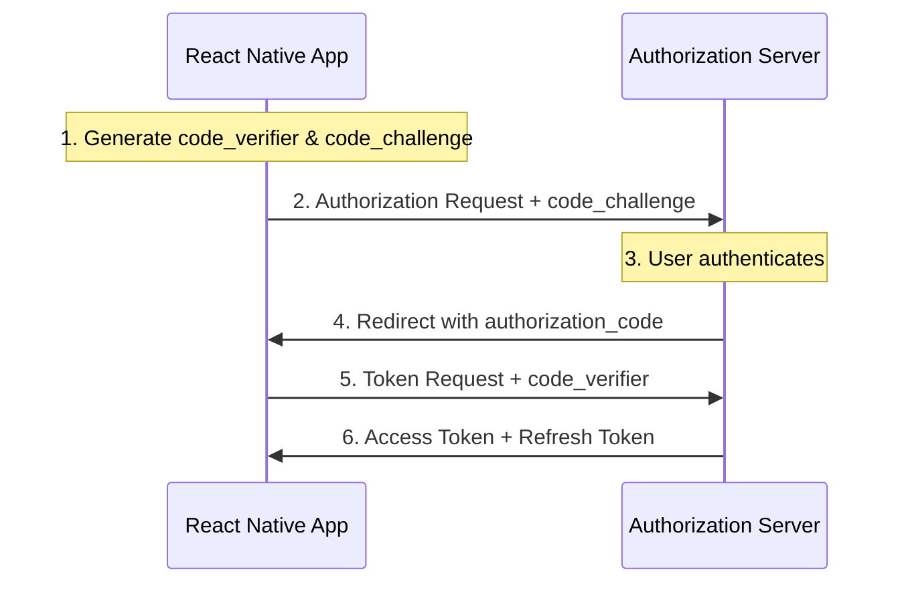

# How to Implement OAuth 2.0 Authentication in React Native

Author: [nawazdhandala](https://github.com/nawazdhandala)

Tags: React Native, OAuth 2.0, Authentication, Social Login, Mobile Development, Security

Description: Learn how to implement OAuth 2.0 authentication in React Native with Google, Apple, and other providers.

---

## Introduction

OAuth 2.0 has become the industry standard for authentication and authorization in modern applications. For React Native developers, implementing OAuth 2.0 provides users with a seamless sign-in experience using their existing accounts from providers like Google, Apple, and Facebook. This comprehensive guide walks you through implementing OAuth 2.0 authentication in your React Native application, covering everything from basic concepts to production-ready implementations.

## Understanding OAuth 2.0 Flow

Before diving into implementation, let's understand how OAuth 2.0 works in the context of mobile applications.

### The Authorization Code Flow with PKCE

For mobile applications, the recommended flow is the Authorization Code Flow with Proof Key for Code Exchange (PKCE). This flow is designed specifically for public clients (like mobile apps) that cannot securely store client secrets.

Here's how it works:

1. **Authorization Request**: Your app generates a code verifier and code challenge, then redirects the user to the authorization server.

2. **User Authentication**: The user authenticates with the provider (Google, Apple, etc.) and grants permissions.

3. **Authorization Code**: The provider redirects back to your app with an authorization code.

4. **Token Exchange**: Your app exchanges the authorization code (along with the code verifier) for access and refresh tokens.

5. **API Access**: Use the access token to make authenticated API requests.



## Setting Up react-native-app-auth

The `react-native-app-auth` library is the most robust solution for implementing OAuth 2.0 in React Native. It handles the PKCE flow automatically and supports all major providers.

### Installation

```bash
# Using npm
npm install react-native-app-auth

# Using yarn
yarn add react-native-app-auth
```

### iOS Configuration

For iOS, you need to configure URL schemes to handle the OAuth callback.

**Step 1: Update Info.plist**

```xml
<!-- ios/YourApp/Info.plist -->
<key>CFBundleURLTypes</key>
<array>
  <dict>
    <key>CFBundleURLName</key>
    <string>com.yourapp</string>
    <key>CFBundleURLSchemes</key>
    <array>
      <string>com.yourapp.auth</string>
    </array>
  </dict>
</array>
```

**Step 2: Update AppDelegate.m (Objective-C) or AppDelegate.swift**

For Objective-C:

```objc
// AppDelegate.m
#import "RNAppAuthAuthorizationFlowManager.h"

@interface AppDelegate () <RNAppAuthAuthorizationFlowManager>
@property (nonatomic, weak) id<RNAppAuthAuthorizationFlowManagerDelegate> authorizationFlowManagerDelegate;
@end

@implementation AppDelegate

- (BOOL)application:(UIApplication *)app
            openURL:(NSURL *)url
            options:(NSDictionary<UIApplicationOpenURLOptionsKey, id> *)options
{
  if ([self.authorizationFlowManagerDelegate resumeExternalUserAgentFlowWithURL:url]) {
    return YES;
  }
  return NO;
}

@end
```

For Swift:

```swift
// AppDelegate.swift
import UIKit
import RNAppAuth

@UIApplicationMain
class AppDelegate: UIResponder, UIApplicationDelegate, RNAppAuthAuthorizationFlowManager {

    weak var authorizationFlowManagerDelegate: RNAppAuthAuthorizationFlowManagerDelegate?

    func application(_ app: UIApplication,
                     open url: URL,
                     options: [UIApplication.OpenURLOptionsKey : Any] = [:]) -> Bool {
        if authorizationFlowManagerDelegate?.resumeExternalUserAgentFlow(with: url) == true {
            return true
        }
        return false
    }
}
```

### Android Configuration

**Step 1: Update build.gradle**

```groovy
// android/app/build.gradle
android {
    defaultConfig {
        manifestPlaceholders = [
            appAuthRedirectScheme: 'com.yourapp.auth'
        ]
    }
}
```

**Step 2: Update AndroidManifest.xml**

```xml
<!-- android/app/src/main/AndroidManifest.xml -->
<activity
    android:name="net.openid.appauth.RedirectUriReceiverActivity"
    android:exported="true">
    <intent-filter>
        <action android:name="android.intent.action.VIEW"/>
        <category android:name="android.intent.category.DEFAULT"/>
        <category android:name="android.intent.category.BROWSABLE"/>
        <data android:scheme="com.yourapp.auth"/>
    </intent-filter>
</activity>
```

## Creating the Auth Service

Let's create a comprehensive authentication service that handles multiple OAuth providers.

```typescript
// src/services/AuthService.ts
import { authorize, refresh, revoke, AuthConfiguration } from 'react-native-app-auth';
import AsyncStorage from '@react-native-async-storage/async-storage';

// Token storage keys
const TOKEN_STORAGE_KEY = '@auth_tokens';
const USER_STORAGE_KEY = '@auth_user';

// Provider configurations
export const OAuthConfigs: Record<string, AuthConfiguration> = {
  google: {
    issuer: 'https://accounts.google.com',
    clientId: 'YOUR_GOOGLE_CLIENT_ID.apps.googleusercontent.com',
    redirectUrl: 'com.yourapp.auth:/oauth2redirect/google',
    scopes: ['openid', 'profile', 'email'],
  },
  apple: {
    issuer: 'https://appleid.apple.com',
    clientId: 'com.yourapp.service',
    redirectUrl: 'com.yourapp.auth:/oauth2redirect/apple',
    scopes: ['name', 'email'],
  },
  facebook: {
    issuer: 'https://www.facebook.com',
    clientId: 'YOUR_FACEBOOK_APP_ID',
    redirectUrl: 'com.yourapp.auth:/oauth2redirect/facebook',
    scopes: ['public_profile', 'email'],
    serviceConfiguration: {
      authorizationEndpoint: 'https://www.facebook.com/v12.0/dialog/oauth',
      tokenEndpoint: 'https://graph.facebook.com/v12.0/oauth/access_token',
    },
  },
};

// Token interface
interface AuthTokens {
  accessToken: string;
  refreshToken: string | null;
  accessTokenExpirationDate: string;
  idToken: string | null;
  provider: string;
}

// User interface
interface AuthUser {
  id: string;
  email: string;
  name: string;
  picture?: string;
  provider: string;
}

class AuthService {
  private tokens: AuthTokens | null = null;
  private user: AuthUser | null = null;

  /**
   * Initialize the auth service by loading stored tokens
   */
  async initialize(): Promise<boolean> {
    try {
      const storedTokens = await AsyncStorage.getItem(TOKEN_STORAGE_KEY);
      const storedUser = await AsyncStorage.getItem(USER_STORAGE_KEY);

      if (storedTokens) {
        this.tokens = JSON.parse(storedTokens);

        // Check if token is expired
        if (this.isTokenExpired()) {
          const refreshed = await this.refreshTokens();
          if (!refreshed) {
            await this.clearAuth();
            return false;
          }
        }
      }

      if (storedUser) {
        this.user = JSON.parse(storedUser);
      }

      return !!this.tokens;
    } catch (error) {
      console.error('Failed to initialize auth:', error);
      return false;
    }
  }

  /**
   * Sign in with a specific OAuth provider
   */
  async signIn(provider: 'google' | 'apple' | 'facebook'): Promise<AuthUser | null> {
    const config = OAuthConfigs[provider];

    if (!config) {
      throw new Error(`Unknown provider: ${provider}`);
    }

    try {
      const result = await authorize(config);

      this.tokens = {
        accessToken: result.accessToken,
        refreshToken: result.refreshToken,
        accessTokenExpirationDate: result.accessTokenExpirationDate,
        idToken: result.idToken,
        provider,
      };

      // Fetch user info based on provider
      this.user = await this.fetchUserInfo(provider, result.accessToken, result.idToken);

      // Persist tokens and user
      await this.persistAuth();

      return this.user;
    } catch (error) {
      console.error(`${provider} sign-in failed:`, error);
      throw error;
    }
  }

  /**
   * Fetch user information from the OAuth provider
   */
  private async fetchUserInfo(
    provider: string,
    accessToken: string,
    idToken: string | null
  ): Promise<AuthUser> {
    switch (provider) {
      case 'google':
        return this.fetchGoogleUserInfo(accessToken);
      case 'apple':
        return this.parseAppleIdToken(idToken);
      case 'facebook':
        return this.fetchFacebookUserInfo(accessToken);
      default:
        throw new Error(`Unknown provider: ${provider}`);
    }
  }

  /**
   * Fetch Google user info
   */
  private async fetchGoogleUserInfo(accessToken: string): Promise<AuthUser> {
    const response = await fetch('https://www.googleapis.com/oauth2/v3/userinfo', {
      headers: { Authorization: `Bearer ${accessToken}` },
    });

    if (!response.ok) {
      throw new Error('Failed to fetch Google user info');
    }

    const data = await response.json();

    return {
      id: data.sub,
      email: data.email,
      name: data.name,
      picture: data.picture,
      provider: 'google',
    };
  }

  /**
   * Parse Apple ID token to get user info
   */
  private parseAppleIdToken(idToken: string | null): AuthUser {
    if (!idToken) {
      throw new Error('No ID token received from Apple');
    }

    // Decode JWT payload (base64)
    const payload = idToken.split('.')[1];
    const decoded = JSON.parse(atob(payload));

    return {
      id: decoded.sub,
      email: decoded.email || '',
      name: decoded.name || 'Apple User',
      provider: 'apple',
    };
  }

  /**
   * Fetch Facebook user info
   */
  private async fetchFacebookUserInfo(accessToken: string): Promise<AuthUser> {
    const response = await fetch(
      `https://graph.facebook.com/me?fields=id,name,email,picture&access_token=${accessToken}`
    );

    if (!response.ok) {
      throw new Error('Failed to fetch Facebook user info');
    }

    const data = await response.json();

    return {
      id: data.id,
      email: data.email,
      name: data.name,
      picture: data.picture?.data?.url,
      provider: 'facebook',
    };
  }

  /**
   * Refresh the access token
   */
  async refreshTokens(): Promise<boolean> {
    if (!this.tokens?.refreshToken || !this.tokens?.provider) {
      return false;
    }

    const config = OAuthConfigs[this.tokens.provider];

    try {
      const result = await refresh(config, {
        refreshToken: this.tokens.refreshToken,
      });

      this.tokens = {
        ...this.tokens,
        accessToken: result.accessToken,
        accessTokenExpirationDate: result.accessTokenExpirationDate,
        refreshToken: result.refreshToken || this.tokens.refreshToken,
      };

      await this.persistAuth();
      return true;
    } catch (error) {
      console.error('Token refresh failed:', error);
      return false;
    }
  }

  /**
   * Sign out and revoke tokens
   */
  async signOut(): Promise<void> {
    if (this.tokens && this.tokens.provider) {
      const config = OAuthConfigs[this.tokens.provider];

      try {
        await revoke(config, {
          tokenToRevoke: this.tokens.accessToken,
          includeBasicAuth: true,
        });
      } catch (error) {
        console.warn('Token revocation failed:', error);
      }
    }

    await this.clearAuth();
  }

  /**
   * Check if the access token is expired
   */
  isTokenExpired(): boolean {
    if (!this.tokens?.accessTokenExpirationDate) {
      return true;
    }

    const expirationDate = new Date(this.tokens.accessTokenExpirationDate);
    const now = new Date();

    // Consider token expired if it expires within 5 minutes
    return expirationDate.getTime() - now.getTime() < 5 * 60 * 1000;
  }

  /**
   * Get the current access token (refreshing if necessary)
   */
  async getAccessToken(): Promise<string | null> {
    if (!this.tokens) {
      return null;
    }

    if (this.isTokenExpired()) {
      const refreshed = await this.refreshTokens();
      if (!refreshed) {
        await this.clearAuth();
        return null;
      }
    }

    return this.tokens.accessToken;
  }

  /**
   * Get the current user
   */
  getUser(): AuthUser | null {
    return this.user;
  }

  /**
   * Check if user is authenticated
   */
  isAuthenticated(): boolean {
    return !!this.tokens && !this.isTokenExpired();
  }

  /**
   * Persist auth data to storage
   */
  private async persistAuth(): Promise<void> {
    await AsyncStorage.setItem(TOKEN_STORAGE_KEY, JSON.stringify(this.tokens));
    await AsyncStorage.setItem(USER_STORAGE_KEY, JSON.stringify(this.user));
  }

  /**
   * Clear all auth data
   */
  private async clearAuth(): Promise<void> {
    this.tokens = null;
    this.user = null;
    await AsyncStorage.removeItem(TOKEN_STORAGE_KEY);
    await AsyncStorage.removeItem(USER_STORAGE_KEY);
  }
}

export const authService = new AuthService();
export default authService;
```

## Google Sign-In Implementation

### Setting Up Google Cloud Console

1. Go to the [Google Cloud Console](https://console.cloud.google.com/)
2. Create a new project or select an existing one
3. Enable the Google+ API
4. Go to "Credentials" and create OAuth 2.0 Client IDs

**For iOS:**
- Application type: iOS
- Bundle ID: Your app's bundle identifier
- Download the `GoogleService-Info.plist`

**For Android:**
- Application type: Android
- Package name: Your app's package name
- SHA-1 certificate fingerprint (use `keytool -keystore ~/.android/debug.keystore -list -v`)

### Google Sign-In Configuration

```typescript
// src/config/oauth.ts
import { Platform } from 'react-native';

export const googleConfig = {
  issuer: 'https://accounts.google.com',
  clientId: Platform.select({
    ios: 'YOUR_IOS_CLIENT_ID.apps.googleusercontent.com',
    android: 'YOUR_ANDROID_CLIENT_ID.apps.googleusercontent.com',
  }),
  redirectUrl: Platform.select({
    ios: 'com.yourapp:/oauth2redirect/google',
    android: 'com.yourapp:/oauth2redirect/google',
  }),
  scopes: ['openid', 'profile', 'email'],
  usePKCE: true,
};
```

### Google Sign-In Component

```typescript
// src/components/GoogleSignInButton.tsx
import React, { useState } from 'react';
import {
  TouchableOpacity,
  Text,
  StyleSheet,
  ActivityIndicator,
  Image,
  View,
} from 'react-native';
import { authService } from '../services/AuthService';

interface Props {
  onSuccess: (user: any) => void;
  onError: (error: Error) => void;
}

const GoogleSignInButton: React.FC<Props> = ({ onSuccess, onError }) => {
  const [loading, setLoading] = useState(false);

  const handlePress = async () => {
    setLoading(true);
    try {
      const user = await authService.signIn('google');
      if (user) {
        onSuccess(user);
      }
    } catch (error) {
      onError(error as Error);
    } finally {
      setLoading(false);
    }
  };

  return (
    <TouchableOpacity
      style={styles.button}
      onPress={handlePress}
      disabled={loading}
    >
      {loading ? (
        <ActivityIndicator color="#fff" />
      ) : (
        <View style={styles.content}>
          <Image
            source={require('../assets/google-icon.png')}
            style={styles.icon}
          />
          <Text style={styles.text}>Continue with Google</Text>
        </View>
      )}
    </TouchableOpacity>
  );
};

const styles = StyleSheet.create({
  button: {
    backgroundColor: '#4285F4',
    borderRadius: 8,
    paddingVertical: 12,
    paddingHorizontal: 24,
    flexDirection: 'row',
    alignItems: 'center',
    justifyContent: 'center',
    marginVertical: 8,
  },
  content: {
    flexDirection: 'row',
    alignItems: 'center',
  },
  icon: {
    width: 24,
    height: 24,
    marginRight: 12,
  },
  text: {
    color: '#fff',
    fontSize: 16,
    fontWeight: '600',
  },
});

export default GoogleSignInButton;
```

## Apple Sign-In Implementation

Apple Sign-In has specific requirements that must be followed for App Store approval.

### Apple Developer Portal Setup

1. Go to [Apple Developer Portal](https://developer.apple.com/)
2. Navigate to Certificates, Identifiers & Profiles
3. Create a new App ID with "Sign In with Apple" capability
4. Create a Service ID for web authentication (if needed)
5. Configure the domain and return URL

### iOS-Specific Configuration

```xml
<!-- ios/YourApp/YourApp.entitlements -->
<?xml version="1.0" encoding="UTF-8"?>
<!DOCTYPE plist PUBLIC "-//Apple//DTD PLIST 1.0//EN" "http://www.apple.com/DTDs/PropertyList-1.0.dtd">
<plist version="1.0">
<dict>
    <key>com.apple.developer.applesignin</key>
    <array>
        <string>Default</string>
    </array>
</dict>
</plist>
```

### Apple Sign-In with @invertase/react-native-apple-authentication

For the best Apple Sign-In experience on iOS, use the dedicated library:

```bash
npm install @invertase/react-native-apple-authentication
```

```typescript
// src/services/AppleAuthService.ts
import { Platform } from 'react-native';
import appleAuth, {
  appleAuthAndroid,
  AppleAuthRequestOperation,
  AppleAuthRequestScope,
  AppleAuthCredentialState,
} from '@invertase/react-native-apple-authentication';

interface AppleUser {
  id: string;
  email: string | null;
  fullName: string | null;
  identityToken: string;
  authorizationCode: string;
}

class AppleAuthService {
  /**
   * Check if Apple Sign-In is available
   */
  isAvailable(): boolean {
    if (Platform.OS === 'ios') {
      return appleAuth.isSupported;
    }
    return appleAuthAndroid.isSupported;
  }

  /**
   * Sign in with Apple on iOS
   */
  async signInIOS(): Promise<AppleUser> {
    // Start the sign-in request
    const appleAuthRequestResponse = await appleAuth.performRequest({
      requestedOperation: AppleAuthRequestOperation.LOGIN,
      requestedScopes: [
        AppleAuthRequestScope.EMAIL,
        AppleAuthRequestScope.FULL_NAME,
      ],
    });

    // Get the credential state
    const credentialState = await appleAuth.getCredentialStateForUser(
      appleAuthRequestResponse.user
    );

    if (credentialState !== AppleAuthCredentialState.AUTHORIZED) {
      throw new Error('Apple Sign-In authorization failed');
    }

    const { user, email, fullName, identityToken, authorizationCode } =
      appleAuthRequestResponse;

    // Note: Apple only returns name/email on first sign-in
    // You must store these values server-side
    const displayName = fullName
      ? `${fullName.givenName || ''} ${fullName.familyName || ''}`.trim()
      : null;

    return {
      id: user,
      email,
      fullName: displayName,
      identityToken: identityToken!,
      authorizationCode: authorizationCode!,
    };
  }

  /**
   * Sign in with Apple on Android
   */
  async signInAndroid(): Promise<AppleUser> {
    // Configure Android Apple Auth
    appleAuthAndroid.configure({
      clientId: 'com.yourapp.service',
      redirectUri: 'https://yourapp.com/auth/apple/callback',
      scope: appleAuthAndroid.Scope.ALL,
      responseType: appleAuthAndroid.ResponseType.ALL,
    });

    const response = await appleAuthAndroid.signIn();

    return {
      id: response.user || '',
      email: response.email || null,
      fullName: response.fullName?.givenName || null,
      identityToken: response.id_token || '',
      authorizationCode: response.code || '',
    };
  }

  /**
   * Cross-platform Apple Sign-In
   */
  async signIn(): Promise<AppleUser> {
    if (Platform.OS === 'ios') {
      return this.signInIOS();
    }
    return this.signInAndroid();
  }

  /**
   * Check credential state (iOS only)
   */
  async checkCredentialState(userId: string): Promise<boolean> {
    if (Platform.OS !== 'ios') {
      return true;
    }

    const credentialState = await appleAuth.getCredentialStateForUser(userId);
    return credentialState === AppleAuthCredentialState.AUTHORIZED;
  }
}

export const appleAuthService = new AppleAuthService();
export default appleAuthService;
```

### Apple Sign-In Button Component

```typescript
// src/components/AppleSignInButton.tsx
import React, { useState } from 'react';
import {
  TouchableOpacity,
  Text,
  StyleSheet,
  ActivityIndicator,
  View,
  Platform,
} from 'react-native';
import { appleAuthService } from '../services/AppleAuthService';

interface Props {
  onSuccess: (user: any) => void;
  onError: (error: Error) => void;
}

const AppleSignInButton: React.FC<Props> = ({ onSuccess, onError }) => {
  const [loading, setLoading] = useState(false);

  if (!appleAuthService.isAvailable()) {
    return null;
  }

  const handlePress = async () => {
    setLoading(true);
    try {
      const user = await appleAuthService.signIn();
      onSuccess(user);
    } catch (error) {
      onError(error as Error);
    } finally {
      setLoading(false);
    }
  };

  return (
    <TouchableOpacity
      style={styles.button}
      onPress={handlePress}
      disabled={loading}
    >
      {loading ? (
        <ActivityIndicator color="#fff" />
      ) : (
        <View style={styles.content}>
          <Text style={styles.appleIcon}></Text>
          <Text style={styles.text}>Continue with Apple</Text>
        </View>
      )}
    </TouchableOpacity>
  );
};

const styles = StyleSheet.create({
  button: {
    backgroundColor: '#000',
    borderRadius: 8,
    paddingVertical: 12,
    paddingHorizontal: 24,
    flexDirection: 'row',
    alignItems: 'center',
    justifyContent: 'center',
    marginVertical: 8,
  },
  content: {
    flexDirection: 'row',
    alignItems: 'center',
  },
  appleIcon: {
    color: '#fff',
    fontSize: 20,
    marginRight: 8,
  },
  text: {
    color: '#fff',
    fontSize: 16,
    fontWeight: '600',
  },
});

export default AppleSignInButton;
```

## Facebook Login Implementation

### Facebook Developer Console Setup

1. Go to [Facebook Developers](https://developers.facebook.com/)
2. Create a new app or select existing
3. Add Facebook Login product
4. Configure OAuth redirect URIs
5. Note your App ID and App Secret

### Facebook Configuration

```typescript
// src/config/facebookConfig.ts
export const facebookConfig = {
  issuer: 'https://www.facebook.com',
  clientId: 'YOUR_FACEBOOK_APP_ID',
  clientSecret: 'YOUR_FACEBOOK_APP_SECRET', // Only use server-side!
  redirectUrl: 'fb{YOUR_FACEBOOK_APP_ID}://authorize',
  scopes: ['public_profile', 'email'],
  serviceConfiguration: {
    authorizationEndpoint: 'https://www.facebook.com/v18.0/dialog/oauth',
    tokenEndpoint: 'https://graph.facebook.com/v18.0/oauth/access_token',
  },
};
```

### iOS Facebook Configuration

```xml
<!-- ios/YourApp/Info.plist -->
<key>CFBundleURLTypes</key>
<array>
  <dict>
    <key>CFBundleURLSchemes</key>
    <array>
      <string>fb{YOUR_FACEBOOK_APP_ID}</string>
    </array>
  </dict>
</array>
<key>FacebookAppID</key>
<string>{YOUR_FACEBOOK_APP_ID}</string>
<key>FacebookClientToken</key>
<string>{YOUR_FACEBOOK_CLIENT_TOKEN}</string>
<key>FacebookDisplayName</key>
<string>Your App Name</string>
<key>LSApplicationQueriesSchemes</key>
<array>
  <string>fbapi</string>
  <string>fb-messenger-share-api</string>
</array>
```

## Deep Linking for OAuth Callbacks

Proper deep linking configuration is essential for OAuth callbacks to work correctly.

### Universal Links (iOS)

```typescript
// src/config/deepLinking.ts
import { Linking } from 'react-native';

export const linking = {
  prefixes: [
    'yourapp://',
    'https://yourapp.com',
    'com.yourapp.auth://',
  ],
  config: {
    screens: {
      Auth: {
        screens: {
          OAuthCallback: 'oauth2redirect/:provider',
        },
      },
      Main: {
        screens: {
          Home: 'home',
          Profile: 'profile',
        },
      },
    },
  },
  async getInitialURL() {
    const url = await Linking.getInitialURL();
    return url;
  },
  subscribe(listener: (url: string) => void) {
    const subscription = Linking.addEventListener('url', ({ url }) => {
      listener(url);
    });
    return () => subscription.remove();
  },
};
```

### App Links (Android)

```xml
<!-- android/app/src/main/AndroidManifest.xml -->
<activity
    android:name=".MainActivity"
    android:launchMode="singleTask">

    <!-- Deep link -->
    <intent-filter>
        <action android:name="android.intent.action.VIEW"/>
        <category android:name="android.intent.category.DEFAULT"/>
        <category android:name="android.intent.category.BROWSABLE"/>
        <data android:scheme="yourapp"/>
    </intent-filter>

    <!-- App Links (verified) -->
    <intent-filter android:autoVerify="true">
        <action android:name="android.intent.action.VIEW"/>
        <category android:name="android.intent.category.DEFAULT"/>
        <category android:name="android.intent.category.BROWSABLE"/>
        <data
            android:scheme="https"
            android:host="yourapp.com"
            android:pathPrefix="/auth"/>
    </intent-filter>
</activity>
```

## Token Management

Proper token management is crucial for security and user experience.

### Secure Token Storage

```typescript
// src/services/SecureTokenStorage.ts
import * as Keychain from 'react-native-keychain';
import { Platform } from 'react-native';

const SERVICE_NAME = 'com.yourapp.auth';

interface StoredTokens {
  accessToken: string;
  refreshToken: string | null;
  expiresAt: number;
  provider: string;
}

class SecureTokenStorage {
  /**
   * Store tokens securely
   */
  async storeTokens(tokens: StoredTokens): Promise<void> {
    const tokenString = JSON.stringify(tokens);

    await Keychain.setGenericPassword(
      'oauth_tokens',
      tokenString,
      {
        service: SERVICE_NAME,
        accessible: Keychain.ACCESSIBLE.WHEN_UNLOCKED_THIS_DEVICE_ONLY,
        securityLevel: Platform.OS === 'android'
          ? Keychain.SECURITY_LEVEL.SECURE_HARDWARE
          : undefined,
      }
    );
  }

  /**
   * Retrieve stored tokens
   */
  async getTokens(): Promise<StoredTokens | null> {
    try {
      const credentials = await Keychain.getGenericPassword({
        service: SERVICE_NAME,
      });

      if (credentials && credentials.password) {
        return JSON.parse(credentials.password);
      }
      return null;
    } catch (error) {
      console.error('Failed to retrieve tokens:', error);
      return null;
    }
  }

  /**
   * Clear stored tokens
   */
  async clearTokens(): Promise<void> {
    await Keychain.resetGenericPassword({ service: SERVICE_NAME });
  }

  /**
   * Check if tokens are expired
   */
  async areTokensValid(): Promise<boolean> {
    const tokens = await this.getTokens();
    if (!tokens) return false;

    // Add 5-minute buffer
    return tokens.expiresAt > Date.now() + 5 * 60 * 1000;
  }
}

export const secureTokenStorage = new SecureTokenStorage();
export default secureTokenStorage;
```

### Token Refresh Interceptor

```typescript
// src/api/tokenInterceptor.ts
import axios, { AxiosInstance, InternalAxiosRequestConfig } from 'axios';
import { authService } from '../services/AuthService';

export function createAuthenticatedClient(baseURL: string): AxiosInstance {
  const client = axios.create({ baseURL });

  // Request interceptor to add auth header
  client.interceptors.request.use(
    async (config: InternalAxiosRequestConfig) => {
      const token = await authService.getAccessToken();

      if (token) {
        config.headers.Authorization = `Bearer ${token}`;
      }

      return config;
    },
    (error) => Promise.reject(error)
  );

  // Response interceptor to handle 401 errors
  client.interceptors.response.use(
    (response) => response,
    async (error) => {
      const originalRequest = error.config;

      if (error.response?.status === 401 && !originalRequest._retry) {
        originalRequest._retry = true;

        const refreshed = await authService.refreshTokens();

        if (refreshed) {
          const newToken = await authService.getAccessToken();
          originalRequest.headers.Authorization = `Bearer ${newToken}`;
          return client(originalRequest);
        }

        // Refresh failed, sign out
        await authService.signOut();
      }

      return Promise.reject(error);
    }
  );

  return client;
}
```

## Comprehensive Error Handling

```typescript
// src/utils/authErrors.ts

export enum AuthErrorCode {
  USER_CANCELLED = 'USER_CANCELLED',
  NETWORK_ERROR = 'NETWORK_ERROR',
  INVALID_RESPONSE = 'INVALID_RESPONSE',
  TOKEN_EXPIRED = 'TOKEN_EXPIRED',
  PROVIDER_ERROR = 'PROVIDER_ERROR',
  CONFIGURATION_ERROR = 'CONFIGURATION_ERROR',
  UNKNOWN_ERROR = 'UNKNOWN_ERROR',
}

export class AuthError extends Error {
  code: AuthErrorCode;
  provider?: string;
  originalError?: Error;

  constructor(
    code: AuthErrorCode,
    message: string,
    provider?: string,
    originalError?: Error
  ) {
    super(message);
    this.name = 'AuthError';
    this.code = code;
    this.provider = provider;
    this.originalError = originalError;
  }
}

export function parseAuthError(error: any, provider?: string): AuthError {
  // User cancelled
  if (
    error.message?.includes('cancelled') ||
    error.message?.includes('canceled') ||
    error.code === 'ERR_APP_AUTH_CANCELLED'
  ) {
    return new AuthError(
      AuthErrorCode.USER_CANCELLED,
      'Sign-in was cancelled',
      provider,
      error
    );
  }

  // Network errors
  if (
    error.message?.includes('network') ||
    error.message?.includes('timeout') ||
    error.code === 'ERR_NETWORK'
  ) {
    return new AuthError(
      AuthErrorCode.NETWORK_ERROR,
      'Network error occurred. Please check your connection.',
      provider,
      error
    );
  }

  // Invalid response
  if (error.message?.includes('invalid') || error.message?.includes('malformed')) {
    return new AuthError(
      AuthErrorCode.INVALID_RESPONSE,
      'Invalid response from authentication server',
      provider,
      error
    );
  }

  // Default to unknown error
  return new AuthError(
    AuthErrorCode.UNKNOWN_ERROR,
    error.message || 'An unexpected error occurred',
    provider,
    error
  );
}

export function getErrorMessage(error: AuthError): string {
  switch (error.code) {
    case AuthErrorCode.USER_CANCELLED:
      return 'Sign-in was cancelled. Please try again.';
    case AuthErrorCode.NETWORK_ERROR:
      return 'Unable to connect. Please check your internet connection.';
    case AuthErrorCode.INVALID_RESPONSE:
      return 'Something went wrong. Please try again later.';
    case AuthErrorCode.TOKEN_EXPIRED:
      return 'Your session has expired. Please sign in again.';
    case AuthErrorCode.PROVIDER_ERROR:
      return `Unable to sign in with ${error.provider}. Please try another method.`;
    case AuthErrorCode.CONFIGURATION_ERROR:
      return 'Configuration error. Please contact support.';
    default:
      return 'An unexpected error occurred. Please try again.';
  }
}
```

## Complete Login Screen Implementation

```typescript
// src/screens/LoginScreen.tsx
import React, { useState, useEffect } from 'react';
import {
  View,
  Text,
  StyleSheet,
  SafeAreaView,
  Alert,
  Platform,
} from 'react-native';
import { useNavigation } from '@react-navigation/native';
import GoogleSignInButton from '../components/GoogleSignInButton';
import AppleSignInButton from '../components/AppleSignInButton';
import FacebookSignInButton from '../components/FacebookSignInButton';
import { authService } from '../services/AuthService';
import { parseAuthError, getErrorMessage, AuthErrorCode } from '../utils/authErrors';

const LoginScreen: React.FC = () => {
  const navigation = useNavigation();
  const [isInitializing, setIsInitializing] = useState(true);

  useEffect(() => {
    initializeAuth();
  }, []);

  const initializeAuth = async () => {
    const isAuthenticated = await authService.initialize();
    if (isAuthenticated) {
      navigation.reset({
        index: 0,
        routes: [{ name: 'Main' }],
      });
    }
    setIsInitializing(false);
  };

  const handleSuccess = (user: any) => {
    console.log('Signed in:', user);
    navigation.reset({
      index: 0,
      routes: [{ name: 'Main' }],
    });
  };

  const handleError = (error: Error) => {
    const authError = parseAuthError(error);

    // Don't show alert for user cancellation
    if (authError.code === AuthErrorCode.USER_CANCELLED) {
      return;
    }

    Alert.alert('Sign-In Error', getErrorMessage(authError));
  };

  if (isInitializing) {
    return (
      <View style={styles.loadingContainer}>
        <Text>Loading...</Text>
      </View>
    );
  }

  return (
    <SafeAreaView style={styles.container}>
      <View style={styles.header}>
        <Text style={styles.title}>Welcome</Text>
        <Text style={styles.subtitle}>Sign in to continue</Text>
      </View>

      <View style={styles.buttonContainer}>
        {/* Apple Sign-In should be first on iOS per Apple guidelines */}
        {Platform.OS === 'ios' && (
          <AppleSignInButton onSuccess={handleSuccess} onError={handleError} />
        )}

        <GoogleSignInButton onSuccess={handleSuccess} onError={handleError} />

        <FacebookSignInButton onSuccess={handleSuccess} onError={handleError} />

        {/* Show Apple Sign-In on Android too if supported */}
        {Platform.OS === 'android' && (
          <AppleSignInButton onSuccess={handleSuccess} onError={handleError} />
        )}
      </View>

      <View style={styles.footer}>
        <Text style={styles.footerText}>
          By continuing, you agree to our Terms of Service and Privacy Policy
        </Text>
      </View>
    </SafeAreaView>
  );
};

const styles = StyleSheet.create({
  container: {
    flex: 1,
    backgroundColor: '#fff',
  },
  loadingContainer: {
    flex: 1,
    justifyContent: 'center',
    alignItems: 'center',
  },
  header: {
    flex: 1,
    justifyContent: 'center',
    alignItems: 'center',
    paddingHorizontal: 24,
  },
  title: {
    fontSize: 32,
    fontWeight: 'bold',
    color: '#1a1a1a',
    marginBottom: 8,
  },
  subtitle: {
    fontSize: 16,
    color: '#666',
  },
  buttonContainer: {
    flex: 2,
    justifyContent: 'center',
    paddingHorizontal: 24,
  },
  footer: {
    padding: 24,
    alignItems: 'center',
  },
  footerText: {
    fontSize: 12,
    color: '#999',
    textAlign: 'center',
  },
});

export default LoginScreen;
```

## Security Considerations

### 1. Never Store Client Secrets in Mobile Apps

```typescript
// BAD - Never do this!
const config = {
  clientSecret: 'your-secret-here', // NEVER store secrets in mobile code
};

// GOOD - Use PKCE instead
const config = {
  usePKCE: true,
  // No client secret needed
};
```

### 2. Validate Tokens Server-Side

Always validate tokens on your backend server:

```typescript
// Backend validation example (Node.js)
import { OAuth2Client } from 'google-auth-library';

const client = new OAuth2Client(GOOGLE_CLIENT_ID);

async function verifyGoogleToken(token: string) {
  const ticket = await client.verifyIdToken({
    idToken: token,
    audience: GOOGLE_CLIENT_ID,
  });

  const payload = ticket.getPayload();
  return payload;
}
```

### 3. Use Secure Storage

```typescript
// Always use secure storage for sensitive data
import * as Keychain from 'react-native-keychain';

// Store securely
await Keychain.setGenericPassword('user', tokenData, {
  accessible: Keychain.ACCESSIBLE.WHEN_UNLOCKED_THIS_DEVICE_ONLY,
});
```

### 4. Implement Certificate Pinning

```typescript
// For production apps, implement certificate pinning
import { fetch } from 'react-native-ssl-pinning';

const response = await fetch(url, {
  method: 'GET',
  sslPinning: {
    certs: ['cert1', 'cert2'],
  },
});
```

### 5. Handle Logout Properly

```typescript
async function secureLogout() {
  // 1. Revoke tokens with provider
  await authService.signOut();

  // 2. Clear all cached data
  await AsyncStorage.clear();

  // 3. Clear secure storage
  await Keychain.resetGenericPassword();

  // 4. Clear any cookies
  await CookieManager.clearAll();

  // 5. Navigate to login
  navigation.reset({
    index: 0,
    routes: [{ name: 'Login' }],
  });
}
```

## Testing OAuth Implementation

### Mock Authentication for Development

```typescript
// src/services/__mocks__/AuthService.ts
export const mockAuthService = {
  signIn: jest.fn().mockResolvedValue({
    id: 'test-user-id',
    email: 'test@example.com',
    name: 'Test User',
    provider: 'google',
  }),
  signOut: jest.fn().mockResolvedValue(undefined),
  getAccessToken: jest.fn().mockResolvedValue('mock-access-token'),
  isAuthenticated: jest.fn().mockReturnValue(true),
};
```

### Integration Testing

```typescript
// __tests__/auth.test.ts
import { authService } from '../src/services/AuthService';

describe('AuthService', () => {
  beforeEach(() => {
    jest.clearAllMocks();
  });

  it('should initialize without tokens', async () => {
    const result = await authService.initialize();
    expect(result).toBe(false);
  });

  it('should handle sign-in cancellation gracefully', async () => {
    // Mock cancelled sign-in
    jest.spyOn(authService, 'signIn').mockRejectedValue(
      new Error('User cancelled')
    );

    await expect(authService.signIn('google')).rejects.toThrow('User cancelled');
  });
});
```

## Conclusion

Implementing OAuth 2.0 authentication in React Native requires careful attention to platform-specific requirements, security best practices, and user experience. By following this guide, you have learned:

1. **OAuth 2.0 fundamentals** - Understanding the Authorization Code Flow with PKCE
2. **Library setup** - Configuring react-native-app-auth for iOS and Android
3. **Provider integration** - Implementing Google, Apple, and Facebook sign-in
4. **Token management** - Securely storing and refreshing tokens
5. **Deep linking** - Handling OAuth callbacks properly
6. **Error handling** - Creating a robust error handling system
7. **Security practices** - Protecting user data and tokens

Remember to always follow each provider's guidelines and stay updated with their API changes. OAuth 2.0 security is an evolving field, and keeping your implementation current is essential for protecting your users.

## Additional Resources

- [OAuth 2.0 RFC 6749](https://tools.ietf.org/html/rfc6749)
- [PKCE RFC 7636](https://tools.ietf.org/html/rfc7636)
- [react-native-app-auth Documentation](https://github.com/FormidableLabs/react-native-app-auth)
- [Google Sign-In for iOS](https://developers.google.com/identity/sign-in/ios)
- [Sign in with Apple](https://developer.apple.com/sign-in-with-apple/)
- [Facebook Login for Mobile](https://developers.facebook.com/docs/facebook-login/mobile)
