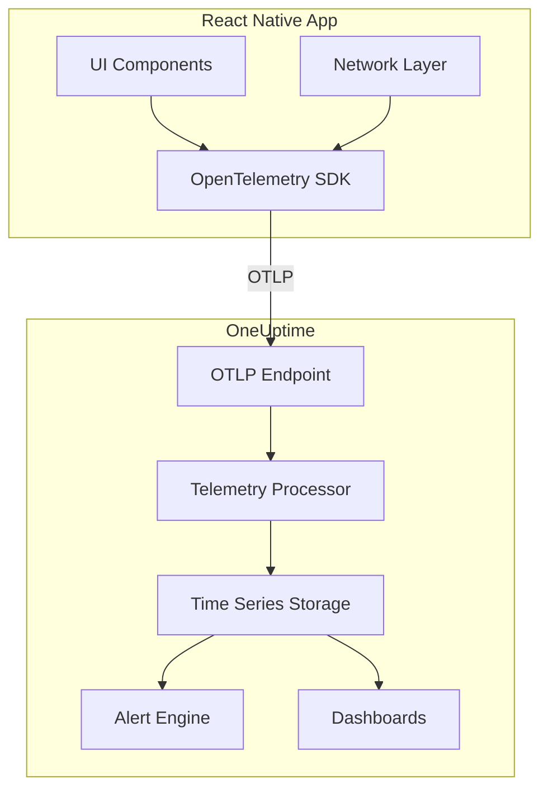

# How to Monitor React Native App Performance with OneUptime

Author: [nawazdhandala](https://github.com/nawazdhandala)

Tags: React Native, OneUptime, Monitoring, Performance, Mobile Development, Observability

Description: Learn how to set up comprehensive React Native app monitoring with OneUptime for real-time performance insights and alerting.

---

Mobile applications face unique monitoring challenges that traditional web observability tools struggle to address. Network conditions vary wildly, devices have different capabilities, and users expect instant responsiveness. OneUptime provides the observability platform you need to understand how your React Native app performs in the real world.

This guide walks you through setting up comprehensive monitoring for your React Native application using OneUptime and OpenTelemetry, covering everything from basic instrumentation to advanced user session tracking.

---

## TL;DR

- OneUptime provides full-stack observability for React Native apps through OpenTelemetry integration
- Track app startup times, screen render performance, and user interactions
- Monitor network requests with automatic correlation to backend traces
- Capture errors and crashes with full stack traces and device context
- Set up alerts for performance regressions and error spikes
- Build dashboards to visualize app health and user experience metrics

---

## Why Monitor React Native Apps

React Native apps face challenges that server-side applications do not:

- **Device fragmentation**: Your app runs on thousands of device configurations
- **Network variability**: Users switch between WiFi, 4G, and offline states
- **Memory constraints**: Mobile devices aggressively reclaim memory
- **Battery impact**: Inefficient code drains batteries and frustrates users
- **App store reviews**: Performance issues directly impact ratings
- **Silent failures**: Crashes often go unreported without proper instrumentation

Without proper monitoring, you are flying blind. Users experience issues you never hear about until app store reviews tank.

---

## OneUptime Overview for Mobile Apps

OneUptime is an open-source observability platform that provides:

- **Traces**: Follow user actions through your entire stack
- **Metrics**: Track performance over time across device types
- **Logs**: Correlate application logs with traces and user sessions
- **Alerts**: Get notified when performance degrades
- **Dashboards**: Visualize app health in real-time
- **Status Pages**: Communicate issues to users transparently

For React Native apps, OneUptime integrates through OpenTelemetry, the vendor-neutral standard for observability data. This means you are not locked into a proprietary SDK and can switch backends if needed.



---

## SDK Installation and Setup

### Prerequisites

Before starting, ensure you have:

- React Native 0.70 or higher
- Node.js 18 or higher
- A OneUptime account with an OTLP endpoint configured
- Your OneUptime project API key

### Installing Dependencies

Install the OpenTelemetry packages for React Native:

```bash
npm install @opentelemetry/api \
  @opentelemetry/sdk-trace-base \
  @opentelemetry/sdk-trace-web \
  @opentelemetry/exporter-trace-otlp-http \
  @opentelemetry/resources \
  @opentelemetry/semantic-conventions \
  @opentelemetry/instrumentation-fetch \
  @opentelemetry/instrumentation-xml-http-request
```

For React Native specific functionality:

```bash
npm install @react-native-async-storage/async-storage \
  react-native-device-info
```

### Basic Configuration

Create a telemetry configuration file that initializes OpenTelemetry before your app renders:

```typescript
// src/telemetry/config.ts
import { WebTracerProvider, BatchSpanProcessor } from '@opentelemetry/sdk-trace-web';
import { OTLPTraceExporter } from '@opentelemetry/exporter-trace-otlp-http';
import { Resource } from '@opentelemetry/resources';
import { SemanticResourceAttributes } from '@opentelemetry/semantic-conventions';
import DeviceInfo from 'react-native-device-info';
import { Platform } from 'react-native';

// Configuration for your OneUptime instance
const ONEUPTIME_OTLP_ENDPOINT = 'https://otlp.oneuptime.com/v1/traces';
const ONEUPTIME_API_KEY = process.env.ONEUPTIME_API_KEY || '';

// Build resource attributes that identify your app and device
async function buildResource(): Promise<Resource> {
  const deviceId = await DeviceInfo.getUniqueId();
  const deviceModel = DeviceInfo.getModel();
  const systemVersion = DeviceInfo.getSystemVersion();
  const appVersion = DeviceInfo.getVersion();
  const buildNumber = DeviceInfo.getBuildNumber();

  return new Resource({
    [SemanticResourceAttributes.SERVICE_NAME]: 'my-react-native-app',
    [SemanticResourceAttributes.SERVICE_VERSION]: appVersion,
    [SemanticResourceAttributes.DEPLOYMENT_ENVIRONMENT]: __DEV__ ? 'development' : 'production',

    // Mobile-specific attributes
    'device.id': deviceId,
    'device.model.name': deviceModel,
    'os.type': Platform.OS,
    'os.version': systemVersion,
    'app.build': buildNumber,
  });
}

// Initialize the tracer provider
let tracerProvider: WebTracerProvider | null = null;

export async function initializeTelemetry(): Promise<void> {
  if (tracerProvider) {
    return; // Already initialized
  }

  const resource = await buildResource();

  // Configure the OTLP exporter to send traces to OneUptime
  const exporter = new OTLPTraceExporter({
    url: ONEUPTIME_OTLP_ENDPOINT,
    headers: {
      'x-oneuptime-token': ONEUPTIME_API_KEY,
    },
  });

  // Create the tracer provider with batched span processing
  tracerProvider = new WebTracerProvider({
    resource,
  });

  // Batch spans for efficient network usage on mobile
  tracerProvider.addSpanProcessor(
    new BatchSpanProcessor(exporter, {
      maxQueueSize: 100,
      maxExportBatchSize: 50,
      scheduledDelayMillis: 5000,
      exportTimeoutMillis: 30000,
    })
  );

  // Register as the global tracer provider
  tracerProvider.register();

  console.log('Telemetry initialized successfully');
}

export function getTracerProvider(): WebTracerProvider | null {
  return tracerProvider;
}
```

### Initialize Early in App Lifecycle

Initialize telemetry before your app renders to capture startup metrics:

```typescript
// index.js
import { AppRegistry } from 'react-native';
import App from './src/App';
import { name as appName } from './app.json';
import { initializeTelemetry } from './src/telemetry/config';

// Initialize telemetry before app registration
initializeTelemetry()
  .then(() => {
    console.log('Telemetry ready');
  })
  .catch((error) => {
    console.error('Failed to initialize telemetry:', error);
  });

AppRegistry.registerComponent(appName, () => App);
```

---

## Configuring Telemetry Collection

### Setting Up the Tracer

Create a centralized tracer instance for your application:

```typescript
// src/telemetry/tracer.ts
import { trace, Tracer, SpanStatusCode, Span } from '@opentelemetry/api';

const SERVICE_NAME = 'my-react-native-app';

// Get the tracer instance for creating spans
export function getTracer(): Tracer {
  return trace.getTracer(SERVICE_NAME);
}

// Helper to create spans with consistent attributes
export function createSpan(
  name: string,
  attributes?: Record<string, string | number | boolean>
): Span {
  const tracer = getTracer();
  return tracer.startSpan(name, { attributes });
}

// Helper to wrap async operations in spans
export async function withSpan<T>(
  name: string,
  fn: (span: Span) => Promise<T>,
  attributes?: Record<string, string | number | boolean>
): Promise<T> {
  const tracer = getTracer();

  return tracer.startActiveSpan(name, { attributes }, async (span) => {
    try {
      const result = await fn(span);
      span.setStatus({ code: SpanStatusCode.OK });
      return result;
    } catch (error) {
      span.recordException(error as Error);
      span.setStatus({
        code: SpanStatusCode.ERROR,
        message: (error as Error).message,
      });
      throw error;
    } finally {
      span.end();
    }
  });
}
```

### Configuring Sampling

In production, you may want to sample traces to reduce data volume while maintaining visibility:

```typescript
// src/telemetry/sampling.ts
import { Sampler, SamplingResult, SamplingDecision, Context, Link, SpanKind, Attributes } from '@opentelemetry/api';

// Custom sampler that always captures errors and samples regular traces
export class MobileSampler implements Sampler {
  private readonly sampleRate: number;

  constructor(sampleRate: number = 0.1) {
    this.sampleRate = sampleRate;
  }

  shouldSample(
    context: Context,
    traceId: string,
    spanName: string,
    spanKind: SpanKind,
    attributes: Attributes,
    links: Link[]
  ): SamplingResult {
    // Always sample error spans
    if (attributes['error'] || spanName.includes('error') || spanName.includes('crash')) {
      return { decision: SamplingDecision.RECORD_AND_SAMPLED };
    }

    // Always sample slow operations
    if (attributes['duration.threshold.exceeded']) {
      return { decision: SamplingDecision.RECORD_AND_SAMPLED };
    }

    // Probabilistic sampling for regular traces
    const shouldSample = Math.random() < this.sampleRate;
    return {
      decision: shouldSample
        ? SamplingDecision.RECORD_AND_SAMPLED
        : SamplingDecision.NOT_RECORD,
    };
  }

  toString(): string {
    return `MobileSampler{sampleRate=${this.sampleRate}}`;
  }
}
```

---

## Performance Metrics Tracking

### App Startup Time

Track how long your app takes to become interactive:

```typescript
// src/telemetry/startup.ts
import { getTracer } from './tracer';
import { SpanStatusCode } from '@opentelemetry/api';

let appStartTime: number | null = null;
let startupSpan: ReturnType<ReturnType<typeof getTracer>['startSpan']> | null = null;

// Call this at the very start of your app
export function markAppStart(): void {
  appStartTime = Date.now();
  startupSpan = getTracer().startSpan('app.startup', {
    attributes: {
      'startup.type': 'cold', // or 'warm' based on detection
    },
  });
}

// Call this when your first screen is interactive
export function markAppReady(): void {
  if (!startupSpan || !appStartTime) {
    console.warn('App start was not marked');
    return;
  }

  const startupDuration = Date.now() - appStartTime;

  startupSpan.setAttributes({
    'startup.duration_ms': startupDuration,
    'startup.success': true,
  });

  startupSpan.setStatus({ code: SpanStatusCode.OK });
  startupSpan.end();

  // Reset for potential warm starts
  startupSpan = null;
  appStartTime = null;

  console.log(`App startup completed in ${startupDuration}ms`);
}

// Call this if startup fails
export function markAppStartupFailed(error: Error): void {
  if (!startupSpan) {
    return;
  }

  startupSpan.recordException(error);
  startupSpan.setAttributes({
    'startup.success': false,
    'startup.error': error.message,
  });
  startupSpan.setStatus({
    code: SpanStatusCode.ERROR,
    message: error.message,
  });
  startupSpan.end();

  startupSpan = null;
}
```

### Screen Render Performance

Track how long screens take to render:

```typescript
// src/telemetry/screens.ts
import { useEffect, useRef } from 'react';
import { getTracer } from './tracer';
import { SpanStatusCode, Span } from '@opentelemetry/api';

// Hook to track screen render time
export function useScreenTelemetry(screenName: string): void {
  const spanRef = useRef<Span | null>(null);
  const mountTimeRef = useRef<number>(Date.now());

  useEffect(() => {
    // Create span when component mounts
    spanRef.current = getTracer().startSpan(`screen.render.${screenName}`, {
      attributes: {
        'screen.name': screenName,
        'render.type': 'initial',
      },
    });

    // End span after first render completes
    const renderTime = Date.now() - mountTimeRef.current;

    spanRef.current.setAttributes({
      'render.duration_ms': renderTime,
    });

    if (renderTime > 1000) {
      spanRef.current.setAttributes({
        'render.slow': true,
        'duration.threshold.exceeded': true,
      });
    }

    spanRef.current.setStatus({ code: SpanStatusCode.OK });
    spanRef.current.end();

    return () => {
      // Track screen unmount for navigation timing
      const screenSpan = getTracer().startSpan(`screen.unmount.${screenName}`, {
        attributes: {
          'screen.name': screenName,
        },
      });
      screenSpan.end();
    };
  }, [screenName]);
}

// Higher-order component for class components
export function withScreenTelemetry<P extends object>(
  WrappedComponent: React.ComponentType<P>,
  screenName: string
): React.FC<P> {
  return function TelemetryWrapper(props: P) {
    useScreenTelemetry(screenName);
    return <WrappedComponent {...props} />;
  };
}
```

### Frame Rate Monitoring

Track UI smoothness with frame rate monitoring:

```typescript
// src/telemetry/frameRate.ts
import { InteractionManager } from 'react-native';
import { getTracer } from './tracer';

let frameCount = 0;
let lastFrameTime = Date.now();
let monitoringInterval: NodeJS.Timeout | null = null;

export function startFrameRateMonitoring(): void {
  if (monitoringInterval) {
    return;
  }

  frameCount = 0;
  lastFrameTime = Date.now();

  // Monitor frame rate every second
  monitoringInterval = setInterval(() => {
    const currentTime = Date.now();
    const elapsed = currentTime - lastFrameTime;
    const fps = (frameCount / elapsed) * 1000;

    const span = getTracer().startSpan('metrics.frame_rate', {
      attributes: {
        'frame_rate.fps': Math.round(fps),
        'frame_rate.frames': frameCount,
        'frame_rate.duration_ms': elapsed,
      },
    });

    // Flag low frame rates
    if (fps < 30) {
      span.setAttributes({
        'frame_rate.low': true,
        'frame_rate.severity': fps < 15 ? 'critical' : 'warning',
      });
    }

    span.end();

    // Reset counters
    frameCount = 0;
    lastFrameTime = currentTime;
  }, 1000);

  // Count frames using InteractionManager
  const countFrame = (): void => {
    frameCount++;
    if (monitoringInterval) {
      InteractionManager.runAfterInteractions(countFrame);
    }
  };

  InteractionManager.runAfterInteractions(countFrame);
}

export function stopFrameRateMonitoring(): void {
  if (monitoringInterval) {
    clearInterval(monitoringInterval);
    monitoringInterval = null;
  }
}
```

---

## Error and Crash Reporting

### Global Error Handler

Set up global error handling to capture all unhandled exceptions:

```typescript
// src/telemetry/errors.ts
import { getTracer } from './tracer';
import { SpanStatusCode } from '@opentelemetry/api';
import DeviceInfo from 'react-native-device-info';

interface ErrorContext {
  componentStack?: string;
  screenName?: string;
  userId?: string;
  sessionId?: string;
}

// Report an error to OneUptime
export async function reportError(
  error: Error,
  context: ErrorContext = {}
): Promise<void> {
  const tracer = getTracer();

  const memoryUsage = await DeviceInfo.getUsedMemory();
  const freeDiskStorage = await DeviceInfo.getFreeDiskStorage();
  const batteryLevel = await DeviceInfo.getBatteryLevel();

  const span = tracer.startSpan('error.reported', {
    attributes: {
      'error.type': error.name,
      'error.message': error.message,
      'error.stack': error.stack || 'No stack trace',

      // Context attributes
      'error.component_stack': context.componentStack || '',
      'error.screen': context.screenName || 'unknown',
      'user.id': context.userId || 'anonymous',
      'session.id': context.sessionId || '',

      // Device state at time of error
      'device.memory.used_bytes': memoryUsage,
      'device.storage.free_bytes': freeDiskStorage,
      'device.battery.level': batteryLevel,
    },
  });

  span.recordException(error);
  span.setStatus({
    code: SpanStatusCode.ERROR,
    message: error.message,
  });
  span.end();
}

// Set up global error handlers
export function setupGlobalErrorHandlers(
  getContext: () => ErrorContext
): void {
  // Handle JavaScript errors
  const originalHandler = ErrorUtils.getGlobalHandler();

  ErrorUtils.setGlobalHandler((error: Error, isFatal: boolean) => {
    reportError(error, {
      ...getContext(),
    }).catch(console.error);

    // Record if the error was fatal
    if (isFatal) {
      const span = getTracer().startSpan('error.fatal', {
        attributes: {
          'error.type': error.name,
          'error.message': error.message,
          'error.fatal': true,
        },
      });
      span.recordException(error);
      span.end();
    }

    // Call the original handler
    if (originalHandler) {
      originalHandler(error, isFatal);
    }
  });

  // Handle unhandled promise rejections
  const rejectionHandler = (id: string, rejection: Error): void => {
    reportError(rejection, {
      ...getContext(),
    }).catch(console.error);
  };

  // @ts-ignore - React Native specific API
  if (global.HermesInternal) {
    // Hermes engine
    // @ts-ignore
    global.HermesInternal.enablePromiseRejectionTracker({
      allRejections: true,
      onUnhandled: rejectionHandler,
    });
  }
}
```

### React Error Boundary

Create an error boundary that reports errors to OneUptime:

```typescript
// src/components/TelemetryErrorBoundary.tsx
import React, { Component, ErrorInfo, ReactNode } from 'react';
import { View, Text, TouchableOpacity, StyleSheet } from 'react-native';
import { reportError } from '../telemetry/errors';
import { getTracer } from '../telemetry/tracer';

interface Props {
  children: ReactNode;
  screenName?: string;
  fallback?: ReactNode;
}

interface State {
  hasError: boolean;
  error: Error | null;
}

export class TelemetryErrorBoundary extends Component<Props, State> {
  constructor(props: Props) {
    super(props);
    this.state = { hasError: false, error: null };
  }

  static getDerivedStateFromError(error: Error): State {
    return { hasError: true, error };
  }

  componentDidCatch(error: Error, errorInfo: ErrorInfo): void {
    // Report error with component stack
    reportError(error, {
      componentStack: errorInfo.componentStack || undefined,
      screenName: this.props.screenName,
    }).catch(console.error);

    // Create a span for the boundary catch
    const span = getTracer().startSpan('error.boundary.catch', {
      attributes: {
        'error.type': error.name,
        'error.message': error.message,
        'error.boundary.screen': this.props.screenName || 'unknown',
        'error.component_stack': errorInfo.componentStack || '',
      },
    });
    span.recordException(error);
    span.end();
  }

  handleRetry = (): void => {
    const span = getTracer().startSpan('error.boundary.retry', {
      attributes: {
        'error.boundary.screen': this.props.screenName || 'unknown',
      },
    });
    span.end();

    this.setState({ hasError: false, error: null });
  };

  render(): ReactNode {
    if (this.state.hasError) {
      if (this.props.fallback) {
        return this.props.fallback;
      }

      return (
        <View style={styles.container}>
          <Text style={styles.title}>Something went wrong</Text>
          <Text style={styles.message}>
            {this.state.error?.message || 'An unexpected error occurred'}
          </Text>
          <TouchableOpacity style={styles.button} onPress={this.handleRetry}>
            <Text style={styles.buttonText}>Try Again</Text>
          </TouchableOpacity>
        </View>
      );
    }

    return this.props.children;
  }
}

const styles = StyleSheet.create({
  container: {
    flex: 1,
    justifyContent: 'center',
    alignItems: 'center',
    padding: 20,
  },
  title: {
    fontSize: 20,
    fontWeight: 'bold',
    marginBottom: 10,
  },
  message: {
    fontSize: 14,
    color: '#666',
    textAlign: 'center',
    marginBottom: 20,
  },
  button: {
    backgroundColor: '#007AFF',
    paddingHorizontal: 20,
    paddingVertical: 10,
    borderRadius: 8,
  },
  buttonText: {
    color: '#fff',
    fontWeight: '600',
  },
});
```

---

## Custom Spans and Traces

### Tracking User Interactions

Create spans for user interactions to understand user behavior:

```typescript
// src/telemetry/interactions.ts
import { getTracer, withSpan } from './tracer';
import { SpanStatusCode } from '@opentelemetry/api';

// Track button presses
export function trackButtonPress(
  buttonName: string,
  screenName: string,
  additionalAttributes?: Record<string, string | number | boolean>
): void {
  const span = getTracer().startSpan('user.interaction.button_press', {
    attributes: {
      'interaction.type': 'button_press',
      'interaction.element': buttonName,
      'screen.name': screenName,
      ...additionalAttributes,
    },
  });
  span.end();
}

// Track list item selections
export function trackListItemSelect(
  listName: string,
  itemIndex: number,
  itemId?: string
): void {
  const span = getTracer().startSpan('user.interaction.list_select', {
    attributes: {
      'interaction.type': 'list_select',
      'list.name': listName,
      'list.item_index': itemIndex,
      'list.item_id': itemId || '',
    },
  });
  span.end();
}

// Track form submissions
export async function trackFormSubmission<T>(
  formName: string,
  submitFn: () => Promise<T>,
  fieldCount: number
): Promise<T> {
  return withSpan(
    'user.interaction.form_submit',
    async (span) => {
      span.setAttributes({
        'form.name': formName,
        'form.field_count': fieldCount,
      });

      const result = await submitFn();

      span.setAttributes({
        'form.submit_success': true,
      });

      return result;
    },
    {
      'interaction.type': 'form_submit',
    }
  );
}

// Track navigation events
export function trackNavigation(
  fromScreen: string,
  toScreen: string,
  navigationType: 'push' | 'pop' | 'replace' | 'reset'
): void {
  const span = getTracer().startSpan('navigation.screen_change', {
    attributes: {
      'navigation.from': fromScreen,
      'navigation.to': toScreen,
      'navigation.type': navigationType,
    },
  });
  span.end();
}
```

### Business Logic Tracing

Trace important business operations:

```typescript
// src/telemetry/business.ts
import { withSpan, getTracer } from './tracer';
import { SpanStatusCode } from '@opentelemetry/api';

// Track purchase flow
export async function trackPurchase<T>(
  purchaseId: string,
  purchaseFn: () => Promise<T>,
  metadata: {
    productId: string;
    amount: number;
    currency: string;
  }
): Promise<T> {
  return withSpan(
    'business.purchase',
    async (span) => {
      span.setAttributes({
        'purchase.id': purchaseId,
        'purchase.product_id': metadata.productId,
        'purchase.amount': metadata.amount,
        'purchase.currency': metadata.currency,
      });

      const result = await purchaseFn();

      span.setAttributes({
        'purchase.success': true,
      });

      return result;
    },
    {
      'business.operation': 'purchase',
    }
  );
}

// Track search operations
export async function trackSearch<T>(
  query: string,
  searchFn: () => Promise<T>,
  filters?: Record<string, string>
): Promise<T> {
  return withSpan(
    'business.search',
    async (span) => {
      span.setAttributes({
        'search.query': query,
        'search.filters': JSON.stringify(filters || {}),
      });

      const startTime = Date.now();
      const result = await searchFn();
      const duration = Date.now() - startTime;

      span.setAttributes({
        'search.duration_ms': duration,
        'search.success': true,
      });

      return result;
    },
    {
      'business.operation': 'search',
    }
  );
}

// Track content loading
export async function trackContentLoad<T>(
  contentType: string,
  contentId: string,
  loadFn: () => Promise<T>
): Promise<T> {
  return withSpan(
    `content.load.${contentType}`,
    async (span) => {
      span.setAttributes({
        'content.type': contentType,
        'content.id': contentId,
      });

      const startTime = Date.now();
      const result = await loadFn();
      const duration = Date.now() - startTime;

      span.setAttributes({
        'content.load_duration_ms': duration,
      });

      return result;
    }
  );
}
```

---

## User Session Tracking

### Session Management

Track user sessions to correlate telemetry with individual users:

```typescript
// src/telemetry/session.ts
import { getTracer } from './tracer';
import AsyncStorage from '@react-native-async-storage/async-storage';
import { v4 as uuidv4 } from 'uuid';

const SESSION_KEY = '@telemetry_session';
const SESSION_TIMEOUT_MS = 30 * 60 * 1000; // 30 minutes

interface Session {
  id: string;
  userId?: string;
  startTime: number;
  lastActivityTime: number;
  screenViews: number;
  interactions: number;
}

let currentSession: Session | null = null;

// Start or resume a session
export async function initializeSession(userId?: string): Promise<Session> {
  const storedSession = await AsyncStorage.getItem(SESSION_KEY);

  if (storedSession) {
    const session: Session = JSON.parse(storedSession);
    const timeSinceLastActivity = Date.now() - session.lastActivityTime;

    // Resume session if within timeout
    if (timeSinceLastActivity < SESSION_TIMEOUT_MS) {
      session.lastActivityTime = Date.now();
      if (userId) {
        session.userId = userId;
      }
      currentSession = session;
      await saveSession(session);

      // Record session resume
      const span = getTracer().startSpan('session.resume', {
        attributes: {
          'session.id': session.id,
          'session.duration_ms': Date.now() - session.startTime,
          'session.screen_views': session.screenViews,
        },
      });
      span.end();

      return session;
    }
  }

  // Create new session
  const newSession: Session = {
    id: uuidv4(),
    userId,
    startTime: Date.now(),
    lastActivityTime: Date.now(),
    screenViews: 0,
    interactions: 0,
  };

  currentSession = newSession;
  await saveSession(newSession);

  // Record session start
  const span = getTracer().startSpan('session.start', {
    attributes: {
      'session.id': newSession.id,
      'session.user_id': userId || 'anonymous',
    },
  });
  span.end();

  return newSession;
}

// Save session to storage
async function saveSession(session: Session): Promise<void> {
  await AsyncStorage.setItem(SESSION_KEY, JSON.stringify(session));
}

// Get current session
export function getCurrentSession(): Session | null {
  return currentSession;
}

// Update session activity
export async function recordActivity(type: 'screen_view' | 'interaction'): Promise<void> {
  if (!currentSession) {
    return;
  }

  currentSession.lastActivityTime = Date.now();

  if (type === 'screen_view') {
    currentSession.screenViews++;
  } else {
    currentSession.interactions++;
  }

  await saveSession(currentSession);
}

// End session explicitly
export async function endSession(): Promise<void> {
  if (!currentSession) {
    return;
  }

  const sessionDuration = Date.now() - currentSession.startTime;

  const span = getTracer().startSpan('session.end', {
    attributes: {
      'session.id': currentSession.id,
      'session.duration_ms': sessionDuration,
      'session.screen_views': currentSession.screenViews,
      'session.interactions': currentSession.interactions,
      'session.user_id': currentSession.userId || 'anonymous',
    },
  });
  span.end();

  await AsyncStorage.removeItem(SESSION_KEY);
  currentSession = null;
}

// Get session attributes for spans
export function getSessionAttributes(): Record<string, string | number> {
  if (!currentSession) {
    return {};
  }

  return {
    'session.id': currentSession.id,
    'session.user_id': currentSession.userId || 'anonymous',
  };
}
```

---

## Network Request Monitoring

### Fetch Interceptor

Create a fetch wrapper that automatically traces all network requests:

```typescript
// src/telemetry/network.ts
import { getTracer, getSessionAttributes } from './tracer';
import { SpanStatusCode, propagation, context } from '@opentelemetry/api';

interface RequestConfig {
  url: string;
  method?: string;
  headers?: Record<string, string>;
  body?: string | object;
  timeout?: number;
}

interface TracedResponse {
  status: number;
  statusText: string;
  headers: Headers;
  data: unknown;
  duration: number;
}

// Traced fetch wrapper
export async function tracedFetch(
  config: RequestConfig
): Promise<TracedResponse> {
  const tracer = getTracer();
  const url = new URL(config.url);
  const method = config.method || 'GET';

  return tracer.startActiveSpan(
    `http.${method.toLowerCase()}.${url.hostname}`,
    {
      attributes: {
        'http.method': method,
        'http.url': config.url,
        'http.host': url.hostname,
        'http.path': url.pathname,
        ...getSessionAttributes(),
      },
    },
    async (span) => {
      const startTime = Date.now();

      // Inject trace context into headers for distributed tracing
      const headers: Record<string, string> = { ...config.headers };
      propagation.inject(context.active(), headers);

      try {
        const response = await fetch(config.url, {
          method,
          headers,
          body: config.body
            ? typeof config.body === 'string'
              ? config.body
              : JSON.stringify(config.body)
            : undefined,
        });

        const duration = Date.now() - startTime;
        const data = await response.json().catch(() => null);

        span.setAttributes({
          'http.status_code': response.status,
          'http.response_content_length': response.headers.get('content-length') || 0,
          'http.duration_ms': duration,
        });

        if (!response.ok) {
          span.setStatus({
            code: SpanStatusCode.ERROR,
            message: `HTTP ${response.status}: ${response.statusText}`,
          });
        } else {
          span.setStatus({ code: SpanStatusCode.OK });
        }

        span.end();

        return {
          status: response.status,
          statusText: response.statusText,
          headers: response.headers,
          data,
          duration,
        };
      } catch (error) {
        const duration = Date.now() - startTime;

        span.setAttributes({
          'http.duration_ms': duration,
          'error.type': (error as Error).name,
          'error.message': (error as Error).message,
        });

        span.recordException(error as Error);
        span.setStatus({
          code: SpanStatusCode.ERROR,
          message: (error as Error).message,
        });
        span.end();

        throw error;
      }
    }
  );
}

// API client with automatic tracing
export class TracedApiClient {
  private baseUrl: string;
  private defaultHeaders: Record<string, string>;

  constructor(baseUrl: string, headers: Record<string, string> = {}) {
    this.baseUrl = baseUrl;
    this.defaultHeaders = {
      'Content-Type': 'application/json',
      ...headers,
    };
  }

  async get<T>(path: string, headers?: Record<string, string>): Promise<T> {
    const response = await tracedFetch({
      url: `${this.baseUrl}${path}`,
      method: 'GET',
      headers: { ...this.defaultHeaders, ...headers },
    });
    return response.data as T;
  }

  async post<T>(
    path: string,
    body: object,
    headers?: Record<string, string>
  ): Promise<T> {
    const response = await tracedFetch({
      url: `${this.baseUrl}${path}`,
      method: 'POST',
      headers: { ...this.defaultHeaders, ...headers },
      body,
    });
    return response.data as T;
  }

  async put<T>(
    path: string,
    body: object,
    headers?: Record<string, string>
  ): Promise<T> {
    const response = await tracedFetch({
      url: `${this.baseUrl}${path}`,
      method: 'PUT',
      headers: { ...this.defaultHeaders, ...headers },
      body,
    });
    return response.data as T;
  }

  async delete<T>(path: string, headers?: Record<string, string>): Promise<T> {
    const response = await tracedFetch({
      url: `${this.baseUrl}${path}`,
      method: 'DELETE',
      headers: { ...this.defaultHeaders, ...headers },
    });
    return response.data as T;
  }
}
```

---

## Setting Up Alerts

### Configuring OneUptime Alerts

Once telemetry flows to OneUptime, configure alerts for critical conditions.

In the OneUptime dashboard:

1. Navigate to **Alerts** > **Create Alert Rule**
2. Configure alert conditions based on your telemetry data

**Example Alert Rules:**

```yaml
# High Error Rate Alert
Alert Name: Mobile App High Error Rate
Condition: Count of spans where error = true > 50 in 5 minutes
Severity: Critical
Notification: PagerDuty, Slack

# Slow App Startup Alert
Alert Name: Mobile App Slow Startup
Condition: Average of startup.duration_ms > 5000 over 10 minutes
Severity: Warning
Notification: Slack

# Low Frame Rate Alert
Alert Name: Mobile App Frame Rate Drop
Condition: Average of frame_rate.fps < 30 over 5 minutes
Severity: Warning
Notification: Slack

# Network Request Failures
Alert Name: API Request Failures
Condition: Percentage of http.status_code >= 500 > 5% over 5 minutes
Severity: Critical
Notification: PagerDuty, Slack
```

### Programmatic Alert Configuration

You can also configure alerts through the OneUptime API:

```typescript
// scripts/setup-alerts.ts
import fetch from 'node-fetch';

const ONEUPTIME_API_URL = 'https://oneuptime.com/api';
const ONEUPTIME_API_KEY = process.env.ONEUPTIME_API_KEY;
const PROJECT_ID = process.env.ONEUPTIME_PROJECT_ID;

interface AlertRule {
  name: string;
  query: string;
  threshold: number;
  duration: string;
  severity: 'critical' | 'warning' | 'info';
  channels: string[];
}

const alertRules: AlertRule[] = [
  {
    name: 'Mobile App High Error Rate',
    query: 'count(spans{error=true, service.name="my-react-native-app"})',
    threshold: 50,
    duration: '5m',
    severity: 'critical',
    channels: ['pagerduty', 'slack'],
  },
  {
    name: 'Mobile App Slow Startup',
    query: 'avg(spans{name="app.startup", service.name="my-react-native-app"}.startup.duration_ms)',
    threshold: 5000,
    duration: '10m',
    severity: 'warning',
    channels: ['slack'],
  },
  {
    name: 'Mobile App Frame Rate Drop',
    query: 'avg(spans{name="metrics.frame_rate", service.name="my-react-native-app"}.frame_rate.fps)',
    threshold: 30,
    duration: '5m',
    severity: 'warning',
    channels: ['slack'],
  },
];

async function createAlertRules(): Promise<void> {
  for (const rule of alertRules) {
    const response = await fetch(`${ONEUPTIME_API_URL}/projects/${PROJECT_ID}/alerts`, {
      method: 'POST',
      headers: {
        'Authorization': `Bearer ${ONEUPTIME_API_KEY}`,
        'Content-Type': 'application/json',
      },
      body: JSON.stringify(rule),
    });

    if (response.ok) {
      console.log(`Created alert rule: ${rule.name}`);
    } else {
      console.error(`Failed to create alert rule: ${rule.name}`, await response.text());
    }
  }
}

createAlertRules().catch(console.error);
```

---

## Dashboard Configuration

### Creating Dashboards in OneUptime

Build dashboards to visualize your mobile app's health.

**Key Widgets to Include:**

1. **App Startup Time**
   - Metric: `startup.duration_ms`
   - Visualization: Line chart over time
   - Breakdown: By app version, device model

2. **Error Rate**
   - Metric: Count of error spans
   - Visualization: Line chart with threshold line
   - Breakdown: By error type, screen name

3. **Active Sessions**
   - Metric: Count of unique `session.id`
   - Visualization: Real-time counter
   - Breakdown: By platform (iOS/Android)

4. **Network Request Performance**
   - Metric: `http.duration_ms`
   - Visualization: Histogram
   - Breakdown: By endpoint, status code

5. **Frame Rate Distribution**
   - Metric: `frame_rate.fps`
   - Visualization: Gauge with thresholds
   - Show: Current average FPS

6. **Screen Render Times**
   - Metric: `render.duration_ms`
   - Visualization: Bar chart
   - Breakdown: By screen name

### Dashboard JSON Configuration

```json
{
  "name": "React Native App Health",
  "description": "Real-time monitoring dashboard for mobile app performance",
  "widgets": [
    {
      "type": "line_chart",
      "title": "App Startup Time (p95)",
      "query": "percentile(spans{name='app.startup'}.startup.duration_ms, 95)",
      "position": { "x": 0, "y": 0, "w": 6, "h": 3 }
    },
    {
      "type": "counter",
      "title": "Active Sessions",
      "query": "count_distinct(spans{}.session.id)",
      "position": { "x": 6, "y": 0, "w": 3, "h": 3 }
    },
    {
      "type": "counter",
      "title": "Errors (Last Hour)",
      "query": "count(spans{error=true})",
      "position": { "x": 9, "y": 0, "w": 3, "h": 3 }
    },
    {
      "type": "bar_chart",
      "title": "Screen Render Times",
      "query": "avg(spans{name=~'screen.render.*'}.render.duration_ms) by screen.name",
      "position": { "x": 0, "y": 3, "w": 6, "h": 4 }
    },
    {
      "type": "line_chart",
      "title": "HTTP Request Duration (p95)",
      "query": "percentile(spans{name=~'http.*'}.http.duration_ms, 95)",
      "position": { "x": 6, "y": 3, "w": 6, "h": 4 }
    },
    {
      "type": "gauge",
      "title": "Frame Rate",
      "query": "avg(spans{name='metrics.frame_rate'}.frame_rate.fps)",
      "thresholds": [
        { "value": 30, "color": "red" },
        { "value": 45, "color": "yellow" },
        { "value": 60, "color": "green" }
      ],
      "position": { "x": 0, "y": 7, "w": 4, "h": 3 }
    },
    {
      "type": "pie_chart",
      "title": "Errors by Type",
      "query": "count(spans{error=true}) by error.type",
      "position": { "x": 4, "y": 7, "w": 4, "h": 3 }
    },
    {
      "type": "table",
      "title": "Top Slow Screens",
      "query": "topk(10, avg(spans{name=~'screen.render.*'}.render.duration_ms) by screen.name)",
      "position": { "x": 8, "y": 7, "w": 4, "h": 3 }
    }
  ]
}
```

---

## Integrating with CI/CD

### Automated Telemetry Verification

Add telemetry verification to your CI/CD pipeline:

```yaml
# .github/workflows/mobile-ci.yml
name: Mobile CI/CD

on:
  push:
    branches: [main, develop]
  pull_request:
    branches: [main]

jobs:
  test-telemetry:
    runs-on: ubuntu-latest
    steps:
      - uses: actions/checkout@v4

      - name: Setup Node.js
        uses: actions/setup-node@v4
        with:
          node-version: '20'
          cache: 'npm'

      - name: Install dependencies
        run: npm ci

      - name: Run telemetry tests
        run: npm run test:telemetry
        env:
          ONEUPTIME_API_KEY: ${{ secrets.ONEUPTIME_API_KEY }}

      - name: Verify span exports
        run: |
          npm run test:integration -- --grep "telemetry"

  notify-deployment:
    runs-on: ubuntu-latest
    needs: [test-telemetry]
    if: github.ref == 'refs/heads/main'
    steps:
      - name: Notify OneUptime of deployment
        run: |
          curl -X POST "https://oneuptime.com/api/deployments" \
            -H "Authorization: Bearer ${{ secrets.ONEUPTIME_API_KEY }}" \
            -H "Content-Type: application/json" \
            -d '{
              "service": "my-react-native-app",
              "version": "${{ github.sha }}",
              "environment": "production",
              "timestamp": "'$(date -u +%Y-%m-%dT%H:%M:%SZ)'"
            }'
```

### Deployment Markers

Create deployment markers in OneUptime to correlate releases with metrics:

```typescript
// scripts/mark-deployment.ts
import fetch from 'node-fetch';

async function markDeployment(): Promise<void> {
  const version = process.env.APP_VERSION || 'unknown';
  const environment = process.env.DEPLOY_ENV || 'production';
  const commitSha = process.env.GITHUB_SHA || 'unknown';

  const response = await fetch('https://oneuptime.com/api/deployments', {
    method: 'POST',
    headers: {
      'Authorization': `Bearer ${process.env.ONEUPTIME_API_KEY}`,
      'Content-Type': 'application/json',
    },
    body: JSON.stringify({
      service: 'my-react-native-app',
      version,
      environment,
      commitSha,
      timestamp: new Date().toISOString(),
      metadata: {
        platform: 'react-native',
        triggeredBy: process.env.GITHUB_ACTOR || 'ci',
      },
    }),
  });

  if (response.ok) {
    console.log(`Deployment marker created for version ${version}`);
  } else {
    console.error('Failed to create deployment marker:', await response.text());
  }
}

markDeployment().catch(console.error);
```

---

## Best Practices for Mobile Monitoring

### 1. Sample Strategically

Mobile devices have limited bandwidth and battery. Use intelligent sampling:

```typescript
// Always capture errors and slow operations
// Sample regular traces at 10-20% in production
const sampler = new MobileSampler(0.15);
```

### 2. Batch Telemetry

Reduce network overhead by batching spans:

```typescript
new BatchSpanProcessor(exporter, {
  maxQueueSize: 100,
  maxExportBatchSize: 50,
  scheduledDelayMillis: 5000, // Send every 5 seconds
});
```

### 3. Handle Offline Gracefully

Queue telemetry when offline and send when connectivity returns:

```typescript
// src/telemetry/offline.ts
import NetInfo from '@react-native-community/netinfo';
import AsyncStorage from '@react-native-async-storage/async-storage';

const OFFLINE_QUEUE_KEY = '@telemetry_offline_queue';

let isOnline = true;

NetInfo.addEventListener((state) => {
  const wasOffline = !isOnline;
  isOnline = state.isConnected ?? false;

  if (wasOffline && isOnline) {
    flushOfflineQueue();
  }
});

async function queueForOffline(spans: unknown[]): Promise<void> {
  const existingQueue = await AsyncStorage.getItem(OFFLINE_QUEUE_KEY);
  const queue = existingQueue ? JSON.parse(existingQueue) : [];
  queue.push(...spans);

  // Keep only last 1000 spans to prevent storage bloat
  const trimmedQueue = queue.slice(-1000);
  await AsyncStorage.setItem(OFFLINE_QUEUE_KEY, JSON.stringify(trimmedQueue));
}

async function flushOfflineQueue(): Promise<void> {
  const queueData = await AsyncStorage.getItem(OFFLINE_QUEUE_KEY);
  if (!queueData) return;

  const queue = JSON.parse(queueData);
  // Send queued spans to OneUptime
  // Clear queue on success
  await AsyncStorage.removeItem(OFFLINE_QUEUE_KEY);
}
```

### 4. Minimize SDK Overhead

Keep telemetry lightweight:

- Use lazy initialization
- Avoid blocking the main thread
- Compress payloads when possible
- Use efficient data structures

### 5. Protect User Privacy

Be mindful of what data you collect:

```typescript
// Sanitize user data before sending
function sanitizeAttributes(
  attributes: Record<string, unknown>
): Record<string, unknown> {
  const sanitized = { ...attributes };

  // Remove or hash sensitive fields
  const sensitiveFields = ['email', 'phone', 'password', 'token'];

  for (const field of sensitiveFields) {
    if (sanitized[field]) {
      delete sanitized[field];
    }
  }

  return sanitized;
}
```

### 6. Version Your Telemetry

Track which app version generated telemetry:

```typescript
// Always include app version in resource attributes
const resource = new Resource({
  'service.version': DeviceInfo.getVersion(),
  'app.build': DeviceInfo.getBuildNumber(),
});
```

### 7. Monitor the Monitor

Track telemetry SDK health:

```typescript
// Track export failures
exporter.on('error', (error) => {
  console.error('Telemetry export failed:', error);
  // Could increment a local counter and alert if threshold exceeded
});
```

### 8. Set Meaningful Thresholds

Define SLOs for your mobile app:

```
App Startup: < 3 seconds (p95)
Screen Render: < 500ms (p95)
API Latency: < 1 second (p95)
Frame Rate: > 45 FPS (average)
Error Rate: < 1% of sessions
Crash Rate: < 0.1% of sessions
```

---

## Summary

| Component | Implementation |
|-----------|----------------|
| **SDK Setup** | OpenTelemetry with OTLP exporter to OneUptime |
| **Startup Tracking** | Mark start/ready in app lifecycle |
| **Screen Performance** | useScreenTelemetry hook |
| **Error Handling** | Global error handler + Error boundary |
| **User Sessions** | Session management with persistence |
| **Network Monitoring** | Traced fetch wrapper |
| **Alerts** | Threshold-based alerts in OneUptime |
| **Dashboards** | Real-time visualization of key metrics |
| **CI/CD** | Automated telemetry tests + deployment markers |

Monitoring React Native apps with OneUptime gives you visibility into how your app performs on real devices, in real network conditions, for real users. By implementing comprehensive telemetry, you can identify and fix issues before they impact your app store ratings.

Start with the basics: app startup, errors, and network requests. Then expand to screen performance, user sessions, and business metrics. Your users will thank you with better reviews and higher retention.

---

Ready to monitor your React Native app? OneUptime provides the open-source observability platform you need to understand and improve mobile app performance.

Start instrumenting your app today and gain the visibility you need to build a great mobile experience.

---

*For more on OpenTelemetry fundamentals, see our guides on [traces and spans](https://oneuptime.com/blog/post/2025-08-27-traces-and-spans-in-opentelemetry/view) and [structured logging](https://oneuptime.com/blog/post/2025-08-28-how-to-structure-logs-properly-in-opentelemetry/view).*
