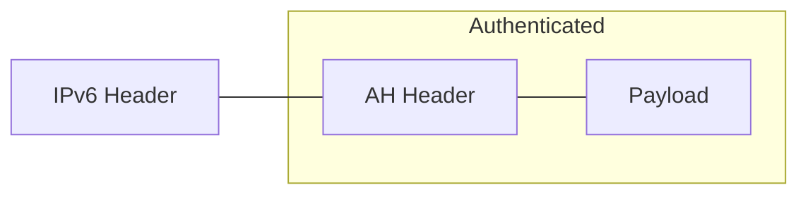
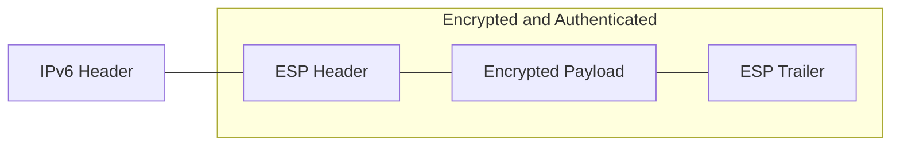
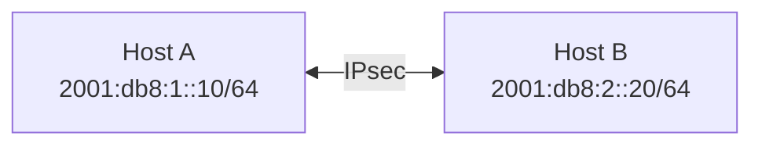

# How to Secure IPv6 with IPsec for Encrypted Communication

Author: [nawazdhandala](https://github.com/nawazdhandala)

Tags: IPv6, IPsec, Security, Encryption, Networking, Linux

Description: Learn how to implement IPsec with IPv6 to create secure, encrypted communication channels that protect your network traffic from eavesdropping and tampering.

---

## Introduction

As organizations increasingly adopt IPv6 to address the exhaustion of IPv4 addresses, securing network communications becomes paramount. Internet Protocol Security (IPsec) provides a robust framework for encrypting and authenticating network traffic at the IP layer. This guide explores how to implement IPsec with IPv6 to establish secure, encrypted communication channels.

IPsec was actually designed as a mandatory component of IPv6, unlike IPv4 where it was an optional add-on. This native integration makes IPv6 and IPsec a natural pairing for secure network communications.

## Understanding IPsec Architecture

IPsec operates at the network layer (Layer 3) and provides three main security services:

1. **Authentication**: Verifies the identity of communicating parties
2. **Integrity**: Ensures data has not been tampered with during transit
3. **Confidentiality**: Encrypts data to prevent unauthorized access

### IPsec Protocols

IPsec uses two main protocols:

#### Authentication Header (AH)

AH provides data integrity and authentication but does not encrypt the payload:



#### Encapsulating Security Payload (ESP)

ESP provides encryption, authentication, and integrity:



### IPsec Modes

IPsec operates in two modes:

1. **Transport Mode**: Encrypts only the payload, leaving the original IP header intact
2. **Tunnel Mode**: Encrypts the entire original IP packet and encapsulates it in a new IP packet

## Prerequisites

Before implementing IPsec with IPv6, ensure you have:

- Linux system with kernel 2.6 or later (IPv6 and IPsec support)
- Root or sudo access
- `strongSwan` or `Libreswan` installed
- Basic understanding of IPv6 addressing
- Two or more hosts for testing

### Installing Required Packages

**On Debian/Ubuntu:**

```bash
# Update package repositories
sudo apt update

# Install strongSwan for IPsec implementation
sudo apt install strongswan strongswan-pki libcharon-extra-plugins

# Install networking utilities
sudo apt install iproute2 iputils-ping net-tools

# Verify installation
ipsec version
```

**On RHEL/CentOS/Rocky Linux:**

```bash
# Install EPEL repository if needed
sudo dnf install epel-release

# Install Libreswan (preferred on RHEL-based systems)
sudo dnf install libreswan

# Enable and start the IPsec service
sudo systemctl enable ipsec
sudo systemctl start ipsec

# Verify installation
ipsec --version
```

**On Fedora:**

```bash
# Install Libreswan
sudo dnf install libreswan

# Initialize NSS database for certificate storage
sudo ipsec initnss

# Start IPsec service
sudo systemctl start ipsec
```

## Configuring IPv6 Networking

First, ensure IPv6 is properly configured on your systems.

### Verifying IPv6 Support

```bash
#!/bin/bash
# verify_ipv6.sh - Script to verify IPv6 configuration

# Check if IPv6 is enabled in the kernel
if [ -f /proc/net/if_inet6 ]; then
    echo "[OK] IPv6 is enabled in the kernel"
else
    echo "[ERROR] IPv6 is not enabled"
    exit 1
fi

# Display IPv6 addresses on all interfaces
echo -e "\n[INFO] IPv6 addresses on this system:"
ip -6 addr show | grep inet6

# Check IPv6 routing table
echo -e "\n[INFO] IPv6 routing table:"
ip -6 route show

# Test IPv6 connectivity to localhost
echo -e "\n[INFO] Testing IPv6 localhost connectivity:"
ping6 -c 3 ::1
```

### Assigning Static IPv6 Addresses

For a consistent IPsec configuration, use static IPv6 addresses.

**Using netplan (Ubuntu 18.04+):**

```yaml
# /etc/netplan/01-ipv6-config.yaml
# Static IPv6 configuration for IPsec endpoints

network:
  version: 2
  renderer: networkd
  ethernets:
    eth0:
      # IPv4 configuration (optional)
      dhcp4: true

      # IPv6 static configuration
      addresses:
        - "2001:db8:1::10/64"    # Primary IPv6 address
        - "fd00:1234:5678::1/64" # Unique Local Address (ULA)

      # IPv6 gateway
      gateway6: "2001:db8:1::1"

      # IPv6 DNS servers
      nameservers:
        addresses:
          - "2001:4860:4860::8888"  # Google IPv6 DNS
          - "2606:4700:4700::1111"  # Cloudflare IPv6 DNS

      # IPv6 routing
      routes:
        - to: "2001:db8:2::/64"
          via: "2001:db8:1::1"
```

Apply the configuration:

```bash
# Validate the configuration
sudo netplan try

# Apply the configuration permanently
sudo netplan apply

# Verify the new IPv6 addresses
ip -6 addr show eth0
```

**Using nmcli (NetworkManager):**

```bash
# Configure static IPv6 address using NetworkManager
# Replace 'eth0' with your actual interface name

# Add IPv6 address
sudo nmcli connection modify eth0 ipv6.addresses "2001:db8:1::10/64"

# Set IPv6 gateway
sudo nmcli connection modify eth0 ipv6.gateway "2001:db8:1::1"

# Configure IPv6 method to manual
sudo nmcli connection modify eth0 ipv6.method manual

# Add IPv6 DNS servers
sudo nmcli connection modify eth0 ipv6.dns "2001:4860:4860::8888,2606:4700:4700::1111"

# Restart the connection to apply changes
sudo nmcli connection down eth0 && sudo nmcli connection up eth0

# Verify the configuration
nmcli connection show eth0 | grep ipv6
```

## Setting Up IPsec with strongSwan

strongSwan is a popular, feature-rich IPsec implementation that works well with IPv6.

### Basic Configuration Structure

strongSwan uses the following configuration files:

- `/etc/ipsec.conf` - Main configuration file
- `/etc/ipsec.secrets` - Authentication credentials
- `/etc/swanctl/swanctl.conf` - Modern configuration format (swanctl)

### Host-to-Host IPsec Configuration

Let's configure a secure connection between two IPv6 hosts.

**Network Topology:**



#### Host A Configuration

**/etc/ipsec.conf on Host A:**

```conf
# /etc/ipsec.conf - strongSwan IPsec configuration for Host A
# This configuration establishes an encrypted tunnel to Host B

# Global configuration settings
config setup
    # Enable charon debug logging for troubleshooting
    charondebug="ike 2, knl 2, cfg 2, net 2, esp 2, dmn 2"

    # Unique IDs for connections (yes = allow multiple connections)
    uniqueids=yes

    # Strictly enforce cryptographic requirements
    strictcrlpolicy=no

# Connection definition for Host A to Host B
conn hostA-to-hostB
    # Connection type: host-to-host (transport mode)
    type=transport

    # Key exchange version (IKEv2 recommended for IPv6)
    keyexchange=ikev2

    # Local (Host A) settings
    left=2001:db8:1::10           # Local IPv6 address
    leftid=@hostA.example.com      # Local identity
    leftauth=psk                   # Pre-shared key authentication

    # Remote (Host B) settings
    right=2001:db8:2::20          # Remote IPv6 address
    rightid=@hostB.example.com     # Remote identity
    rightauth=psk                  # Pre-shared key authentication

    # IKE (Phase 1) proposal
    # AES-256 encryption, SHA-384 hash, DH group 20 (384-bit ECP)
    ike=aes256-sha384-ecp384!

    # ESP (Phase 2) proposal
    # AES-256-GCM for authenticated encryption
    esp=aes256gcm16-ecp384!

    # Connection behavior
    auto=start                     # Automatically start connection
    dpdaction=restart              # Restart on dead peer detection
    dpddelay=30s                   # DPD check interval
    dpdtimeout=120s                # DPD timeout before restart

    # Rekeying settings
    ikelifetime=24h                # IKE SA lifetime
    lifetime=8h                    # IPsec SA lifetime
    margintime=10m                 # Rekey margin time

    # Enable IPv6 transport selector
    leftprotoport=any              # Allow all protocols
    rightprotoport=any             # Allow all protocols
```

**/etc/ipsec.secrets on Host A:**

```conf
# /etc/ipsec.secrets - IPsec authentication credentials for Host A
# IMPORTANT: Protect this file with restricted permissions (chmod 600)

# Pre-shared key for Host A to Host B connection
# Format: <local_id> <remote_id> : PSK "<secret_key>"

@hostA.example.com @hostB.example.com : PSK "YourVeryStrongAndSecurePreSharedKey2024!#$"

# Alternative format using IPv6 addresses directly
# 2001:db8:1::10 2001:db8:2::20 : PSK "AlternativeSecretKey123!@#"
```

#### Host B Configuration

**/etc/ipsec.conf on Host B:**

```conf
# /etc/ipsec.conf - strongSwan IPsec configuration for Host B
# This configuration accepts encrypted connections from Host A

config setup
    charondebug="ike 2, knl 2, cfg 2, net 2, esp 2, dmn 2"
    uniqueids=yes
    strictcrlpolicy=no

conn hostB-to-hostA
    type=transport
    keyexchange=ikev2

    # Local (Host B) settings
    left=2001:db8:2::20           # Local IPv6 address
    leftid=@hostB.example.com      # Local identity
    leftauth=psk

    # Remote (Host A) settings
    right=2001:db8:1::10          # Remote IPv6 address
    rightid=@hostA.example.com     # Remote identity
    rightauth=psk

    # Matching cryptographic proposals
    ike=aes256-sha384-ecp384!
    esp=aes256gcm16-ecp384!

    auto=start
    dpdaction=restart
    dpddelay=30s
    dpdtimeout=120s

    ikelifetime=24h
    lifetime=8h
    margintime=10m

    leftprotoport=any
    rightprotoport=any
```

**/etc/ipsec.secrets on Host B:**

```conf
# /etc/ipsec.secrets - IPsec authentication credentials for Host B

@hostB.example.com @hostA.example.com : PSK "YourVeryStrongAndSecurePreSharedKey2024!#$"
```

### Starting and Verifying IPsec

```bash
#!/bin/bash
# start_ipsec.sh - Script to start and verify IPsec connection

# Ensure proper permissions on secrets file
sudo chmod 600 /etc/ipsec.secrets
sudo chown root:root /etc/ipsec.secrets

# Restart IPsec service to apply configuration
echo "[INFO] Restarting IPsec service..."
sudo ipsec restart

# Wait for service to initialize
sleep 3

# Check IPsec status
echo -e "\n[INFO] IPsec service status:"
sudo ipsec statusall

# Verify Security Associations (SAs)
echo -e "\n[INFO] Security Associations:"
sudo ip xfrm state

# Check IPsec policies
echo -e "\n[INFO] IPsec Policies:"
sudo ip xfrm policy

# Test connectivity (replace with actual remote IPv6)
echo -e "\n[INFO] Testing encrypted connectivity:"
ping6 -c 5 2001:db8:2::20
```

## Site-to-Site VPN with IPsec Tunnel Mode

For connecting entire networks, use tunnel mode to encrypt all traffic between sites.

### Network Topology
mermaid
flowchart LR
    subgraph SiteA["Site A"]
        NetA["Internal Net<br/>fd00:a::/64"]
        GwA["Gateway A<br/>2001:db8::1::1"]
        NetA --- GwA
    end

    subgraph SiteB["Site B"]
        GwB["Gateway B<br/>2001:db8::2::1"]
        NetB["Internal Net<br/>fd00:b::/64"]
        GwB --- NetB
    end

    GwA <-->|"IPsec Tunnel"| GwB
```

### Gateway A Configuration

**/etc/ipsec.conf on Gateway A:**

```conf
# /etc/ipsec.conf - Site-to-Site VPN configuration for Gateway A
# Tunnel mode configuration for network-to-network encryption

config setup
    charondebug="ike 2, knl 2, cfg 2, net 2, esp 2, dmn 2, mgr 2"
    uniqueids=yes

# Site-to-Site VPN connection
conn site-a-to-site-b
    # Tunnel mode for network-to-network traffic
    type=tunnel
    keyexchange=ikev2

    # Gateway A (local) settings
    left=2001:db8:1::1            # Public IPv6 of Gateway A
    leftid=@gateway-a.example.com
    leftauth=psk
    leftsubnet=fd00:a::/64        # Internal network at Site A

    # Gateway B (remote) settings
    right=2001:db8:2::1           # Public IPv6 of Gateway B
    rightid=@gateway-b.example.com
    rightauth=psk
    rightsubnet=fd00:b::/64       # Internal network at Site B

    # Strong cryptographic suite
    ike=aes256-sha512-modp4096,aes256-sha384-ecp384!
    esp=aes256gcm16-modp4096,aes256gcm16-ecp384!

    # Connection settings
    auto=start
    dpdaction=restart
    dpddelay=30s
    dpdtimeout=120s

    # Lifetime settings
    ikelifetime=24h
    lifetime=8h
    margintime=15m
    rekeyfuzz=100%

    # Compression (optional, for low-bandwidth links)
    compress=no

    # Forwarding settings
    leftfirewall=yes              # Install firewall rules automatically
    rightfirewall=yes
```

### Gateway B Configuration

**/etc/ipsec.conf on Gateway B:**

```conf
# /etc/ipsec.conf - Site-to-Site VPN configuration for Gateway B

config setup
    charondebug="ike 2, knl 2, cfg 2, net 2, esp 2, dmn 2, mgr 2"
    uniqueids=yes

conn site-b-to-site-a
    type=tunnel
    keyexchange=ikev2

    # Gateway B (local) settings
    left=2001:db8:2::1            # Public IPv6 of Gateway B
    leftid=@gateway-b.example.com
    leftauth=psk
    leftsubnet=fd00:b::/64        # Internal network at Site B

    # Gateway A (remote) settings
    right=2001:db8:1::1           # Public IPv6 of Gateway A
    rightid=@gateway-a.example.com
    rightauth=psk
    rightsubnet=fd00:a::/64       # Internal network at Site A

    ike=aes256-sha512-modp4096,aes256-sha384-ecp384!
    esp=aes256gcm16-modp4096,aes256gcm16-ecp384!

    auto=start
    dpdaction=restart
    dpddelay=30s
    dpdtimeout=120s

    ikelifetime=24h
    lifetime=8h
    margintime=15m
    rekeyfuzz=100%

    compress=no
    leftfirewall=yes
    rightfirewall=yes
```

### IPv6 Firewall Configuration

Configure ip6tables to allow IPsec traffic:

```bash
#!/bin/bash
# configure_ipsec_firewall.sh - Firewall rules for IPv6 IPsec

# Flush existing rules (use with caution in production)
# sudo ip6tables -F

# Allow IKE (UDP port 500) for key exchange
sudo ip6tables -A INPUT -p udp --dport 500 -j ACCEPT
sudo ip6tables -A OUTPUT -p udp --dport 500 -j ACCEPT

# Allow IKE NAT-Traversal (UDP port 4500)
sudo ip6tables -A INPUT -p udp --dport 4500 -j ACCEPT
sudo ip6tables -A OUTPUT -p udp --dport 4500 -j ACCEPT

# Allow ESP protocol (protocol number 50)
sudo ip6tables -A INPUT -p esp -j ACCEPT
sudo ip6tables -A OUTPUT -p esp -j ACCEPT

# Allow AH protocol (protocol number 51) if using AH
sudo ip6tables -A INPUT -p ah -j ACCEPT
sudo ip6tables -A OUTPUT -p ah -j ACCEPT

# Allow ICMPv6 for IPv6 functionality
sudo ip6tables -A INPUT -p icmpv6 -j ACCEPT
sudo ip6tables -A OUTPUT -p icmpv6 -j ACCEPT

# Allow forwarding for tunnel mode VPN
sudo ip6tables -A FORWARD -m policy --dir in --pol ipsec -j ACCEPT
sudo ip6tables -A FORWARD -m policy --dir out --pol ipsec -j ACCEPT

# Enable IPv6 forwarding
echo 1 | sudo tee /proc/sys/net/ipv6/conf/all/forwarding

# Make forwarding persistent
echo "net.ipv6.conf.all.forwarding = 1" | sudo tee -a /etc/sysctl.conf
sudo sysctl -p

# Save rules (Debian/Ubuntu)
sudo ip6tables-save | sudo tee /etc/iptables/rules.v6

# Display current rules
echo -e "\n[INFO] Current IPv6 firewall rules:"
sudo ip6tables -L -v -n
```

## Certificate-Based Authentication

For production environments, certificate-based authentication is more secure than pre-shared keys.

### Creating a Certificate Authority

```bash
#!/bin/bash
# create_ca.sh - Create a self-signed CA for IPsec authentication

# Create directory structure
sudo mkdir -p /etc/ipsec.d/{cacerts,certs,private,crls}
cd /etc/ipsec.d

# Generate CA private key (4096-bit RSA)
sudo ipsec pki --gen --type rsa --size 4096 \
    --outform pem > private/ca-key.pem

# Create self-signed CA certificate
sudo ipsec pki --self --ca --lifetime 3650 \
    --in private/ca-key.pem \
    --type rsa \
    --dn "CN=IPsec CA, O=Example Corp, C=US" \
    --outform pem > cacerts/ca-cert.pem

# Display CA certificate
echo "[INFO] CA Certificate created:"
sudo ipsec pki --print --in cacerts/ca-cert.pem
```

### Generating Host Certificates

```bash
#!/bin/bash
# generate_host_cert.sh - Generate certificate for IPsec host
# Usage: ./generate_host_cert.sh <hostname> <ipv6_address>

HOSTNAME=$1
IPV6_ADDR=$2

if [ -z "$HOSTNAME" ] || [ -z "$IPV6_ADDR" ]; then
    echo "Usage: $0 <hostname> <ipv6_address>"
    echo "Example: $0 gateway-a 2001:db8:1::1"
    exit 1
fi

cd /etc/ipsec.d

# Generate host private key
sudo ipsec pki --gen --type rsa --size 4096 \
    --outform pem > private/${HOSTNAME}-key.pem

# Create Certificate Signing Request (CSR)
sudo ipsec pki --pub --in private/${HOSTNAME}-key.pem \
    --type rsa | sudo ipsec pki --issue --lifetime 730 \
    --cacert cacerts/ca-cert.pem \
    --cakey private/ca-key.pem \
    --dn "CN=${HOSTNAME}.example.com, O=Example Corp, C=US" \
    --san @${HOSTNAME}.example.com \
    --san ${IPV6_ADDR} \
    --flag serverAuth --flag ikeIntermediate \
    --outform pem > certs/${HOSTNAME}-cert.pem

# Set proper permissions
sudo chmod 600 private/${HOSTNAME}-key.pem
sudo chmod 644 certs/${HOSTNAME}-cert.pem

# Display certificate
echo "[INFO] Host certificate created for ${HOSTNAME}:"
sudo ipsec pki --print --in certs/${HOSTNAME}-cert.pem
```

### Certificate-Based IPsec Configuration

**/etc/ipsec.conf with certificates:**

```conf
# /etc/ipsec.conf - Certificate-based authentication configuration

config setup
    charondebug="ike 2, knl 2, cfg 2, net 2, esp 2"
    uniqueids=yes
    strictcrlpolicy=yes           # Enforce CRL checking

conn cert-based-vpn
    type=tunnel
    keyexchange=ikev2

    # Local settings with certificate authentication
    left=2001:db8:1::1
    leftid=@gateway-a.example.com
    leftcert=gateway-a-cert.pem   # Certificate in /etc/ipsec.d/certs/
    leftauth=pubkey               # Public key (certificate) authentication
    leftsubnet=fd00:a::/64

    # Remote settings
    right=2001:db8:2::1
    rightid=@gateway-b.example.com
    rightcert=gateway-b-cert.pem
    rightauth=pubkey
    rightsubnet=fd00:b::/64

    # Strong cryptographic settings for certificate auth
    ike=aes256-sha512-ecp384,aes256-sha384-ecp384!
    esp=aes256gcm16-ecp384,aes256gcm16-sha384!

    auto=start
    dpdaction=restart
    dpddelay=30s

    ikelifetime=24h
    lifetime=8h
    margintime=15m
```

**/etc/ipsec.secrets with certificates:**

```conf
# /etc/ipsec.secrets - Private key reference for certificate authentication

# Reference the private key file
: RSA gateway-a-key.pem
```

## Modern swanctl Configuration

strongSwan 5.2+ supports the modern `swanctl` configuration format.

**/etc/swanctl/swanctl.conf:**

```conf
# /etc/swanctl/swanctl.conf - Modern strongSwan configuration
# This format provides more flexibility and clearer syntax

connections {
    # IPv6 Site-to-Site VPN connection
    ipv6-site-to-site {
        # IKE protocol version
        version = 2

        # Local endpoint configuration
        local_addrs = 2001:db8:1::1

        # Remote endpoint configuration
        remote_addrs = 2001:db8:2::1

        # IKE proposals (Phase 1)
        proposals = aes256-sha512-ecp384, aes256-sha384-modp4096

        # Rekey settings
        rekey_time = 24h

        # DPD settings
        dpd_delay = 30s

        # Local authentication
        local {
            auth = pubkey
            id = @gateway-a.example.com
            certs = gateway-a-cert.pem
        }

        # Remote authentication
        remote {
            auth = pubkey
            id = @gateway-b.example.com
        }

        # Child SA (IPsec SA) configuration
        children {
            site-traffic {
                # Local traffic selector (IPv6 subnet)
                local_ts = fd00:a::/64

                # Remote traffic selector
                remote_ts = fd00:b::/64

                # ESP proposals (Phase 2)
                esp_proposals = aes256gcm16-ecp384, aes256-sha512-ecp384

                # SA lifetime
                rekey_time = 8h

                # Start action
                start_action = start

                # DPD action
                dpd_action = restart

                # Mode: tunnel or transport
                mode = tunnel
            }
        }
    }

    # IPv6 Remote Access VPN (Roadwarrior)
    ipv6-remote-access {
        version = 2
        local_addrs = 2001:db8:1::1

        # Accept connections from any remote address
        remote_addrs = %any

        proposals = aes256-sha512-ecp384

        local {
            auth = pubkey
            id = @vpn.example.com
            certs = vpn-server-cert.pem
        }

        remote {
            auth = eap-mschapv2
            eap_id = %any
        }

        # Virtual IP pool for remote clients
        pools = ipv6_pool

        children {
            remote-access {
                local_ts = ::/0
                esp_proposals = aes256gcm16-ecp384
                rekey_time = 8h
                dpd_action = clear
            }
        }
    }
}

# IP address pools for remote access VPN
pools {
    ipv6_pool {
        # IPv6 address pool for clients
        addrs = fd00:vpn::/112

        # DNS servers for clients
        dns = 2001:4860:4860::8888, 2606:4700:4700::1111
    }
}

# Secrets (alternative to ipsec.secrets)
secrets {
    # EAP credentials for remote access users
    eap-user1 {
        id = user1@example.com
        secret = "UserSecurePassword123!"
    }

    eap-user2 {
        id = user2@example.com
        secret = "AnotherSecurePassword456!"
    }
}
```

Load the swanctl configuration:

```bash
# Load and start connections using swanctl
sudo swanctl --load-all

# Show active connections
sudo swanctl --list-conns

# Show active SAs
sudo swanctl --list-sas

# Initiate a connection manually
sudo swanctl --initiate --child site-traffic
```

## Monitoring and Troubleshooting

### IPsec Status Commands

```bash
#!/bin/bash
# ipsec_monitor.sh - Comprehensive IPsec monitoring script

echo "========================================="
echo "IPsec Status Report - $(date)"
echo "========================================="

# Check if IPsec service is running
echo -e "\n[1] IPsec Service Status:"
sudo systemctl status ipsec --no-pager | head -10

# Display all active connections
echo -e "\n[2] Active IPsec Connections:"
sudo ipsec statusall

# Show Security Associations (SAs)
echo -e "\n[3] IPsec Security Associations:"
sudo ip xfrm state

# Show IPsec policies
echo -e "\n[4] IPsec Policies:"
sudo ip xfrm policy

# Display SA statistics
echo -e "\n[5] SA Statistics:"
sudo ip -s xfrm state

# Show connection details (swanctl)
echo -e "\n[6] Connection Details (swanctl):"
sudo swanctl --list-sas 2>/dev/null || echo "swanctl not available"

# Check for errors in logs
echo -e "\n[7] Recent IPsec Errors (last 20 lines):"
sudo journalctl -u ipsec --since "1 hour ago" | grep -i "error\|failed\|timeout" | tail -20

# Network connectivity test
echo -e "\n[8] Network Interface Status:"
ip -6 addr show | grep -E "inet6|^[0-9]"
```

### Debugging IPsec Connections

```bash
#!/bin/bash
# debug_ipsec.sh - Enable debug logging and diagnose issues

# Enable verbose logging temporarily
echo "[INFO] Enabling debug logging..."
sudo ipsec stroke loglevel ike 4
sudo ipsec stroke loglevel cfg 4
sudo ipsec stroke loglevel net 4

# Restart specific connection for debugging
echo -e "\n[INFO] Restarting connection for debugging..."
sudo ipsec down hostA-to-hostB
sleep 2
sudo ipsec up hostA-to-hostB

# Capture debug output
echo -e "\n[INFO] Capturing debug logs..."
sudo journalctl -u ipsec -f --since "now" &
LOG_PID=$!

# Wait for user to observe
echo "Press Enter to stop capturing logs..."
read

# Stop log capture
kill $LOG_PID 2>/dev/null

# Reset logging to normal
echo -e "\n[INFO] Resetting log levels..."
sudo ipsec stroke loglevel ike 1
sudo ipsec stroke loglevel cfg 1
sudo ipsec stroke loglevel net 1
```

### Common Troubleshooting Scenarios

```bash
#!/bin/bash
# troubleshoot_ipsec.sh - Common IPsec troubleshooting steps

echo "IPsec Troubleshooting Guide"
echo "==========================="

# Check 1: Verify UDP ports are open
echo -e "\n[CHECK 1] Verifying IPsec ports..."
sudo ss -ulnp | grep -E "500|4500"
if [ $? -eq 0 ]; then
    echo "  [OK] IKE ports are listening"
else
    echo "  [ERROR] IKE ports not found - check ipsec service"
fi

# Check 2: Verify ESP protocol
echo -e "\n[CHECK 2] Checking for ESP traffic capability..."
if [ -f /proc/sys/net/ipv4/ip_forward ]; then
    echo "  IP forwarding enabled: $(cat /proc/sys/net/ipv6/conf/all/forwarding)"
fi

# Check 3: Verify firewall isn't blocking
echo -e "\n[CHECK 3] Checking firewall rules for IPsec..."
sudo ip6tables -L -n | grep -E "udp|esp|ah" | head -10

# Check 4: Verify routing
echo -e "\n[CHECK 4] IPv6 routing table..."
ip -6 route show | head -10

# Check 5: Test basic connectivity
echo -e "\n[CHECK 5] Testing basic IPv6 connectivity..."
REMOTE_IP="2001:db8:2::20"  # Replace with actual remote IP
ping6 -c 3 $REMOTE_IP 2>/dev/null
if [ $? -eq 0 ]; then
    echo "  [OK] Basic connectivity works"
else
    echo "  [WARN] Cannot reach remote - check network"
fi

# Check 6: Verify time synchronization (critical for certificates)
echo -e "\n[CHECK 6] Checking time synchronization..."
timedatectl status | grep -E "synchronized|NTP"

# Check 7: Certificate validity
echo -e "\n[CHECK 7] Checking certificate expiration..."
for cert in /etc/ipsec.d/certs/*.pem; do
    if [ -f "$cert" ]; then
        echo "  Certificate: $(basename $cert)"
        openssl x509 -in "$cert" -noout -dates 2>/dev/null
    fi
done
```

## Performance Optimization

### Kernel Parameters for IPsec

```bash
#!/bin/bash
# optimize_ipsec.sh - Kernel tuning for IPsec performance

# Create sysctl configuration for IPsec optimization
cat << 'EOF' | sudo tee /etc/sysctl.d/99-ipsec-optimization.conf
# IPv6 IPsec Performance Optimization

# Enable IPv6 forwarding (required for tunnel mode)
net.ipv6.conf.all.forwarding = 1
net.ipv6.conf.default.forwarding = 1

# Increase network buffer sizes for high-throughput IPsec
net.core.rmem_max = 16777216
net.core.wmem_max = 16777216
net.core.rmem_default = 1048576
net.core.wmem_default = 1048576

# Increase socket buffer sizes
net.core.netdev_max_backlog = 5000
net.core.netdev_budget = 600

# IPsec specific optimizations
# Increase maximum number of SAs
net.core.xfrm_acq_expires = 30
net.core.xfrm_aevent_rseqth = 2
net.core.xfrm_larval_drop = 1

# Disable IPv6 router advertisements if not needed
net.ipv6.conf.all.accept_ra = 0
net.ipv6.conf.default.accept_ra = 0

# Optimize connection tracking for VPN traffic
net.netfilter.nf_conntrack_max = 262144
net.netfilter.nf_conntrack_tcp_timeout_established = 86400

# Enable TCP optimizations for encrypted traffic
net.ipv4.tcp_fastopen = 3
net.core.default_qdisc = fq
net.ipv4.tcp_congestion_control = bbr
EOF

# Apply the settings
sudo sysctl -p /etc/sysctl.d/99-ipsec-optimization.conf

echo "[INFO] Kernel parameters optimized for IPsec"
```

### Hardware Acceleration

```bash
#!/bin/bash
# check_crypto_acceleration.sh - Verify hardware crypto acceleration

echo "Checking for cryptographic hardware acceleration..."

# Check for AES-NI support
echo -e "\n[1] AES-NI (Intel) Support:"
grep -q aes /proc/cpuinfo && echo "  [OK] AES-NI supported" || echo "  [NO] AES-NI not available"

# Check for ARM crypto extensions
echo -e "\n[2] ARM Crypto Extensions:"
grep -q "aes\|sha" /proc/cpuinfo && echo "  [OK] ARM crypto supported" || echo "  [NO] ARM crypto not available"

# List loaded crypto modules
echo -e "\n[3] Loaded Crypto Modules:"
lsmod | grep -E "aes|crypto|gcm|sha" | head -10

# Check cryptographic algorithms available
echo -e "\n[4] Available Crypto Algorithms:"
cat /proc/crypto | grep -E "^name" | sort -u | head -20

# Benchmark AES performance
echo -e "\n[5] AES Performance Test:"
if command -v openssl &> /dev/null; then
    openssl speed -evp aes-256-gcm 2>/dev/null | grep -E "^aes|bytes"
fi
```

## Best Practices Summary

### Security Recommendations

1. **Always use IKEv2** over IKEv1 for better security and performance
2. **Use certificate authentication** for production deployments
3. **Implement Perfect Forward Secrecy (PFS)** with strong DH groups (ECP-384 or higher)
4. **Use AES-GCM** for authenticated encryption (combines encryption and authentication)
5. **Enable Dead Peer Detection (DPD)** to detect connection failures
6. **Implement proper key rotation** with reasonable SA lifetimes
7. **Secure private keys** with strict file permissions (600)
8. **Use unique pre-shared keys** for each connection pair
9. **Enable CRL checking** for certificate-based authentication
10. **Regular security audits** of IPsec configuration

### Configuration Checklist

```markdown
## IPsec IPv6 Deployment Checklist

### Pre-Deployment
- [ ] IPv6 addressing planned and documented
- [ ] Network topology diagram created
- [ ] Firewall rules prepared
- [ ] Certificate infrastructure ready (if using certs)
- [ ] Time synchronization configured (NTP)

### Configuration
- [ ] strongSwan/Libreswan installed and updated
- [ ] Main configuration file created (/etc/ipsec.conf)
- [ ] Secrets file secured (/etc/ipsec.secrets)
- [ ] Cryptographic proposals defined (IKE and ESP)
- [ ] DPD settings configured
- [ ] SA lifetimes set appropriately

### Network
- [ ] IPv6 forwarding enabled
- [ ] Firewall allows UDP 500, 4500
- [ ] Firewall allows ESP protocol (50)
- [ ] Routes configured for tunnel mode

### Testing
- [ ] IPsec service starts without errors
- [ ] SA established successfully
- [ ] Traffic flows through encrypted tunnel
- [ ] DPD working correctly
- [ ] Rekeying occurs as expected

### Documentation
- [ ] Configuration documented
- [ ] Recovery procedures documented
- [ ] Contact information for support
```

## Summary Table

| Component | Recommended Setting | Description |
|-----------|---------------------|-------------|
| **IKE Version** | IKEv2 | More secure, efficient, and supports MOBIKE |
| **Encryption (IKE)** | AES-256-GCM | Strong authenticated encryption |
| **Hash (IKE)** | SHA-384 or SHA-512 | Strong integrity protection |
| **DH Group** | ECP-384 (Group 20) | Strong key exchange with elliptic curves |
| **Encryption (ESP)** | AES-256-GCM-16 | 256-bit AES with 128-bit authentication tag |
| **IKE Lifetime** | 24 hours | Balance between security and overhead |
| **IPsec SA Lifetime** | 8 hours | More frequent rekeying for data protection |
| **DPD Delay** | 30 seconds | Quick detection of peer failure |
| **Authentication** | Certificates (production) | Stronger than PSK, supports revocation |
| **Mode** | Tunnel (site-to-site) | Encrypts entire packets |
| **Mode** | Transport (host-to-host) | Lower overhead for direct connections |

## Conclusion

Implementing IPsec with IPv6 provides a robust security layer for network communications. The native integration of IPsec in IPv6 makes it an ideal solution for securing modern networks. Key takeaways include:

1. **Choose the right mode**: Use transport mode for host-to-host and tunnel mode for site-to-site connections
2. **Use modern cryptography**: Prefer AES-GCM, SHA-384+, and ECP curves
3. **Implement proper authentication**: Certificates for production, strong PSKs for testing
4. **Monitor actively**: Regular monitoring helps identify issues before they become problems
5. **Keep software updated**: Security vulnerabilities are regularly discovered and patched

By following this guide and implementing the configurations provided, you can establish secure, encrypted IPv6 communications that protect your data from eavesdropping and tampering.

## Additional Resources

- [strongSwan Documentation](https://docs.strongswan.org/)
- [RFC 4301 - Security Architecture for IP](https://tools.ietf.org/html/rfc4301)
- [RFC 4303 - IP Encapsulating Security Payload (ESP)](https://tools.ietf.org/html/rfc4303)
- [RFC 7296 - Internet Key Exchange Protocol Version 2 (IKEv2)](https://tools.ietf.org/html/rfc7296)
- [NIST Guidelines for IPsec VPNs](https://csrc.nist.gov/publications/detail/sp/800-77/rev-1/final)
