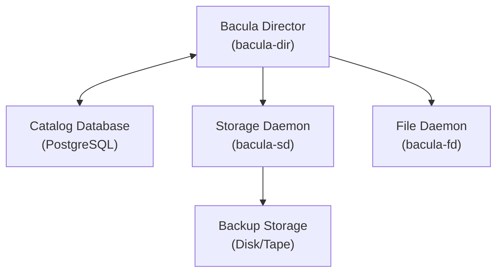

# How to Set Up Bacula Backup Server on Ubuntu

Author: [nawazdhandala](https://www.github.com/nawazdhandala)

Tags: Ubuntu, Bacula, Backup, Disaster Recovery, Enterprise, Tutorial

Description: Complete guide to setting up Bacula enterprise backup system on Ubuntu.

---

Bacula is a powerful, enterprise-grade open-source backup solution that enables system administrators to manage backup, recovery, and verification of computer data across a network of computers. In this comprehensive guide, we will walk through the complete process of setting up a Bacula backup server on Ubuntu, from understanding its architecture to configuring backups and restores.

## Table of Contents

1. [Understanding Bacula Architecture](#understanding-bacula-architecture)
2. [Prerequisites](#prerequisites)
3. [Installing Bacula Components](#installing-bacula-components)
4. [PostgreSQL Catalog Setup](#postgresql-catalog-setup)
5. [Director Configuration](#director-configuration)
6. [Storage Daemon Configuration](#storage-daemon-configuration)
7. [File Daemon (Client) Setup](#file-daemon-client-setup)
8. [Defining Backup Jobs](#defining-backup-jobs)
9. [Schedules and Pools](#schedules-and-pools)
10. [Running Backups Manually](#running-backups-manually)
11. [Restoring Files](#restoring-files)
12. [Bacula Console (bconsole)](#bacula-console-bconsole)
13. [Web Interface (Baculum)](#web-interface-baculum)
14. [Monitoring Backup Jobs](#monitoring-backup-jobs)
15. [Troubleshooting Common Issues](#troubleshooting-common-issues)

---

## Understanding Bacula Architecture

Bacula operates using a client-server model with several key components that work together to perform backup and restore operations:

### Core Components

**1. Bacula Director (bacula-dir)**
The Director is the central control program that supervises all backup, restore, verify, and archive operations. It schedules and controls all backup jobs and maintains a catalog database of all backed-up files.

**2. Storage Daemon (bacula-sd)**
The Storage Daemon performs the actual reading and writing of backup data to storage media. It manages tape drives, disk storage, or other backup media and handles data compression and encryption.

**3. File Daemon (bacula-fd)**
The File Daemon (also called the Bacula Client) runs on each machine to be backed up. It locates and provides files requested by the Director for backup and accepts files during restore operations.

**4. Catalog Database**
The Catalog maintains records of all files that have been backed up, including file attributes, job history, and volume information. Bacula supports PostgreSQL, MySQL/MariaDB, and SQLite as catalog databases.

**5. Bacula Console (bconsole)**
The Console is the administrator's interface to the Director. It allows you to start, stop, and monitor backup jobs, as well as perform restores.

### Architecture Diagram



### Communication Flow

1. The Director reads job definitions and schedules from its configuration
2. When a job runs, the Director contacts the appropriate File Daemon
3. The File Daemon sends file data to the Storage Daemon
4. The Storage Daemon writes data to the configured storage media
5. Metadata about backed-up files is stored in the Catalog database

---

## Prerequisites

Before installing Bacula, ensure your system meets the following requirements:

### System Requirements

- Ubuntu 22.04 LTS or 24.04 LTS (server edition recommended)
- Minimum 2 GB RAM (4 GB recommended for production)
- Adequate disk space for catalog database and backup storage
- Root or sudo access
- Network connectivity between all Bacula components

### Prepare Your System

```bash
# Update system packages
sudo apt update && sudo apt upgrade -y

# Install required dependencies
sudo apt install -y \
    build-essential \
    libreadline-dev \
    libssl-dev \
    zlib1g-dev \
    lsb-release \
    wget \
    curl \
    gnupg2

# Set the hostname (important for Bacula configuration)
sudo hostnamectl set-hostname bacula-server

# Add hostname to /etc/hosts
echo "127.0.1.1 bacula-server" | sudo tee -a /etc/hosts
```

### Firewall Configuration

```bash
# Allow Bacula ports through UFW firewall
# Director daemon port
sudo ufw allow 9101/tcp

# File daemon port
sudo ufw allow 9102/tcp

# Storage daemon port
sudo ufw allow 9103/tcp

# Reload firewall rules
sudo ufw reload

# Verify firewall status
sudo ufw status verbose
```

---

## Installing Bacula Components

### Install Bacula with PostgreSQL Support

```bash
# Install Bacula server components with PostgreSQL backend
sudo apt install -y \
    bacula-server \
    bacula-client \
    bacula-common \
    bacula-console \
    postgresql \
    postgresql-contrib

# Verify installation
bacula-dir -v
bacula-sd -v
bacula-fd -v
```

### Alternative: Install with MySQL/MariaDB Support

```bash
# If you prefer MySQL/MariaDB instead of PostgreSQL
sudo apt install -y \
    bacula-director-mysql \
    bacula-sd-mysql \
    bacula-client \
    bacula-console \
    mariadb-server \
    mariadb-client
```

### Verify Installed Services

```bash
# Check service status
sudo systemctl status bacula-director
sudo systemctl status bacula-sd
sudo systemctl status bacula-fd

# Enable services to start on boot
sudo systemctl enable bacula-director
sudo systemctl enable bacula-sd
sudo systemctl enable bacula-fd
```

---

## PostgreSQL Catalog Setup

The catalog database stores metadata about all backups. Here we configure PostgreSQL as the catalog backend.

### Initialize PostgreSQL

```bash
# Start PostgreSQL service
sudo systemctl start postgresql
sudo systemctl enable postgresql

# Verify PostgreSQL is running
sudo systemctl status postgresql
```

### Create Bacula Database and User

```bash
# Switch to postgres user
sudo -u postgres psql

# In PostgreSQL shell, execute:
```

```sql
-- Create the bacula database user
CREATE USER bacula WITH PASSWORD 'your_secure_password_here';

-- Create the bacula database
CREATE DATABASE bacula OWNER bacula;

-- Grant all privileges to bacula user
GRANT ALL PRIVILEGES ON DATABASE bacula TO bacula;

-- Exit PostgreSQL shell
\q
```

### Configure PostgreSQL Authentication

```bash
# Edit PostgreSQL authentication configuration
sudo nano /etc/postgresql/14/main/pg_hba.conf
```

Add the following line before other authentication rules:

```
# Bacula catalog database access
# TYPE  DATABASE        USER            ADDRESS                 METHOD
local   bacula          bacula                                  md5
host    bacula          bacula          127.0.0.1/32            md5
host    bacula          bacula          ::1/128                 md5
```

```bash
# Restart PostgreSQL to apply changes
sudo systemctl restart postgresql
```

### Initialize Bacula Tables

```bash
# Run Bacula database scripts to create required tables
# These scripts are provided with Bacula installation

# Navigate to Bacula scripts directory
cd /usr/share/bacula-director

# Create the Bacula tables (for PostgreSQL)
sudo -u postgres /usr/share/bacula-director/make_postgresql_tables

# Grant necessary privileges
sudo -u postgres /usr/share/bacula-director/grant_postgresql_privileges

# Verify tables were created
sudo -u postgres psql -d bacula -c "\dt"
```

### Configure Bacula to Use PostgreSQL

Edit the Director configuration to use the correct database credentials:

```bash
# Edit Director configuration
sudo nano /etc/bacula/bacula-dir.conf
```

Find and update the Catalog resource:

```
# Catalog Resource - Database connection settings
# This defines how the Director connects to the catalog database
Catalog {
  Name = MyCatalog

  # Database type and connection parameters
  dbdriver = "postgresql"
  dbname = "bacula"
  dbuser = "bacula"
  dbpassword = "your_secure_password_here"
  dbaddress = "127.0.0.1"
  dbport = "5432"
}
```

---

## Director Configuration

The Director is the heart of Bacula. Let's configure it properly with detailed explanations.

### Main Director Configuration

```bash
# Backup the original configuration
sudo cp /etc/bacula/bacula-dir.conf /etc/bacula/bacula-dir.conf.bak

# Edit the Director configuration
sudo nano /etc/bacula/bacula-dir.conf
```

Here is a comprehensive Director configuration:

```
#
# Bacula Director Configuration File
# /etc/bacula/bacula-dir.conf
#
# This is the main configuration file for the Bacula Director daemon.
# The Director controls all backup, restore, and verify operations.
#

# ==================================================================
# DIRECTOR RESOURCE
# ==================================================================
# Defines the Director daemon itself and its global settings
Director {
  # Unique name for this Director
  Name = bacula-dir

  # Directory ID for messages (used for enterprise features)
  DIRport = 9101

  # Query file containing pre-defined SQL queries
  QueryFile = "/etc/bacula/query.sql"

  # Working directory for temporary files
  WorkingDirectory = "/var/lib/bacula"

  # Process ID file location
  PidDirectory = "/run/bacula"

  # Maximum concurrent jobs the Director can run
  Maximum Concurrent Jobs = 10

  # Password for Console connections
  # IMPORTANT: Change this to a secure password!
  Password = "director_console_password_change_me"

  # Messages resource to use for daemon messages
  Messages = Daemon

  # Enable TLS for secure communication (recommended for production)
  # TLS Enable = yes
  # TLS Require = yes
  # TLS Verify Peer = no
  # TLS Certificate = /etc/bacula/tls/bacula-dir.pem
  # TLS Key = /etc/bacula/tls/bacula-dir.key
  # TLS CA Certificate File = /etc/bacula/tls/ca.pem
}

# ==================================================================
# JOB DEFINITIONS
# ==================================================================
# JobDefs provides default settings that can be inherited by Job resources

# Default job settings template
# Jobs can inherit from this to avoid repetition
JobDefs {
  Name = "DefaultJob"

  # Type: Backup, Restore, Verify, Admin
  Type = Backup

  # Backup level: Full, Incremental, Differential
  Level = Incremental

  # Client to backup (File Daemon)
  Client = bacula-fd

  # FileSet defines which files to backup
  FileSet = "Full Set"

  # Schedule defines when to run
  Schedule = "WeeklyCycle"

  # Storage device to use
  Storage = File1

  # Messages resource for job messages
  Messages = Standard

  # Pool for storing backup volumes
  Pool = File

  # Pool for Incremental backups (more efficient)
  Incremental Backup Pool = File-Incremental

  # Pool for Differential backups
  Differential Backup Pool = File-Differential

  # Pool for Full backups
  Full Backup Pool = File-Full

  # Job priority (1=highest priority, 10=lowest)
  Priority = 10

  # Write bootstrap file for disaster recovery
  Write Bootstrap = "/var/lib/bacula/%c.bsr"

  # Maximum run time before job is killed
  # Max Run Time = 24 hours

  # Spooling improves performance by writing to local disk first
  SpoolData = yes
}

# ==================================================================
# BACKUP JOBS
# ==================================================================

# Backup job for the local Bacula server
Job {
  Name = "BackupLocalServer"

  # Inherit defaults from JobDefs
  JobDefs = "DefaultJob"

  # Override client for this job
  Client = bacula-fd

  # Use server-specific fileset
  FileSet = "Server FileSet"

  # Write bootstrap for this specific job
  Write Bootstrap = "/var/lib/bacula/BackupLocalServer.bsr"
}

# Example: Backup job for a web server
Job {
  Name = "BackupWebServer"
  JobDefs = "DefaultJob"
  Client = webserver-fd
  FileSet = "WebServer FileSet"
  Write Bootstrap = "/var/lib/bacula/BackupWebServer.bsr"
}

# Example: Backup job for a database server
Job {
  Name = "BackupDatabaseServer"
  JobDefs = "DefaultJob"
  Client = dbserver-fd
  FileSet = "Database FileSet"
  Write Bootstrap = "/var/lib/bacula/BackupDatabaseServer.bsr"

  # Run pre-backup script to dump databases
  # ClientRunBeforeJob = "/usr/local/bin/backup_mysql.sh"
}

# Catalog backup job - IMPORTANT for disaster recovery
# This backs up the Bacula catalog database itself
Job {
  Name = "BackupCatalog"
  JobDefs = "DefaultJob"
  Level = Full
  FileSet = "Catalog"
  Schedule = "WeeklyCycleAfterBackup"

  # Run special script before backing up catalog
  RunBeforeJob = "/etc/bacula/scripts/make_catalog_backup.pl MyCatalog"

  # Run cleanup script after backup
  RunAfterJob = "/etc/bacula/scripts/delete_catalog_backup"

  Write Bootstrap = "/var/lib/bacula/BackupCatalog.bsr"
  Priority = 11  # Run after other jobs
}

# Standard Restore Job template
Job {
  Name = "RestoreFiles"
  Type = Restore
  Client = bacula-fd
  Storage = File1
  FileSet = "Full Set"
  Pool = File
  Messages = Standard

  # Where to restore files (default: original location)
  # Use /tmp/bacula-restores for testing
  Where = /tmp/bacula-restores
}

# ==================================================================
# FILESET DEFINITIONS
# ==================================================================
# FileSets define which files and directories to include/exclude in backups

# Full system backup FileSet
FileSet {
  Name = "Full Set"

  # Include section - files/directories to backup
  Include {
    # Options apply to all files in this Include block
    Options {
      # Calculate and store file signatures for verification
      signature = MD5

      # Enable file compression (gzip level 6)
      compression = GZIP

      # Alternative: LZO compression (faster, less compression)
      # compression = LZO

      # One filesystem - don't cross mount points
      onefs = no

      # Don't backup Windows-style ACLs
      noatime = yes

      # Preserve file permissions and ownership
      portable = no
    }

    # Directories and files to backup
    File = /
    File = /home
    File = /etc
    File = /var
    File = /opt
    File = /usr/local
  }

  # Exclude section - files/directories to skip
  Exclude {
    # Temporary and cache directories
    File = /tmp
    File = /var/tmp
    File = /var/cache

    # Pseudo filesystems
    File = /proc
    File = /sys
    File = /dev
    File = /run

    # Bacula's own working directory (avoid loops)
    File = /var/lib/bacula

    # Large/unnecessary files
    File = /var/log
    File = /swap
    File = /.snapshots

    # Package manager caches
    File = /var/cache/apt
    File = /var/cache/yum
  }
}

# Server-specific FileSet
FileSet {
  Name = "Server FileSet"
  Include {
    Options {
      signature = MD5
      compression = GZIP
    }
    # System configuration
    File = /etc

    # User data
    File = /home

    # Local applications
    File = /opt
    File = /usr/local

    # Variable data (logs, databases, etc.)
    File = /var/www
    File = /var/lib/mysql
    File = /var/lib/postgresql
  }
  Exclude {
    File = /var/cache
    File = /tmp
  }
}

# WebServer FileSet - customize for web servers
FileSet {
  Name = "WebServer FileSet"
  Include {
    Options {
      signature = SHA1
      compression = GZIP
    }
    # Web content
    File = /var/www

    # Web server configuration
    File = /etc/nginx
    File = /etc/apache2

    # SSL certificates
    File = /etc/letsencrypt

    # Application configuration
    File = /etc/php
  }
  Exclude {
    # Exclude cache and temporary files
    File = /var/www/*/cache
    File = /var/www/*/tmp
    File = /var/www/*/log
  }
}

# Database FileSet - for database servers
FileSet {
  Name = "Database FileSet"
  Include {
    Options {
      signature = SHA256
      compression = GZIP
    }
    # Database dumps (created by pre-backup script)
    File = /var/backups/mysql
    File = /var/backups/postgresql

    # Database configuration
    File = /etc/mysql
    File = /etc/postgresql
  }
}

# Catalog FileSet - for backing up Bacula's catalog
FileSet {
  Name = "Catalog"
  Include {
    Options {
      signature = MD5
    }
    # Catalog dump created by make_catalog_backup.pl
    File = /var/lib/bacula/bacula.sql
  }
}

# ==================================================================
# CLIENT (FILE DAEMON) DEFINITIONS
# ==================================================================
# Define the clients (machines) that will be backed up

# Local Bacula server client
Client {
  Name = bacula-fd
  Address = localhost
  FDPort = 9102
  Catalog = MyCatalog

  # Password must match the one in bacula-fd.conf
  Password = "client_password_change_me"

  # File retention - how long to keep file records in catalog
  File Retention = 60 days

  # Job retention - how long to keep job records
  Job Retention = 6 months

  # Automatically prune expired records
  AutoPrune = yes
}

# Example: Remote web server client
# Uncomment and modify for your environment
#Client {
#  Name = webserver-fd
#  Address = webserver.example.com
#  FDPort = 9102
#  Catalog = MyCatalog
#  Password = "webserver_password_change_me"
#  File Retention = 60 days
#  Job Retention = 6 months
#  AutoPrune = yes
#}

# Example: Remote database server client
#Client {
#  Name = dbserver-fd
#  Address = dbserver.example.com
#  FDPort = 9102
#  Catalog = MyCatalog
#  Password = "dbserver_password_change_me"
#  File Retention = 90 days
#  Job Retention = 12 months
#  AutoPrune = yes
#}

# ==================================================================
# STORAGE DEFINITIONS
# ==================================================================
# Define where backup data will be stored

Storage {
  Name = File1

  # Address of the Storage Daemon
  Address = localhost

  # Storage Daemon port
  SDPort = 9103

  # Password must match bacula-sd.conf
  Password = "storage_password_change_me"

  # Device name (must match Device in bacula-sd.conf)
  Device = FileChgr1-Dev1

  # Media type (must match bacula-sd.conf)
  Media Type = File1

  # Maximum concurrent jobs for this storage
  Maximum Concurrent Jobs = 10
}

# Example: Tape storage (for enterprise environments)
#Storage {
#  Name = Tape1
#  Address = tape-server.example.com
#  SDPort = 9103
#  Password = "tape_storage_password"
#  Device = LTO-6
#  Media Type = LTO-6
#  Autochanger = yes
#}

# ==================================================================
# CATALOG DEFINITION
# ==================================================================
# Database connection for storing backup metadata

Catalog {
  Name = MyCatalog
  dbdriver = "postgresql"
  dbname = "bacula"
  dbuser = "bacula"
  dbpassword = "your_secure_password_here"
  dbaddress = "127.0.0.1"
  dbport = "5432"
}

# ==================================================================
# SCHEDULE DEFINITIONS
# ==================================================================
# Define when backup jobs should run

# Weekly backup cycle
Schedule {
  Name = "WeeklyCycle"

  # Full backup on first Sunday of each month at 23:05
  Run = Full 1st sun at 23:05

  # Differential backup on 2nd-5th Sundays at 23:05
  Run = Differential 2nd-5th sun at 23:05

  # Incremental backup Monday through Saturday at 23:05
  Run = Incremental mon-sat at 23:05
}

# Daily backup cycle
Schedule {
  Name = "DailyCycle"

  # Full backup every Sunday at 01:00
  Run = Full sun at 01:00

  # Incremental backup Monday through Saturday at 01:00
  Run = Incremental mon-sat at 01:00
}

# Catalog backup schedule - runs after main backups
Schedule {
  Name = "WeeklyCycleAfterBackup"

  # Run full backup every Sunday at 23:30 (after regular backups)
  Run = Full sun at 23:30
}

# Hourly backup for critical data
Schedule {
  Name = "HourlyCycle"

  # Full backup daily at 00:00
  Run = Full daily at 00:00

  # Incremental every hour
  Run = Incremental hourly at 0:30
}

# Monthly backup cycle
Schedule {
  Name = "MonthlyCycle"

  # Full backup on first day of month
  Run = Full 1st at 02:00

  # Incremental other days
  Run = Incremental 2nd-31 at 02:00
}

# ==================================================================
# POOL DEFINITIONS
# ==================================================================
# Pools manage groups of volumes (storage media)

# Default pool
Pool {
  Name = Default
  Pool Type = Backup

  # Automatically recycle used volumes
  Recycle = yes

  # Automatically prune expired volumes
  AutoPrune = yes

  # Volume retention period
  Volume Retention = 365 days

  # Maximum volume size (0 = unlimited)
  Maximum Volume Bytes = 50G

  # Maximum volumes in this pool (0 = unlimited)
  Maximum Volumes = 100

  # Label format for auto-created volumes
  Label Format = "Default-"
}

# General file-based backup pool
Pool {
  Name = File
  Pool Type = Backup
  Recycle = yes
  AutoPrune = yes
  Volume Retention = 365 days
  Maximum Volume Bytes = 50G
  Maximum Volumes = 100
  Label Format = "File-"
}

# Pool for Full backups
Pool {
  Name = File-Full
  Pool Type = Backup
  Recycle = yes
  AutoPrune = yes

  # Keep full backups longer
  Volume Retention = 365 days
  Maximum Volume Bytes = 50G
  Maximum Volumes = 50
  Label Format = "Full-"

  # Storage location for this pool
  Storage = File1
}

# Pool for Differential backups
Pool {
  Name = File-Differential
  Pool Type = Backup
  Recycle = yes
  AutoPrune = yes

  # Keep differential backups for medium duration
  Volume Retention = 60 days
  Maximum Volume Bytes = 50G
  Maximum Volumes = 30
  Label Format = "Diff-"
  Storage = File1
}

# Pool for Incremental backups
Pool {
  Name = File-Incremental
  Pool Type = Backup
  Recycle = yes
  AutoPrune = yes

  # Incremental backups can be recycled faster
  Volume Retention = 30 days
  Maximum Volume Bytes = 50G
  Maximum Volumes = 60
  Label Format = "Inc-"
  Storage = File1
}

# Scratch pool for temporary/emergency use
Pool {
  Name = Scratch
  Pool Type = Backup
}

# ==================================================================
# MESSAGES DEFINITIONS
# ==================================================================
# Define how and where to send messages about job status

# Standard messages for jobs
Messages {
  Name = Standard

  # Send important messages to director
  mailcommand = "/usr/sbin/bsmtp -h localhost -f \"\(Bacula\) \<%r\>\" -s \"Bacula: %t %e of %c %l\" %r"
  operatorcommand = "/usr/sbin/bsmtp -h localhost -f \"\(Bacula\) \<%r\>\" -s \"Bacula: Intervention needed for %j\" %r"

  # Email notifications - change to your email
  mail = root@localhost = all, !skipped
  operator = root@localhost = mount

  # Log to console
  console = all, !skipped, !saved

  # Append to log file
  append = "/var/log/bacula/bacula.log" = all, !skipped

  # Catalog storage for messages
  catalog = all
}

# Daemon messages
Messages {
  Name = Daemon
  mailcommand = "/usr/sbin/bsmtp -h localhost -f \"\(Bacula\) \<%r\>\" -s \"Bacula daemon message\" %r"
  mail = root@localhost = all, !skipped
  console = all, !skipped, !saved
  append = "/var/log/bacula/bacula.log" = all, !skipped
}

# ==================================================================
# CONSOLE DEFINITIONS
# ==================================================================
# Define console access permissions

# Restricted console for operators
Console {
  Name = bacula-mon
  Password = "monitor_password_change_me"
  CommandACL = status, .status
}
```

### Verify Director Configuration

```bash
# Test the Director configuration syntax
sudo bacula-dir -t -c /etc/bacula/bacula-dir.conf

# If there are no errors, restart the Director
sudo systemctl restart bacula-director

# Check Director status
sudo systemctl status bacula-director

# View Director logs for any issues
sudo tail -f /var/log/bacula/bacula.log
```

---

## Storage Daemon Configuration

The Storage Daemon manages the actual backup storage media.

### Configure Storage Daemon

```bash
# Backup original configuration
sudo cp /etc/bacula/bacula-sd.conf /etc/bacula/bacula-sd.conf.bak

# Edit Storage Daemon configuration
sudo nano /etc/bacula/bacula-sd.conf
```

Here is a comprehensive Storage Daemon configuration:

```
#
# Bacula Storage Daemon Configuration File
# /etc/bacula/bacula-sd.conf
#
# The Storage Daemon handles reading/writing backup data to storage media.
#

# ==================================================================
# STORAGE DAEMON RESOURCE
# ==================================================================
Storage {
  # Name must match the Storage resource in bacula-dir.conf
  Name = bacula-sd

  # Port to listen on for connections
  SDPort = 9103

  # Working directory for temporary files
  WorkingDirectory = "/var/lib/bacula"

  # PID file location
  Pid Directory = "/run/bacula"

  # Plugin directory
  Plugin Directory = "/usr/lib/bacula"

  # Maximum concurrent jobs this Storage Daemon can handle
  Maximum Concurrent Jobs = 20

  # Enable TLS for secure communication (recommended)
  # TLS Enable = yes
  # TLS Require = yes
  # TLS Certificate = /etc/bacula/tls/bacula-sd.pem
  # TLS Key = /etc/bacula/tls/bacula-sd.key
  # TLS CA Certificate File = /etc/bacula/tls/ca.pem
}

# ==================================================================
# DIRECTOR AUTHORIZATION
# ==================================================================
# Define which Directors can connect to this Storage Daemon

Director {
  # Name of the Director (must match Director name in bacula-dir.conf)
  Name = bacula-dir

  # Password for Director authentication
  # MUST match the Password in Storage resource of bacula-dir.conf
  Password = "storage_password_change_me"
}

# Read-only access for monitoring
Director {
  Name = bacula-mon
  Password = "monitor_password_change_me"
  Monitor = yes
}

# ==================================================================
# AUTOCHANGER RESOURCE (Virtual)
# ==================================================================
# Autochanger allows multiple volumes to be managed automatically

Autochanger {
  Name = FileChgr1

  # Devices in this autochanger
  Device = FileChgr1-Dev1
  Device = FileChgr1-Dev2

  # Changer command (for virtual changer, use empty)
  Changer Command = ""

  # Changer device (not needed for file-based storage)
  Changer Device = /dev/null
}

# ==================================================================
# DEVICE DEFINITIONS
# ==================================================================
# Devices define the actual storage media

# Primary file-based storage device
Device {
  # Device name - must match Device in Storage resource of bacula-dir.conf
  Name = FileChgr1-Dev1

  # Media type - must match Media Type in Storage resource
  Media Type = File1

  # Archive device - directory where volumes are stored
  # IMPORTANT: Create this directory with proper permissions
  Archive Device = /var/lib/bacula/storage

  # This is a removable media device (no for disk storage)
  Removable Media = no

  # Device supports random access (yes for disk)
  Random Access = yes

  # Automatically mount the device
  AutomaticMount = yes

  # Device is always open (for disk devices)
  AlwaysOpen = no

  # Label media - allow Bacula to write labels
  Label Media = yes

  # Maximum concurrent jobs for this device
  Maximum Concurrent Jobs = 5

  # Maximum volume size for file devices
  Maximum File Size = 5G

  # Maximum spool size (for spooling data before writing)
  Maximum Spool Size = 2G

  # Spool directory
  Spool Directory = /var/lib/bacula/spool
}

# Secondary file-based storage device
Device {
  Name = FileChgr1-Dev2
  Media Type = File1
  Archive Device = /var/lib/bacula/storage
  Removable Media = no
  Random Access = yes
  AutomaticMount = yes
  AlwaysOpen = no
  Label Media = yes
  Maximum Concurrent Jobs = 5
}

# Example: Tape device configuration (for LTO drives)
#Device {
#  Name = LTO-6
#  Media Type = LTO-6
#  Archive Device = /dev/nst0
#
#  # Tape-specific options
#  AutomaticMount = yes
#  AlwaysOpen = no
#  Removable Media = yes
#  Random Access = no
#
#  # Hardware end of medium handling
#  Hardware End of Medium = no
#
#  # Fast forward to end of data
#  Fast Forward Space File = no
#
#  # BSF at EOM (for some tape drives)
#  BSF at EOM = yes
#
#  # Two EOFs at end of tape
#  Two EOF = no
#
#  # Backward space record
#  Backward Space Record = no
#
#  # Backward space file
#  Backward Space File = no
#
#  # Maximum file size on tape (0 = unlimited)
#  Maximum File Size = 5G
#
#  # Block size (usually 64K for LTO)
#  Maximum Block Size = 131072
#  Minimum Block Size = 131072
#
#  # Alert command for tape alerts
#  Alert Command = "sh -c 'tapeinfo -f %c | grep TapeAlert'"
#}

# ==================================================================
# MESSAGES DEFINITION
# ==================================================================
Messages {
  Name = Standard
  director = bacula-dir = all
}
```

### Create Storage Directories

```bash
# Create the storage directory
sudo mkdir -p /var/lib/bacula/storage
sudo mkdir -p /var/lib/bacula/spool

# Set proper ownership
sudo chown -R bacula:bacula /var/lib/bacula/storage
sudo chown -R bacula:bacula /var/lib/bacula/spool

# Set proper permissions
sudo chmod 750 /var/lib/bacula/storage
sudo chmod 750 /var/lib/bacula/spool
```

### Verify Storage Daemon Configuration

```bash
# Test configuration syntax
sudo bacula-sd -t -c /etc/bacula/bacula-sd.conf

# Restart Storage Daemon
sudo systemctl restart bacula-sd

# Check status
sudo systemctl status bacula-sd
```

---

## File Daemon (Client) Setup

The File Daemon runs on each machine to be backed up.

### Configure Local File Daemon

```bash
# Backup original configuration
sudo cp /etc/bacula/bacula-fd.conf /etc/bacula/bacula-fd.conf.bak

# Edit File Daemon configuration
sudo nano /etc/bacula/bacula-fd.conf
```

Complete File Daemon configuration:

```
#
# Bacula File Daemon Configuration File
# /etc/bacula/bacula-fd.conf
#
# The File Daemon runs on each client machine to be backed up.
# It provides files to the Storage Daemon during backup and
# receives files during restore operations.
#

# ==================================================================
# FILE DAEMON RESOURCE
# ==================================================================
FileDaemon {
  # Name of this File Daemon (must match Client name in bacula-dir.conf)
  Name = bacula-fd

  # Port to listen on for Director connections
  FDport = 9102

  # Working directory for temporary files
  WorkingDirectory = /var/lib/bacula

  # PID file location
  Pid Directory = /run/bacula

  # Maximum concurrent jobs this client can run
  Maximum Concurrent Jobs = 20

  # Plugin directory for File Daemon plugins
  Plugin Directory = /usr/lib/bacula

  # Compatibility mode for older versions
  # Compatible = no

  # Enable TLS for secure communication
  # TLS Enable = yes
  # TLS Require = yes
  # TLS Certificate = /etc/bacula/tls/bacula-fd.pem
  # TLS Key = /etc/bacula/tls/bacula-fd.key
  # TLS CA Certificate File = /etc/bacula/tls/ca.pem

  # Heartbeat interval to keep connection alive through firewalls
  # Heartbeat Interval = 60

  # Maximum bandwidth for backup/restore operations (useful for WAN)
  # Maximum Bandwidth Per Job = 10m/s
}

# ==================================================================
# DIRECTOR AUTHORIZATION
# ==================================================================
# Define which Directors can connect to this File Daemon

Director {
  # Name of the Director allowed to connect
  # MUST match the Director name in bacula-dir.conf
  Name = bacula-dir

  # Password for authentication
  # MUST match the Password in Client resource of bacula-dir.conf
  Password = "client_password_change_me"
}

# Read-only access for monitoring
Director {
  Name = bacula-mon
  Password = "monitor_password_change_me"
  Monitor = yes
}

# ==================================================================
# MESSAGES DEFINITION
# ==================================================================
Messages {
  Name = Standard

  # Send all messages to the Director
  director = bacula-dir = all, !skipped, !restored
}
```

### Verify File Daemon Configuration

```bash
# Test configuration syntax
sudo bacula-fd -t -c /etc/bacula/bacula-fd.conf

# Restart File Daemon
sudo systemctl restart bacula-fd

# Check status
sudo systemctl status bacula-fd
```

### Install File Daemon on Remote Clients

For each client machine you want to backup:

```bash
# On the remote client machine:

# Install Bacula File Daemon
sudo apt update
sudo apt install -y bacula-client bacula-common

# Edit configuration
sudo nano /etc/bacula/bacula-fd.conf
```

Update the remote client's configuration:

```
FileDaemon {
  # Use unique name for each client (e.g., webserver-fd)
  Name = webserver-fd
  FDport = 9102
  WorkingDirectory = /var/lib/bacula
  Pid Directory = /run/bacula
  Maximum Concurrent Jobs = 20
}

Director {
  # Name of your Bacula Director
  Name = bacula-dir

  # Password (must match Client resource in bacula-dir.conf)
  Password = "webserver_password_change_me"
}

Director {
  Name = bacula-mon
  Password = "monitor_password_change_me"
  Monitor = yes
}

Messages {
  Name = Standard
  director = bacula-dir = all, !skipped, !restored
}
```

```bash
# On the remote client:
sudo systemctl restart bacula-fd
sudo systemctl enable bacula-fd

# Open firewall port
sudo ufw allow 9102/tcp
```

---

## Defining Backup Jobs

Now let's create practical backup job configurations.

### Example: Complete Server Backup Job

```
# Full server backup job
Job {
  Name = "FullServerBackup"
  Type = Backup
  Level = Full
  Client = bacula-fd
  FileSet = "Server FileSet"
  Schedule = "WeeklyCycle"
  Storage = File1
  Pool = File-Full
  Messages = Standard
  Priority = 10

  # Bootstrap file for disaster recovery
  Write Bootstrap = "/var/lib/bacula/%n.bsr"

  # Maximum run time (24 hours)
  Max Run Time = 86400

  # Allow re-running if job fails
  Allow Duplicate Jobs = no

  # Cancel lower priority jobs if needed
  Cancel Lower Level Duplicates = yes

  # Reschedule on failure
  Reschedule On Error = yes
  Reschedule Interval = 1 hour
  Reschedule Times = 3
}
```

### Example: Database Backup with Pre-Scripts

```
# MySQL database backup job
Job {
  Name = "MySQLDatabaseBackup"
  Type = Backup
  Level = Full
  Client = dbserver-fd
  FileSet = "MySQL Dump"
  Schedule = "DailyCycle"
  Storage = File1
  Pool = File-Full
  Messages = Standard
  Priority = 5

  # Run MySQL dump before backup
  ClientRunBeforeJob = "/usr/local/bin/mysql_backup.sh"

  # Cleanup after backup
  ClientRunAfterJob = "/usr/local/bin/mysql_cleanup.sh"

  Write Bootstrap = "/var/lib/bacula/%n.bsr"
}

# FileSet for MySQL dumps
FileSet {
  Name = "MySQL Dump"
  Include {
    Options {
      signature = SHA256
      compression = GZIP
    }
    # Directory containing MySQL dumps
    File = /var/backups/mysql
  }
}
```

Create the MySQL backup script:

```bash
sudo nano /usr/local/bin/mysql_backup.sh
```

```bash
#!/bin/bash
#
# MySQL backup script for Bacula
# This script creates MySQL dumps before Bacula backup runs
#

# Configuration
BACKUP_DIR="/var/backups/mysql"
MYSQL_USER="backup_user"
MYSQL_PASS="backup_password"
DATE=$(date +%Y%m%d_%H%M%S)

# Create backup directory if it doesn't exist
mkdir -p ${BACKUP_DIR}

# Remove old backups (keep last 2 days)
find ${BACKUP_DIR} -name "*.sql.gz" -mtime +2 -delete

# Dump all databases
mysqldump --user=${MYSQL_USER} --password=${MYSQL_PASS} \
    --all-databases --single-transaction --routines \
    --triggers --events | gzip > ${BACKUP_DIR}/all_databases_${DATE}.sql.gz

# Check if dump was successful
if [ $? -eq 0 ]; then
    echo "MySQL dump completed successfully"
    exit 0
else
    echo "MySQL dump failed"
    exit 1
fi
```

```bash
# Make script executable
sudo chmod +x /usr/local/bin/mysql_backup.sh
```

### Example: Incremental Backup Configuration

```
# Incremental backup job for frequently changing data
Job {
  Name = "IncrementalDataBackup"
  JobDefs = "DefaultJob"
  Level = Incremental
  Client = bacula-fd
  FileSet = "Changing Data"
  Schedule = "HourlyCycle"
  Pool = File-Incremental

  # Accurate mode ensures correct incremental backups
  Accurate = yes

  # Spool data for better performance
  SpoolData = yes
  SpoolSize = 1G
}

# FileSet for frequently changing data
FileSet {
  Name = "Changing Data"
  Include {
    Options {
      signature = MD5
      compression = LZO

      # Accurate mode options
      verify = pins5
      accurate = yes
    }
    File = /var/www
    File = /home
    File = /var/lib/docker/volumes
  }
  Exclude {
    File = /var/www/*/cache
    File = /var/www/*/temp
    File = /home/*/.cache
  }
}
```

---

## Schedules and Pools

### Advanced Schedule Examples

```
# Grandfather-Father-Son (GFS) rotation schedule
Schedule {
  Name = "GFS-Schedule"

  # Monthly full backup (grandfather) - first Sunday
  Run = Full Pool=Monthly-Full 1st sun at 02:00

  # Weekly full backup (father) - other Sundays
  Run = Full Pool=Weekly-Full 2nd-5th sun at 02:00

  # Daily incremental (son) - weekdays
  Run = Incremental Pool=Daily-Inc mon-sat at 02:00
}

# Business hours schedule
Schedule {
  Name = "BusinessHours"

  # Full backup on weekend
  Run = Full sat at 22:00

  # Incremental after business hours on weekdays
  Run = Incremental mon-fri at 19:00
}

# Continuous backup schedule (for critical systems)
Schedule {
  Name = "Continuous"

  # Full backup weekly
  Run = Full sun at 00:00

  # Incremental every 4 hours
  Run = Incremental hourly at 0:00
  Run = Incremental hourly at 4:00
  Run = Incremental hourly at 8:00
  Run = Incremental hourly at 12:00
  Run = Incremental hourly at 16:00
  Run = Incremental hourly at 20:00
}
```

### Advanced Pool Examples

```
# Monthly retention pool (grandfather)
Pool {
  Name = Monthly-Full
  Pool Type = Backup
  Recycle = yes
  AutoPrune = yes

  # Keep monthly backups for 1 year
  Volume Retention = 365 days

  Maximum Volume Bytes = 100G
  Maximum Volumes = 12
  Label Format = "Monthly-Full-"

  # Action when volume is full
  Action On Purge = Truncate
}

# Weekly retention pool (father)
Pool {
  Name = Weekly-Full
  Pool Type = Backup
  Recycle = yes
  AutoPrune = yes

  # Keep weekly backups for 5 weeks
  Volume Retention = 35 days

  Maximum Volume Bytes = 50G
  Maximum Volumes = 5
  Label Format = "Weekly-Full-"
  Action On Purge = Truncate
}

# Daily retention pool (son)
Pool {
  Name = Daily-Inc
  Pool Type = Backup
  Recycle = yes
  AutoPrune = yes

  # Keep daily incrementals for 7 days
  Volume Retention = 7 days

  Maximum Volume Bytes = 10G
  Maximum Volumes = 14
  Label Format = "Daily-Inc-"
  Action On Purge = Truncate

  # Use volume once (one backup per volume)
  # Volume Use Duration = 23 hours
}

# Copy pool for offsite backups
Pool {
  Name = Offsite-Copy
  Pool Type = Copy
  Recycle = yes
  AutoPrune = yes
  Volume Retention = 365 days
  Maximum Volume Bytes = 100G
  Label Format = "Offsite-"
  Storage = OffsiteStorage
}
```

---

## Running Backups Manually

### Start Bacula Services

```bash
# Ensure all services are running
sudo systemctl start postgresql
sudo systemctl start bacula-director
sudo systemctl start bacula-sd
sudo systemctl start bacula-fd

# Verify services are active
sudo systemctl status bacula-director bacula-sd bacula-fd
```

### Using bconsole for Manual Operations

```bash
# Start Bacula console
sudo bconsole
```

Common bconsole commands:

```
# Check Director status
*status dir

# Check all client statuses
*status client

# Check specific client
*status client=bacula-fd

# Check storage daemon status
*status storage=File1

# List defined jobs
*show jobs

# List configured clients
*show clients

# List pools
*show pools

# List volumes in a pool
*list volumes pool=File-Full

# Run a backup job manually
*run job=BackupLocalServer level=Full yes

# Run job with specific options
*run job=BackupLocalServer level=Incremental storage=File1 pool=File-Incremental yes

# Check running jobs
*status dir

# List all jobs
*list jobs

# Show detailed job information
*list jobid=123

# Cancel a running job
*cancel jobid=123

# Label a new volume
*label volume=Full-0001 pool=File-Full storage=File1

# Update volume settings
*update volume=Full-0001 volstatus=Recycle

# Prune old data
*prune files client=bacula-fd
*prune jobs client=bacula-fd
*prune volume=Full-0001

# Enable/disable a job
*disable job=BackupLocalServer
*enable job=BackupLocalServer

# Reload configuration (after changes)
*reload

# Quit bconsole
*quit
```

### Label Volumes Before First Backup

```bash
# Start bconsole
sudo bconsole

# Label volumes for each pool
*label
```

Follow the prompts to label volumes:

```
Automatically selected Catalog: MyCatalog
Using Catalog "MyCatalog"
Automatically selected Storage: File1
Enter new Volume name: Full-0001
Defined Pools:
     1: Default
     2: File
     3: File-Full
     4: File-Differential
     5: File-Incremental
     6: Scratch
Select the Pool (1-6): 3
Connecting to Storage daemon File1 at localhost:9103 ...
Sending label command for Volume "Full-0001" Slot 0 ...
3000 OK label. VolBytes=236 DVD=0 Volume="Full-0001" Device="FileChgr1-Dev1" (/var/lib/bacula/storage)
Catalog record for Volume "Full-0001", Slot 0  successfully created.
Requesting to mount FileChgr1-Dev1 ...
3906 File device "FileChgr1-Dev1" (/var/lib/bacula/storage) is always mounted.
```

### Run First Backup

```bash
# In bconsole
*run job=BackupLocalServer level=Full yes

# Monitor the job
*status dir

# Wait for completion and verify
*list jobs

# View job details
*list jobid=1
```

---

## Restoring Files

Restoring files is one of the most critical operations. Here is how to perform restores using bconsole.

### Interactive Restore Process

```bash
# Start bconsole
sudo bconsole

# Start restore wizard
*restore
```

Follow the prompts:

```
First you select one or more JobIds that contain files
to be restored. You will be presented several methods
of specifying the JobIds. Then you will be allowed to
select which files from those JobIds are to be restored.

To select the JobIds, you have the following choices:
     1: List last 20 Jobs run
     2: List Jobs where a given File is saved
     3: Enter list of comma separated JobIds to select
     4: Enter SQL list command
     5: Select the most recent backup for a client
     6: Select backup for a client before a specified time
     7: Enter a list of files to restore
     8: Enter a list of files to restore before a specified time
     9: Find the JobIds of the most recent backup for a client
    10: Find the JobIds for a backup for a client before a specified time
    11: Enter a list of directories to restore for found JobIds
    12: Select full restore to a specified Job date
    13: Cancel

Select item: 5
```

After selecting files:

```
# Navigate and select files in the restore tree
$ cd /etc
$ mark nginx
$ mark apache2
$ cd /var/www
$ mark html
$ done

# Confirm restore
Bootstrap records written to /var/lib/bacula/bacula-dir.restore.1.bsr

The restore will be done from the following Storage(s):
  File1

The job will require the following
   Volume(s)                 Storage(s)                SD Device(s)
===========================================================================

    Full-0001                 File1                     FileChgr1-Dev1

Volumes marked with "*" are online.

1 file selected to be restored.

Run Restore job
JobName:         RestoreFiles
Bootstrap:       /var/lib/bacula/bacula-dir.restore.1.bsr
Where:           /tmp/bacula-restores
Replace:         Always
FileSet:         Full Set
Backup Client:   bacula-fd
Restore Client:  bacula-fd
Storage:         File1
When:            2024-01-15 10:30:00
Catalog:         MyCatalog
Priority:        10
Plugin Options:  *None*

OK to run? (yes/mod/no): yes
```

### Restore to Different Location

```bash
*restore where=/restore/path client=bacula-fd
```

### Restore Specific Files

```bash
# Restore specific files using file selection
*restore select all done yes where=/tmp/bacula-restores client=bacula-fd fileset="Full Set"
```

### Restore from Specific Time

```bash
# Restore files as they were at a specific point in time
*restore
Select item: 6
Enter date/time (YYYY-MM-DD HH:MM:SS): 2024-01-10 12:00:00
```

### Advanced Restore Examples

```bash
# Restore entire /etc directory
*restore
$ cd /etc
$ mark *
$ done

# Restore with different replace policy
*restore where=/tmp/restore replace=never

# Replace options:
# always  - Always replace existing files
# never   - Never replace existing files
# ifnewer - Replace if backup file is newer
# ifolder - Replace if backup file is older
```

### Restore Job Definition

For automated or scripted restores, define a restore job:

```
Job {
  Name = "RestoreFilesToOriginal"
  Type = Restore
  Client = bacula-fd
  Storage = File1
  FileSet = "Full Set"
  Pool = File
  Messages = Standard

  # Restore to original location
  Where = /
  Replace = never
}

Job {
  Name = "RestoreFilesToTemp"
  Type = Restore
  Client = bacula-fd
  Storage = File1
  FileSet = "Full Set"
  Pool = File
  Messages = Standard

  # Restore to temporary location for verification
  Where = /tmp/bacula-restores
  Replace = always
}
```

---

## Bacula Console (bconsole)

The Bacula Console is the primary interface for administering Bacula.

### bconsole Configuration

```bash
# Edit bconsole configuration
sudo nano /etc/bacula/bconsole.conf
```

```
#
# Bacula Console Configuration File
# /etc/bacula/bconsole.conf
#

Director {
  # Name of the Director to connect to
  Name = bacula-dir

  # Director address
  DIRport = 9101
  address = localhost

  # Password (must match Director password in bacula-dir.conf)
  Password = "director_console_password_change_me"
}
```

### Essential bconsole Commands Reference

```bash
# Start bconsole
sudo bconsole

# ============================================
# STATUS COMMANDS
# ============================================

# Overall Director status
*status director

# Detailed scheduler status
*status scheduler

# Storage daemon status
*status storage=File1

# File daemon (client) status
*status client=bacula-fd

# All components status
*status all

# ============================================
# JOB COMMANDS
# ============================================

# List all configured jobs
*show job

# List recent jobs
*list jobs

# List jobs for specific client
*list jobs client=bacula-fd

# List job details
*list jobid=123

# List files backed up in a job
*list files jobid=123

# Run a job
*run job=BackupLocalServer

# Run with specific level
*run job=BackupLocalServer level=Full

# Run with confirmation
*run job=BackupLocalServer yes

# Cancel running job
*cancel jobid=123

# ============================================
# VOLUME COMMANDS
# ============================================

# List all volumes
*list volumes

# List volumes in specific pool
*list volumes pool=File-Full

# Show volume details
*list volume=Full-0001

# Label new volume
*label storage=File1 volume=Full-0002 pool=File-Full

# Update volume status
*update volume=Full-0001

# Purge volume (remove all jobs)
*purge volume=Full-0001

# Prune volume (remove expired jobs)
*prune volume=Full-0001

# Relabel volume
*relabel storage=File1 oldvolume=Full-0001 volume=Full-0001-new pool=File-Full

# ============================================
# POOL COMMANDS
# ============================================

# List pools
*list pools

# Show pool details
*show pool=File-Full

# Update pool
*update pool=File-Full

# ============================================
# CLIENT COMMANDS
# ============================================

# List clients
*list clients

# Show client details
*show client=bacula-fd

# Update client
*update client=bacula-fd

# ============================================
# MEDIA MANAGEMENT
# ============================================

# Add volumes automatically
*add pool=File-Full storage=File1

# Delete volume from catalog
*delete volume=Full-0001

# List media
*list media

# ============================================
# RESTORE COMMANDS
# ============================================

# Interactive restore
*restore

# Restore all files from most recent backup
*restore client=bacula-fd all

# Restore to different location
*restore where=/tmp/restore

# ============================================
# MAINTENANCE COMMANDS
# ============================================

# Reload configuration
*reload

# Estimate job size
*estimate job=BackupLocalServer listing

# Query the database
*query

# SQL query
*sqlquery
SELECT * FROM Job ORDER BY JobId DESC LIMIT 10;

# ============================================
# UTILITY COMMANDS
# ============================================

# Show messages
*messages

# Show time
*time

# Show version
*version

# Help
*help
*help run
*help restore

# Exit
*quit
*exit
```

### Scripting with bconsole

```bash
# Run commands from command line
echo "status dir" | sudo bconsole

# Run multiple commands
sudo bconsole << EOF
status director
list jobs
quit
EOF

# Run job from script
echo "run job=BackupLocalServer level=Full yes" | sudo bconsole

# Check job status from script
echo "status director" | sudo bconsole | grep "Running Jobs"
```

Create monitoring script:

```bash
#!/bin/bash
# /usr/local/bin/check_bacula_status.sh

# Check if any jobs are running
RUNNING=$(echo "status director" | bconsole | grep -c "is running")

# Check last job status
LAST_JOB=$(echo "list jobs" | bconsole | tail -5)

echo "Running jobs: ${RUNNING}"
echo "Recent jobs:"
echo "${LAST_JOB}"
```

---

## Web Interface (Baculum)

Baculum is a web-based management interface for Bacula that provides a user-friendly GUI for managing backups.

### Install Baculum

```bash
# Add Baculum repository
wget -qO - https://www.bacula.org/downloads/baculum/baculum.pub | sudo apt-key add -

# Add repository (for Ubuntu 22.04)
echo "deb https://www.bacula.org/downloads/baculum/stable-11/ubuntu jammy main" | \
    sudo tee /etc/apt/sources.list.d/baculum.list

# Update package list
sudo apt update

# Install Baculum components
sudo apt install -y \
    baculum-common \
    baculum-api \
    baculum-api-apache2 \
    baculum-web \
    baculum-web-apache2

# Install PHP dependencies
sudo apt install -y \
    php \
    php-bcmath \
    php-curl \
    php-json \
    php-pgsql \
    php-mysql \
    php-mbstring \
    php-xml \
    libapache2-mod-php
```

### Configure Baculum API

```bash
# Edit Baculum API configuration
sudo nano /etc/baculum/Config-api-apache/baculum.users
```

Add admin user:

```
admin:$apr1$XXXXX$YYYYY
```

Generate password hash:

```bash
# Generate password hash
htpasswd -c /etc/baculum/Config-api-apache/baculum.users admin
```

Configure API settings:

```bash
# Edit API configuration
sudo nano /etc/baculum/Config-api-apache/api.conf
```

```ini
[api]
auth_type = "basic"
debug = "0"

[db]
enabled = "1"
type = "pgsql"
name = "bacula"
login = "bacula"
password = "your_secure_password_here"
ip_addr = "localhost"
port = "5432"
path = ""

[bconsole]
enabled = "1"
bin_path = "/usr/sbin/bconsole"
cfg_path = "/etc/bacula/bconsole.conf"
use_sudo = "0"
```

### Configure Baculum Web Interface

```bash
# Edit web interface settings
sudo nano /etc/baculum/Config-web-apache/baculum.users
```

```bash
# Generate password for web interface
htpasswd -c /etc/baculum/Config-web-apache/baculum.users admin
```

### Configure Apache for Baculum

```bash
# Enable required Apache modules
sudo a2enmod rewrite
sudo a2enmod ssl

# Enable Baculum sites
sudo a2ensite baculum-api
sudo a2ensite baculum-web

# Restart Apache
sudo systemctl restart apache2
```

### Access Baculum Web Interface

Open your browser and navigate to:

- Baculum API: `http://your-server-ip:9096/`
- Baculum Web: `http://your-server-ip:9095/`

### Secure with SSL (Recommended)

```bash
# Install Certbot for Let's Encrypt
sudo apt install -y certbot python3-certbot-apache

# Obtain SSL certificate
sudo certbot --apache -d bacula.yourdomain.com

# Configure Baculum to use HTTPS
# Edit Apache virtual hosts to use SSL
```

### Baculum API Authentication

Create API user for Baculum Web:

```bash
# In bconsole, create restricted console
*configure add console name=baculum-api password=api_password_here tlsenable=no
```

---

## Monitoring Backup Jobs

### Enable Email Notifications

Update the Messages resource in `bacula-dir.conf`:

```
Messages {
  Name = Standard

  # Mail command using local mail server
  mailcommand = "/usr/sbin/bsmtp -h localhost -f \"\(Bacula\) \<%r\>\" -s \"Bacula: %t %e of %c %l\" %r"

  # Alternative: Use external SMTP server
  # mailcommand = "/usr/sbin/bsmtp -h smtp.gmail.com:587 -f bacula@yourdomain.com -s \"Bacula: %t %e of %c %l\" %r"

  # Send email on all events except skipped files
  mail = admin@yourdomain.com = all, !skipped

  # Send operator alerts for mount requests
  operator = admin@yourdomain.com = mount

  # Console output
  console = all, !skipped, !saved

  # Log file
  append = "/var/log/bacula/bacula.log" = all, !skipped

  # Store messages in catalog
  catalog = all
}
```

### Create Monitoring Scripts

```bash
sudo nano /usr/local/bin/bacula-status-report.sh
```

```bash
#!/bin/bash
#
# Bacula Status Report Script
# Generates daily backup status report
#

REPORT_FILE="/tmp/bacula-daily-report.txt"
EMAIL="admin@yourdomain.com"
DATE=$(date '+%Y-%m-%d')

# Header
echo "========================================" > ${REPORT_FILE}
echo "  Bacula Daily Backup Report" >> ${REPORT_FILE}
echo "  Date: ${DATE}" >> ${REPORT_FILE}
echo "========================================" >> ${REPORT_FILE}
echo "" >> ${REPORT_FILE}

# Get jobs from last 24 hours
echo "=== Jobs in Last 24 Hours ===" >> ${REPORT_FILE}
echo "list jobs jobstatus=T" | bconsole | grep -A 100 "JobId" >> ${REPORT_FILE}
echo "" >> ${REPORT_FILE}

# Get failed jobs
echo "=== Failed Jobs ===" >> ${REPORT_FILE}
echo "list jobs jobstatus=f" | bconsole | grep -A 100 "JobId" >> ${REPORT_FILE}
echo "" >> ${REPORT_FILE}

# Get storage status
echo "=== Storage Status ===" >> ${REPORT_FILE}
echo "status storage=File1" | bconsole >> ${REPORT_FILE}
echo "" >> ${REPORT_FILE}

# Get volume status
echo "=== Volume Usage ===" >> ${REPORT_FILE}
echo "list volumes" | bconsole >> ${REPORT_FILE}
echo "" >> ${REPORT_FILE}

# Get pool statistics
echo "=== Pool Statistics ===" >> ${REPORT_FILE}
echo "list pools" | bconsole >> ${REPORT_FILE}

# Send email
mail -s "Bacula Daily Report - ${DATE}" ${EMAIL} < ${REPORT_FILE}

# Cleanup
rm -f ${REPORT_FILE}
```

```bash
# Make script executable
sudo chmod +x /usr/local/bin/bacula-status-report.sh

# Add to cron for daily reports
echo "0 8 * * * root /usr/local/bin/bacula-status-report.sh" | sudo tee /etc/cron.d/bacula-report
```

### Monitor with Prometheus and Grafana

Install Bacula Prometheus Exporter:

```bash
# Download bacula_exporter
wget https://github.com/marcusva/bacula_exporter/releases/download/v1.0.0/bacula_exporter-1.0.0.linux-amd64.tar.gz

# Extract and install
tar xzf bacula_exporter-1.0.0.linux-amd64.tar.gz
sudo mv bacula_exporter /usr/local/bin/

# Create configuration
sudo nano /etc/bacula_exporter.yml
```

```yaml
# Bacula Prometheus Exporter Configuration
bacula:
  host: localhost
  port: 5432
  database: bacula
  user: bacula
  password: your_secure_password_here
  sslmode: disable

web:
  listen_address: ":9625"
```

Create systemd service:

```bash
sudo nano /etc/systemd/system/bacula_exporter.service
```

```ini
[Unit]
Description=Bacula Prometheus Exporter
After=network.target

[Service]
Type=simple
User=bacula
ExecStart=/usr/local/bin/bacula_exporter --config.file=/etc/bacula_exporter.yml
Restart=always

[Install]
WantedBy=multi-user.target
```

```bash
# Enable and start exporter
sudo systemctl daemon-reload
sudo systemctl enable bacula_exporter
sudo systemctl start bacula_exporter
```

### Log Analysis

```bash
# View Bacula logs
sudo tail -f /var/log/bacula/bacula.log

# Filter for errors
sudo grep -i error /var/log/bacula/bacula.log

# Filter for specific job
sudo grep "BackupLocalServer" /var/log/bacula/bacula.log

# View job messages from database
sudo bconsole -c "messages"
```

### Health Check Script

```bash
sudo nano /usr/local/bin/bacula-health-check.sh
```

```bash
#!/bin/bash
#
# Bacula Health Check Script
# Returns exit codes for monitoring systems
#

# Check Director
if ! systemctl is-active --quiet bacula-director; then
    echo "CRITICAL: Bacula Director is not running"
    exit 2
fi

# Check Storage Daemon
if ! systemctl is-active --quiet bacula-sd; then
    echo "CRITICAL: Bacula Storage Daemon is not running"
    exit 2
fi

# Check File Daemon
if ! systemctl is-active --quiet bacula-fd; then
    echo "WARNING: Bacula File Daemon is not running"
    exit 1
fi

# Check for failed jobs in last 24 hours
FAILED=$(echo "list jobs" | bconsole 2>/dev/null | grep -c "Error\|Fatal")
if [ "$FAILED" -gt 0 ]; then
    echo "WARNING: ${FAILED} failed jobs in the last 24 hours"
    exit 1
fi

# Check storage space
STORAGE_DIR="/var/lib/bacula/storage"
USED_PERCENT=$(df "${STORAGE_DIR}" | tail -1 | awk '{print $5}' | tr -d '%')
if [ "$USED_PERCENT" -gt 90 ]; then
    echo "CRITICAL: Storage is ${USED_PERCENT}% full"
    exit 2
elif [ "$USED_PERCENT" -gt 80 ]; then
    echo "WARNING: Storage is ${USED_PERCENT}% full"
    exit 1
fi

# All checks passed
echo "OK: Bacula is running normally"
exit 0
```

```bash
sudo chmod +x /usr/local/bin/bacula-health-check.sh
```

---

## Troubleshooting Common Issues

### Connection Issues

**Problem: Director cannot connect to Storage Daemon**

```bash
# Check Storage Daemon is running
sudo systemctl status bacula-sd

# Test network connectivity
telnet localhost 9103

# Check firewall rules
sudo ufw status

# Verify password matches between bacula-dir.conf and bacula-sd.conf
grep -A 5 "Storage {" /etc/bacula/bacula-dir.conf
grep -A 5 "Director {" /etc/bacula/bacula-sd.conf
```

**Problem: Director cannot connect to File Daemon**

```bash
# Check File Daemon is running
sudo systemctl status bacula-fd

# Test network connectivity (for remote clients)
telnet client-hostname 9102

# Verify passwords match
grep -A 5 "Client {" /etc/bacula/bacula-dir.conf
grep -A 5 "Director {" /etc/bacula/bacula-fd.conf
```

### Database Issues

**Problem: Catalog connection failed**

```bash
# Check PostgreSQL is running
sudo systemctl status postgresql

# Test database connection
psql -h localhost -U bacula -d bacula -c "SELECT 1;"

# Check PostgreSQL logs
sudo tail -f /var/log/postgresql/postgresql-14-main.log

# Verify pg_hba.conf settings
sudo grep bacula /etc/postgresql/14/main/pg_hba.conf
```

### Volume Issues

**Problem: No volumes available**

```bash
# In bconsole
*list volumes

# Label new volume if needed
*label storage=File1 volume=Full-0001 pool=File-Full

# Check if volumes are full
*list volumes pool=File-Full

# Update volume status if needed
*update volume=Full-0001 volstatus=Recycle
```

**Problem: Volume is purged but not recycled**

```bash
# Manually recycle volume
*purge volume=Full-0001
*update volume=Full-0001 volstatus=Recycle

# Or truncate and reuse
*truncate volume=Full-0001 storage=File1
```

### Job Failures

**Problem: Jobs failing with timeout**

```
# Increase timeout values in bacula-dir.conf
Job {
  Name = "BackupLocalServer"
  # ... other settings ...
  Max Run Time = 172800  # 48 hours
  Max Start Delay = 86400  # 24 hours
}
```

**Problem: Incremental backups not working correctly**

```bash
# Enable accurate mode
Job {
  Name = "IncrementalBackup"
  Accurate = yes
  # ... other settings ...
}

# Verify file daemon can compare files
*estimate job=IncrementalBackup listing
```

### Performance Issues

**Problem: Backups running slowly**

```bash
# Enable spooling
Job {
  SpoolData = yes
  SpoolSize = 2G
}

# Use faster compression
FileSet {
  Include {
    Options {
      compression = LZO  # Faster than GZIP
    }
  }
}

# Increase maximum concurrent jobs
Director {
  Maximum Concurrent Jobs = 20
}

Storage {
  Maximum Concurrent Jobs = 20
}
```

### Log Analysis Commands

```bash
# View recent errors
sudo grep -i "error\|fail\|fatal" /var/log/bacula/bacula.log | tail -50

# View specific job log
sudo grep "JobId=123" /var/log/bacula/bacula.log

# Check daemon logs
sudo journalctl -u bacula-director -n 100
sudo journalctl -u bacula-sd -n 100
sudo journalctl -u bacula-fd -n 100
```

---

## Best Practices Summary

### Security Best Practices

1. **Use strong, unique passwords** for all Bacula components
2. **Enable TLS encryption** for all daemon communications
3. **Restrict network access** using firewall rules
4. **Run daemons as non-root user** (bacula user)
5. **Regularly update** Bacula and system packages
6. **Encrypt backup data** at rest for sensitive information

### Backup Strategy Best Practices

1. **Follow 3-2-1 rule**: 3 copies, 2 different media, 1 offsite
2. **Test restores regularly** to verify backup integrity
3. **Monitor backup jobs** and investigate failures immediately
4. **Document your configuration** and recovery procedures
5. **Use appropriate retention policies** for different data types
6. **Backup the catalog** regularly for disaster recovery

### Performance Best Practices

1. **Enable spooling** for faster backups
2. **Use LZO compression** for speed over GZIP
3. **Schedule backups** during off-peak hours
4. **Use incremental backups** to reduce backup windows
5. **Separate storage** for different backup pools
6. **Monitor storage capacity** and plan for growth

---

## Conclusion

You have successfully set up a complete Bacula backup infrastructure on Ubuntu. This enterprise-grade solution provides:

- **Centralized backup management** through the Director daemon
- **Flexible storage options** with the Storage Daemon
- **Reliable client backups** via File Daemons
- **Comprehensive scheduling** with customizable schedules and pools
- **Easy restoration** through bconsole and Baculum web interface

Remember to regularly test your backups by performing restore operations, monitor your backup jobs for failures, and keep your Bacula installation updated with security patches.

---

## Monitoring Your Bacula Infrastructure with OneUptime

While Bacula provides built-in monitoring capabilities, having a comprehensive external monitoring solution adds an extra layer of reliability to your backup infrastructure. **OneUptime** (https://oneuptime.com) offers powerful monitoring capabilities that complement your Bacula setup:

- **Service Health Monitoring**: Monitor the availability of your Bacula Director, Storage Daemon, and File Daemon services across all servers
- **Custom Metrics**: Track backup job success rates, storage utilization, and backup duration over time
- **Intelligent Alerting**: Receive instant notifications via email, SMS, Slack, or PagerDuty when backup jobs fail or services become unavailable
- **Status Pages**: Create public or private status pages to communicate backup system health to stakeholders
- **Incident Management**: Automatically create and track incidents when backup failures occur, ensuring nothing falls through the cracks
- **Log Management**: Centralize and analyze Bacula logs alongside your other infrastructure logs

By integrating OneUptime with your Bacula infrastructure, you can ensure that your backup systems are continuously monitored and that you are immediately alerted to any issues before they impact your data protection strategy. This proactive approach to monitoring helps maintain the reliability and trustworthiness of your enterprise backup solution.

Visit [OneUptime](https://oneuptime.com) to start monitoring your Bacula backup infrastructure today.
