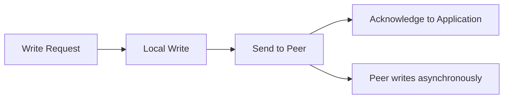

# How to Set Up DRBD for Disk Replication on Ubuntu

Author: [nawazdhandala](https://www.github.com/nawazdhandala)

Tags: Ubuntu, DRBD, Disk Replication, High Availability, Tutorial

Description: Complete guide to setting up DRBD network-based disk replication on Ubuntu for high availability.

---

## Introduction

DRBD (Distributed Replicated Block Device) is a distributed storage system for Linux that mirrors block devices between servers over a network. Think of it as RAID 1 over a network connection - your data is written to both local and remote storage simultaneously, ensuring high availability and disaster recovery capabilities.

This comprehensive guide walks you through setting up DRBD on Ubuntu servers, from basic concepts to advanced configurations including cluster integration.

## Understanding DRBD Concepts

### What is DRBD?

DRBD operates at the block device level, sitting between the filesystem and the physical disk. It intercepts all write operations and replicates them to a peer node over the network. This approach is transparent to applications - they simply see a regular block device.

### Key Terminology

**Resource**: A DRBD resource is the collection of all aspects of a particular replicated data set. It includes:
- The DRBD device (`/dev/drbdX`)
- The associated configuration
- The backing device (physical disk or partition)
- Connection to the peer node

**Backing Device**: The physical storage (disk, partition, or logical volume) that DRBD uses to store data. This is the actual storage medium.

**DRBD Device**: The virtual block device (`/dev/drbd0`, `/dev/drbd1`, etc.) that applications interact with. This device replicates data to the peer.

**Roles - Primary and Secondary**:
- **Primary**: The node where the DRBD device is mounted and actively serving read/write operations
- **Secondary**: The node receiving replicated data but not serving applications directly

**Connection States**:
- `Connected`: Normal operation, nodes are connected
- `Connecting`: Attempting to establish connection
- `StandAlone`: Not connected, operating independently
- `WFConnection`: Waiting for connection from peer

**Disk States**:
- `UpToDate`: Data is consistent and current
- `Inconsistent`: Data synchronization in progress
- `Diskless`: No local backing device available
- `Outdated`: Data is consistent but potentially stale

## DRBD Replication Modes

DRBD offers three replication protocols, each providing different trade-offs between performance and data safety:

### Protocol A (Asynchronous)



- **Behavior**: Write is considered complete once it reaches local disk and the TCP send buffer
- **Performance**: Fastest protocol, minimal latency impact
- **Safety**: Potential for data loss if primary fails before peer receives data
- **Use Case**: Long-distance replication where latency is a concern

### Protocol B (Memory Synchronous / Semi-Synchronous)


- **Behavior**: Write is complete when local disk write finishes and peer acknowledges receiving data in memory
- **Performance**: Moderate latency, good balance
- **Safety**: Data is safe from single node failure, but peer crash before disk write could lose data
- **Use Case**: Metro-area replication with moderate latency requirements

### Protocol C (Synchronous)


- **Behavior**: Write is complete only when both nodes have written to disk
- **Performance**: Highest latency, depends on network and remote disk speed
- **Safety**: No data loss on single node failure, full synchronous replication
- **Use Case**: Local high-availability clusters where data integrity is paramount

**Recommendation**: For most high-availability setups, Protocol C is recommended despite the performance overhead. The data safety guarantees outweigh the latency cost in critical applications.

## Prerequisites and Planning

### Hardware Requirements

Before setting up DRBD, ensure you have:

1. **Two Ubuntu servers** (Ubuntu 22.04 LTS or later recommended)
2. **Identical disk sizes** on both nodes for the DRBD backing device
3. **Dedicated network connection** (recommended) or sufficient bandwidth on existing network
4. **Low latency network** (< 1ms for Protocol C, higher acceptable for Protocol A)

### Network Planning

| Node | Hostname | IP Address | DRBD Port |
|------|----------|------------|-----------|
| Node 1 | drbd-node1 | 192.168.1.101 | 7789 |
| Node 2 | drbd-node2 | 192.168.1.102 | 7789 |

### Disk Preparation

Identify an unused disk or partition on both servers. In this guide, we'll use `/dev/sdb1` as the backing device.

**Warning**: DRBD will overwrite all data on the backing device. Ensure you're using the correct device.

```bash
# List all block devices to identify available storage
lsblk

# Example output:
# NAME   MAJ:MIN RM  SIZE RO TYPE MOUNTPOINT
# sda      8:0    0   50G  0 disk
# ├─sda1   8:1    0   49G  0 part /
# └─sda2   8:2    0    1G  0 part [SWAP]
# sdb      8:16   0  100G  0 disk
# └─sdb1   8:17   0  100G  0 part          <-- We'll use this
```

If you need to create a partition:

```bash
# Create a partition on /dev/sdb (run on both nodes)
sudo fdisk /dev/sdb

# In fdisk:
# n - new partition
# p - primary
# 1 - partition number
# Accept defaults for first and last sector
# w - write and exit
```

## Installing DRBD Packages

### Update System Packages

Run the following commands on **both nodes**:

```bash
# Update package lists
sudo apt update

# Upgrade existing packages
sudo apt upgrade -y
```

### Install DRBD Utilities and Kernel Module

```bash
# Install DRBD packages
# drbd-utils: User-space tools for managing DRBD
# drbd-dkms: Dynamic Kernel Module Support for DRBD kernel module
sudo apt install -y drbd-utils drbd-dkms

# Verify installation
drbdadm --version

# Expected output:
# DRBDADM_BUILDTAG=GIT-hash: ...
# DRBDADM_API_VERSION=2
# DRBD_KERNEL_VERSION_CODE=...
```

### Load the DRBD Kernel Module

```bash
# Load the DRBD kernel module
sudo modprobe drbd

# Verify the module is loaded
lsmod | grep drbd

# Expected output:
# drbd                  401408  0
# lru_cache              16384  1 drbd
# libcrc32c              16384  2 drbd,xfs

# Ensure DRBD module loads on boot
echo "drbd" | sudo tee /etc/modules-load.d/drbd.conf
```

### Configure Hostname Resolution

Add entries to `/etc/hosts` on **both nodes** for reliable name resolution:

```bash
# Edit hosts file
sudo nano /etc/hosts

# Add these lines (adjust IP addresses as needed):
192.168.1.101   drbd-node1
192.168.1.102   drbd-node2
```

Verify connectivity:

```bash
# From node1
ping -c 3 drbd-node2

# From node2
ping -c 3 drbd-node1
```

## Configuring DRBD Resources

### Understanding the Configuration Structure

DRBD configuration files are located in `/etc/drbd.d/`:

- `global_common.conf`: Global and common settings for all resources
- `*.res`: Individual resource configuration files

### Global Configuration

Edit the global configuration file on **both nodes**:

```bash
sudo nano /etc/drbd.d/global_common.conf
```

```conf
# /etc/drbd.d/global_common.conf
# Global DRBD configuration

global {
    # Usage statistics sent to LINBIT (optional, can be disabled)
    usage-count yes;

    # Disable this if you don't want to participate in statistics
    # usage-count no;
}

common {
    # Network protocol configuration
    net {
        # Use Protocol C for synchronous replication
        # This ensures no data loss on single node failure
        protocol C;

        # Authentication between nodes (highly recommended)
        # Generate a shared secret: openssl rand -base64 32
        cram-hmac-alg sha256;
        shared-secret "YourSecureSharedSecretHere123!";

        # Timeout settings (in 0.1 second units)
        # ping-timeout: Time to wait for ping response
        ping-timeout 10;

        # Network congestion settings
        # on-congestion: What to do when network is congested
        # pull-ahead: Become ahead of peer, allows faster recovery
        # disconnect: Disconnect if congestion persists (safer for WAN)
        on-congestion pull-ahead;
        congestion-fill 400M;
        congestion-extents 1000;
    }

    # Disk configuration
    disk {
        # What to do on I/O errors
        # detach: Detach from backing device, continue in diskless mode
        # pass_on: Pass error to upper layers
        # call-local-io-error: Call helper script
        on-io-error detach;

        # Resync rate - limit synchronization speed
        # Adjust based on your network capacity
        resync-rate 100M;

        # Activity log settings for crash recovery
        # Larger values mean faster recovery but more memory usage
        al-extents 6433;

        # Checksum-based resynchronization
        # Reduces resync time by skipping identical blocks
        c-plan-ahead 20;
        c-fill-target 50k;
        c-min-rate 10M;
    }

    # Startup and handler configuration
    startup {
        # Wait for connection on startup (in seconds)
        # 0 means wait indefinitely
        wfc-timeout 30;

        # Degrade gracefully if peer is not available
        degr-wfc-timeout 15;

        # Timeout when waiting for first connect after becoming primary
        outdated-wfc-timeout 10;
    }

    # Handler scripts for various events
    handlers {
        # Script to run before resync starts
        # before-resync-target "/usr/lib/drbd/snapshot-resync-target-lvm.sh";

        # Script to run after resync completes
        # after-resync-target "/usr/lib/drbd/unsnapshot-resync-target-lvm.sh";

        # Split-brain handling
        # These handlers help automate split-brain recovery
        split-brain "/usr/lib/drbd/notify-split-brain.sh root";

        # Fence peer to prevent dual-primary during split-brain
        fence-peer "/usr/lib/drbd/crm-fence-peer.sh";
        unfence-peer "/usr/lib/drbd/crm-unfence-peer.sh";
    }
}
```

### Resource Configuration

Create a resource configuration file on **both nodes**. The configuration must be identical on both servers:

```bash
sudo nano /etc/drbd.d/data.res
```

```conf
# /etc/drbd.d/data.res
# DRBD Resource Configuration for 'data' resource
#
# This resource provides a replicated block device at /dev/drbd0
# using /dev/sdb1 as the backing storage on both nodes

resource data {
    # Resource-specific options (override common settings if needed)
    options {
        # Auto-promote: Automatically become primary when device is mounted
        # Useful for single-primary configurations
        auto-promote yes;

        # Quorum settings for split-brain prevention
        # quorum majority;
        # on-no-quorum io-error;
    }

    # Node 1 configuration
    on drbd-node1 {
        # Device path for the DRBD device
        # Applications will use this path
        device /dev/drbd0;

        # Physical backing storage device
        # Must exist and be the same size on both nodes
        disk /dev/sdb1;

        # IP address and port for DRBD communication
        # This node listens on this address
        address 192.168.1.101:7789;

        # Metadata storage location
        # internal: Store metadata on the same backing device
        # flexible: Use internal unless device is too small
        meta-disk internal;
    }

    # Node 2 configuration
    on drbd-node2 {
        device /dev/drbd0;
        disk /dev/sdb1;
        address 192.168.1.102:7789;
        meta-disk internal;
    }

    # Connection-specific settings between nodes
    # Useful for multi-path or specific network tuning
    connection {
        # Network interface binding (optional)
        # net {
        #     sndbuf-size 1M;
        #     rcvbuf-size 1M;
        # }

        host drbd-node1 address 192.168.1.101:7789;
        host drbd-node2 address 192.168.1.102:7789;
    }
}
```

### Verify Configuration Syntax

```bash
# Check configuration for errors (run on both nodes)
sudo drbdadm dump all

# Verify the resource configuration specifically
sudo drbdadm dump data

# Check for any configuration issues
sudo drbdadm sh-resources
# Expected output: data
```

## Initializing and Synchronizing Devices

### Create DRBD Metadata

Initialize the DRBD metadata on **both nodes**:

```bash
# Create metadata structures on the backing device
# WARNING: This will overwrite any existing data on /dev/sdb1
sudo drbdadm create-md data

# Expected output:
# initializing activity log
# initializing bitmap (3200 KB) to all zero
# Writing meta data...
# New drbd meta data block successfully created.

# If the device contains a filesystem, you'll need to confirm:
# Do you want to proceed? [need to type 'yes' to confirm]
```

### Bring Up the DRBD Resource

Start the DRBD resource on **both nodes**:

```bash
# Start the DRBD resource
sudo drbdadm up data

# Verify the resource is running
sudo drbdadm status data

# Expected output (both nodes showing Secondary/Inconsistent):
# data role:Secondary
#   disk:Inconsistent
#   peer connection:Connected role:Secondary
#     replication:Established peer-disk:Inconsistent
```

### Configure Firewall Rules

If you have a firewall enabled, allow DRBD traffic:

```bash
# Allow DRBD port (7789 by default)
sudo ufw allow 7789/tcp

# Or more restrictively, only from the peer:
# On drbd-node1:
sudo ufw allow from 192.168.1.102 to any port 7789 proto tcp

# On drbd-node2:
sudo ufw allow from 192.168.1.101 to any port 7789 proto tcp

# Reload firewall
sudo ufw reload
```

### Initial Synchronization

On a fresh setup, choose one node to be the initial sync source (this node's data will be considered authoritative):

```bash
# On the node that will be the initial primary (e.g., drbd-node1)
# This command forces this node to become primary and starts sync
sudo drbdadm primary --force data
```

Monitor synchronization progress:

```bash
# Watch synchronization status
watch -n 1 cat /proc/drbd

# Or use drbdadm status
sudo drbdadm status data

# Example output during sync:
# data role:Primary
#   disk:UpToDate
#   peer connection:Connected role:Secondary
#     replication:SyncSource peer-disk:Inconsistent
#     done:45.2%

# You can also monitor with drbdsetup
sudo drbdsetup status data --verbose --statistics
```

**Note**: Initial synchronization time depends on disk size and configured resync-rate. A 100GB disk at 100MB/s will take approximately 17 minutes.

## Managing Primary and Secondary Roles

### Role Concepts

In DRBD, exactly one node should be primary at any time in a single-primary configuration. The primary node:
- Has the DRBD device mounted
- Serves read/write requests
- Sends all writes to the secondary

The secondary node:
- Receives and stores replicated data
- Cannot mount the DRBD device (in single-primary mode)
- Is ready to take over if primary fails

### Promoting to Primary

```bash
# Make a node primary (run on the desired primary node)
sudo drbdadm primary data

# With auto-promote enabled, you can simply mount the device
# and it will automatically become primary
sudo mount /dev/drbd0 /mnt/data
```

### Demoting to Secondary

Before demoting, unmount any filesystems:

```bash
# Unmount the DRBD device
sudo umount /mnt/data

# Demote to secondary
sudo drbdadm secondary data

# Verify the role change
sudo drbdadm role data
# Expected output: Secondary
```

### Role Switching for Maintenance

Complete process to switch primary role from node1 to node2:

```bash
# On the current primary (node1):
# 1. Stop applications using the DRBD device
sudo systemctl stop myapplication

# 2. Unmount the filesystem
sudo umount /mnt/data

# 3. Demote to secondary
sudo drbdadm secondary data

# On the new primary (node2):
# 4. Promote to primary
sudo drbdadm primary data

# 5. Mount the filesystem
sudo mount /dev/drbd0 /mnt/data

# 6. Start applications
sudo systemctl start myapplication
```

### Creating and Mounting Filesystems

After initial synchronization, create a filesystem on the primary node:

```bash
# On the primary node only
# Create an ext4 filesystem
sudo mkfs.ext4 /dev/drbd0

# Or XFS for better performance with large files
# sudo mkfs.xfs /dev/drbd0

# Create mount point
sudo mkdir -p /mnt/data

# Mount the filesystem
sudo mount /dev/drbd0 /mnt/data

# Verify the mount
df -h /mnt/data

# Add to /etc/fstab for automatic mounting (optional, be careful with this)
# Only on the primary node or with proper cluster management
echo "/dev/drbd0 /mnt/data ext4 defaults,noauto 0 0" | sudo tee -a /etc/fstab
```

## Split-Brain Handling and Recovery

### Understanding Split-Brain

Split-brain occurs when both nodes believe they are primary and have divergent data. This can happen when:
- Network connection between nodes is lost
- Both nodes are configured to auto-promote
- Cluster manager fails to fence the other node

### Detecting Split-Brain

```bash
# Check DRBD status
sudo drbdadm status data

# Split-brain indicators:
# - Both nodes show role:Primary
# - Connection state shows StandAlone or Connecting
# - Messages in dmesg about split-brain
sudo dmesg | grep -i "split-brain"
```

### Manual Split-Brain Recovery

When split-brain occurs, you must decide which node has the authoritative data:

```bash
# === On the VICTIM node (node with data to be discarded) ===

# 1. Demote to secondary
sudo drbdadm secondary data

# 2. Disconnect from peer
sudo drbdadm disconnect data

# 3. Mark this node as a sync target (discard local changes)
sudo drbdadm connect --discard-my-data data

# === On the SURVIVOR node (node with data to keep) ===

# 4. Reconnect if not already connected
sudo drbdadm connect data

# The survivor will then sync data to the victim
```

### Automatic Split-Brain Recovery Policies

Configure automatic recovery in `/etc/drbd.d/global_common.conf`:

```conf
net {
    # Split-brain recovery policies
    # These determine automatic behavior when split-brain is detected

    # After split-brain, when one node becomes secondary:
    # disconnect: Stay disconnected (safest, requires manual intervention)
    # discard-younger-primary: Discard data from the node that became primary later
    # discard-least-changes: Discard data from node with fewer changes
    # discard-zero-changes: If one node has no changes, use the other's data
    after-sb-0pri discard-zero-changes;

    # When split-brain is detected with one primary:
    # disconnect: Stay disconnected
    # discard-secondary: The secondary discards its changes
    # call-pri-lost-after-sb: Call the pri-lost-after-sb handler
    after-sb-1pri discard-secondary;

    # When split-brain is detected with two primaries:
    # disconnect: Stay disconnected (safest)
    # violently-as0p: Act as if there were 0 primaries
    # call-pri-lost-after-sb: Demote one primary and call handler
    after-sb-2pri disconnect;

    # Rate limit for split-brain recovery
    rr-conflict disconnect;
}
```

### Split-Brain Prevention

Best practices to prevent split-brain:

1. **Use fencing**: Configure STONITH (Shoot The Other Node In The Head) in your cluster
2. **Quorum**: Use odd number of quorum devices
3. **Reliable network**: Use redundant network paths
4. **Proper timeout settings**: Configure appropriate timeouts

```conf
# Add to resource configuration for quorum support
resource data {
    options {
        # Quorum settings (requires 3+ nodes or quorum device)
        # quorum majority;
        # on-no-quorum io-error;
    }
}
```

## Performance Tuning

### Network Optimization

```conf
# In /etc/drbd.d/global_common.conf
common {
    net {
        # TCP buffer sizes (adjust based on bandwidth-delay product)
        # Higher values improve throughput on high-latency links
        sndbuf-size 1M;
        rcvbuf-size 1M;

        # Maximum number of write requests in flight
        # Higher values improve throughput but increase memory usage
        max-buffers 8000;
        max-epoch-size 8000;

        # Unplug watermark for batching
        # Smaller values reduce latency, larger values improve throughput
        unplug-watermark 128;

        # TCP connection settings
        # no-tcp-cork: Disable TCP cork (reduces latency, may reduce throughput)
        # allow-two-primaries: Enable dual-primary mode (advanced, requires special filesystem)
        no-tcp-cork yes;
    }
}
```

### Disk I/O Optimization

```conf
# In /etc/drbd.d/global_common.conf
common {
    disk {
        # Resync rate - balance between sync speed and application performance
        # Set to approximately 1/3 of available bandwidth
        resync-rate 200M;

        # Activity log extents - larger values speed up recovery
        # Each extent tracks 4MB of dirty data
        # 6433 extents = ~25GB tracking capacity
        al-extents 6433;

        # Number of activity log stripes (for parallel I/O)
        al-stripes 1;

        # Activity log stripe size (KB)
        al-stripe-size 32;

        # Enable discard/TRIM support (for SSDs)
        discard-zeroes-if-aligned yes;

        # Read balancing in Protocol A
        # Prefer reading from local disk vs remote
        read-balancing prefer-local;

        # Bitmap optimization
        c-plan-ahead 20;
        c-fill-target 100k;
        c-min-rate 50M;
    }
}
```

### System-Level Tuning

```bash
# Increase TCP buffer limits (add to /etc/sysctl.conf)
sudo tee -a /etc/sysctl.conf << 'EOF'
# DRBD network optimization
net.core.rmem_max = 16777216
net.core.wmem_max = 16777216
net.ipv4.tcp_rmem = 4096 87380 16777216
net.ipv4.tcp_wmem = 4096 65536 16777216
net.core.netdev_max_backlog = 30000
net.ipv4.tcp_no_metrics_save = 1
net.ipv4.tcp_moderate_rcvbuf = 1
EOF

# Apply sysctl settings
sudo sysctl -p

# Use deadline or none I/O scheduler for SSDs
echo none | sudo tee /sys/block/sdb/queue/scheduler

# Increase I/O queue depth
echo 256 | sudo tee /sys/block/sdb/queue/nr_requests
```

### Benchmarking DRBD Performance

```bash
# Test write performance with fio
sudo apt install -y fio

# Sequential write test
sudo fio --name=seqwrite --ioengine=libaio --direct=1 \
    --filename=/mnt/data/testfile --bs=1M --size=1G \
    --numjobs=1 --runtime=60 --group_reporting --rw=write

# Random write test (more realistic for databases)
sudo fio --name=randwrite --ioengine=libaio --direct=1 \
    --filename=/mnt/data/testfile --bs=4k --size=1G \
    --numjobs=4 --runtime=60 --group_reporting --rw=randwrite

# Cleanup
rm /mnt/data/testfile
```

## Integration with Pacemaker/Corosync

### Overview

Pacemaker and Corosync provide cluster management capabilities:
- **Corosync**: Cluster messaging and membership
- **Pacemaker**: Resource management and failover

Together with DRBD, they provide automated high-availability.

### Installing Cluster Stack

```bash
# Install on both nodes
sudo apt install -y pacemaker corosync pcs resource-agents fence-agents

# Start and enable pcsd (Pacemaker/Corosync daemon)
sudo systemctl start pcsd
sudo systemctl enable pcsd

# Set password for hacluster user (must be same on both nodes)
sudo passwd hacluster
# Enter the same password on both nodes
```

### Configuring Corosync

```bash
# Authenticate nodes (run on one node)
sudo pcs host auth drbd-node1 drbd-node2 -u hacluster -p YourHaclusterPassword

# Create cluster (run on one node)
sudo pcs cluster setup ha-cluster drbd-node1 drbd-node2

# Start the cluster
sudo pcs cluster start --all

# Enable cluster services to start on boot
sudo pcs cluster enable --all

# Verify cluster status
sudo pcs cluster status
```

### Configure DRBD as Cluster Resource

```bash
# Disable DRBD auto-promote (Pacemaker will manage promotions)
# Edit /etc/drbd.d/data.res and remove or comment out:
# auto-promote yes;

# Create DRBD primitive resource
sudo pcs resource create drbd_data ocf:linbit:drbd \
    drbd_resource=data \
    op monitor interval=30s role=Master \
    op monitor interval=60s role=Slave

# Create master/slave (promotable) clone
sudo pcs resource promotable drbd_data \
    promoted-max=1 \
    promoted-node-max=1 \
    clone-max=2 \
    clone-node-max=1 \
    notify=true

# Create filesystem resource
sudo pcs resource create fs_data ocf:heartbeat:Filesystem \
    device=/dev/drbd0 \
    directory=/mnt/data \
    fstype=ext4 \
    op monitor interval=20s

# Create virtual IP resource (optional but recommended)
sudo pcs resource create vip_data ocf:heartbeat:IPaddr2 \
    ip=192.168.1.100 \
    cidr_netmask=24 \
    op monitor interval=10s

# Group filesystem and VIP
sudo pcs resource group add grp_data fs_data vip_data

# Add ordering constraint (filesystem starts after DRBD is primary)
sudo pcs constraint order promote drbd_data-clone then start grp_data

# Add colocation constraint (filesystem must be on DRBD primary)
sudo pcs constraint colocation add grp_data with drbd_data-clone INFINITY with-rsc-role=Master
```

### Verify Cluster Configuration

```bash
# Check cluster status
sudo pcs status

# Expected output shows:
# - drbd_data resource running as Master on one node, Slave on other
# - fs_data mounted on the same node as DRBD Master
# - vip_data configured on the same node

# View all constraints
sudo pcs constraint show

# View resource configuration
sudo pcs resource config

# Test failover (move resources to other node)
sudo pcs resource move grp_data drbd-node2

# Clear any location constraints after testing
sudo pcs resource clear grp_data
```

### STONITH Configuration

STONITH (fencing) is critical for preventing split-brain:

```bash
# Example: Configure fence_ipmilan for IPMI-based fencing
sudo pcs stonith create fence_node1 fence_ipmilan \
    pcmk_host_list=drbd-node1 \
    ip=192.168.1.201 \
    username=admin \
    password=adminpass \
    lanplus=1 \
    op monitor interval=60s

sudo pcs stonith create fence_node2 fence_ipmilan \
    pcmk_host_list=drbd-node2 \
    ip=192.168.1.202 \
    username=admin \
    password=adminpass \
    lanplus=1 \
    op monitor interval=60s

# Enable STONITH
sudo pcs property set stonith-enabled=true

# Verify STONITH status
sudo pcs stonith status
```

## Monitoring and Troubleshooting

### Basic Monitoring Commands

```bash
# Real-time status of all DRBD resources
sudo drbdadm status all

# Detailed status with statistics
sudo drbdsetup status --verbose --statistics

# Legacy /proc/drbd interface (still useful)
cat /proc/drbd

# Example output:
# version: 8.4.11 (api:1/proto:86-101)
# srcversion: 5D4B3DFE0C59F62DE803B33
#
#  0: cs:Connected ro:Primary/Secondary ds:UpToDate/UpToDate C r-----
#     ns:1048576 nr:0 dw:1048576 dr:0 al:1 bm:0 lo:0 pe:0 ua:0 ap:0 ep:1 wo:d oos:0
```

### Monitoring Script

Create a monitoring script for integration with monitoring systems:

```bash
sudo tee /usr/local/bin/check_drbd.sh << 'SCRIPT'
#!/bin/bash
# DRBD Health Check Script
# Returns: 0=OK, 1=WARNING, 2=CRITICAL

RESOURCE=${1:-data}

# Get DRBD status
STATUS=$(drbdadm status $RESOURCE 2>&1)
if [ $? -ne 0 ]; then
    echo "CRITICAL: Cannot get DRBD status - $STATUS"
    exit 2
fi

# Check connection state
CONNECTION=$(echo "$STATUS" | grep -oP 'connection:\K\w+' | head -1)
if [ "$CONNECTION" != "Connected" ]; then
    echo "CRITICAL: DRBD connection state is $CONNECTION"
    exit 2
fi

# Check disk state
DISK=$(echo "$STATUS" | grep -oP 'disk:\K\w+' | head -1)
PEER_DISK=$(echo "$STATUS" | grep -oP 'peer-disk:\K\w+' | head -1)

if [ "$DISK" != "UpToDate" ]; then
    echo "CRITICAL: Local disk state is $DISK"
    exit 2
fi

if [ "$PEER_DISK" != "UpToDate" ]; then
    echo "WARNING: Peer disk state is $PEER_DISK"
    exit 1
fi

# Check for synchronization in progress
if echo "$STATUS" | grep -q "replication:Sync"; then
    PERCENT=$(echo "$STATUS" | grep -oP 'done:\K[\d.]+')
    echo "WARNING: Synchronization in progress - ${PERCENT}% complete"
    exit 1
fi

# All checks passed
ROLE=$(echo "$STATUS" | grep -oP 'role:\K\w+' | head -1)
echo "OK: DRBD $RESOURCE is $ROLE, connected, UpToDate"
exit 0
SCRIPT

sudo chmod +x /usr/local/bin/check_drbd.sh
```

### Common Issues and Solutions

#### Issue: Nodes Cannot Connect

```bash
# Symptoms
sudo drbdadm status data
# Shows: connection:Connecting or StandAlone

# Troubleshooting steps:

# 1. Check network connectivity
ping drbd-node2

# 2. Check firewall rules
sudo ufw status | grep 7789
sudo iptables -L -n | grep 7789

# 3. Check if DRBD is listening
sudo ss -tlnp | grep 7789

# 4. Check for configuration mismatches
sudo drbdadm dump data | diff - <(ssh drbd-node2 'sudo drbdadm dump data')

# 5. Check system logs
sudo journalctl -u drbd --since "10 minutes ago"
sudo dmesg | grep drbd
```

#### Issue: Synchronization Stuck

```bash
# Symptoms: Sync percentage not advancing

# 1. Check sync status
sudo drbdsetup status data --verbose

# 2. Verify disk health
sudo smartctl -a /dev/sdb

# 3. Check for I/O errors
sudo dmesg | grep -i error

# 4. Verify resync rate isn't too low
# Temporarily increase it:
sudo drbdadm disk-options --resync-rate=500M data

# 5. Check network throughput between nodes
iperf3 -s  # On one node
iperf3 -c drbd-node1  # On other node
```

#### Issue: Split-Brain Detected

```bash
# Symptoms
sudo drbdadm status data
# Shows split-brain or StandAlone on both nodes

# Recovery procedure (CAREFULLY CHOOSE THE VICTIM):

# On VICTIM (data will be lost):
sudo drbdadm secondary data
sudo drbdadm disconnect data
sudo drbdadm -- --discard-my-data connect data

# On SURVIVOR (data will be kept):
sudo drbdadm connect data

# Monitor recovery
watch -n1 'drbdadm status data'
```

#### Issue: Device Marked as Outdated

```bash
# Symptoms: One node shows disk:Outdated

# 1. If the other node is available and UpToDate:
# Simply reconnect and resync will happen automatically
sudo drbdadm connect data

# 2. If you need to force the outdated node to be primary:
# WARNING: May result in data loss
sudo drbdadm disconnect data
sudo drbdadm -- --discard-my-data connect data

# Or completely reinitialize:
sudo drbdadm down data
sudo drbdadm -- --force create-md data
sudo drbdadm up data
sudo drbdadm -- --discard-my-data connect data
```

### Log Analysis

```bash
# DRBD kernel messages
sudo dmesg | grep drbd

# System journal for DRBD
sudo journalctl -u drbd -f

# Detailed kernel logs
sudo journalctl -k | grep drbd

# Search for specific error patterns
sudo grep -r "drbd" /var/log/syslog
sudo grep -E "(split-brain|timeout|error)" /var/log/kern.log
```

### Performance Metrics to Monitor

```bash
# Create a metrics collection script
sudo tee /usr/local/bin/drbd_metrics.sh << 'SCRIPT'
#!/bin/bash
# Collect DRBD performance metrics

RESOURCE=${1:-data}

# Get statistics
STATS=$(drbdsetup status $RESOURCE --statistics 2>/dev/null)

# Parse and output metrics
echo "=== DRBD Metrics for $RESOURCE ==="
echo "Timestamp: $(date -Iseconds)"

# Network statistics
echo "$STATS" | grep -E "(sent|received|pending)" | while read line; do
    echo "Network: $line"
done

# Disk statistics
echo "$STATS" | grep -E "(read|written|al-writes|bm-writes)" | while read line; do
    echo "Disk: $line"
done

# Connection metrics
echo "$STATS" | grep -E "(ap-in-flight|rs-in-flight|unacked)" | while read line; do
    echo "Connection: $line"
done
SCRIPT

sudo chmod +x /usr/local/bin/drbd_metrics.sh
```

## Complete Example Configuration

Here's a complete, production-ready configuration example:

### File: /etc/drbd.d/global_common.conf

```conf
# /etc/drbd.d/global_common.conf
# Production DRBD Configuration

global {
    usage-count no;
}

common {
    net {
        protocol C;
        cram-hmac-alg sha256;
        shared-secret "SuperSecretKey12345!";

        # Performance tuning
        max-buffers 8000;
        max-epoch-size 8000;
        sndbuf-size 1M;
        rcvbuf-size 1M;

        # Timeouts (in 0.1 second units)
        ping-timeout 50;
        ping-int 10;
        connect-int 10;
        timeout 60;

        # Split-brain policies
        after-sb-0pri discard-zero-changes;
        after-sb-1pri discard-secondary;
        after-sb-2pri disconnect;

        # Congestion handling
        on-congestion pull-ahead;
        congestion-fill 400M;
        congestion-extents 1000;
    }

    disk {
        on-io-error detach;
        resync-rate 200M;
        al-extents 6433;

        # Checksumming for efficient resync
        c-plan-ahead 20;
        c-fill-target 100k;
        c-min-rate 50M;
    }

    startup {
        wfc-timeout 60;
        degr-wfc-timeout 30;
        outdated-wfc-timeout 20;
    }

    handlers {
        split-brain "/usr/lib/drbd/notify-split-brain.sh root";
    }
}
```

### File: /etc/drbd.d/data.res

```conf
# /etc/drbd.d/data.res
# Primary data resource configuration

resource data {
    options {
        auto-promote yes;
    }

    on drbd-node1 {
        device /dev/drbd0;
        disk /dev/sdb1;
        address 192.168.1.101:7789;
        meta-disk internal;
    }

    on drbd-node2 {
        device /dev/drbd0;
        disk /dev/sdb1;
        address 192.168.1.102:7789;
        meta-disk internal;
    }
}
```

### File: /etc/drbd.d/database.res (Additional Resource Example)

```conf
# /etc/drbd.d/database.res
# Dedicated resource for database storage

resource database {
    options {
        auto-promote yes;
    }

    disk {
        # More aggressive settings for database workloads
        resync-rate 300M;
        al-extents 6433;
    }

    on drbd-node1 {
        device /dev/drbd1;
        disk /dev/sdc1;
        address 192.168.1.101:7790;
        meta-disk internal;
    }

    on drbd-node2 {
        device /dev/drbd1;
        disk /dev/sdc1;
        address 192.168.1.102:7790;
        meta-disk internal;
    }
}
```

### Systemd Service for Automatic Startup

```bash
# DRBD is typically managed by systemd via drbd.service
# Ensure it's enabled:
sudo systemctl enable drbd

# To start DRBD resources automatically:
sudo systemctl start drbd

# Check status
sudo systemctl status drbd
```

## Quick Reference

### Essential Commands

```bash
# Status commands
drbdadm status all                    # Show status of all resources
drbdadm role <resource>               # Show current role
drbdsetup status --verbose            # Detailed status with stats

# Resource management
drbdadm up <resource>                 # Bring resource online
drbdadm down <resource>               # Take resource offline
drbdadm primary <resource>            # Promote to primary
drbdadm secondary <resource>          # Demote to secondary

# Connection management
drbdadm connect <resource>            # Connect to peer
drbdadm disconnect <resource>         # Disconnect from peer
drbdadm adjust <resource>             # Apply config changes

# Initial setup
drbdadm create-md <resource>          # Create metadata
drbdadm -- --force primary <resource> # Force primary (initial sync)

# Recovery commands
drbdadm -- --discard-my-data connect <resource>  # Discard local, sync from peer
drbdadm invalidate <resource>         # Mark local as outdated, force resync
drbdadm invalidate-remote <resource>  # Mark remote as outdated

# Verification
drbdadm verify <resource>             # Online verification of data consistency
drbdadm dump <resource>               # Show parsed configuration
```

## Monitoring Your DRBD Setup with OneUptime

Setting up DRBD is just the beginning of building a resilient infrastructure. Continuous monitoring is essential to ensure your replicated storage remains healthy and synchronized. This is where [OneUptime](https://oneuptime.com) becomes invaluable.

OneUptime provides comprehensive infrastructure monitoring that can help you:

- **Monitor DRBD Health**: Set up custom monitors to track DRBD connection states, disk states, and synchronization status
- **Alert on Split-Brain**: Receive immediate notifications when split-brain conditions occur, allowing you to respond before data divergence becomes critical
- **Track Sync Progress**: Monitor initial and incremental synchronization, alerting you if sync operations stall or fail
- **Monitor Cluster Resources**: If you're using Pacemaker/Corosync, OneUptime can track cluster health, resource states, and failover events
- **Performance Dashboards**: Create custom dashboards to visualize DRBD throughput, latency, and replication lag
- **Incident Management**: When issues occur, OneUptime helps coordinate response with integrated incident management and on-call scheduling

By integrating DRBD monitoring with OneUptime, you gain visibility into your entire high-availability stack, ensuring your data remains protected and accessible. The proactive alerting capabilities mean you can address potential issues before they impact your applications and users.
