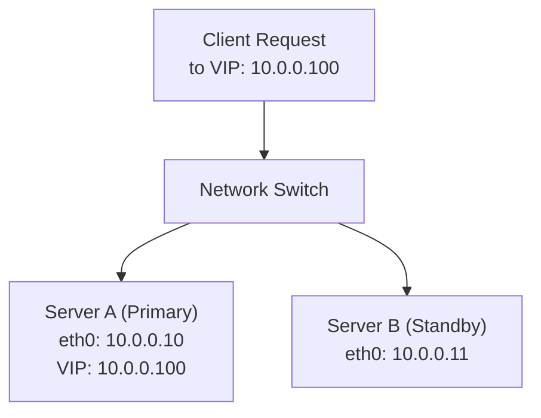

# How to Set Up Floating/Virtual IPs on Ubuntu

Author: [nawazdhandala](https://www.github.com/nawazdhandala)

Tags: Ubuntu, Virtual IP, Floating IP, High Availability, Tutorial

Description: Complete guide to configuring floating and virtual IP addresses on Ubuntu for high availability.

---

Floating IPs (also known as virtual IPs or VIPs) are essential components in building highly available infrastructure. They allow you to seamlessly redirect traffic between servers during failovers, ensuring minimal downtime for your services. This comprehensive guide covers everything you need to know about setting up and managing floating/virtual IPs on Ubuntu.

## Table of Contents

1. [Understanding Floating/Virtual IPs](#understanding-floatingvirtual-ips)
2. [Manual IP Aliasing](#manual-ip-aliasing)
3. [Netplan Configuration](#netplan-configuration)
4. [Using the ip Command](#using-the-ip-command)
5. [Keepalived for VIP Management](#keepalived-for-vip-management)
6. [Cloud Provider Floating IPs](#cloud-provider-floating-ips)
7. [ARP Announcements](#arp-announcements)
8. [Failover Scripts](#failover-scripts)
9. [Load Balancer Integration](#load-balancer-integration)
10. [Multi-Interface Considerations](#multi-interface-considerations)
11. [Troubleshooting](#troubleshooting)

---

## Understanding Floating/Virtual IPs

A floating IP (or virtual IP) is an IP address that is not permanently assigned to a single network interface or server. Instead, it can be dynamically moved between servers, enabling high availability and failover capabilities.

### Key Concepts

**Virtual IP (VIP)**: An IP address assigned to a virtual interface that can be shared among multiple physical servers.

**Floating IP**: An IP address that can be reassigned from one server to another, typically in cloud environments or high-availability clusters.

**IP Aliasing**: The ability to assign multiple IP addresses to a single network interface.

### Use Cases

- **High Availability Clusters**: Automatically move the VIP to a healthy node when the primary fails
- **Load Balancing**: Distribute traffic across multiple backend servers
- **Zero-Downtime Deployments**: Switch traffic between old and new application versions
- **Database Failover**: Ensure database connections continue working after primary failure
- **Service Migration**: Move services between servers without DNS changes

### How Floating IPs Work



When Server A fails, the VIP (10.0.0.100) moves to Server B, and clients continue connecting without any configuration changes.

---

## Manual IP Aliasing

IP aliasing allows you to assign multiple IP addresses to a single network interface. This is the foundation for setting up virtual IPs.

### Using ifconfig (Legacy Method)

While `ifconfig` is deprecated, understanding it helps when working with older systems:

```bash
# Add a virtual IP to interface eth0
# Syntax: ifconfig <interface>:<alias_number> <ip_address> netmask <netmask> up
sudo ifconfig eth0:0 192.168.1.100 netmask 255.255.255.0 up

# Verify the configuration
ifconfig eth0:0

# Remove the virtual IP
sudo ifconfig eth0:0 down
```

### Understanding Interface Aliases

```bash
# Traditional naming convention:
# eth0      - Primary interface
# eth0:0    - First alias
# eth0:1    - Second alias
# eth0:2    - Third alias (and so on)

# Modern naming convention (systemd):
# ens33     - Primary interface
# ens33:0   - First alias
# ens33:1   - Second alias
```

### Persistent Configuration (Legacy /etc/network/interfaces)

For older Ubuntu versions using `/etc/network/interfaces`:

```bash
# /etc/network/interfaces
# Primary network interface
auto eth0
iface eth0 inet static
    address 192.168.1.10
    netmask 255.255.255.0
    gateway 192.168.1.1
    dns-nameservers 8.8.8.8 8.8.4.4

# First virtual IP alias
auto eth0:0
iface eth0:0 inet static
    address 192.168.1.100
    netmask 255.255.255.0

# Second virtual IP alias
auto eth0:1
iface eth0:1 inet static
    address 192.168.1.101
    netmask 255.255.255.0
```

Apply the configuration:

```bash
# Restart networking (may disconnect SSH sessions)
sudo systemctl restart networking

# Or bring up specific alias without full restart
sudo ifup eth0:0
```

---

## Netplan Configuration

Ubuntu 18.04 and later use Netplan for network configuration. This is the recommended method for modern Ubuntu systems.

### Basic Netplan Configuration with Multiple IPs

```yaml
# /etc/netplan/01-netcfg.yaml
# Basic configuration with multiple IP addresses on a single interface

network:
  version: 2
  renderer: networkd  # Use 'NetworkManager' for desktop environments
  ethernets:
    eth0:
      # Primary IP address with CIDR notation
      addresses:
        - 192.168.1.10/24      # Primary IP
        - 192.168.1.100/24     # Virtual IP 1
        - 192.168.1.101/24     # Virtual IP 2
        - 192.168.1.102/24     # Virtual IP 3
      # Default gateway
      routes:
        - to: default
          via: 192.168.1.1
      # DNS configuration
      nameservers:
        addresses:
          - 8.8.8.8
          - 8.8.4.4
        search:
          - example.com
```

### Advanced Netplan Configuration

```yaml
# /etc/netplan/01-netcfg.yaml
# Advanced configuration with multiple interfaces and VIPs

network:
  version: 2
  renderer: networkd
  ethernets:
    # Primary interface for regular traffic
    eth0:
      addresses:
        - 192.168.1.10/24
      routes:
        - to: default
          via: 192.168.1.1
      nameservers:
        addresses: [8.8.8.8, 8.8.4.4]
      # Optional: disable IPv6
      dhcp6: false
      # MTU configuration
      mtu: 1500

    # Secondary interface for cluster communication
    eth1:
      addresses:
        - 10.0.0.10/24
      # No default route on this interface
      routes:
        - to: 10.0.0.0/24
          via: 10.0.0.1
          metric: 100

    # Dedicated interface for VIPs (optional)
    eth2:
      addresses:
        - 172.16.0.10/24
        - 172.16.0.100/24  # VIP for web service
        - 172.16.0.101/24  # VIP for database
        - 172.16.0.102/24  # VIP for API service
      # Enable ARP filtering for VIP interfaces
      optional: true
```

### Applying Netplan Configuration

```bash
# Test the configuration (dry run)
# This checks syntax without applying changes
sudo netplan try

# Generate backend configuration files
# Useful for debugging what will be created
sudo netplan generate

# Apply the configuration
# Changes take effect immediately
sudo netplan apply

# Debug mode for troubleshooting
sudo netplan --debug apply
```

### Netplan with DHCP and Static VIPs

```yaml
# /etc/netplan/01-netcfg.yaml
# Hybrid configuration: DHCP for primary IP, static VIPs

network:
  version: 2
  ethernets:
    eth0:
      # Get primary IP via DHCP
      dhcp4: true
      dhcp4-overrides:
        # Don't use DHCP-provided routes as default
        use-routes: false
      # Add static VIPs alongside DHCP address
      addresses:
        - 192.168.1.100/24  # Static VIP
      routes:
        - to: default
          via: 192.168.1.1
          metric: 100
```

---

## Using the ip Command

The `ip` command (from iproute2) is the modern replacement for `ifconfig` and provides more powerful IP management capabilities.

### Adding Virtual IPs

```bash
# Add a virtual IP to an interface
# Syntax: ip addr add <ip>/<prefix> dev <interface>
sudo ip addr add 192.168.1.100/24 dev eth0

# Add with a label (for compatibility with older tools)
# The label helps identify the purpose of each IP
sudo ip addr add 192.168.1.100/24 dev eth0 label eth0:vip1

# Add a VIP with broadcast address specified
sudo ip addr add 192.168.1.100/24 broadcast 192.168.1.255 dev eth0

# Add a secondary IP without creating a new broadcast domain
# The 'secondary' keyword marks this as a secondary address
sudo ip addr add 192.168.1.101/24 dev eth0 secondary
```

### Viewing IP Configuration

```bash
# Show all IP addresses on all interfaces
ip addr show

# Show IP addresses for a specific interface
ip addr show dev eth0

# Show only IPv4 addresses
ip -4 addr show

# Show only IPv6 addresses
ip -6 addr show

# Brief output format (easier to parse)
ip -br addr show

# JSON output (useful for scripting)
ip -j addr show | jq '.'

# Show only addresses with a specific label
ip addr show label "eth0:*"
```

### Removing Virtual IPs

```bash
# Remove a specific IP address
sudo ip addr del 192.168.1.100/24 dev eth0

# Remove all IPs from an interface (use with caution!)
sudo ip addr flush dev eth0

# Remove only secondary addresses
sudo ip addr flush dev eth0 secondary
```

### Making IP Changes Persistent

The `ip` command changes are temporary and lost after reboot. To make them persistent:

```bash
# Method 1: Create a systemd service
# /etc/systemd/system/vip-setup.service

[Unit]
Description=Set up Virtual IP addresses
After=network-online.target
Wants=network-online.target

[Service]
Type=oneshot
RemainAfterExit=yes
# Add VIPs on service start
ExecStart=/sbin/ip addr add 192.168.1.100/24 dev eth0 label eth0:vip1
ExecStart=/sbin/ip addr add 192.168.1.101/24 dev eth0 label eth0:vip2
# Remove VIPs on service stop
ExecStop=/sbin/ip addr del 192.168.1.100/24 dev eth0
ExecStop=/sbin/ip addr del 192.168.1.101/24 dev eth0

[Install]
WantedBy=multi-user.target
```

Enable and start the service:

```bash
# Reload systemd to recognize new service
sudo systemctl daemon-reload

# Enable service to start at boot
sudo systemctl enable vip-setup.service

# Start the service now
sudo systemctl start vip-setup.service

# Check service status
sudo systemctl status vip-setup.service
```

### IP Command Cheat Sheet

```bash
# Common ip addr operations
ip addr show                          # Show all addresses
ip addr add 10.0.0.100/24 dev eth0   # Add address
ip addr del 10.0.0.100/24 dev eth0   # Remove address
ip addr flush dev eth0                # Remove all addresses

# Link operations (interface state)
ip link show                          # Show all interfaces
ip link set eth0 up                   # Bring interface up
ip link set eth0 down                 # Bring interface down
ip link set eth0 mtu 9000            # Set MTU

# Route operations
ip route show                         # Show routing table
ip route add default via 10.0.0.1    # Add default route
ip route del default via 10.0.0.1    # Remove default route

# Neighbor (ARP) operations
ip neigh show                         # Show ARP table
ip neigh flush all                    # Clear ARP cache
```

---

## Keepalived for VIP Management

Keepalived is the industry-standard tool for managing virtual IPs in high-availability configurations. It implements VRRP (Virtual Router Redundancy Protocol) for automatic failover.

### Installing Keepalived

```bash
# Update package index
sudo apt update

# Install Keepalived
sudo apt install keepalived -y

# Verify installation
keepalived --version

# Enable service to start at boot
sudo systemctl enable keepalived
```

### Basic Keepalived Configuration

```bash
# /etc/keepalived/keepalived.conf
# Basic VRRP configuration for two-node HA cluster

# Global configuration
global_defs {
    # Unique identifier for this Keepalived instance
    router_id LVS_MASTER

    # Email notifications (optional)
    notification_email {
        admin@example.com
        ops@example.com
    }
    notification_email_from keepalived@example.com
    smtp_server 127.0.0.1
    smtp_connect_timeout 30

    # Enable script security (recommended)
    enable_script_security

    # Don't reduce priority on interface failure
    # vrrp_skip_check_adv_addr

    # Gratuitous ARP settings
    vrrp_garp_master_delay 1
    vrrp_garp_master_repeat 3
    vrrp_garp_master_refresh 60
}

# VRRP instance for web service VIP
vrrp_instance VI_WEB {
    # State: MASTER or BACKUP
    # MASTER has higher priority and owns VIP initially
    state MASTER

    # Interface to bind VRRP instance to
    interface eth0

    # Virtual router ID (must be same on all nodes in cluster)
    # Range: 1-255, must be unique per VRRP group
    virtual_router_id 51

    # Priority: higher value = more likely to become master
    # Master typically 101, Backup typically 100
    priority 101

    # Advertisement interval in seconds
    advert_int 1

    # Preempt mode: if enabled, higher priority node takes over
    # when it comes back online
    preempt_delay 30

    # Authentication between VRRP peers
    authentication {
        auth_type PASS
        auth_pass secretpass123
    }

    # Virtual IP address(es) to manage
    virtual_ipaddress {
        192.168.1.100/24 dev eth0 label eth0:vip
    }

    # Track interface status
    track_interface {
        eth0 weight -20
    }
}
```

### Master Server Configuration

```bash
# /etc/keepalived/keepalived.conf (Master Node)
# Full configuration for the primary/master server

global_defs {
    router_id MASTER_NODE
    vrrp_garp_master_repeat 5
    vrrp_garp_master_delay 1
}

# Health check script definition
vrrp_script check_nginx {
    # Script to execute
    script "/usr/local/bin/check_nginx.sh"
    # Check interval in seconds
    interval 2
    # Weight adjustment on failure (-20 means reduce priority by 20)
    weight -20
    # Number of consecutive successes required
    rise 2
    # Number of consecutive failures required
    fall 3
    # Timeout for script execution
    timeout 5
    # User to run script as
    user nobody
}

vrrp_script check_mysql {
    script "/usr/local/bin/check_mysql.sh"
    interval 5
    weight -30
    fall 2
    rise 2
}

vrrp_instance VI_WEB {
    state MASTER
    interface eth0
    virtual_router_id 51
    priority 101
    advert_int 1

    # Unicast configuration (instead of multicast)
    # Useful when multicast is not available (cloud environments)
    unicast_src_ip 192.168.1.10
    unicast_peer {
        192.168.1.11  # Backup server IP
    }

    authentication {
        auth_type PASS
        auth_pass WebVIP2024!
    }

    virtual_ipaddress {
        192.168.1.100/24 dev eth0 label eth0:web_vip
    }

    # Track scripts - reduce priority if services fail
    track_script {
        check_nginx
    }

    # Notify scripts - run on state changes
    notify_master "/usr/local/bin/notify_master.sh"
    notify_backup "/usr/local/bin/notify_backup.sh"
    notify_fault "/usr/local/bin/notify_fault.sh"
    notify_stop "/usr/local/bin/notify_stop.sh"
}

# Second VRRP instance for database VIP
vrrp_instance VI_DB {
    state MASTER
    interface eth0
    virtual_router_id 52
    priority 101
    advert_int 1

    authentication {
        auth_type PASS
        auth_pass DBVIP2024!
    }

    virtual_ipaddress {
        192.168.1.101/24 dev eth0 label eth0:db_vip
    }

    track_script {
        check_mysql
    }
}
```

### Backup Server Configuration

```bash
# /etc/keepalived/keepalived.conf (Backup Node)
# Configuration for the secondary/backup server

global_defs {
    router_id BACKUP_NODE
    vrrp_garp_master_repeat 5
    vrrp_garp_master_delay 1
}

vrrp_script check_nginx {
    script "/usr/local/bin/check_nginx.sh"
    interval 2
    weight -20
    rise 2
    fall 3
}

vrrp_script check_mysql {
    script "/usr/local/bin/check_mysql.sh"
    interval 5
    weight -30
    fall 2
    rise 2
}

vrrp_instance VI_WEB {
    # State is BACKUP on secondary server
    state BACKUP
    interface eth0
    virtual_router_id 51
    # Lower priority than master
    priority 100
    advert_int 1

    unicast_src_ip 192.168.1.11
    unicast_peer {
        192.168.1.10  # Master server IP
    }

    authentication {
        auth_type PASS
        auth_pass WebVIP2024!
    }

    virtual_ipaddress {
        192.168.1.100/24 dev eth0 label eth0:web_vip
    }

    track_script {
        check_nginx
    }

    notify_master "/usr/local/bin/notify_master.sh"
    notify_backup "/usr/local/bin/notify_backup.sh"
    notify_fault "/usr/local/bin/notify_fault.sh"
}

vrrp_instance VI_DB {
    state BACKUP
    interface eth0
    virtual_router_id 52
    priority 100
    advert_int 1

    authentication {
        auth_type PASS
        auth_pass DBVIP2024!
    }

    virtual_ipaddress {
        192.168.1.101/24 dev eth0 label eth0:db_vip
    }

    track_script {
        check_mysql
    }
}
```

### Health Check Scripts

```bash
#!/bin/bash
# /usr/local/bin/check_nginx.sh
# Health check script for Nginx

# Check if nginx process is running
if ! pgrep -x "nginx" > /dev/null; then
    echo "Nginx process not running"
    exit 1
fi

# Check if nginx is responding on port 80
if ! curl -sf -o /dev/null -w "%{http_code}" http://localhost/ | grep -q "200\|301\|302"; then
    echo "Nginx not responding on port 80"
    exit 1
fi

# All checks passed
exit 0
```

```bash
#!/bin/bash
# /usr/local/bin/check_mysql.sh
# Health check script for MySQL/MariaDB

# MySQL connection parameters
MYSQL_HOST="localhost"
MYSQL_USER="healthcheck"
MYSQL_PASS="healthpass123"

# Check if MySQL is accepting connections
if ! mysqladmin -h"$MYSQL_HOST" -u"$MYSQL_USER" -p"$MYSQL_PASS" ping &>/dev/null; then
    echo "MySQL not responding to ping"
    exit 1
fi

# Check if MySQL is in read-write mode (not read-only)
readonly_status=$(mysql -h"$MYSQL_HOST" -u"$MYSQL_USER" -p"$MYSQL_PASS" \
    -e "SHOW VARIABLES LIKE 'read_only';" -s -N 2>/dev/null | awk '{print $2}')

if [ "$readonly_status" = "ON" ]; then
    echo "MySQL is in read-only mode"
    exit 1
fi

# All checks passed
exit 0
```

Make scripts executable:

```bash
sudo chmod +x /usr/local/bin/check_nginx.sh
sudo chmod +x /usr/local/bin/check_mysql.sh
```

### Notify Scripts

```bash
#!/bin/bash
# /usr/local/bin/notify_master.sh
# Script executed when this node becomes MASTER

TIMESTAMP=$(date '+%Y-%m-%d %H:%M:%S')
HOSTNAME=$(hostname)
LOGFILE="/var/log/keepalived-notify.log"

echo "[$TIMESTAMP] $HOSTNAME has become MASTER" >> "$LOGFILE"

# Start services that should only run on master
systemctl start nginx
systemctl start mysql

# Send notification
echo "$HOSTNAME has become MASTER at $TIMESTAMP" | mail -s "Keepalived Failover Alert" admin@example.com

# Update monitoring system
curl -X POST "https://monitoring.example.com/webhook" \
    -H "Content-Type: application/json" \
    -d "{\"event\": \"failover\", \"node\": \"$HOSTNAME\", \"state\": \"master\"}"

exit 0
```

```bash
#!/bin/bash
# /usr/local/bin/notify_backup.sh
# Script executed when this node becomes BACKUP

TIMESTAMP=$(date '+%Y-%m-%d %H:%M:%S')
HOSTNAME=$(hostname)
LOGFILE="/var/log/keepalived-notify.log"

echo "[$TIMESTAMP] $HOSTNAME has become BACKUP" >> "$LOGFILE"

# Optional: Stop services that should only run on master
# systemctl stop nginx

exit 0
```

### Managing Keepalived

```bash
# Start Keepalived
sudo systemctl start keepalived

# Stop Keepalived
sudo systemctl stop keepalived

# Restart Keepalived (reload configuration)
sudo systemctl restart keepalived

# Check status
sudo systemctl status keepalived

# View logs
sudo journalctl -u keepalived -f

# Check current VRRP state
sudo killall -USR1 keepalived
cat /tmp/keepalived.stats

# Reload configuration without restart
sudo killall -HUP keepalived
```

---

## Cloud Provider Floating IPs

Cloud providers implement floating IPs differently than traditional on-premises setups. They typically use API calls to reassign IPs rather than VRRP.

### DigitalOcean Floating IPs

```bash
#!/bin/bash
# /usr/local/bin/do_floating_ip.sh
# DigitalOcean Floating IP management script

# Configuration
DO_API_TOKEN="your_digitalocean_api_token"
FLOATING_IP="159.89.100.50"
DROPLET_ID="123456789"
API_URL="https://api.digitalocean.com/v2"

# Function to assign floating IP to this droplet
assign_floating_ip() {
    echo "Assigning floating IP $FLOATING_IP to droplet $DROPLET_ID"

    response=$(curl -s -X POST \
        -H "Content-Type: application/json" \
        -H "Authorization: Bearer $DO_API_TOKEN" \
        -d "{\"type\":\"assign\",\"droplet_id\":$DROPLET_ID}" \
        "$API_URL/floating_ips/$FLOATING_IP/actions")

    # Check if assignment was successful
    if echo "$response" | grep -q '"status":"in-progress"\|"status":"completed"'; then
        echo "Floating IP assignment initiated successfully"
        return 0
    else
        echo "Failed to assign floating IP: $response"
        return 1
    fi
}

# Function to unassign floating IP
unassign_floating_ip() {
    echo "Unassigning floating IP $FLOATING_IP"

    curl -s -X POST \
        -H "Content-Type: application/json" \
        -H "Authorization: Bearer $DO_API_TOKEN" \
        -d '{"type":"unassign"}' \
        "$API_URL/floating_ips/$FLOATING_IP/actions"
}

# Function to check current assignment
check_assignment() {
    current=$(curl -s \
        -H "Authorization: Bearer $DO_API_TOKEN" \
        "$API_URL/floating_ips/$FLOATING_IP" | \
        jq -r '.floating_ip.droplet.id // "none"')

    echo "Floating IP currently assigned to: $current"

    if [ "$current" = "$DROPLET_ID" ]; then
        return 0
    else
        return 1
    fi
}

# Main script logic
case "$1" in
    assign)
        assign_floating_ip
        ;;
    unassign)
        unassign_floating_ip
        ;;
    check)
        check_assignment
        ;;
    *)
        echo "Usage: $0 {assign|unassign|check}"
        exit 1
        ;;
esac
```

### AWS Elastic IP Management

```bash
#!/bin/bash
# /usr/local/bin/aws_eip.sh
# AWS Elastic IP management for failover

# Configuration
ALLOCATION_ID="eipalloc-0123456789abcdef0"
REGION="us-east-1"

# Get this instance's ID from metadata service
get_instance_id() {
    # IMDSv2 compatible
    TOKEN=$(curl -s -X PUT "http://169.254.169.254/latest/api/token" \
        -H "X-aws-ec2-metadata-token-ttl-seconds: 21600")

    curl -s -H "X-aws-ec2-metadata-token: $TOKEN" \
        http://169.254.169.254/latest/meta-data/instance-id
}

INSTANCE_ID=$(get_instance_id)

# Associate Elastic IP with this instance
associate_eip() {
    echo "Associating EIP $ALLOCATION_ID with instance $INSTANCE_ID"

    aws ec2 associate-address \
        --allocation-id "$ALLOCATION_ID" \
        --instance-id "$INSTANCE_ID" \
        --allow-reassociation \
        --region "$REGION"

    if [ $? -eq 0 ]; then
        echo "EIP association successful"
        return 0
    else
        echo "EIP association failed"
        return 1
    fi
}

# Disassociate Elastic IP
disassociate_eip() {
    # Get current association ID
    ASSOCIATION_ID=$(aws ec2 describe-addresses \
        --allocation-ids "$ALLOCATION_ID" \
        --region "$REGION" \
        --query 'Addresses[0].AssociationId' \
        --output text)

    if [ "$ASSOCIATION_ID" != "None" ] && [ -n "$ASSOCIATION_ID" ]; then
        aws ec2 disassociate-address \
            --association-id "$ASSOCIATION_ID" \
            --region "$REGION"
    fi
}

# Check if EIP is associated with this instance
check_eip() {
    current_instance=$(aws ec2 describe-addresses \
        --allocation-ids "$ALLOCATION_ID" \
        --region "$REGION" \
        --query 'Addresses[0].InstanceId' \
        --output text)

    echo "EIP currently associated with: $current_instance"

    if [ "$current_instance" = "$INSTANCE_ID" ]; then
        echo "EIP is assigned to this instance"
        return 0
    else
        echo "EIP is NOT assigned to this instance"
        return 1
    fi
}

case "$1" in
    associate)
        associate_eip
        ;;
    disassociate)
        disassociate_eip
        ;;
    check)
        check_eip
        ;;
    *)
        echo "Usage: $0 {associate|disassociate|check}"
        exit 1
        ;;
esac
```

### Google Cloud VIP with Alias IP

```bash
#!/bin/bash
# /usr/local/bin/gcp_vip.sh
# Google Cloud Platform VIP management using alias IP ranges

# Configuration
PROJECT="your-project-id"
ZONE="us-central1-a"
INSTANCE_NAME="web-server-1"
NETWORK_INTERFACE="nic0"
VIP_RANGE="10.128.0.100/32"

# Get current instance name from metadata
get_instance_name() {
    curl -s -H "Metadata-Flavor: Google" \
        "http://metadata.google.internal/computeMetadata/v1/instance/name"
}

# Add alias IP range to this instance
add_alias_ip() {
    gcloud compute instances network-interfaces update "$INSTANCE_NAME" \
        --project="$PROJECT" \
        --zone="$ZONE" \
        --network-interface="$NETWORK_INTERFACE" \
        --aliases="$VIP_RANGE"
}

# Remove alias IP range from this instance
remove_alias_ip() {
    gcloud compute instances network-interfaces update "$INSTANCE_NAME" \
        --project="$PROJECT" \
        --zone="$ZONE" \
        --network-interface="$NETWORK_INTERFACE" \
        --aliases=""
}

case "$1" in
    add)
        add_alias_ip
        ;;
    remove)
        remove_alias_ip
        ;;
    *)
        echo "Usage: $0 {add|remove}"
        exit 1
        ;;
esac
```

### Integration with Keepalived

```bash
# /etc/keepalived/keepalived.conf
# Cloud-aware Keepalived configuration

global_defs {
    router_id CLOUD_HA_NODE
}

vrrp_instance VI_CLOUD {
    state BACKUP  # Both nodes start as BACKUP in cloud
    interface eth0
    virtual_router_id 51
    priority 100
    advert_int 1
    nopreempt  # Prevent flapping

    # Use unicast in cloud environments
    unicast_src_ip 10.0.0.10
    unicast_peer {
        10.0.0.11
    }

    authentication {
        auth_type PASS
        auth_pass CloudVIP2024!
    }

    # No virtual_ipaddress needed - cloud API manages the IP

    # Call cloud API on state change
    notify_master "/usr/local/bin/cloud_failover.sh master"
    notify_backup "/usr/local/bin/cloud_failover.sh backup"
}
```

```bash
#!/bin/bash
# /usr/local/bin/cloud_failover.sh
# Unified cloud failover script

STATE=$1
CLOUD_PROVIDER="digitalocean"  # or "aws" or "gcp"

log_message() {
    echo "[$(date '+%Y-%m-%d %H:%M:%S')] $1" >> /var/log/cloud-failover.log
}

case "$STATE" in
    master)
        log_message "Becoming MASTER - Claiming floating IP"

        case "$CLOUD_PROVIDER" in
            digitalocean)
                /usr/local/bin/do_floating_ip.sh assign
                ;;
            aws)
                /usr/local/bin/aws_eip.sh associate
                ;;
            gcp)
                /usr/local/bin/gcp_vip.sh add
                ;;
        esac
        ;;

    backup)
        log_message "Becoming BACKUP - Releasing floating IP"
        # Usually don't need to release - the new master will claim it
        ;;
esac
```

---

## ARP Announcements

When a VIP moves between servers, ARP (Address Resolution Protocol) announcements are crucial to inform network devices about the new MAC address associated with the IP.

### Understanding ARP

```
Network Communication Flow:
1. Client wants to reach VIP 192.168.1.100
2. Client checks ARP cache for MAC address
3. If not found, client broadcasts ARP request
4. Server with VIP responds with its MAC address
5. Client caches the MAC and sends packets to that MAC

Problem during failover:
- VIP moves from Server A (MAC: AA:BB:CC:11:11:11) to Server B (MAC: AA:BB:CC:22:22:22)
- Other devices still have Server A's MAC in their ARP cache
- Traffic continues going to Server A (which no longer has the VIP)

Solution: Gratuitous ARP
- Server B sends unsolicited ARP announcements
- Network devices update their ARP cache
- Traffic is redirected to Server B immediately
```

### Sending Gratuitous ARP with arping

```bash
# Install arping (usually included in iputils-arping package)
sudo apt install iputils-arping -y

# Send gratuitous ARP announcement
# -U: Unsolicited ARP mode (update neighbors' cache)
# -A: ARP reply mode (another method for gratuitous ARP)
# -c: Count of packets to send
# -I: Interface to use
# -s: Source IP address

# Method 1: Using -U flag (ARP request with own IP)
sudo arping -U -c 4 -I eth0 192.168.1.100

# Method 2: Using -A flag (ARP reply)
sudo arping -A -c 4 -I eth0 192.168.1.100

# Verbose output
sudo arping -U -c 4 -I eth0 -v 192.168.1.100
```

### Gratuitous ARP Script

```bash
#!/bin/bash
# /usr/local/bin/send_garp.sh
# Send gratuitous ARP announcements for VIP

# Configuration
VIP="192.168.1.100"
INTERFACE="eth0"
COUNT=5
DELAY=0.5

# Function to send gratuitous ARP
send_garp() {
    local ip=$1
    local iface=$2
    local count=$3

    echo "Sending $count gratuitous ARP announcements for $ip on $iface"

    for ((i=1; i<=count; i++)); do
        # Send ARP request (updates ARP caches)
        arping -U -c 1 -I "$iface" "$ip" &>/dev/null

        # Send ARP reply (another method)
        arping -A -c 1 -I "$iface" "$ip" &>/dev/null

        echo "Sent GARP announcement $i/$count"

        # Small delay between announcements
        sleep "$DELAY"
    done

    echo "Gratuitous ARP announcements complete"
}

# Function to send GARP for multiple IPs
send_garp_multi() {
    local iface=$1
    shift
    local ips=("$@")

    for ip in "${ips[@]}"; do
        send_garp "$ip" "$iface" 3
    done
}

# Main execution
case "$1" in
    single)
        send_garp "$VIP" "$INTERFACE" "$COUNT"
        ;;
    multi)
        shift
        send_garp_multi "$INTERFACE" "$@"
        ;;
    *)
        send_garp "$VIP" "$INTERFACE" "$COUNT"
        ;;
esac
```

### Using ip Command for ARP Manipulation

```bash
# View ARP cache
ip neigh show

# Flush ARP cache (useful during testing)
sudo ip neigh flush all

# Add static ARP entry (rarely needed)
sudo ip neigh add 192.168.1.100 lladdr aa:bb:cc:dd:ee:ff dev eth0

# Delete ARP entry
sudo ip neigh del 192.168.1.100 dev eth0

# Force ARP refresh for a specific IP
sudo ip neigh change 192.168.1.100 dev eth0 nud reachable
```

### Keepalived ARP Settings

```bash
# /etc/keepalived/keepalived.conf
# Optimized ARP settings in Keepalived

global_defs {
    router_id HA_NODE_1

    # Gratuitous ARP settings
    # Delay (in seconds) before sending GARP after becoming master
    vrrp_garp_master_delay 1

    # Number of GARP packets to send when becoming master
    vrrp_garp_master_repeat 5

    # Interval (in seconds) between GARP packets when becoming master
    vrrp_garp_master_refresh 60

    # Repeat count for refresh GARP
    vrrp_garp_master_refresh_repeat 2

    # Lower-priority master settings
    vrrp_garp_lower_prio_delay 10
    vrrp_garp_lower_prio_repeat 1

    # Gratuitous ARP interval (0 = only at startup)
    vrrp_garp_interval 0.001

    # Send GARP for each VIP separately (vs. all at once)
    vrrp_garp_no_dup_vips
}
```

### Kernel ARP Settings

```bash
# /etc/sysctl.d/99-arp.conf
# Kernel ARP settings for VIP handling

# ARP flux mitigation - respond only on the interface that owns the IP
net.ipv4.conf.all.arp_ignore = 1
net.ipv4.conf.eth0.arp_ignore = 1

# ARP announce - use best local address for ARP requests
# 0: Use any address configured on any interface
# 1: Prefer address on the outgoing interface
# 2: Use only the best address for the destination
net.ipv4.conf.all.arp_announce = 2
net.ipv4.conf.eth0.arp_announce = 2

# ARP filter - validate ARP packets on per-interface basis
net.ipv4.conf.all.arp_filter = 1
net.ipv4.conf.eth0.arp_filter = 1
```

Apply settings:

```bash
sudo sysctl -p /etc/sysctl.d/99-arp.conf
```

---

## Failover Scripts

Custom failover scripts provide fine-grained control over the failover process and allow integration with various services.

### Complete Failover Script

```bash
#!/bin/bash
# /usr/local/bin/failover.sh
# Comprehensive failover management script

# Configuration
VIP="192.168.1.100"
VIP_NETMASK="24"
INTERFACE="eth0"
LABEL="${INTERFACE}:vip"

# Services to manage during failover
SERVICES=("nginx" "php-fpm" "redis")

# Log file
LOGFILE="/var/log/failover.log"

# Lock file to prevent concurrent execution
LOCKFILE="/var/run/failover.lock"

# Functions
log() {
    echo "[$(date '+%Y-%m-%d %H:%M:%S')] $1" | tee -a "$LOGFILE"
}

acquire_lock() {
    exec 200>"$LOCKFILE"
    flock -n 200 || {
        log "ERROR: Another failover operation is in progress"
        exit 1
    }
}

release_lock() {
    rm -f "$LOCKFILE"
}

check_vip_exists() {
    ip addr show dev "$INTERFACE" | grep -q "$VIP"
    return $?
}

add_vip() {
    log "Adding VIP $VIP to $INTERFACE"

    # Check if VIP already exists
    if check_vip_exists; then
        log "VIP $VIP already configured on $INTERFACE"
        return 0
    fi

    # Add the VIP
    if ! ip addr add "$VIP/$VIP_NETMASK" dev "$INTERFACE" label "$LABEL"; then
        log "ERROR: Failed to add VIP"
        return 1
    fi

    log "VIP added successfully"
    return 0
}

remove_vip() {
    log "Removing VIP $VIP from $INTERFACE"

    if ! check_vip_exists; then
        log "VIP $VIP not found on $INTERFACE"
        return 0
    fi

    if ! ip addr del "$VIP/$VIP_NETMASK" dev "$INTERFACE"; then
        log "ERROR: Failed to remove VIP"
        return 1
    fi

    log "VIP removed successfully"
    return 0
}

send_gratuitous_arp() {
    log "Sending gratuitous ARP for $VIP"

    for i in {1..5}; do
        arping -U -c 1 -I "$INTERFACE" "$VIP" &>/dev/null
        arping -A -c 1 -I "$INTERFACE" "$VIP" &>/dev/null
        sleep 0.2
    done

    log "Gratuitous ARP sent"
}

start_services() {
    log "Starting services: ${SERVICES[*]}"

    for service in "${SERVICES[@]}"; do
        if systemctl is-active --quiet "$service"; then
            log "Service $service is already running"
        else
            systemctl start "$service"
            if [ $? -eq 0 ]; then
                log "Service $service started successfully"
            else
                log "WARNING: Failed to start $service"
            fi
        fi
    done
}

stop_services() {
    log "Stopping services: ${SERVICES[*]}"

    for service in "${SERVICES[@]}"; do
        if systemctl is-active --quiet "$service"; then
            systemctl stop "$service"
            log "Service $service stopped"
        else
            log "Service $service is not running"
        fi
    done
}

# Failover to this node (become master)
become_master() {
    log "===== FAILOVER: Becoming MASTER ====="

    acquire_lock
    trap release_lock EXIT

    # Step 1: Add VIP
    add_vip || exit 1

    # Step 2: Send gratuitous ARP
    send_gratuitous_arp

    # Step 3: Start services
    start_services

    # Step 4: Verify VIP is reachable
    sleep 1
    if ping -c 1 -W 1 "$VIP" &>/dev/null; then
        log "VIP $VIP is reachable"
    else
        log "WARNING: VIP $VIP ping test failed"
    fi

    # Step 5: Send notification
    notify_failover "master"

    log "===== FAILOVER: MASTER role assumed ====="
}

# Relinquish master role (become backup)
become_backup() {
    log "===== FAILOVER: Becoming BACKUP ====="

    acquire_lock
    trap release_lock EXIT

    # Step 1: Stop services (optional, depends on your setup)
    # stop_services

    # Step 2: Remove VIP
    remove_vip

    # Step 3: Send notification
    notify_failover "backup"

    log "===== FAILOVER: BACKUP role assumed ====="
}

notify_failover() {
    local state=$1
    local hostname=$(hostname)
    local timestamp=$(date '+%Y-%m-%d %H:%M:%S')

    # Email notification
    if command -v mail &>/dev/null; then
        echo "Host $hostname became $state at $timestamp" | \
            mail -s "Failover Alert: $hostname is now $state" admin@example.com
    fi

    # Webhook notification
    if command -v curl &>/dev/null; then
        curl -s -X POST "https://hooks.slack.com/services/xxx/yyy/zzz" \
            -H "Content-Type: application/json" \
            -d "{\"text\":\"Failover Alert: $hostname is now $state\"}" &>/dev/null
    fi
}

# Health check
health_check() {
    local healthy=true

    # Check if services are running
    for service in "${SERVICES[@]}"; do
        if ! systemctl is-active --quiet "$service"; then
            log "Health Check FAILED: $service is not running"
            healthy=false
        fi
    done

    # Check if VIP is configured (if we're supposed to be master)
    if check_vip_exists; then
        # Verify VIP responds to ping
        if ! ping -c 1 -W 1 "$VIP" &>/dev/null; then
            log "Health Check WARNING: VIP not responding to ping"
        fi
    fi

    if $healthy; then
        log "Health Check: PASSED"
        return 0
    else
        log "Health Check: FAILED"
        return 1
    fi
}

# Display status
status() {
    echo "=== VIP Status ==="
    echo "VIP: $VIP"
    echo "Interface: $INTERFACE"

    if check_vip_exists; then
        echo "VIP Status: ACTIVE on this node"
    else
        echo "VIP Status: NOT ACTIVE on this node"
    fi

    echo ""
    echo "=== IP Address Configuration ==="
    ip addr show dev "$INTERFACE"

    echo ""
    echo "=== Service Status ==="
    for service in "${SERVICES[@]}"; do
        status=$(systemctl is-active "$service")
        echo "$service: $status"
    done
}

# Main
case "$1" in
    master|start)
        become_master
        ;;
    backup|stop)
        become_backup
        ;;
    health)
        health_check
        ;;
    status)
        status
        ;;
    add-vip)
        add_vip
        send_gratuitous_arp
        ;;
    remove-vip)
        remove_vip
        ;;
    *)
        echo "Usage: $0 {master|backup|health|status|add-vip|remove-vip}"
        exit 1
        ;;
esac
```

### Automated Health Check and Failover

```bash
#!/bin/bash
# /usr/local/bin/health_monitor.sh
# Continuous health monitoring with automatic failover

# Configuration
VIP="192.168.1.100"
PEER_IP="192.168.1.11"
CHECK_INTERVAL=5
FAILURE_THRESHOLD=3
SERVICES=("nginx" "mysql")

# State tracking
failure_count=0
current_state="unknown"

log() {
    logger -t "health_monitor" "$1"
    echo "[$(date '+%Y-%m-%d %H:%M:%S')] $1"
}

check_local_services() {
    for service in "${SERVICES[@]}"; do
        if ! systemctl is-active --quiet "$service"; then
            log "Local service $service is not running"
            return 1
        fi
    done
    return 0
}

check_peer_alive() {
    ping -c 1 -W 2 "$PEER_IP" &>/dev/null
    return $?
}

check_peer_has_vip() {
    # Check if peer has the VIP by trying to reach it
    ssh -o ConnectTimeout=2 "$PEER_IP" "ip addr show | grep -q $VIP" &>/dev/null
    return $?
}

claim_vip() {
    log "Claiming VIP $VIP"
    /usr/local/bin/failover.sh master
}

release_vip() {
    log "Releasing VIP $VIP"
    /usr/local/bin/failover.sh backup
}

monitor_loop() {
    log "Starting health monitor for VIP $VIP"

    while true; do
        # Check local services
        if check_local_services; then
            log "Local services healthy"
            failure_count=0

            # If peer is down and we don't have VIP, claim it
            if ! check_peer_alive; then
                log "Peer $PEER_IP is not reachable"
                if ! ip addr show | grep -q "$VIP"; then
                    claim_vip
                fi
            fi
        else
            log "Local service check failed"
            ((failure_count++))

            if [ $failure_count -ge $FAILURE_THRESHOLD ]; then
                log "Failure threshold reached ($failure_count/$FAILURE_THRESHOLD)"
                if ip addr show | grep -q "$VIP"; then
                    release_vip
                fi
            fi
        fi

        sleep "$CHECK_INTERVAL"
    done
}

# Run as daemon
monitor_loop
```

### Systemd Service for Health Monitor

```ini
# /etc/systemd/system/health-monitor.service
[Unit]
Description=VIP Health Monitor
After=network-online.target
Wants=network-online.target

[Service]
Type=simple
ExecStart=/usr/local/bin/health_monitor.sh
Restart=always
RestartSec=5

[Install]
WantedBy=multi-user.target
```

---

## Load Balancer Integration

Virtual IPs are commonly used with load balancers to distribute traffic across multiple backend servers.

### HAProxy with VIP Configuration

```bash
# /etc/haproxy/haproxy.cfg
# HAProxy configuration using VIP as frontend

global
    log /dev/log local0
    log /dev/log local1 notice
    chroot /var/lib/haproxy
    stats socket /run/haproxy/admin.sock mode 660 level admin
    stats timeout 30s
    user haproxy
    group haproxy
    daemon

    # SSL/TLS settings
    ssl-default-bind-ciphers ECDHE-ECDSA-AES128-GCM-SHA256:ECDHE-RSA-AES128-GCM-SHA256
    ssl-default-bind-options ssl-min-ver TLSv1.2

defaults
    log     global
    mode    http
    option  httplog
    option  dontlognull
    timeout connect 5000ms
    timeout client  50000ms
    timeout server  50000ms
    errorfile 400 /etc/haproxy/errors/400.http
    errorfile 403 /etc/haproxy/errors/403.http
    errorfile 408 /etc/haproxy/errors/408.http
    errorfile 500 /etc/haproxy/errors/500.http
    errorfile 502 /etc/haproxy/errors/502.http
    errorfile 503 /etc/haproxy/errors/503.http
    errorfile 504 /etc/haproxy/errors/504.http

# Statistics interface
listen stats
    bind *:8404
    stats enable
    stats uri /stats
    stats refresh 10s
    stats auth admin:password

# Frontend - binds to the VIP
frontend http_front
    # Bind to VIP address
    bind 192.168.1.100:80
    bind 192.168.1.100:443 ssl crt /etc/ssl/certs/haproxy.pem

    # Default backend
    default_backend http_back

    # ACL rules for routing
    acl is_api path_beg /api
    use_backend api_back if is_api

# Backend web servers
backend http_back
    balance roundrobin
    option httpchk GET /health HTTP/1.1\r\nHost:\ localhost

    # Backend servers with health checks
    server web1 192.168.1.21:80 check inter 5s fall 3 rise 2
    server web2 192.168.1.22:80 check inter 5s fall 3 rise 2
    server web3 192.168.1.23:80 check inter 5s fall 3 rise 2 backup

# Backend API servers
backend api_back
    balance leastconn
    option httpchk GET /api/health HTTP/1.1\r\nHost:\ localhost

    server api1 192.168.1.31:8080 check
    server api2 192.168.1.32:8080 check
```

### Nginx Load Balancer with VIP

```nginx
# /etc/nginx/nginx.conf
# Nginx as load balancer with VIP

user nginx;
worker_processes auto;
error_log /var/log/nginx/error.log warn;
pid /run/nginx.pid;

events {
    worker_connections 4096;
    use epoll;
    multi_accept on;
}

http {
    include /etc/nginx/mime.types;
    default_type application/octet-stream;

    # Logging format
    log_format main '$remote_addr - $remote_user [$time_local] "$request" '
                    '$status $body_bytes_sent "$http_referer" '
                    '"$http_user_agent" "$http_x_forwarded_for" '
                    'upstream: $upstream_addr response_time: $upstream_response_time';

    access_log /var/log/nginx/access.log main;

    sendfile on;
    tcp_nopush on;
    tcp_nodelay on;
    keepalive_timeout 65;
    types_hash_max_size 2048;

    # Upstream definitions (backend servers)
    upstream web_backend {
        # Load balancing algorithm
        least_conn;

        # Backend servers
        server 192.168.1.21:80 weight=5 max_fails=3 fail_timeout=30s;
        server 192.168.1.22:80 weight=5 max_fails=3 fail_timeout=30s;
        server 192.168.1.23:80 weight=3 max_fails=3 fail_timeout=30s backup;

        # Keep connections alive to backends
        keepalive 32;
    }

    upstream api_backend {
        ip_hash;  # Session persistence based on client IP

        server 192.168.1.31:8080;
        server 192.168.1.32:8080;
    }

    # HTTP server - VIP binding
    server {
        # Listen on VIP address
        listen 192.168.1.100:80;
        server_name example.com www.example.com;

        # Redirect HTTP to HTTPS
        return 301 https://$server_name$request_uri;
    }

    # HTTPS server - VIP binding
    server {
        listen 192.168.1.100:443 ssl http2;
        server_name example.com www.example.com;

        ssl_certificate /etc/ssl/certs/example.com.crt;
        ssl_certificate_key /etc/ssl/private/example.com.key;
        ssl_protocols TLSv1.2 TLSv1.3;
        ssl_ciphers ECDHE-ECDSA-AES128-GCM-SHA256:ECDHE-RSA-AES128-GCM-SHA256;

        # Proxy to backend
        location / {
            proxy_pass http://web_backend;
            proxy_http_version 1.1;
            proxy_set_header Host $host;
            proxy_set_header X-Real-IP $remote_addr;
            proxy_set_header X-Forwarded-For $proxy_add_x_forwarded_for;
            proxy_set_header X-Forwarded-Proto $scheme;
            proxy_set_header Connection "";

            # Timeouts
            proxy_connect_timeout 60s;
            proxy_send_timeout 60s;
            proxy_read_timeout 60s;
        }

        # API endpoints
        location /api/ {
            proxy_pass http://api_backend;
            proxy_http_version 1.1;
            proxy_set_header Host $host;
            proxy_set_header X-Real-IP $remote_addr;
            proxy_set_header X-Forwarded-For $proxy_add_x_forwarded_for;
        }

        # Health check endpoint
        location /health {
            access_log off;
            return 200 "OK\n";
            add_header Content-Type text/plain;
        }
    }
}
```

### Keepalived + HAProxy Integration

```bash
# /etc/keepalived/keepalived.conf
# Keepalived configuration for HAProxy HA

global_defs {
    router_id LB_HA
    vrrp_garp_master_repeat 5
    vrrp_garp_master_delay 1
}

# Check HAProxy is running
vrrp_script check_haproxy {
    script "/usr/bin/killall -0 haproxy"
    interval 2
    weight -20
    fall 3
    rise 2
}

# Alternative: Check HAProxy via HTTP
vrrp_script check_haproxy_http {
    script "/usr/bin/curl -sf http://localhost:8404/stats > /dev/null"
    interval 5
    weight -20
}

vrrp_instance VI_LB {
    state MASTER
    interface eth0
    virtual_router_id 60
    priority 101
    advert_int 1

    authentication {
        auth_type PASS
        auth_pass LBVIP2024!
    }

    virtual_ipaddress {
        192.168.1.100/24 dev eth0 label eth0:lb_vip
    }

    track_script {
        check_haproxy
    }

    # Notify scripts
    notify_master "/etc/keepalived/notify.sh master"
    notify_backup "/etc/keepalived/notify.sh backup"
}
```

---

## Multi-Interface Considerations

When working with multiple network interfaces, careful planning is required to ensure VIPs function correctly.

### Multi-Interface Architecture

```
                           Internet
                              |
                              v
                    +------------------+
                    |  Router/Firewall |
                    +------------------+
                           |
              +------------+------------+
              |                         |
         Public Network            Private Network
         192.168.1.0/24            10.0.0.0/24
              |                         |
    +---------+---------+     +---------+---------+
    |                   |     |                   |
+---+---+           +---+---+ +---+---+       +---+---+
|Server1|           |Server2| |Server1|       |Server2|
|eth0   |           |eth0   | |eth1   |       |eth1   |
|.10    |           |.11    | |.10    |       |.11    |
+-------+           +-------+ +-------+       +-------+
    |                   |         |               |
    +---VIP: .100-------+         +--VIP: .100----+
   (Public Service VIP)          (Private Service VIP)
```

### Netplan Multi-Interface Configuration

```yaml
# /etc/netplan/01-netcfg.yaml
# Multi-interface configuration with VIPs on each network

network:
  version: 2
  renderer: networkd

  ethernets:
    # Public interface
    eth0:
      addresses:
        - 192.168.1.10/24          # Primary public IP
        - 192.168.1.100/24         # Public VIP (web services)
        - 192.168.1.101/24         # Public VIP (API services)
      routes:
        - to: default
          via: 192.168.1.1
          metric: 100
      nameservers:
        addresses: [8.8.8.8, 8.8.4.4]

    # Private interface (backend communication)
    eth1:
      addresses:
        - 10.0.0.10/24             # Primary private IP
        - 10.0.0.100/24            # Private VIP (database)
        - 10.0.0.101/24            # Private VIP (cache)
      routes:
        - to: 10.0.0.0/8
          via: 10.0.0.1
          metric: 200

    # Management interface
    eth2:
      addresses:
        - 172.16.0.10/24           # Management IP
      # No default route on management network
      routes:
        - to: 172.16.0.0/16
          via: 172.16.0.1
          metric: 300
```

### Keepalived Multi-Interface Configuration

```bash
# /etc/keepalived/keepalived.conf
# Multi-interface VRRP configuration

global_defs {
    router_id MULTI_INT_HA
    vrrp_garp_master_repeat 5
}

# Health check scripts
vrrp_script check_web {
    script "/usr/local/bin/check_nginx.sh"
    interval 2
    weight -20
}

vrrp_script check_db {
    script "/usr/local/bin/check_mysql.sh"
    interval 5
    weight -30
}

# VRRP instance for public interface (eth0)
# Manages web service VIP
vrrp_instance VI_PUBLIC {
    state MASTER
    interface eth0
    virtual_router_id 51
    priority 101
    advert_int 1

    authentication {
        auth_type PASS
        auth_pass PublicVIP!
    }

    # VIP on public network
    virtual_ipaddress {
        192.168.1.100/24 dev eth0 label eth0:web_vip
    }

    track_script {
        check_web
    }

    # Track interface health
    track_interface {
        eth0 weight -50
    }
}

# VRRP instance for private interface (eth1)
# Manages database VIP
vrrp_instance VI_PRIVATE {
    state MASTER
    interface eth1
    virtual_router_id 52
    priority 101
    advert_int 1

    authentication {
        auth_type PASS
        auth_pass PrivateVIP!
    }

    # VIP on private network
    virtual_ipaddress {
        10.0.0.100/24 dev eth1 label eth1:db_vip
    }

    track_script {
        check_db
    }

    track_interface {
        eth1 weight -50
    }
}

# Sync group - ensures related VRRP instances fail over together
vrrp_sync_group VG_ALL {
    group {
        VI_PUBLIC
        VI_PRIVATE
    }

    # Notify on sync group state changes
    notify_master "/usr/local/bin/notify_master.sh all"
    notify_backup "/usr/local/bin/notify_backup.sh all"
}
```

### Routing Configuration for Multiple VIPs

```bash
# /etc/sysctl.d/99-multi-vip.conf
# Kernel settings for multi-interface VIP

# Enable IP forwarding (if acting as router)
net.ipv4.ip_forward = 1

# Reverse path filtering (relaxed for multi-homed)
net.ipv4.conf.all.rp_filter = 2
net.ipv4.conf.default.rp_filter = 2
net.ipv4.conf.eth0.rp_filter = 2
net.ipv4.conf.eth1.rp_filter = 2

# ARP settings per interface
# eth0 - public interface
net.ipv4.conf.eth0.arp_ignore = 1
net.ipv4.conf.eth0.arp_announce = 2

# eth1 - private interface
net.ipv4.conf.eth1.arp_ignore = 1
net.ipv4.conf.eth1.arp_announce = 2
```

### Policy-Based Routing for VIPs

```bash
#!/bin/bash
# /usr/local/bin/setup_policy_routing.sh
# Configure policy-based routing for multiple VIPs

# Define routing tables
echo "100 public" >> /etc/iproute2/rt_tables
echo "101 private" >> /etc/iproute2/rt_tables

# Public VIP routing
# All traffic from public VIP should use public interface
ip rule add from 192.168.1.100 table public priority 100
ip route add default via 192.168.1.1 dev eth0 table public
ip route add 192.168.1.0/24 dev eth0 table public

# Private VIP routing
# All traffic from private VIP should use private interface
ip rule add from 10.0.0.100 table private priority 101
ip route add default via 10.0.0.1 dev eth1 table private
ip route add 10.0.0.0/24 dev eth1 table private

# Verify rules
ip rule show
ip route show table public
ip route show table private
```

---

## Troubleshooting

Common issues and their solutions when working with floating/virtual IPs.

### Diagnostic Commands

```bash
# ===== IP Address Verification =====
# Check all IP addresses
ip addr show

# Check specific interface
ip addr show dev eth0

# List only IPv4 addresses
ip -4 addr show

# Check if VIP is configured
ip addr show | grep "192.168.1.100"


# ===== ARP Troubleshooting =====
# View ARP cache
ip neigh show

# View ARP cache for specific IP
ip neigh show 192.168.1.100

# Clear ARP cache (useful during testing)
sudo ip neigh flush all

# Send ARP request and observe response
arping -c 3 192.168.1.100


# ===== Connectivity Testing =====
# Basic ping test
ping -c 5 192.168.1.100

# Ping from specific source IP
ping -c 5 -I 192.168.1.10 192.168.1.100

# TCP connectivity test
nc -zv 192.168.1.100 80
nc -zv 192.168.1.100 443

# HTTP test
curl -I http://192.168.1.100/


# ===== Routing Verification =====
# Show routing table
ip route show

# Show route to specific destination
ip route get 192.168.1.100

# Trace route to VIP
traceroute 192.168.1.100


# ===== Service Status =====
# Keepalived status
sudo systemctl status keepalived
sudo journalctl -u keepalived -f

# Check VRRP state
sudo killall -USR1 keepalived && sleep 1 && cat /tmp/keepalived.stats

# HAProxy status
sudo systemctl status haproxy
echo "show stat" | sudo socat stdio /run/haproxy/admin.sock

# Nginx status
sudo systemctl status nginx
sudo nginx -t


# ===== Network Interface Status =====
# Interface statistics
ip -s link show eth0

# Check for errors
netstat -i
cat /proc/net/dev

# ethtool statistics
sudo ethtool -S eth0
```

### Common Issues and Solutions

#### Issue 1: VIP Not Responding

```bash
# Symptom: VIP is configured but not responding to ping or connections

# Check 1: Verify VIP is configured
ip addr show | grep "192.168.1.100"
# Expected: inet 192.168.1.100/24 scope global eth0:vip

# Check 2: Verify interface is up
ip link show eth0
# Look for "state UP"

# Check 3: Check for IP conflicts
# Run from another machine:
arping -D -c 3 -I eth0 192.168.1.100
# If responses come from multiple MACs, there's a conflict

# Solution: Remove duplicate VIP from conflicting server
# On the wrong server:
sudo ip addr del 192.168.1.100/24 dev eth0
```

#### Issue 2: ARP Cache Issues

```bash
# Symptom: After failover, clients still connect to old server

# Check: View ARP cache on client or router
arp -a | grep "192.168.1.100"

# Solution 1: Send gratuitous ARP from new master
sudo arping -U -c 5 -I eth0 192.168.1.100

# Solution 2: Clear ARP cache on affected devices
# On router/switches (if accessible):
# clear arp-cache (command varies by device)

# Solution 3: Reduce ARP cache timeout
# On Linux clients:
echo 60 > /proc/sys/net/ipv4/neigh/eth0/gc_stale_time
```

#### Issue 3: Keepalived Split-Brain

```bash
# Symptom: Both nodes think they're master

# Check: View Keepalived state on both nodes
sudo journalctl -u keepalived | tail -50

# Common causes and solutions:

# Cause 1: VRRP packets blocked by firewall
# Solution: Allow VRRP protocol (IP protocol 112)
sudo iptables -A INPUT -p vrrp -j ACCEPT
sudo iptables -A OUTPUT -p vrrp -j ACCEPT

# Cause 2: Authentication mismatch
# Solution: Verify auth_pass is identical on both nodes
grep -A2 "authentication" /etc/keepalived/keepalived.conf

# Cause 3: virtual_router_id mismatch
# Solution: Ensure same ID on all nodes in cluster
grep "virtual_router_id" /etc/keepalived/keepalived.conf

# Cause 4: Network partition
# Solution: Check network connectivity between nodes
ping -c 5 192.168.1.11  # From node 1 to node 2
```

#### Issue 4: VIP Lost After Reboot

```bash
# Symptom: VIP disappears after system restart

# Check: Verify if ip command was used (temporary)
# vs Netplan (persistent)

# Solution 1: Use Netplan for persistence
# Edit /etc/netplan/01-netcfg.yaml to include VIP

# Solution 2: Create systemd service for VIP
cat > /etc/systemd/system/vip.service << 'EOF'
[Unit]
Description=Configure Virtual IP
After=network-online.target

[Service]
Type=oneshot
RemainAfterExit=yes
ExecStart=/sbin/ip addr add 192.168.1.100/24 dev eth0
ExecStop=/sbin/ip addr del 192.168.1.100/24 dev eth0

[Install]
WantedBy=multi-user.target
EOF

sudo systemctl enable vip.service
```

#### Issue 5: Service Not Binding to VIP

```bash
# Symptom: Service starts but doesn't listen on VIP

# Check: Verify service binding
sudo ss -tlnp | grep ":80"

# Cause 1: Service started before VIP was configured
# Solution: Add dependency in systemd
# Edit service file to add:
# After=network-online.target vip.service

# Cause 2: Service configured to bind to specific IP
# Solution: Update service config to bind to VIP or 0.0.0.0
# For Nginx:
#   listen 192.168.1.100:80;  # Bind to VIP
#   listen 0.0.0.0:80;        # Bind to all IPs

# Cause 3: net.ipv4.ip_nonlocal_bind not enabled
# Solution: Enable nonlocal bind
echo "net.ipv4.ip_nonlocal_bind = 1" >> /etc/sysctl.conf
sysctl -p
```

### Monitoring and Alerting Script

```bash
#!/bin/bash
# /usr/local/bin/vip_monitor.sh
# Comprehensive VIP monitoring script

VIP="192.168.1.100"
INTERFACE="eth0"
ALERT_EMAIL="admin@example.com"
LOG_FILE="/var/log/vip_monitor.log"

log() {
    echo "[$(date '+%Y-%m-%d %H:%M:%S')] $1" >> "$LOG_FILE"
}

alert() {
    local message="$1"
    log "ALERT: $message"
    echo "$message" | mail -s "VIP Alert: $VIP" "$ALERT_EMAIL"
}

check_vip_configured() {
    if ip addr show dev "$INTERFACE" | grep -q "$VIP"; then
        return 0
    fi
    return 1
}

check_vip_reachable() {
    if ping -c 1 -W 2 "$VIP" &>/dev/null; then
        return 0
    fi
    return 1
}

check_keepalived() {
    if systemctl is-active --quiet keepalived; then
        return 0
    fi
    return 1
}

check_services() {
    local failed=()

    for service in nginx mysql haproxy; do
        if systemctl is-enabled --quiet "$service" 2>/dev/null; then
            if ! systemctl is-active --quiet "$service"; then
                failed+=("$service")
            fi
        fi
    done

    if [ ${#failed[@]} -gt 0 ]; then
        echo "${failed[*]}"
        return 1
    fi
    return 0
}

# Main monitoring
main() {
    local issues=()

    if ! check_keepalived; then
        issues+=("Keepalived is not running")
    fi

    if check_vip_configured; then
        log "VIP $VIP is configured on this node"

        if ! check_vip_reachable; then
            issues+=("VIP is configured but not reachable")
        fi

        failed_services=$(check_services)
        if [ -n "$failed_services" ]; then
            issues+=("Services not running: $failed_services")
        fi
    else
        log "VIP $VIP is not on this node (backup mode)"
    fi

    if [ ${#issues[@]} -gt 0 ]; then
        alert "Issues detected: ${issues[*]}"
        exit 1
    fi

    log "All checks passed"
    exit 0
}

main
```

---

## Summary

Setting up floating/virtual IPs on Ubuntu involves several key components:

1. **Choose Your Method**: Use Netplan for modern Ubuntu systems, or the `ip` command for dynamic management.

2. **Implement High Availability**: Use Keepalived with VRRP for automatic failover between nodes.

3. **Handle ARP Properly**: Ensure gratuitous ARP announcements are sent during failover to update network device caches.

4. **Integrate with Services**: Configure load balancers and applications to properly bind to and use VIPs.

5. **Plan for Multi-Interface**: When using multiple network interfaces, configure proper routing and ARP settings.

6. **Monitor and Alert**: Implement comprehensive monitoring to detect and respond to issues quickly.

### Quick Reference Commands

```bash
# Add VIP
sudo ip addr add 192.168.1.100/24 dev eth0 label eth0:vip

# Remove VIP
sudo ip addr del 192.168.1.100/24 dev eth0

# Send gratuitous ARP
sudo arping -U -c 5 -I eth0 192.168.1.100

# Check Keepalived status
sudo systemctl status keepalived

# Test VIP connectivity
curl -I http://192.168.1.100/
```

---

## Monitor Your High Availability Infrastructure with OneUptime

After setting up your floating IPs and high availability infrastructure, proper monitoring becomes critical. You need to know immediately when failovers occur, whether they succeed, and if your services remain accessible.

**[OneUptime](https://oneuptime.com)** provides comprehensive monitoring for your HA infrastructure:

- **Endpoint Monitoring**: Monitor your VIP-based services with HTTP/HTTPS health checks to ensure they're responding correctly after failovers
- **Synthetic Monitoring**: Simulate real user interactions with your services to verify end-to-end functionality
- **Alerting and On-Call Management**: Get instant notifications via email, SMS, Slack, or PagerDuty when failovers occur or services become unreachable
- **Status Pages**: Keep your users informed about the status of your high availability services with public or private status pages
- **Incident Management**: Track and manage incidents related to failover events with built-in incident tracking and post-mortems
- **Custom Metrics**: Track failover frequency, VIP assignment history, and cluster health metrics

With OneUptime monitoring your floating IP infrastructure, you can ensure that your high availability setup truly delivers the uptime your applications require. Start monitoring today at [https://oneuptime.com](https://oneuptime.com).
