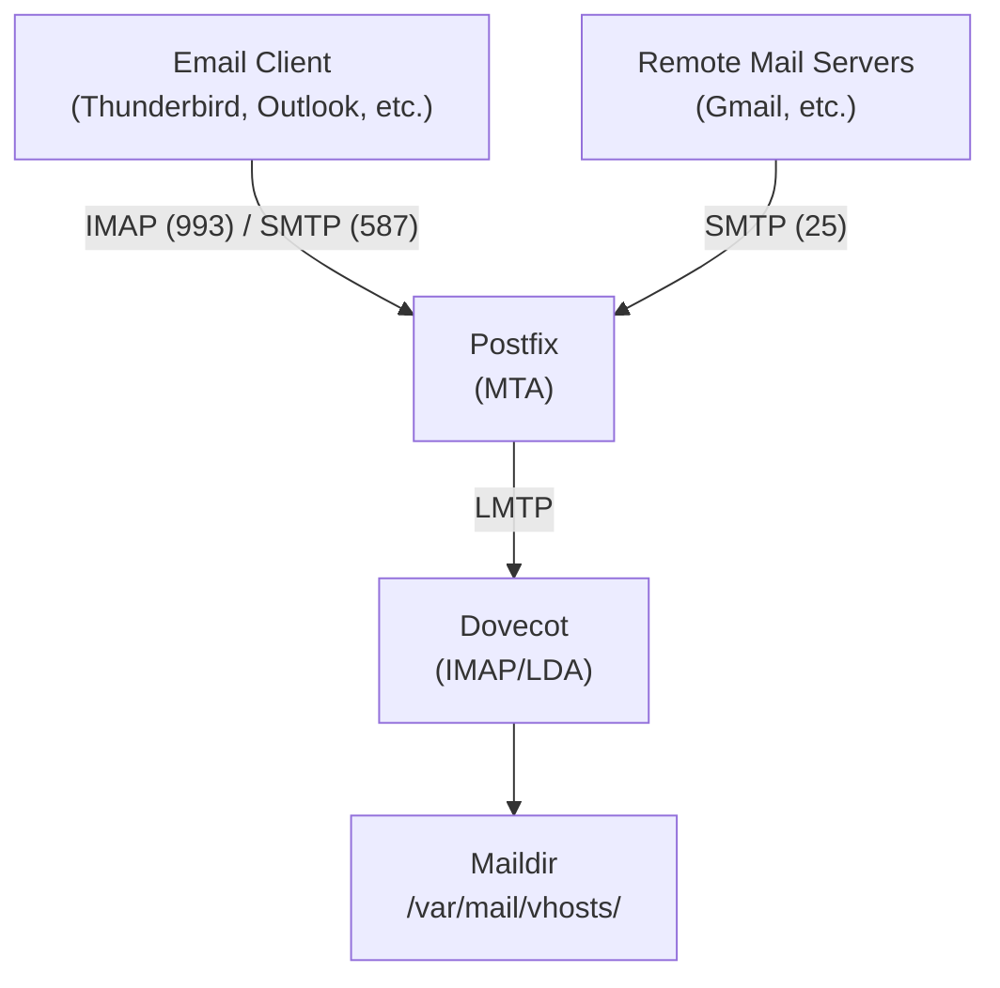

# How to Set Up a Full Mail Server with Postfix and Dovecot on Ubuntu

Author: [nawazdhandala](https://www.github.com/nawazdhandala)

Tags: Ubuntu, Postfix, Dovecot, Mail Server, Email, Tutorial

Description: Complete guide to setting up a production mail server with Postfix MTA and Dovecot IMAP/POP3 on Ubuntu.

---

Setting up your own mail server gives you complete control over your email infrastructure, enhanced privacy, and the flexibility to customize every aspect of email handling. This comprehensive guide walks you through setting up a production-ready mail server using Postfix as the Mail Transfer Agent (MTA) and Dovecot for IMAP/POP3 access on Ubuntu.

## Table of Contents

1. [Understanding Mail Server Components](#understanding-mail-server-components)
2. [Prerequisites](#prerequisites)
3. [Installing Postfix](#installing-postfix)
4. [Postfix Configuration](#postfix-configuration)
5. [Installing Dovecot](#installing-dovecot)
6. [Dovecot Configuration](#dovecot-configuration)
7. [SSL/TLS with Let's Encrypt](#ssltls-with-lets-encrypt)
8. [Virtual Mailboxes](#virtual-mailboxes)
9. [User Authentication](#user-authentication)
10. [SASL Authentication](#sasl-authentication)
11. [Mail Filtering with Sieve](#mail-filtering-with-sieve)
12. [Testing Mail Delivery](#testing-mail-delivery)
13. [Troubleshooting](#troubleshooting)

---

## Understanding Mail Server Components

Before diving into the setup, it is essential to understand the key components of a mail server:

### Mail Transfer Agent (MTA) - Postfix

Postfix is responsible for:
- **Sending outgoing mail** to other mail servers via SMTP (port 25)
- **Receiving incoming mail** from other servers
- **Routing mail** to the correct destination
- **Queue management** for retry handling

### Mail Delivery Agent (MDA) - Dovecot

Dovecot handles:
- **IMAP access** (port 993 for SSL, port 143 for STARTTLS)
- **POP3 access** (port 995 for SSL, port 110 for STARTTLS)
- **Local mail delivery** to user mailboxes
- **User authentication**

### How They Work Together

```
Internet → Postfix (SMTP) → Dovecot LDA → Mailbox → Dovecot (IMAP/POP3) → Email Client
                ↓
         Outgoing Mail → Remote Mail Servers
```

---

## Prerequisites

### System Requirements

- Ubuntu 22.04 LTS or newer (this guide uses Ubuntu 24.04)
- A server with a static public IP address
- At least 1GB RAM and 20GB storage
- Root or sudo access

### DNS Configuration

Proper DNS records are critical for mail delivery and avoiding spam filters.

#### Required DNS Records

```bash
# A Record - Points your mail server hostname to its IP
mail.example.com.    IN  A      203.0.113.10

# MX Record - Tells other servers where to deliver mail for your domain
example.com.         IN  MX  10  mail.example.com.

# Reverse DNS (PTR) - Must match your mail server hostname
# Contact your hosting provider to set this up
10.113.0.203.in-addr.arpa.  IN  PTR  mail.example.com.

# SPF Record - Specifies which servers can send mail for your domain
example.com.         IN  TXT    "v=spf1 mx ip4:203.0.113.10 -all"

# DKIM Record - Added after DKIM setup (see later section)
# DMARC Record - Policy for handling authentication failures
_dmarc.example.com.  IN  TXT    "v=DMARC1; p=quarantine; rua=mailto:postmaster@example.com"
```

### Setting the Hostname

```bash
# Set the hostname permanently
sudo hostnamectl set-hostname mail.example.com

# Verify the hostname
hostname -f
# Expected output: mail.example.com

# Update /etc/hosts
sudo nano /etc/hosts
```

Add the following line:

```
# /etc/hosts
# Format: IP_ADDRESS    FQDN    SHORT_NAME
203.0.113.10    mail.example.com    mail
127.0.1.1       mail.example.com    mail
```

### Open Required Firewall Ports

```bash
# Allow essential mail ports through UFW
sudo ufw allow 25/tcp    # SMTP - receiving mail from other servers
sudo ufw allow 587/tcp   # Submission - authenticated client sending
sudo ufw allow 465/tcp   # SMTPS - SMTP over SSL (legacy but still used)
sudo ufw allow 993/tcp   # IMAPS - IMAP over SSL
sudo ufw allow 995/tcp   # POP3S - POP3 over SSL
sudo ufw allow 143/tcp   # IMAP with STARTTLS
sudo ufw allow 110/tcp   # POP3 with STARTTLS

# Reload firewall rules
sudo ufw reload

# Verify open ports
sudo ufw status verbose
```

---

## Installing Postfix

### Installation

```bash
# Update package lists
sudo apt update

# Install Postfix and required utilities
# mailutils provides helpful command-line mail tools
sudo apt install -y postfix postfix-mysql mailutils

# During installation, select:
# - "Internet Site" for mail configuration type
# - Enter your domain (example.com) as the system mail name
```

If you need to reconfigure later:

```bash
# Reconfigure Postfix interactively
sudo dpkg-reconfigure postfix
```

### Understanding the Postfix Directory Structure

```bash
# Main configuration files
/etc/postfix/main.cf      # Primary configuration
/etc/postfix/master.cf    # Service definitions
/etc/postfix/virtual       # Virtual alias mappings

# Mail queue directories
/var/spool/postfix/       # Mail queue location

# Log files
/var/log/mail.log         # Main mail log
/var/log/mail.err         # Error log
```

---

## Postfix Configuration

### Main Configuration File

Create a comprehensive `/etc/postfix/main.cf`:

```bash
# Backup the original configuration
sudo cp /etc/postfix/main.cf /etc/postfix/main.cf.backup

# Edit the main configuration
sudo nano /etc/postfix/main.cf
```

```ini
# /etc/postfix/main.cf
# Postfix Mail Server Configuration
# Last updated: 2026-01-15

#=============================================================================
# BASIC SETTINGS
#=============================================================================

# The internet hostname of this mail system
myhostname = mail.example.com

# The domain name that locally-posted mail appears to come from
mydomain = example.com

# The domain name appended to mail from local users
myorigin = $mydomain

# The list of domains this server considers itself the final destination for
mydestination = $myhostname, localhost.$mydomain, localhost

# Network interfaces to listen on (all interfaces)
inet_interfaces = all

# IP protocols to use (both IPv4 and IPv6)
inet_protocols = all

# Trusted networks that can relay mail through this server
# IMPORTANT: Only list your own networks here to prevent open relay
mynetworks = 127.0.0.0/8 [::ffff:127.0.0.0]/104 [::1]/128

#=============================================================================
# TLS/SSL SETTINGS - SMTP Server (receiving mail)
#=============================================================================

# Enable TLS for incoming connections
smtpd_tls_cert_file = /etc/letsencrypt/live/mail.example.com/fullchain.pem
smtpd_tls_key_file = /etc/letsencrypt/live/mail.example.com/privkey.pem
smtpd_tls_security_level = may
smtpd_tls_loglevel = 1

# TLS session cache for performance
smtpd_tls_session_cache_database = btree:${data_directory}/smtpd_scache

# Modern TLS protocols only (disable SSLv2, SSLv3, TLSv1.0, TLSv1.1)
smtpd_tls_protocols = !SSLv2, !SSLv3, !TLSv1, !TLSv1.1
smtpd_tls_mandatory_protocols = !SSLv2, !SSLv3, !TLSv1, !TLSv1.1

# Strong cipher suites
smtpd_tls_mandatory_ciphers = high
smtpd_tls_exclude_ciphers = aNULL, eNULL, EXPORT, DES, RC4, MD5, PSK, aECDH, EDH-DSS-DES-CBC3-SHA, EDH-RSA-DES-CBC3-SHA, KRB5-DES, CBC3-SHA

#=============================================================================
# TLS/SSL SETTINGS - SMTP Client (sending mail)
#=============================================================================

# Enable TLS for outgoing connections
smtp_tls_security_level = may
smtp_tls_loglevel = 1
smtp_tls_session_cache_database = btree:${data_directory}/smtp_scache

#=============================================================================
# SASL AUTHENTICATION
#=============================================================================

# Enable SASL authentication for SMTP
smtpd_sasl_type = dovecot
smtpd_sasl_path = private/auth
smtpd_sasl_auth_enable = yes

# Security options for SASL
# noanonymous: Reject anonymous authentication
# noplaintext: Reject plaintext auth without TLS (handled by smtpd_tls_auth_only)
smtpd_sasl_security_options = noanonymous, noplaintext
smtpd_sasl_tls_security_options = noanonymous

# Only allow authentication over TLS
smtpd_tls_auth_only = yes

#=============================================================================
# RECIPIENT RESTRICTIONS - Anti-spam measures
#=============================================================================

# Restrictions applied to RCPT TO commands
smtpd_recipient_restrictions =
    # Allow mail from authenticated users
    permit_sasl_authenticated,
    # Allow mail from trusted networks
    permit_mynetworks,
    # Reject mail to non-existent recipients
    reject_unauth_destination,
    # Reject clients without valid reverse DNS
    reject_unknown_reverse_client_hostname,
    # Reject invalid hostnames in HELO
    reject_invalid_helo_hostname,
    # Reject non-FQDN hostnames in HELO
    reject_non_fqdn_helo_hostname,
    # Reject non-FQDN sender addresses
    reject_non_fqdn_sender,
    # Reject non-FQDN recipient addresses
    reject_non_fqdn_recipient,
    # Reject unknown sender domains
    reject_unknown_sender_domain,
    # Reject unknown recipient domains
    reject_unknown_recipient_domain,
    # Use RBL (Realtime Blackhole List)
    reject_rbl_client zen.spamhaus.org,
    reject_rbl_client bl.spamcop.net,
    # Allow everything else
    permit

# Restrictions applied to HELO/EHLO commands
smtpd_helo_restrictions =
    permit_mynetworks,
    permit_sasl_authenticated,
    reject_invalid_helo_hostname,
    reject_non_fqdn_helo_hostname

# Require clients to send HELO/EHLO
smtpd_helo_required = yes

#=============================================================================
# VIRTUAL MAILBOX CONFIGURATION
#=============================================================================

# Virtual mailbox domain configuration
virtual_mailbox_domains = example.com
virtual_mailbox_base = /var/mail/vhosts
virtual_mailbox_maps = hash:/etc/postfix/vmailbox
virtual_alias_maps = hash:/etc/postfix/virtual
virtual_minimum_uid = 1000
virtual_uid_maps = static:5000
virtual_gid_maps = static:5000

# Use Dovecot for local delivery
virtual_transport = lmtp:unix:private/dovecot-lmtp

#=============================================================================
# MESSAGE SIZE AND LIMITS
#=============================================================================

# Maximum message size (50MB)
message_size_limit = 52428800

# Maximum mailbox size (1GB) - 0 means unlimited
mailbox_size_limit = 0

# Maximum number of recipients per message
smtpd_recipient_limit = 100

#=============================================================================
# QUEUE SETTINGS
#=============================================================================

# Time to keep deferred messages in queue (5 days)
maximal_queue_lifetime = 5d

# Time to keep bounced messages
bounce_queue_lifetime = 5d

# Delay before first retry
minimal_backoff_time = 300s

# Maximum delay between retries
maximal_backoff_time = 4000s

#=============================================================================
# MISCELLANEOUS
#=============================================================================

# Banner shown to connecting clients
smtpd_banner = $myhostname ESMTP $mail_name

# Disable VRFY command (security measure)
disable_vrfy_command = yes

# Address to notify about problems
# notify_classes = bounce, delay, policy, protocol, resource, software
notify_classes = resource, software

# Compatibility level
compatibility_level = 3.6
```

### Master Configuration File

Edit `/etc/postfix/master.cf` to enable submission ports:

```bash
sudo nano /etc/postfix/master.cf
```

```ini
# /etc/postfix/master.cf
# Postfix master process configuration
#
# ==========================================================================
# service type  private unpriv  chroot  wakeup  maxproc command + args
#               (yes)   (yes)   (no)    (never) (100)
# ==========================================================================

#-----------------------------------------------------------------------------
# Standard SMTP - Port 25
# Used for server-to-server mail transfer
#-----------------------------------------------------------------------------
smtp      inet  n       -       y       -       -       smtpd

#-----------------------------------------------------------------------------
# Submission - Port 587
# Used for authenticated client mail submission with STARTTLS
#-----------------------------------------------------------------------------
submission inet n       -       y       -       -       smtpd
  -o syslog_name=postfix/submission
  -o smtpd_tls_security_level=encrypt
  -o smtpd_sasl_auth_enable=yes
  -o smtpd_tls_auth_only=yes
  -o smtpd_reject_unlisted_recipient=no
  -o smtpd_client_restrictions=permit_sasl_authenticated,reject
  -o smtpd_relay_restrictions=permit_sasl_authenticated,reject
  -o milter_macro_daemon_name=ORIGINATING

#-----------------------------------------------------------------------------
# SMTPS - Port 465
# Used for authenticated client mail submission with implicit TLS
# (Legacy but still supported by many clients)
#-----------------------------------------------------------------------------
smtps     inet  n       -       y       -       -       smtpd
  -o syslog_name=postfix/smtps
  -o smtpd_tls_wrappermode=yes
  -o smtpd_sasl_auth_enable=yes
  -o smtpd_reject_unlisted_recipient=no
  -o smtpd_client_restrictions=permit_sasl_authenticated,reject
  -o smtpd_relay_restrictions=permit_sasl_authenticated,reject
  -o milter_macro_daemon_name=ORIGINATING

#-----------------------------------------------------------------------------
# Local delivery and other internal services
#-----------------------------------------------------------------------------
pickup    unix  n       -       y       60      1       pickup
cleanup   unix  n       -       y       -       0       cleanup
qmgr      unix  n       -       n       300     1       qmgr
tlsmgr    unix  -       -       y       1000?   1       tlsmgr
rewrite   unix  -       -       y       -       -       trivial-rewrite
bounce    unix  -       -       y       -       0       bounce
defer     unix  -       -       y       -       0       bounce
trace     unix  -       -       y       -       0       bounce
verify    unix  -       -       y       -       1       verify
flush     unix  n       -       y       1000?   0       flush
proxymap  unix  -       -       n       -       -       proxymap
proxywrite unix -       -       n       -       1       proxymap
smtp      unix  -       -       y       -       -       smtp
relay     unix  -       -       y       -       -       smtp
        -o syslog_name=postfix/$service_name
showq     unix  n       -       y       -       -       showq
error     unix  -       -       y       -       -       error
retry     unix  -       -       y       -       -       error
discard   unix  -       -       y       -       -       discard
local     unix  -       n       n       -       -       local
virtual   unix  -       n       n       -       -       virtual
lmtp      unix  -       -       y       -       -       lmtp
anvil     unix  -       -       y       -       1       anvil
scache    unix  -       -       y       -       1       scache
postlog   unix-dgram n  -       n       -       1       postlogd
```

---

## Installing Dovecot

### Installation

```bash
# Install Dovecot with IMAP, POP3, LMTP, and Sieve support
sudo apt install -y dovecot-core dovecot-imapd dovecot-pop3d dovecot-lmtpd dovecot-sieve dovecot-managesieved

# Verify installation
dovecot --version
```

### Understanding Dovecot Directory Structure

```bash
# Configuration files
/etc/dovecot/dovecot.conf           # Main configuration
/etc/dovecot/conf.d/                 # Modular configuration directory
/etc/dovecot/conf.d/10-auth.conf    # Authentication settings
/etc/dovecot/conf.d/10-mail.conf    # Mail location settings
/etc/dovecot/conf.d/10-master.conf  # Service definitions
/etc/dovecot/conf.d/10-ssl.conf     # SSL/TLS settings
/etc/dovecot/conf.d/15-lda.conf     # Local delivery agent
/etc/dovecot/conf.d/20-imap.conf    # IMAP-specific settings
/etc/dovecot/conf.d/20-lmtp.conf    # LMTP settings
/etc/dovecot/conf.d/90-sieve.conf   # Sieve filtering

# Log files
/var/log/dovecot.log                # Main Dovecot log (if configured)
/var/log/mail.log                   # Combined mail log
```

---

## Dovecot Configuration

### Main Configuration

Edit `/etc/dovecot/dovecot.conf`:

```bash
sudo nano /etc/dovecot/dovecot.conf
```

```ini
# /etc/dovecot/dovecot.conf
# Dovecot Main Configuration

# Enable IMAP and LMTP protocols
# POP3 is optional - uncomment if needed
protocols = imap lmtp sieve

# Listen on all interfaces
listen = *, ::

# Include modular configuration files
!include conf.d/*.conf
!include_try local.conf
```

### Authentication Configuration

Edit `/etc/dovecot/conf.d/10-auth.conf`:

```bash
sudo nano /etc/dovecot/conf.d/10-auth.conf
```

```ini
# /etc/dovecot/conf.d/10-auth.conf
# Authentication configuration

#-----------------------------------------------------------------------------
# AUTHENTICATION MECHANISMS
#-----------------------------------------------------------------------------

# Disable plain text authentication without SSL/TLS
disable_plaintext_auth = yes

# Authentication mechanisms to allow
# PLAIN and LOGIN are most compatible with email clients
auth_mechanisms = plain login

#-----------------------------------------------------------------------------
# PASSWORD DATABASE
#-----------------------------------------------------------------------------

# Include password database configuration
!include auth-passwdfile.conf.ext

#-----------------------------------------------------------------------------
# USER DATABASE
#-----------------------------------------------------------------------------

# Uncomment to enable verbose authentication logging (useful for debugging)
#auth_verbose = yes
#auth_verbose_passwords = no
#auth_debug = yes
#auth_debug_passwords = no
```

Create the password file authentication configuration:

```bash
sudo nano /etc/dovecot/conf.d/auth-passwdfile.conf.ext
```

```ini
# /etc/dovecot/conf.d/auth-passwdfile.conf.ext
# Password file authentication configuration

# Password database using passwd-file format
passdb {
  driver = passwd-file
  # Password file location
  # Format: user:{scheme}password:uid:gid:gecos:home:shell:extra_fields
  args = scheme=SHA512-CRYPT username_format=%u /etc/dovecot/users
}

# User database
userdb {
  driver = passwd-file
  args = username_format=%u /etc/dovecot/users

  # Default values for users
  default_fields = uid=vmail gid=vmail home=/var/mail/vhosts/%d/%n
}
```

### Mail Location Configuration

Edit `/etc/dovecot/conf.d/10-mail.conf`:

```bash
sudo nano /etc/dovecot/conf.d/10-mail.conf
```

```ini
# /etc/dovecot/conf.d/10-mail.conf
# Mail location and namespace configuration

#-----------------------------------------------------------------------------
# MAIL LOCATION
#-----------------------------------------------------------------------------

# Maildir format with mail stored under /var/mail/vhosts/domain/user
# Maildir is preferred over mbox for better performance and reliability
mail_location = maildir:/var/mail/vhosts/%d/%n/Maildir

#-----------------------------------------------------------------------------
# NAMESPACES
#-----------------------------------------------------------------------------

namespace inbox {
  # The inbox namespace is the default
  inbox = yes

  # Define standard mail folders
  mailbox Drafts {
    special_use = \Drafts
    auto = subscribe
  }

  mailbox Junk {
    special_use = \Junk
    auto = subscribe
  }

  mailbox Sent {
    special_use = \Sent
    auto = subscribe
  }

  mailbox "Sent Messages" {
    special_use = \Sent
  }

  mailbox Trash {
    special_use = \Trash
    auto = subscribe
  }

  mailbox Archive {
    special_use = \Archive
    auto = subscribe
  }
}

#-----------------------------------------------------------------------------
# MAIL USER AND GROUP
#-----------------------------------------------------------------------------

# User and group for mail storage
mail_uid = vmail
mail_gid = vmail

# Allow Dovecot to access mail storage
mail_privileged_group = vmail

# First valid UID/GID
first_valid_uid = 1000
first_valid_gid = 1000
```

### SSL/TLS Configuration

Edit `/etc/dovecot/conf.d/10-ssl.conf`:

```bash
sudo nano /etc/dovecot/conf.d/10-ssl.conf
```

```ini
# /etc/dovecot/conf.d/10-ssl.conf
# SSL/TLS configuration

#-----------------------------------------------------------------------------
# SSL/TLS SETTINGS
#-----------------------------------------------------------------------------

# Require SSL/TLS
ssl = required

# SSL certificate and key files (from Let's Encrypt)
ssl_cert = </etc/letsencrypt/live/mail.example.com/fullchain.pem
ssl_key = </etc/letsencrypt/live/mail.example.com/privkey.pem

# Prefer server cipher order
ssl_prefer_server_ciphers = yes

# Minimum SSL protocol version (TLS 1.2 minimum)
ssl_min_protocol = TLSv1.2

# Strong cipher suites
ssl_cipher_list = ECDHE-ECDSA-AES128-GCM-SHA256:ECDHE-RSA-AES128-GCM-SHA256:ECDHE-ECDSA-AES256-GCM-SHA384:ECDHE-RSA-AES256-GCM-SHA384:ECDHE-ECDSA-CHACHA20-POLY1305:ECDHE-RSA-CHACHA20-POLY1305:DHE-RSA-AES128-GCM-SHA256:DHE-RSA-AES256-GCM-SHA384

# DH parameters file (generate with: openssl dhparam -out /etc/dovecot/dh.pem 4096)
ssl_dh = </etc/dovecot/dh.pem
```

Generate DH parameters:

```bash
# Generate strong DH parameters (this takes several minutes)
sudo openssl dhparam -out /etc/dovecot/dh.pem 4096
```

### Master Configuration (Services)

Edit `/etc/dovecot/conf.d/10-master.conf`:

```bash
sudo nano /etc/dovecot/conf.d/10-master.conf
```

```ini
# /etc/dovecot/conf.d/10-master.conf
# Service definitions

#-----------------------------------------------------------------------------
# IMAP SERVICE
#-----------------------------------------------------------------------------

service imap-login {
  inet_listener imap {
    # Standard IMAP port with STARTTLS
    port = 143
  }
  inet_listener imaps {
    # IMAP over SSL
    port = 993
    ssl = yes
  }
}

service imap {
  # Limit concurrent IMAP processes per user
  process_limit = 1024
}

#-----------------------------------------------------------------------------
# POP3 SERVICE (uncomment if needed)
#-----------------------------------------------------------------------------

#service pop3-login {
#  inet_listener pop3 {
#    port = 110
#  }
#  inet_listener pop3s {
#    port = 995
#    ssl = yes
#  }
#}

#-----------------------------------------------------------------------------
# LMTP SERVICE - Local Mail Transfer Protocol
# Used by Postfix to deliver mail to Dovecot
#-----------------------------------------------------------------------------

service lmtp {
  # Create a Unix socket for Postfix to connect to
  unix_listener /var/spool/postfix/private/dovecot-lmtp {
    mode = 0600
    user = postfix
    group = postfix
  }

  # Process settings
  process_min_avail = 5
}

#-----------------------------------------------------------------------------
# AUTHENTICATION SERVICE
# Provides SASL authentication for Postfix
#-----------------------------------------------------------------------------

service auth {
  # Auth socket for Postfix SASL
  unix_listener /var/spool/postfix/private/auth {
    mode = 0660
    user = postfix
    group = postfix
  }

  # Auth socket for other Dovecot services
  unix_listener auth-userdb {
    mode = 0600
    user = vmail
    group = vmail
  }

  # Run auth as root to access shadow passwords
  user = dovecot
}

#-----------------------------------------------------------------------------
# AUTH WORKER SERVICE
#-----------------------------------------------------------------------------

service auth-worker {
  user = vmail
}

#-----------------------------------------------------------------------------
# STATS SERVICE
#-----------------------------------------------------------------------------

service stats {
  unix_listener stats-reader {
    user = vmail
    group = vmail
    mode = 0660
  }

  unix_listener stats-writer {
    user = vmail
    group = vmail
    mode = 0660
  }
}
```

### LDA Configuration

Edit `/etc/dovecot/conf.d/15-lda.conf`:

```bash
sudo nano /etc/dovecot/conf.d/15-lda.conf
```

```ini
# /etc/dovecot/conf.d/15-lda.conf
# Local Delivery Agent configuration

#-----------------------------------------------------------------------------
# DELIVERY SETTINGS
#-----------------------------------------------------------------------------

# Postmaster address for error notifications
postmaster_address = postmaster@example.com

# Hostname to use in delivered message headers
hostname = mail.example.com

# Enable Sieve filtering
protocol lda {
  mail_plugins = $mail_plugins sieve
}

# LMTP-specific settings
protocol lmtp {
  mail_plugins = $mail_plugins sieve
}
```

---

## SSL/TLS with Let's Encrypt

### Installing Certbot

```bash
# Install Certbot
sudo apt install -y certbot

# Stop any services using port 80 temporarily
sudo systemctl stop apache2 2>/dev/null || true
sudo systemctl stop nginx 2>/dev/null || true
```

### Obtaining SSL Certificates

```bash
# Obtain certificate using standalone mode
sudo certbot certonly --standalone \
    -d mail.example.com \
    --email admin@example.com \
    --agree-tos \
    --non-interactive

# Verify certificate was obtained
sudo ls -la /etc/letsencrypt/live/mail.example.com/
```

### Setting Up Automatic Renewal

```bash
# Create a renewal hook to restart mail services
sudo nano /etc/letsencrypt/renewal-hooks/deploy/mail-services.sh
```

```bash
#!/bin/bash
# /etc/letsencrypt/renewal-hooks/deploy/mail-services.sh
# Restart mail services after certificate renewal

# Restart Postfix
systemctl restart postfix

# Restart Dovecot
systemctl restart dovecot

# Log the renewal
echo "$(date): Mail certificates renewed and services restarted" >> /var/log/letsencrypt-renewal.log
```

```bash
# Make the hook executable
sudo chmod +x /etc/letsencrypt/renewal-hooks/deploy/mail-services.sh

# Test automatic renewal
sudo certbot renew --dry-run
```

### Cron Job for Renewal

```bash
# Certbot installs a systemd timer automatically, but you can verify
sudo systemctl status certbot.timer

# Or add a cron job as backup
sudo crontab -e
```

Add:

```
# Renew Let's Encrypt certificates daily at 3:30 AM
30 3 * * * /usr/bin/certbot renew --quiet
```

---

## Virtual Mailboxes

### Creating the Mail User and Directory Structure

```bash
# Create a dedicated mail user and group
sudo groupadd -g 5000 vmail
sudo useradd -g vmail -u 5000 -d /var/mail/vhosts -s /usr/sbin/nologin -m vmail

# Create the base mail directory
sudo mkdir -p /var/mail/vhosts/example.com

# Set proper ownership and permissions
sudo chown -R vmail:vmail /var/mail/vhosts
sudo chmod -R 770 /var/mail/vhosts
```

### Configuring Virtual Mailboxes in Postfix

Create the virtual mailbox file:

```bash
sudo nano /etc/postfix/vmailbox
```

```
# /etc/postfix/vmailbox
# Virtual mailbox mapping
# Format: email_address    mailbox_path (relative to virtual_mailbox_base)

# User mailboxes
admin@example.com       example.com/admin/Maildir/
info@example.com        example.com/info/Maildir/
support@example.com     example.com/support/Maildir/
john@example.com        example.com/john/Maildir/
jane@example.com        example.com/jane/Maildir/
```

Create the virtual alias file:

```bash
sudo nano /etc/postfix/virtual
```

```
# /etc/postfix/virtual
# Virtual alias mapping
# Format: alias_address    destination_address

# System aliases
postmaster@example.com  admin@example.com
abuse@example.com       admin@example.com
webmaster@example.com   admin@example.com
hostmaster@example.com  admin@example.com

# Department aliases
sales@example.com       john@example.com,jane@example.com
contact@example.com     info@example.com

# Catch-all (use with caution - attracts spam)
# @example.com          admin@example.com
```

Generate the hash databases:

```bash
# Generate Postfix lookup tables
sudo postmap /etc/postfix/vmailbox
sudo postmap /etc/postfix/virtual

# Verify the databases were created
ls -la /etc/postfix/vmailbox.db /etc/postfix/virtual.db
```

---

## User Authentication

### Creating User Password File

```bash
# Create the users file
sudo nano /etc/dovecot/users
```

```
# /etc/dovecot/users
# User authentication database
# Format: user:{scheme}password:uid:gid:gecos:home:shell:extra_fields
#
# Generate passwords with: doveadm pw -s SHA512-CRYPT

# Example users (replace with actual hashed passwords)
admin@example.com:{SHA512-CRYPT}$6$rounds=100000$randomsalt$hashedpasswordhere:5000:5000::/var/mail/vhosts/example.com/admin::
info@example.com:{SHA512-CRYPT}$6$rounds=100000$randomsalt$hashedpasswordhere:5000:5000::/var/mail/vhosts/example.com/info::
support@example.com:{SHA512-CRYPT}$6$rounds=100000$randomsalt$hashedpasswordhere:5000:5000::/var/mail/vhosts/example.com/support::
john@example.com:{SHA512-CRYPT}$6$rounds=100000$randomsalt$hashedpasswordhere:5000:5000::/var/mail/vhosts/example.com/john::
jane@example.com:{SHA512-CRYPT}$6$rounds=100000$randomsalt$hashedpasswordhere:5000:5000::/var/mail/vhosts/example.com/jane::
```

### Generating Password Hashes

```bash
# Generate a SHA512-CRYPT password hash
doveadm pw -s SHA512-CRYPT

# Enter your password when prompted
# Copy the entire output including {SHA512-CRYPT} prefix

# Example output:
# {SHA512-CRYPT}$6$kL3x9QmE7vHjK2Rn$Y7h...long.hash.string...
```

### Script to Add New Users

Create a helper script:

```bash
sudo nano /usr/local/bin/mail-adduser
```

```bash
#!/bin/bash
# /usr/local/bin/mail-adduser
# Script to add new mail users
#
# Usage: mail-adduser user@domain.com

set -e

if [ -z "$1" ]; then
    echo "Usage: $0 user@domain.com"
    exit 1
fi

EMAIL="$1"
DOMAIN=$(echo "$EMAIL" | cut -d@ -f2)
USER=$(echo "$EMAIL" | cut -d@ -f1)
VMAIL_BASE="/var/mail/vhosts"

# Validate email format
if ! echo "$EMAIL" | grep -qE "^[a-zA-Z0-9._%+-]+@[a-zA-Z0-9.-]+\.[a-zA-Z]{2,}$"; then
    echo "Error: Invalid email format"
    exit 1
fi

# Check if user already exists
if grep -q "^${EMAIL}:" /etc/dovecot/users 2>/dev/null; then
    echo "Error: User $EMAIL already exists"
    exit 1
fi

# Generate password hash
echo "Enter password for $EMAIL:"
PASSWORD_HASH=$(doveadm pw -s SHA512-CRYPT)

# Create user directory
sudo mkdir -p "${VMAIL_BASE}/${DOMAIN}/${USER}/Maildir"
sudo chown -R vmail:vmail "${VMAIL_BASE}/${DOMAIN}/${USER}"

# Add user to Dovecot users file
echo "${EMAIL}:${PASSWORD_HASH}:5000:5000::${VMAIL_BASE}/${DOMAIN}/${USER}::" | sudo tee -a /etc/dovecot/users > /dev/null

# Add to Postfix virtual mailbox
echo "${EMAIL}    ${DOMAIN}/${USER}/Maildir/" | sudo tee -a /etc/postfix/vmailbox > /dev/null

# Regenerate Postfix lookup tables
sudo postmap /etc/postfix/vmailbox

echo "User $EMAIL created successfully!"
echo "Mail directory: ${VMAIL_BASE}/${DOMAIN}/${USER}/Maildir"
```

```bash
# Make the script executable
sudo chmod +x /usr/local/bin/mail-adduser

# Usage example
sudo mail-adduser newuser@example.com
```

---

## SASL Authentication

SASL (Simple Authentication and Security Layer) allows Postfix to authenticate users through Dovecot.

### Postfix SASL Configuration

The SASL configuration in `/etc/postfix/main.cf` (already added above):

```ini
# SASL Authentication settings
smtpd_sasl_type = dovecot
smtpd_sasl_path = private/auth
smtpd_sasl_auth_enable = yes
smtpd_sasl_security_options = noanonymous, noplaintext
smtpd_sasl_tls_security_options = noanonymous
smtpd_tls_auth_only = yes
```

### Dovecot Auth Socket Configuration

Ensure the auth socket is configured in `/etc/dovecot/conf.d/10-master.conf` (already added above):

```ini
service auth {
  unix_listener /var/spool/postfix/private/auth {
    mode = 0660
    user = postfix
    group = postfix
  }
}
```

### Verify SASL Setup

```bash
# Check that the auth socket exists after starting Dovecot
sudo systemctl restart dovecot
ls -la /var/spool/postfix/private/auth

# Expected output:
# srw-rw---- 1 postfix postfix 0 Jan 15 10:00 /var/spool/postfix/private/auth

# Test authentication
doveadm auth test admin@example.com
# Enter password when prompted
```

---

## Mail Filtering with Sieve

Sieve is a powerful mail filtering language that allows users to automatically sort and process incoming mail.

### Sieve Configuration

Edit `/etc/dovecot/conf.d/90-sieve.conf`:

```bash
sudo nano /etc/dovecot/conf.d/90-sieve.conf
```

```ini
# /etc/dovecot/conf.d/90-sieve.conf
# Sieve mail filtering configuration

plugin {
  #---------------------------------------------------------------------------
  # SIEVE SCRIPT LOCATIONS
  #---------------------------------------------------------------------------

  # User-specific sieve script location
  sieve = file:~/sieve;active=~/.dovecot.sieve

  # Directory for personal sieve scripts
  sieve_dir = ~/sieve

  # Global sieve scripts run before user scripts
  sieve_before = /var/mail/vhosts/sieve/before.d/

  # Global sieve scripts run after user scripts
  sieve_after = /var/mail/vhosts/sieve/after.d/

  # Default sieve script for users without their own
  sieve_default = /var/mail/vhosts/sieve/default.sieve

  #---------------------------------------------------------------------------
  # SIEVE EXTENSIONS
  #---------------------------------------------------------------------------

  # Enable commonly used sieve extensions
  sieve_extensions = +fileinto +reject +envelope +variables +imap4flags +notify +include +body +relational +regex +subaddress +copy +mailbox +date +index +duplicate +vacation +vacation-seconds

  # Global extensions available to all users
  sieve_global_extensions = +vnd.dovecot.pipe +vnd.dovecot.environment

  #---------------------------------------------------------------------------
  # VACATION AUTO-REPLY SETTINGS
  #---------------------------------------------------------------------------

  # Minimum time between vacation responses to same sender
  sieve_vacation_min_period = 1d

  # Maximum vacation period
  sieve_vacation_max_period = 60d

  # Default vacation period
  sieve_vacation_default_period = 7d

  #---------------------------------------------------------------------------
  # MANAGESIEVE SERVICE SETTINGS
  #---------------------------------------------------------------------------

  # Maximum size of sieve scripts (512KB)
  sieve_max_script_size = 512K

  # Maximum number of actions in a script
  sieve_max_actions = 32

  # Maximum number of redirects per script
  sieve_max_redirects = 4
}

#-----------------------------------------------------------------------------
# MANAGESIEVE SERVICE
# Allows users to manage their sieve scripts remotely
#-----------------------------------------------------------------------------

service managesieve-login {
  inet_listener sieve {
    port = 4190
  }
}

service managesieve {
  process_limit = 256
}

protocol sieve {
  managesieve_logout_format = bytes=%i/%o
}
```

### Creating Global Sieve Scripts

```bash
# Create sieve directories
sudo mkdir -p /var/mail/vhosts/sieve/{before.d,after.d}
sudo chown -R vmail:vmail /var/mail/vhosts/sieve
```

Create a default sieve script:

```bash
sudo nano /var/mail/vhosts/sieve/default.sieve
```

```sieve
# /var/mail/vhosts/sieve/default.sieve
# Default sieve script for all users

require ["fileinto", "mailbox"];

# Move spam to Junk folder
if header :contains "X-Spam-Flag" "YES" {
    fileinto :create "Junk";
    stop;
}

# Keep all other mail in inbox
keep;
```

Create a global spam filter (runs before user scripts):

```bash
sudo nano /var/mail/vhosts/sieve/before.d/00-spam.sieve
```

```sieve
# /var/mail/vhosts/sieve/before.d/00-spam.sieve
# Global spam filtering - runs before user scripts

require ["fileinto", "mailbox", "imap4flags", "variables", "envelope"];

# -------------------------------------------------------------------
# SPAM DETECTION
# -------------------------------------------------------------------

# Check for spam flag from SpamAssassin or similar
if header :contains "X-Spam-Status" "Yes" {
    # Mark as read and file to Junk
    setflag "\\Seen";
    fileinto :create "Junk";
    stop;
}

# Check for high spam score
if header :value "gt" :comparator "i;ascii-numeric" "X-Spam-Score" "5" {
    fileinto :create "Junk";
    stop;
}

# -------------------------------------------------------------------
# KNOWN BAD PATTERNS
# -------------------------------------------------------------------

# Reject mail with executable attachments
if header :contains "Content-Type" ["application/x-msdownload", "application/x-msdos-program"] {
    fileinto :create "Junk";
    stop;
}
```

Compile the sieve scripts:

```bash
# Compile sieve scripts
sudo sievec /var/mail/vhosts/sieve/default.sieve
sudo sievec /var/mail/vhosts/sieve/before.d/00-spam.sieve

# Set proper ownership
sudo chown -R vmail:vmail /var/mail/vhosts/sieve
```

### Example User Sieve Script

Users can create their own sieve scripts in their mail directory:

```sieve
# Example user sieve script (~/.dovecot.sieve or ~/sieve/default.sieve)
# Personal mail filtering rules

require ["fileinto", "mailbox", "envelope", "variables", "vacation", "body", "imap4flags"];

# -------------------------------------------------------------------
# FOLDER ORGANIZATION
# -------------------------------------------------------------------

# Sort mailing list messages
if header :contains "List-Id" "dev-team" {
    fileinto :create "Lists.Development";
    stop;
}

if header :contains "List-Id" "announce" {
    fileinto :create "Lists.Announcements";
    stop;
}

# Sort by sender domain
if address :domain :is "from" "github.com" {
    fileinto :create "GitHub";
    stop;
}

if address :domain :is "from" "gitlab.com" {
    fileinto :create "GitLab";
    stop;
}

# -------------------------------------------------------------------
# PRIORITY HANDLING
# -------------------------------------------------------------------

# Flag messages from VIP senders
if address :is "from" ["boss@company.com", "ceo@company.com"] {
    setflag "\\Flagged";
}

# Mark newsletters as read
if header :contains "List-Unsubscribe" "" {
    if header :contains "Subject" ["Newsletter", "Weekly Digest"] {
        setflag "\\Seen";
        fileinto :create "Newsletters";
        stop;
    }
}

# -------------------------------------------------------------------
# VACATION AUTO-REPLY
# -------------------------------------------------------------------

# Uncomment to enable vacation response
# vacation :days 7 :subject "Out of Office"
# "Thank you for your email. I am currently out of the office and will respond when I return.
#
# Best regards";

# Keep everything else in inbox
keep;
```

---

## Testing Mail Delivery

### Starting Services

```bash
# Restart services to apply all configurations
sudo systemctl restart postfix
sudo systemctl restart dovecot

# Enable services to start on boot
sudo systemctl enable postfix
sudo systemctl enable dovecot

# Check service status
sudo systemctl status postfix
sudo systemctl status dovecot
```

### Testing SMTP (Postfix)

```bash
# Test local mail delivery
echo "Test message body" | mail -s "Test Subject" admin@example.com

# Check mail queue
sudo postqueue -p

# View mail log
sudo tail -f /var/log/mail.log
```

### Testing with Telnet

```bash
# Test SMTP connection
telnet mail.example.com 25

# Expected interaction:
# Trying 203.0.113.10...
# Connected to mail.example.com.
# 220 mail.example.com ESMTP Postfix
EHLO test.example.com
# 250-mail.example.com
# 250-PIPELINING
# 250-SIZE 52428800
# 250-STARTTLS
# ...
QUIT
# 221 2.0.0 Bye
```

### Testing with OpenSSL

```bash
# Test SMTP with TLS (port 587)
openssl s_client -starttls smtp -connect mail.example.com:587

# Test SMTPS (port 465)
openssl s_client -connect mail.example.com:465

# Test IMAPS (port 993)
openssl s_client -connect mail.example.com:993

# After connecting via IMAP, you can test authentication:
# a LOGIN admin@example.com yourpassword
# a SELECT INBOX
# a LOGOUT
```

### Testing Authentication

```bash
# Test Dovecot authentication
doveadm auth test admin@example.com
# Enter password when prompted

# Test with debug output
doveadm auth test -x service=imap admin@example.com
```

### Sending Test Email

```bash
# Using swaks (Swiss Army Knife for SMTP)
sudo apt install -y swaks

# Test authenticated sending
swaks --to recipient@gmail.com \
      --from admin@example.com \
      --server mail.example.com:587 \
      --auth LOGIN \
      --auth-user admin@example.com \
      --auth-password "yourpassword" \
      --tls \
      --header "Subject: Test from mail server" \
      --body "This is a test message from the new mail server."
```

### Check Email Deliverability

After setting up your mail server, verify deliverability:

```bash
# Check SPF record
dig TXT example.com | grep spf

# Check MX record
dig MX example.com

# Check reverse DNS
dig -x 203.0.113.10

# Test with external services
# - mail-tester.com (send email to their address)
# - mxtoolbox.com (check DNS and blacklist status)
```

---

## Troubleshooting

### Common Issues and Solutions

#### 1. Mail Not Being Delivered

```bash
# Check the mail queue
sudo postqueue -p

# View detailed queue information
sudo postcat -q QUEUE_ID

# Force delivery retry
sudo postqueue -f

# Check mail log for errors
sudo tail -100 /var/log/mail.log | grep -E "(error|warning|fatal)"
```

#### 2. Authentication Failures

```bash
# Enable verbose authentication logging
sudo nano /etc/dovecot/conf.d/10-auth.conf
# Add: auth_verbose = yes
# Add: auth_debug = yes

# Restart Dovecot and check logs
sudo systemctl restart dovecot
sudo tail -f /var/log/mail.log

# Test authentication directly
doveadm auth test -x service=smtp admin@example.com
```

#### 3. SSL/TLS Certificate Issues

```bash
# Verify certificate is valid
openssl s_client -connect mail.example.com:993 -servername mail.example.com

# Check certificate expiration
sudo certbot certificates

# Manually renew certificate
sudo certbot renew --force-renewal
```

#### 4. Connection Refused

```bash
# Check if services are running
sudo systemctl status postfix dovecot

# Check listening ports
sudo ss -tlnp | grep -E "(25|587|465|993|995|143|110)"

# Check firewall rules
sudo ufw status verbose

# Check for binding issues in logs
sudo journalctl -u postfix -u dovecot --since "1 hour ago"
```

#### 5. Mail Marked as Spam

```bash
# Verify SPF record
dig TXT example.com +short | grep spf

# Check DKIM (if configured)
dig TXT default._domainkey.example.com +short

# Check reverse DNS
dig -x YOUR_IP_ADDRESS +short

# Check if IP is blacklisted
# Visit: mxtoolbox.com/blacklists.aspx
```

### Useful Diagnostic Commands

```bash
# Postfix commands
postconf -n                    # Show non-default configuration
postconf mail_version          # Show Postfix version
postqueue -p                   # Show mail queue
postsuper -d ALL               # Delete all queued mail (use with caution)
postfix check                  # Check configuration syntax

# Dovecot commands
doveconf -n                    # Show non-default configuration
dovecot --version              # Show Dovecot version
doveadm who                    # Show connected users
doveadm kick user@domain       # Disconnect a user
doveadm mailbox list -u user@domain  # List user's mailboxes

# Log analysis
sudo grep "status=sent" /var/log/mail.log | tail -20
sudo grep "status=bounced" /var/log/mail.log | tail -20
sudo grep "warning" /var/log/mail.log | tail -20
sudo grep "error" /var/log/mail.log | tail -20

# Network diagnostics
sudo tcpdump -i eth0 port 25   # Monitor SMTP traffic
sudo tcpdump -i eth0 port 993  # Monitor IMAPS traffic
```

### Log File Locations

```bash
# Main mail log
/var/log/mail.log

# Error log
/var/log/mail.err

# System logs
/var/log/syslog

# Dovecot-specific (if configured)
/var/log/dovecot.log

# View logs in real-time
sudo tail -f /var/log/mail.log

# Search logs for specific user
sudo grep "admin@example.com" /var/log/mail.log
```

### Performance Tuning

```bash
# Postfix performance settings
# Add to /etc/postfix/main.cf

# Increase concurrent deliveries
default_destination_concurrency_limit = 20
smtp_destination_concurrency_limit = 20

# Connection timeouts
smtp_connect_timeout = 30s
smtp_helo_timeout = 60s

# Dovecot performance settings
# Add to /etc/dovecot/conf.d/10-master.conf

service imap {
  process_limit = 1024
  client_limit = 1
}

service lmtp {
  process_limit = 256
}
```

---

## Security Best Practices

### Additional Security Measures

```bash
# 1. Fail2ban for brute force protection
sudo apt install -y fail2ban

# Create jail configuration
sudo nano /etc/fail2ban/jail.local
```

```ini
# /etc/fail2ban/jail.local

[postfix]
enabled = true
port = smtp,465,submission
filter = postfix
logpath = /var/log/mail.log
maxretry = 5
bantime = 3600

[postfix-sasl]
enabled = true
port = smtp,465,submission
filter = postfix-sasl
logpath = /var/log/mail.log
maxretry = 3
bantime = 7200

[dovecot]
enabled = true
port = pop3,pop3s,imap,imaps,submission,465,sieve
filter = dovecot
logpath = /var/log/mail.log
maxretry = 5
bantime = 3600
```

```bash
# Restart fail2ban
sudo systemctl restart fail2ban

# 2. Regular security updates
sudo apt update && sudo apt upgrade -y

# 3. Monitor authentication attempts
sudo grep "authentication failed" /var/log/mail.log | tail -20
```

---

## Summary

You have now set up a complete mail server with:

- **Postfix** as the Mail Transfer Agent for sending and receiving email
- **Dovecot** for IMAP access and user authentication
- **Let's Encrypt SSL/TLS** for encrypted connections
- **Virtual mailboxes** for hosting multiple users
- **SASL authentication** for secure client access
- **Sieve filtering** for server-side mail organization

### Architecture Overview



### Quick Reference

| Service | Port | Protocol | Purpose |
|---------|------|----------|---------|
| SMTP | 25 | TCP | Server-to-server mail transfer |
| Submission | 587 | TCP | Client mail submission (STARTTLS) |
| SMTPS | 465 | TCP | Client mail submission (implicit TLS) |
| IMAP | 143 | TCP | Mail access (STARTTLS) |
| IMAPS | 993 | TCP | Mail access (implicit TLS) |
| POP3 | 110 | TCP | Mail access (STARTTLS) |
| POP3S | 995 | TCP | Mail access (implicit TLS) |
| ManageSieve | 4190 | TCP | Sieve script management |

---

## Monitoring Your Mail Server with OneUptime

Running a mail server requires constant vigilance to ensure high availability and quick response to issues. [OneUptime](https://oneuptime.com) provides comprehensive monitoring solutions perfect for mail server infrastructure:

- **SMTP Monitoring**: Verify your mail server is accepting connections and responding correctly on ports 25, 587, and 465
- **IMAP/POP3 Monitoring**: Ensure users can access their email by monitoring ports 993 and 995
- **SSL Certificate Monitoring**: Get alerts before your Let's Encrypt certificates expire
- **Server Resource Monitoring**: Track CPU, memory, disk usage, and mail queue sizes
- **Custom Health Checks**: Monitor specific mailboxes or test end-to-end mail delivery
- **Incident Management**: Automated alerting via email, SMS, Slack, and more when issues arise
- **Status Pages**: Keep users informed about mail server status with public or private status pages

With OneUptime, you can proactively identify and resolve mail server issues before they impact your users, ensuring reliable email communication for your organization.
