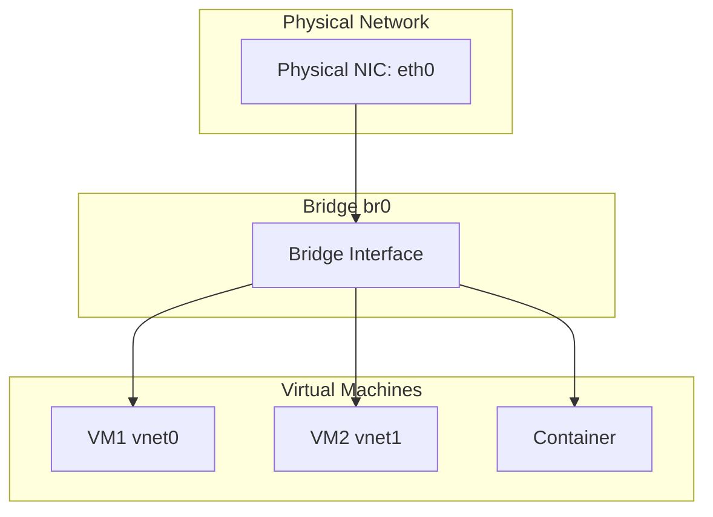

# How to Set Up a Network Bridge on Ubuntu

Author: [nawazdhandala](https://www.github.com/nawazdhandala)

Tags: Ubuntu, Networking, Bridge, Virtualization, Infrastructure, Tutorial

Description: Complete guide to creating network bridges on Ubuntu for VMs, containers, and network connectivity.

---

A network bridge connects two or more network segments at Layer 2, allowing them to communicate as if on the same network. Bridges are essential for virtualization, connecting VMs and containers to the physical network. This guide covers bridge configuration on Ubuntu.

## Use Cases

- Connecting VMs to physical network
- Container networking
- Connecting multiple network interfaces
- Network aggregation

## Prerequisites

- Ubuntu 20.04 or later
- Root or sudo access
- Basic networking knowledge

## Understanding Network Bridges



## Method 1: Netplan (Recommended)

### View Current Configuration

```bash
# Check current network configuration
cat /etc/netplan/*.yaml

# View current interfaces
ip link show
ip addr show
```

### Create Bridge Configuration

```bash
sudo nano /etc/netplan/01-bridge.yaml
```

```yaml
network:
  version: 2
  renderer: networkd

  ethernets:
    enp0s3:
      dhcp4: false
      dhcp6: false

  bridges:
    br0:
      interfaces: [enp0s3]
      dhcp4: true
      parameters:
        stp: true
        forward-delay: 4
```

### Static IP Configuration

```yaml
network:
  version: 2
  renderer: networkd

  ethernets:
    enp0s3:
      dhcp4: false

  bridges:
    br0:
      interfaces: [enp0s3]
      addresses:
        - 192.168.1.100/24
      routes:
        - to: default
          via: 192.168.1.1
      nameservers:
        addresses:
          - 8.8.8.8
          - 8.8.4.4
      parameters:
        stp: true
        forward-delay: 4
```

### Apply Configuration

```bash
# Test configuration
sudo netplan try

# Apply if successful
sudo netplan apply

# Verify bridge
ip addr show br0
bridge link show
```

## Method 2: NetworkManager (Desktop)

### Using nmcli

```bash
# Create bridge
sudo nmcli connection add type bridge con-name br0 ifname br0

# Add physical interface to bridge
sudo nmcli connection add type ethernet slave-type bridge con-name br0-enp0s3 ifname enp0s3 master br0

# Configure bridge IP (DHCP)
sudo nmcli connection modify br0 ipv4.method auto

# Or static IP
sudo nmcli connection modify br0 ipv4.addresses 192.168.1.100/24
sudo nmcli connection modify br0 ipv4.gateway 192.168.1.1
sudo nmcli connection modify br0 ipv4.dns "8.8.8.8,8.8.4.4"
sudo nmcli connection modify br0 ipv4.method manual

# Activate bridge
sudo nmcli connection up br0

# Verify
nmcli connection show
ip addr show br0
```

### Using nm-connection-editor (GUI)

```bash
# Open GUI editor
nm-connection-editor

# 1. Click Add
# 2. Select Bridge
# 3. Add slave interfaces
# 4. Configure IP settings
# 5. Save and activate
```

## Method 3: bridge-utils (Legacy)

### Install bridge-utils

```bash
sudo apt install bridge-utils -y
```

### Configure via interfaces file

```bash
sudo nano /etc/network/interfaces
```

```
# Loopback
auto lo
iface lo inet loopback

# Physical interface (no IP)
auto enp0s3
iface enp0s3 inet manual

# Bridge interface
auto br0
iface br0 inet dhcp
    bridge_ports enp0s3
    bridge_stp on
    bridge_fd 4
    bridge_maxwait 0

# Or static IP
auto br0
iface br0 inet static
    address 192.168.1.100
    netmask 255.255.255.0
    gateway 192.168.1.1
    dns-nameservers 8.8.8.8 8.8.4.4
    bridge_ports enp0s3
    bridge_stp on
    bridge_fd 4
```

### Apply Configuration

```bash
# Restart networking
sudo systemctl restart networking

# Or bring up interface
sudo ifup br0
```

## Bridge Parameters

### STP (Spanning Tree Protocol)

```bash
# Enable STP to prevent loops
bridge_stp on

# Disable for simple setups
bridge_stp off
```

### Forward Delay

```bash
# Time before forwarding (seconds)
bridge_fd 4
```

### Hello Time

```yaml
# Netplan
parameters:
  stp: true
  forward-delay: 4
  hello-time: 2
  max-age: 20
```

### Priority

```bash
# Set bridge priority (lower = more preferred as root)
sudo ip link set br0 type bridge priority 100
```

## Multiple Interfaces Bridge

```yaml
# Netplan - bridge multiple interfaces
network:
  version: 2
  ethernets:
    enp0s3:
      dhcp4: false
    enp0s8:
      dhcp4: false

  bridges:
    br0:
      interfaces:
        - enp0s3
        - enp0s8
      dhcp4: true
      parameters:
        stp: true
```

## VLAN-Aware Bridge

```yaml
# Netplan - VLAN-aware bridge
network:
  version: 2
  ethernets:
    enp0s3:
      dhcp4: false

  bridges:
    br0:
      interfaces: [enp0s3]
      addresses: [192.168.1.100/24]
      parameters:
        stp: true

  vlans:
    vlan10:
      id: 10
      link: br0
      addresses: [192.168.10.100/24]

    vlan20:
      id: 20
      link: br0
      addresses: [192.168.20.100/24]
```

## Bridge for KVM/QEMU

### Configure Bridge for VMs

```bash
# Create bridge for libvirt
sudo nano /etc/netplan/01-kvm-bridge.yaml
```

```yaml
network:
  version: 2
  ethernets:
    enp0s3:
      dhcp4: false

  bridges:
    br0:
      interfaces: [enp0s3]
      dhcp4: true
      parameters:
        stp: false
        forward-delay: 0
```

### Create libvirt Network

```bash
# Create network definition
cat > bridge-network.xml << EOF
<network>
  <name>host-bridge</name>
  <forward mode="bridge"/>
  <bridge name="br0"/>
</network>
EOF

# Define and start network
sudo virsh net-define bridge-network.xml
sudo virsh net-start host-bridge
sudo virsh net-autostart host-bridge
```

## Bridge for LXD/LXC

```bash
# Configure LXD to use bridge
lxc network create br0 ipv4.address=192.168.1.1/24 ipv4.nat=false

# Or attach to existing bridge
lxc network attach-profile br0 default eth0
```

## Monitoring Bridge

### Show Bridge Status

```bash
# List bridges
bridge link show

# Show bridge details
ip -d link show br0

# Show MAC address table
bridge fdb show br0

# Show VLAN info
bridge vlan show
```

### Traffic Statistics

```bash
# Show bridge statistics
ip -s link show br0

# Show per-port statistics
bridge -s link show
```

## Troubleshooting

### Common Issues

```bash
# Bridge not forwarding traffic
# Enable IP forwarding
echo 1 | sudo tee /proc/sys/net/ipv4/ip_forward

# Make persistent
echo "net.ipv4.ip_forward=1" | sudo tee -a /etc/sysctl.conf
sudo sysctl -p

# Check bridge state
cat /sys/class/net/br0/bridge/stp_state

# Check if interface is up
ip link show br0
```

### Connectivity Issues

```bash
# Verify interface in bridge
bridge link show

# Check ARP table
arp -n

# Test connectivity
ping -I br0 192.168.1.1

# Check routing
ip route show
```

### Reset Bridge

```bash
# Remove bridge
sudo ip link set br0 down
sudo ip link delete br0

# Or using bridge-utils
sudo brctl delbr br0
```

## Firewall Configuration

```bash
# Allow bridge traffic
sudo iptables -A FORWARD -i br0 -o br0 -j ACCEPT

# Using UFW
sudo ufw allow in on br0
sudo ufw allow out on br0

# Disable bridge filtering for VMs
echo 0 | sudo tee /proc/sys/net/bridge/bridge-nf-call-iptables
```

## Best Practices

1. **Use STP** for networks with multiple bridges to prevent loops
2. **Disable STP** for simple VM/container bridges for faster convergence
3. **Use consistent naming** (br0, br1) for clarity
4. **Document your configuration** for troubleshooting
5. **Test changes** with `netplan try` before applying

---

Network bridges are essential for virtualization and advanced networking scenarios. Properly configured bridges enable VMs and containers to communicate directly on your physical network. For monitoring your network infrastructure, consider using OneUptime for comprehensive uptime and performance tracking.
