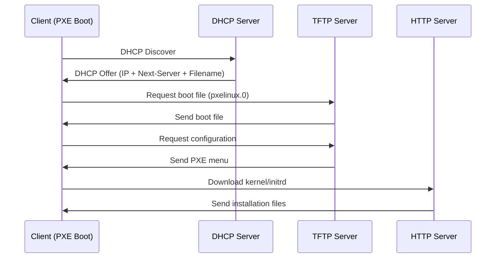

# How to Set Up a PXE Boot Server on Ubuntu

Author: [nawazdhandala](https://www.github.com/nawazdhandala)

Tags: Ubuntu, PXE, Network Boot, TFTP, Server, Tutorial

Description: Complete guide to setting up PXE (Preboot Execution Environment) boot server on Ubuntu for network-based OS installation.

---

PXE (Preboot Execution Environment) allows computers to boot and install operating systems over the network without local media. This is essential for automated deployments, diskless workstations, and data center provisioning. This guide covers setting up a complete PXE boot server on Ubuntu.

## Architecture Overview



## Prerequisites

- Ubuntu 20.04 or later
- Static IP address
- DHCP server (or existing DHCP with PXE options)
- Sufficient storage for OS images
- Root or sudo access

## Install Required Packages

```bash
# Update system
sudo apt update

# Install TFTP server, DHCP server, and Apache
sudo apt install tftpd-hpa isc-dhcp-server apache2 -y

# Install syslinux for PXE boot files
sudo apt install syslinux pxelinux syslinux-common syslinux-efi -y
```

## Configure TFTP Server

### Create Directory Structure

```bash
# Create TFTP root directory
sudo mkdir -p /srv/tftp/pxelinux.cfg
sudo mkdir -p /srv/tftp/images

# Set permissions
sudo chown -R tftp:tftp /srv/tftp
sudo chmod -R 755 /srv/tftp
```

### Copy PXE Boot Files

```bash
# Copy BIOS boot files
sudo cp /usr/lib/PXELINUX/pxelinux.0 /srv/tftp/
sudo cp /usr/lib/syslinux/modules/bios/*.c32 /srv/tftp/

# Copy UEFI boot files (if needed)
sudo mkdir -p /srv/tftp/efi64
sudo cp /usr/lib/SYSLINUX.EFI/efi64/syslinux.efi /srv/tftp/efi64/
sudo cp /usr/lib/syslinux/modules/efi64/*.e64 /srv/tftp/efi64/
```

### Configure TFTP Server

```bash
sudo nano /etc/default/tftpd-hpa
```

```bash
TFTP_USERNAME="tftp"
TFTP_DIRECTORY="/srv/tftp"
TFTP_ADDRESS=":69"
TFTP_OPTIONS="--secure --verbose"
```

### Restart TFTP Server

```bash
sudo systemctl restart tftpd-hpa
sudo systemctl enable tftpd-hpa
sudo systemctl status tftpd-hpa
```

## Configure DHCP Server

```bash
sudo nano /etc/dhcp/dhcpd.conf
```

```conf
# Global options
option domain-name "pxe.local";
option domain-name-servers 8.8.8.8, 8.8.4.4;
default-lease-time 600;
max-lease-time 7200;
authoritative;

# Subnet configuration
subnet 192.168.1.0 netmask 255.255.255.0 {
    range 192.168.1.100 192.168.1.200;
    option routers 192.168.1.1;
    option subnet-mask 255.255.255.0;

    # PXE boot configuration
    next-server 192.168.1.10;  # TFTP server IP

    # BIOS boot
    filename "pxelinux.0";

    # For UEFI clients, use conditional:
    # if option architecture-type = 00:07 {
    #     filename "efi64/syslinux.efi";
    # } else {
    #     filename "pxelinux.0";
    # }
}
```

### Specify DHCP Interface

```bash
sudo nano /etc/default/isc-dhcp-server
```

```bash
INTERFACESv4="enp0s3"
```

### Start DHCP Server

```bash
sudo systemctl restart isc-dhcp-server
sudo systemctl enable isc-dhcp-server
```

## Create PXE Boot Menu

### Basic Menu Configuration

```bash
sudo nano /srv/tftp/pxelinux.cfg/default
```

```
DEFAULT menu.c32
PROMPT 0
TIMEOUT 300
ONTIMEOUT local
MENU TITLE PXE Boot Menu

LABEL local
    MENU LABEL Boot from Local Disk
    LOCALBOOT 0

LABEL ubuntu-22.04
    MENU LABEL Install Ubuntu 22.04 Server
    KERNEL images/ubuntu-22.04/vmlinuz
    INITRD images/ubuntu-22.04/initrd
    APPEND ip=dhcp url=http://192.168.1.10/ubuntu-22.04/ubuntu-22.04-live-server-amd64.iso autoinstall ds=nocloud-net;s=http://192.168.1.10/autoinstall/

LABEL ubuntu-22.04-manual
    MENU LABEL Install Ubuntu 22.04 Server (Manual)
    KERNEL images/ubuntu-22.04/vmlinuz
    INITRD images/ubuntu-22.04/initrd
    APPEND ip=dhcp url=http://192.168.1.10/ubuntu-22.04/ubuntu-22.04-live-server-amd64.iso

LABEL memtest
    MENU LABEL Memtest86+
    KERNEL images/memtest/memtest86+.bin
```

## Prepare Ubuntu Installation Files

### Download Ubuntu ISO

```bash
# Create directory for Ubuntu
sudo mkdir -p /srv/tftp/images/ubuntu-22.04
sudo mkdir -p /var/www/html/ubuntu-22.04

# Download Ubuntu Server ISO
cd /var/www/html/ubuntu-22.04
sudo wget https://releases.ubuntu.com/22.04/ubuntu-22.04.3-live-server-amd64.iso
```

### Extract Boot Files

```bash
# Mount ISO
sudo mkdir /mnt/ubuntu-iso
sudo mount -o loop /var/www/html/ubuntu-22.04/ubuntu-22.04*.iso /mnt/ubuntu-iso

# Copy kernel and initrd
sudo cp /mnt/ubuntu-iso/casper/vmlinuz /srv/tftp/images/ubuntu-22.04/
sudo cp /mnt/ubuntu-iso/casper/initrd /srv/tftp/images/ubuntu-22.04/

# Unmount
sudo umount /mnt/ubuntu-iso
```

## Autoinstall Configuration

### Create Autoinstall Directory

```bash
sudo mkdir -p /var/www/html/autoinstall
```

### Create User-Data File

```bash
sudo nano /var/www/html/autoinstall/user-data
```

```yaml
#cloud-config
autoinstall:
  version: 1
  locale: en_US
  keyboard:
    layout: us

  identity:
    hostname: ubuntu-server
    username: admin
    password: "$6$rounds=4096$xyz$..." # Use: mkpasswd -m sha-512

  ssh:
    install-server: true
    allow-pw: true
    authorized-keys:
      - ssh-rsa AAAA... your-public-key

  storage:
    layout:
      name: lvm

  packages:
    - openssh-server
    - vim
    - htop

  late-commands:
    - echo 'admin ALL=(ALL) NOPASSWD:ALL' > /target/etc/sudoers.d/admin
```

### Create Meta-Data File

```bash
sudo nano /var/www/html/autoinstall/meta-data
```

```yaml
instance-id: ubuntu-autoinstall
```

### Generate Password Hash

```bash
# Generate password hash for autoinstall
mkpasswd -m sha-512
# Enter password when prompted
```

## Configure Apache

```bash
# Enable required modules
sudo a2enmod proxy proxy_http

# Restart Apache
sudo systemctl restart apache2
```

## Multiple OS Support

### Add CentOS/Rocky Linux

```bash
# Create directories
sudo mkdir -p /srv/tftp/images/rocky-9
sudo mkdir -p /var/www/html/rocky-9

# Download and extract boot files
# (Download ISO and mount)
sudo cp /mnt/rocky/images/pxeboot/vmlinuz /srv/tftp/images/rocky-9/
sudo cp /mnt/rocky/images/pxeboot/initrd.img /srv/tftp/images/rocky-9/
```

Add to PXE menu:

```
LABEL rocky-9
    MENU LABEL Install Rocky Linux 9
    KERNEL images/rocky-9/vmlinuz
    INITRD images/rocky-9/initrd.img
    APPEND ip=dhcp inst.repo=http://192.168.1.10/rocky-9/
```

### Add Windows PE (WinPE)

For Windows deployment, use iPXE or Windows Deployment Services (WDS).

## UEFI Boot Support

### Configure for UEFI

```bash
# Copy UEFI files
sudo mkdir -p /srv/tftp/efi64
sudo cp /usr/lib/SYSLINUX.EFI/efi64/syslinux.efi /srv/tftp/efi64/
sudo cp /usr/lib/syslinux/modules/efi64/ldlinux.e64 /srv/tftp/efi64/
sudo cp /usr/lib/syslinux/modules/efi64/menu.c32 /srv/tftp/efi64/
sudo cp /usr/lib/syslinux/modules/efi64/libutil.c32 /srv/tftp/efi64/

# Create UEFI menu
sudo mkdir -p /srv/tftp/efi64/pxelinux.cfg
sudo cp /srv/tftp/pxelinux.cfg/default /srv/tftp/efi64/pxelinux.cfg/
```

### Update DHCP for UEFI

```conf
# Add to dhcpd.conf
class "pxeclient" {
    match if substring (option vendor-class-identifier, 0, 9) = "PXEClient";

    if option architecture-type = 00:07 {
        filename "efi64/syslinux.efi";
    } elsif option architecture-type = 00:09 {
        filename "efi64/syslinux.efi";
    } else {
        filename "pxelinux.0";
    }
}
```

## Testing PXE Boot

### Test TFTP Server

```bash
# Test TFTP locally
tftp localhost
> get pxelinux.0
> quit

# Check file was downloaded
ls -la pxelinux.0
```

### Test from Client

1. Configure client BIOS/UEFI for network boot
2. Boot client
3. Should see PXE menu
4. Select installation option

### Monitor Boot Process

```bash
# Watch DHCP leases
sudo tail -f /var/lib/dhcp/dhcpd.leases

# Watch TFTP logs
sudo journalctl -u tftpd-hpa -f

# Watch Apache access log
sudo tail -f /var/log/apache2/access.log
```

## Firewall Configuration

```bash
# Allow TFTP
sudo ufw allow 69/udp

# Allow DHCP
sudo ufw allow 67/udp

# Allow HTTP
sudo ufw allow 80/tcp

# Allow HTTPS (if used)
sudo ufw allow 443/tcp
```

## Troubleshooting

### TFTP Issues

```bash
# Check TFTP is listening
sudo ss -ulnp | grep :69

# Test TFTP connection
tftp 192.168.1.10
> get pxelinux.0
> quit

# Check TFTP logs
sudo journalctl -u tftpd-hpa
```

### DHCP Issues

```bash
# Check DHCP is running
sudo systemctl status isc-dhcp-server

# Check DHCP logs
sudo tail -f /var/log/syslog | grep dhcpd

# Verify DHCP options
tcpdump -i eth0 port 67 or port 68 -n -v
```

### Boot File Not Found

```bash
# Verify files exist
ls -la /srv/tftp/pxelinux.0
ls -la /srv/tftp/pxelinux.cfg/default

# Check permissions
sudo chown -R tftp:tftp /srv/tftp
```

### Kernel Panic During Boot

- Verify kernel and initrd are correct versions
- Check APPEND line parameters
- Ensure ISO/installation files are accessible

---

PXE boot servers enable efficient OS deployment across multiple machines. This setup is invaluable for data centers, labs, and enterprise environments. For monitoring your deployment infrastructure, consider using OneUptime for comprehensive server and service monitoring.
