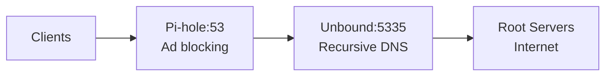

# How to Set Up Unbound as a Recursive DNS Resolver on Ubuntu

Author: [nawazdhandala](https://www.github.com/nawazdhandala)

Tags: Ubuntu, Unbound, DNS, Recursive Resolver, Privacy, Tutorial

Description: Complete guide to setting up Unbound as a validating, recursive, caching DNS resolver on Ubuntu.

---

## Introduction

Unbound is a powerful, open-source DNS resolver developed by NLnet Labs. Unlike forwarding resolvers that simply pass queries to upstream DNS servers, Unbound performs full recursive resolution, querying root servers and authoritative nameservers directly. This approach provides enhanced privacy, as your DNS queries are not sent to a third-party resolver, and improved security through built-in DNSSEC validation.

In this comprehensive guide, we will walk through setting up Unbound as a validating, recursive, caching DNS resolver on Ubuntu, complete with advanced features like DNS-over-TLS (DoT) and DNS-over-HTTPS (DoH).

---

## Table of Contents

1. [Understanding Recursive DNS](#understanding-recursive-dns)
2. [Installing Unbound](#installing-unbound)
3. [Basic Configuration](#basic-configuration)
4. [Root Hints and Trust Anchors](#root-hints-and-trust-anchors)
5. [DNSSEC Validation](#dnssec-validation)
6. [DNS-over-TLS (DoT)](#dns-over-tls-dot)
7. [DNS-over-HTTPS (DoH)](#dns-over-https-doh)
8. [Performance Tuning](#performance-tuning)
9. [Access Control](#access-control)
10. [Integration with Pi-hole](#integration-with-pi-hole)
11. [Logging and Debugging](#logging-and-debugging)
12. [Troubleshooting](#troubleshooting)
13. [Conclusion](#conclusion)

---

## Understanding Recursive DNS

Before diving into the setup, it is essential to understand how recursive DNS resolution works and why it matters.

### How DNS Resolution Works

When you type a domain name like `example.com` into your browser, your device needs to translate that human-readable name into an IP address. This process involves several steps:

1. **Local Cache Check**: Your device first checks its local DNS cache
2. **Recursive Resolver Query**: If not cached, the query goes to a recursive resolver
3. **Root Server Query**: The resolver queries a root DNS server
4. **TLD Server Query**: The root server directs to the appropriate Top-Level Domain (TLD) server
5. **Authoritative Server Query**: The TLD server points to the authoritative nameserver for the domain
6. **Response**: The authoritative server provides the IP address

### Types of DNS Resolvers

| Resolver Type | Description | Privacy |
|--------------|-------------|---------|
| **Stub Resolver** | Simple client that forwards queries to a configured resolver | Low |
| **Forwarding Resolver** | Forwards queries to upstream resolvers (e.g., 8.8.8.8, 1.1.1.1) | Medium |
| **Recursive Resolver** | Performs full resolution from root servers | High |

### Why Use a Recursive Resolver?

Running your own recursive resolver like Unbound offers several advantages:

- **Privacy**: Your DNS queries are not logged by third-party providers
- **Security**: Built-in DNSSEC validation protects against DNS spoofing
- **Performance**: Local caching reduces latency for repeated queries
- **Control**: Full control over your DNS infrastructure
- **No Censorship**: Direct queries bypass potential filtering by ISPs or public resolvers

---

## Installing Unbound

### Prerequisites

Ensure your Ubuntu system is up to date:

```bash
# Update package lists and upgrade existing packages
sudo apt update && sudo apt upgrade -y
```

### Installing Unbound Package

Install Unbound and its dependencies:

```bash
# Install Unbound DNS resolver
# The dns-root-data package contains root hints and trust anchors
sudo apt install unbound unbound-host dns-root-data -y
```

### Verifying Installation

Check that Unbound was installed correctly:

```bash
# Check Unbound version
unbound -V

# Check if the service is recognized
systemctl status unbound
```

Expected output should show Unbound version 1.x.x and service status (likely inactive until configured).

---

## Basic Configuration

Unbound's main configuration file is located at `/etc/unbound/unbound.conf`. However, best practice is to create modular configuration files in `/etc/unbound/unbound.conf.d/`.

### Creating the Main Configuration

Create a new configuration file:

```bash
# Create a custom configuration file
sudo nano /etc/unbound/unbound.conf.d/pi-hole.conf
```

Add the following base configuration:

```yaml
# /etc/unbound/unbound.conf.d/pi-hole.conf
# Unbound configuration for recursive DNS resolution

server:
    # ==========================================
    # NETWORK INTERFACE SETTINGS
    # ==========================================

    # Listen on localhost only (change for network-wide service)
    interface: 127.0.0.1

    # Port to listen on (standard DNS port is 53)
    # Using 5335 to avoid conflicts with other DNS services
    port: 5335

    # Allow both IPv4 and IPv6
    do-ip4: yes
    do-ip6: yes

    # Enable UDP and TCP protocols
    do-udp: yes
    do-tcp: yes

    # ==========================================
    # SECURITY SETTINGS
    # ==========================================

    # Refuse queries from non-local addresses
    access-control: 127.0.0.0/8 allow
    access-control: ::1/128 allow

    # Drop privileges after binding to port
    username: "unbound"

    # Chroot for additional security (empty to disable)
    chroot: ""

    # Hide server identity and version
    hide-identity: yes
    hide-version: yes

    # Harden against out-of-zone data
    harden-glue: yes

    # Require DNSSEC data for trust-anchored zones
    harden-dnssec-stripped: yes

    # Use 0x20-encoded random bits in queries for spoofing resistance
    use-caps-for-id: yes

    # ==========================================
    # PERFORMANCE SETTINGS
    # ==========================================

    # Number of threads (match CPU cores)
    num-threads: 4

    # Message cache size
    msg-cache-size: 50m

    # RRset cache size (should be roughly 2x msg-cache-size)
    rrset-cache-size: 100m

    # Cache minimum TTL (in seconds)
    cache-min-ttl: 300

    # Cache maximum TTL (in seconds)
    cache-max-ttl: 86400

    # Serve expired cache entries while refreshing
    serve-expired: yes

    # ==========================================
    # PRIVACY SETTINGS
    # ==========================================

    # Minimize query information sent to upstream servers
    qname-minimisation: yes

    # Aggressive NSEC uses cached NSEC records to synthesize NXDOMAIN
    aggressive-nsec: yes

    # Do not query the following private address ranges
    private-address: 10.0.0.0/8
    private-address: 172.16.0.0/12
    private-address: 192.168.0.0/16
    private-address: 169.254.0.0/16
    private-address: fd00::/8
    private-address: fe80::/10
```

### Validating Configuration

Always validate your configuration before restarting Unbound:

```bash
# Check configuration syntax
sudo unbound-checkconf

# If no errors, restart Unbound
sudo systemctl restart unbound

# Enable Unbound to start on boot
sudo systemctl enable unbound

# Verify Unbound is running
sudo systemctl status unbound
```

### Testing Basic Resolution

Test that Unbound is resolving queries correctly:

```bash
# Test DNS resolution using dig
dig @127.0.0.1 -p 5335 example.com

# Alternative test using drill
drill @127.0.0.1 -p 5335 example.com

# Test using unbound-host
unbound-host -v -r example.com
```

---

## Root Hints and Trust Anchors

### Understanding Root Hints

Root hints are a list of IP addresses for the DNS root servers. Unbound uses these to begin the recursive resolution process.

### Updating Root Hints

The root hints file should be updated periodically. On Ubuntu, the `dns-root-data` package manages this automatically, but you can also update manually:

```bash
# Download the latest root hints file
sudo wget -O /var/lib/unbound/root.hints \
    https://www.internic.net/domain/named.cache

# Set correct ownership
sudo chown unbound:unbound /var/lib/unbound/root.hints
```

Add the root hints to your configuration:

```yaml
server:
    # Path to root hints file
    root-hints: "/var/lib/unbound/root.hints"
```

### Setting Up Automatic Updates

Create a cron job to update root hints monthly:

```bash
# Create a script to update root hints
sudo nano /etc/cron.monthly/update-root-hints
```

Add the following content:

```bash
#!/bin/bash
# /etc/cron.monthly/update-root-hints
# Script to automatically update DNS root hints

# Download latest root hints
wget -q -O /tmp/root.hints https://www.internic.net/domain/named.cache

# Verify download was successful (file should be > 2KB)
if [ -s /tmp/root.hints ] && [ $(stat -f%z /tmp/root.hints 2>/dev/null || stat -c%s /tmp/root.hints) -gt 2000 ]; then
    mv /tmp/root.hints /var/lib/unbound/root.hints
    chown unbound:unbound /var/lib/unbound/root.hints
    systemctl reload unbound
    logger "Root hints updated successfully"
else
    logger "Root hints update failed - file too small or empty"
fi
```

Make the script executable:

```bash
sudo chmod +x /etc/cron.monthly/update-root-hints
```

### Trust Anchors for DNSSEC

Trust anchors are the cryptographic keys used to validate DNSSEC signatures. Ubuntu's `dns-root-data` package includes the root zone trust anchor.

```bash
# View the current trust anchor
cat /usr/share/dns/root.key

# Unbound's auto-trust-anchor-file manages key rollovers automatically
```

Add to your configuration:

```yaml
server:
    # Automatically maintained trust anchor file
    auto-trust-anchor-file: "/var/lib/unbound/root.key"
```

---

## DNSSEC Validation

DNSSEC (Domain Name System Security Extensions) adds cryptographic signatures to DNS records, allowing resolvers to verify that responses have not been tampered with.

### Enabling DNSSEC

Add these settings to your Unbound configuration:

```yaml
server:
    # ==========================================
    # DNSSEC VALIDATION SETTINGS
    # ==========================================

    # Enable DNSSEC validation
    # Options: "yes" (validate), "no" (don't validate)
    module-config: "validator iterator"

    # Path to trust anchor file (automatically updated)
    auto-trust-anchor-file: "/var/lib/unbound/root.key"

    # Harden against DNSSEC stripping attacks
    harden-dnssec-stripped: yes

    # Harden against algorithm downgrade attacks
    harden-algo-downgrade: yes

    # Require valid DNSSEC for trust-anchored zones
    val-clean-additional: yes

    # Log validation failures
    val-log-level: 1

    # Permissive mode during DNSSEC problems (set to "no" for strict)
    # val-permissive-mode: no
```

### Testing DNSSEC Validation

Test DNSSEC validation with known signed and unsigned domains:

```bash
# Test a DNSSEC-signed domain (should return AD flag)
dig @127.0.0.1 -p 5335 +dnssec dnssec-tools.org

# Test a domain with intentionally broken DNSSEC
dig @127.0.0.1 -p 5335 +dnssec dnssec-failed.org

# The second query should return SERVFAIL due to validation failure
```

### Understanding DNSSEC Response Flags

| Flag | Meaning |
|------|---------|
| **AD** (Authenticated Data) | Response has been validated by DNSSEC |
| **CD** (Checking Disabled) | Client requested no DNSSEC validation |
| **SERVFAIL** | May indicate DNSSEC validation failure |

### Handling DNSSEC Failures

Some domains have misconfigured DNSSEC. You can create exceptions for specific domains:

```yaml
server:
    # Disable DNSSEC for specific domains (use sparingly)
    domain-insecure: "example-broken-dnssec.com"
```

---

## DNS-over-TLS (DoT)

DNS-over-TLS encrypts DNS queries between Unbound and upstream servers, preventing eavesdropping on your DNS traffic.

### Configuring DoT Forwarding

While running a fully recursive resolver is ideal, you may want to forward to trusted DoT servers in some scenarios:

```yaml
# /etc/unbound/unbound.conf.d/forward-dot.conf
# Configuration for DNS-over-TLS forwarding

server:
    # Enable TLS for outgoing queries
    tls-cert-bundle: "/etc/ssl/certs/ca-certificates.crt"

# Forward zone for DoT (comment out for pure recursive)
# Uncomment if you want to use DoT forwarding instead of recursive
# forward-zone:
#     name: "."
#     forward-tls-upstream: yes
#
#     # Cloudflare DNS (primary)
#     forward-addr: 1.1.1.1@853#cloudflare-dns.com
#     forward-addr: 1.0.0.1@853#cloudflare-dns.com
#
#     # Quad9 DNS (secondary)
#     forward-addr: 9.9.9.9@853#dns.quad9.net
#     forward-addr: 149.112.112.112@853#dns.quad9.net
```

### Serving DoT to Clients

To allow clients to connect to your Unbound server using DoT, you need TLS certificates:

```bash
# Generate a self-signed certificate (for internal use)
sudo mkdir -p /etc/unbound/certs

sudo openssl req -x509 -newkey rsa:4096 \
    -keyout /etc/unbound/certs/unbound-key.pem \
    -out /etc/unbound/certs/unbound-cert.pem \
    -days 365 -nodes \
    -subj "/CN=unbound.local"

# Set proper permissions
sudo chown -R unbound:unbound /etc/unbound/certs
sudo chmod 600 /etc/unbound/certs/unbound-key.pem
```

Add DoT server configuration:

```yaml
server:
    # ==========================================
    # DNS-over-TLS SERVER SETTINGS
    # ==========================================

    # Interface for DoT (port 853 is standard)
    interface: 0.0.0.0@853
    interface: ::0@853

    # Enable TLS service
    tls-service-key: "/etc/unbound/certs/unbound-key.pem"
    tls-service-pem: "/etc/unbound/certs/unbound-cert.pem"

    # TLS port
    tls-port: 853

    # Supported TLS cipher suites (modern only)
    tls-ciphers: "PROFILE=SYSTEM"
```

### Testing DoT

Test your DoT configuration:

```bash
# Test DoT connection using kdig (from knot-dnsutils package)
sudo apt install knot-dnsutils -y

kdig @127.0.0.1 +tls example.com

# Or test with openssl
echo -e "\x00\x1d\x01\x00\x00\x01\x00\x00\x00\x00\x00\x00\x07example\x03com\x00\x00\x01\x00\x01" | \
    openssl s_client -connect 127.0.0.1:853 -quiet 2>/dev/null | xxd
```

---

## DNS-over-HTTPS (DoH)

DNS-over-HTTPS provides encrypted DNS resolution over HTTPS, often on port 443, making it harder to block.

### Installing DoH Proxy

Unbound does not natively support DoH, so we use a proxy. Install `dnsproxy`:

```bash
# Download dnsproxy
DNSPROXY_VERSION="0.72.0"
wget https://github.com/AdguardTeam/dnsproxy/releases/download/v${DNSPROXY_VERSION}/dnsproxy-linux-amd64-v${DNSPROXY_VERSION}.tar.gz

# Extract and install
tar -xzf dnsproxy-linux-amd64-v${DNSPROXY_VERSION}.tar.gz
sudo mv linux-amd64/dnsproxy /usr/local/bin/
sudo chmod +x /usr/local/bin/dnsproxy

# Clean up
rm -rf linux-amd64 dnsproxy-linux-amd64-v${DNSPROXY_VERSION}.tar.gz
```

### Configuring DoH

Create a systemd service for dnsproxy:

```bash
sudo nano /etc/systemd/system/dnsproxy-doh.service
```

Add the following content:

```ini
# /etc/systemd/system/dnsproxy-doh.service
# DoH proxy service that forwards to Unbound

[Unit]
Description=DNS-over-HTTPS Proxy
Documentation=https://github.com/AdguardTeam/dnsproxy
After=network.target unbound.service
Wants=unbound.service

[Service]
Type=simple
User=nobody
Group=nogroup

# DoH server listening on port 443
# Forwards to local Unbound on port 5335
ExecStart=/usr/local/bin/dnsproxy \
    --listen=0.0.0.0 \
    --port=443 \
    --https-port=443 \
    --tls-crt=/etc/unbound/certs/unbound-cert.pem \
    --tls-key=/etc/unbound/certs/unbound-key.pem \
    --upstream=127.0.0.1:5335 \
    --cache \
    --cache-size=10000

Restart=on-failure
RestartSec=5

# Security hardening
NoNewPrivileges=true
ProtectSystem=strict
ProtectHome=true
PrivateTmp=true

[Install]
WantedBy=multi-user.target
```

Enable and start the service:

```bash
# Reload systemd daemon
sudo systemctl daemon-reload

# Enable and start DoH proxy
sudo systemctl enable dnsproxy-doh
sudo systemctl start dnsproxy-doh

# Check status
sudo systemctl status dnsproxy-doh
```

### Testing DoH

Test DoH resolution:

```bash
# Test using curl
curl -H "accept: application/dns-json" \
    "https://localhost/dns-query?name=example.com&type=A" \
    --insecure

# Test using dog (modern DNS client)
# Install: cargo install dog
dog example.com --https @https://localhost/dns-query --insecure
```

---

## Performance Tuning

Optimizing Unbound for better performance involves tuning cache sizes, thread counts, and various buffers.

### System Requirements Assessment

First, determine your system resources:

```bash
# Check CPU cores
nproc

# Check available memory
free -h

# Check current Unbound memory usage
sudo unbound-control stats_noreset | grep mem
```

### Optimized Performance Configuration

```yaml
# /etc/unbound/unbound.conf.d/performance.conf
# Performance tuning for Unbound

server:
    # ==========================================
    # THREADING AND CONCURRENCY
    # ==========================================

    # Number of threads (set to number of CPU cores)
    # Get value with: nproc
    num-threads: 4

    # Number of slabs (should be power of 2, close to num-threads)
    msg-cache-slabs: 4
    rrset-cache-slabs: 4
    infra-cache-slabs: 4
    key-cache-slabs: 4

    # ==========================================
    # CACHE SIZING
    # ==========================================

    # Message cache size (stores DNS responses)
    # Increase for better cache hit rates
    msg-cache-size: 128m

    # RRset cache size (should be ~2x msg-cache-size)
    # Stores individual resource record sets
    rrset-cache-size: 256m

    # Infrastructure cache (stores RTT, EDNS support info)
    infra-cache-numhosts: 50000

    # Key cache for DNSSEC
    key-cache-size: 32m

    # Negative cache size (NXDOMAIN responses)
    neg-cache-size: 16m

    # ==========================================
    # TTL SETTINGS
    # ==========================================

    # Minimum TTL for cached records (prevents very short TTLs)
    cache-min-ttl: 300

    # Maximum TTL for cached records
    cache-max-ttl: 86400

    # Maximum negative TTL
    cache-max-negative-ttl: 3600

    # Serve expired entries while fetching fresh data
    serve-expired: yes
    serve-expired-ttl: 86400
    serve-expired-reply-ttl: 30

    # ==========================================
    # NETWORK OPTIMIZATION
    # ==========================================

    # Increase buffer sizes for high traffic
    so-rcvbuf: 4m
    so-sndbuf: 4m

    # Outgoing port range
    outgoing-range: 8192

    # Number of outgoing TCP connections
    outgoing-num-tcp: 100

    # Number of incoming TCP connections
    incoming-num-tcp: 100

    # EDNS buffer size
    edns-buffer-size: 1232

    # ==========================================
    # PREFETCHING
    # ==========================================

    # Prefetch popular entries before they expire
    prefetch: yes

    # Prefetch DNSSEC keys
    prefetch-key: yes

    # Number of queries to trigger prefetch
    # Lower = more aggressive prefetching
    # prefetch-threshold: 10

    # ==========================================
    # QUERY HANDLING
    # ==========================================

    # Maximum UDP response size
    max-udp-size: 3072

    # Timeout for recursive queries (ms)
    # Lower values improve responsiveness
    unknown-server-time-limit: 376

    # Number of queries per thread
    num-queries-per-thread: 4096
```

### Applying Kernel Optimizations

For high-performance setups, adjust kernel parameters:

```bash
# Create sysctl configuration
sudo nano /etc/sysctl.d/99-unbound.conf
```

Add the following:

```ini
# /etc/sysctl.d/99-unbound.conf
# Kernel optimizations for DNS server

# Increase network buffer sizes
net.core.rmem_max = 8388608
net.core.wmem_max = 8388608
net.core.rmem_default = 1048576
net.core.wmem_default = 1048576

# Increase connection tracking
net.netfilter.nf_conntrack_max = 1000000

# Increase local port range
net.ipv4.ip_local_port_range = 1024 65535

# Enable TCP fast open
net.ipv4.tcp_fastopen = 3
```

Apply the settings:

```bash
sudo sysctl -p /etc/sysctl.d/99-unbound.conf
```

### Monitoring Performance

Use unbound-control to monitor performance:

```bash
# Enable remote control
sudo nano /etc/unbound/unbound.conf.d/remote-control.conf
```

```yaml
# Enable remote control for statistics
remote-control:
    control-enable: yes
    control-interface: 127.0.0.1
    control-port: 8953
    server-key-file: "/etc/unbound/unbound_server.key"
    server-cert-file: "/etc/unbound/unbound_server.pem"
    control-key-file: "/etc/unbound/unbound_control.key"
    control-cert-file: "/etc/unbound/unbound_control.pem"
```

Set up remote control keys:

```bash
# Generate control keys
sudo unbound-control-setup

# Restart Unbound
sudo systemctl restart unbound

# View statistics
sudo unbound-control stats

# Key metrics to monitor:
# - total.num.cachehits: Cache hit count
# - total.num.cachemiss: Cache miss count
# - total.requestlist.avg: Average request list size
# - mem.cache.rrset: RRset cache memory usage
```

---

## Access Control

Proper access control is crucial for security, especially when running Unbound on a network.

### Basic Access Control Lists

```yaml
# /etc/unbound/unbound.conf.d/access-control.conf
# Access control configuration

server:
    # ==========================================
    # ACCESS CONTROL SETTINGS
    # ==========================================

    # Default: refuse all
    access-control: 0.0.0.0/0 refuse
    access-control: ::/0 refuse

    # Allow localhost (always needed)
    access-control: 127.0.0.0/8 allow
    access-control: ::1/128 allow

    # Allow local network (adjust to your network)
    access-control: 192.168.1.0/24 allow
    access-control: 10.0.0.0/8 allow

    # Allow with no recursion (for certain clients)
    # access-control: 192.168.2.0/24 allow_snoop

    # Refuse with REFUSED response (instead of silent drop)
    # access-control: 172.16.0.0/12 refuse

    # ==========================================
    # ACCESS CONTROL ACTIONS
    # ==========================================

    # deny - Drop query, no response
    # refuse - Drop query, send REFUSED response
    # allow - Full recursive service
    # allow_setrd - Allow recursive but set RD bit
    # allow_snoop - Allow cache snooping (non-recursive queries)
    # deny_non_local - Refuse queries for non-local data
    # refuse_non_local - REFUSED for non-local queries
```

### Private Address Protection

Prevent DNS rebinding attacks:

```yaml
server:
    # ==========================================
    # PRIVATE ADDRESS PROTECTION
    # ==========================================

    # Block responses containing private IP addresses
    # Prevents DNS rebinding attacks
    private-address: 10.0.0.0/8
    private-address: 172.16.0.0/12
    private-address: 192.168.0.0/16
    private-address: 169.254.0.0/16
    private-address: fd00::/8
    private-address: fe80::/10
    private-address: ::ffff:0:0/96

    # Exception: Allow private addresses for specific domains
    # Useful for internal DNS resolution
    private-domain: "home.local"
    private-domain: "internal.company.com"

    # Local zones for internal domains
    local-zone: "home.local." static
    local-data: "router.home.local. A 192.168.1.1"
    local-data: "server.home.local. A 192.168.1.10"
```

### Rate Limiting

Protect against DNS amplification attacks:

```yaml
server:
    # ==========================================
    # RATE LIMITING
    # ==========================================

    # IP rate limiting (queries per second per IP)
    ip-ratelimit: 1000

    # Rate limit for slipped responses
    ip-ratelimit-slabs: 4
    ip-ratelimit-size: 4m

    # Response rate limiting (for all responses)
    ratelimit: 1000
    ratelimit-slabs: 4
    ratelimit-size: 4m

    # Factor for rate limit (0 = drop all, 10 = allow 1 in 10)
    ratelimit-factor: 10
    ip-ratelimit-factor: 10
```

---

## Integration with Pi-hole

Pi-hole is a popular network-wide ad blocker that can use Unbound as its upstream resolver for enhanced privacy.

### Architecture Overview



### Pi-hole Configuration

1. First, ensure Unbound is listening on a different port (we used 5335):

```yaml
server:
    interface: 127.0.0.1
    port: 5335
```

2. In Pi-hole's web interface, go to **Settings > DNS**:
   - Uncheck all upstream DNS servers
   - Add custom upstream: `127.0.0.1#5335`
   - Enable "Use DNSSEC" checkbox

3. Alternatively, edit Pi-hole's configuration directly:

```bash
# Edit Pi-hole's DNS settings
sudo nano /etc/pihole/setupVars.conf
```

Set the following:

```ini
PIHOLE_DNS_1=127.0.0.1#5335
PIHOLE_DNS_2=
DNS_FQDN_REQUIRED=true
DNSSEC=true
```

### Optimized Unbound Configuration for Pi-hole

Create a dedicated configuration file:

```yaml
# /etc/unbound/unbound.conf.d/pi-hole.conf
# Optimized Unbound configuration for Pi-hole integration

server:
    # ==========================================
    # NETWORK SETTINGS
    # ==========================================

    # Listen only on localhost (Pi-hole connects locally)
    interface: 127.0.0.1
    port: 5335

    # Protocols
    do-ip4: yes
    do-ip6: yes
    do-udp: yes
    do-tcp: yes

    # ==========================================
    # SECURITY
    # ==========================================

    # Only allow local access
    access-control: 127.0.0.0/8 allow
    access-control: 0.0.0.0/0 refuse

    # Run as unbound user
    username: "unbound"

    # ==========================================
    # PERFORMANCE (Tuned for Pi-hole)
    # ==========================================

    # Threads
    num-threads: 1

    # Cache sizes (moderate for home use)
    msg-cache-size: 50m
    rrset-cache-size: 100m

    # Optimize for low latency
    serve-expired: yes
    prefetch: yes

    # ==========================================
    # PRIVACY
    # ==========================================

    # Query name minimization
    qname-minimisation: yes

    # Hide identity
    hide-identity: yes
    hide-version: yes

    # ==========================================
    # DNSSEC
    # ==========================================

    auto-trust-anchor-file: "/var/lib/unbound/root.key"

    # Harden DNSSEC
    harden-glue: yes
    harden-dnssec-stripped: yes
    harden-algo-downgrade: yes

    # ==========================================
    # STABILITY
    # ==========================================

    # Ensure Pi-hole gets answers even if upstream is slow
    serve-expired: yes
    serve-expired-ttl: 86400

    # Timeouts
    unknown-server-time-limit: 376
```

### Testing the Integration

Verify the Pi-hole to Unbound connection:

```bash
# Test Unbound directly
dig @127.0.0.1 -p 5335 google.com

# Test Pi-hole (which should forward to Unbound)
dig @127.0.0.1 -p 53 google.com

# Check Pi-hole is using Unbound
pihole -d
# Look for "Upstream DNS Servers" in the debug output
```

### Monitoring Integration Health

Create a health check script:

```bash
#!/bin/bash
# /usr/local/bin/check-dns-stack.sh
# Health check for Pi-hole + Unbound stack

echo "=== DNS Stack Health Check ==="

# Check Unbound
echo -n "Unbound status: "
if systemctl is-active --quiet unbound; then
    echo "Running"
else
    echo "NOT RUNNING!"
fi

# Check Pi-hole FTL
echo -n "Pi-hole FTL status: "
if systemctl is-active --quiet pihole-FTL; then
    echo "Running"
else
    echo "NOT RUNNING!"
fi

# Test Unbound resolution
echo -n "Unbound resolution: "
if dig @127.0.0.1 -p 5335 +short google.com > /dev/null 2>&1; then
    echo "OK"
else
    echo "FAILED!"
fi

# Test Pi-hole resolution
echo -n "Pi-hole resolution: "
if dig @127.0.0.1 -p 53 +short google.com > /dev/null 2>&1; then
    echo "OK"
else
    echo "FAILED!"
fi

# Test DNSSEC
echo -n "DNSSEC validation: "
if dig @127.0.0.1 -p 5335 +dnssec dnssec-tools.org | grep -q "ad"; then
    echo "OK"
else
    echo "NOT VALIDATING"
fi

echo "=== End Health Check ==="
```

---

## Logging and Debugging

Proper logging helps diagnose issues and monitor DNS activity.

### Configuring Logging

```yaml
# /etc/unbound/unbound.conf.d/logging.conf
# Logging configuration for Unbound

server:
    # ==========================================
    # LOGGING SETTINGS
    # ==========================================

    # Verbosity level (0-5)
    # 0 - No verbosity, only errors
    # 1 - Operational information
    # 2 - Detailed operational information
    # 3 - Query level information
    # 4 - Algorithm level information
    # 5 - Client identification
    verbosity: 1

    # Log queries (set to yes for debugging only - privacy concern!)
    log-queries: no

    # Log replies (set to yes for debugging only)
    log-replies: no

    # Log tag queries (EDNS client subnet)
    log-tag-queryreply: no

    # Log local zone actions
    log-local-actions: no

    # Log SERVFAIL responses
    log-servfail: yes

    # Log destination
    # Options: syslog, stderr, or file path
    logfile: ""  # Empty means use syslog

    # Use syslog for logging
    use-syslog: yes

    # Log identity (appears in syslog)
    log-identity: "unbound"

    # Log time in ASCII format
    log-time-ascii: yes

    # Statistics logging interval (seconds, 0 to disable)
    statistics-interval: 0

    # Extended statistics
    extended-statistics: yes

    # Statistics are cumulative (not reset after retrieval)
    statistics-cumulative: no
```

### Log Locations

```bash
# View Unbound logs via journalctl
sudo journalctl -u unbound -f

# View syslog entries
sudo grep unbound /var/log/syslog | tail -50

# View with specific time range
sudo journalctl -u unbound --since "1 hour ago"
```

### Debug Mode

For troubleshooting, run Unbound in debug mode:

```bash
# Stop the service
sudo systemctl stop unbound

# Run in foreground with debug output
sudo unbound -d -v -v -v

# In another terminal, test queries
dig @127.0.0.1 -p 5335 example.com

# Stop debug mode with Ctrl+C
# Restart normal service
sudo systemctl start unbound
```

### Useful Debugging Commands

```bash
# Check configuration syntax
sudo unbound-checkconf /etc/unbound/unbound.conf

# View current cache contents
sudo unbound-control dump_cache

# Look up specific cached entry
sudo unbound-control lookup google.com

# View statistics
sudo unbound-control stats_noreset

# Flush entire cache
sudo unbound-control flush_zone .

# Flush specific domain
sudo unbound-control flush_zone example.com

# Reload configuration without restart
sudo unbound-control reload

# View local zones
sudo unbound-control list_local_zones

# Check DNSSEC trust anchors
sudo unbound-control list_auth_zones
```

### Creating a Log Analysis Script

```bash
#!/bin/bash
# /usr/local/bin/unbound-log-analysis.sh
# Analyze Unbound logs for common issues

echo "=== Unbound Log Analysis ==="
echo "Time period: Last 24 hours"
echo ""

# Count total log entries
total=$(journalctl -u unbound --since "24 hours ago" | wc -l)
echo "Total log entries: $total"

# Count errors
errors=$(journalctl -u unbound --since "24 hours ago" -p err | wc -l)
echo "Errors: $errors"

# Count warnings
warnings=$(journalctl -u unbound --since "24 hours ago" -p warning | wc -l)
echo "Warnings: $warnings"

# Show SERVFAIL occurrences
echo ""
echo "Recent SERVFAIL responses:"
journalctl -u unbound --since "24 hours ago" | grep -i servfail | tail -10

# Show validation failures
echo ""
echo "Recent DNSSEC validation failures:"
journalctl -u unbound --since "24 hours ago" | grep -i "validation failure" | tail -10

echo ""
echo "=== End Analysis ==="
```

---

## Troubleshooting

### Common Issues and Solutions

#### Issue 1: Unbound Fails to Start

**Symptoms**: Service fails to start, error messages in logs

**Diagnostic steps**:

```bash
# Check configuration syntax
sudo unbound-checkconf

# Check for port conflicts
sudo ss -tulpn | grep -E ':(53|5335)'

# Check permissions on key files
ls -la /var/lib/unbound/
ls -la /etc/unbound/

# View startup errors
sudo journalctl -u unbound -n 50
```

**Common causes and fixes**:

```bash
# Fix: Port already in use
# Stop conflicting service (e.g., systemd-resolved)
sudo systemctl stop systemd-resolved
sudo systemctl disable systemd-resolved

# Fix: Permission denied on root.key
sudo chown unbound:unbound /var/lib/unbound/root.key
sudo chmod 644 /var/lib/unbound/root.key

# Fix: Configuration syntax error
# The checkconf command will show the line number
sudo unbound-checkconf
```

#### Issue 2: Slow DNS Resolution

**Symptoms**: Queries take several seconds to resolve

**Diagnostic steps**:

```bash
# Test resolution time
time dig @127.0.0.1 -p 5335 google.com

# Check cache hit rate
sudo unbound-control stats | grep cache

# Check for network issues
dig @127.0.0.1 -p 5335 +trace example.com
```

**Solutions**:

```yaml
# Increase cache sizes
server:
    msg-cache-size: 128m
    rrset-cache-size: 256m

# Enable prefetching
    prefetch: yes
    prefetch-key: yes

# Serve expired records while refreshing
    serve-expired: yes
```

#### Issue 3: DNSSEC Validation Failures

**Symptoms**: Certain domains return SERVFAIL

**Diagnostic steps**:

```bash
# Check if DNSSEC is the issue
dig @127.0.0.1 -p 5335 +cd example.com  # CD flag disables validation

# Check DNSSEC chain
drill -S example.com

# Check trust anchor
sudo unbound-control list_auth_zones
```

**Solutions**:

```bash
# Update trust anchors
sudo unbound-anchor -v

# Check system time (DNSSEC is time-sensitive)
timedatectl

# Temporarily disable DNSSEC for specific domain
# Add to unbound.conf:
# domain-insecure: "problematic-domain.com"
```

#### Issue 4: High Memory Usage

**Symptoms**: Unbound consuming excessive RAM

**Diagnostic steps**:

```bash
# Check memory usage
sudo unbound-control stats | grep mem

# Check cache sizes
sudo unbound-control stats | grep cache
```

**Solutions**:

```yaml
# Reduce cache sizes
server:
    msg-cache-size: 32m
    rrset-cache-size: 64m
    key-cache-size: 16m
    neg-cache-size: 8m

# Limit infrastructure cache
    infra-cache-numhosts: 10000
```

#### Issue 5: Resolution Works Locally but Not from Network

**Symptoms**: `dig @127.0.0.1` works, `dig @server-ip` fails

**Diagnostic steps**:

```bash
# Check listening interfaces
sudo ss -tulpn | grep unbound

# Check firewall rules
sudo ufw status
sudo iptables -L -n
```

**Solutions**:

```yaml
# Listen on all interfaces (or specific interface)
server:
    interface: 0.0.0.0
    # Or specific interface:
    # interface: 192.168.1.10

# Update access control
    access-control: 192.168.1.0/24 allow
```

```bash
# Open firewall port
sudo ufw allow 53/udp
sudo ufw allow 53/tcp
```

### Diagnostic Checklist

Use this checklist when troubleshooting:

```bash
#!/bin/bash
# /usr/local/bin/unbound-diagnostic.sh
# Comprehensive Unbound diagnostic script

echo "=== Unbound Diagnostic Report ==="
echo "Date: $(date)"
echo "Hostname: $(hostname)"
echo ""

echo "1. Service Status:"
systemctl status unbound --no-pager
echo ""

echo "2. Configuration Check:"
unbound-checkconf
echo ""

echo "3. Listening Ports:"
ss -tulpn | grep -E '(unbound|:53|:5335|:853)'
echo ""

echo "4. File Permissions:"
ls -la /var/lib/unbound/
echo ""

echo "5. Root Hints:"
head -5 /var/lib/unbound/root.hints 2>/dev/null || echo "Not found"
echo ""

echo "6. Trust Anchor:"
cat /var/lib/unbound/root.key 2>/dev/null || echo "Not found"
echo ""

echo "7. Resolution Test (local):"
dig @127.0.0.1 -p 5335 +short google.com
echo ""

echo "8. DNSSEC Test:"
dig @127.0.0.1 -p 5335 +dnssec +short dnssec-tools.org
echo ""

echo "9. Cache Statistics:"
sudo unbound-control stats 2>/dev/null | grep -E '(hits|miss|mem)' || echo "Stats unavailable"
echo ""

echo "10. Recent Errors:"
journalctl -u unbound -p err --since "1 hour ago" --no-pager | tail -10
echo ""

echo "=== End Diagnostic Report ==="
```

---

## Conclusion

Setting up Unbound as a recursive DNS resolver on Ubuntu provides you with a powerful, privacy-focused DNS solution. By following this guide, you have learned to:

- Configure Unbound for recursive DNS resolution
- Implement DNSSEC validation for security
- Set up encrypted DNS with DoT and DoH
- Optimize performance through caching and tuning
- Secure your resolver with proper access controls
- Integrate with Pi-hole for network-wide ad blocking
- Monitor and troubleshoot your DNS infrastructure

A properly configured Unbound server gives you control over your DNS queries, protects your privacy, and provides reliable name resolution for your network.

---

## Monitor Your DNS Infrastructure with OneUptime

Running your own DNS resolver is a critical piece of infrastructure that requires continuous monitoring. OneUptime provides comprehensive monitoring solutions to ensure your Unbound server remains healthy and responsive.

With OneUptime, you can:

- **Monitor DNS Response Times**: Track query latency and get alerted when resolution times exceed thresholds
- **Check Service Availability**: Ensure Unbound is running and accepting connections 24/7
- **Validate DNSSEC**: Verify that DNSSEC validation is working correctly
- **Track Cache Performance**: Monitor cache hit rates and memory usage
- **Set Up Alerts**: Receive notifications via email, SMS, or Slack when issues occur
- **View Historical Data**: Analyze trends and identify performance degradation over time

Start monitoring your DNS infrastructure today with OneUptime's free tier. Visit [oneuptime.com](https://oneuptime.com) to create your account and set up monitoring for your Unbound recursive resolver.
