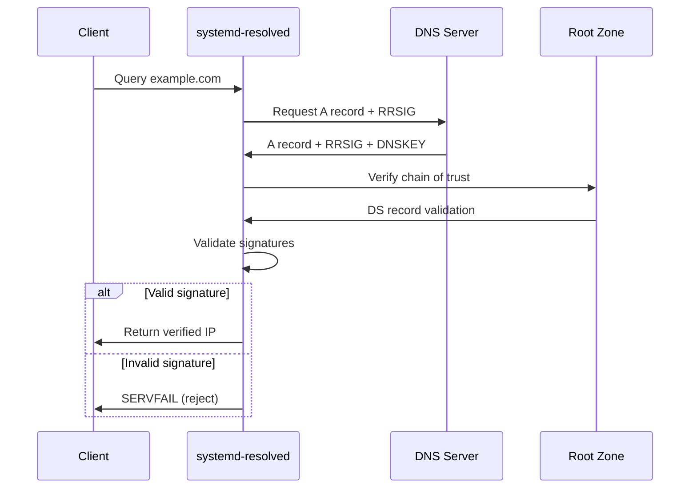

# How to Enable DNSSEC Validation in systemd-resolved

Author: [nawazdhandala](https://github.com/nawazdhandala)

Tags: DNSSEC, systemd, DNS, Security, Linux, Ubuntu

Description: A comprehensive guide to configuring DNSSEC validation in systemd-resolved to protect your Linux system from DNS spoofing and cache poisoning attacks.

---

DNS is the phonebook of the internet, but it was designed in an era when trust was assumed. DNSSEC (Domain Name System Security Extensions) adds cryptographic signatures to DNS records, allowing resolvers to verify that responses have not been tampered with. If you run a modern Linux distribution with systemd, enabling DNSSEC validation in systemd-resolved is one of the simplest ways to harden your network security.

## Why DNSSEC Matters

Without DNSSEC, an attacker can:

- **Poison DNS caches:** Redirect your traffic to malicious servers
- **Perform man-in-the-middle attacks:** Intercept sensitive communications
- **Hijack domain lookups:** Send you to phishing sites that look identical to legitimate ones

DNSSEC prevents these attacks by using public-key cryptography to sign DNS records. When your resolver validates these signatures, it can detect and reject forged responses.



## Understanding systemd-resolved

systemd-resolved is the default DNS resolver on most modern Linux distributions, including Ubuntu 18.04+, Debian 10+, Fedora, and Arch Linux. It provides:

- Local DNS caching
- DNSSEC validation
- DNS-over-TLS support
- mDNS and LLMNR resolution
- Per-interface DNS configuration

### Check if systemd-resolved is Running

```bash
systemctl status systemd-resolved
```

Expected output:

```
● systemd-resolved.service - Network Name Resolution
     Loaded: loaded (/lib/systemd/system/systemd-resolved.service; enabled; vendor preset: enabled)
     Active: active (running) since Wed 2026-01-15 10:00:00 UTC; 2h ago
       Docs: man:systemd-resolved.service(8)
   Main PID: 1234 (systemd-resolve)
     Status: "Processing requests..."
      Tasks: 1 (limit: 4915)
     Memory: 8.2M
        CPU: 1.234s
     CGroup: /system.slice/systemd-resolved.service
             └─1234 /lib/systemd/systemd-resolved
```

### View Current DNS Configuration

```bash
resolvectl status
```

This displays the current DNS servers, search domains, and security settings for each network interface.

## DNSSEC Configuration Options

systemd-resolved supports four DNSSEC modes:

| Mode | Description | Use Case |
| --- | --- | --- |
| `no` | DNSSEC validation disabled | Legacy systems or debugging |
| `allow-downgrade` | Validate if signatures exist, allow unsigned responses | Default, transitional |
| `yes` | Strict validation, reject invalid signatures | Recommended for security |
| `true` | Alias for `yes` | Same as above |

The default `allow-downgrade` mode is a compromise: it validates signed domains but allows unsigned ones. This prevents breakage for domains without DNSSEC but does not protect against downgrade attacks where an attacker strips signatures.

## Enabling Strict DNSSEC Validation

### Step 1: Create the Configuration Directory

```bash
sudo mkdir -p /etc/systemd/resolved.conf.d
```

### Step 2: Create the DNSSEC Configuration File

```bash
sudo nano /etc/systemd/resolved.conf.d/dnssec.conf
```

Add the following content:

```ini
[Resolve]
DNSSEC=yes
```

### Step 3: Restart systemd-resolved

```bash
sudo systemctl restart systemd-resolved
```

### Step 4: Verify the Configuration

```bash
resolvectl status
```

Look for the DNSSEC setting in the output:

```
Global
       Protocols: +LLMNR +mDNS +DNSOverTLS DNSSEC=yes/supported
resolv.conf mode: stub
     DNS Servers: 1.1.1.1 8.8.8.8
```

## Complete Configuration Example

Here is a comprehensive configuration file that enables DNSSEC along with other security features:

```ini
# /etc/systemd/resolved.conf.d/security.conf

[Resolve]
# Enable strict DNSSEC validation
DNSSEC=yes

# Use DNS-over-TLS for encrypted queries
DNSOverTLS=yes

# Fallback DNS servers with DNSSEC support
DNS=1.1.1.1#cloudflare-dns.com 1.0.0.1#cloudflare-dns.com
DNS=8.8.8.8#dns.google 8.8.4.4#dns.google
DNS=9.9.9.9#dns.quad9.net 149.112.112.112#dns.quad9.net

# Fallback DNS servers (used if main servers fail)
FallbackDNS=208.67.222.222#dns.opendns.com 208.67.220.220#dns.opendns.com

# Search domains (optional)
# Domains=example.com

# Cache settings
Cache=yes
CacheFromLocalhost=no

# Disable multicast DNS if not needed
MulticastDNS=no

# Disable LLMNR if not needed (reduces attack surface)
LLMNR=no

# DNS stub listener configuration
DNSStubListener=yes
DNSStubListenerExtra=
```

### Configuration Parameter Reference

| Parameter | Values | Description |
| --- | --- | --- |
| `DNSSEC` | `no`, `allow-downgrade`, `yes` | DNSSEC validation mode |
| `DNSOverTLS` | `no`, `opportunistic`, `yes` | Encrypt DNS queries with TLS |
| `DNS` | IP addresses | Primary DNS servers |
| `FallbackDNS` | IP addresses | Backup DNS servers |
| `Domains` | Domain names | Search domains |
| `Cache` | `yes`, `no`, `no-negative` | Enable/disable DNS caching |
| `CacheFromLocalhost` | `yes`, `no` | Cache responses from localhost |
| `MulticastDNS` | `yes`, `no`, `resolve` | mDNS configuration |
| `LLMNR` | `yes`, `no`, `resolve` | Link-Local Multicast Name Resolution |
| `DNSStubListener` | `yes`, `no`, `udp`, `tcp` | Local stub resolver |

## Choosing DNS Servers with DNSSEC Support

Not all DNS servers support DNSSEC validation. Here are popular options that do:

### Public DNS Servers with DNSSEC Support

| Provider | Primary | Secondary | DoT Hostname |
| --- | --- | --- | --- |
| Cloudflare | 1.1.1.1 | 1.0.0.1 | cloudflare-dns.com |
| Google | 8.8.8.8 | 8.8.4.4 | dns.google |
| Quad9 | 9.9.9.9 | 149.112.112.112 | dns.quad9.net |
| OpenDNS | 208.67.222.222 | 208.67.220.220 | dns.opendns.com |
| CleanBrowsing | 185.228.168.168 | 185.228.169.168 | security-filter-dns.cleanbrowsing.org |
| AdGuard | 94.140.14.14 | 94.140.15.15 | dns.adguard.com |
| Mullvad | 194.242.2.2 | 194.242.2.3 | dns.mullvad.net |

### IPv6 DNS Servers

| Provider | Primary IPv6 | Secondary IPv6 |
| --- | --- | --- |
| Cloudflare | 2606:4700:4700::1111 | 2606:4700:4700::1001 |
| Google | 2001:4860:4860::8888 | 2001:4860:4860::8844 |
| Quad9 | 2620:fe::fe | 2620:fe::9 |
| OpenDNS | 2620:119:35::35 | 2620:119:53::53 |

## Verifying DNSSEC is Working

### Test 1: Query a DNSSEC-Signed Domain

```bash
resolvectl query cloudflare.com
```

Expected output:

```
cloudflare.com: 104.16.132.229
                104.16.133.229
                -- link: eth0
                -- Information acquired via protocol DNS in 23.4ms.
                -- Data is authenticated: yes
```

The key indicator is `Data is authenticated: yes`.

### Test 2: Test with dig Command

```bash
dig +dnssec cloudflare.com
```

Look for the `ad` (Authenticated Data) flag in the response:

```
;; flags: qr rd ra ad; QUERY: 1, ANSWER: 3, AUTHORITY: 0, ADDITIONAL: 1
```

### Test 3: Query a Known-Bad DNSSEC Domain

The domain `dnssec-failed.org` is intentionally configured with invalid DNSSEC signatures for testing:

```bash
resolvectl query dnssec-failed.org
```

With strict DNSSEC enabled, this should fail:

```
dnssec-failed.org: resolve call failed: DNSSEC validation failed: signature-expired
```

### Test 4: Use the DNSSEC Debugger

Online tools can help verify your DNSSEC configuration:

- Verisign DNSSEC Debugger: https://dnssec-debugger.verisignlabs.com/
- DNSViz: https://dnsviz.net/
- DNSSEC Analyzer: https://dnssec-analyzer.verisignlabs.com/

### Test 5: Check the System Journal

```bash
journalctl -u systemd-resolved -f
```

This shows real-time DNSSEC validation events:

```
Jan 15 10:30:15 hostname systemd-resolved[1234]: DNSSEC validation failed for example.org: signature-expired
Jan 15 10:30:16 hostname systemd-resolved[1234]: DNSSEC validation succeeded for cloudflare.com
```

## Troubleshooting DNSSEC Issues

### Issue 1: Websites Not Loading

If enabling strict DNSSEC breaks website access:

```bash
# Check if the domain has valid DNSSEC
dig +dnssec example.com

# Temporarily disable DNSSEC for testing
sudo sed -i 's/DNSSEC=yes/DNSSEC=allow-downgrade/' /etc/systemd/resolved.conf.d/dnssec.conf
sudo systemctl restart systemd-resolved
```

### Issue 2: Slow DNS Resolution

DNSSEC validation requires additional queries. If resolution is slow:

```bash
# Check DNS server latency
resolvectl statistics

# View cache hit rate
resolvectl statistics | grep -i cache
```

Consider using DNS servers geographically closer to you.

### Issue 3: DNSSEC Validation Failing for Valid Domains

This can happen if:

1. Your system clock is wrong (DNSSEC signatures are time-sensitive)
2. Your DNS server does not support DNSSEC
3. Network equipment is stripping DNSSEC records

```bash
# Check system time
timedatectl status

# Sync time if needed
sudo timedatectl set-ntp true
```

### Issue 4: DNS Not Working After Configuration

```bash
# Check for configuration syntax errors
systemd-analyze verify /etc/systemd/resolved.conf.d/*.conf

# View resolved logs for errors
journalctl -u systemd-resolved --no-pager -n 50

# Reset to default configuration
sudo rm /etc/systemd/resolved.conf.d/dnssec.conf
sudo systemctl restart systemd-resolved
```

### Issue 5: Conflicting DNS Configuration

On some systems, NetworkManager or other services may override systemd-resolved settings:

```bash
# Check who manages resolv.conf
ls -la /etc/resolv.conf

# Should be a symlink to systemd-resolved stub
# /etc/resolv.conf -> ../run/systemd/resolve/stub-resolv.conf

# Fix if needed
sudo ln -sf /run/systemd/resolve/stub-resolv.conf /etc/resolv.conf
```

## Advanced Configuration

### Per-Interface DNSSEC Settings

You can configure different DNSSEC settings for different network interfaces:

```bash
# Enable DNSSEC only on eth0
sudo resolvectl dnssec eth0 yes

# Disable DNSSEC on wlan0 (e.g., for captive portals)
sudo resolvectl dnssec wlan0 no

# Check current settings
resolvectl status eth0
resolvectl status wlan0
```

### Persistent Per-Interface Configuration with networkd

Create a network configuration file:

```bash
sudo nano /etc/systemd/network/10-eth0.network
```

```ini
[Match]
Name=eth0

[Network]
DHCP=yes
DNSSEC=yes
DNSOverTLS=yes

[DHCP]
UseDNS=no  # Ignore DHCP-provided DNS
```

### Using Custom Trust Anchors

For private zones or testing, you can add custom trust anchors:

```bash
sudo mkdir -p /etc/dnssec-trust-anchors.d
sudo nano /etc/dnssec-trust-anchors.d/example.positive
```

```
example.com. DS 12345 8 2 ABCDEF1234567890...
```

## Combining DNSSEC with DNS-over-TLS

For maximum security, enable both DNSSEC and DNS-over-TLS:

```ini
# /etc/systemd/resolved.conf.d/secure-dns.conf

[Resolve]
# Validate DNSSEC signatures
DNSSEC=yes

# Encrypt DNS traffic with TLS
DNSOverTLS=yes

# Use DoT-capable servers
DNS=1.1.1.1#cloudflare-dns.com
DNS=9.9.9.9#dns.quad9.net
```

This provides:

| Feature | DNSSEC | DNS-over-TLS | Both |
| --- | --- | --- | --- |
| Prevents tampering | Yes | No | Yes |
| Encrypts queries | No | Yes | Yes |
| Hides queries from ISP | No | Yes | Yes |
| Validates authenticity | Yes | No | Yes |
| Prevents cache poisoning | Yes | No | Yes |

## Monitoring DNSSEC with OneUptime

You can monitor your DNSSEC configuration using OneUptime's synthetic monitoring:

### Create a DNS Monitor

1. Navigate to your OneUptime dashboard
2. Create a new DNS monitor
3. Configure it to check DNSSEC-protected domains
4. Set up alerts for validation failures

### Monitor DNS Resolution Time

Track DNS resolution latency to detect DNSSEC-related performance issues:

```yaml
# Example OneUptime probe configuration
probe:
  type: dns
  target: example.com
  record_type: A
  dnssec_validation: true
  alerts:
    - condition: response_time > 500ms
      severity: warning
    - condition: dnssec_valid == false
      severity: critical
```

## Security Best Practices

### 1. Enable DNSSEC System-Wide

```bash
# Create configuration
echo "[Resolve]
DNSSEC=yes" | sudo tee /etc/systemd/resolved.conf.d/dnssec.conf

# Apply
sudo systemctl restart systemd-resolved
```

### 2. Use Multiple DNS Providers

Diversify your DNS providers to avoid single points of failure:

```ini
[Resolve]
DNS=1.1.1.1 9.9.9.9 8.8.8.8
FallbackDNS=208.67.222.222 185.228.168.168
```

### 3. Combine with Firewall Rules

Block DNS traffic that bypasses systemd-resolved:

```bash
# Allow DNS only through systemd-resolved (127.0.0.53)
sudo iptables -A OUTPUT -p udp --dport 53 ! -d 127.0.0.53 -j DROP
sudo iptables -A OUTPUT -p tcp --dport 53 ! -d 127.0.0.53 -j DROP
```

### 4. Regular Monitoring

Set up monitoring to detect:

- DNSSEC validation failures
- DNS resolution latency spikes
- DNS server availability
- Configuration drift

### 5. Keep System Time Synchronized

DNSSEC signatures have validity periods. Incorrect system time causes validation failures:

```bash
# Ensure NTP is enabled
sudo timedatectl set-ntp true

# Check time sync status
timedatectl show-timesync --all
```

## Automation Scripts

### Enable DNSSEC Script

```bash
#!/bin/bash
# enable-dnssec.sh - Enable DNSSEC on systemd-resolved

set -e

echo "Creating DNSSEC configuration..."
sudo mkdir -p /etc/systemd/resolved.conf.d

sudo tee /etc/systemd/resolved.conf.d/dnssec.conf > /dev/null <<EOF
[Resolve]
DNSSEC=yes
DNSOverTLS=yes
DNS=1.1.1.1#cloudflare-dns.com 9.9.9.9#dns.quad9.net
FallbackDNS=8.8.8.8#dns.google 208.67.222.222#dns.opendns.com
EOF

echo "Restarting systemd-resolved..."
sudo systemctl restart systemd-resolved

echo "Verifying configuration..."
sleep 2
resolvectl status | grep -i dnssec

echo "Testing DNSSEC validation..."
if resolvectl query cloudflare.com | grep -q "authenticated: yes"; then
    echo "SUCCESS: DNSSEC is working correctly"
else
    echo "WARNING: DNSSEC may not be functioning properly"
fi
```

### DNSSEC Status Check Script

```bash
#!/bin/bash
# check-dnssec.sh - Verify DNSSEC configuration and functionality

echo "=== systemd-resolved Status ==="
systemctl status systemd-resolved --no-pager

echo -e "\n=== DNS Configuration ==="
resolvectl status

echo -e "\n=== DNS Statistics ==="
resolvectl statistics

echo -e "\n=== DNSSEC Test: Valid Domain ==="
resolvectl query cloudflare.com

echo -e "\n=== DNSSEC Test: Invalid Domain ==="
resolvectl query dnssec-failed.org 2>&1 || echo "Expected failure for invalid DNSSEC"

echo -e "\n=== Recent DNS Events ==="
journalctl -u systemd-resolved --no-pager -n 20 --since "1 hour ago"
```

### Ansible Playbook for DNSSEC

```yaml
---
# dnssec-playbook.yml - Enable DNSSEC across fleet

- name: Configure DNSSEC on systemd-resolved
  hosts: all
  become: yes
  tasks:
    - name: Ensure systemd-resolved is installed
      package:
        name: systemd-resolved
        state: present
      when: ansible_os_family == "Debian"

    - name: Create resolved.conf.d directory
      file:
        path: /etc/systemd/resolved.conf.d
        state: directory
        mode: '0755'

    - name: Configure DNSSEC
      copy:
        dest: /etc/systemd/resolved.conf.d/dnssec.conf
        content: |
          [Resolve]
          DNSSEC=yes
          DNSOverTLS=yes
          DNS=1.1.1.1#cloudflare-dns.com 9.9.9.9#dns.quad9.net
          FallbackDNS=8.8.8.8#dns.google
        mode: '0644'
      notify: Restart systemd-resolved

    - name: Ensure resolv.conf symlink
      file:
        src: /run/systemd/resolve/stub-resolv.conf
        dest: /etc/resolv.conf
        state: link
        force: yes

  handlers:
    - name: Restart systemd-resolved
      systemd:
        name: systemd-resolved
        state: restarted
        daemon_reload: yes
```

## Distribution-Specific Notes

### Ubuntu 20.04+

systemd-resolved is enabled by default. Just add the configuration:

```bash
sudo mkdir -p /etc/systemd/resolved.conf.d
echo "[Resolve]
DNSSEC=yes" | sudo tee /etc/systemd/resolved.conf.d/dnssec.conf
sudo systemctl restart systemd-resolved
```

### Debian 11+

May need to enable systemd-resolved first:

```bash
sudo systemctl enable --now systemd-resolved
sudo ln -sf /run/systemd/resolve/stub-resolv.conf /etc/resolv.conf
```

### Fedora

systemd-resolved is active by default:

```bash
sudo mkdir -p /etc/systemd/resolved.conf.d
sudo cp /usr/lib/systemd/resolved.conf /etc/systemd/resolved.conf.d/dnssec.conf
sudo sed -i 's/#DNSSEC=.*/DNSSEC=yes/' /etc/systemd/resolved.conf.d/dnssec.conf
sudo systemctl restart systemd-resolved
```

### Arch Linux

Install and enable:

```bash
sudo systemctl enable --now systemd-resolved
sudo ln -sf /run/systemd/resolve/stub-resolv.conf /etc/resolv.conf
```

### CentOS/RHEL 8+

Enable systemd-resolved:

```bash
sudo systemctl enable --now systemd-resolved
sudo mkdir -p /etc/systemd/resolved.conf.d
```

## Summary Table

| Task | Command |
| --- | --- |
| Check resolved status | `systemctl status systemd-resolved` |
| View DNS configuration | `resolvectl status` |
| Enable strict DNSSEC | Create `/etc/systemd/resolved.conf.d/dnssec.conf` with `DNSSEC=yes` |
| Restart resolved | `sudo systemctl restart systemd-resolved` |
| Test DNSSEC validation | `resolvectl query cloudflare.com` |
| Test invalid DNSSEC | `resolvectl query dnssec-failed.org` |
| View DNS statistics | `resolvectl statistics` |
| Flush DNS cache | `resolvectl flush-caches` |
| View resolved logs | `journalctl -u systemd-resolved -f` |
| Check time sync | `timedatectl status` |

## Conclusion

Enabling DNSSEC validation in systemd-resolved is a straightforward way to protect your Linux systems from DNS-based attacks. While it will not fix the internet's trust problems overnight, it raises the bar significantly for attackers attempting DNS spoofing or cache poisoning.

Start with `DNSSEC=yes` on your development machines, test thoroughly, and roll out to production once you have verified compatibility with your infrastructure. Combine DNSSEC with DNS-over-TLS for defense in depth, and set up monitoring to catch validation failures before they impact users.

The DNS security landscape continues to evolve, but DNSSEC remains the foundation. Enable it today.

---

**Related Resources:**

- [systemd-resolved documentation](https://www.freedesktop.org/software/systemd/man/systemd-resolved.service.html)
- [DNSSEC Key Signing Key (KSK) Rollover](https://www.icann.org/resources/pages/ksk-rollover)
- [RFC 4033 - DNS Security Introduction](https://datatracker.ietf.org/doc/html/rfc4033)
- [Cloudflare DNSSEC Documentation](https://developers.cloudflare.com/dns/dnssec/)
