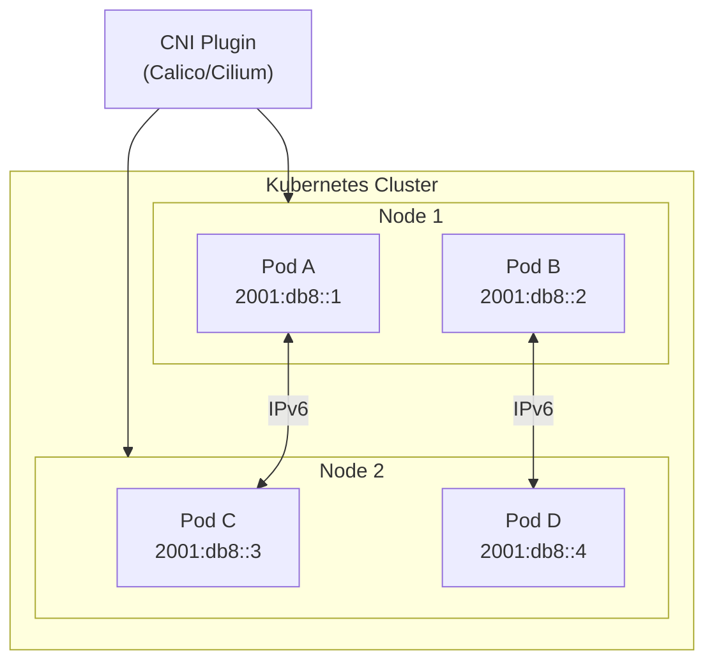

# How to Troubleshoot IPv6 Pod-to-Pod Communication Issues

Author: [nawazdhandala](https://github.com/nawazdhandala)

Tags: IPv6, Kubernetes, Troubleshooting, Networking, DevOps, Debugging

Description: A comprehensive guide to diagnosing and resolving IPv6 pod-to-pod communication failures in Kubernetes, covering CNI configuration, network policies, and common pitfalls.

---

IPv6 adoption in Kubernetes is growing as organizations prepare for IPv4 exhaustion and modernize their network infrastructure. However, IPv6 pod-to-pod communication introduces unique challenges that can frustrate even experienced engineers. This guide provides a systematic approach to diagnosing and resolving IPv6 networking issues in Kubernetes clusters.

## Understanding IPv6 in Kubernetes

Before diving into troubleshooting, let's understand how IPv6 works in Kubernetes.



### Kubernetes IPv6 Modes

Kubernetes supports three IP addressing modes:

1. **IPv4-only** (default): Pods receive only IPv4 addresses
2. **IPv6-only**: Pods receive only IPv6 addresses
3. **Dual-stack**: Pods receive both IPv4 and IPv6 addresses

Check your cluster's IP configuration:

```bash
# Check cluster CIDR configuration
kubectl cluster-info dump | grep -i cidr

# Check pod IP families
kubectl get pods -o wide

# Verify service IP families
kubectl get svc -o jsonpath='{.items[*].spec.ipFamilies}'
```

## Prerequisites for IPv6 Networking

### CNI Plugin Support

Not all CNI plugins support IPv6 equally. Here's the compatibility matrix:

| CNI Plugin | IPv6 Support | Dual-Stack | Notes |
|------------|--------------|------------|-------|
| Calico     | Full         | Yes        | Recommended for IPv6 |
| Cilium     | Full         | Yes        | eBPF-based, excellent performance |
| Flannel    | Limited      | Yes (v0.12+) | VXLAN mode only |
| Weave Net  | Full         | Yes        | Automatic configuration |
| Canal      | Full         | Yes        | Calico + Flannel |
| Kube-router| Partial      | Limited    | BGP mode recommended |

Check your installed CNI:

```bash
# Identify CNI plugin
kubectl get pods -n kube-system | grep -E 'calico|cilium|flannel|weave'

# Check CNI configuration
cat /etc/cni/net.d/*.conf | jq .
```

### Kernel Requirements

IPv6 networking requires specific kernel modules and sysctl settings:

```bash
# Verify IPv6 is enabled in kernel
cat /proc/sys/net/ipv6/conf/all/disable_ipv6
# Should return 0

# Check required sysctl settings
sysctl net.ipv6.conf.all.forwarding
# Should return 1

# Verify IPv6 modules
lsmod | grep ipv6
```

## Quick Diagnostic Commands

Start with these commands to get an overview of the problem:

```bash
# Check pod IPv6 addresses
kubectl get pods -o wide -A | grep -v "^kube-system"

# Verify pod has IPv6 address
kubectl get pod <pod-name> -o jsonpath='{.status.podIPs}'

# Check service endpoints
kubectl get endpoints <service-name> -o yaml

# View CNI logs
kubectl logs -n kube-system -l k8s-app=calico-node --tail=100

# Check network policies
kubectl get networkpolicies -A
```

## Step-by-Step Troubleshooting Guide

### Step 1: Verify IPv6 Address Assignment

First, confirm that pods are receiving IPv6 addresses:

```bash
# Get pod IP addresses
kubectl get pod <pod-name> -o jsonpath='{.status.podIPs[*].ip}'

# For all pods in a namespace
kubectl get pods -n <namespace> -o custom-columns=NAME:.metadata.name,IPS:.status.podIPs

# Check if IPv6 address is assigned
kubectl exec <pod-name> -- ip -6 addr show
```

Expected output showing an IPv6 address:

```
3: eth0@if123: <BROADCAST,MULTICAST,UP,LOWER_UP> mtu 1500 state UP
    inet6 2001:db8:1234::5/64 scope global
       valid_lft forever preferred_lft forever
    inet6 fe80::1/64 scope link
       valid_lft forever preferred_lft forever
```

**If no IPv6 address is assigned:**

```bash
# Check CNI configuration for IPv6
kubectl get configmap -n kube-system calico-config -o yaml | grep -i ipv6

# Verify cluster CIDR includes IPv6
kubectl get cm -n kube-system kubeadm-config -o yaml | grep -i cidr
```

### Step 2: Test Basic IPv6 Connectivity

Create test pods to verify connectivity:

```yaml
# ipv6-test-pods.yaml
apiVersion: v1
kind: Pod
metadata:
  name: ipv6-client
  namespace: default
spec:
  containers:
    - name: client
      image: nicolaka/netshoot:latest
      command: ["sleep", "infinity"]
---
apiVersion: v1
kind: Pod
metadata:
  name: ipv6-server
  namespace: default
spec:
  containers:
    - name: server
      image: nicolaka/netshoot:latest
      command: ["sleep", "infinity"]
```

Apply and test:

```bash
# Deploy test pods
kubectl apply -f ipv6-test-pods.yaml

# Wait for pods to be ready
kubectl wait --for=condition=Ready pod/ipv6-client pod/ipv6-server

# Get server IPv6 address
SERVER_IPV6=$(kubectl get pod ipv6-server -o jsonpath='{.status.podIPs[?(@.ip contains ":")].ip}')

# Test ping from client to server
kubectl exec ipv6-client -- ping6 -c 4 $SERVER_IPV6
```

### Step 3: Check IPv6 Routing

Verify the routing tables are correctly configured:

```bash
# Check IPv6 routes inside pod
kubectl exec <pod-name> -- ip -6 route show

# Expected output:
# 2001:db8::/64 dev eth0 proto kernel metric 256
# fe80::/64 dev eth0 proto kernel metric 256
# default via fe80::1 dev eth0 metric 1024

# Check node IPv6 routes
kubectl debug node/<node-name> -it --image=nicolaka/netshoot -- ip -6 route show
```

**Common routing issues:**

```bash
# Missing default route
kubectl exec <pod-name> -- ip -6 route add default via <gateway-ipv6> dev eth0

# Check if forwarding is enabled on node
kubectl debug node/<node-name> -it --image=nicolaka/netshoot -- \
  sysctl net.ipv6.conf.all.forwarding
```

### Step 4: Inspect Network Policies

Network policies can block IPv6 traffic if not configured correctly:

```bash
# List all network policies
kubectl get networkpolicies -A

# Describe specific policy
kubectl describe networkpolicy <policy-name> -n <namespace>

# Check if policy affects IPv6 traffic
kubectl get networkpolicy <policy-name> -o yaml
```

Ensure your network policies include IPv6 CIDR blocks:

```yaml
apiVersion: networking.k8s.io/v1
kind: NetworkPolicy
metadata:
  name: allow-ipv6-traffic
  namespace: production
spec:
  podSelector:
    matchLabels:
      app: myapp
  policyTypes:
    - Ingress
    - Egress
  ingress:
    - from:
        - ipBlock:
            cidr: 2001:db8::/32  # IPv6 CIDR
        - ipBlock:
            cidr: 10.0.0.0/8     # IPv4 CIDR
  egress:
    - to:
        - ipBlock:
            cidr: 2001:db8::/32
        - ipBlock:
            cidr: 0.0.0.0/0
```

### Step 5: Verify DNS Resolution for IPv6

DNS issues are a common cause of IPv6 communication failures:

```bash
# Test DNS resolution for AAAA records
kubectl exec <pod-name> -- nslookup -type=AAAA <service-name>

# Check CoreDNS configuration
kubectl get configmap coredns -n kube-system -o yaml

# Verify CoreDNS is returning IPv6 addresses
kubectl exec <pod-name> -- dig AAAA <service-name>.default.svc.cluster.local

# Test DNS from inside pod
kubectl exec <pod-name> -- cat /etc/resolv.conf
```

**Fix CoreDNS for IPv6:**

```yaml
apiVersion: v1
kind: ConfigMap
metadata:
  name: coredns
  namespace: kube-system
data:
  Corefile: |
    .:53 {
        errors
        health {
            lameduck 5s
        }
        ready
        kubernetes cluster.local in-addr.arpa ip6.arpa {
            pods insecure
            fallthrough in-addr.arpa ip6.arpa
            ttl 30
        }
        prometheus :9153
        forward . /etc/resolv.conf {
            max_concurrent 1000
        }
        cache 30
        loop
        reload
        loadbalance
    }
```

### Step 6: Check Service Configuration

Services must be configured for dual-stack or IPv6-only:

```bash
# Check service IP families
kubectl get svc <service-name> -o jsonpath='{.spec.ipFamilies}'

# Verify service has IPv6 cluster IP
kubectl get svc <service-name> -o jsonpath='{.spec.clusterIPs}'

# Check endpoints for IPv6 addresses
kubectl get endpoints <service-name> -o yaml
```

Create an IPv6-enabled service:

```yaml
apiVersion: v1
kind: Service
metadata:
  name: my-service
spec:
  selector:
    app: myapp
  ipFamilyPolicy: PreferDualStack  # or RequireDualStack, SingleStack
  ipFamilies:
    - IPv6
    - IPv4
  ports:
    - protocol: TCP
      port: 80
      targetPort: 8080
```

### Step 7: Diagnose CNI-Specific Issues

#### Calico IPv6 Troubleshooting

```bash
# Check Calico node status
kubectl get pods -n kube-system -l k8s-app=calico-node

# View Calico logs
kubectl logs -n kube-system -l k8s-app=calico-node -c calico-node --tail=50

# Check IP pools
kubectl get ippools -o yaml

# Verify IPv6 pool exists
kubectl get ippool -o jsonpath='{.items[*].spec.cidr}' | tr ' ' '\n' | grep ':'
```

Create an IPv6 IP pool for Calico:

```yaml
apiVersion: crd.projectcalico.org/v1
kind: IPPool
metadata:
  name: ipv6-ippool
spec:
  cidr: 2001:db8::/48
  ipipMode: Never
  vxlanMode: Never
  natOutgoing: false
  nodeSelector: all()
```

#### Cilium IPv6 Troubleshooting

```bash
# Check Cilium status
kubectl exec -n kube-system -l k8s-app=cilium -- cilium status

# Verify IPv6 is enabled
kubectl exec -n kube-system -l k8s-app=cilium -- cilium config | grep ipv6

# Check endpoint connectivity
kubectl exec -n kube-system -l k8s-app=cilium -- cilium endpoint list

# View BPF maps for IPv6
kubectl exec -n kube-system -l k8s-app=cilium -- cilium bpf ct list global | grep -i ipv6
```

Enable IPv6 in Cilium:

```yaml
# cilium-config.yaml
apiVersion: v1
kind: ConfigMap
metadata:
  name: cilium-config
  namespace: kube-system
data:
  enable-ipv6: "true"
  ipv6-cluster-alloc-cidr: "2001:db8::/48"
  enable-ipv6-masquerade: "false"
```

### Step 8: Check Firewall and iptables/ip6tables Rules

Firewalls might be blocking IPv6 traffic:

```bash
# Check ip6tables rules on the node
kubectl debug node/<node-name> -it --image=nicolaka/netshoot -- ip6tables -L -n -v

# Check for DROP rules
kubectl debug node/<node-name> -it --image=nicolaka/netshoot -- ip6tables -L -n | grep DROP

# Verify FORWARD chain allows traffic
kubectl debug node/<node-name> -it --image=nicolaka/netshoot -- ip6tables -L FORWARD -n -v
```

Common iptables issues and fixes:

```bash
# Allow all IPv6 forwarding (temporary fix for testing)
ip6tables -P FORWARD ACCEPT

# Allow ICMPv6 (required for IPv6 to work properly)
ip6tables -A INPUT -p ipv6-icmp -j ACCEPT
ip6tables -A OUTPUT -p ipv6-icmp -j ACCEPT
ip6tables -A FORWARD -p ipv6-icmp -j ACCEPT
```

### Step 9: Analyze Packet Captures

When all else fails, capture packets to see what's happening:

```bash
# Capture IPv6 traffic on a pod
kubectl exec <pod-name> -- tcpdump -i eth0 ip6 -n -c 50

# Capture ICMPv6 traffic
kubectl exec <pod-name> -- tcpdump -i eth0 icmp6 -n -c 20

# Capture traffic to specific IPv6 address
kubectl exec <pod-name> -- tcpdump -i eth0 host 2001:db8::1 -n -c 50

# Save capture to file for analysis
kubectl exec <pod-name> -- tcpdump -i eth0 ip6 -w /tmp/capture.pcap -c 100
kubectl cp <pod-name>:/tmp/capture.pcap ./capture.pcap
```

Analyze common patterns:

```bash
# Look for ICMPv6 destination unreachable
kubectl exec <pod-name> -- tcpdump -i eth0 'icmp6 and ip6[40] == 1' -n

# Check for neighbor discovery issues
kubectl exec <pod-name> -- tcpdump -i eth0 'icmp6 and (ip6[40] == 135 or ip6[40] == 136)' -n
```

## Common IPv6 Issues and Solutions

### Issue 1: Pods Not Receiving IPv6 Addresses

**Symptoms:**
- `kubectl get pods -o wide` shows only IPv4 addresses
- `ip -6 addr show` inside pod shows no global IPv6 address

**Causes and Solutions:**

```bash
# Check if cluster is configured for dual-stack
kubectl get nodes -o jsonpath='{.items[*].spec.podCIDRs}'

# If not configured, reconfigure cluster (requires cluster recreation for kubeadm)
# For new clusters, use:
kubeadm init --pod-network-cidr=10.244.0.0/16,2001:db8::/48 \
  --service-cidr=10.96.0.0/12,2001:db8:1::/112
```

### Issue 2: IPv6 Traffic Blocked Between Nodes

**Symptoms:**
- Pods on the same node can communicate via IPv6
- Cross-node IPv6 communication fails

**Diagnostic steps:**

```bash
# Test connectivity between nodes directly
kubectl debug node/node1 -it --image=nicolaka/netshoot -- \
  ping6 -c 4 <node2-ipv6-address>

# Check if encapsulation is working
kubectl exec -n kube-system -l k8s-app=calico-node -- \
  calico-node -felix-live -felix-ready
```

**Solutions:**

```yaml
# For Calico, ensure VXLAN is configured for IPv6
apiVersion: crd.projectcalico.org/v1
kind: IPPool
metadata:
  name: ipv6-ippool
spec:
  cidr: 2001:db8::/48
  vxlanMode: Always  # Enable VXLAN for cross-node traffic
  natOutgoing: false
```

### Issue 3: Services Not Load Balancing IPv6 Traffic

**Symptoms:**
- Service has no IPv6 cluster IP
- Endpoints show only IPv4 addresses

**Solutions:**

```bash
# Update service to use dual-stack
kubectl patch svc <service-name> -p '{"spec":{"ipFamilyPolicy":"PreferDualStack","ipFamilies":["IPv6","IPv4"]}}'

# Verify change
kubectl get svc <service-name> -o jsonpath='{.spec.clusterIPs}'
```

### Issue 4: DNS Not Resolving AAAA Records

**Symptoms:**
- `nslookup -type=AAAA` returns no records
- Applications fail to connect via IPv6

**Solutions:**

```bash
# Restart CoreDNS pods
kubectl rollout restart deployment coredns -n kube-system

# Check CoreDNS logs
kubectl logs -n kube-system -l k8s-app=kube-dns --tail=100
```

### Issue 5: Network Policies Blocking IPv6

**Symptoms:**
- IPv4 traffic works, IPv6 is blocked
- Network policy exists but doesn't include IPv6 CIDRs

**Solution:**

```yaml
# Update network policy to include IPv6
apiVersion: networking.k8s.io/v1
kind: NetworkPolicy
metadata:
  name: allow-all-ipv6
  namespace: default
spec:
  podSelector: {}
  policyTypes:
    - Ingress
    - Egress
  ingress:
    - from:
        - ipBlock:
            cidr: ::/0  # All IPv6
  egress:
    - to:
        - ipBlock:
            cidr: ::/0  # All IPv6
```

### Issue 6: ICMPv6 Blocked

**Symptoms:**
- Ping6 fails
- Neighbor discovery doesn't work
- Path MTU discovery broken

**Solution:**

```bash
# Ensure ICMPv6 is allowed in firewall
ip6tables -A INPUT -p ipv6-icmp -j ACCEPT
ip6tables -A OUTPUT -p ipv6-icmp -j ACCEPT
ip6tables -A FORWARD -p ipv6-icmp -j ACCEPT

# Or in network policy
```

```yaml
apiVersion: networking.k8s.io/v1
kind: NetworkPolicy
metadata:
  name: allow-icmpv6
spec:
  podSelector: {}
  policyTypes:
    - Ingress
    - Egress
  ingress:
    - ports:
        - protocol: ICMP  # Note: This is limited in standard NetworkPolicy
  egress:
    - ports:
        - protocol: ICMP
```

### Issue 7: MTU Issues with IPv6

**Symptoms:**
- Small packets work, large packets fail
- Connection hangs during data transfer
- TCP connections reset during large transfers

**Diagnostic:**

```bash
# Test different packet sizes
kubectl exec <pod-name> -- ping6 -c 4 -s 1400 <target-ipv6>
kubectl exec <pod-name> -- ping6 -c 4 -s 1472 <target-ipv6>  # Max for 1500 MTU

# Check interface MTU
kubectl exec <pod-name> -- ip link show eth0
```

**Solution:**

```bash
# Reduce MTU in CNI configuration
# For Calico:
kubectl patch felixconfiguration default -p '{"spec":{"mtu": 1440}}' --type=merge
```

### Issue 8: Dual-Stack Service Preference Issues

**Symptoms:**
- Applications prefer IPv4 over IPv6 or vice versa
- Inconsistent connection behavior

**Solution:**

```yaml
# Set explicit IP family preference
apiVersion: v1
kind: Service
metadata:
  name: my-service
spec:
  ipFamilyPolicy: PreferDualStack
  ipFamilies:
    - IPv6  # Primary
    - IPv4  # Secondary
  ports:
    - port: 80
```

## Advanced Debugging Techniques

### Using Network Namespaces

```bash
# Find pod's network namespace
POD_ID=$(kubectl get pod <pod-name> -o jsonpath='{.metadata.uid}')
CONTAINER_ID=$(crictl ps --pod $POD_ID -q)
PID=$(crictl inspect $CONTAINER_ID | jq .info.pid)

# Enter network namespace
nsenter -t $PID -n ip -6 addr show
nsenter -t $PID -n ip -6 route show
nsenter -t $PID -n ss -6 -tulpn
```

### Tracing Packets Through the Stack

```bash
# Enable tracing in kernel
echo 1 > /sys/kernel/debug/tracing/events/net/enable
cat /sys/kernel/debug/tracing/trace_pipe | grep ipv6

# Or use perf
perf trace -e 'net:*' -p $(pgrep -f 'my-process')
```

### Using eBPF for Deep Inspection

```bash
# With Cilium, use Hubble for observability
kubectl exec -n kube-system -l k8s-app=cilium -- hubble observe --ipv6

# Filter IPv6 traffic
kubectl exec -n kube-system -l k8s-app=cilium -- \
  hubble observe --ip-version v6 --verdict DROPPED
```

## Debugging Script

Save this script to quickly diagnose IPv6 issues:

```bash
#!/bin/bash
# ipv6-debug.sh - IPv6 Pod Communication Diagnostic Script

set -e

NAMESPACE=${1:-default}
POD_NAME=$2

echo "=============================================="
echo "IPv6 Pod Communication Diagnostic"
echo "=============================================="
echo ""

# Check cluster IPv6 configuration
echo "=== Cluster IPv6 Configuration ==="
kubectl get nodes -o jsonpath='{range .items[*]}{.metadata.name}: {.spec.podCIDRs}{"\n"}{end}'
echo ""

# Check CNI plugin
echo "=== CNI Plugin ==="
kubectl get pods -n kube-system | grep -E 'calico|cilium|flannel|weave' | head -5
echo ""

# Check pod IPv6 addresses
echo "=== Pod IPv6 Addresses in $NAMESPACE ==="
kubectl get pods -n $NAMESPACE -o custom-columns=NAME:.metadata.name,IPS:.status.podIPs
echo ""

if [ -n "$POD_NAME" ]; then
    echo "=== Detailed Pod Info: $POD_NAME ==="

    # Get pod IPs
    echo "Pod IPs:"
    kubectl get pod $POD_NAME -n $NAMESPACE -o jsonpath='{.status.podIPs}' | jq .
    echo ""

    # Check IPv6 address inside pod
    echo "IPv6 Addresses in Pod:"
    kubectl exec $POD_NAME -n $NAMESPACE -- ip -6 addr show 2>/dev/null || echo "Cannot exec into pod"
    echo ""

    # Check routes
    echo "IPv6 Routes:"
    kubectl exec $POD_NAME -n $NAMESPACE -- ip -6 route show 2>/dev/null || echo "Cannot get routes"
    echo ""

    # Test DNS
    echo "DNS Resolution (AAAA):"
    kubectl exec $POD_NAME -n $NAMESPACE -- nslookup -type=AAAA kubernetes.default 2>/dev/null || echo "DNS check failed"
    echo ""
fi

# Check services
echo "=== Services with IPv6 ==="
kubectl get svc -n $NAMESPACE -o custom-columns=NAME:.metadata.name,CLUSTER-IPS:.spec.clusterIPs,IP-FAMILIES:.spec.ipFamilies
echo ""

# Check network policies
echo "=== Network Policies ==="
kubectl get networkpolicies -n $NAMESPACE
echo ""

# Check for common issues
echo "=== Common Issue Checks ==="

# Check if IPv6 forwarding is enabled
echo "IPv6 forwarding (on first node):"
kubectl get nodes -o jsonpath='{.items[0].metadata.name}' | xargs -I{} kubectl debug node/{} -it --image=nicolaka/netshoot -- sysctl net.ipv6.conf.all.forwarding 2>/dev/null || echo "Cannot check forwarding"

echo ""
echo "Diagnostic complete."
```

Usage:

```bash
chmod +x ipv6-debug.sh
./ipv6-debug.sh default my-pod
```

## Summary Table: IPv6 Issues Quick Reference

| Issue | Symptoms | Diagnostic Command | Solution |
|-------|----------|-------------------|----------|
| No IPv6 address | Pod shows only IPv4 | `kubectl get pod -o jsonpath='{.status.podIPs}'` | Enable dual-stack in cluster config |
| Cross-node failure | Same-node works, cross-node fails | `ping6` from debug pod | Check CNI encapsulation settings |
| DNS resolution | AAAA records missing | `nslookup -type=AAAA` | Update CoreDNS config |
| Service issues | No IPv6 cluster IP | `kubectl get svc -o jsonpath='{.spec.clusterIPs}'` | Set `ipFamilyPolicy: PreferDualStack` |
| Network policy | IPv6 blocked | `kubectl get networkpolicy -o yaml` | Add IPv6 CIDRs to policy |
| Routing issues | No default route | `ip -6 route show` | Check CNI configuration |
| MTU problems | Large packets fail | `ping6 -s 1400` | Reduce MTU in CNI config |
| ICMPv6 blocked | Ping6 fails | `tcpdump icmp6` | Allow ICMPv6 in firewall |
| Forwarding disabled | All IPv6 fails | `sysctl net.ipv6.conf.all.forwarding` | Set to 1 on all nodes |
| CNI not ready | Pod stuck in ContainerCreating | `kubectl logs -n kube-system <cni-pod>` | Restart CNI pods |

## Prevention Best Practices

### 1. Validate IPv6 Configuration During Cluster Setup

```bash
# Pre-flight checks for IPv6
#!/bin/bash
echo "Checking IPv6 prerequisites..."

# Check kernel support
if [ "$(cat /proc/sys/net/ipv6/conf/all/disable_ipv6)" == "1" ]; then
    echo "ERROR: IPv6 is disabled in kernel"
    exit 1
fi

# Check forwarding
if [ "$(sysctl -n net.ipv6.conf.all.forwarding)" != "1" ]; then
    echo "WARNING: IPv6 forwarding is disabled"
fi

echo "IPv6 prerequisites OK"
```

### 2. Implement Monitoring for IPv6 Connectivity

```yaml
# Prometheus alerts for IPv6 issues
apiVersion: monitoring.coreos.com/v1
kind: PrometheusRule
metadata:
  name: ipv6-alerts
spec:
  groups:
    - name: ipv6
      rules:
        - alert: IPv6ConnectivityLost
          expr: |
            probe_success{job="ipv6-probes"} == 0
          for: 5m
          labels:
            severity: warning
          annotations:
            summary: "IPv6 connectivity lost for {{ $labels.instance }}"
```

### 3. Document Your IPv6 Addressing Scheme

```yaml
# ipv6-addressing.yaml - Keep this in version control
# Cluster: production-us-east
# IPv6 Prefix: 2001:db8::/32

addressing:
  cluster_cidr: 2001:db8::/48
  service_cidr: 2001:db8:1::/112
  node_allocation: /64 per node

  reserved_ranges:
    infrastructure: 2001:db8:0::/56
    applications: 2001:db8:1::/56
    monitoring: 2001:db8:2::/56
```

### 4. Regular Connectivity Testing

```bash
# Add to CI/CD or cron job
kubectl apply -f - <<EOF
apiVersion: batch/v1
kind: CronJob
metadata:
  name: ipv6-connectivity-test
spec:
  schedule: "*/5 * * * *"
  jobTemplate:
    spec:
      template:
        spec:
          containers:
            - name: test
              image: nicolaka/netshoot
              command:
                - /bin/sh
                - -c
                - |
                  ping6 -c 3 2001:4860:4860::8888 || exit 1
                  echo "IPv6 connectivity OK"
          restartPolicy: OnFailure
```

---

IPv6 pod-to-pod communication issues often stem from CNI misconfiguration, missing network policies, or disabled kernel settings. Start with the quick diagnostic commands, work through the systematic troubleshooting steps, and use the debugging script to identify the root cause. With dual-stack becoming the default in modern Kubernetes deployments, mastering IPv6 troubleshooting is an essential skill for platform engineers.
