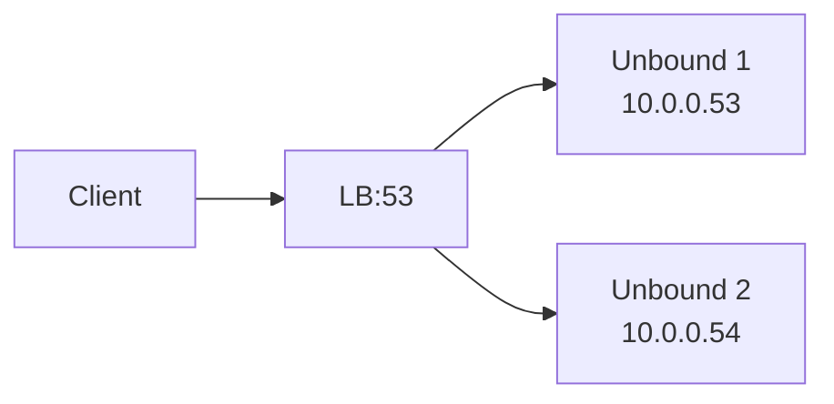

# How to Configure Unbound as a DNSSEC-Validating Resolver

Author: [nawazdhandala](https://www.github.com/nawazdhandala)

Tags: DNSSEC, Unbound, DNS, Security, Linux, Infrastructure

Description: A comprehensive guide to deploying Unbound as a recursive DNS resolver with full DNSSEC validation, trust anchor management, and production hardening for secure infrastructure.

---

DNS is the backbone of every network request your applications make, yet it remains one of the most commonly overlooked attack vectors. Man-in-the-middle attacks, DNS spoofing, and cache poisoning can redirect your traffic to malicious servers without triggering a single firewall alert. DNSSEC (Domain Name System Security Extensions) cryptographically signs DNS records at the source, letting resolvers verify that the response they received is authentic and untampered. Unbound, the high-performance recursive resolver from NLnet Labs, makes DNSSEC validation straightforward while remaining lightweight enough for everything from edge nodes to enterprise data centers.

This guide walks through a production-ready Unbound deployment with full DNSSEC validation, trust anchor automation, query logging, access controls, and monitoring hooks. By the end, you will have a resolver that rejects forged DNS responses and integrates cleanly with your observability stack.

## Why DNSSEC Matters

Before diving into configuration, understand what DNSSEC actually protects against:

| Attack | Description | DNSSEC Protection |
| --- | --- | --- |
| Cache Poisoning | Attacker injects false records into resolver cache | Signatures fail validation; poisoned records rejected |
| Man-in-the-Middle | Attacker intercepts and modifies DNS responses | Cryptographic signatures detect tampering |
| DNS Spoofing | Attacker responds faster than authoritative server | Forged response lacks valid RRSIG; discarded |
| Zone Enumeration | Walking NSEC records to list all names in zone | NSEC3 provides hashed denial of existence |

Without DNSSEC, your resolver trusts whatever response arrives first on UDP port 53. With DNSSEC, it cryptographically verifies every answer using a chain of trust rooted at the DNS root zone.

## Prerequisites

Before starting, ensure you have:

- A Linux server (Ubuntu 22.04+, Debian 12+, RHEL 9+, or Rocky Linux 9+)
- Root or sudo access
- Outbound connectivity to UDP/TCP port 53
- Basic familiarity with DNS concepts (A records, NS records, TTL)

Hardware requirements are modest. Unbound runs comfortably on:

- 1 CPU core (more helps with parallel validation)
- 512 MB RAM minimum (scale with cache size)
- 100 MB disk space

## Installing Unbound

### Ubuntu/Debian

```bash
sudo apt update
sudo apt install -y unbound unbound-anchor dns-root-data
```

### RHEL/Rocky Linux/AlmaLinux

```bash
sudo dnf install -y epel-release
sudo dnf install -y unbound
```

### Verify Installation

```bash
unbound -V
```

You should see output showing the version and compile-time options:

```
Version 1.19.0

Configure line: --build=x86_64-linux-gnu --prefix=/usr --includedir=${prefix}/include ...
Linked libs: libevent 2.1.12-stable (it uses epoll), OpenSSL 3.0.11 ...
Linked modules: dns64 respip validator iterator

BSD licensed, see LICENSE in source package for details.
```

Confirm that `validator` appears in the linked modules list. This module performs DNSSEC validation.

## Understanding the Trust Chain

DNSSEC validation requires a root trust anchor-the public key for the DNS root zone. Every signed zone chains its signatures back to this anchor:

```
Root Zone (.)
    |
    +-- .com (signed, delegated from root)
           |
           +-- example.com (signed, delegated from .com)
                   |
                   +-- www.example.com (A record with RRSIG)
```

When Unbound validates `www.example.com`, it:

1. Fetches the root zone DNSKEY (validated against the trust anchor)
2. Follows the DS record chain from root to .com to example.com
3. Validates each DNSKEY and RRSIG along the path
4. If all signatures verify, the response is marked SECURE
5. If validation fails, the response is marked BOGUS and discarded

## Configuring the Root Trust Anchor

The root trust anchor changes rarely (last rotation was in 2018), but Unbound includes `unbound-anchor` to fetch and maintain it automatically.

### Initialize the Trust Anchor

```bash
sudo unbound-anchor -a /var/lib/unbound/root.key
```

This command:

1. Checks if `/var/lib/unbound/root.key` exists and is current
2. If missing or outdated, fetches the anchor via HTTPS from IANA
3. Validates the downloaded anchor using built-in backup keys
4. Writes the verified anchor in the format Unbound expects

### Verify the Trust Anchor

```bash
cat /var/lib/unbound/root.key
```

You should see something like:

```
. IN DS 20326 8 2 E06D44B80B8F1D39A95C0B0D7C65D08458E880409BBC683457104237C7F8EC8D
```

This is the root zone's Delegation Signer (DS) record, containing a hash of the root DNSKEY.

### Automate Trust Anchor Updates

Create a systemd timer to periodically refresh the anchor:

```bash
sudo tee /etc/systemd/system/unbound-anchor.service << 'EOF'
[Unit]
Description=Update Unbound root trust anchor
After=network-online.target
Wants=network-online.target

[Service]
Type=oneshot
ExecStart=/usr/sbin/unbound-anchor -a /var/lib/unbound/root.key
User=unbound
EOF
```

```bash
sudo tee /etc/systemd/system/unbound-anchor.timer << 'EOF'
[Unit]
Description=Monthly Unbound anchor update

[Timer]
OnCalendar=monthly
Persistent=true
RandomizedDelaySec=86400

[Install]
WantedBy=timers.target
EOF
```

Enable the timer:

```bash
sudo systemctl daemon-reload
sudo systemctl enable --now unbound-anchor.timer
```

## Core Unbound Configuration

Unbound's main configuration file is typically `/etc/unbound/unbound.conf`. Create a clean, production-ready configuration:

```bash
sudo tee /etc/unbound/unbound.conf << 'EOF'
# Unbound configuration for DNSSEC-validating recursive resolver
# Documentation: https://unbound.docs.nlnetlabs.nl/en/latest/

server:
    # Network interfaces
    interface: 127.0.0.1
    interface: ::1
    port: 53

    # Access control - restrict to localhost by default
    access-control: 127.0.0.0/8 allow
    access-control: ::1/128 allow
    access-control: 0.0.0.0/0 refuse
    access-control: ::/0 refuse

    # Run as unprivileged user after binding to port 53
    username: "unbound"
    directory: "/etc/unbound"
    chroot: ""

    # Logging
    verbosity: 1
    log-queries: no
    log-replies: no
    log-tag-queryreply: no
    log-local-actions: no
    logfile: ""
    use-syslog: yes

    # Performance tuning
    num-threads: 4
    msg-cache-slabs: 4
    rrset-cache-slabs: 4
    infra-cache-slabs: 4
    key-cache-slabs: 4

    # Cache sizes (adjust based on available RAM)
    msg-cache-size: 128m
    rrset-cache-size: 256m
    key-cache-size: 32m
    neg-cache-size: 16m

    # Socket handling
    so-rcvbuf: 4m
    so-sndbuf: 4m
    so-reuseport: yes
    outgoing-range: 8192
    num-queries-per-thread: 4096

    # Privacy and security
    hide-identity: yes
    hide-version: yes
    harden-glue: yes
    harden-dnssec-stripped: yes
    harden-below-nxdomain: yes
    harden-referral-path: yes
    harden-algo-downgrade: yes
    use-caps-for-id: yes
    qname-minimisation: yes
    qname-minimisation-strict: no

    # DNSSEC validation - the core of this configuration
    auto-trust-anchor-file: "/var/lib/unbound/root.key"
    val-clean-additional: yes
    val-permissive-mode: no
    val-log-level: 1

    # Root hints for bootstrapping
    root-hints: "/usr/share/dns/root.hints"

    # Prefetching for performance
    prefetch: yes
    prefetch-key: yes
    serve-expired: yes
    serve-expired-ttl: 86400
    serve-expired-client-timeout: 1800

    # Deny queries for private IP ranges (prevents rebinding attacks)
    private-address: 10.0.0.0/8
    private-address: 172.16.0.0/12
    private-address: 192.168.0.0/16
    private-address: 169.254.0.0/16
    private-address: fd00::/8
    private-address: fe80::/10

    # Module configuration - validator must be present for DNSSEC
    module-config: "validator iterator"

# Remote control for management
remote-control:
    control-enable: yes
    control-interface: 127.0.0.1
    control-port: 8953
    server-key-file: "/etc/unbound/unbound_server.key"
    server-cert-file: "/etc/unbound/unbound_server.pem"
    control-key-file: "/etc/unbound/unbound_control.key"
    control-cert-file: "/etc/unbound/unbound_control.pem"
EOF
```

## Understanding the Configuration Directives

Let's break down the critical DNSSEC-related settings:

### DNSSEC Validation Settings

| Directive | Value | Purpose |
| --- | --- | --- |
| `auto-trust-anchor-file` | `/var/lib/unbound/root.key` | Path to the root trust anchor; enables automatic RFC 5011 updates |
| `val-clean-additional` | yes | Remove unvalidated data from additional section |
| `val-permissive-mode` | no | Reject BOGUS responses instead of serving them with warning |
| `val-log-level` | 1 | Log validation failures (0=off, 1=failures, 2=verbose) |
| `module-config` | "validator iterator" | Load validator module before iterator |

### Security Hardening Settings

| Directive | Purpose |
| --- | --- |
| `harden-glue` | Require glue records to be within bailiwick |
| `harden-dnssec-stripped` | Require DNSSEC for zones that should be signed |
| `harden-below-nxdomain` | Return NXDOMAIN for queries below proven NXDOMAIN |
| `harden-referral-path` | Harden referrals to prevent injection |
| `harden-algo-downgrade` | Prevent algorithm downgrade attacks |
| `use-caps-for-id` | Use 0x20-encoded random bits for query identity |
| `qname-minimisation` | Send minimal query names for privacy |

## Setting Up Remote Control

Generate certificates for `unbound-control`:

```bash
sudo unbound-control-setup
```

This creates the key and certificate files referenced in the configuration. Verify:

```bash
ls -la /etc/unbound/unbound_*.pem /etc/unbound/unbound_*.key
```

## Ensuring Proper File Permissions

```bash
# Set ownership for the trust anchor
sudo chown unbound:unbound /var/lib/unbound/root.key

# Set ownership for configuration
sudo chown -R root:unbound /etc/unbound
sudo chmod 640 /etc/unbound/unbound.conf
sudo chmod 640 /etc/unbound/unbound_*.key
```

## Validating the Configuration

Before starting Unbound, check the configuration for errors:

```bash
sudo unbound-checkconf
```

Expected output:

```
unbound-checkconf: no errors in /etc/unbound/unbound.conf
```

If you see errors, they will include line numbers and descriptions. Common issues:

- Missing root hints file: Install `dns-root-data` package
- Permission denied on key files: Fix ownership as shown above
- Interface binding conflicts: Disable systemd-resolved first

## Starting Unbound

### Disable Conflicting Resolvers

On Ubuntu/Debian with systemd-resolved:

```bash
# Check if systemd-resolved is using port 53
sudo ss -tulpn | grep :53

# If so, disable its stub listener
sudo mkdir -p /etc/systemd/resolved.conf.d
sudo tee /etc/systemd/resolved.conf.d/no-stub.conf << 'EOF'
[Resolve]
DNSStubListener=no
EOF

# Restart systemd-resolved
sudo systemctl restart systemd-resolved

# Point /etc/resolv.conf to Unbound
sudo rm /etc/resolv.conf
echo "nameserver 127.0.0.1" | sudo tee /etc/resolv.conf
```

### Start and Enable Unbound

```bash
sudo systemctl start unbound
sudo systemctl enable unbound
sudo systemctl status unbound
```

Expected status output:

```
● unbound.service - Unbound DNS server
     Loaded: loaded (/lib/systemd/system/unbound.service; enabled)
     Active: active (running) since ...
```

## Testing DNSSEC Validation

### Basic Resolution Test

```bash
dig @127.0.0.1 example.com A
```

Look for the `ad` (Authenticated Data) flag in the response:

```
;; flags: qr rd ra ad; QUERY: 1, ANSWER: 1, AUTHORITY: 0, ADDITIONAL: 1
```

The `ad` flag indicates the response was DNSSEC-validated.

### Test Against Known-Good DNSSEC Zone

```bash
dig @127.0.0.1 dnssec-tools.org A +dnssec
```

This zone is signed. You should see:

- `ad` flag set
- RRSIG records in the response (when using `+dnssec`)

### Test DNSSEC Failure Detection

Use a deliberately broken DNSSEC zone:

```bash
dig @127.0.0.1 dnssec-failed.org A
```

This domain has intentionally broken DNSSEC. Your resolver should return `SERVFAIL` because validation fails:

```
;; ->>HEADER<<- opcode: QUERY, status: SERVFAIL, id: 12345
```

### Verbose DNSSEC Test

For detailed validation information:

```bash
dig @127.0.0.1 example.com A +dnssec +multiline
```

This shows the full RRSIG records with human-readable timestamps.

## Monitoring with unbound-control

The `unbound-control` command provides runtime statistics and management:

### View Statistics

```bash
sudo unbound-control stats_noreset
```

Key metrics to monitor:

```
total.num.queries=15234
total.num.cachehits=12456
total.num.cachemiss=2778
total.num.dnscrypt.shared_secret.cachemiss=0
total.num.dnscrypt.replay=0
total.num.recursivereplies=2778
total.requestlist.avg=0.523
total.recursion.time.avg=0.045678
total.recursion.time.median=0.034521
num.answer.secure=2345
num.answer.bogus=12
num.answer.rcode.NOERROR=14890
num.answer.rcode.SERVFAIL=344
```

The critical DNSSEC metrics:

| Metric | Description | Alert Threshold |
| --- | --- | --- |
| `num.answer.secure` | Queries returning validated responses | Should grow |
| `num.answer.bogus` | Validation failures (possible attacks) | Spike detection |
| `num.rrset.bogus` | RRsets that failed validation | Non-zero requires investigation |

### Export Metrics for Monitoring

Create a script to export metrics in Prometheus format:

```bash
sudo tee /usr/local/bin/unbound-metrics.sh << 'EOF'
#!/bin/bash
# Export Unbound metrics in Prometheus format

echo "# HELP unbound_queries_total Total number of queries"
echo "# TYPE unbound_queries_total counter"
sudo unbound-control stats_noreset | grep 'total.num.queries' | sed 's/total.num.queries=/unbound_queries_total /'

echo "# HELP unbound_cache_hits Total cache hits"
echo "# TYPE unbound_cache_hits counter"
sudo unbound-control stats_noreset | grep 'total.num.cachehits' | sed 's/total.num.cachehits=/unbound_cache_hits /'

echo "# HELP unbound_dnssec_secure DNSSEC-validated responses"
echo "# TYPE unbound_dnssec_secure counter"
sudo unbound-control stats_noreset | grep 'num.answer.secure' | sed 's/num.answer.secure=/unbound_dnssec_secure /'

echo "# HELP unbound_dnssec_bogus DNSSEC validation failures"
echo "# TYPE unbound_dnssec_bogus counter"
sudo unbound-control stats_noreset | grep 'num.answer.bogus' | sed 's/num.answer.bogus=/unbound_dnssec_bogus /'
EOF

sudo chmod +x /usr/local/bin/unbound-metrics.sh
```

## Enabling Query Logging

For debugging or security auditing, enable query logging:

```bash
# Edit /etc/unbound/unbound.conf and set:
# log-queries: yes
# log-replies: yes

# Or use unbound-control for runtime changes:
sudo unbound-control set_option log-queries: yes
sudo unbound-control set_option log-replies: yes
```

Query logs appear in syslog or journald:

```bash
sudo journalctl -u unbound -f
```

Sample output:

```
unbound: [12345:0] info: 127.0.0.1 example.com. A IN
unbound: [12345:0] info: reply 127.0.0.1 example.com. A IN NOERROR 0.034s
```

For production, consider logging to a dedicated file and rotating with logrotate.

## Advanced: Forwarding with DNSSEC

If you need to forward queries to upstream resolvers while preserving DNSSEC:

```bash
# Add to unbound.conf
forward-zone:
    name: "."
    forward-addr: 1.1.1.1@853#cloudflare-dns.com
    forward-addr: 1.0.0.1@853#cloudflare-dns.com
    forward-tls-upstream: yes
```

This configures DNS-over-TLS forwarding to Cloudflare. Critical points:

- The upstream must support DNSSEC
- Unbound still validates responses locally
- Use `forward-tls-upstream: yes` for encrypted transport

For forwarding to local authoritative servers (internal zones):

```bash
stub-zone:
    name: "internal.example.com"
    stub-addr: 10.0.0.53
    stub-prime: no
```

## Configuring for Network-Wide Use

To serve DNS for your entire network:

### Update Interface Bindings

```bash
# In server: section of unbound.conf
interface: 0.0.0.0
interface: ::0

# Update access control for your network
access-control: 10.0.0.0/8 allow
access-control: 172.16.0.0/12 allow
access-control: 192.168.0.0/16 allow
```

### Rate Limiting

Protect against DNS amplification attacks:

```bash
# In server: section
ip-ratelimit: 1000
ip-ratelimit-size: 4m
ip-ratelimit-slabs: 4
ratelimit: 1000
ratelimit-size: 4m
ratelimit-slabs: 4
ratelimit-for-domain: example.com 100
ratelimit-below-domain: example.com 100
```

### Firewall Configuration

```bash
# Allow DNS from trusted networks only
sudo ufw allow from 10.0.0.0/8 to any port 53
sudo ufw allow from 192.168.0.0/16 to any port 53
```

## Troubleshooting DNSSEC Issues

### Common Problems and Solutions

| Problem | Symptom | Solution |
| --- | --- | --- |
| Clock skew | All DNSSEC fails | Sync time with NTP |
| Expired trust anchor | Root zone validation fails | Re-run `unbound-anchor` |
| Upstream tampering | Some domains return SERVFAIL | Switch to direct recursion or trusted forwarders |
| Algorithm mismatch | Specific zones fail | Check `val-override` for workarounds |
| Memory exhaustion | Service crashes | Reduce cache sizes |

### Debugging Commands

```bash
# Check trust anchor status
sudo unbound-control list_auth_zones

# Dump cache for a domain
sudo unbound-control lookup example.com

# Flush specific domain
sudo unbound-control flush example.com

# Flush entire cache
sudo unbound-control flush_zone .

# Reload configuration without restart
sudo unbound-control reload
```

### DNSSEC Chain Validation

Use `drill` (part of ldns) to trace the chain:

```bash
# Install drill
sudo apt install ldnsutils

# Trace DNSSEC chain
drill -S example.com
```

Output shows each step of validation:

```
;; Chase successful
example.com.    86400   IN      A       93.184.216.34
example.com.    86400   IN      RRSIG   A 13 2 86400 ...
```

## Performance Tuning

### Cache Optimization

Scale cache sizes based on query volume:

```bash
# For small deployments (< 100 clients)
msg-cache-size: 50m
rrset-cache-size: 100m

# For medium deployments (100-1000 clients)
msg-cache-size: 128m
rrset-cache-size: 256m

# For large deployments (1000+ clients)
msg-cache-size: 512m
rrset-cache-size: 1g
```

Rule of thumb: `rrset-cache-size` should be roughly 2x `msg-cache-size`.

### Thread Tuning

Match threads to CPU cores:

```bash
# Get CPU count
nproc

# Set in unbound.conf
num-threads: 4  # Match your core count
msg-cache-slabs: 4  # Should equal num-threads
rrset-cache-slabs: 4
infra-cache-slabs: 4
key-cache-slabs: 4
```

### Prefetching

Enable prefetching for frequently accessed domains:

```bash
prefetch: yes
prefetch-key: yes
```

This refreshes cache entries before they expire, reducing latency spikes.

## High Availability Configuration

For production environments, run multiple Unbound instances:

### Option 1: Active-Active with Load Balancer



Both instances validate independently. Use health checks on port 53.

### Option 2: Primary-Secondary with keepalived

```bash
# Install keepalived
sudo apt install keepalived

# Configure virtual IP failover
# Primary: priority 100
# Secondary: priority 99
```

### Configuration Sync

Keep configurations identical across instances:

```bash
# Use configuration management (Ansible example)
- name: Deploy Unbound configuration
  template:
    src: unbound.conf.j2
    dest: /etc/unbound/unbound.conf
  notify: Restart Unbound
```

## Security Best Practices

### Principle of Least Privilege

```bash
# Unbound drops privileges after binding port 53
username: "unbound"
chroot: "/etc/unbound"  # Optional: enable chroot jail
```

### Disable Unnecessary Features

```bash
# Don't expose version information
hide-identity: yes
hide-version: yes

# Disable zone transfers (not needed for resolver)
# No zone-transfer configuration needed for pure resolver
```

### Monitor for Anomalies

Set up alerts for:

- Sudden spike in `num.answer.bogus` (possible attack)
- High `num.answer.rcode.SERVFAIL` ratio (upstream issues or attack)
- Unusual query patterns (DDoS indicators)

## Integration with OneUptime

Monitor your Unbound resolver health with OneUptime:

1. **Port Monitor**: Check UDP/TCP 53 availability
2. **Custom Script Monitor**: Validate DNSSEC is working

```bash
#!/bin/bash
# OneUptime DNSSEC health check script

RESULT=$(dig @127.0.0.1 example.com A +short +dnssec 2>&1)

if dig @127.0.0.1 example.com A | grep -q "flags.*ad"; then
    echo "DNSSEC validation working"
    exit 0
else
    echo "DNSSEC validation failed"
    exit 1
fi
```

3. **Metrics Collection**: Export Prometheus metrics to OneUptime for dashboarding

## Summary Table: Key Configuration Options

| Setting | Recommended Value | Purpose |
| --- | --- | --- |
| `auto-trust-anchor-file` | `/var/lib/unbound/root.key` | Root zone trust anchor for DNSSEC chain |
| `val-permissive-mode` | no | Reject (not warn) on validation failure |
| `harden-dnssec-stripped` | yes | Require DNSSEC for signed zones |
| `harden-below-nxdomain` | yes | Prevent NXDOMAIN bypass attacks |
| `harden-algo-downgrade` | yes | Prevent cryptographic downgrade |
| `use-caps-for-id` | yes | 0x20 encoding for query randomization |
| `qname-minimisation` | yes | Privacy: send minimal query names |
| `prefetch` | yes | Performance: refresh cache proactively |
| `prefetch-key` | yes | Performance: prefetch DNSKEY records |
| `serve-expired` | yes | Availability: serve stale on upstream failure |
| `msg-cache-size` | 128m+ | Cache size for DNS messages |
| `rrset-cache-size` | 256m+ | Cache size for RRsets (2x msg-cache) |
| `num-threads` | CPU cores | Parallel query processing |

## Quick Reference Commands

```bash
# Install Unbound
sudo apt install unbound unbound-anchor dns-root-data

# Initialize trust anchor
sudo unbound-anchor -a /var/lib/unbound/root.key

# Check configuration
sudo unbound-checkconf

# Start service
sudo systemctl start unbound

# Test DNSSEC
dig @127.0.0.1 example.com A  # Look for 'ad' flag

# View statistics
sudo unbound-control stats

# Flush cache
sudo unbound-control flush_zone .

# Reload configuration
sudo unbound-control reload
```

## Conclusion

Running Unbound as a DNSSEC-validating resolver provides cryptographic assurance that DNS responses are authentic and untampered. The configuration in this guide:

- Validates all DNSSEC-signed zones automatically
- Rejects forged or tampered responses
- Maintains the root trust anchor with automatic updates
- Hardens against common DNS attacks
- Provides monitoring hooks for observability

DNSSEC adoption continues to grow, with major TLDs and critical infrastructure zones now signed. By validating at the resolver level, you protect your entire infrastructure regardless of whether individual applications implement their own DNS security.

Start with the configuration provided here, monitor the `num.answer.bogus` metric for anomalies, and consider integrating with your existing observability platform. DNS security is foundational-get it right, and many attack vectors simply disappear.

For monitoring your DNS infrastructure alongside your applications, check out OneUptime's port and custom script monitors. They integrate seamlessly with Unbound's statistics output and can alert you before DNS issues cascade into application outages.
