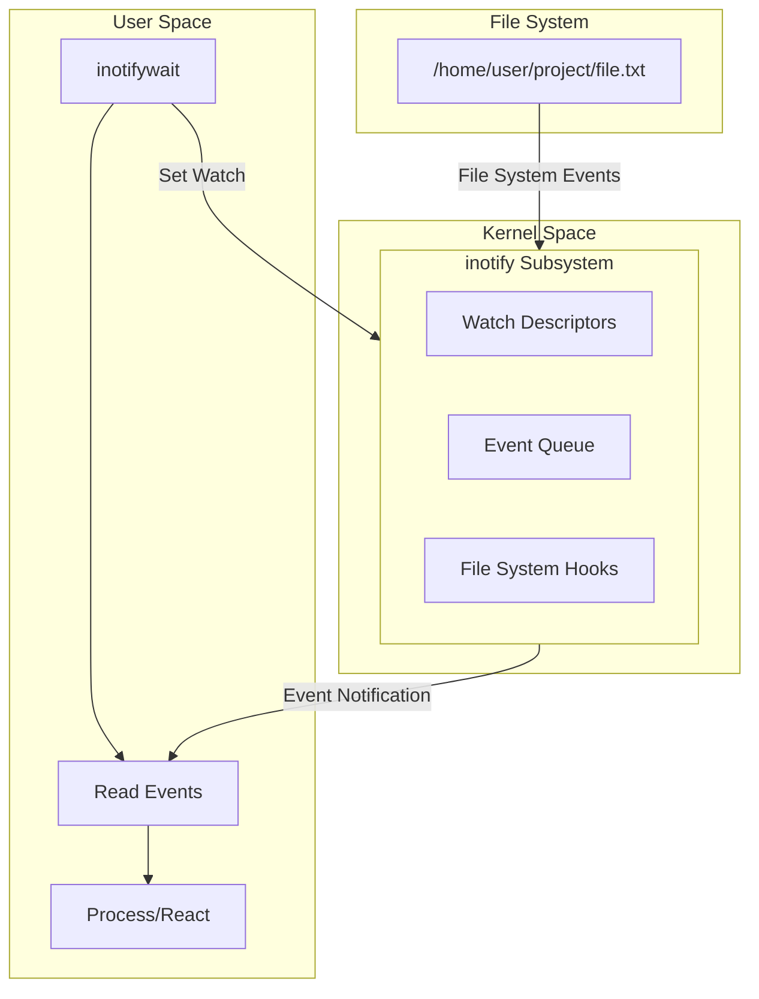

# How to Use inotifywait for File Monitoring on Ubuntu

Author: [nawazdhandala](https://www.github.com/nawazdhandala)

Tags: Ubuntu, inotify, File Monitoring, Automation, Tutorial

Description: Complete guide to using inotifywait for real-time file system monitoring on Ubuntu.

---

File system monitoring is a critical capability for system administrators, developers, and DevOps engineers. Whether you need to trigger automated deployments, synchronize files, or audit file changes, Linux provides a powerful kernel-level mechanism called inotify. In this comprehensive guide, we will explore how to use `inotifywait`, the command-line interface to inotify, for real-time file monitoring on Ubuntu.

## Understanding inotify

inotify (inode notify) is a Linux kernel subsystem that provides a mechanism for monitoring file system events. It was introduced in kernel version 2.6.13 as a replacement for the older dnotify system, offering several improvements:

- **Event-driven architecture**: Instead of polling, inotify notifies your application when events occur
- **Per-file monitoring**: Monitor individual files or entire directories
- **Low overhead**: Minimal CPU usage compared to polling-based solutions
- **Rich event types**: Detect specific changes like modifications, deletions, or attribute changes

When you set up an inotify watch, the kernel maintains a watch descriptor for the specified file or directory. When a file system event occurs, the kernel generates an event that your application can read and process.

### How inotify Works Under the Hood



## Installing inotify-tools

The `inotify-tools` package provides command-line utilities for interacting with the inotify API. It includes two main tools:

- **inotifywait**: Waits for changes to files and reports them
- **inotifywatch**: Gathers file system statistics using inotify

### Installation on Ubuntu

```bash
# Update package index
sudo apt update

# Install inotify-tools
sudo apt install inotify-tools -y

# Verify installation
inotifywait --help
```

### Checking inotify Limits

Before using inotify extensively, check and potentially adjust the system limits:

```bash
# Check current limits
cat /proc/sys/fs/inotify/max_user_watches
cat /proc/sys/fs/inotify/max_user_instances
cat /proc/sys/fs/inotify/max_queued_events

# Typical default values:
# max_user_watches: 8192 (or 65536 on some systems)
# max_user_instances: 128
# max_queued_events: 16384
```

To increase limits permanently, add these lines to `/etc/sysctl.conf`:

```bash
# Increase inotify limits for heavy file monitoring workloads
# /etc/sysctl.conf

# Maximum number of watches per user
fs.inotify.max_user_watches=524288

# Maximum number of inotify instances per user
fs.inotify.max_user_instances=512

# Maximum number of events in the queue
fs.inotify.max_queued_events=32768
```

Apply changes without rebooting:

```bash
sudo sysctl -p
```

## inotifywait Basics

The basic syntax of `inotifywait` is:

```bash
inotifywait [options] <file_or_directory>
```

### Your First inotifywait Command

```bash
# Monitor a single file for any event (exits after first event)
inotifywait /var/log/syslog
```

Open another terminal and modify the file:

```bash
echo "test" | sudo tee -a /var/log/syslog
```

The `inotifywait` command will output something like:

```
/var/log/syslog MODIFY
```

### Continuous Monitoring with -m Flag

By default, `inotifywait` exits after the first event. Use the `-m` (monitor) flag for continuous monitoring:

```bash
# Monitor continuously - does not exit after events
inotifywait -m /var/log/syslog
```

### Monitoring a Directory

```bash
# Monitor all events in a directory
inotifywait -m /home/user/documents/
```

## Event Types

inotifywait can monitor various file system events. Understanding these events is crucial for building effective monitoring solutions.

### Complete List of Events

| Event | Description |
|-------|-------------|
| `access` | File was read |
| `modify` | File was modified |
| `attrib` | File attributes changed (permissions, timestamps) |
| `close_write` | File opened for writing was closed |
| `close_nowrite` | File opened read-only was closed |
| `close` | File was closed (either write or no-write) |
| `open` | File was opened |
| `moved_to` | File was moved into watched directory |
| `moved_from` | File was moved out of watched directory |
| `move` | File was moved (either to or from) |
| `create` | File was created in watched directory |
| `delete` | File was deleted from watched directory |
| `delete_self` | Watched file or directory was deleted |
| `unmount` | File system containing watched file was unmounted |

### Monitoring Specific Events

Use the `-e` flag to filter specific events:

```bash
# Monitor only modifications
inotifywait -m -e modify /var/log/syslog

# Monitor file creation and deletion
inotifywait -m -e create -e delete /home/user/uploads/

# Monitor file movements
inotifywait -m -e moved_to -e moved_from /home/user/documents/

# Monitor when files are closed after writing (useful for uploads)
inotifywait -m -e close_write /var/www/uploads/
```

### Why close_write is Often Better Than modify

When a file is being written, the `modify` event fires multiple times as data is written in chunks. The `close_write` event fires only once when the file is completely written and closed:

```bash
# This might fire many times during a large file copy
inotifywait -m -e modify /home/user/uploads/

# This fires once when the file is completely written
inotifywait -m -e close_write /home/user/uploads/
```

## Monitoring Directories Recursively

One of the most powerful features of `inotifywait` is recursive directory monitoring with the `-r` flag:

```bash
# Monitor an entire directory tree
inotifywait -m -r /home/user/project/

# Monitor recursively for specific events
inotifywait -m -r -e modify -e create -e delete /var/www/html/
```

### Important Considerations for Recursive Monitoring

```bash
# Each subdirectory consumes one watch
# Check how many watches you need:
find /path/to/monitor -type d | wc -l

# Compare with your limit:
cat /proc/sys/fs/inotify/max_user_watches

# Example: If you have 10,000 directories and limit is 8192, increase it
```

## Output Formats

`inotifywait` offers several output format options for different use cases.

### Default Output

```bash
inotifywait -m /home/user/test/
# Output: /home/user/test/ CREATE newfile.txt
```

### CSV Format

```bash
# CSV format for easy parsing
inotifywait -m --format '%w,%e,%f' /home/user/test/
# Output: /home/user/test/,CREATE,newfile.txt
```

### Custom Format Strings

Available format specifiers:

| Specifier | Description |
|-----------|-------------|
| `%w` | Watched path |
| `%f` | Filename (for directory watches) |
| `%e` | Event type(s) |
| `%T` | Timestamp (requires --timefmt) |

```bash
# Include timestamp in output
inotifywait -m --timefmt '%Y-%m-%d %H:%M:%S' --format '%T %w %f %e' /home/user/test/
# Output: 2026-01-15 10:30:45 /home/user/test/ newfile.txt CREATE

# JSON-like output for logging
inotifywait -m --timefmt '%Y-%m-%dT%H:%M:%S' \
  --format '{"time":"%T","path":"%w","file":"%f","event":"%e"}' \
  /home/user/test/
# Output: {"time":"2026-01-15T10:30:45","path":"/home/user/test/","file":"newfile.txt","event":"CREATE"}
```

### Quiet Mode

```bash
# Suppress initial "Setting up watches" message
inotifywait -m -q /home/user/test/

# Extra quiet - only output events, no headers
inotifywait -m -qq /home/user/test/
```

## Filtering by File Extensions

Use the `--include` and `--exclude` options with regular expressions to filter files:

```bash
# Monitor only Python files
inotifywait -m -r --include '\.py$' /home/user/project/

# Monitor only JavaScript and TypeScript files
inotifywait -m -r --include '\.(js|ts)$' /home/user/webapp/

# Exclude hidden files and directories
inotifywait -m -r --exclude '/\.' /home/user/project/

# Exclude node_modules and other build directories
inotifywait -m -r --exclude '(node_modules|dist|build|\.git)' /home/user/project/

# Monitor only configuration files
inotifywait -m -r --include '\.(conf|cfg|ini|yaml|yml|json)$' /etc/
```

### Combining Include and Exclude

```bash
# Monitor all files except logs and temp files
inotifywait -m -r \
  --exclude '\.(log|tmp|swp)$' \
  /var/www/html/
```

## Practical Examples

### Example 1: Auto-Sync Files to Remote Server

This script automatically syncs files to a remote server when changes are detected:

```bash
#!/bin/bash
# auto-sync.sh
# Automatically sync local changes to a remote server
# Usage: ./auto-sync.sh /local/path user@remote:/remote/path

# Configuration
LOCAL_DIR="${1:-/home/user/project}"
REMOTE_DEST="${2:-user@server:/var/www/html}"
LOG_FILE="/var/log/auto-sync.log"

# Ensure the local directory exists
if [[ ! -d "$LOCAL_DIR" ]]; then
    echo "Error: Directory $LOCAL_DIR does not exist" >&2
    exit 1
fi

# Function to log messages with timestamps
log_message() {
    echo "[$(date '+%Y-%m-%d %H:%M:%S')] $1" | tee -a "$LOG_FILE"
}

# Function to perform sync
do_sync() {
    local file="$1"
    local event="$2"

    log_message "Detected $event on $file"

    # Use rsync for efficient synchronization
    # -a: archive mode (preserves permissions, timestamps, etc.)
    # -v: verbose output
    # -z: compress during transfer
    # --delete: remove files on remote that don't exist locally
    rsync -avz --delete \
        --exclude='.git' \
        --exclude='node_modules' \
        --exclude='*.swp' \
        --exclude='*.tmp' \
        "$LOCAL_DIR/" "$REMOTE_DEST/"

    if [[ $? -eq 0 ]]; then
        log_message "Sync completed successfully"
    else
        log_message "Sync failed with exit code $?"
    fi
}

log_message "Starting auto-sync from $LOCAL_DIR to $REMOTE_DEST"

# Monitor for changes and sync
# Using close_write to ensure files are completely written before syncing
inotifywait -m -r -q \
    -e close_write \
    -e moved_to \
    -e delete \
    --exclude '(\.git|node_modules|\.swp$|\.tmp$)' \
    --format '%w%f %e' \
    "$LOCAL_DIR" | while read -r file event; do

    # Debounce: wait a short time for batch changes to complete
    sleep 0.5

    # Perform the sync
    do_sync "$file" "$event"
done
```

### Example 2: Auto-Deploy on Git Push

This script watches for git pull/fetch operations and triggers a deployment:

```bash
#!/bin/bash
# git-auto-deploy.sh
# Watches a git repository and triggers deployment on changes
# Monitors the .git directory for fetch/pull operations

# Configuration
REPO_DIR="${1:-/var/www/myapp}"
DEPLOY_SCRIPT="${2:-/opt/scripts/deploy.sh}"
BRANCH="${3:-main}"
LOG_FILE="/var/log/git-deploy.log"

# Validate configuration
if [[ ! -d "$REPO_DIR/.git" ]]; then
    echo "Error: $REPO_DIR is not a git repository" >&2
    exit 1
fi

# Logging function
log() {
    echo "[$(date '+%Y-%m-%d %H:%M:%S')] $1" >> "$LOG_FILE"
}

# Deployment function
deploy() {
    log "Change detected, checking for updates..."

    cd "$REPO_DIR" || exit 1

    # Fetch latest changes
    git fetch origin "$BRANCH" 2>> "$LOG_FILE"

    # Check if local is behind remote
    LOCAL=$(git rev-parse HEAD)
    REMOTE=$(git rev-parse "origin/$BRANCH")

    if [[ "$LOCAL" != "$REMOTE" ]]; then
        log "Updates found, pulling changes..."

        # Pull changes
        git pull origin "$BRANCH" 2>> "$LOG_FILE"

        if [[ $? -eq 0 ]]; then
            log "Pull successful, running deployment script..."

            # Run deployment script if it exists
            if [[ -x "$DEPLOY_SCRIPT" ]]; then
                "$DEPLOY_SCRIPT" >> "$LOG_FILE" 2>&1
                log "Deployment completed with exit code $?"
            else
                log "No deployment script found or not executable"
            fi
        else
            log "Git pull failed"
        fi
    else
        log "Repository is up to date"
    fi
}

log "Starting git auto-deploy watcher for $REPO_DIR"

# Watch the .git directory for changes indicating a push/pull
# FETCH_HEAD is updated after git fetch/pull
inotifywait -m -q \
    -e close_write \
    --include 'FETCH_HEAD$' \
    "$REPO_DIR/.git/" | while read -r path event file; do

    log "Git event detected: $event on $file"

    # Small delay to ensure git operations complete
    sleep 1

    deploy
done
```

### Example 3: Log File Analyzer

Monitor log files in real-time and alert on specific patterns:

```bash
#!/bin/bash
# log-monitor.sh
# Monitor log files for specific patterns and send alerts
# Usage: ./log-monitor.sh /var/log/

# Configuration
WATCH_DIR="${1:-/var/log}"
ALERT_PATTERNS=("ERROR" "CRITICAL" "FATAL" "Exception" "OutOfMemory")
ALERT_EMAIL="admin@example.com"
SLACK_WEBHOOK="${SLACK_WEBHOOK_URL:-}"

# Function to check for alert patterns in a file
check_for_alerts() {
    local file="$1"
    local line

    # Read the last few lines of the modified file
    # Using tail to get recent entries
    tail -n 5 "$file" 2>/dev/null | while read -r line; do
        for pattern in "${ALERT_PATTERNS[@]}"; do
            if [[ "$line" == *"$pattern"* ]]; then
                send_alert "$file" "$pattern" "$line"
                break
            fi
        done
    done
}

# Function to send alerts
send_alert() {
    local file="$1"
    local pattern="$2"
    local line="$3"
    local timestamp
    timestamp=$(date '+%Y-%m-%d %H:%M:%S')

    echo "[$timestamp] ALERT: Pattern '$pattern' found in $file"
    echo "  Line: $line"

    # Send email alert (if mail command is available)
    if command -v mail &> /dev/null && [[ -n "$ALERT_EMAIL" ]]; then
        echo "Pattern '$pattern' found in $file at $timestamp\n\nLine: $line" | \
            mail -s "Log Alert: $pattern detected" "$ALERT_EMAIL"
    fi

    # Send Slack notification (if webhook is configured)
    if [[ -n "$SLACK_WEBHOOK" ]]; then
        curl -s -X POST "$SLACK_WEBHOOK" \
            -H 'Content-type: application/json' \
            -d "{
                \"text\": \"Log Alert\",
                \"attachments\": [{
                    \"color\": \"danger\",
                    \"fields\": [
                        {\"title\": \"Pattern\", \"value\": \"$pattern\", \"short\": true},
                        {\"title\": \"File\", \"value\": \"$file\", \"short\": true},
                        {\"title\": \"Line\", \"value\": \"$line\"}
                    ]
                }]
            }" > /dev/null
    fi
}

echo "Starting log monitor on $WATCH_DIR"
echo "Watching for patterns: ${ALERT_PATTERNS[*]}"

# Monitor log files for modifications
inotifywait -m -r -q \
    -e modify \
    --include '\.log$' \
    --format '%w%f' \
    "$WATCH_DIR" | while read -r file; do

    check_for_alerts "$file"
done
```

### Example 4: Backup on Change

Automatically create backups when important files change:

```bash
#!/bin/bash
# auto-backup.sh
# Creates timestamped backups when watched files change
# Usage: ./auto-backup.sh /path/to/watch /path/to/backup

# Configuration
WATCH_DIR="${1:-/etc}"
BACKUP_DIR="${2:-/var/backups/config}"
MAX_BACKUPS=10  # Keep only the last N backups per file

# Create backup directory if it doesn't exist
mkdir -p "$BACKUP_DIR"

# Function to create backup
create_backup() {
    local source_file="$1"
    local event="$2"
    local timestamp
    local backup_name
    local file_backup_dir
    local relative_path

    # Skip if file doesn't exist (was deleted)
    if [[ ! -f "$source_file" ]]; then
        echo "File deleted: $source_file"
        return
    fi

    timestamp=$(date '+%Y%m%d_%H%M%S')

    # Create relative path structure in backup directory
    relative_path="${source_file#$WATCH_DIR/}"
    file_backup_dir="$BACKUP_DIR/$(dirname "$relative_path")"
    backup_name="$file_backup_dir/$(basename "$source_file").$timestamp"

    # Create directory structure
    mkdir -p "$file_backup_dir"

    # Create the backup
    cp -p "$source_file" "$backup_name"

    if [[ $? -eq 0 ]]; then
        echo "[$(date '+%Y-%m-%d %H:%M:%S')] Backup created: $backup_name"

        # Cleanup old backups (keep only MAX_BACKUPS)
        local file_pattern
        file_pattern="$file_backup_dir/$(basename "$source_file").*"

        # shellcheck disable=SC2012
        ls -t $file_pattern 2>/dev/null | tail -n +$((MAX_BACKUPS + 1)) | xargs -r rm -f
    else
        echo "[$(date '+%Y-%m-%d %H:%M:%S')] ERROR: Failed to create backup for $source_file"
    fi
}

echo "Starting auto-backup service"
echo "Watching: $WATCH_DIR"
echo "Backup location: $BACKUP_DIR"

# Monitor for file changes
inotifywait -m -r -q \
    -e close_write \
    -e moved_to \
    --format '%w%f %e' \
    "$WATCH_DIR" | while read -r file event; do

    create_backup "$file" "$event"
done
```

### Example 5: Development Hot Reload

Watch source files and restart an application:

```bash
#!/bin/bash
# hot-reload.sh
# Watch source files and restart application on changes
# Usage: ./hot-reload.sh "python app.py" /path/to/src

# Configuration
COMMAND="${1:-python app.py}"
WATCH_DIR="${2:-.}"
EXTENSIONS="${3:-py}"  # Comma-separated list of extensions

# Convert extensions to regex pattern
EXT_PATTERN=$(echo "$EXTENSIONS" | sed 's/,/|/g')
INCLUDE_REGEX="\.($EXT_PATTERN)$"

# PID of the running application
APP_PID=""

# Function to start the application
start_app() {
    echo "[$(date '+%H:%M:%S')] Starting: $COMMAND"

    # Start application in background
    eval "$COMMAND" &
    APP_PID=$!

    echo "[$(date '+%H:%M:%S')] Application started with PID: $APP_PID"
}

# Function to stop the application
stop_app() {
    if [[ -n "$APP_PID" ]] && kill -0 "$APP_PID" 2>/dev/null; then
        echo "[$(date '+%H:%M:%S')] Stopping application (PID: $APP_PID)"

        # Try graceful shutdown first
        kill -TERM "$APP_PID" 2>/dev/null

        # Wait for process to terminate
        local count=0
        while kill -0 "$APP_PID" 2>/dev/null && [[ $count -lt 10 ]]; do
            sleep 0.5
            ((count++))
        done

        # Force kill if still running
        if kill -0 "$APP_PID" 2>/dev/null; then
            echo "[$(date '+%H:%M:%S')] Force killing application"
            kill -9 "$APP_PID" 2>/dev/null
        fi
    fi
    APP_PID=""
}

# Function to restart the application
restart_app() {
    stop_app
    sleep 0.5
    start_app
}

# Cleanup on script exit
cleanup() {
    echo ""
    echo "Shutting down..."
    stop_app
    exit 0
}

trap cleanup SIGINT SIGTERM

echo "Hot Reload Service"
echo "=================="
echo "Command: $COMMAND"
echo "Watch directory: $WATCH_DIR"
echo "File extensions: $EXTENSIONS"
echo ""

# Initial start
start_app

# Monitor for changes
inotifywait -m -r -q \
    -e close_write \
    -e moved_to \
    -e delete \
    --include "$INCLUDE_REGEX" \
    --exclude '(__pycache__|\.pyc$|\.git)' \
    --format '%w%f %e' \
    "$WATCH_DIR" | while read -r file event; do

    echo "[$(date '+%H:%M:%S')] Change detected: $event - $file"
    restart_app
done
```

## Combining with Other Tools

`inotifywait` becomes even more powerful when combined with other command-line tools.

### With xargs for Batch Processing

```bash
# Process all modified files with a custom command
inotifywait -m -r -q \
    -e close_write \
    --format '%w%f' \
    /path/to/source | xargs -I {} sh -c 'echo "Processing: {}"; process_file "{}"'
```

### With grep for Filtering

```bash
# Filter events before processing
inotifywait -m -r \
    -e create \
    -e modify \
    /var/log | grep --line-buffered '\.log' | while read -r line; do
    echo "Log file changed: $line"
done
```

### With parallel for Concurrent Processing

```bash
# Process changes in parallel
inotifywait -m -r -q \
    -e close_write \
    --include '\.jpg$' \
    --format '%w%f' \
    /path/to/images | parallel -j 4 'convert {} -resize 800x600 {.}_thumb.jpg'
```

### With logger for Syslog Integration

```bash
# Send events to syslog
inotifywait -m -r -q \
    -e create \
    -e delete \
    -e modify \
    --timefmt '%Y-%m-%d %H:%M:%S' \
    --format '%T %w%f %e' \
    /important/directory | while read -r timestamp file event; do
    logger -t file-monitor -p local0.info "File event: $event on $file at $timestamp"
done
```

### With jq for JSON Processing

```bash
# Output JSON and process with jq
inotifywait -m -r -q \
    -e close_write \
    --timefmt '%Y-%m-%dT%H:%M:%S' \
    --format '{"timestamp":"%T","path":"%w","file":"%f","event":"%e"}' \
    /path/to/watch | jq -c 'select(.file | endswith(".json"))'
```

## Performance Considerations

When using inotify for monitoring, keep these performance considerations in mind:

### Watch Limits

Each watched directory consumes system resources. Monitor your usage:

```bash
#!/bin/bash
# check-inotify-usage.sh
# Monitor inotify resource usage

echo "=== inotify Resource Usage ==="
echo ""

# Current limits
echo "Current Limits:"
echo "  max_user_watches:   $(cat /proc/sys/fs/inotify/max_user_watches)"
echo "  max_user_instances: $(cat /proc/sys/fs/inotify/max_user_instances)"
echo "  max_queued_events:  $(cat /proc/sys/fs/inotify/max_queued_events)"
echo ""

# Current usage by process
echo "inotify Usage by Process:"
for pid in /proc/[0-9]*; do
    pid_num=$(basename "$pid")
    if [[ -d "$pid/fd" ]]; then
        count=$(find "$pid/fd" -lname 'anon_inode:inotify' 2>/dev/null | wc -l)
        if [[ $count -gt 0 ]]; then
            name=$(cat "$pid/comm" 2>/dev/null || echo "unknown")
            echo "  PID $pid_num ($name): $count instances"
        fi
    fi
done
```

### Memory Usage

Recursive watching of large directory trees can consume significant memory:

```bash
# Estimate watches needed for a directory tree
estimate_watches() {
    local dir="${1:-.}"
    local count
    count=$(find "$dir" -type d 2>/dev/null | wc -l)
    echo "Directories to watch: $count"
    echo "Estimated memory: ~$((count * 1024 / 1024)) KB"
}

# Usage
estimate_watches /var/www
```

### Event Queue Overflow

When too many events occur, the queue can overflow. Handle this gracefully:

```bash
#!/bin/bash
# Monitor with overflow handling
inotifywait -m -r -q \
    -e close_write \
    /path/to/watch 2>&1 | while read -r line; do

    if [[ "$line" == *"Event queue overflow"* ]]; then
        echo "WARNING: Event queue overflow detected!"
        echo "Some events may have been lost."
        # Trigger a full sync or scan
        /path/to/full-sync.sh
    else
        # Process normal event
        echo "$line"
    fi
done
```

### Excluding Unnecessary Directories

Always exclude directories that generate many events but are not needed:

```bash
# Good practice: exclude common noisy directories
inotifywait -m -r \
    --exclude '(node_modules|\.git|__pycache__|\.cache|vendor|\.npm)' \
    -e close_write \
    /path/to/project
```

## Systemd Service for Continuous Monitoring

For production environments, run `inotifywait` as a systemd service for reliability and automatic restart.

### Basic Service Unit

Create `/etc/systemd/system/file-monitor.service`:

```ini
[Unit]
# Service description
Description=File System Monitor Service
# Start after network is available
After=network.target
# Optional: start after a specific mount point is available
# After=mnt-data.mount

[Service]
# Type simple because inotifywait runs in foreground
Type=simple

# User and group to run as (don't run as root unless necessary)
User=monitor
Group=monitor

# Working directory
WorkingDirectory=/opt/file-monitor

# The monitoring script to execute
ExecStart=/opt/file-monitor/monitor.sh

# Restart policy - always restart on failure
Restart=always
RestartSec=10

# Limit restarts to prevent rapid restart loops
StartLimitIntervalSec=60
StartLimitBurst=3

# Environment variables
Environment="WATCH_DIR=/var/www/html"
Environment="LOG_FILE=/var/log/file-monitor.log"

# Standard output and error logging
StandardOutput=journal
StandardError=journal

# Security hardening options
NoNewPrivileges=true
ProtectSystem=strict
ProtectHome=true
# Allow write access to specific directories
ReadWritePaths=/var/log/file-monitor.log /var/backups

[Install]
# Start on multi-user target (normal system boot)
WantedBy=multi-user.target
```

### The Monitoring Script

Create `/opt/file-monitor/monitor.sh`:

```bash
#!/bin/bash
# /opt/file-monitor/monitor.sh
# File monitoring script for systemd service

# Use environment variables with defaults
WATCH_DIR="${WATCH_DIR:-/var/www/html}"
LOG_FILE="${LOG_FILE:-/var/log/file-monitor.log}"

# Logging function
log() {
    echo "[$(date '+%Y-%m-%d %H:%M:%S')] $1"
}

# Event handler function
handle_event() {
    local path="$1"
    local event="$2"
    local file="$3"

    log "Event: $event | Path: $path | File: $file"

    # Add your custom handling logic here
    case "$event" in
        CREATE)
            log "New file created: $path$file"
            # Example: notify, process, etc.
            ;;
        DELETE)
            log "File deleted: $path$file"
            ;;
        MODIFY|CLOSE_WRITE)
            log "File modified: $path$file"
            # Example: trigger sync, validation, etc.
            ;;
        MOVED_TO)
            log "File moved in: $path$file"
            ;;
        MOVED_FROM)
            log "File moved out: $path$file"
            ;;
    esac
}

# Main execution
log "Starting file monitor service"
log "Watching directory: $WATCH_DIR"

# Check if watch directory exists
if [[ ! -d "$WATCH_DIR" ]]; then
    log "ERROR: Watch directory does not exist: $WATCH_DIR"
    exit 1
fi

# Start monitoring
exec inotifywait -m -r -q \
    -e create \
    -e delete \
    -e modify \
    -e close_write \
    -e moved_to \
    -e moved_from \
    --exclude '(\.git|\.swp$|\.tmp$|~$)' \
    --format '%w|%e|%f' \
    "$WATCH_DIR" | while IFS='|' read -r path event file; do

    handle_event "$path" "$event" "$file"
done
```

### Service Management Commands

```bash
# Make script executable
sudo chmod +x /opt/file-monitor/monitor.sh

# Create monitor user (for security)
sudo useradd -r -s /bin/false monitor

# Reload systemd to recognize new service
sudo systemctl daemon-reload

# Enable service to start on boot
sudo systemctl enable file-monitor.service

# Start the service
sudo systemctl start file-monitor.service

# Check service status
sudo systemctl status file-monitor.service

# View logs
sudo journalctl -u file-monitor.service -f

# Restart service after changes
sudo systemctl restart file-monitor.service

# Stop service
sudo systemctl stop file-monitor.service
```

### Advanced Service Configuration with Resource Limits

For production environments, add resource limits:

```ini
[Service]
# ... previous configuration ...

# Memory limit
MemoryMax=256M
MemoryHigh=200M

# CPU limit (percentage of one core)
CPUQuota=50%

# File descriptor limit
LimitNOFILE=65536

# Process limit
LimitNPROC=64

# Timeout settings
TimeoutStartSec=30
TimeoutStopSec=30

# Watchdog - systemd will restart if service doesn't respond
WatchdogSec=60

# Notification socket for sd_notify
Type=notify
NotifyAccess=main
```

### Multi-Instance Service Template

For monitoring multiple directories with the same script, use a template:

Create `/etc/systemd/system/file-monitor@.service`:

```ini
[Unit]
Description=File Monitor for %i
After=network.target

[Service]
Type=simple
User=monitor
Group=monitor
ExecStart=/opt/file-monitor/monitor.sh
Environment="WATCH_DIR=/var/www/%i"
Environment="LOG_FILE=/var/log/file-monitor-%i.log"
Restart=always
RestartSec=10

[Install]
WantedBy=multi-user.target
```

Use it like:

```bash
# Monitor /var/www/site1
sudo systemctl enable file-monitor@site1.service
sudo systemctl start file-monitor@site1.service

# Monitor /var/www/site2
sudo systemctl enable file-monitor@site2.service
sudo systemctl start file-monitor@site2.service
```

## Troubleshooting Common Issues

### Issue: "No space left on device" Error

This usually means you have hit the inotify watch limit:

```bash
# Check current usage
cat /proc/sys/fs/inotify/max_user_watches

# Temporarily increase
sudo sysctl fs.inotify.max_user_watches=524288

# Make permanent
echo "fs.inotify.max_user_watches=524288" | sudo tee -a /etc/sysctl.conf
sudo sysctl -p
```

### Issue: Events Not Firing for Remote Filesystems

inotify only works with local filesystems. For NFS, CIFS, or other network filesystems, use polling-based alternatives:

```bash
# For network filesystems, use a polling approach
while true; do
    find /mnt/nfs -type f -mmin -1 -print
    sleep 60
done
```

### Issue: Missing Events During High Activity

The event queue may overflow during intense activity:

```bash
# Increase queue size
sudo sysctl fs.inotify.max_queued_events=65536

# Or implement debouncing in your script
```

### Issue: Recursive Watch Not Seeing New Directories

When using `-r`, new subdirectories created after monitoring starts are automatically watched. However, if you experience issues:

```bash
# Verify new directories are being watched
inotifywait -m -r -e create --format '%w %f %e' /path/to/watch | grep ISDIR
```

## Summary

`inotifywait` is an essential tool for file system monitoring on Ubuntu and Linux systems. Key takeaways:

1. **Use the right events**: `close_write` is often better than `modify` for file completion detection
2. **Filter wisely**: Use `--include` and `--exclude` to reduce noise and improve performance
3. **Monitor resources**: Keep track of watch limits and adjust as needed
4. **Run as a service**: Use systemd for reliable, production-grade monitoring
5. **Combine with other tools**: Leverage the Unix philosophy by piping to other utilities
6. **Handle edge cases**: Account for queue overflow and implement proper error handling

With these techniques, you can build robust file monitoring solutions for automated deployments, backup systems, security auditing, and much more.

---

## Monitor Your Infrastructure with OneUptime

While `inotifywait` is excellent for file system monitoring on individual servers, managing monitoring across your entire infrastructure requires a comprehensive solution. **OneUptime** provides enterprise-grade monitoring capabilities that complement your file monitoring setup:

- **Uptime Monitoring**: Ensure your servers and services are always available
- **Performance Metrics**: Track system performance alongside your file monitoring
- **Alerting**: Get notified through multiple channels when issues arise
- **Incident Management**: Coordinate responses when file monitoring detects critical changes
- **Status Pages**: Keep your team and customers informed about system status
- **Log Management**: Centralize logs from your inotifywait scripts and other sources

Combine the power of local file monitoring with OneUptime's comprehensive infrastructure monitoring for complete visibility into your systems. Visit [OneUptime](https://oneuptime.com) to learn more about building a robust monitoring strategy for your organization.
