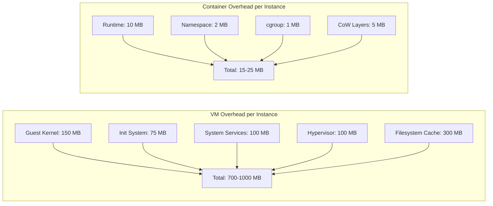

# How efficient are containers vs virtual machines? A deep dive into density advantages

Author: [nawazdhandala](https://www.github.com/nawazdhandala)

Tags: Containers, Virtual Machines, Docker, Kubernetes, Infrastructure, Performance, DevOps, Virtualization, Linux

Description: A deep technical dive into why you can run 10x more containers than VMs on identical hardware. We explore kernel sharing, memory architecture, CPU overhead, and the fundamental design decisions that make containers dramatically more efficient.

---

One of the most transformative shifts in infrastructure over the past decade has been the move from virtual machines to containers. While many understand that "containers are more lightweight," few grasp the architectural reasons *why* - and just how dramatic the efficiency gains really are.

On a typical server with 128 GB of RAM and 32 CPU cores, you might comfortably run **10-15 virtual machines**. On that same hardware, you could run **100-200+ containers**. That's not marketing - it's physics.

This article dives deep into the technical architecture that creates this 10x (or greater) density advantage, examining memory models, CPU virtualization overhead, filesystem design, and startup mechanics.

---

## The Fundamental Architectural Difference

Before diving into numbers, we need to understand what VMs and containers actually *are* at the kernel level.

### Virtual Machines: Hardware Emulation

A virtual machine is exactly what it sounds like - a complete simulated computer. The hypervisor (VMware ESXi, KVM, Hyper-V, Xen) creates the illusion of dedicated hardware for each VM:

```
┌─────────────────────────────────────────────────────────────────┐
│                    Physical Hardware                           │
│         (CPU, RAM, Storage, Network Interfaces)                │
├────────────────────────────────────────────────────────────────┤
│                    Host Operating System                       │
│              (or bare-metal hypervisor)                        │
├────────────────────────────────────────────────────────────────┤
│                      Hypervisor                                │
│        (KVM, VMware ESXi, Hyper-V, Xen)                        │
├──────────────────┬──────────────────┬──────────────────────────┤
│       VM 1       │       VM 2       │         VM 3             │
├──────────────────┼──────────────────┼──────────────────────────┤
│   Guest OS       │   Guest OS       │      Guest OS            │
│   (Full Linux)   │   (Full Linux)   │      (Full Linux)        │
├──────────────────┼──────────────────┼──────────────────────────┤
│   Libraries      │   Libraries      │      Libraries           │
├──────────────────┼──────────────────┼──────────────────────────┤
│   Application    │   Application    │      Application         │
└──────────────────┴──────────────────┴──────────────────────────┘
```

Each VM includes:
- **A complete kernel** - Every VM boots its own Linux (or Windows) kernel
- **Full system libraries** - glibc, systemd, and hundreds of packages
- **Virtual hardware drivers** - Emulated NICs, disk controllers, GPU
- **Init system and services** - sshd, cron, logging daemons

### Containers: Kernel Namespacing

Containers take a fundamentally different approach. Instead of simulating hardware, they use Linux kernel features to create isolated process groups:

```
┌─────────────────────────────────────────────────────────────────┐
│                    Physical Hardware                            │
│         (CPU, RAM, Storage, Network Interfaces)                 │
├─────────────────────────────────────────────────────────────────┤
│                    Host Operating System                        │
│                    (Single Linux Kernel)                        │
├─────────────────────────────────────────────────────────────────┤
│                  Container Runtime                              │
│           (Docker, containerd, CRI-O, Podman)                   │
├──────────────┬──────────────┬──────────────┬───────────────────┤
│  Container 1 │  Container 2 │  Container 3 │    Container N    │
├──────────────┼──────────────┼──────────────┼───────────────────┤
│  App Libs    │  App Libs    │  App Libs    │    App Libs       │
├──────────────┼──────────────┼──────────────┼───────────────────┤
│  Application │  Application │  Application │    Application    │
└──────────────┴──────────────┴──────────────┴───────────────────┘
         │              │              │               │
         └──────────────┴──────────────┴───────────────┘
                               │
                    ┌──────────┴──────────┐
                    │   Shared Kernel     │
                    │   (namespaces,      │
                    │    cgroups)         │
                    └─────────────────────┘
```

Containers share the host kernel and use:
- **Namespaces** - Isolation for PIDs, network, mounts, users, IPC, and hostnames
- **cgroups** - Resource limits for CPU, memory, I/O, and network
- **Union filesystems** - Layered, copy-on-write storage (OverlayFS, AUFS)
- **Seccomp/AppArmor/SELinux** - Security sandboxing

This architectural difference has profound implications for efficiency.

---

## Memory Efficiency: Where Containers Win Big

Memory is often the primary constraint when maximizing workload density. Let's examine why containers are dramatically more memory-efficient.

### VM Memory Overhead Analysis

Every virtual machine consumes memory in several ways:

**1. Guest OS Base Memory**

A minimal Linux VM requires significant baseline memory:

| Component | Typical Memory Usage |
|-----------|---------------------|
| Kernel | 100-200 MB |
| systemd + core services | 50-100 MB |
| SSH daemon | 5-10 MB |
| Logging (journald/rsyslog) | 20-50 MB |
| Package manager metadata | 30-50 MB |
| Filesystem caches | 100-500 MB |
| **Minimum practical baseline** | **400-900 MB** |

A "minimal" VM with Ubuntu Server or Alpine Linux still needs 512 MB to 1 GB just to boot and be useful.

**2. Hypervisor Overhead**

The hypervisor itself consumes memory for each VM:

| Overhead Type | Memory Cost |
|---------------|-------------|
| QEMU process overhead | 50-100 MB per VM |
| Shadow page tables (without EPT/NPT) | 2-6 MB per VM |
| Virtio device emulation | 10-30 MB per VM |
| Memory balloon driver | 10-20 MB per VM |
| **Total hypervisor overhead** | **70-150 MB per VM** |

**3. Memory Fragmentation and Reservation**

VMs typically require contiguous memory allocation and often reserve more than they use:
- Memory overcommit penalties
- Memory ballooning inefficiency
- Large page allocation overhead

### Container Memory Overhead Analysis

Containers have dramatically lower overhead:

**1. No Guest Kernel**

Containers don't boot a kernel - they share the host kernel. This saves 100-200 MB per instance immediately.

**2. Shared Libraries via Copy-on-Write**

When multiple containers use the same base image, they share read-only filesystem layers:

The following code demonstrates how Docker's copy-on-write filesystem works. Each container only consumes memory for pages it actually modifies, while sharing everything else.

```bash
# Three containers from the same image share base layers
docker run -d --name app1 nginx:alpine  # Uses ~10 MB unique memory
docker run -d --name app2 nginx:alpine  # Shares base, ~10 MB unique
docker run -d --name app3 nginx:alpine  # Shares base, ~10 MB unique

# The nginx:alpine image is ~40 MB, but running 3 containers
# doesn't use 120 MB - they share the base layers
```

**3. Process-Level Memory**

A container is fundamentally just a process (or group of processes). Its memory footprint is:

| Component | Typical Memory Usage |
|-----------|---------------------|
| Container runtime overhead | 5-10 MB |
| Application process | Varies (but same as native) |
| Unique filesystem writes (CoW) | Usually < 10 MB |
| **Total overhead** | **15-20 MB + application** |

### Real-World Memory Comparison

Let's calculate actual density for a 128 GB server running a simple web application:

**VM Scenario:**

This breakdown shows why VMs hit density limits quickly - most memory goes to infrastructure, not your application.

```
Total RAM: 128 GB
Host/Hypervisor reservation: 8 GB
Available for VMs: 120 GB

Per VM requirements:
  - Guest OS overhead: 600 MB
  - Hypervisor overhead: 100 MB
  - Application: 200 MB
  - Buffer/cache allowance: 300 MB
  Total per VM: ~1.2 GB

Maximum VMs: 120 GB / 1.2 GB = 100 VMs (theoretical)
Practical limit (with memory variance): 60-80 VMs
```

**Container Scenario:**

The same workload in containers requires a fraction of the resources, leaving more for actual application work.

```
Total RAM: 128 GB
Host OS reservation: 4 GB
Available for containers: 124 GB

Per container requirements:
  - Runtime overhead: 10 MB
  - Application: 200 MB
  - Unique CoW layers: 10 MB
  Total per container: ~220 MB

Maximum containers: 124 GB / 220 MB = 560+ containers (theoretical)
Practical limit (with variance): 400-500 containers
```

**Result: 5-8x more containers than VMs on identical hardware for this workload.**

---

## CPU Efficiency: Eliminating the Virtualization Tax

Virtual machines incur CPU overhead that containers simply don't have. Let's examine why.

### Hypervisor CPU Overhead

Even with hardware virtualization extensions (Intel VT-x, AMD-V), VMs pay several performance taxes:

**1. VM Exit/Entry Overhead**

When a VM performs certain operations, control transfers from the guest to the hypervisor:

| Operation | Typical Exit Cost |
|-----------|------------------|
| I/O operations | 1,000-10,000 cycles |
| Page table updates | 500-2,000 cycles |
| Interrupt handling | 500-5,000 cycles |
| CPUID/MSR access | 200-1,000 cycles |

These VM exits can occur thousands of times per second under load.

**2. Memory Virtualization Overhead**

Even with EPT (Extended Page Tables) or NPT (Nested Page Tables):
- Two-level page table walks
- TLB pressure from multiple address spaces
- Large page fragmentation

**3. Device Emulation**

Virtual devices require translation between guest and host:
- Virtio has overhead for vring processing
- Emulated devices (IDE, e1000) have higher overhead
- SR-IOV helps but adds complexity

### Container CPU Overhead: Nearly Zero

Containers run as native Linux processes. The only overhead is:

**1. Namespace System Call Overhead**

Creating namespaced resources adds minimal latency:

This benchmark shows that namespace overhead is measured in nanoseconds, not microseconds like VM exits.

```bash
# Benchmark: syscall overhead with namespacing
# Native process: ~100 nanoseconds per syscall
# Containerized process: ~100-150 nanoseconds per syscall
# Overhead: <50% on syscall-heavy workloads, negligible for most apps
```

**2. cgroup Accounting**

CPU accounting for resource limits:
- Scheduler overhead: < 1% for most workloads
- Memory accounting: negligible with modern kernels

**3. Seccomp Filter Overhead**

System call filtering:
- BPF-based filtering: 10-50 nanoseconds per syscall
- Negligible for most applications

### Real-World CPU Benchmarks

Here's actual performance data comparing identical workloads:

| Benchmark | Native | Container | VM (KVM) | Container Overhead | VM Overhead |
|-----------|--------|-----------|----------|-------------------|-------------|
| Nginx (req/s) | 285,000 | 280,000 | 240,000 | 1.7% | 15.8% |
| PostgreSQL (TPS) | 72,000 | 71,000 | 62,000 | 1.4% | 13.9% |
| Redis (ops/s) | 890,000 | 875,000 | 720,000 | 1.7% | 19.1% |
| CPU-bound (sysbench) | 100% | 99.5% | 95-98% | 0.5% | 2-5% |
| Memory bandwidth | 100% | 99% | 85-95% | 1% | 5-15% |

**Containers consistently show 1-2% overhead while VMs show 5-20% overhead.**

---

## Startup Time: Seconds vs Minutes

Startup time dramatically affects operational agility and auto-scaling responsiveness.

### VM Startup Breakdown

A VM boot involves:

| Phase | Typical Duration |
|-------|------------------|
| BIOS/UEFI initialization | 2-5 seconds |
| Bootloader (GRUB) | 1-2 seconds |
| Kernel initialization | 3-10 seconds |
| systemd/init startup | 10-30 seconds |
| Service initialization | 5-20 seconds |
| **Total cold boot** | **20-60+ seconds** |

Even with optimizations (kernel tuning, minimal images, cloud-init optimization), VM boot rarely drops below 15-20 seconds.

### Container Startup Breakdown

Containers don't boot - they start:

| Phase | Typical Duration |
|-------|------------------|
| Image layer resolution | 10-50 ms |
| Namespace creation | 5-20 ms |
| cgroup setup | 5-10 ms |
| Process fork/exec | 10-50 ms |
| Application initialization | Varies (ms to seconds) |
| **Total startup (cached image)** | **50-500 ms** |

A Node.js or Go container typically reaches "ready" status in under 1 second.

### Impact on Operations

This difference matters for:

**Auto-scaling Response Time:**
- Container: New instance serving traffic in 1-5 seconds
- VM: New instance serving traffic in 30-90 seconds

**Deployment Speed:**
- Rolling 100 containers: ~2-3 minutes
- Rolling 100 VMs: ~30-60 minutes

**Development Iteration:**
- Container rebuild and restart: seconds
- VM rebuild and restart: minutes

---

## Storage Efficiency: Layered Filesystems

Containers use copy-on-write (CoW) filesystems that provide significant storage efficiency.

### VM Storage Model

Each VM has its own virtual disk:

This example shows how VM disk images grow linearly with instance count, consuming storage quickly.

```
VM1: ubuntu-server.qcow2  (4.2 GB base + application)
VM2: ubuntu-server.qcow2  (4.2 GB base + application)
VM3: ubuntu-server.qcow2  (4.2 GB base + application)
...
100 VMs × 5 GB each = 500 GB minimum storage
```

While thin provisioning and deduplication help, VMs fundamentally have isolated storage.

### Container Layered Storage

Containers share read-only base layers:

With OverlayFS, 100 containers use only marginally more storage than one, since they share all read-only layers.

```
Base layer: ubuntu:22.04          (77 MB, shared)
├── Layer 2: apt-get install...   (150 MB, shared)
├── Layer 3: application code     (50 MB, shared)
│
├── Container 1: writable layer   (5 MB unique)
├── Container 2: writable layer   (5 MB unique)
├── Container 3: writable layer   (5 MB unique)
...
├── Container 100: writable layer (5 MB unique)

Total storage: 277 MB (shared) + 500 MB (unique) = 777 MB
vs. 100 VMs × 500 MB = 50 GB
```

**Containers use 60x less storage in this scenario.**

---

## Network Efficiency

Network performance differs between VMs and containers in important ways.

### VM Networking Stack

VMs typically use one of several virtual networking approaches:

| Method | Latency Overhead | Throughput Impact |
|--------|-----------------|-------------------|
| Emulated NIC (e1000) | High (50-100 μs) | 1-2 Gbps max |
| Virtio-net | Medium (10-30 μs) | 10-20 Gbps |
| SR-IOV passthrough | Low (1-5 μs) | Near line rate |
| MacVTap | Medium (15-40 μs) | 10+ Gbps |

### Container Networking Stack

Containers use Linux native networking:

| Method | Latency Overhead | Throughput Impact |
|--------|-----------------|-------------------|
| Bridge (docker0) | Low (5-15 μs) | 20+ Gbps |
| Host networking | None | Line rate |
| MacVLAN | Very low (1-5 μs) | Near line rate |
| Overlay (VXLAN) | Medium (20-50 μs) | 10-20 Gbps |

Containers accessing host network (`--network host`) have zero networking overhead.

---

## Practical Density Calculations

Let's work through realistic scenarios for a production server.

### Server Specifications

```
CPU: AMD EPYC 7543 (32 cores, 64 threads)
RAM: 256 GB DDR4
Storage: 4x 1.92 TB NVMe SSD (RAID 10)
Network: 2x 25 Gbps
```

### Scenario 1: Web Application Workers

Running stateless API workers (Node.js/Python/Go):

**VM Approach:**

```
Per VM allocation:
  - 4 vCPUs
  - 8 GB RAM
  - 50 GB disk

Usable resources: 60 cores (accounting for host), 240 GB RAM

Maximum VMs: min(60/4, 240/8) = min(15, 30) = 15 VMs
```

**Container Approach:**

```
Per container allocation:
  - 0.5 CPU (limit 2)
  - 512 MB RAM (limit 2 GB)
  - Shared storage

Usable resources: 62 cores, 250 GB RAM

Maximum containers: min(62/0.5, 250000/512) = min(124, 488) = 124 containers
Conservative with headroom: ~100 containers
```

**Result: 6-7x more capacity with containers.**

### Scenario 2: Database Instances (PostgreSQL)

Running isolated database instances:

**VM Approach:**

```
Per VM allocation:
  - 8 vCPUs
  - 32 GB RAM
  - 200 GB disk

Maximum VMs: min(60/8, 240/32) = min(7, 7) = 7 VMs
```

**Container Approach:**

```
Per container allocation:
  - 4 CPU (limit 8)
  - 16 GB RAM (limit 32 GB)
  - Persistent volume

Maximum containers: min(62/4, 250/16) = min(15, 15) = 15 containers
Conservative: 12-14 containers
```

**Result: 2x more capacity with containers.**

Note: The density advantage is smaller for stateful, resource-intensive workloads but still significant.

### Scenario 3: Microservices Mix

Running a typical microservices deployment (various sizes):

**VM Approach:**

The microservices pattern with VMs leads to severe resource fragmentation.

```
Mix: 5 large (8 vCPU, 16 GB), 10 medium (4 vCPU, 8 GB), 20 small (2 vCPU, 4 GB)
Total needed: 120 vCPUs, 200 GB RAM

With 60 usable vCPUs, 240 GB RAM:
Can only fit: 2 large + 4 medium + 8 small = 14 services
(Resource fragmentation wastes capacity)
```

**Container Approach:**

Containers allow precise resource allocation, eliminating fragmentation waste.

```
Mix: 5 large (2 CPU, 4 GB), 10 medium (1 CPU, 2 GB), 20 small (0.5 CPU, 1 GB)
Total needed: 30 CPUs, 50 GB RAM

With 62 usable CPUs, 250 GB RAM:
Can fit: All 35 services with room for 100+ more small services
```

**Result: 10x+ more services with containers.**

---

## The Overhead Breakdown: A Summary

Here's the complete overhead comparison:



| Resource | VM Overhead (per instance) | Container Overhead (per instance) | Ratio |
|----------|---------------------------|----------------------------------|-------|
| Memory (base) | 500-1000 MB | 15-25 MB | 20-60x |
| CPU (idle) | 2-5% | 0.1-0.5% | 10-20x |
| Disk (base OS) | 2-10 GB | 0 (shared) | N/A |
| Network latency | 10-100 μs added | 1-15 μs added | 5-10x |
| Startup time | 20-60 seconds | 0.1-1 second | 30-100x |

---

## When VMs Still Make Sense

Despite containers' efficiency advantages, VMs have valid use cases:

**1. Different Operating Systems**

If you need Windows, BSD, or different Linux kernels on the same hardware, VMs are your only option.

**2. Kernel-Level Isolation Requirements**

For strict multi-tenancy (cloud providers, security-sensitive environments), VM isolation provides stronger boundaries.

**3. Legacy Applications**

Applications that expect a full OS environment or have kernel dependencies may require VMs.

**4. Hardware Passthrough**

GPU, FPGA, or specialized hardware passthrough often works better with VMs.

**5. Compliance Requirements**

Some compliance frameworks specifically require VM-level isolation.

---

## Maximizing Container Density in Practice

If you're looking to maximize container density, here are practical recommendations:

### 1. Use Minimal Base Images

This script compares base image sizes - smaller images mean more containers and faster deployments.

```bash
# Compare base image sizes
docker images --format "table {{.Repository}}\t{{.Size}}" | grep -E "alpine|debian|ubuntu"

# alpine      5.53 MB    <- Use this
# debian      124 MB
# ubuntu      77.8 MB
```

### 2. Set Appropriate Resource Limits

Without limits, a single container can starve others. Proper limits enable safe high-density deployments.

```yaml
# Kubernetes resource configuration
resources:
  requests:
    memory: "64Mi"
    cpu: "100m"
  limits:
    memory: "256Mi"
    cpu: "500m"
```

### 3. Use Multi-Stage Builds

Multi-stage builds create minimal production images by excluding build tools and intermediate files.

```dockerfile
# Build stage - has all build dependencies
FROM golang:1.21-alpine AS builder
WORKDIR /app
COPY . .
RUN go build -o myapp .

# Production stage - minimal runtime only
FROM alpine:3.19
COPY --from=builder /app/myapp /usr/local/bin/
CMD ["myapp"]
```

### 4. Implement Proper Health Checks

The following Kubernetes configuration enables automatic replacement of failing containers, maintaining density without manual intervention.

```yaml
# Enable container replacement on failure
livenessProbe:
  httpGet:
    path: /health
    port: 8080
  initialDelaySeconds: 5
  periodSeconds: 10
readinessProbe:
  httpGet:
    path: /ready
    port: 8080
  initialDelaySeconds: 5
  periodSeconds: 5
```

### 5. Monitor and Right-Size

The following commands help identify over-provisioned containers that waste cluster capacity.

```bash
# Find over-provisioned containers
kubectl top pods --all-namespaces | sort -k4 -h

# Use Vertical Pod Autoscaler recommendations
kubectl describe vpa my-app-vpa
```

---

## Conclusion

The 10x density advantage of containers over VMs isn't marketing hype - it's architectural reality. By sharing the kernel, using copy-on-write storage, and eliminating virtualization overhead, containers let you do more with less hardware.

The numbers tell the story:

- **Memory efficiency:** 20-60x less overhead per instance
- **CPU efficiency:** 10-20x less idle overhead
- **Storage efficiency:** 60x less with shared layers
- **Startup speed:** 30-100x faster

For most workloads, this translates to running **5-10x more application instances** on the same hardware. At scale, that's the difference between a 10-server cluster and a 100-server cluster - and the operational costs that come with each.

VMs aren't going away. They serve important use cases around isolation, OS diversity, and compliance. But for the vast majority of modern applications - microservices, web APIs, batch processing, data pipelines - containers are simply more efficient.

The infrastructure world has shifted. If you're still running most workloads in VMs, you're likely paying 5-10x more than you need to - in hardware, electricity, cooling, and operational overhead.

That's not just an optimization opportunity. It's a competitive advantage waiting to be claimed.

---

**Related Reading:**

- [One Big Server Is Probably Enough: Why You Don't Need the Cloud for Most Things](https://oneuptime.com/blog/post/2025-12-12-one-big-server-is-enough/view)
- [Kubernetes + Ceph: Your Freedom from the Cloud Cartel](https://oneuptime.com/blog/post/2025-11-03-kubernetes-and-ceph-break-the-cloud-cartel/view)
- [How moving from AWS to Bare-Metal saved us $230,000 /yr.](https://oneuptime.com/blog/post/2023-10-30-moving-from-aws-to-bare-metal/view)
- [Kubernetes Is Your Private Cloud](https://oneuptime.com/blog/post/2025-11-12-kubernetes-is-your-private-cloud/view)
