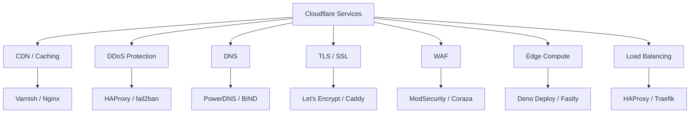
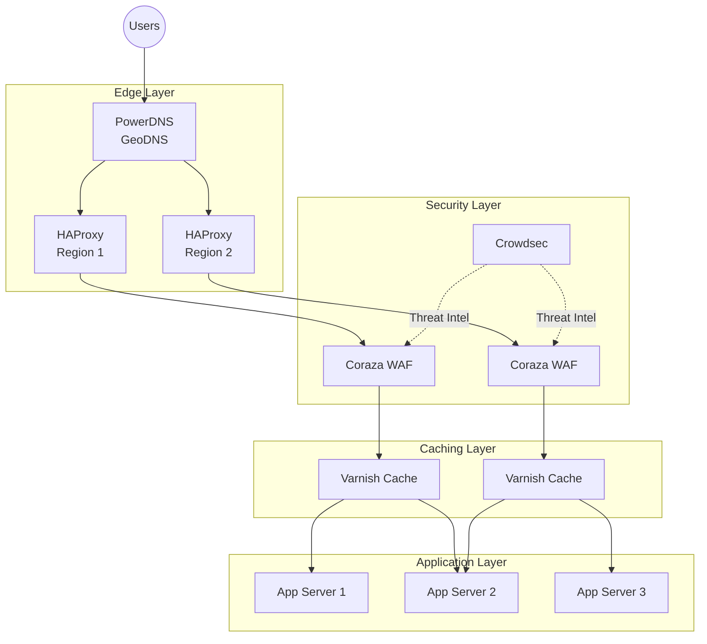

# Decentralize the Internet: Open Source Alternatives to Cloudflare Products

Author: [nawazdhandala](https://www.github.com/nawazdhandala)

Tags: Cloudflare, Open Source, Self-Hosting, Decentralization, Reliability, Security, Cdn, Ddos Protection

Description: Cloudflare powers a troubling percentage of the internet. When they go down, so does everyone else. Here are open source and self-hosted alternatives for CDN, DDoS protection, DNS, and edge services that put you back in control.

Cloudflare has become the internet's de facto infrastructure layer. They proxy roughly [20% of all websites](https://w3techs.com/technologies/details/cn-cloudflare), provide DNS for millions of domains, and sit between users and origin servers for countless applications. That's a lot of trust placed in a single company.

When Cloudflare experiences an outage—and [they do](https://oneuptime.com/blog/post/2025-11-19-why-our-cloudflare-failover-failed/view)—the blast radius is enormous. Entire swaths of the internet become unreachable. Your "highly available" architecture suddenly has a single point of failure you didn't even control.

The solution isn't to avoid CDNs or edge services altogether. The solution is to **decentralize**: use open source tools you can run yourself, diversify across multiple providers, and ensure no single vendor can take your entire stack offline.

## Why Decentralize Away from Cloudflare?

Before diving into alternatives, let's be clear about why this matters:

1. **Single point of failure**: When Cloudflare goes down, your "five nines" architecture becomes irrelevant.
2. **Vendor lock-in**: Cloudflare's ecosystem (Workers, R2, D1, Queues) creates sticky dependencies.
3. **Privacy concerns**: All your traffic flows through their infrastructure—they see everything.
4. **Pricing unpredictability**: Free tiers can disappear or change; enterprise pricing is opaque.
5. **Control**: You can't patch, configure, or debug what you don't own.

The good news? Every Cloudflare service has open source alternatives you can self-host or run across multiple providers.

## Breaking Down Cloudflare's Services

Cloudflare isn't just one thing—it's a bundle of services. To replace it, you need to address each component:



Let's explore open source alternatives for each.

---

## 1. CDN and Caching: Varnish + Nginx

Cloudflare's core value proposition is caching static assets at the edge. You can replicate this with **Varnish Cache** and **Nginx**.

### Varnish Cache

Varnish is a battle-tested HTTP accelerator designed for content-heavy websites. It sits in front of your origin server and caches responses in memory.

Here's a basic Varnish configuration that caches static assets:

```vcl
# /etc/varnish/default.vcl
# Varnish configuration for static asset caching

vcl 4.1;

# Define your backend (origin server)
backend default {
    .host = "127.0.0.1";
    .port = "8080";
    .connect_timeout = 5s;
    .first_byte_timeout = 60s;
    .between_bytes_timeout = 10s;
}

# Handle incoming requests
sub vcl_recv {
    # Strip cookies for static assets - they don't need session state
    if (req.url ~ "\.(css|js|png|jpg|jpeg|gif|ico|woff|woff2|svg)$") {
        unset req.http.Cookie;
        return (hash);
    }
    
    # Pass requests with authorization headers directly to backend
    if (req.http.Authorization) {
        return (pass);
    }
}

# Configure caching behavior for responses
sub vcl_backend_response {
    # Cache static assets for 1 day
    if (bereq.url ~ "\.(css|js|png|jpg|jpeg|gif|ico|woff|woff2|svg)$") {
        set beresp.ttl = 1d;
        set beresp.http.Cache-Control = "public, max-age=86400";
        unset beresp.http.Set-Cookie;
    }
    
    # Don't cache responses with Set-Cookie headers by default
    if (beresp.http.Set-Cookie) {
        set beresp.uncacheable = true;
        return (deliver);
    }
}

# Add cache hit/miss headers for debugging
sub vcl_deliver {
    if (obj.hits > 0) {
        set resp.http.X-Cache = "HIT";
        set resp.http.X-Cache-Hits = obj.hits;
    } else {
        set resp.http.X-Cache = "MISS";
    }
}
```

### Nginx as a Caching Reverse Proxy

If you're already using Nginx, you can enable caching without adding another service:

```nginx
# /etc/nginx/nginx.conf
# Nginx caching proxy configuration

http {
    # Define a cache zone: 10MB for keys, 10GB max storage, inactive items purged after 60 minutes
    proxy_cache_path /var/cache/nginx levels=1:2 keys_zone=static_cache:10m max_size=10g inactive=60m use_temp_path=off;

    server {
        listen 80;
        server_name example.com;

        # Static assets with aggressive caching
        location ~* \.(css|js|png|jpg|jpeg|gif|ico|woff|woff2|svg)$ {
            proxy_pass http://backend;
            proxy_cache static_cache;
            
            # Cache valid responses for 1 day
            proxy_cache_valid 200 1d;
            proxy_cache_valid 404 1m;
            
            # Use stale cache while revalidating
            proxy_cache_use_stale error timeout updating http_500 http_502 http_503 http_504;
            proxy_cache_background_update on;
            proxy_cache_lock on;
            
            # Add cache status header for debugging
            add_header X-Cache-Status $upstream_cache_status;
        }

        # Dynamic content - no caching
        location / {
            proxy_pass http://backend;
            proxy_set_header Host $host;
            proxy_set_header X-Real-IP $remote_addr;
            proxy_set_header X-Forwarded-For $proxy_add_x_forwarded_for;
        }
    }

    upstream backend {
        server 127.0.0.1:8080;
    }
}
```

### Multi-Region Deployment

To replicate Cloudflare's global edge network, deploy Varnish or Nginx nodes in multiple regions using your own servers or VPS providers like Hetzner, OVH, or Vultr. Use GeoDNS (covered below) to route users to the nearest node.

---

## 2. DDoS Protection: HAProxy + fail2ban + Crowdsec

DDoS protection is where Cloudflare's scale genuinely shines. Replicating their 100+ Tbps capacity is unrealistic for most organizations, but you can still build meaningful protection.

### HAProxy Rate Limiting

HAProxy can absorb and rate-limit a surprising amount of abuse:

```haproxy
# /etc/haproxy/haproxy.cfg
# HAProxy configuration with DDoS mitigation

global
    maxconn 50000
    log stdout format raw local0

defaults
    mode http
    timeout connect 5s
    timeout client 30s
    timeout server 30s
    log global
    option httplog

frontend http_front
    bind *:80
    bind *:443 ssl crt /etc/ssl/certs/example.pem
    
    # Track request rates per source IP
    # stick-table stores IP addresses with request counters
    stick-table type ip size 1m expire 10m store http_req_rate(10s),conn_cur,bytes_out_rate(10s)
    
    # Track the current connection's source IP
    http-request track-sc0 src
    
    # Reject IPs making more than 100 requests per 10 seconds
    http-request deny deny_status 429 if { sc_http_req_rate(0) gt 100 }
    
    # Reject IPs with more than 50 concurrent connections
    http-request deny deny_status 429 if { sc_conn_cur(0) gt 50 }
    
    # Tarpit (slow down) suspicious requests instead of rejecting
    http-request tarpit if { sc_http_req_rate(0) gt 50 }
    
    # Add rate limit headers for legitimate clients
    http-response set-header X-RateLimit-Limit 100
    http-response set-header X-RateLimit-Remaining %[sc_http_req_rate(0),sub(100)]
    
    default_backend servers

backend servers
    balance roundrobin
    server app1 127.0.0.1:8080 check
    server app2 127.0.0.1:8081 check
```

### Crowdsec: Community-Powered Threat Intelligence

**Crowdsec** is an open source security engine that analyzes logs, detects attacks, and shares threat intelligence with the community. Think of it as a collaborative fail2ban.

Install and configure Crowdsec to protect your web server:

```bash
# Install Crowdsec on Debian/Ubuntu
curl -s https://packagecloud.io/install/repositories/crowdsec/crowdsec/script.deb.sh | sudo bash
sudo apt install crowdsec crowdsec-firewall-bouncer-iptables

# Install collections for common services
sudo cscli collections install crowdsecurity/nginx
sudo cscli collections install crowdsecurity/http-cve
sudo cscli collections install crowdsecurity/base-http-scenarios

# Check installed scenarios (attack patterns Crowdsec detects)
sudo cscli scenarios list

# View current decisions (blocked IPs)
sudo cscli decisions list
```

Crowdsec's strength is its community blocklists—when one user detects an attack, everyone benefits.

### fail2ban for SSH and Application Protection

fail2ban remains excellent for protecting SSH and application-specific endpoints:

```ini
# /etc/fail2ban/jail.local
# fail2ban configuration for web application protection

[DEFAULT]
bantime = 1h
findtime = 10m
maxretry = 5
banaction = iptables-multiport

[sshd]
enabled = true
port = ssh
filter = sshd
logpath = /var/log/auth.log
maxretry = 3
bantime = 24h

[nginx-http-auth]
enabled = true
filter = nginx-http-auth
port = http,https
logpath = /var/log/nginx/error.log

[nginx-botsearch]
enabled = true
filter = nginx-botsearch
port = http,https
logpath = /var/log/nginx/access.log
maxretry = 2

# Custom filter for rate-limited endpoints
[nginx-ratelimit]
enabled = true
filter = nginx-ratelimit
port = http,https
logpath = /var/log/nginx/access.log
maxretry = 10
findtime = 1m
bantime = 30m
```

---

## 3. DNS: PowerDNS or BIND with GeoDNS

Cloudflare's DNS is fast and globally distributed. You can achieve similar results with **PowerDNS** or **BIND**, optionally with GeoDNS for latency-based routing.

### PowerDNS with GeoIP Backend

PowerDNS supports geographic routing out of the box:

```bash
# Install PowerDNS with GeoIP backend
sudo apt install pdns-server pdns-backend-geoip

# Download MaxMind GeoLite2 database (requires free account)
# Place GeoLite2-City.mmdb in /usr/share/GeoIP/
```

Configure geographic zones in YAML:

```yaml
# /etc/powerdns/geo-zones.yaml
# PowerDNS GeoIP configuration for latency-based routing

domains:
  - domain: example.com
    ttl: 300
    records:
      # Root record with geographic responses
      example.com:
        - soa: &soa
            content: ns1.example.com. admin.example.com. 2024010101 3600 900 604800 300
            ttl: 86400
        - ns:
            content: ns1.example.com.
            ttl: 86400
        - ns:
            content: ns2.example.com.
            ttl: 86400
      
      # www subdomain with geographic A records
      www.example.com:
        - a: &www_default
            content: 203.0.113.10  # Default/fallback server
            ttl: 300
        - a:
            content: 198.51.100.10  # US East server
            ttl: 300
            filters:
              - continent: NA
                country: US
                region: "NY,NJ,PA,MA"
        - a:
            content: 192.0.2.10  # EU server
            ttl: 300
            filters:
              - continent: EU
        - a:
            content: 203.0.113.20  # APAC server
            ttl: 300
            filters:
              - continent: AS
              - continent: OC

services:
  geoip:
    database: /usr/share/GeoIP/GeoLite2-City.mmdb
```

### Authoritative DNS with BIND

For simpler setups, BIND remains rock-solid:

```bash
# /etc/bind/named.conf.local
# BIND9 zone configuration

zone "example.com" {
    type master;
    file "/etc/bind/zones/db.example.com";
    allow-transfer { 192.0.2.2; };  # Secondary DNS server
};
```

```bash
# /etc/bind/zones/db.example.com
# Zone file for example.com

$TTL    300
@       IN      SOA     ns1.example.com. admin.example.com. (
                     2024010101         ; Serial (YYYYMMDDNN format)
                         3600           ; Refresh (1 hour)
                          900           ; Retry (15 minutes)
                       604800           ; Expire (1 week)
                          300 )         ; Negative Cache TTL (5 minutes)

; Name servers
@       IN      NS      ns1.example.com.
@       IN      NS      ns2.example.com.

; A records for name servers
ns1     IN      A       203.0.113.1
ns2     IN      A       203.0.113.2

; Main records
@       IN      A       203.0.113.10
www     IN      A       203.0.113.10
api     IN      A       203.0.113.20

; Mail records
@       IN      MX  10  mail.example.com.
mail    IN      A       203.0.113.30
```

### Multi-Provider DNS Strategy

Don't put all your DNS eggs in one basket. Use multiple authoritative DNS providers:

1. Self-hosted PowerDNS as primary
2. [NS1](https://ns1.com) or [DNSimple](https://dnsimple.com) as secondary
3. Configure zone transfers (AXFR) between them

This way, if one provider goes down, the others continue serving your zones.

---

## 4. TLS/SSL: Let's Encrypt + Caddy or Certbot

Cloudflare provides automatic SSL, but so does **Let's Encrypt**—for free, and without proxying your traffic.

### Caddy: Automatic HTTPS by Default

Caddy is a modern web server that handles TLS certificates automatically:

```
# /etc/caddy/Caddyfile
# Caddy automatically provisions and renews Let's Encrypt certificates

example.com {
    # Caddy handles TLS automatically - no configuration needed!
    
    # Reverse proxy to your application
    reverse_proxy localhost:8080 {
        # Health checks for backend
        health_uri /health
        health_interval 30s
        
        # Load balancing across multiple backends
        # reverse_proxy localhost:8080 localhost:8081 localhost:8082
    }
    
    # Enable compression
    encode gzip zstd
    
    # Security headers
    header {
        # Prevent clickjacking
        X-Frame-Options "SAMEORIGIN"
        # XSS protection
        X-Content-Type-Options "nosniff"
        # Referrer policy
        Referrer-Policy "strict-origin-when-cross-origin"
        # Remove server header
        -Server
    }
    
    # Logging
    log {
        output file /var/log/caddy/access.log
        format json
    }
}

# Wildcard certificate example (requires DNS challenge)
*.example.com {
    tls {
        dns cloudflare {env.CLOUDFLARE_API_TOKEN}  # Or use other DNS providers
    }
    
    @api host api.example.com
    handle @api {
        reverse_proxy localhost:3000
    }
    
    @app host app.example.com
    handle @app {
        reverse_proxy localhost:4000
    }
}
```

### Certbot with Nginx

If you're using Nginx, Certbot integrates seamlessly:

```bash
# Install Certbot for Nginx
sudo apt install certbot python3-certbot-nginx

# Obtain certificate (interactive)
sudo certbot --nginx -d example.com -d www.example.com

# Or non-interactive for automation
sudo certbot --nginx --non-interactive --agree-tos \
    --email admin@example.com \
    -d example.com -d www.example.com

# Auto-renewal is configured automatically, but verify:
sudo systemctl status certbot.timer

# Test renewal
sudo certbot renew --dry-run
```

---

## 5. WAF: ModSecurity or Coraza

Cloudflare's WAF blocks common attacks. You can achieve similar protection with **ModSecurity** or the newer **Coraza** (a Go-based ModSecurity-compatible WAF).

### Coraza with Caddy

Coraza integrates cleanly with Caddy:

```
# /etc/caddy/Caddyfile with Coraza WAF
# Requires caddy-coraza plugin

{
    order coraza_waf first
}

example.com {
    coraza_waf {
        # Load OWASP Core Rule Set
        load_owasp_crs
        
        # Custom directives
        directives `
            # Enable the engine
            SecRuleEngine On
            
            # Set paranoia level (1-4, higher = more aggressive)
            SecAction "id:900000,phase:1,pass,t:none,nolog,setvar:tx.blocking_paranoia_level=2"
            
            # Block common attack patterns
            SecRule REQUEST_URI "@contains /etc/passwd" "id:1001,phase:1,deny,status:403,msg:'Path Traversal Attempt'"
            SecRule ARGS "@contains <script>" "id:1002,phase:2,deny,status:403,msg:'XSS Attempt'"
            
            # Log blocked requests
            SecAuditEngine RelevantOnly
            SecAuditLog /var/log/coraza/audit.log
        `
    }
    
    reverse_proxy localhost:8080
}
```

### ModSecurity with Nginx

ModSecurity is the battle-tested option:

```nginx
# /etc/nginx/nginx.conf with ModSecurity
# Requires nginx-module-modsecurity

load_module modules/ngx_http_modsecurity_module.so;

http {
    modsecurity on;
    modsecurity_rules_file /etc/nginx/modsecurity/main.conf;

    server {
        listen 443 ssl http2;
        server_name example.com;
        
        # ModSecurity is enabled globally, but you can disable per-location
        location /api/webhooks {
            # Disable WAF for webhook endpoints that receive arbitrary data
            modsecurity off;
            proxy_pass http://backend;
        }
        
        location / {
            proxy_pass http://backend;
        }
    }
}
```

```bash
# /etc/nginx/modsecurity/main.conf
# ModSecurity main configuration

Include /etc/nginx/modsecurity/modsecurity.conf
Include /etc/nginx/modsecurity/crs/crs-setup.conf
Include /etc/nginx/modsecurity/crs/rules/*.conf

# Custom rules
SecRule REQUEST_HEADERS:User-Agent "@contains sqlmap" \
    "id:10001,phase:1,deny,status:403,msg:'SQLMap Detected'"
```

---

## 6. Load Balancing: HAProxy or Traefik

### HAProxy for TCP/HTTP Load Balancing

HAProxy is the industry standard for high-performance load balancing:

```haproxy
# /etc/haproxy/haproxy.cfg
# Production-ready HAProxy configuration

global
    maxconn 50000
    log stdout format raw local0
    stats socket /var/run/haproxy.sock mode 660 level admin
    ssl-default-bind-ciphers ECDHE-ECDSA-AES128-GCM-SHA256:ECDHE-RSA-AES128-GCM-SHA256
    ssl-default-bind-options ssl-min-ver TLSv1.2 no-tls-tickets

defaults
    mode http
    log global
    option httplog
    option dontlognull
    option http-server-close
    option forwardfor except 127.0.0.0/8
    timeout connect 5s
    timeout client 30s
    timeout server 30s
    timeout http-request 10s
    timeout http-keep-alive 10s

frontend https_front
    bind *:443 ssl crt /etc/ssl/certs/example.pem alpn h2,http/1.1
    
    # ACL for routing based on hostname
    acl is_api hdr(host) -i api.example.com
    acl is_app hdr(host) -i app.example.com
    
    # Route to appropriate backend
    use_backend api_servers if is_api
    use_backend app_servers if is_app
    default_backend app_servers

backend api_servers
    balance roundrobin
    option httpchk GET /health
    http-check expect status 200
    
    # Servers with health checks and connection limits
    server api1 10.0.1.10:8080 check maxconn 1000 weight 100
    server api2 10.0.1.11:8080 check maxconn 1000 weight 100
    server api3 10.0.1.12:8080 check maxconn 1000 weight 100 backup

backend app_servers
    balance leastconn
    option httpchk GET /health
    
    # Sticky sessions using cookies
    cookie SERVERID insert indirect nocache
    
    server app1 10.0.2.10:3000 check cookie app1
    server app2 10.0.2.11:3000 check cookie app2

# Stats page for monitoring
listen stats
    bind *:8404
    stats enable
    stats uri /stats
    stats refresh 10s
    stats admin if LOCALHOST
```

### Traefik for Kubernetes and Docker

If you're running containers, **Traefik** provides automatic service discovery:

```yaml
# docker-compose.yml with Traefik
# Traefik automatically discovers and routes to containers

version: '3.8'

services:
  traefik:
    image: traefik:v3.0
    command:
      # Enable Docker provider for automatic service discovery
      - "--providers.docker=true"
      - "--providers.docker.exposedbydefault=false"
      # Entrypoints for HTTP and HTTPS
      - "--entrypoints.web.address=:80"
      - "--entrypoints.websecure.address=:443"
      # Let's Encrypt automatic certificates
      - "--certificatesresolvers.letsencrypt.acme.httpchallenge=true"
      - "--certificatesresolvers.letsencrypt.acme.httpchallenge.entrypoint=web"
      - "--certificatesresolvers.letsencrypt.acme.email=admin@example.com"
      - "--certificatesresolvers.letsencrypt.acme.storage=/letsencrypt/acme.json"
      # Enable dashboard
      - "--api.dashboard=true"
    ports:
      - "80:80"
      - "443:443"
    volumes:
      - "/var/run/docker.sock:/var/run/docker.sock:ro"
      - "./letsencrypt:/letsencrypt"
    labels:
      # Dashboard routing
      - "traefik.enable=true"
      - "traefik.http.routers.dashboard.rule=Host(`traefik.example.com`)"
      - "traefik.http.routers.dashboard.service=api@internal"
      - "traefik.http.routers.dashboard.tls.certresolver=letsencrypt"

  # Example application service
  api:
    image: my-api:latest
    labels:
      - "traefik.enable=true"
      # HTTP router with automatic HTTPS redirect
      - "traefik.http.routers.api.rule=Host(`api.example.com`)"
      - "traefik.http.routers.api.entrypoints=websecure"
      - "traefik.http.routers.api.tls.certresolver=letsencrypt"
      # Health check
      - "traefik.http.services.api.loadbalancer.healthcheck.path=/health"
      - "traefik.http.services.api.loadbalancer.healthcheck.interval=10s"
```

---

## 7. Edge Compute Alternatives

Cloudflare Workers let you run code at the edge. Alternatives include:

| Service | Open Source? | Self-Hostable? | Notes |
|---------|--------------|----------------|-------|
| **Deno Deploy** | Runtime is open source | No | V8 isolates, TypeScript-first |
| **Fastly Compute** | No | No | WASM-based, very fast cold starts |
| **Fly.io** | No | No | Run full containers at the edge |
| **OpenFaaS** | Yes | Yes | Kubernetes-native serverless |
| **Cloudflare Workers** | No | No | The incumbent |

For true self-hosting, **OpenFaaS** on Kubernetes gives you serverless functions you control:

```yaml
# openfaas-function.yaml
# Example OpenFaaS function deployment

apiVersion: openfaas.com/v1
kind: Function
metadata:
  name: edge-handler
  namespace: openfaas-fn
spec:
  name: edge-handler
  image: ghcr.io/myorg/edge-handler:latest
  # Scale based on load
  labels:
    com.openfaas.scale.min: "2"
    com.openfaas.scale.max: "20"
    com.openfaas.scale.factor: "20"
    com.openfaas.scale.zero: "false"
  # Resource limits
  limits:
    cpu: 100m
    memory: 128Mi
  requests:
    cpu: 50m
    memory: 64Mi
```

---

## A Complete Self-Hosted Stack

Here's how all these pieces fit together:



---

## When to Still Use Cloudflare (Or Similar)

Let's be practical. Self-hosting everything isn't always the right choice:

- **Massive DDoS attacks**: If you're regularly targeted with 100+ Gbps attacks, you need a provider with that capacity.
- **Global latency requirements**: Deploying to 200+ cities yourself isn't feasible for most teams.
- **Small teams**: The operational overhead of managing all these services may not be worth it.

The key is **not depending on a single provider**. Use Cloudflare for DDoS protection, but ensure you can bypass them when needed. Use their DNS, but have a secondary provider ready. Use their CDN, but cache at your origin too.

We wrote about [our Cloudflare failover failure](https://oneuptime.com/blog/post/2025-11-19-why-our-cloudflare-failover-failed/view) and the lessons learned. The TL;DR: have automation ready that doesn't depend on the service you're failing over from.

---

## Getting Started

1. **Audit your Cloudflare dependencies**: Which services are you actually using? DNS? CDN? WAF? Workers?

2. **Pick your battles**: You don't need to replace everything at once. Start with DNS (easiest) or caching (biggest impact).

3. **Build failover automation**: The goal isn't to never use Cloudflare—it's to not be stuck when they're down.

4. **Test quarterly**: Run chaos engineering exercises where you simulate Cloudflare being unavailable. Can you still serve traffic?

5. **Monitor everything**: Use [OneUptime](https://oneuptime.com) to monitor your self-hosted infrastructure alongside Cloudflare. Know when either fails before your users do.

---

## Conclusion

Cloudflare is a remarkable piece of infrastructure, but remarkable single points of failure are still single points of failure. The internet was designed to be decentralized and resilient. Every year we centralize more of it into fewer hands.

You don't have to go full sovereign-cloud to reduce your blast radius. Start with one service—maybe DNS or caching—and build from there. Every component you can self-host or diversify across providers is one less dependency on a single vendor's uptime.

The tools exist. They're open source. They're battle-tested. The only question is whether you'll use them before the next outage forces your hand.

Build systems that assume failure. Decentralize by default. Own your infrastructure.
