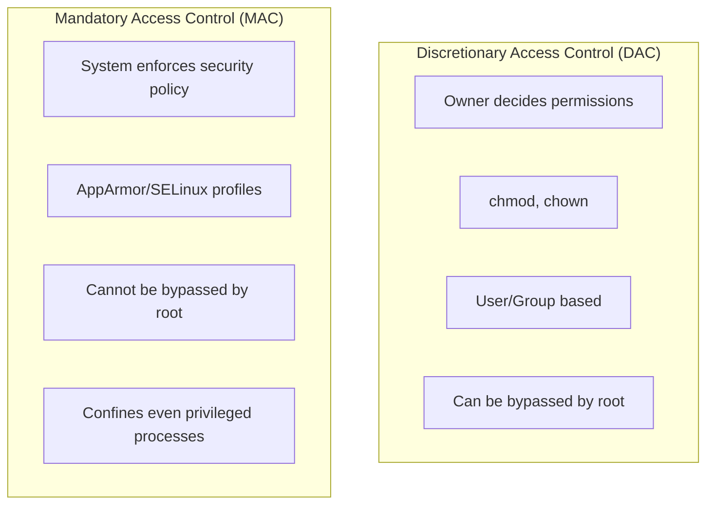

# How to Configure AppArmor and SELinux Profiles for Docker

Author: [nawazdhandala](https://github.com/nawazdhandala)

Tags: Docker, Security, AppArmor, SELinux, Hardening

Description: Learn how to configure AppArmor and SELinux security profiles for Docker containers to provide mandatory access control and enhanced isolation.

---

AppArmor and SELinux are Linux Security Modules (LSMs) that provide mandatory access control (MAC) beyond traditional discretionary access control. Docker integrates with both to add an extra layer of container security.

## Understanding MAC vs DAC



## AppArmor

### Checking AppArmor Status

```bash
# Check if AppArmor is enabled
sudo aa-status

# View Docker's default profile
cat /etc/apparmor.d/docker-default

# Check container's AppArmor profile
docker inspect --format='{{.AppArmorProfile}}' container_name
```

### Docker's Default AppArmor Profile

Docker automatically applies the `docker-default` AppArmor profile to containers:

```bash
# Default profile denies:
# - Writing to /proc/sys
# - Writing to /sys (except /sys/fs/cgroup)
# - Mounting filesystems
# - Accessing raw sockets
# - Loading kernel modules
```

### Creating Custom AppArmor Profiles

```bash
# /etc/apparmor.d/docker-custom-nginx
#include <tunables/global>

profile docker-custom-nginx flags=(attach_disconnected,mediate_deleted) {
  #include <abstractions/base>
  #include <abstractions/nameservice>

  # Network access
  network inet stream,
  network inet6 stream,

  # Allow reading nginx config
  /etc/nginx/** r,

  # Allow writing to specific directories
  /var/log/nginx/** rw,
  /var/cache/nginx/** rw,
  /run/nginx.pid rw,

  # Allow reading web content
  /usr/share/nginx/html/** r,
  /var/www/** r,

  # Deny everything else by default (implicit)

  # Capabilities
  capability net_bind_service,
  capability setuid,
  capability setgid,
  capability chown,
  capability dac_override,

  # Deny dangerous capabilities
  deny capability sys_admin,
  deny capability sys_ptrace,
  deny capability sys_module,
}
```

### Loading AppArmor Profile

```bash
# Parse and load profile
sudo apparmor_parser -r /etc/apparmor.d/docker-custom-nginx

# Verify profile is loaded
sudo aa-status | grep docker-custom-nginx

# Run container with custom profile
docker run --security-opt apparmor=docker-custom-nginx nginx
```

### Docker Compose with AppArmor

```yaml
services:
  nginx:
    image: nginx
    security_opt:
      - apparmor:docker-custom-nginx
```

### Debugging AppArmor Issues

```bash
# Run in complain mode (logs violations but doesn't block)
sudo aa-complain /etc/apparmor.d/docker-custom-nginx

# Watch for denials
sudo dmesg | grep apparmor

# Or use audit log
sudo tail -f /var/log/audit/audit.log | grep apparmor

# Return to enforce mode
sudo aa-enforce /etc/apparmor.d/docker-custom-nginx
```

### AppArmor Profile Generator

```bash
# Generate profile from running container
docker run -d --name test-container nginx

# Use bane to generate profile
bane generate test-container

# Or use aa-genprof (requires container to be running and active)
sudo aa-genprof docker
```

## SELinux

### Checking SELinux Status

```bash
# Check SELinux status
getenforce
# Enforcing, Permissive, or Disabled

# View SELinux configuration
cat /etc/selinux/config

# Check container's SELinux label
docker inspect --format='{{.ProcessLabel}}' container_name
```

### SELinux and Docker

```bash
# Docker containers run with these labels by default:
# Type: container_t (restricted container type)
# Level: varies (MCS isolation)

# View current labels
ps -eZ | grep docker

# Example output:
# system_u:system_r:container_t:s0:c123,c456 ... containerd-shim
```

### Custom SELinux Labels

```bash
# Run with specific SELinux label
docker run --security-opt label=type:container_t nginx

# Run with different MCS labels (Multi-Category Security)
docker run --security-opt label=level:s0:c100,c200 nginx

# Disable SELinux labeling for container (not recommended)
docker run --security-opt label=disable nginx
```

### Docker Compose with SELinux

```yaml
services:
  app:
    image: myapp
    security_opt:
      - label=type:container_t
      - label=level:s0:c100,c200
```

### Volume Labels

```bash
# Relabel volume for container access
docker run -v /data:/data:z nginx    # Shared label
docker run -v /data:/data:Z nginx    # Private label

# :z - shared between containers (svirt_sandbox_file_t)
# :Z - private to this container only
```

### Creating Custom SELinux Policies

```bash
# Install policy development tools
sudo yum install selinux-policy-devel policycoreutils-python-utils

# Create custom policy module
cat > my_container.te << 'EOF'
policy_module(my_container, 1.0)

# Define new type for custom container
type my_container_t;
domain_type(my_container_t)

# Allow network access
allow my_container_t self:tcp_socket { create listen accept bind connect };
allow my_container_t self:udp_socket { create bind };

# Allow reading specific files
allow my_container_t etc_t:file { read open getattr };

# Allow writing to specific directory
type my_container_data_t;
files_type(my_container_data_t)
allow my_container_t my_container_data_t:dir { read write add_name remove_name };
allow my_container_t my_container_data_t:file { create read write unlink };
EOF

# Compile and load policy
make -f /usr/share/selinux/devel/Makefile my_container.pp
sudo semodule -i my_container.pp

# Use custom type
docker run --security-opt label=type:my_container_t myapp
```

### SELinux Booleans for Docker

```bash
# List Docker-related booleans
getsebool -a | grep container

# Common booleans:
# container_connect_any - Allow containers to connect to any port
# container_manage_cgroup - Allow containers to manage cgroups
# container_use_devices - Allow containers to use devices

# Enable a boolean
sudo setsebool -P container_connect_any on
```

### Troubleshooting SELinux

```bash
# Check for denials
sudo ausearch -m AVC,USER_AVC -ts recent

# Generate policy from denials
sudo audit2allow -a

# Generate loadable module from denials
sudo audit2allow -a -M my_fix
sudo semodule -i my_fix.pp

# Set to permissive temporarily
sudo setenforce 0

# Or for specific domain
sudo semanage permissive -a container_t
```

## Comparing AppArmor and SELinux

| Feature | AppArmor | SELinux |
|---------|----------|---------|
| Default in | Ubuntu, Debian, SUSE | RHEL, Fedora, CentOS |
| Profile model | Path-based | Label-based |
| Complexity | Easier to configure | More comprehensive |
| Granularity | File paths | All system resources |
| Performance | Lower overhead | Slightly higher |

## Production Examples

### Hardened Nginx with AppArmor

```bash
# /etc/apparmor.d/docker-nginx-hardened
#include <tunables/global>

profile docker-nginx-hardened flags=(attach_disconnected,mediate_deleted) {
  #include <abstractions/base>
  #include <abstractions/nameservice>

  # Deny all by default, then whitelist

  # Network
  network inet stream,
  network inet6 stream,

  # Required files - read only
  /etc/nginx/** r,
  /etc/ssl/** r,
  /etc/passwd r,
  /etc/group r,

  # Web content - read only
  /usr/share/nginx/html/** r,
  /var/www/** r,

  # Writable areas
  /var/log/nginx/** rw,
  /var/cache/nginx/** rw,
  /run/nginx.pid rw,
  /var/run/nginx.pid rw,

  # Required capabilities
  capability net_bind_service,
  capability setuid,
  capability setgid,
  capability chown,
  capability dac_override,

  # Deny dangerous operations
  deny @{PROC}/** w,
  deny /sys/** w,
  deny capability sys_admin,
  deny capability sys_ptrace,
  deny capability sys_module,
  deny capability sys_rawio,
  deny mount,
  deny umount,
}
```

### Docker Compose with Full Security Options

```yaml
version: '3.8'

services:
  nginx:
    image: nginx:alpine
    read_only: true
    cap_drop:
      - ALL
    cap_add:
      - NET_BIND_SERVICE
      - CHOWN
      - SETGID
      - SETUID
    security_opt:
      - no-new-privileges:true
      - apparmor:docker-nginx-hardened
    tmpfs:
      - /var/cache/nginx
      - /var/run
    volumes:
      - ./html:/usr/share/nginx/html:ro
      - ./nginx.conf:/etc/nginx/nginx.conf:ro

  api:
    image: myapi
    read_only: true
    cap_drop:
      - ALL
    security_opt:
      - no-new-privileges:true
      - apparmor:docker-default
    tmpfs:
      - /tmp
    user: "1000:1000"
```

### SELinux Hardened Stack (RHEL/CentOS)

```yaml
version: '3.8'

services:
  app:
    image: myapp
    security_opt:
      - label=type:container_t
      - label=level:s0:c100,c200
      - no-new-privileges:true
    read_only: true
    cap_drop:
      - ALL
    volumes:
      - app-data:/data:Z  # Private SELinux label

  db:
    image: postgres:15
    security_opt:
      - label=type:container_t
      - label=level:s0:c300,c400
    volumes:
      - db-data:/var/lib/postgresql/data:Z

volumes:
  app-data:
  db-data:
```

## Kubernetes Integration

### AppArmor in Kubernetes

```yaml
apiVersion: v1
kind: Pod
metadata:
  name: secure-pod
  annotations:
    container.apparmor.security.beta.kubernetes.io/app: localhost/docker-custom-nginx
spec:
  containers:
    - name: app
      image: nginx
```

### SELinux in Kubernetes

```yaml
apiVersion: v1
kind: Pod
metadata:
  name: secure-pod
spec:
  securityContext:
    seLinuxOptions:
      type: container_t
      level: s0:c100,c200
  containers:
    - name: app
      image: myapp
```

## Summary

| Scenario | AppArmor | SELinux |
|----------|----------|---------|
| Ubuntu/Debian | Use AppArmor | Install manually |
| RHEL/Fedora | Install manually | Use SELinux |
| Quick setup | Easier profiles | More complex |
| Fine-grained control | Path-based | Label-based |
| Docker default | docker-default | container_t |

Both AppArmor and SELinux provide mandatory access control that cannot be bypassed even by root. Use the LSM native to your distribution, start with default profiles, and customize based on your application's needs. For additional container hardening, combine with capability restrictions as described in our post on [Dropping Linux Capabilities in Docker Containers](https://oneuptime.com/blog/post/2026-01-16-docker-drop-capabilities/view).

