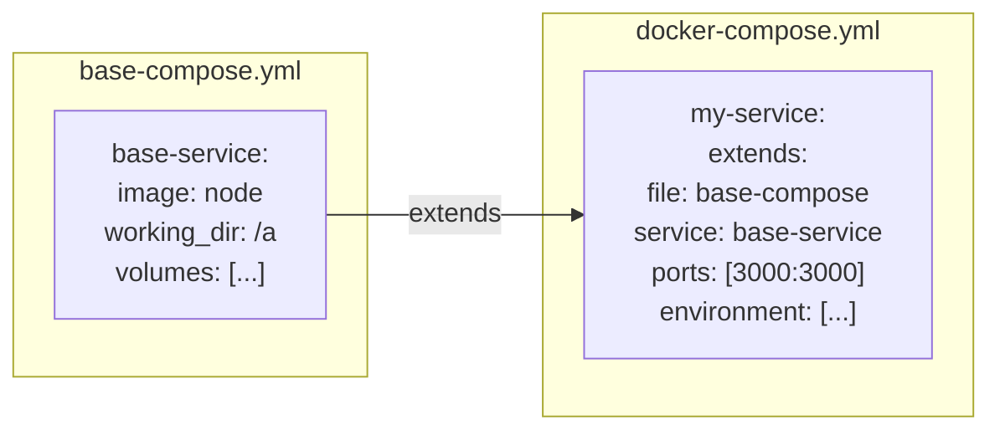

# How to Use Docker Compose Extends for Reusable Configurations

Author: [nawazdhandala](https://github.com/nawazdhandala)

Tags: Docker, Compose, Extends, Configuration, DevOps

Description: Learn how to use Docker Compose extends and includes for reusable configurations, reducing duplication across environments.

---

Docker Compose provides multiple ways to create reusable configurations: the `extends` keyword for service inheritance, `include` for modular files, and multiple compose files with merging. This guide covers all approaches.

## Understanding Extends



## Basic Extends Usage

### Base Configuration

```yaml
# base.yml
services:
  base-node:
    image: node:20-alpine
    working_dir: /app
    volumes:
      - ./:/app
      - node_modules:/app/node_modules
    command: npm start

  base-python:
    image: python:3.11-slim
    working_dir: /app
    volumes:
      - ./:/app
    command: python main.py
```

### Extended Configuration

```yaml
# docker-compose.yml
services:
  api:
    extends:
      file: base.yml
      service: base-node
    ports:
      - "3000:3000"
    environment:
      NODE_ENV: development

  worker:
    extends:
      file: base.yml
      service: base-python
    environment:
      WORKER_TYPE: background

volumes:
  node_modules:
```

## Include Directive (Compose 2.20+)

The `include` directive allows importing complete service definitions from other files.

```yaml
# docker-compose.yml
include:
  - path: ./services/database.yml
  - path: ./services/cache.yml
  - path: ./services/monitoring.yml

services:
  api:
    image: myapi:latest
    depends_on:
      - postgres
      - redis
```

```yaml
# services/database.yml
services:
  postgres:
    image: postgres:15
    environment:
      POSTGRES_PASSWORD: secret
    volumes:
      - pgdata:/var/lib/postgresql/data

volumes:
  pgdata:
```

```yaml
# services/cache.yml
services:
  redis:
    image: redis:7-alpine
    volumes:
      - redis_data:/data

volumes:
  redis_data:
```

## Environment-Based Configuration

### Base Configuration

```yaml
# base.yml
services:
  app:
    image: myapp:latest
    volumes:
      - ./app:/app
    healthcheck:
      test: ["CMD", "curl", "-f", "http://localhost:3000/health"]
      interval: 30s
      timeout: 10s
      retries: 3
```

### Development Override

```yaml
# docker-compose.dev.yml
services:
  app:
    extends:
      file: base.yml
      service: app
    build:
      context: .
      target: development
    volumes:
      - ./app:/app
      - /app/node_modules
    environment:
      NODE_ENV: development
      DEBUG: "*"
    ports:
      - "3000:3000"
      - "9229:9229"  # Debugger port
    command: npm run dev
```

### Production Override

```yaml
# docker-compose.prod.yml
services:
  app:
    extends:
      file: base.yml
      service: app
    image: myapp:${VERSION:-latest}
    deploy:
      replicas: 3
      resources:
        limits:
          cpus: '1'
          memory: 512M
    environment:
      NODE_ENV: production
    ports:
      - "80:3000"
    restart: always
```

## Multiple File Merging

```bash
# Development
docker compose -f docker-compose.yml -f docker-compose.dev.yml up

# Production
docker compose -f docker-compose.yml -f docker-compose.prod.yml up

# Using COMPOSE_FILE environment variable
export COMPOSE_FILE=docker-compose.yml:docker-compose.dev.yml
docker compose up
```

### Merge Behavior

```yaml
# docker-compose.yml (base)
services:
  api:
    image: myapi:latest
    environment:
      LOG_LEVEL: info
    ports:
      - "3000:3000"
```

```yaml
# docker-compose.override.yml (auto-loaded in dev)
services:
  api:
    build: .
    environment:
      LOG_LEVEL: debug  # Overrides
      DEBUG: "true"     # Adds
    ports:
      - "9229:9229"     # Adds (doesn't replace)
    volumes:
      - ./:/app         # Adds
```

## Reusable Service Templates

```yaml
# templates.yml
services:
  logging-base:
    logging:
      driver: json-file
      options:
        max-size: "10m"
        max-file: "3"

  healthcheck-http:
    healthcheck:
      test: ["CMD", "wget", "-q", "--spider", "http://localhost/health"]
      interval: 30s
      timeout: 5s
      retries: 3

  resource-limits:
    deploy:
      resources:
        limits:
          cpus: '0.5'
          memory: 256M
        reservations:
          cpus: '0.1'
          memory: 128M
```

```yaml
# docker-compose.yml
services:
  api:
    extends:
      file: templates.yml
      service: logging-base
    image: myapi:latest
    ports:
      - "3000:3000"

  web:
    extends:
      file: templates.yml
      service: healthcheck-http
    image: nginx:alpine
    ports:
      - "80:80"
```

## Modular Project Structure

```
project/
├── docker-compose.yml          # Main orchestration
├── compose/
│   ├── base.yml                # Base service definitions
│   ├── development.yml         # Dev overrides
│   ├── production.yml          # Prod overrides
│   └── testing.yml             # Test overrides
├── services/
│   ├── frontend.yml            # Frontend service
│   ├── backend.yml             # Backend service
│   └── database.yml            # Database service
└── environments/
    ├── local.env
    ├── staging.env
    └── production.env
```

```yaml
# docker-compose.yml
include:
  - path: ./services/frontend.yml
  - path: ./services/backend.yml
  - path: ./services/database.yml

services:
  # Additional configuration or overrides
```

## Complete Example

### Base Services

```yaml
# compose/base.yml
services:
  node-base:
    image: node:20-alpine
    working_dir: /app
    volumes:
      - ../:/app
    logging:
      driver: json-file
      options:
        max-size: "10m"
        max-file: "3"

  python-base:
    image: python:3.11-slim
    working_dir: /app
    volumes:
      - ../:/app
    logging:
      driver: json-file
      options:
        max-size: "10m"
        max-file: "3"
```

### Service Definitions

```yaml
# services/backend.yml
services:
  api:
    extends:
      file: ../compose/base.yml
      service: node-base
    healthcheck:
      test: ["CMD", "wget", "-q", "--spider", "http://localhost:3000/health"]
      interval: 30s
      timeout: 5s
      retries: 3
    depends_on:
      postgres:
        condition: service_healthy
      redis:
        condition: service_started
```

```yaml
# services/database.yml
services:
  postgres:
    image: postgres:15
    environment:
      POSTGRES_USER: ${DB_USER:-app}
      POSTGRES_PASSWORD: ${DB_PASSWORD:-secret}
      POSTGRES_DB: ${DB_NAME:-app}
    volumes:
      - pgdata:/var/lib/postgresql/data
    healthcheck:
      test: ["CMD-SHELL", "pg_isready -U ${DB_USER:-app}"]
      interval: 10s
      timeout: 5s
      retries: 5

  redis:
    image: redis:7-alpine
    volumes:
      - redis_data:/data
    command: redis-server --appendonly yes

volumes:
  pgdata:
  redis_data:
```

### Environment-Specific

```yaml
# compose/development.yml
services:
  api:
    build:
      context: ..
      target: development
    volumes:
      - ../src:/app/src
      - /app/node_modules
    environment:
      NODE_ENV: development
      DEBUG: "*"
    ports:
      - "3000:3000"
      - "9229:9229"
    command: npm run dev

  postgres:
    ports:
      - "5432:5432"

  redis:
    ports:
      - "6379:6379"
```

```yaml
# compose/production.yml
services:
  api:
    image: ${REGISTRY}/api:${VERSION:-latest}
    deploy:
      replicas: 3
      resources:
        limits:
          cpus: '1'
          memory: 512M
    environment:
      NODE_ENV: production
    restart: always

  postgres:
    deploy:
      resources:
        limits:
          cpus: '2'
          memory: 1G
    restart: always

  redis:
    deploy:
      resources:
        limits:
          memory: 256M
    restart: always
```

### Main Compose File

```yaml
# docker-compose.yml
include:
  - path: ./services/backend.yml
  - path: ./services/database.yml

# Default network for all services
networks:
  default:
    name: myapp-network
```

### Usage

```bash
# Development
docker compose -f docker-compose.yml -f compose/development.yml up

# Production
docker compose -f docker-compose.yml -f compose/production.yml up -d

# Create aliases in Makefile
# make dev / make prod
```

## Summary

| Method | Use Case |
|--------|----------|
| extends | Service inheritance, reduce duplication |
| include | Modular file organization |
| Multiple files | Environment-specific overrides |
| Override files | Development customization |

Using extends and includes creates maintainable, DRY Docker Compose configurations. For YAML-level reuse, see our post on [Docker Compose Anchors and YAML Aliases](https://oneuptime.com/blog/post/2026-01-16-docker-compose-anchors/view).

