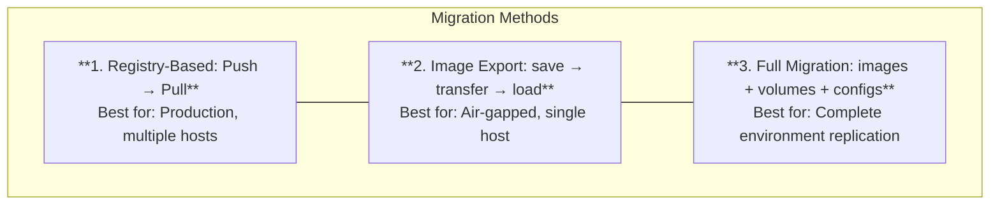

# How to Migrate Docker Containers Between Hosts

Author: [nawazdhandala](https://github.com/nawazdhandala)

Tags: Docker, Migration, DevOps, Containers, Deployment

Description: Learn how to migrate Docker containers between hosts including image transfer, volume migration, and network configuration.

---

Migrating Docker containers between hosts requires transferring images, volumes, and configurations. This guide covers practical migration strategies for different scenarios.

## Migration Strategies



## Method 1: Registry-Based

```bash
# Source host: push to registry
docker tag myapp:latest registry.example.com/myapp:latest
docker push registry.example.com/myapp:latest

# Target host: pull and run
docker pull registry.example.com/myapp:latest
docker run -d registry.example.com/myapp:latest
```

## Method 2: Image Export

```bash
# Source host: save image
docker save myapp:latest | gzip > myapp.tar.gz

# Transfer
scp myapp.tar.gz user@target:/tmp/

# Target host: load image
docker load < /tmp/myapp.tar.gz
docker run -d myapp:latest
```

## Method 3: Full Migration

### Export Everything

```bash
#!/bin/bash
# export-container.sh

CONTAINER=$1
EXPORT_DIR="/tmp/migration"

mkdir -p $EXPORT_DIR

# Export container config
docker inspect $CONTAINER > $EXPORT_DIR/config.json

# Save image
IMAGE=$(docker inspect -f '{{.Config.Image}}' $CONTAINER)
docker save $IMAGE | gzip > $EXPORT_DIR/image.tar.gz

# Backup volumes
for mount in $(docker inspect -f '{{range .Mounts}}{{.Name}} {{end}}' $CONTAINER); do
    docker run --rm \
        -v ${mount}:/source:ro \
        -v $EXPORT_DIR:/backup \
        alpine tar czf /backup/vol_${mount}.tar.gz -C /source .
done

# Create archive
tar czf container_migration.tar.gz -C $EXPORT_DIR .
```

### Import Everything

```bash
#!/bin/bash
# import-container.sh

ARCHIVE=$1
IMPORT_DIR="/tmp/migration"

mkdir -p $IMPORT_DIR
tar xzf $ARCHIVE -C $IMPORT_DIR

# Load image
docker load < $IMPORT_DIR/image.tar.gz

# Create volumes and restore
for vol_file in $IMPORT_DIR/vol_*.tar.gz; do
    vol_name=$(basename $vol_file .tar.gz | sed 's/vol_//')
    docker volume create $vol_name
    docker run --rm \
        -v ${vol_name}:/target \
        -v $IMPORT_DIR:/backup:ro \
        alpine tar xzf /backup/$(basename $vol_file) -C /target
done

# Recreate container from config
# (requires parsing config.json and docker create)
```

## Docker Compose Migration

```bash
# Source host
docker-compose down
docker save $(docker-compose config --images) | gzip > images.tar.gz
tar czf volumes.tar.gz /var/lib/docker/volumes/project_*

# Transfer
scp images.tar.gz volumes.tar.gz docker-compose.yml user@target:/app/

# Target host
cd /app
docker load < images.tar.gz
tar xzf volumes.tar.gz -C /var/lib/docker/
docker-compose up -d
```

## Complete Migration Script

```bash
#!/bin/bash
# full-migration.sh

SOURCE_HOST=$1
TARGET_HOST=$2
COMPOSE_DIR=$3

# On source: export
ssh $SOURCE_HOST << 'EOF'
cd $COMPOSE_DIR
docker-compose stop
docker save $(docker-compose config --images) | gzip > /tmp/images.tar.gz

for vol in $(docker volume ls -q | grep $(basename $(pwd))); do
    docker run --rm -v $vol:/source:ro -v /tmp:/backup alpine \
        tar czf /backup/${vol}.tar.gz -C /source .
done
EOF

# Transfer
scp ${SOURCE_HOST}:/tmp/images.tar.gz /tmp/
scp ${SOURCE_HOST}:/tmp/*.tar.gz /tmp/
scp -r ${SOURCE_HOST}:${COMPOSE_DIR} /tmp/project

# To target
scp /tmp/images.tar.gz ${TARGET_HOST}:/tmp/
scp /tmp/*.tar.gz ${TARGET_HOST}:/tmp/
scp -r /tmp/project ${TARGET_HOST}:/app/

# On target: import
ssh $TARGET_HOST << 'EOF'
docker load < /tmp/images.tar.gz

for vol_file in /tmp/*.tar.gz; do
    vol_name=$(basename $vol_file .tar.gz)
    docker volume create $vol_name
    docker run --rm -v $vol_name:/target -v /tmp:/backup alpine \
        tar xzf /backup/$(basename $vol_file) -C /target
done

cd /app/project
docker-compose up -d
EOF
```

## Summary

| Method | Speed | Downtime | Complexity |
|--------|-------|----------|------------|
| Registry | Fast | Minimal | Low |
| Export/Import | Slow | Medium | Medium |
| Full Migration | Slowest | Highest | High |

Choose the migration method based on your requirements. Registry-based is best for production, while full migration preserves complete state. For live migration with state preservation, see our post on [Docker Checkpoint and Restore](https://oneuptime.com/blog/post/2026-01-16-docker-checkpoint-restore/view).

