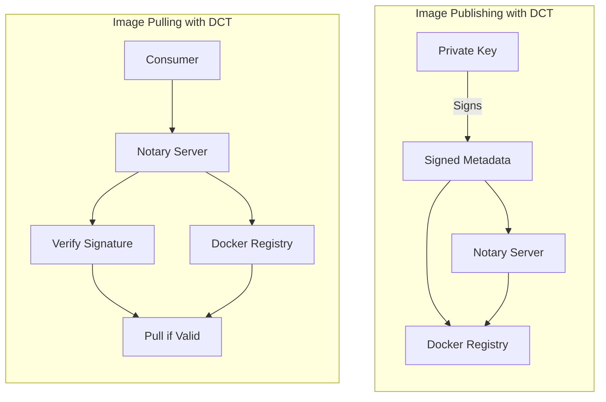

# How to Use Docker Content Trust for Image Signing

Author: [nawazdhandala](https://github.com/nawazdhandala)

Tags: Docker, Security, Content Trust, Image Signing, Notary

Description: Learn how to use Docker Content Trust (DCT) to sign and verify Docker images, ensuring image integrity and publisher authenticity in your container deployments.

---

Docker Content Trust (DCT) provides cryptographic verification of image publishers and integrity. When enabled, Docker only pulls images that are signed by trusted publishers, protecting against tampered or malicious images.

## How Content Trust Works



## Enabling Content Trust

### Environment Variable

```bash
# Enable for current session
export DOCKER_CONTENT_TRUST=1

# Enable globally in shell profile
echo 'export DOCKER_CONTENT_TRUST=1' >> ~/.bashrc

# Disable temporarily for a single command
DOCKER_CONTENT_TRUST=0 docker pull untrusted-image
```

### Docker Daemon Configuration

```json
// /etc/docker/daemon.json
{
  "content-trust": {
    "mode": "enforce"
  }
}
```

## Signing Images

### First-Time Signing

```bash
# Enable content trust
export DOCKER_CONTENT_TRUST=1

# Build and tag image
docker build -t myregistry/myapp:1.0 .

# Push (will prompt for passphrase to create keys)
docker push myregistry/myapp:1.0
# You will be asked to create:
# - Root key (offline key, keep very secure)
# - Repository key (for signing this repo)
```

### Key Management

```bash
# List signing keys
docker trust key list

# Generate new delegation key
docker trust key generate mykey

# Add signer to repository
docker trust signer add --key mykey.pub myname myregistry/myapp

# View trust data for image
docker trust inspect --pretty myregistry/myapp
```

### Signing with Existing Keys

```bash
# Load an existing key
docker trust key load private-key.pem --name mykey

# Sign and push
docker trust sign myregistry/myapp:1.0
```

## Inspecting Signed Images

### View Trust Information

```bash
# Detailed trust info
docker trust inspect myregistry/myapp:1.0

# Pretty-printed format
docker trust inspect --pretty myregistry/myapp:1.0

# Output example:
# Signatures for myregistry/myapp:1.0
# SIGNED TAG    DIGEST                                                             SIGNERS
# 1.0           abc123...                                                          myname
#
# List of signers and their keys for myregistry/myapp:1.0
# SIGNER    KEYS
# myname    key123...
```

### Verify Before Pull

```bash
# With DCT enabled, this verifies signature before pulling
docker pull myregistry/myapp:1.0

# If not signed, you'll see:
# Error: remote trust data does not exist
```

## Delegation and Team Signing

### Set Up Delegation

```bash
# Repository owner adds a delegation role
docker trust signer add --key developer1.pub dev1 myregistry/myapp

# Developer signs their builds
docker trust sign myregistry/myapp:feature-x

# View all signers
docker trust inspect --pretty myregistry/myapp
```

### CI/CD Integration

```yaml
# GitHub Actions with DCT
name: Build and Sign

on:
  push:
    tags:
      - 'v*'

jobs:
  build:
    runs-on: ubuntu-latest
    steps:
      - uses: actions/checkout@v4

      - name: Import Signing Key
        run: |
          echo "${{ secrets.DCT_KEY }}" | base64 -d > key.pem
          docker trust key load key.pem --name ci-signer

      - name: Build and Push
        env:
          DOCKER_CONTENT_TRUST: 1
          DOCKER_CONTENT_TRUST_REPOSITORY_PASSPHRASE: ${{ secrets.DCT_PASSPHRASE }}
        run: |
          docker build -t myregistry/myapp:${{ github.ref_name }} .
          docker push myregistry/myapp:${{ github.ref_name }}
```

### Jenkins Pipeline

```groovy
pipeline {
    agent any

    environment {
        DOCKER_CONTENT_TRUST = '1'
        DOCKER_CONTENT_TRUST_REPOSITORY_PASSPHRASE = credentials('dct-passphrase')
    }

    stages {
        stage('Build') {
            steps {
                sh 'docker build -t myregistry/myapp:${BUILD_NUMBER} .'
            }
        }

        stage('Sign and Push') {
            steps {
                withCredentials([file(credentialsId: 'dct-key', variable: 'KEY_FILE')]) {
                    sh '''
                        docker trust key load ${KEY_FILE} --name jenkins
                        docker push myregistry/myapp:${BUILD_NUMBER}
                    '''
                }
            }
        }
    }
}
```

## Key Security Best Practices

### Root Key Protection

```bash
# Root key location
~/.docker/trust/private/root_keys/

# Backup root key securely
tar -czf root-keys-backup.tar.gz ~/.docker/trust/private/root_keys/

# Store offline (USB drive, HSM, secure vault)
# Never store root key in CI/CD systems
```

### Key Rotation

```bash
# Rotate repository key
docker trust key generate new-repo-key
docker trust signer add --key new-repo-key.pub newkey myregistry/myapp

# Remove old key
docker trust signer remove oldkey myregistry/myapp

# Rotate root key (requires offline root key)
# This is an advanced operation - consult documentation
```

### Using Hardware Security Modules

```bash
# Configure Notary to use PKCS#11 HSM
# notary-config.json
{
  "trust_dir": "~/.docker/trust",
  "remote_server": {
    "url": "https://notary.example.com"
  },
  "storage": {
    "backend": "pkcs11",
    "module": "/usr/lib/softhsm/libsofthsm2.so",
    "slot_id": 0
  }
}
```

## Enforcement Policies

### Docker Daemon Enforcement

```json
// /etc/docker/daemon.json
{
  "content-trust": {
    "mode": "enforce",
    "allow-expired-cached-trust-data": false
  }
}
```

### Kubernetes Admission Control

```yaml
# Using Connaisseur for DCT enforcement in Kubernetes
apiVersion: v1
kind: ConfigMap
metadata:
  name: connaisseur-config
data:
  config.yaml: |
    validators:
      - name: dockerhub
        type: notaryv1
        host: notary.docker.io
        trust_roots:
          - name: default
            key: |
              -----BEGIN PUBLIC KEY-----
              ...
              -----END PUBLIC KEY-----
    policy:
      - pattern: "docker.io/library/*"
        validator: dockerhub
      - pattern: "*"
        validator: deny
```

### Open Policy Agent (OPA)

```rego
# policy.rego
package docker.trust

default allow = false

allow {
    input.image.signed == true
    input.image.signer == "trusted-signer"
}

deny[msg] {
    not input.image.signed
    msg := sprintf("Image %v is not signed", [input.image.name])
}
```

## Notary Server Setup

### Self-Hosted Notary

```yaml
# docker-compose.yml for Notary
version: '3.8'

services:
  notary-server:
    image: notary:server
    volumes:
      - ./fixtures:/etc/notary
    environment:
      - NOTARY_SERVER_STORAGE_BACKEND=mysql
      - NOTARY_SERVER_STORAGE_DB_URL=server:password@tcp(mysql:3306)/notary_server
    depends_on:
      - mysql
    ports:
      - "4443:4443"

  notary-signer:
    image: notary:signer
    volumes:
      - ./fixtures:/etc/notary
    environment:
      - NOTARY_SIGNER_STORAGE_BACKEND=mysql
      - NOTARY_SIGNER_STORAGE_DB_URL=signer:password@tcp(mysql:3306)/notary_signer

  mysql:
    image: mysql:8
    environment:
      - MYSQL_ROOT_PASSWORD=rootpassword
    volumes:
      - notary-db:/var/lib/mysql

volumes:
  notary-db:
```

### Configure Client for Custom Notary

```bash
# Point to custom Notary server
export DOCKER_CONTENT_TRUST_SERVER=https://notary.example.com

# Or in Docker config
# ~/.docker/config.json
{
  "content-trust": {
    "trust-server": "https://notary.example.com"
  }
}
```

## Troubleshooting

### Common Errors

```bash
# "remote trust data does not exist"
# Image is not signed - either sign it or disable DCT
DOCKER_CONTENT_TRUST=0 docker pull unsigned-image

# "could not rotate trust to a new trusted root"
# Root key issue - check ~/.docker/trust/private/root_keys/

# "passphrase is incorrect"
# Wrong passphrase for repository key
# Reset with: notary key rotate <repo> targets
```

### Debug Mode

```bash
# Enable debug output
export DOCKER_CONTENT_TRUST_DEBUG=1
docker push myregistry/myapp:1.0
```

### Reset Trust Data

```bash
# Remove local trust data (careful!)
rm -rf ~/.docker/trust

# Delete trust data from Notary
notary delete myregistry/myapp --remote
```

## Complete CI/CD Example

```yaml
# .github/workflows/signed-release.yml
name: Signed Release

on:
  release:
    types: [published]

jobs:
  build-sign-push:
    runs-on: ubuntu-latest
    steps:
      - uses: actions/checkout@v4

      - name: Set up Docker Buildx
        uses: docker/setup-buildx-action@v3

      - name: Login to Registry
        uses: docker/login-action@v3
        with:
          registry: ${{ vars.REGISTRY }}
          username: ${{ secrets.REGISTRY_USER }}
          password: ${{ secrets.REGISTRY_PASSWORD }}

      - name: Setup DCT
        run: |
          mkdir -p ~/.docker/trust/private
          echo "${{ secrets.DCT_ROOT_KEY }}" | base64 -d > ~/.docker/trust/private/root_keys/key.pem
          echo "${{ secrets.DCT_REPO_KEY }}" | base64 -d > ~/.docker/trust/private/tuf_keys/key.pem

      - name: Build Image
        run: |
          docker build -t ${{ vars.REGISTRY }}/myapp:${{ github.event.release.tag_name }} .

      - name: Sign and Push
        env:
          DOCKER_CONTENT_TRUST: 1
          DOCKER_CONTENT_TRUST_REPOSITORY_PASSPHRASE: ${{ secrets.DCT_PASSPHRASE }}
        run: |
          docker push ${{ vars.REGISTRY }}/myapp:${{ github.event.release.tag_name }}

      - name: Verify Signature
        run: |
          docker trust inspect --pretty ${{ vars.REGISTRY }}/myapp:${{ github.event.release.tag_name }}
```

## Summary

| Feature | Description |
|---------|-------------|
| Root Key | Offline master key, highest security |
| Repository Key | Signs specific repository tags |
| Delegation Keys | Team member signing authority |
| Notary Server | Stores and serves trust metadata |
| Enforcement | Prevents pulling unsigned images |

Docker Content Trust ensures image integrity and authenticity through cryptographic signing. Protect your root keys offline, use delegation for team workflows, and enforce signing in production environments. For comprehensive container security, combine DCT with vulnerability scanning as described in our post on [Scanning Docker Images with Trivy](https://oneuptime.com/blog/post/2026-01-16-docker-scan-images-trivy/view).

