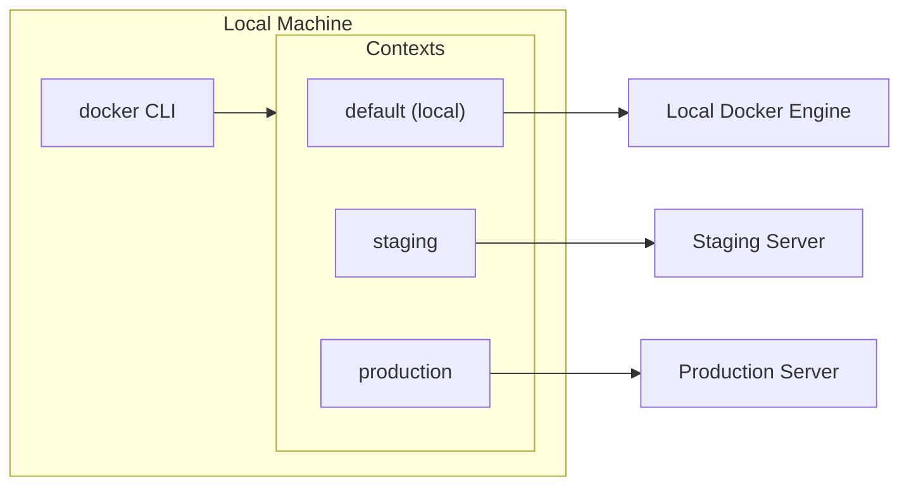

# How to Set Up Docker Contexts for Remote Container Management

Author: [nawazdhandala](https://github.com/nawazdhandala)

Tags: Docker, Remote Management, DevOps, SSH, Docker Context

Description: Learn how to use Docker contexts to manage containers on remote hosts, switch between local and remote Docker engines, and set up secure SSH-based remote Docker access.

---

Docker contexts allow you to manage containers on multiple Docker hosts from a single machine. Instead of SSH-ing into each server, you can switch between local and remote Docker engines with a single command and run docker commands as if they were local.

## Understanding Docker Contexts



## List and View Contexts

```bash
# List all contexts
docker context ls

# Example output:
# NAME        DESCRIPTION                               DOCKER ENDPOINT
# default *   Current DOCKER_HOST based configuration   unix:///var/run/docker.sock
# staging     Staging server                            ssh://user@staging.example.com
# production  Production server                         ssh://user@prod.example.com

# Show current context
docker context show

# Inspect a context
docker context inspect staging
```

## Create SSH-Based Contexts

The simplest and most secure way to connect to remote Docker hosts is via SSH.

### Prerequisites

1. SSH access to remote host
2. Docker installed on remote host
3. User in docker group on remote host

```bash
# On remote server, add user to docker group
sudo usermod -aG docker $USER
```

### Create SSH Context

```bash
# Basic SSH context
docker context create staging \
  --docker "host=ssh://user@staging.example.com"

# With description
docker context create production \
  --description "Production Docker host" \
  --docker "host=ssh://user@prod.example.com"

# With specific SSH port
docker context create secure-host \
  --docker "host=ssh://user@host.example.com:2222"

# With specific SSH key
docker context create custom-key \
  --docker "host=ssh://user@host.example.com" \
  --default-stack-orchestrator swarm
```

### SSH Configuration

For complex SSH setups, configure `~/.ssh/config`:

```
# ~/.ssh/config
Host staging-docker
    HostName staging.example.com
    User deploy
    Port 22
    IdentityFile ~/.ssh/staging_key
    StrictHostKeyChecking accept-new

Host production-docker
    HostName prod.example.com
    User deploy
    Port 2222
    IdentityFile ~/.ssh/prod_key
    ProxyJump bastion.example.com
```

Then create contexts using the SSH alias:

```bash
docker context create staging \
  --docker "host=ssh://staging-docker"

docker context create production \
  --docker "host=ssh://production-docker"
```

## Switch Between Contexts

### Use Command

```bash
# Switch to staging context
docker context use staging

# Run commands against staging
docker ps
docker images

# Switch to production
docker context use production

# Switch back to local
docker context use default
```

### Environment Variable

```bash
# Override context for current shell
export DOCKER_CONTEXT=staging
docker ps  # Runs against staging

# Or for single command
DOCKER_CONTEXT=production docker ps
```

### Per-Command Context

```bash
# Use -c or --context flag
docker --context staging ps
docker --context production logs myapp
```

## Create TCP/TLS Contexts

For Docker hosts with TCP socket exposed (less common, requires TLS).

```bash
# Create TLS-secured TCP context
docker context create remote-tcp \
  --docker "host=tcp://docker.example.com:2376,ca=/path/to/ca.pem,cert=/path/to/cert.pem,key=/path/to/key.pem"
```

### Generate TLS Certificates

```bash
# On remote host, create CA and server certs
mkdir -p ~/.docker/certs
cd ~/.docker/certs

# Generate CA
openssl genrsa -out ca-key.pem 4096
openssl req -new -x509 -days 365 -key ca-key.pem -sha256 -out ca.pem \
  -subj "/CN=docker-ca"

# Generate server key and certificate
openssl genrsa -out server-key.pem 4096
openssl req -new -key server-key.pem -out server.csr \
  -subj "/CN=docker.example.com"
openssl x509 -req -days 365 -in server.csr -CA ca.pem -CAkey ca-key.pem \
  -CAcreateserial -out server-cert.pem

# Generate client key and certificate
openssl genrsa -out client-key.pem 4096
openssl req -new -key client-key.pem -out client.csr \
  -subj "/CN=client"
openssl x509 -req -days 365 -in client.csr -CA ca.pem -CAkey ca-key.pem \
  -CAcreateserial -out client-cert.pem
```

## Docker Compose with Contexts

Docker Compose respects the current context.

```bash
# Set context
docker context use staging

# Compose commands run against staging
docker compose up -d
docker compose ps
docker compose logs
```

### Override in Compose Command

```bash
# Use specific context with compose
docker --context production compose -f docker-compose.yml up -d
```

## Practical Workflows

### Deploy to Multiple Environments

```bash
#!/bin/bash
# deploy.sh

ENVIRONMENTS=("staging" "production")
COMPOSE_FILE="docker-compose.yml"

for env in "${ENVIRONMENTS[@]}"; do
  echo "Deploying to $env..."
  docker --context "$env" compose -f "$COMPOSE_FILE" pull
  docker --context "$env" compose -f "$COMPOSE_FILE" up -d
  echo "Deployed to $env"
done
```

### Check Status Across Hosts

```bash
#!/bin/bash
# status.sh

CONTEXTS=$(docker context ls -q)

for ctx in $CONTEXTS; do
  echo "=== $ctx ==="
  docker --context "$ctx" ps --format "table {{.Names}}\t{{.Status}}\t{{.Ports}}" 2>/dev/null || echo "Cannot connect"
  echo
done
```

### Sync Images Between Hosts

```bash
#!/bin/bash
# sync-image.sh

IMAGE=$1
SOURCE_CTX=${2:-default}
DEST_CTX=$3

if [ -z "$IMAGE" ] || [ -z "$DEST_CTX" ]; then
  echo "Usage: $0 <image> [source-context] <dest-context>"
  exit 1
fi

# Save from source
echo "Saving $IMAGE from $SOURCE_CTX..."
docker --context "$SOURCE_CTX" save "$IMAGE" | \
docker --context "$DEST_CTX" load

echo "Done! Image $IMAGE synced to $DEST_CTX"
```

## Context for Docker Swarm

When using Docker Swarm, contexts manage which cluster you interact with.

```bash
# Create context for swarm manager
docker context create swarm-prod \
  --description "Production Swarm cluster" \
  --docker "host=ssh://manager.prod.example.com"

# Use context for swarm commands
docker --context swarm-prod node ls
docker --context swarm-prod service ls
docker --context swarm-prod stack deploy -c stack.yml myapp
```

## Update and Remove Contexts

### Update Context

```bash
# Update context endpoint
docker context update staging \
  --docker "host=ssh://newuser@staging.example.com"

# Update description
docker context update staging \
  --description "Updated staging environment"
```

### Remove Context

```bash
# Remove a context
docker context rm staging

# Remove context (must not be current)
docker context use default
docker context rm production
```

## Export and Import Contexts

Share context configurations between machines.

```bash
# Export context
docker context export staging > staging-context.tar

# Import on another machine
docker context import staging staging-context.tar
```

## Security Considerations

### SSH Key Best Practices

```bash
# Generate dedicated key for Docker access
ssh-keygen -t ed25519 -f ~/.ssh/docker_remote -C "docker-remote-access"

# On remote, restrict key to Docker commands only
# In ~/.ssh/authorized_keys:
# command="/usr/bin/docker system dial-stdio" ssh-ed25519 AAAA... docker-remote-access
```

### Restrict Docker Socket Access

```bash
# On remote server, limit socket permissions
sudo chmod 660 /var/run/docker.sock
sudo chown root:docker /var/run/docker.sock
```

### Use Jump Hosts

```
# ~/.ssh/config
Host prod-docker
    HostName 10.0.0.5
    User deploy
    ProxyJump bastion.example.com
```

## Troubleshooting

### Connection Issues

```bash
# Test SSH connection
ssh user@remote.example.com docker version

# Verbose SSH debugging
docker --context staging version
# If fails, test with:
ssh -v user@staging.example.com docker version
```

### Permission Denied

```bash
# On remote host, verify user is in docker group
groups
# Should include 'docker'

# If not, add user and re-login
sudo usermod -aG docker $USER
# Log out and back in
```

### SSH Agent

```bash
# Ensure SSH agent is running
eval $(ssh-agent)
ssh-add ~/.ssh/id_rsa

# Verify key is loaded
ssh-add -l
```

### Context Not Switching

```bash
# Check current context
docker context show

# Verify DOCKER_HOST isn't set
echo $DOCKER_HOST
unset DOCKER_HOST

# Use context
docker context use staging
```

## Comparison with Alternatives

| Method | Use Case | Security |
|--------|----------|----------|
| Docker Context (SSH) | General remote management | High (SSH) |
| Docker Context (TCP/TLS) | High-performance needs | High (TLS) |
| SSH + docker | One-off commands | High |
| DOCKER_HOST env | Temporary override | Varies |
| Portainer | Web UI management | Medium |

## Complete Example: Multi-Environment Setup

```bash
#!/bin/bash
# setup-contexts.sh

# Remove existing contexts (except default)
docker context ls -q | grep -v default | xargs -r docker context rm

# Create contexts for each environment
docker context create development \
  --description "Local development" \
  --docker "host=unix:///var/run/docker.sock"

docker context create staging \
  --description "Staging environment" \
  --docker "host=ssh://deploy@staging.example.com"

docker context create production \
  --description "Production environment" \
  --docker "host=ssh://deploy@prod.example.com"

# Verify contexts
docker context ls

# Test each context
for ctx in development staging production; do
  echo "Testing $ctx..."
  docker --context "$ctx" version --format '{{.Server.Version}}' 2>/dev/null || echo "Failed"
done
```

## Summary

| Command | Purpose |
|---------|---------|
| `docker context create name --docker "host=ssh://..."` | Create SSH context |
| `docker context ls` | List contexts |
| `docker context use name` | Switch context |
| `docker --context name cmd` | Run with specific context |
| `docker context rm name` | Remove context |
| `docker context export/import` | Share contexts |

Docker contexts simplify managing multiple Docker hosts from a single machine. SSH-based contexts are secure and easy to set up-just ensure SSH access is properly configured, and you can deploy to staging and production environments with the same commands you use locally.

