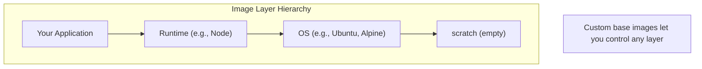

# How to Build Custom Docker Base Images from Scratch

Author: [nawazdhandala](https://github.com/nawazdhandala)

Tags: Docker, Base Images, Scratch, Security, Optimization

Description: Learn how to create custom Docker base images from scratch, build minimal images for security and performance, and understand when to use scratch, distroless, and custom base images.

---

Building custom base images gives you complete control over what goes into your containers. Whether you need minimal attack surface, specific dependencies, or optimized images for your organization, understanding how to build from scratch is a valuable skill.

## Understanding Base Images



## Building from Scratch

The `scratch` image is completely empty-no shell, no libraries, nothing.

### Static Go Binary

Go can compile to static binaries that run without any dependencies.

```dockerfile
# Build stage
FROM golang:1.21-alpine AS builder

WORKDIR /app
COPY go.mod go.sum ./
RUN go mod download

COPY . .

# Build static binary
RUN CGO_ENABLED=0 GOOS=linux go build -a -ldflags '-extldflags "-static"' -o app .

# Final stage - from scratch
FROM scratch

# Copy the binary
COPY --from=builder /app/app /app

# Copy CA certificates for HTTPS
COPY --from=builder /etc/ssl/certs/ca-certificates.crt /etc/ssl/certs/

ENTRYPOINT ["/app"]
```

### Static Rust Binary

```dockerfile
# Build stage
FROM rust:1.74-alpine AS builder

RUN apk add --no-cache musl-dev

WORKDIR /app
COPY . .

# Build static binary
RUN cargo build --release --target x86_64-unknown-linux-musl

# Final stage
FROM scratch

COPY --from=builder /app/target/x86_64-unknown-linux-musl/release/myapp /myapp

ENTRYPOINT ["/myapp"]
```

### C Static Binary

```dockerfile
FROM alpine:3.19 AS builder

RUN apk add --no-cache gcc musl-dev

WORKDIR /app
COPY main.c .

# Compile static binary
RUN gcc -static -o app main.c

FROM scratch
COPY --from=builder /app/app /app
ENTRYPOINT ["/app"]
```

## Creating Minimal Linux Base Images

### Custom Alpine-Based Image

```dockerfile
# Create a minimal base with only what you need
FROM alpine:3.19 AS base

# Remove unnecessary packages
RUN apk --no-cache add \
    ca-certificates \
    tzdata \
    && rm -rf /var/cache/apk/*

# Create non-root user
RUN addgroup -g 1000 app && \
    adduser -u 1000 -G app -s /bin/sh -D app

FROM scratch
COPY --from=base / /

USER app
WORKDIR /home/app
```

### Custom Debian Slim Image

```dockerfile
FROM debian:bookworm-slim AS base

# Install only essential packages
RUN apt-get update && apt-get install -y --no-install-recommends \
    ca-certificates \
    && rm -rf /var/lib/apt/lists/* \
    && rm -rf /var/cache/apt/*

# Remove unnecessary files
RUN rm -rf /usr/share/doc \
    /usr/share/man \
    /usr/share/locale \
    /var/log/*

FROM scratch
COPY --from=base / /
```

## Rootfs-Based Images

Build a complete Linux root filesystem and use it as a base.

### Using debootstrap (Debian/Ubuntu)

```bash
#!/bin/bash
# build-base.sh

# Create minimal Debian rootfs
sudo debootstrap --variant=minbase bookworm rootfs http://deb.debian.org/debian

# Remove unnecessary files
sudo rm -rf rootfs/var/cache/apt/*
sudo rm -rf rootfs/var/lib/apt/lists/*
sudo rm -rf rootfs/usr/share/doc/*
sudo rm -rf rootfs/usr/share/man/*

# Create tarball
sudo tar -C rootfs -c . | docker import - my-debian-base:latest
```

### Using Alpine's minirootfs

```bash
#!/bin/bash
# build-alpine-base.sh

VERSION="3.19"
ARCH="x86_64"

# Download Alpine minirootfs
wget https://dl-cdn.alpinelinux.org/alpine/v${VERSION}/releases/${ARCH}/alpine-minirootfs-${VERSION}.0-${ARCH}.tar.gz

# Import into Docker
docker import alpine-minirootfs-${VERSION}.0-${ARCH}.tar.gz my-alpine-base:latest
```

### Dockerfile Using Imported Base

```dockerfile
FROM my-alpine-base:latest

# Now customize your base
RUN apk add --no-cache nodejs npm

WORKDIR /app
```

## Distroless Images

Google's distroless images contain only your application and its runtime dependencies.

### Python Distroless

```dockerfile
# Build stage
FROM python:3.11-slim AS builder

WORKDIR /app
COPY requirements.txt .
RUN pip install --no-cache-dir --target=/app/deps -r requirements.txt

COPY . .

# Final stage - distroless
FROM gcr.io/distroless/python3-debian12

WORKDIR /app
COPY --from=builder /app/deps /app/deps
COPY --from=builder /app/*.py /app/

ENV PYTHONPATH=/app/deps
CMD ["app.py"]
```

### Node.js Distroless

```dockerfile
FROM node:20-slim AS builder

WORKDIR /app
COPY package*.json ./
RUN npm ci --only=production

COPY . .

FROM gcr.io/distroless/nodejs20-debian12

WORKDIR /app
COPY --from=builder /app .

CMD ["server.js"]
```

### Java Distroless

```dockerfile
FROM eclipse-temurin:21-jdk AS builder

WORKDIR /app
COPY . .
RUN ./gradlew build -x test

FROM gcr.io/distroless/java21-debian12

COPY --from=builder /app/build/libs/app.jar /app.jar

CMD ["app.jar"]
```

## Multi-Architecture Base Images

### Building for Multiple Architectures

```dockerfile
# Dockerfile.multiarch
FROM --platform=$BUILDPLATFORM golang:1.21-alpine AS builder

ARG TARGETPLATFORM
ARG BUILDPLATFORM
ARG TARGETOS
ARG TARGETARCH

WORKDIR /app
COPY . .

RUN CGO_ENABLED=0 GOOS=${TARGETOS} GOARCH=${TARGETARCH} \
    go build -o app .

FROM scratch
COPY --from=builder /app/app /app
ENTRYPOINT ["/app"]
```

Build and push:
```bash
# Create builder for multi-arch
docker buildx create --name multiarch --use

# Build for multiple platforms
docker buildx build \
    --platform linux/amd64,linux/arm64,linux/arm/v7 \
    -t myregistry/myapp:latest \
    --push .
```

## Organization Base Images

Create standardized base images for your organization.

### Company Base Image Template

```dockerfile
# company-base/Dockerfile
FROM alpine:3.19

# Standard security configuration
RUN apk add --no-cache \
    ca-certificates \
    tzdata \
    && rm -rf /var/cache/apk/*

# Standard non-root user
RUN addgroup -g 10000 company && \
    adduser -u 10000 -G company -s /sbin/nologin -D company

# Standard labels
LABEL org.company.maintainer="platform-team@company.com"
LABEL org.company.base-image="true"

# Security hardening
RUN chmod 700 /root && \
    chmod 755 /home

# Default to non-root
USER company
WORKDIR /home/company
```

### Language-Specific Base Images

```dockerfile
# company-node-base/Dockerfile
FROM company-base:latest

USER root

# Install Node.js
RUN apk add --no-cache nodejs npm

# Company npm configuration
COPY .npmrc /home/company/.npmrc
RUN chown company:company /home/company/.npmrc

USER company

# Standard environment
ENV NODE_ENV=production
ENV NPM_CONFIG_LOGLEVEL=warn
```

```dockerfile
# company-python-base/Dockerfile
FROM company-base:latest

USER root

# Install Python
RUN apk add --no-cache python3 py3-pip

# Company pip configuration
COPY pip.conf /etc/pip.conf

USER company

# Standard environment
ENV PYTHONUNBUFFERED=1
ENV PIP_NO_CACHE_DIR=1
```

## Security-Hardened Base Image

```dockerfile
FROM alpine:3.19 AS builder

# Security updates
RUN apk upgrade --no-cache

# Install only required packages
RUN apk add --no-cache \
    ca-certificates \
    && rm -rf /var/cache/apk/*

# Remove shell and unnecessary utilities
RUN rm -rf /bin/sh /bin/ash /bin/busybox 2>/dev/null || true

# Create minimal filesystem
RUN mkdir -p /secure-root/etc/ssl/certs /secure-root/tmp && \
    cp /etc/ssl/certs/ca-certificates.crt /secure-root/etc/ssl/certs/

FROM scratch

COPY --from=builder /secure-root /

# Your statically compiled application
COPY --from=app-builder /app /app

USER 10000:10000
ENTRYPOINT ["/app"]
```

## Testing Base Images

### Verify Image Contents

```bash
# List all files in image
docker run --rm mybase ls -laR /

# Check image size
docker images mybase

# Scan for vulnerabilities
trivy image mybase:latest

# Inspect layers
docker history --no-trunc mybase:latest
```

### Base Image CI Pipeline

```yaml
# .github/workflows/base-image.yml
name: Build Base Image

on:
  push:
    paths:
      - 'base-image/**'
  schedule:
    - cron: '0 0 * * 0'  # Weekly rebuild

jobs:
  build:
    runs-on: ubuntu-latest
    steps:
      - uses: actions/checkout@v4

      - name: Build base image
        run: docker build -t mybase:${{ github.sha }} ./base-image

      - name: Scan for vulnerabilities
        uses: aquasecurity/trivy-action@master
        with:
          image-ref: mybase:${{ github.sha }}
          severity: 'CRITICAL,HIGH'
          exit-code: '1'

      - name: Test base image
        run: |
          docker run --rm mybase:${{ github.sha }} /bin/true || \
          echo "No shell - expected for scratch-based"

      - name: Push to registry
        if: github.ref == 'refs/heads/main'
        run: |
          docker tag mybase:${{ github.sha }} registry.example.com/mybase:latest
          docker push registry.example.com/mybase:latest
```

## Comparison of Base Image Types

| Type | Size | Security | Flexibility | Use Case |
|------|------|----------|-------------|----------|
| scratch | ~0 MB | Excellent | Low | Static binaries |
| distroless | 2-50 MB | Excellent | Medium | Language runtimes |
| Alpine | ~5 MB | Good | High | General purpose |
| Debian slim | ~70 MB | Good | High | Compatibility |
| Ubuntu | ~70 MB | Good | Highest | Dev environments |

## Best Practices

### 1. Minimize Layers

```dockerfile
# Good: Single RUN command
RUN apk add --no-cache package1 package2 && \
    rm -rf /var/cache/apk/*

# Avoid: Multiple RUN commands
RUN apk add package1
RUN apk add package2
```

### 2. Use .dockerignore

```
# .dockerignore
.git
.gitignore
README.md
Dockerfile
docker-compose.yml
*.test.js
coverage/
```

### 3. Pin Versions

```dockerfile
# Good: Pinned version
FROM alpine:3.19.0

# Avoid: Latest or floating tag
FROM alpine:latest
```

### 4. Add Metadata

```dockerfile
LABEL org.opencontainers.image.source="https://github.com/org/repo"
LABEL org.opencontainers.image.version="1.0.0"
LABEL org.opencontainers.image.description="Custom base image"
```

## Summary

| Task | Approach |
|------|----------|
| Smallest possible | FROM scratch + static binary |
| Runtime without OS | Distroless images |
| Custom minimal OS | Alpine-based custom |
| Organization standard | Custom base with policies |
| Multi-architecture | docker buildx |

Custom base images give you control over size, security, and standardization. Start with the smallest viable base for your use case, and add only what your application needs. For static binaries, scratch is ideal. For interpreted languages, distroless provides a good balance. For maximum flexibility, customize Alpine or Debian.

