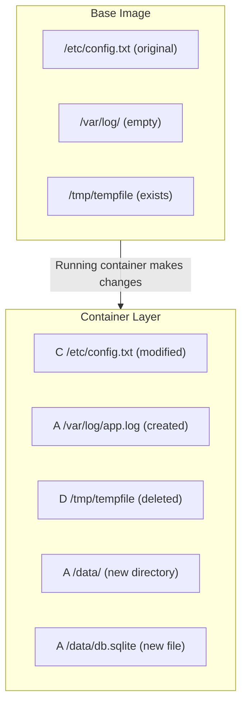

# How to Inspect Docker Container Changes with docker diff

Author: [nawazdhandala](https://github.com/nawazdhandala)

Tags: Docker, Containers, Debugging, DevOps, Filesystem

Description: Learn how to use docker diff to inspect filesystem changes in running containers, track modifications, and debug container behavior by comparing against the original image.

---

The `docker diff` command shows what files have been added, changed, or deleted in a container compared to its base image. This is invaluable for debugging, auditing container behavior, and understanding what an application modifies at runtime.

## Basic Usage

```bash
# Show filesystem changes in a container
docker diff <container_name_or_id>

# Example output
docker diff mycontainer
A /app/data/cache
C /etc/nginx/nginx.conf
D /tmp/old-file.txt
```

## Understanding the Output

| Symbol | Meaning | Description |
|--------|---------|-------------|
| **A** | Added | File or directory was created |
| **C** | Changed | File or directory was modified |
| **D** | Deleted | File or directory was removed |



## Practical Examples

### Track What an Application Modifies

```bash
# Start a fresh nginx container
docker run -d --name nginx-test nginx:alpine

# Make some requests (generates logs)
curl http://localhost:80 2>/dev/null || true

# See what changed
docker diff nginx-test
```

Example output:
```
C /var
C /var/cache
C /var/cache/nginx
A /var/cache/nginx/client_temp
A /var/cache/nginx/fastcgi_temp
A /var/cache/nginx/proxy_temp
A /var/cache/nginx/scgi_temp
A /var/cache/nginx/uwsgi_temp
C /run
A /run/nginx.pid
```

### Debug Configuration Changes

```bash
# Start container and make manual changes
docker run -d --name debug-container python:3.11-slim sleep infinity

# Enter container and modify files
docker exec -it debug-container bash -c "
  echo 'DEBUG=true' >> /etc/environment
  pip install requests
  mkdir -p /app/data
  echo 'test' > /app/data/file.txt
"

# See all changes
docker diff debug-container
```

### Audit Database Containers

```bash
# Start PostgreSQL
docker run -d --name postgres-audit \
  -e POSTGRES_PASSWORD=secret \
  postgres:15

# Wait for startup
sleep 10

# Check what PostgreSQL created
docker diff postgres-audit | head -50
```

## Filtering and Processing Output

### Filter by Change Type

```bash
# Show only added files
docker diff mycontainer | grep "^A "

# Show only modified files
docker diff mycontainer | grep "^C "

# Show only deleted files
docker diff mycontainer | grep "^D "
```

### Filter by Path

```bash
# Show changes in /etc
docker diff mycontainer | grep "/etc"

# Show changes in /var/log
docker diff mycontainer | grep "/var/log"

# Exclude certain paths
docker diff mycontainer | grep -v "/proc\|/sys\|/dev"
```

### Count Changes

```bash
# Count total changes
docker diff mycontainer | wc -l

# Count by type
echo "Added: $(docker diff mycontainer | grep -c '^A')"
echo "Changed: $(docker diff mycontainer | grep -c '^C')"
echo "Deleted: $(docker diff mycontainer | grep -c '^D')"
```

## Debugging Workflows

### Compare Before and After

```bash
#!/bin/bash
# compare-diff.sh - Track changes during operation

CONTAINER=$1
OPERATION=$2

# Capture state before
docker diff "$CONTAINER" > /tmp/before.diff 2>/dev/null || echo "" > /tmp/before.diff

# Run the operation
eval "$OPERATION"

# Wait for changes to settle
sleep 2

# Capture state after
docker diff "$CONTAINER" > /tmp/after.diff

# Show new changes
echo "=== New Changes ==="
diff /tmp/before.diff /tmp/after.diff | grep "^>" | sed 's/^> //'
```

Usage:
```bash
./compare-diff.sh mycontainer "docker exec mycontainer pip install numpy"
```

### Identify Log File Locations

```bash
# Run application that generates logs
docker run -d --name app myapp:latest

# Let it run for a while
sleep 30

# Find log files by looking at changes
docker diff app | grep -E "\.(log|txt|out)$"
docker diff app | grep "/var/log"
docker diff app | grep "/tmp"
```

### Find Cache and Temp Files

```bash
# Identify files that could be excluded from volumes
docker diff mycontainer | grep -E "(cache|temp|tmp|\.pyc|__pycache__|\.cache)"
```

## Real-World Use Cases

### 1. Security Auditing

```bash
#!/bin/bash
# security-audit.sh - Check for suspicious changes

CONTAINER=$1

echo "=== Security Audit for $CONTAINER ==="

# Check for modified system binaries
echo -e "\n[!] Modified system binaries:"
docker diff "$CONTAINER" | grep "^C " | grep -E "/(bin|sbin|usr/bin|usr/sbin)/"

# Check for new executables
echo -e "\n[!] New executable files:"
for file in $(docker diff "$CONTAINER" | grep "^A " | awk '{print $2}'); do
  docker exec "$CONTAINER" test -x "$file" 2>/dev/null && echo "$file"
done

# Check for modified config files
echo -e "\n[!] Modified configuration files:"
docker diff "$CONTAINER" | grep "^C " | grep -E "\.(conf|cfg|ini|yaml|yml|json)$"

# Check for new network-related files
echo -e "\n[!] Changes in /etc:"
docker diff "$CONTAINER" | grep "/etc/"
```

### 2. Container Size Analysis

```bash
#!/bin/bash
# size-analysis.sh - Analyze what's taking space

CONTAINER=$1

echo "=== Size Analysis for $CONTAINER ==="

# Get list of added files
ADDED_FILES=$(docker diff "$CONTAINER" | grep "^A " | awk '{print $2}')

total=0
for file in $ADDED_FILES; do
  # Get file size
  size=$(docker exec "$CONTAINER" stat -f%z "$file" 2>/dev/null || \
         docker exec "$CONTAINER" stat -c%s "$file" 2>/dev/null || echo "0")
  if [ "$size" != "0" ] && [ -n "$size" ]; then
    echo "$size $file"
    total=$((total + size))
  fi
done | sort -rn | head -20

echo -e "\nTop 20 largest added files shown"
echo "Total added data: $((total / 1024 / 1024)) MB"
```

### 3. Development Debugging

```bash
# Track what your application writes
docker run -d --name dev-debug myapp:dev

# Run tests
docker exec dev-debug npm test

# See what test artifacts were created
docker diff dev-debug | grep -E "coverage|reports|__snapshots__|\.test\."
```

## Combining with Other Commands

### docker diff + docker cp

```bash
# Find modified config file
docker diff mycontainer | grep "\.conf"
# Output: C /etc/nginx/nginx.conf

# Extract the modified file
docker cp mycontainer:/etc/nginx/nginx.conf ./nginx.conf.modified
```

### docker diff + docker commit

```bash
# Review changes before committing
echo "Changes to be committed:"
docker diff mycontainer

read -p "Proceed with commit? (y/n) " -n 1 -r
echo
if [[ $REPLY =~ ^[Yy]$ ]]; then
  docker commit mycontainer myimage:with-changes
fi
```

### docker diff + docker logs

```bash
# Correlate filesystem changes with log events
echo "=== Filesystem Changes ==="
docker diff mycontainer

echo -e "\n=== Recent Logs ==="
docker logs --tail 50 mycontainer
```

## Monitoring Script

```bash
#!/bin/bash
# monitor-diff.sh - Continuously monitor container changes

CONTAINER=$1
INTERVAL=${2:-5}

echo "Monitoring $CONTAINER (checking every ${INTERVAL}s)..."
echo "Press Ctrl+C to stop"

LAST_DIFF=""
while true; do
  CURRENT_DIFF=$(docker diff "$CONTAINER" 2>/dev/null | sort)

  if [ "$CURRENT_DIFF" != "$LAST_DIFF" ]; then
    echo -e "\n=== Changes at $(date) ==="
    if [ -z "$LAST_DIFF" ]; then
      echo "$CURRENT_DIFF"
    else
      # Show only new changes
      diff <(echo "$LAST_DIFF") <(echo "$CURRENT_DIFF") | grep "^>" | sed 's/^> /NEW: /'
    fi
    LAST_DIFF="$CURRENT_DIFF"
  fi

  sleep "$INTERVAL"
done
```

## Limitations and Considerations

### What docker diff Shows

| Included | Not Included |
|----------|--------------|
| File additions | Volume contents |
| File modifications | Tmpfs mounts |
| File deletions | Bind mount contents |
| Directory changes | Network changes |
| Permission changes | Process state |

### Volume-Mounted Paths

```bash
# Changes in mounted volumes are NOT shown
docker run -d --name with-volume \
  -v mydata:/data \
  ubuntu sleep infinity

docker exec with-volume touch /data/newfile.txt
docker diff with-volume  # Won't show /data/newfile.txt

# Only non-volume changes appear
docker exec with-volume touch /tmp/newfile.txt
docker diff with-volume  # Shows A /tmp/newfile.txt
```

### Container Must Exist

```bash
# Works on running containers
docker diff running-container

# Works on stopped containers
docker stop mycontainer
docker diff mycontainer  # Still works

# Doesn't work on removed containers
docker rm mycontainer
docker diff mycontainer  # Error: No such container
```

## Best Practices

### 1. Use for Development Debugging

```bash
# Quick way to see what your app creates
docker run -d --name debug myapp:dev
# ... do something ...
docker diff debug
```

### 2. Audit Before Promotion

```bash
# Before promoting an image, check what changed
docker run -d --name audit-check production-image:candidate
docker diff audit-check | tee changes-report.txt
```

### 3. Document Expected Changes

```bash
# Create baseline of expected changes
docker run -d --name baseline myapp:latest
sleep 30  # Let it initialize
docker diff baseline > expected-changes.txt

# Compare future runs
docker run -d --name test myapp:latest
sleep 30
docker diff test > actual-changes.txt
diff expected-changes.txt actual-changes.txt
```

### 4. Use in CI/CD

```yaml
# .gitlab-ci.yml example
test-container-changes:
  script:
    - docker run -d --name test-container $IMAGE
    - sleep 30
    - docker diff test-container > changes.txt
    - |
      if grep -q "/etc/passwd\|/etc/shadow" changes.txt; then
        echo "SECURITY: Sensitive files modified!"
        exit 1
      fi
```

## Summary

| Command | Purpose |
|---------|---------|
| `docker diff container` | Show all changes |
| `docker diff container \| grep "^A"` | Show only added files |
| `docker diff container \| grep "^C"` | Show only changed files |
| `docker diff container \| grep "^D"` | Show only deleted files |
| `docker diff container \| wc -l` | Count total changes |

docker diff is a simple but powerful tool for understanding container behavior. Use it to debug applications, audit security, analyze container size, and verify that containers behave as expected. Combined with other Docker commands, it provides deep visibility into container filesystem activity.

