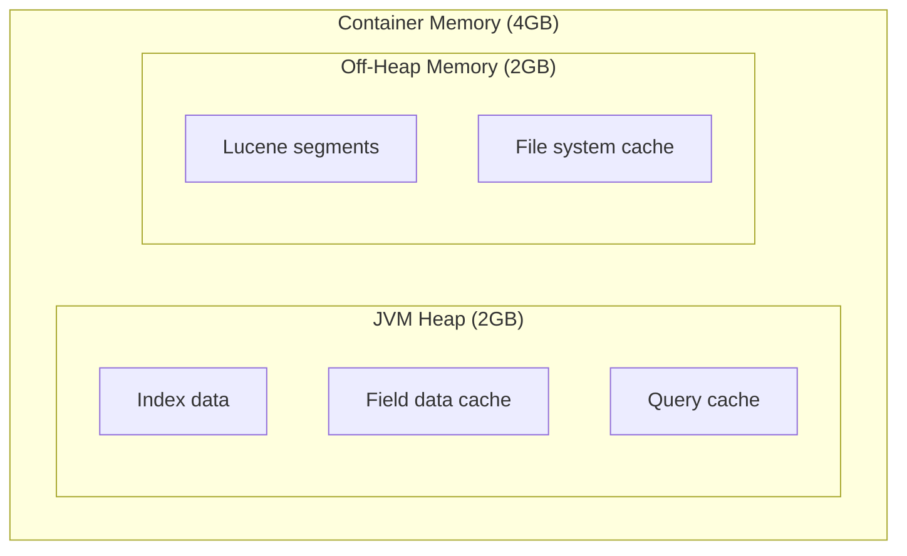

# How to Run Elasticsearch in Docker with Proper Memory Settings

Author: [nawazdhandala](https://github.com/nawazdhandala)

Tags: Docker, Elasticsearch, Search, DevOps, Memory

Description: Learn how to run Elasticsearch in Docker with proper memory configuration, JVM settings, and production-ready cluster setup.

---

Elasticsearch requires careful memory configuration to perform well in Docker. This guide covers proper JVM heap settings, memory locking, and production configurations.

## Memory Configuration Overview



## Basic Setup

### Development Configuration

```yaml
version: '3.8'

services:
  elasticsearch:
    image: elasticsearch:8.11.0
    environment:
      - discovery.type=single-node
      - xpack.security.enabled=false
      - "ES_JAVA_OPTS=-Xms512m -Xmx512m"
    ports:
      - "9200:9200"
    volumes:
      - esdata:/usr/share/elasticsearch/data

volumes:
  esdata:
```

### Production Single Node

```yaml
version: '3.8'

services:
  elasticsearch:
    image: elasticsearch:8.11.0
    environment:
      - discovery.type=single-node
      - xpack.security.enabled=true
      - ELASTIC_PASSWORD=${ELASTIC_PASSWORD}
      - bootstrap.memory_lock=true
      - "ES_JAVA_OPTS=-Xms4g -Xmx4g"
    ulimits:
      memlock:
        soft: -1
        hard: -1
      nofile:
        soft: 65536
        hard: 65536
    ports:
      - "9200:9200"
    volumes:
      - esdata:/usr/share/elasticsearch/data
    deploy:
      resources:
        limits:
          memory: 8G
        reservations:
          memory: 8G

volumes:
  esdata:
```

## Memory Guidelines

| Total RAM | Heap Size | Container Memory |
|-----------|-----------|------------------|
| 8GB | 4GB | 8GB |
| 16GB | 8GB | 16GB |
| 32GB | 16GB | 32GB |
| 64GB | 31GB (max) | 64GB |

**Rule**: Heap should be 50% of available memory, never exceed 31GB.

## Multi-Node Cluster

```yaml
version: '3.8'

services:
  es01:
    image: elasticsearch:8.11.0
    environment:
      - node.name=es01
      - cluster.name=es-cluster
      - discovery.seed_hosts=es02,es03
      - cluster.initial_master_nodes=es01,es02,es03
      - bootstrap.memory_lock=true
      - xpack.security.enabled=true
      - ELASTIC_PASSWORD=${ELASTIC_PASSWORD}
      - "ES_JAVA_OPTS=-Xms4g -Xmx4g"
    ulimits:
      memlock:
        soft: -1
        hard: -1
    volumes:
      - esdata01:/usr/share/elasticsearch/data
    ports:
      - "9200:9200"
    networks:
      - elastic

  es02:
    image: elasticsearch:8.11.0
    environment:
      - node.name=es02
      - cluster.name=es-cluster
      - discovery.seed_hosts=es01,es03
      - cluster.initial_master_nodes=es01,es02,es03
      - bootstrap.memory_lock=true
      - xpack.security.enabled=true
      - "ES_JAVA_OPTS=-Xms4g -Xmx4g"
    ulimits:
      memlock:
        soft: -1
        hard: -1
    volumes:
      - esdata02:/usr/share/elasticsearch/data
    networks:
      - elastic

  es03:
    image: elasticsearch:8.11.0
    environment:
      - node.name=es03
      - cluster.name=es-cluster
      - discovery.seed_hosts=es01,es02
      - cluster.initial_master_nodes=es01,es02,es03
      - bootstrap.memory_lock=true
      - xpack.security.enabled=true
      - "ES_JAVA_OPTS=-Xms4g -Xmx4g"
    ulimits:
      memlock:
        soft: -1
        hard: -1
    volumes:
      - esdata03:/usr/share/elasticsearch/data
    networks:
      - elastic

  kibana:
    image: kibana:8.11.0
    ports:
      - "5601:5601"
    environment:
      - ELASTICSEARCH_HOSTS=http://es01:9200
      - ELASTICSEARCH_USERNAME=kibana_system
      - ELASTICSEARCH_PASSWORD=${KIBANA_PASSWORD}
    depends_on:
      - es01
    networks:
      - elastic

networks:
  elastic:

volumes:
  esdata01:
  esdata02:
  esdata03:
```

## Health Check

```yaml
services:
  elasticsearch:
    image: elasticsearch:8.11.0
    healthcheck:
      test: curl -s http://localhost:9200/_cluster/health | grep -vq '"status":"red"'
      interval: 30s
      timeout: 10s
      retries: 5
      start_period: 60s
```

## Host System Requirements

```bash
# Increase vm.max_map_count for Elasticsearch
sudo sysctl -w vm.max_map_count=262144

# Persist the setting
echo "vm.max_map_count=262144" | sudo tee -a /etc/sysctl.conf
```

## Complete Production Example

```yaml
version: '3.8'

services:
  elasticsearch:
    image: elasticsearch:8.11.0
    restart: unless-stopped
    environment:
      - discovery.type=single-node
      - xpack.security.enabled=true
      - xpack.security.enrollment.enabled=true
      - ELASTIC_PASSWORD=${ELASTIC_PASSWORD}
      - bootstrap.memory_lock=true
      - "ES_JAVA_OPTS=-Xms4g -Xmx4g"
      - "ES_TMPDIR=/tmp"
    ulimits:
      memlock:
        soft: -1
        hard: -1
      nofile:
        soft: 65536
        hard: 65536
    cap_add:
      - IPC_LOCK
    volumes:
      - esdata:/usr/share/elasticsearch/data
    ports:
      - "9200:9200"
    healthcheck:
      test: curl -s http://localhost:9200/_cluster/health | grep -vq '"status":"red"'
      interval: 30s
      timeout: 10s
      retries: 5
    deploy:
      resources:
        limits:
          memory: 8G
        reservations:
          memory: 8G
    networks:
      - backend

  kibana:
    image: kibana:8.11.0
    restart: unless-stopped
    ports:
      - "5601:5601"
    environment:
      - ELASTICSEARCH_HOSTS=http://elasticsearch:9200
      - ELASTICSEARCH_USERNAME=kibana_system
      - ELASTICSEARCH_PASSWORD=${KIBANA_PASSWORD}
    depends_on:
      elasticsearch:
        condition: service_healthy
    networks:
      - backend

networks:
  backend:

volumes:
  esdata:
```

## Summary

| Setting | Value | Purpose |
|---------|-------|---------|
| ES_JAVA_OPTS | -Xms4g -Xmx4g | JVM heap (50% of RAM) |
| bootstrap.memory_lock | true | Prevent swapping |
| memlock ulimit | -1 | Allow memory locking |
| vm.max_map_count | 262144 | Required for mmap |

Elasticsearch requires careful memory tuning in Docker. Always set equal Xms and Xmx values, enable memory locking, and configure host system limits. For logging integration, see our post on [Docker Logging Drivers](https://oneuptime.com/blog/post/2026-01-16-docker-logging-drivers/view).

