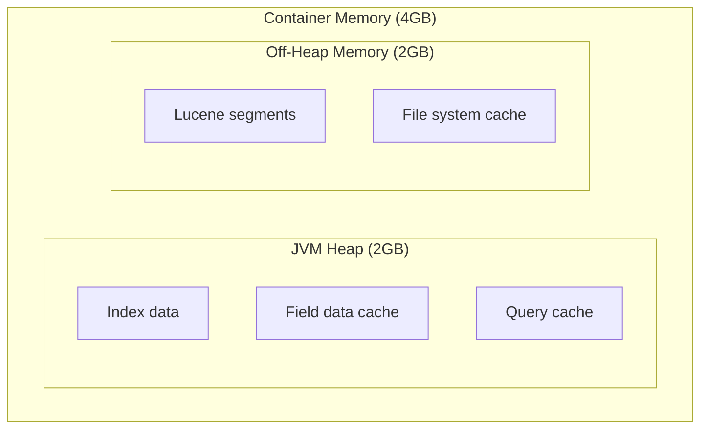

# How to Run Elasticsearch in Docker with Proper Memory Settings

Author: [nawazdhandala](https://github.com/nawazdhandala)

Tags: Docker, Elasticsearch, Search, DevOps, Memory

Description: Learn how to run Elasticsearch in Docker with proper memory configuration, JVM settings, and production-ready cluster setup.

---

Elasticsearch requires careful memory configuration to perform well in Docker. This guide covers proper JVM heap settings, memory locking, and production configurations.

## Memory Configuration Overview


```mermaid
flowchart TB
    subgraph container["Container Memory (4GB)"]
        subgraph heap["JVM Heap (2GB)"]
            h1["Index data"]
            h2["Field data cache"]
            h3["Query cache"]
        end
        subgraph offheap["Off-Heap Memory (2GB)"]
            o1["Lucene segments"]
            o2["File system cache"]
        end
    end
```

## Basic Setup

### Development Configuration

```yaml
services:
  elasticsearch:
    image: docker.elastic.co/elasticsearch/elasticsearch:8.11.0
    environment:
      - discovery.type=single-node
      - xpack.security.enabled=false
      - "ES_JAVA_OPTS=-Xms512m -Xmx512m"
    ports:
      - "9200:9200"
    volumes:
      - esdata:/usr/share/elasticsearch/data

volumes:
  esdata:
```

### Production Single Node

```yaml
services:
  elasticsearch:
    image: docker.elastic.co/elasticsearch/elasticsearch:8.11.0
    environment:
      - discovery.type=single-node
      - xpack.security.enabled=true
      - xpack.security.http.ssl.enabled=false
      - ELASTIC_PASSWORD=${ELASTIC_PASSWORD}
      - bootstrap.memory_lock=true
      - "ES_JAVA_OPTS=-Xms4g -Xmx4g"
    ulimits:
      memlock:
        soft: -1
        hard: -1
      nofile:
        soft: 65536
        hard: 65536
    ports:
      - "9200:9200"
    volumes:
      - esdata:/usr/share/elasticsearch/data
    deploy:
      resources:
        limits:
          memory: 8G
        reservations:
          memory: 8G

volumes:
  esdata:
```

## Memory Guidelines

| Total RAM | Heap Size | Container Memory |
|-----------|-----------|------------------|
| 8GB | 4GB | 8GB |
| 16GB | 8GB | 16GB |
| 32GB | 16GB | 32GB |
| 64GB | 26GB safe, up to 30GB on some systems | 64GB |

**Rule**: Heap should be no more than 50% of available memory. Keep it below the compressed ordinary object pointers threshold: 26GB is safe on most systems, and the threshold can be as high as 30GB on some systems.

## Multi-Node Cluster

```yaml
services:
  es01:
    image: docker.elastic.co/elasticsearch/elasticsearch:8.11.0
    environment:
      - node.name=es01
      - cluster.name=es-cluster
      - discovery.seed_hosts=es02,es03
      - cluster.initial_master_nodes=es01,es02,es03
      - bootstrap.memory_lock=true
      - xpack.security.enabled=false
      - "ES_JAVA_OPTS=-Xms4g -Xmx4g"
    ulimits:
      memlock:
        soft: -1
        hard: -1
    volumes:
      - esdata01:/usr/share/elasticsearch/data
    ports:
      - "9200:9200"
    networks:
      - elastic

  es02:
    image: docker.elastic.co/elasticsearch/elasticsearch:8.11.0
    environment:
      - node.name=es02
      - cluster.name=es-cluster
      - discovery.seed_hosts=es01,es03
      - cluster.initial_master_nodes=es01,es02,es03
      - bootstrap.memory_lock=true
      - xpack.security.enabled=false
      - "ES_JAVA_OPTS=-Xms4g -Xmx4g"
    ulimits:
      memlock:
        soft: -1
        hard: -1
    volumes:
      - esdata02:/usr/share/elasticsearch/data
    networks:
      - elastic

  es03:
    image: docker.elastic.co/elasticsearch/elasticsearch:8.11.0
    environment:
      - node.name=es03
      - cluster.name=es-cluster
      - discovery.seed_hosts=es01,es02
      - cluster.initial_master_nodes=es01,es02,es03
      - bootstrap.memory_lock=true
      - xpack.security.enabled=false
      - "ES_JAVA_OPTS=-Xms4g -Xmx4g"
    ulimits:
      memlock:
        soft: -1
        hard: -1
    volumes:
      - esdata03:/usr/share/elasticsearch/data
    networks:
      - elastic

  kibana:
    image: docker.elastic.co/kibana/kibana:8.11.0
    ports:
      - "5601:5601"
    environment:
      - ELASTICSEARCH_HOSTS=http://es01:9200
    depends_on:
      - es01
    networks:
      - elastic

networks:
  elastic:

volumes:
  esdata01:
  esdata02:
  esdata03:
```

## Health Check

```yaml
services:
  elasticsearch:
    image: docker.elastic.co/elasticsearch/elasticsearch:8.11.0
    healthcheck:
      test: curl -fsS http://localhost:9200/_cluster/health | grep -vq '"status":"red"'
      interval: 30s
      timeout: 10s
      retries: 5
      start_period: 60s
```

## Host System Requirements

```bash
# Increase vm.max_map_count for Elasticsearch

sudo sysctl -w vm.max_map_count=1048576

# Persist the setting
echo "vm.max_map_count=1048576" | sudo tee -a /etc/sysctl.conf
```

## Complete Production Example

```yaml
services:
  elasticsearch:
    image: docker.elastic.co/elasticsearch/elasticsearch:8.11.0
    restart: unless-stopped
    environment:
      - discovery.type=single-node
      - xpack.security.enabled=true
      - xpack.security.http.ssl.enabled=false
      - xpack.security.enrollment.enabled=false
      - ELASTIC_PASSWORD=${ELASTIC_PASSWORD}
      - bootstrap.memory_lock=true
      - "ES_JAVA_OPTS=-Xms4g -Xmx4g"
      - "ES_TMPDIR=/tmp"
    ulimits:
      memlock:
        soft: -1
        hard: -1
      nofile:
        soft: 65536
        hard: 65536
    cap_add:
      - IPC_LOCK
    volumes:
      - esdata:/usr/share/elasticsearch/data
    ports:
      - "9200:9200"
    healthcheck:
      test: curl -fsS -u elastic:$${ELASTIC_PASSWORD} http://localhost:9200/_cluster/health | grep -vq '"status":"red"'
      interval: 30s
      timeout: 10s
      retries: 5
    deploy:
      resources:
        limits:
          memory: 8G
        reservations:
          memory: 8G
    networks:
      - backend

  setup-kibana-password:
    image: docker.elastic.co/elasticsearch/elasticsearch:8.11.0
    depends_on:
      elasticsearch:
        condition: service_healthy
    environment:
      - ELASTIC_PASSWORD=${ELASTIC_PASSWORD}
      - KIBANA_PASSWORD=${KIBANA_PASSWORD}
    command: >
      bash -c 'until curl -fsS -u "elastic:$${ELASTIC_PASSWORD}" -H "Content-Type: application/json" -X POST http://elasticsearch:9200/_security/user/kibana_system/_password -d "{\"password\":\"$${KIBANA_PASSWORD}\"}"; do sleep 5; done'
    networks:
      - backend

  kibana:
    image: docker.elastic.co/kibana/kibana:8.11.0
    restart: unless-stopped
    ports:
      - "5601:5601"
    environment:
      - ELASTICSEARCH_HOSTS=http://elasticsearch:9200
      - ELASTICSEARCH_USERNAME=kibana_system
      - ELASTICSEARCH_PASSWORD=${KIBANA_PASSWORD}
    depends_on:
      setup-kibana-password:
        condition: service_completed_successfully
    networks:
      - backend

networks:
  backend:

volumes:
  esdata:
```

## Summary

| Setting | Value | Purpose |
|---------|-------|---------|
| ES_JAVA_OPTS | -Xms4g -Xmx4g | JVM heap (up to 50% of RAM; use JVM options files for production overrides) |
| bootstrap.memory_lock | true | Prevent swapping |
| memlock ulimit | -1 | Allow memory locking |
| vm.max_map_count | 1048576 | Required for mmap |

Elasticsearch requires careful memory tuning in Docker. Always set equal Xms and Xmx values when overriding heap size, enable memory locking, and configure host system limits. For logging integration, see our post on [Docker Logging Drivers](https://oneuptime.com/blog/post/2026-01-16-docker-logging-drivers/view).
