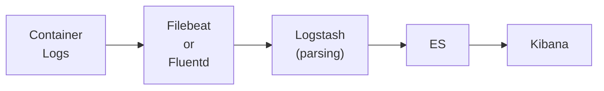

# How to Stream Docker Logs to ELK Stack

Author: [nawazdhandala](https://github.com/nawazdhandala)

Tags: Docker, ELK, Elasticsearch, Logging, Observability

Description: Learn how to stream Docker container logs to the ELK (Elasticsearch, Logstash, Kibana) stack for centralized log management and analysis.

---

The ELK stack provides powerful centralized logging for Docker environments. This guide covers setting up Elasticsearch, Logstash, and Kibana for collecting and analyzing container logs.

## Architecture



## Basic ELK Setup

```yaml
version: '3.8'

services:
  elasticsearch:
    image: elasticsearch:8.11.0
    environment:
      - discovery.type=single-node
      - xpack.security.enabled=false
      - "ES_JAVA_OPTS=-Xms512m -Xmx512m"
    volumes:
      - esdata:/usr/share/elasticsearch/data
    ports:
      - "9200:9200"

  logstash:
    image: logstash:8.11.0
    volumes:
      - ./logstash.conf:/usr/share/logstash/pipeline/logstash.conf
    depends_on:
      - elasticsearch

  kibana:
    image: kibana:8.11.0
    ports:
      - "5601:5601"
    environment:
      - ELASTICSEARCH_HOSTS=http://elasticsearch:9200
    depends_on:
      - elasticsearch

  filebeat:
    image: elastic/filebeat:8.11.0
    user: root
    volumes:
      - ./filebeat.yml:/usr/share/filebeat/filebeat.yml:ro
      - /var/lib/docker/containers:/var/lib/docker/containers:ro
      - /var/run/docker.sock:/var/run/docker.sock:ro
    depends_on:
      - elasticsearch

volumes:
  esdata:
```

## Filebeat Configuration

```yaml
# filebeat.yml
filebeat.inputs:
  - type: container
    paths:
      - '/var/lib/docker/containers/*/*.log'
    processors:
      - add_docker_metadata:
          host: "unix:///var/run/docker.sock"

output.elasticsearch:
  hosts: ["elasticsearch:9200"]
  indices:
    - index: "docker-logs-%{+yyyy.MM.dd}"

setup.kibana:
  host: "kibana:5601"
```

## Logstash Pipeline

```ruby
# logstash.conf
input {
  beats {
    port => 5044
  }
}

filter {
  if [container][name] {
    mutate {
      add_field => { "container_name" => "%{[container][name]}" }
    }
  }

  json {
    source => "message"
    target => "parsed"
    skip_on_invalid_json => true
  }

  date {
    match => ["[parsed][timestamp]", "ISO8601"]
    target => "@timestamp"
  }
}

output {
  elasticsearch {
    hosts => ["elasticsearch:9200"]
    index => "docker-logs-%{+YYYY.MM.dd}"
  }
}
```

## Using Docker GELF Driver

```yaml
services:
  app:
    image: myapp:latest
    logging:
      driver: gelf
      options:
        gelf-address: "udp://logstash:12201"
        tag: "myapp"

  logstash:
    image: logstash:8.11.0
    ports:
      - "12201:12201/udp"
    volumes:
      - ./gelf-pipeline.conf:/usr/share/logstash/pipeline/logstash.conf
```

```ruby
# gelf-pipeline.conf
input {
  gelf {
    port => 12201
  }
}

output {
  elasticsearch {
    hosts => ["elasticsearch:9200"]
    index => "docker-%{+YYYY.MM.dd}"
  }
}
```

## Complete Production Setup

```yaml
version: '3.8'

services:
  elasticsearch:
    image: elasticsearch:8.11.0
    restart: unless-stopped
    environment:
      - discovery.type=single-node
      - xpack.security.enabled=false
      - bootstrap.memory_lock=true
      - "ES_JAVA_OPTS=-Xms1g -Xmx1g"
    ulimits:
      memlock:
        soft: -1
        hard: -1
    volumes:
      - esdata:/usr/share/elasticsearch/data
    healthcheck:
      test: curl -s http://localhost:9200/_cluster/health | grep -vq '"status":"red"'
      interval: 30s
      timeout: 10s
      retries: 5

  kibana:
    image: kibana:8.11.0
    restart: unless-stopped
    ports:
      - "5601:5601"
    environment:
      - ELASTICSEARCH_HOSTS=http://elasticsearch:9200
    depends_on:
      elasticsearch:
        condition: service_healthy

  filebeat:
    image: elastic/filebeat:8.11.0
    restart: unless-stopped
    user: root
    volumes:
      - ./filebeat.yml:/usr/share/filebeat/filebeat.yml:ro
      - /var/lib/docker/containers:/var/lib/docker/containers:ro
      - /var/run/docker.sock:/var/run/docker.sock:ro
    depends_on:
      elasticsearch:
        condition: service_healthy
    command: ["filebeat", "-e", "-strict.perms=false"]

volumes:
  esdata:
```

## Summary

| Component | Purpose |
|-----------|---------|
| Elasticsearch | Log storage and search |
| Logstash | Log parsing and transformation |
| Kibana | Log visualization |
| Filebeat | Log shipping from containers |

The ELK stack provides comprehensive log management for Docker. Use Filebeat for lightweight log collection and Logstash for complex parsing. For simpler setups, consider Fluentd as described in our post on [Docker Logging Drivers](https://oneuptime.com/blog/post/2026-01-16-docker-logging-drivers/view).

