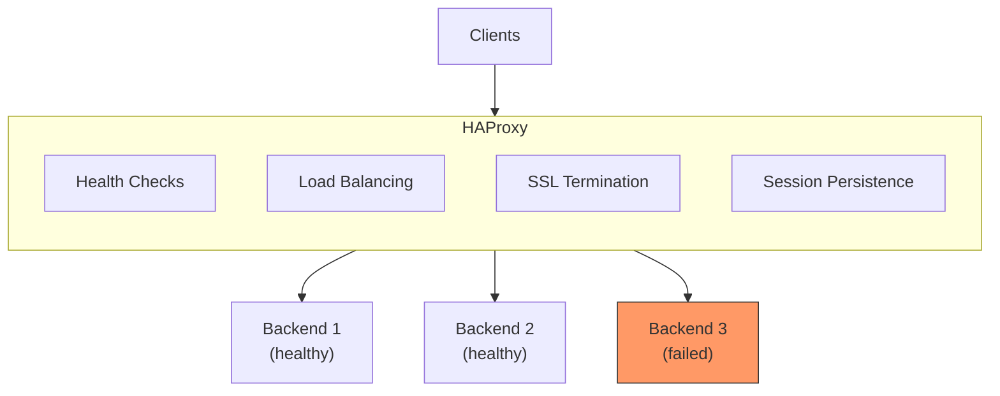

# How to Load Balance Docker Containers with HAProxy

Author: [nawazdhandala](https://github.com/nawazdhandala)

Tags: Docker, HAProxy, Load Balancing, High Availability, DevOps

Description: Learn how to set up HAProxy for load balancing Docker containers, including health checks, sticky sessions, SSL termination, and high availability configurations.

---

HAProxy is a high-performance load balancer used by many high-traffic websites. This guide covers configuring HAProxy to load balance Docker containers with health checks, different algorithms, and production-ready settings.

## HAProxy Architecture



## Basic Setup

### HAProxy Configuration

```haproxy
# haproxy.cfg
global
    log stdout format raw local0
    maxconn 4096

defaults
    mode http
    log global
    option httplog
    option dontlognull
    timeout connect 5s
    timeout client 50s
    timeout server 50s

frontend http_front
    bind *:80
    default_backend app_servers

backend app_servers
    balance roundrobin
    server app1 app1:3000 check
    server app2 app2:3000 check
    server app3 app3:3000 check
```

### Docker Compose

```yaml
version: '3.8'

services:
  haproxy:
    image: haproxy:2.8
    ports:
      - "80:80"
      - "8404:8404"  # Stats page
    volumes:
      - ./haproxy.cfg:/usr/local/etc/haproxy/haproxy.cfg:ro
    depends_on:
      - app1
      - app2
      - app3

  app1:
    image: myapp:latest
    expose:
      - "3000"

  app2:
    image: myapp:latest
    expose:
      - "3000"

  app3:
    image: myapp:latest
    expose:
      - "3000"
```

## Load Balancing Algorithms

### Round Robin (Default)

```haproxy
backend app_servers
    balance roundrobin
    server app1 app1:3000 check
    server app2 app2:3000 check
```

### Least Connections

```haproxy
backend app_servers
    balance leastconn
    server app1 app1:3000 check
    server app2 app2:3000 check
```

### Source IP Hash (Sticky)

```haproxy
backend app_servers
    balance source
    hash-type consistent
    server app1 app1:3000 check
    server app2 app2:3000 check
```

### Weighted Round Robin

```haproxy
backend app_servers
    balance roundrobin
    server app1 app1:3000 check weight 3
    server app2 app2:3000 check weight 2
    server app3 app3:3000 check weight 1
```

### URI-Based

```haproxy
backend app_servers
    balance uri
    hash-type consistent
    server app1 app1:3000 check
    server app2 app2:3000 check
```

## Health Checks

### HTTP Health Check

```haproxy
backend app_servers
    balance roundrobin
    option httpchk GET /health
    http-check expect status 200
    server app1 app1:3000 check inter 10s fall 3 rise 2
    server app2 app2:3000 check inter 10s fall 3 rise 2
```

### TCP Health Check

```haproxy
backend db_servers
    mode tcp
    balance roundrobin
    option tcp-check
    server db1 db1:5432 check inter 5s fall 3 rise 2
    server db2 db2:5432 check inter 5s fall 3 rise 2
```

### Custom Health Check

```haproxy
backend app_servers
    option httpchk
    http-check send meth GET uri /health hdr Host localhost
    http-check expect string "healthy"
    server app1 app1:3000 check
```

## Session Persistence

### Cookie-Based Sticky Sessions

```haproxy
backend app_servers
    balance roundrobin
    cookie SERVERID insert indirect nocache
    server app1 app1:3000 check cookie s1
    server app2 app2:3000 check cookie s2
    server app3 app3:3000 check cookie s3
```

### Using Stick Tables

```haproxy
backend app_servers
    balance roundrobin
    stick-table type ip size 200k expire 30m
    stick on src
    server app1 app1:3000 check
    server app2 app2:3000 check
```

## SSL/TLS Configuration

### SSL Termination

```haproxy
frontend https_front
    bind *:443 ssl crt /etc/ssl/certs/combined.pem
    default_backend app_servers

frontend http_front
    bind *:80
    redirect scheme https code 301 if !{ ssl_fc }
```

### SSL Passthrough

```haproxy
frontend https_front
    bind *:443
    mode tcp
    default_backend app_servers

backend app_servers
    mode tcp
    balance roundrobin
    server app1 app1:443 check
```

### Let's Encrypt Integration

```yaml
services:
  haproxy:
    image: haproxy:2.8
    ports:
      - "80:80"
      - "443:443"
    volumes:
      - ./haproxy.cfg:/usr/local/etc/haproxy/haproxy.cfg:ro
      - certs:/etc/ssl/certs:ro

  certbot:
    image: certbot/certbot
    volumes:
      - certs:/etc/letsencrypt
      - ./certbot:/var/www/certbot
    command: certonly --webroot -w /var/www/certbot -d example.com --non-interactive --agree-tos --email admin@example.com

volumes:
  certs:
```

## Stats and Monitoring

### Enable Stats Page

```haproxy
frontend stats
    bind *:8404
    mode http
    stats enable
    stats uri /stats
    stats refresh 10s
    stats admin if TRUE
    stats auth admin:password
```

### Prometheus Metrics

```haproxy
frontend stats
    bind *:8404
    mode http
    http-request use-service prometheus-exporter if { path /metrics }
    stats enable
    stats uri /stats
```

## Rate Limiting

### Connection Rate Limiting

```haproxy
frontend http_front
    bind *:80

    # Track requests per IP
    stick-table type ip size 100k expire 30s store http_req_rate(10s)
    http-request track-sc0 src
    http-request deny deny_status 429 if { sc_http_req_rate(0) gt 100 }

    default_backend app_servers
```

### Concurrent Connection Limit

```haproxy
frontend http_front
    bind *:80
    maxconn 2000

    stick-table type ip size 100k expire 30s store conn_cur
    http-request track-sc0 src
    http-request deny deny_status 429 if { sc_conn_cur(0) gt 10 }

    default_backend app_servers
```

## ACLs and Routing

### Path-Based Routing

```haproxy
frontend http_front
    bind *:80

    acl is_api path_beg /api
    acl is_static path_beg /static

    use_backend api_servers if is_api
    use_backend static_servers if is_static
    default_backend web_servers

backend api_servers
    balance roundrobin
    server api1 api1:3000 check

backend static_servers
    balance roundrobin
    server static1 static1:80 check

backend web_servers
    balance roundrobin
    server web1 web1:80 check
```

### Host-Based Routing

```haproxy
frontend http_front
    bind *:80

    acl is_api hdr(host) -i api.example.com
    acl is_admin hdr(host) -i admin.example.com

    use_backend api_servers if is_api
    use_backend admin_servers if is_admin
    default_backend web_servers
```

## Complete Production Configuration

```haproxy
# haproxy.cfg
global
    log stdout format raw local0
    maxconn 50000
    tune.ssl.default-dh-param 2048

defaults
    mode http
    log global
    option httplog
    option dontlognull
    option http-server-close
    option forwardfor except 127.0.0.0/8
    option redispatch
    retries 3
    timeout http-request 10s
    timeout queue 1m
    timeout connect 10s
    timeout client 1m
    timeout server 1m
    timeout http-keep-alive 10s
    timeout check 10s
    maxconn 3000

# Stats page
frontend stats
    bind *:8404
    mode http
    stats enable
    stats uri /stats
    stats refresh 10s
    stats auth admin:${STATS_PASSWORD}
    http-request use-service prometheus-exporter if { path /metrics }

# HTTP Frontend
frontend http_front
    bind *:80
    redirect scheme https code 301 if !{ ssl_fc }

# HTTPS Frontend
frontend https_front
    bind *:443 ssl crt /etc/ssl/certs/cert.pem alpn h2,http/1.1
    http-request set-header X-Forwarded-Proto https

    # Rate limiting
    stick-table type ip size 100k expire 30s store http_req_rate(10s)
    http-request track-sc0 src
    http-request deny deny_status 429 if { sc_http_req_rate(0) gt 100 }

    # Routing
    acl is_api path_beg /api
    use_backend api_servers if is_api
    default_backend web_servers

# API Backend
backend api_servers
    balance leastconn
    option httpchk GET /health
    http-check expect status 200
    cookie SERVERID insert indirect nocache
    server api1 api1:3000 check cookie s1 inter 5s fall 3 rise 2
    server api2 api2:3000 check cookie s2 inter 5s fall 3 rise 2
    server api3 api3:3000 check cookie s3 inter 5s fall 3 rise 2

# Web Backend
backend web_servers
    balance roundrobin
    option httpchk GET /
    http-check expect status 200
    server web1 web1:80 check inter 10s fall 3 rise 2
    server web2 web2:80 check inter 10s fall 3 rise 2
```

### Docker Compose Production

```yaml
version: '3.8'

services:
  haproxy:
    image: haproxy:2.8-alpine
    restart: unless-stopped
    ports:
      - "80:80"
      - "443:443"
      - "8404:8404"
    volumes:
      - ./haproxy.cfg:/usr/local/etc/haproxy/haproxy.cfg:ro
      - ./certs:/etc/ssl/certs:ro
    environment:
      - STATS_PASSWORD=${STATS_PASSWORD}
    networks:
      - frontend
    deploy:
      resources:
        limits:
          memory: 512M
          cpus: '1'

  api:
    image: myapi:latest
    deploy:
      replicas: 3
    networks:
      - frontend
      - backend

  web:
    image: myweb:latest
    deploy:
      replicas: 2
    networks:
      - frontend

networks:
  frontend:
  backend:
    internal: true
```

## High Availability

### HAProxy Keepalived

```yaml
services:
  haproxy1:
    image: haproxy:2.8
    networks:
      frontend:
        ipv4_address: 172.20.0.10

  haproxy2:
    image: haproxy:2.8
    networks:
      frontend:
        ipv4_address: 172.20.0.11

  keepalived1:
    image: osixia/keepalived
    network_mode: host
    cap_add:
      - NET_ADMIN
    environment:
      - KEEPALIVED_VIRTUAL_IPS=192.168.1.100
      - KEEPALIVED_PRIORITY=100

  keepalived2:
    image: osixia/keepalived
    network_mode: host
    cap_add:
      - NET_ADMIN
    environment:
      - KEEPALIVED_VIRTUAL_IPS=192.168.1.100
      - KEEPALIVED_PRIORITY=99
```

## Summary

| Feature | Configuration |
|---------|--------------|
| Round Robin | balance roundrobin |
| Least Connections | balance leastconn |
| Health Checks | option httpchk + http-check |
| Sticky Sessions | cookie SERVERID insert |
| Rate Limiting | stick-table + http_req_rate |
| SSL Termination | bind *:443 ssl crt |
| Stats | stats enable + stats uri |

HAProxy provides enterprise-grade load balancing for Docker containers. Use health checks to ensure traffic only goes to healthy backends, sticky sessions for stateful applications, and rate limiting for protection. For simpler setups, consider [Traefik](https://oneuptime.com/blog/post/2026-01-16-docker-traefik-reverse-proxy/view) or [Caddy](https://oneuptime.com/blog/post/2026-01-16-docker-caddy-automatic-https/view).

