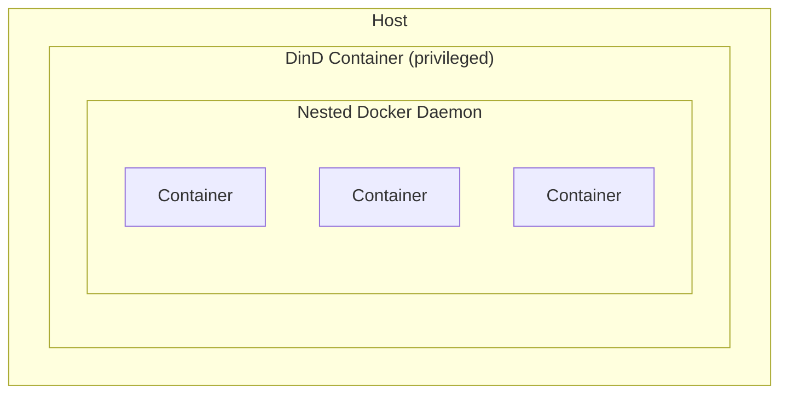
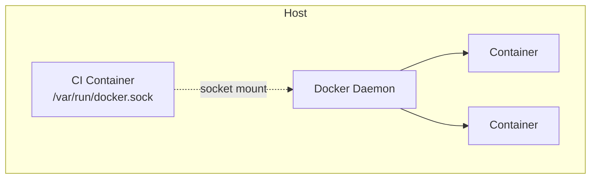

# How to Run Docker Inside Docker (DinD) Safely

Author: [nawazdhandala](https://github.com/nawazdhandala)

Tags: Docker, DinD, CI/CD, DevOps, Containers

Description: Learn how to run Docker inside Docker containers safely, understand the security implications, and choose between DinD and Docker socket binding for CI/CD pipelines.

---

Running Docker inside Docker (DinD) is commonly needed for CI/CD pipelines that build container images. There are two approaches: true Docker-in-Docker with a nested daemon, and Docker socket binding which shares the host's Docker daemon. Each has different security implications and use cases.

## Understanding the Approaches

### Approach 1: Docker-in-Docker (DinD)



### Approach 2: Docker Socket Binding (DooD)



## Docker-in-Docker (True DinD)

### Basic DinD Setup

```bash
# Run official DinD image
docker run --privileged --name dind -d docker:dind

# Connect a client container to it
docker run --rm --link dind:docker docker:latest docker ps
```

### DinD with Docker Compose

```yaml
version: '3.8'

services:
  dind:
    image: docker:dind
    privileged: true
    environment:
      - DOCKER_TLS_CERTDIR=/certs
    volumes:
      - docker-certs-ca:/certs/ca
      - docker-certs-client:/certs/client
      - dind-storage:/var/lib/docker

  docker-client:
    image: docker:latest
    environment:
      - DOCKER_HOST=tcp://dind:2376
      - DOCKER_TLS_VERIFY=1
      - DOCKER_CERT_PATH=/certs/client
    volumes:
      - docker-certs-client:/certs/client:ro
    depends_on:
      - dind
    command: docker info

volumes:
  docker-certs-ca:
  docker-certs-client:
  dind-storage:
```

### DinD Without TLS (Development Only)

```yaml
services:
  dind:
    image: docker:dind
    privileged: true
    environment:
      - DOCKER_TLS_CERTDIR=  # Empty disables TLS
    command: --tls=false

  client:
    image: docker:latest
    environment:
      - DOCKER_HOST=tcp://dind:2375
    depends_on:
      - dind
```

### Security Considerations for DinD

| Risk | Description | Mitigation |
|------|-------------|------------|
| Privileged mode | Full host access | Use rootless DinD |
| Container escape | Can affect host | Isolate on dedicated hosts |
| Resource exhaustion | Nested containers use host resources | Set resource limits |
| Storage driver issues | Some drivers don't nest well | Use overlay2 |

### Rootless DinD

```yaml
services:
  dind-rootless:
    image: docker:dind-rootless
    privileged: true  # Still needed for some operations
    environment:
      - DOCKER_TLS_CERTDIR=/certs
    volumes:
      - docker-certs-client:/certs/client
      - dind-storage:/home/rootless/.local/share/docker

  client:
    image: docker:latest
    environment:
      - DOCKER_HOST=tcp://dind-rootless:2376
      - DOCKER_TLS_VERIFY=1
      - DOCKER_CERT_PATH=/certs/client
    volumes:
      - docker-certs-client:/certs/client:ro
```

## Docker Socket Binding (DooD)

Mounting the host's Docker socket is simpler but shares the host's Docker daemon.

### Basic Socket Binding

```bash
docker run -v /var/run/docker.sock:/var/run/docker.sock docker docker ps
```

### Docker Compose with Socket

```yaml
services:
  ci-runner:
    image: docker:latest
    volumes:
      - /var/run/docker.sock:/var/run/docker.sock
      - ./workspace:/workspace
    working_dir: /workspace
```

### Security Implications

**Critical**: Mounting the Docker socket is equivalent to giving root access to the host.

```bash
# From inside the container with socket access, you can:
# 1. Access host filesystem
docker run -v /:/host alpine cat /host/etc/shadow

# 2. Run privileged containers
docker run --privileged alpine

# 3. Affect other containers
docker rm -f $(docker ps -q)
```

### Protecting Socket Binding

Use a Docker socket proxy to restrict API access:

```yaml
services:
  socket-proxy:
    image: tecnativa/docker-socket-proxy
    privileged: true
    volumes:
      - /var/run/docker.sock:/var/run/docker.sock:ro
    environment:
      - CONTAINERS=1
      - IMAGES=1
      - NETWORKS=1
      - VOLUMES=1
      # Deny dangerous operations
      - POST=1  # Allow POST for build
      - BUILD=1
      - EXEC=0  # Deny exec
      - COMMIT=0

  ci-runner:
    image: docker:latest
    environment:
      - DOCKER_HOST=tcp://socket-proxy:2375
    depends_on:
      - socket-proxy
```

## CI/CD Use Cases

### GitLab CI with DinD

```yaml
# .gitlab-ci.yml
image: docker:latest

services:
  - docker:dind

variables:
  DOCKER_HOST: tcp://docker:2376
  DOCKER_TLS_CERTDIR: "/certs"
  DOCKER_CERT_PATH: "/certs/client"
  DOCKER_TLS_VERIFY: 1

build:
  stage: build
  script:
    - docker build -t myimage .
    - docker push myimage
```

### GitHub Actions with DinD

```yaml
# .github/workflows/build.yml
name: Build

on: [push]

jobs:
  build:
    runs-on: ubuntu-latest
    services:
      dind:
        image: docker:dind
        options: --privileged
        env:
          DOCKER_TLS_CERTDIR: ""

    container:
      image: docker:latest
      env:
        DOCKER_HOST: tcp://dind:2375

    steps:
      - uses: actions/checkout@v4
      - run: docker build -t myimage .
```

### Jenkins with DinD

```groovy
// Jenkinsfile
pipeline {
    agent {
        docker {
            image 'docker:latest'
            args '-v /var/run/docker.sock:/var/run/docker.sock'
        }
    }
    stages {
        stage('Build') {
            steps {
                sh 'docker build -t myimage .'
            }
        }
    }
}
```

## Complete DinD CI Pipeline Example

```yaml
version: '3.8'

services:
  # Docker-in-Docker daemon
  dind:
    image: docker:dind
    privileged: true
    environment:
      - DOCKER_TLS_CERTDIR=/certs
    volumes:
      - docker-certs-ca:/certs/ca
      - docker-certs-client:/certs/client
      - dind-data:/var/lib/docker
    networks:
      - ci-network
    healthcheck:
      test: ["CMD", "docker", "info"]
      interval: 10s
      timeout: 5s
      retries: 5

  # CI runner
  runner:
    image: docker:latest
    environment:
      - DOCKER_HOST=tcp://dind:2376
      - DOCKER_TLS_VERIFY=1
      - DOCKER_CERT_PATH=/certs/client
    volumes:
      - docker-certs-client:/certs/client:ro
      - ./:/workspace
    working_dir: /workspace
    depends_on:
      dind:
        condition: service_healthy
    networks:
      - ci-network
    command: |
      sh -c "
        docker build -t myapp:latest .
        docker run --rm myapp:latest npm test
        docker tag myapp:latest registry.example.com/myapp:latest
      "

volumes:
  docker-certs-ca:
  docker-certs-client:
  dind-data:

networks:
  ci-network:
```

## Comparison

| Aspect | DinD | Socket Binding |
|--------|------|----------------|
| Isolation | Better | None |
| Security | Requires privileged | Host access risk |
| Performance | Overhead | Native speed |
| Caching | Separate cache | Shared cache |
| Complexity | More complex | Simple |
| Clean state | Each run is fresh | Persists state |

## When to Use Each

**Use DinD when:**
- You need complete isolation between builds
- Running untrusted code
- Testing Docker-in-Docker scenarios
- You want fresh state for each build

**Use Socket Binding when:**
- You trust the code being run
- You want to leverage layer caching
- Performance is critical
- Simplicity is preferred

## Troubleshooting

### DinD Not Starting

```bash
# Check DinD logs
docker logs dind

# Common issues:
# - Storage driver incompatibility
# - Missing privileged flag
# - TLS certificate issues
```

### Cannot Connect to DinD

```bash
# Verify TLS certificates
docker --tlsverify \
  --tlscacert=/certs/ca/cert.pem \
  --tlscert=/certs/client/cert.pem \
  --tlskey=/certs/client/key.pem \
  -H tcp://dind:2376 info

# Check network connectivity
ping dind
nc -zv dind 2376
```

### Socket Permission Issues

```bash
# Add user to docker group
docker run -v /var/run/docker.sock:/var/run/docker.sock \
  -u $(id -u):$(id -g) \
  --group-add $(stat -c '%g' /var/run/docker.sock) \
  docker docker ps
```

## Summary

| Feature | DinD | Socket Binding | Socket Proxy |
|---------|------|----------------|--------------|
| Security | Medium | Low | Medium-High |
| Isolation | Full | None | Partial |
| Performance | Lower | Native | Native |
| Setup | Complex | Simple | Medium |
| Recommended for | CI/CD, Testing | Trusted pipelines | Production CI |

For CI/CD pipelines, DinD provides better isolation at the cost of complexity and performance. Socket binding is simpler but requires trust in the executed code. Using a socket proxy provides a middle ground with restricted API access. Choose based on your security requirements and trust model.

