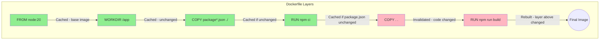

# How to Use Docker Layer Caching in CI/CD

Author: [nawazdhandala](https://github.com/nawazdhandala)

Tags: Docker, CI/CD, Caching, BuildKit, Performance

Description: Learn how to leverage Docker layer caching in CI/CD pipelines to dramatically speed up builds, including BuildKit cache mounts, registry caching, and platform-specific optimizations.

---

Docker layer caching can reduce build times from minutes to seconds by reusing unchanged layers. In CI/CD environments where builds typically start fresh, implementing proper caching strategies is essential for fast feedback loops.

## How Docker Layer Caching Works



When any layer changes, all subsequent layers must be rebuilt. Optimizing layer order is the first step to effective caching.

## Dockerfile Optimization for Caching

### Order Layers by Change Frequency

```dockerfile
# Bad: Source code copied early invalidates dependency cache
FROM node:20
WORKDIR /app
COPY . .
RUN npm ci
RUN npm run build

# Good: Dependencies cached separately from source
FROM node:20
WORKDIR /app
COPY package*.json ./
RUN npm ci
COPY . .
RUN npm run build
```

### Multi-Stage Builds for Better Caching

```dockerfile
# Stage 1: Dependencies (cached independently)
FROM node:20 AS deps
WORKDIR /app
COPY package*.json ./
RUN npm ci

# Stage 2: Build (only rebuilds when source changes)
FROM deps AS builder
COPY . .
RUN npm run build

# Stage 3: Production (minimal final image)
FROM node:20-alpine AS production
WORKDIR /app
COPY --from=deps /app/node_modules ./node_modules
COPY --from=builder /app/dist ./dist
CMD ["node", "dist/index.js"]
```

## BuildKit Cache Features

### Enable BuildKit

```bash
# Enable BuildKit
export DOCKER_BUILDKIT=1

# Or in Docker daemon config
# /etc/docker/daemon.json
{
  "features": {
    "buildkit": true
  }
}
```

### Cache Mounts for Package Managers

```dockerfile
# syntax=docker/dockerfile:1.4

FROM node:20
WORKDIR /app

# Cache npm packages
COPY package*.json ./
RUN --mount=type=cache,target=/root/.npm \
    npm ci

COPY . .
RUN npm run build
```

### Cache Mounts for Different Package Managers

```dockerfile
# Python with pip
FROM python:3.11
WORKDIR /app
COPY requirements.txt .
RUN --mount=type=cache,target=/root/.cache/pip \
    pip install -r requirements.txt

# Go modules
FROM golang:1.21
WORKDIR /app
COPY go.mod go.sum ./
RUN --mount=type=cache,target=/go/pkg/mod \
    go mod download

# Maven
FROM maven:3.9
WORKDIR /app
COPY pom.xml .
RUN --mount=type=cache,target=/root/.m2 \
    mvn dependency:go-offline

# Cargo (Rust)
FROM rust:1.73
WORKDIR /app
COPY Cargo.toml Cargo.lock ./
RUN --mount=type=cache,target=/usr/local/cargo/registry \
    cargo fetch
```

## Registry-Based Caching

### Inline Cache

```bash
# Build with inline cache
docker build \
  --build-arg BUILDKIT_INLINE_CACHE=1 \
  -t myapp:latest .

# Push to registry
docker push myapp:latest

# Use cache from registry on next build
docker build \
  --cache-from myapp:latest \
  -t myapp:new .
```

### External Cache

```bash
# Export cache to registry
docker build \
  --cache-to type=registry,ref=myapp:cache,mode=max \
  --cache-from type=registry,ref=myapp:cache \
  -t myapp:latest .
```

### Cache Modes

```bash
# mode=min: Only cache final image layers (default)
--cache-to type=registry,ref=myapp:cache,mode=min

# mode=max: Cache all intermediate layers
--cache-to type=registry,ref=myapp:cache,mode=max
```

## GitHub Actions Caching

### Basic Registry Cache

```yaml
name: Build

on: push

jobs:
  build:
    runs-on: ubuntu-latest
    steps:
      - uses: actions/checkout@v4

      - name: Set up Docker Buildx
        uses: docker/setup-buildx-action@v3

      - name: Login to Registry
        uses: docker/login-action@v3
        with:
          registry: ghcr.io
          username: ${{ github.actor }}
          password: ${{ secrets.GITHUB_TOKEN }}

      - name: Build and push
        uses: docker/build-push-action@v5
        with:
          context: .
          push: true
          tags: ghcr.io/${{ github.repository }}:${{ github.sha }}
          cache-from: type=registry,ref=ghcr.io/${{ github.repository }}:cache
          cache-to: type=registry,ref=ghcr.io/${{ github.repository }}:cache,mode=max
```

### GitHub Actions Cache Backend

```yaml
name: Build with GHA Cache

on: push

jobs:
  build:
    runs-on: ubuntu-latest
    steps:
      - uses: actions/checkout@v4

      - name: Set up Docker Buildx
        uses: docker/setup-buildx-action@v3

      - name: Build
        uses: docker/build-push-action@v5
        with:
          context: .
          push: false
          tags: myapp:${{ github.sha }}
          cache-from: type=gha
          cache-to: type=gha,mode=max
```

### Layer Cache with actions/cache

```yaml
name: Build with Layer Cache

on: push

jobs:
  build:
    runs-on: ubuntu-latest
    steps:
      - uses: actions/checkout@v4

      - name: Set up Docker Buildx
        uses: docker/setup-buildx-action@v3

      - name: Cache Docker layers
        uses: actions/cache@v4
        with:
          path: /tmp/.buildx-cache
          key: ${{ runner.os }}-buildx-${{ github.sha }}
          restore-keys: |
            ${{ runner.os }}-buildx-

      - name: Build
        uses: docker/build-push-action@v5
        with:
          context: .
          push: false
          tags: myapp:latest
          cache-from: type=local,src=/tmp/.buildx-cache
          cache-to: type=local,dest=/tmp/.buildx-cache-new,mode=max

      # Prevent cache from growing indefinitely
      - name: Move cache
        run: |
          rm -rf /tmp/.buildx-cache
          mv /tmp/.buildx-cache-new /tmp/.buildx-cache
```

## GitLab CI Caching

### Basic GitLab CI Cache

```yaml
# .gitlab-ci.yml
build:
  image: docker:latest
  services:
    - docker:dind
  variables:
    DOCKER_BUILDKIT: 1
  script:
    - docker build
        --cache-from $CI_REGISTRY_IMAGE:latest
        --build-arg BUILDKIT_INLINE_CACHE=1
        -t $CI_REGISTRY_IMAGE:$CI_COMMIT_SHA
        -t $CI_REGISTRY_IMAGE:latest
        .
    - docker push $CI_REGISTRY_IMAGE:$CI_COMMIT_SHA
    - docker push $CI_REGISTRY_IMAGE:latest
```

### Kaniko with GitLab Cache

```yaml
build:
  image:
    name: gcr.io/kaniko-project/executor:debug
    entrypoint: [""]
  script:
    - /kaniko/executor
      --context $CI_PROJECT_DIR
      --dockerfile $CI_PROJECT_DIR/Dockerfile
      --destination $CI_REGISTRY_IMAGE:$CI_COMMIT_SHA
      --cache=true
      --cache-repo=$CI_REGISTRY_IMAGE/cache
```

## Jenkins Caching

### Jenkins Pipeline with Cache

```groovy
pipeline {
    agent any

    environment {
        DOCKER_BUILDKIT = '1'
        REGISTRY = 'registry.example.com'
        IMAGE = 'myapp'
    }

    stages {
        stage('Build with Cache') {
            steps {
                sh """
                    docker build \
                        --cache-from ${REGISTRY}/${IMAGE}:latest \
                        --build-arg BUILDKIT_INLINE_CACHE=1 \
                        -t ${REGISTRY}/${IMAGE}:${BUILD_NUMBER} \
                        -t ${REGISTRY}/${IMAGE}:latest \
                        .
                """
            }
        }

        stage('Push') {
            steps {
                sh """
                    docker push ${REGISTRY}/${IMAGE}:${BUILD_NUMBER}
                    docker push ${REGISTRY}/${IMAGE}:latest
                """
            }
        }
    }
}
```

### Jenkins with Local Cache Volume

```groovy
pipeline {
    agent {
        docker {
            image 'docker:latest'
            args '-v buildx-cache:/cache'
        }
    }

    stages {
        stage('Build') {
            steps {
                sh """
                    docker buildx build \
                        --cache-from type=local,src=/cache \
                        --cache-to type=local,dest=/cache,mode=max \
                        -t myapp:${BUILD_NUMBER} \
                        .
                """
            }
        }
    }
}
```

## CircleCI Caching

### Docker Layer Caching

```yaml
version: 2.1

jobs:
  build:
    docker:
      - image: cimg/base:current
    steps:
      - checkout
      - setup_remote_docker:
          docker_layer_caching: true  # Paid feature
      - run:
          name: Build Docker Image
          command: docker build -t myapp .
```

### Alternative with Registry Cache

```yaml
version: 2.1

jobs:
  build:
    docker:
      - image: cimg/base:current
    steps:
      - checkout
      - setup_remote_docker
      - run:
          name: Build with Cache
          command: |
            docker login -u $DOCKER_USER -p $DOCKER_PASS
            docker pull myregistry/myapp:latest || true
            docker build \
              --cache-from myregistry/myapp:latest \
              --build-arg BUILDKIT_INLINE_CACHE=1 \
              -t myregistry/myapp:$CIRCLE_SHA1 \
              -t myregistry/myapp:latest \
              .
            docker push myregistry/myapp:$CIRCLE_SHA1
            docker push myregistry/myapp:latest
```

## Advanced Caching Strategies

### Branch-Based Cache

```yaml
# GitHub Actions
- name: Build
  uses: docker/build-push-action@v5
  with:
    context: .
    cache-from: |
      type=registry,ref=myapp:cache-${{ github.ref_name }}
      type=registry,ref=myapp:cache-main
    cache-to: type=registry,ref=myapp:cache-${{ github.ref_name }},mode=max
```

### Dependency-Based Cache Key

```yaml
# Cache based on lockfile hash
- name: Build
  uses: docker/build-push-action@v5
  with:
    context: .
    cache-from: |
      type=registry,ref=myapp:deps-${{ hashFiles('package-lock.json') }}
      type=registry,ref=myapp:cache
    cache-to: type=registry,ref=myapp:deps-${{ hashFiles('package-lock.json') }},mode=max
```

### Scheduled Cache Refresh

```yaml
name: Build

on:
  push:
  schedule:
    # Weekly cache refresh to pick up security updates
    - cron: '0 0 * * 0'

jobs:
  build:
    runs-on: ubuntu-latest
    steps:
      - uses: actions/checkout@v4

      - name: Build (with cache on push, no cache on schedule)
        uses: docker/build-push-action@v5
        with:
          context: .
          no-cache: ${{ github.event_name == 'schedule' }}
          cache-from: type=registry,ref=myapp:cache
          cache-to: type=registry,ref=myapp:cache,mode=max
```

## Cache Debugging

### Inspect Cache Usage

```bash
# Build with progress output
docker build --progress=plain -t myapp .

# Check cache hits
docker build --progress=plain -t myapp . 2>&1 | grep -E "CACHED|RUN"
```

### BuildKit Cache Inspection

```bash
# List buildx builders
docker buildx ls

# Inspect cache
docker buildx du

# Prune cache
docker buildx prune
```

## Performance Comparison

### Without Caching

```
Build Time: 5m 30s
- Pull base image: 45s
- npm install: 3m 15s
- Build: 1m 30s
```

### With Layer Caching

```
Build Time: 45s
- Pull base image: CACHED
- npm install: CACHED (package.json unchanged)
- Build: 45s (only source changed)
```

### Optimal Caching Setup

```dockerfile
# syntax=docker/dockerfile:1.4
FROM node:20 AS deps
WORKDIR /app
COPY package*.json ./
RUN --mount=type=cache,target=/root/.npm \
    npm ci --prefer-offline

FROM deps AS builder
COPY . .
RUN npm run build

FROM node:20-alpine
WORKDIR /app
COPY --from=deps /app/node_modules ./node_modules
COPY --from=builder /app/dist ./dist
CMD ["node", "dist/index.js"]
```

## Summary

| Strategy | Best For | Complexity |
|----------|----------|------------|
| Layer ordering | All projects | Low |
| Inline cache | Simple setups | Low |
| Registry cache | Teams, CI/CD | Medium |
| BuildKit mounts | Heavy dependencies | Medium |
| GHA cache | GitHub Actions | Low |
| Local cache volumes | Jenkins, self-hosted | Medium |

Effective Docker caching can reduce build times by 80-90%. Start with proper Dockerfile layer ordering, then implement registry-based caching for CI/CD environments. Use BuildKit cache mounts for package managers to achieve the best results. For more on BuildKit features, see our post on [Docker BuildKit Cache Mounts and Secrets](https://oneuptime.com/blog/post/2026-01-16-docker-buildkit-cache-secrets/view).

