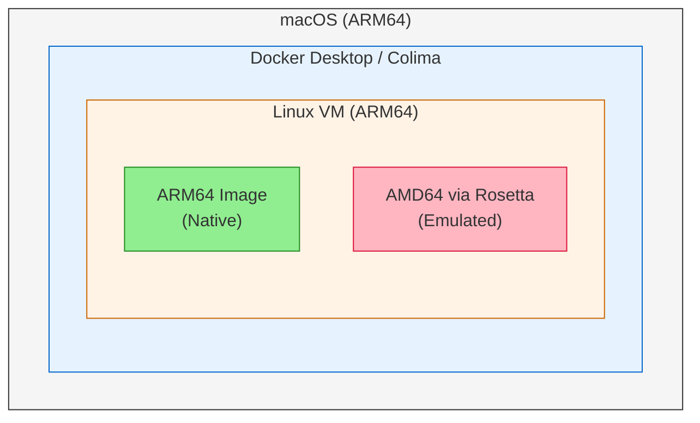

# Running Docker on Apple Silicon: ARM64 Images, Rosetta, and Performance Settings

Author: [nawazdhandala](https://github.com/nawazdhandala)

Tags: Docker, Mac, Apple Silicon, M1, Performance

Description: Configure Docker Desktop for M1/M2/M3/M4 Macs. Covers multi-architecture images, Rosetta emulation for AMD64, VirtioFS volumes, and fixing common ARM64 compatibility issues.

---

Apple Silicon Macs require special consideration when running Docker due to the ARM64 architecture. This guide covers optimal configuration, multi-architecture support, and performance optimization for M1/M2/M3 Macs.

## Architecture Overview



## Installing Docker Desktop

### Download and Install

```bash
# Download from docker.com or use Homebrew
brew install --cask docker

# Start Docker Desktop from Applications
open -a Docker
```

### Verify Installation

```bash
# Check Docker is running
docker version

# Verify architecture
docker info | grep Architecture
# Output: Architecture: aarch64
```

## Performance Optimization

### Resource Allocation

Open Docker Desktop > Settings > Resources:

```
Recommended Settings for Development:
- CPUs: 4-6 (leave 2 for macOS)
- Memory: 8-12 GB (depending on total RAM)
- Swap: 2 GB
- Disk image size: 64+ GB
```

### VirtioFS (Recommended)

```
Docker Desktop > Settings > General
[x] Use Virtualization framework
[x] Use VirtioFS for file sharing
```

VirtioFS provides significantly faster file sharing than gRPC FUSE.

### Resource Saver

```
Settings > Resources > Advanced
[x] Resource Saver
```

Automatically reduces VM resources when idle.

## Multi-Architecture Support

### Check Image Architecture

```bash
# Check available architectures for an image
docker manifest inspect nginx | grep architecture

# Pull specific architecture
docker pull --platform linux/amd64 nginx
docker pull --platform linux/arm64 nginx
```

### Build Multi-Architecture Images

```bash
# Enable buildx
docker buildx create --name multiarch --use

# Build for multiple platforms
docker buildx build \
  --platform linux/amd64,linux/arm64 \
  -t myimage:latest \
  --push .
```

### Dockerfile for Multi-Arch

```dockerfile
# Use multi-arch base image
FROM --platform=$TARGETPLATFORM node:20-alpine

# Platform-specific build steps
ARG TARGETARCH
RUN echo "Building for $TARGETARCH"

WORKDIR /app
COPY . .
RUN npm ci
CMD ["node", "index.js"]
```

## Rosetta 2 Emulation

### Enable Rosetta

```
Docker Desktop > Settings > General
[x] Use Rosetta for x86_64/amd64 emulation on Apple Silicon
```

Rosetta 2 provides faster x86_64 emulation than QEMU.

### Running AMD64 Images

```bash
# Run specific platform
docker run --platform linux/amd64 ubuntu

# Set default platform in Docker Desktop
# Settings > Docker Engine
{
  "default-platform": "linux/amd64"
}
```

## Volume Mount Optimization

### VirtioFS Mount Options

```yaml
# docker-compose.yml
services:
  app:
    volumes:
      - type: bind
        source: ./src
        target: /app/src
        consistency: cached
```

### Selective Syncing

```yaml
services:
  app:
    volumes:
      # Only mount what's needed
      - ./src:/app/src:cached
      # Use named volume for node_modules
      - node_modules:/app/node_modules

volumes:
  node_modules:
```

### Anonymous Volumes for Dependencies

```dockerfile
FROM node:20-alpine
WORKDIR /app
COPY package*.json ./
RUN npm ci

# Anonymous volume prevents host sync for node_modules
VOLUME /app/node_modules

COPY . .
CMD ["npm", "start"]
```

## Common Issues and Solutions

### Slow Volume Performance

```yaml
# Use named volumes for dependencies
services:
  node:
    volumes:
      - .:/app:cached
      - node_modules:/app/node_modules
      - npm_cache:/root/.npm

volumes:
  node_modules:
  npm_cache:
```

### Missing ARM64 Images

```bash
# Error: no matching manifest for linux/arm64/v8

# Solution 1: Use Rosetta
docker run --platform linux/amd64 legacy-image

# Solution 2: Find ARM64 alternative
docker search --filter "is-official=true" image-name
```

### Build Failures on ARM64

```dockerfile
# Some packages don't have ARM64 binaries
# Use platform-specific builds

FROM node:20-alpine

# Install build dependencies for native modules
RUN apk add --no-cache python3 make g++

COPY package*.json ./
RUN npm ci

COPY . .
RUN npm run build
```

### Memory Pressure

```bash
# Check Docker memory usage
docker stats

# Prune unused resources
docker system prune -a --volumes

# Reduce Docker Desktop memory allocation
# Settings > Resources > Memory: 6GB
```

## Development Workflow Optimization

### Use Docker Compose

```yaml
# docker-compose.yml
version: '3.8'

services:
  app:
    build: .
    volumes:
      - .:/app:cached
      - /app/node_modules
    ports:
      - "3000:3000"
    environment:
      - NODE_ENV=development

  db:
    image: postgres:15
    volumes:
      - pgdata:/var/lib/postgresql/data
    environment:
      POSTGRES_PASSWORD: dev

volumes:
  pgdata:
```

### Hot Reload Configuration

```yaml
services:
  frontend:
    build:
      context: ./frontend
    volumes:
      - ./frontend/src:/app/src:cached
    environment:
      - WATCHPACK_POLLING=true  # For webpack
      - CHOKIDAR_USEPOLLING=true  # For create-react-app
    ports:
      - "3000:3000"
```

### Development vs Production

```yaml
# docker-compose.override.yml (development)
services:
  app:
    build:
      target: development
    volumes:
      - .:/app:cached
      - /app/node_modules
    command: npm run dev

# docker-compose.prod.yml
services:
  app:
    build:
      target: production
    image: myapp:${VERSION}
```

## Alternative: Colima

### Install Colima

```bash
# Install Colima (lightweight Docker runtime)
brew install colima docker

# Start with optimized settings for Apple Silicon
colima start \
  --cpu 4 \
  --memory 8 \
  --disk 60 \
  --vm-type vz \
  --vz-rosetta \
  --mount-type virtiofs
```

### Colima Configuration

```yaml
# ~/.colima/default/colima.yaml
cpu: 4
memory: 8
disk: 60
vm:
  type: vz
  rosetta: true
mount:
  type: virtiofs
docker:
  features:
    buildkit: true
```

## Benchmarking on Apple Silicon

### Native ARM64 Performance

```bash
# Benchmark ARM64 image
docker run --platform linux/arm64 --rm \
  severalnines/sysbench sysbench cpu run
```

### Rosetta Emulation Performance

```bash
# Benchmark AMD64 image (emulated)
docker run --platform linux/amd64 --rm \
  severalnines/sysbench sysbench cpu run

# Compare: ARM64 is typically 2-5x faster than emulated AMD64
```

## Production Considerations

### Build for ARM64

```dockerfile
# Specify platform in CI/CD
FROM --platform=linux/arm64 node:20-alpine
```

### Multi-Arch CI/CD

```yaml
# GitHub Actions
- name: Build Multi-Arch
  uses: docker/build-push-action@v5
  with:
    platforms: linux/amd64,linux/arm64
    push: true
    tags: myapp:latest
```

## Summary

| Setting | Recommendation |
|---------|---------------|
| Virtualization | VirtioFS + Virtualization framework |
| Rosetta | Enable for AMD64 compatibility |
| Memory | 8-12GB for development |
| Volumes | Use named volumes for dependencies |
| Images | Prefer ARM64 native images |
| Alternative | Colima with vz + virtiofs |

Apple Silicon Macs run Docker efficiently when properly configured. Use native ARM64 images whenever possible, enable VirtioFS for volume performance, and leverage Rosetta 2 for legacy AMD64 images. For Docker Desktop alternatives, see our post on [Docker Desktop Alternatives](https://oneuptime.com/blog/post/2026-01-16-docker-desktop-alternatives/view).

