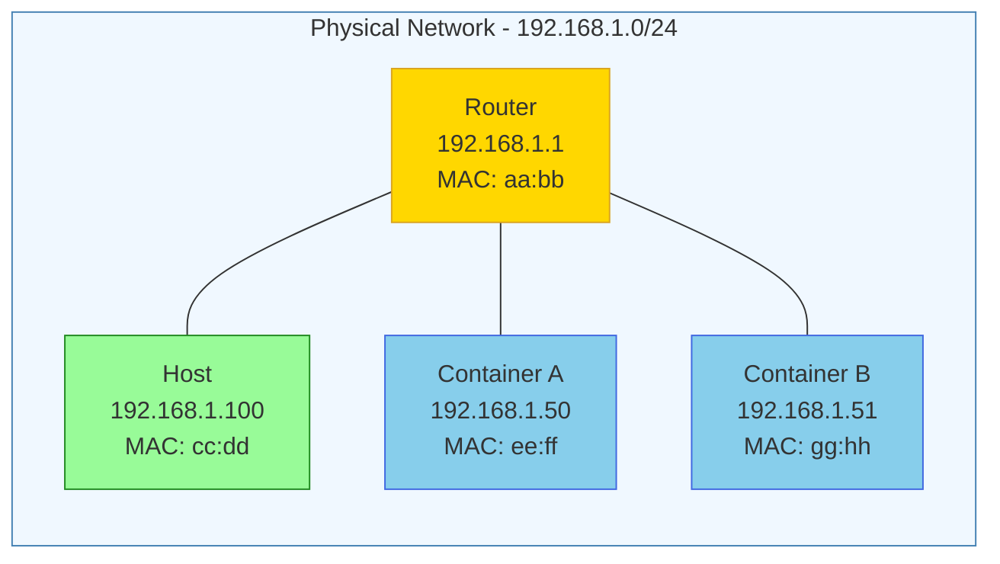

# How to Create Docker Macvlan Networks for Direct LAN Access

Author: [nawazdhandala](https://github.com/nawazdhandala)

Tags: Docker, Macvlan, Networking, LAN, DevOps

Description: Learn how to create Docker macvlan networks for direct LAN access, allowing containers to appear as physical devices on your network.

---

Macvlan networks allow Docker containers to have their own MAC addresses and appear as physical devices on your network. This enables direct LAN communication without port mapping.

## Understanding Macvlan



## Basic Macvlan Network

```bash
# Create macvlan network
docker network create -d macvlan \
  --subnet=192.168.1.0/24 \
  --gateway=192.168.1.1 \
  -o parent=eth0 \
  my-macvlan

# Run container with macvlan
docker run -d \
  --name web \
  --network my-macvlan \
  --ip 192.168.1.50 \
  nginx
```

## Macvlan with VLAN Tagging

```bash
# Create VLAN subinterface (802.1Q)
docker network create -d macvlan \
  --subnet=192.168.100.0/24 \
  --gateway=192.168.100.1 \
  -o parent=eth0.100 \
  vlan100-net

# Container on VLAN 100
docker run -d \
  --name app \
  --network vlan100-net \
  --ip 192.168.100.50 \
  myapp
```

## Docker Compose Configuration

```yaml
version: '3.8'

services:
  web:
    image: nginx:alpine
    networks:
      macvlan_net:
        ipv4_address: 192.168.1.50

  api:
    image: myapi:latest
    networks:
      macvlan_net:
        ipv4_address: 192.168.1.51

networks:
  macvlan_net:
    driver: macvlan
    driver_opts:
      parent: eth0
    ipam:
      config:
        - subnet: 192.168.1.0/24
          gateway: 192.168.1.1
          ip_range: 192.168.1.48/28  # Reserve IPs 48-63 for containers
```

## Host-to-Container Communication

Containers on macvlan networks cannot communicate with the host by default. Create a macvlan interface on the host to enable this.

```bash
# Create macvlan interface on host
sudo ip link add macvlan0 link eth0 type macvlan mode bridge

# Assign IP to macvlan interface
sudo ip addr add 192.168.1.200/32 dev macvlan0
sudo ip link set macvlan0 up

# Add route to container subnet through macvlan interface
sudo ip route add 192.168.1.48/28 dev macvlan0
```

### Persistent Host Configuration

```bash
# /etc/network/interfaces.d/macvlan
auto macvlan0
iface macvlan0 inet manual
    pre-up ip link add macvlan0 link eth0 type macvlan mode bridge
    up ip addr add 192.168.1.200/32 dev macvlan0
    up ip route add 192.168.1.48/28 dev macvlan0
    down ip link del macvlan0
```

## Multiple Macvlan Networks

```yaml
version: '3.8'

services:
  frontend:
    image: nginx:alpine
    networks:
      public_net:
        ipv4_address: 192.168.1.50

  backend:
    image: myapp:latest
    networks:
      public_net:
        ipv4_address: 192.168.1.51
      private_net:
        ipv4_address: 10.0.0.10

  database:
    image: postgres:15
    networks:
      private_net:
        ipv4_address: 10.0.0.20

networks:
  public_net:
    driver: macvlan
    driver_opts:
      parent: eth0
    ipam:
      config:
        - subnet: 192.168.1.0/24
          gateway: 192.168.1.1
          ip_range: 192.168.1.48/28

  private_net:
    driver: macvlan
    driver_opts:
      parent: eth1
    ipam:
      config:
        - subnet: 10.0.0.0/24
          gateway: 10.0.0.1
```

## DHCP with Macvlan

```yaml
version: '3.8'

services:
  app:
    image: myapp:latest
    networks:
      dhcp_net:
        # No IP specified - will use DHCP

networks:
  dhcp_net:
    driver: macvlan
    driver_opts:
      parent: eth0
    ipam:
      driver: null  # Disable Docker IPAM, use network DHCP
```

## Macvlan Modes

```bash
# Bridge mode (default) - containers can communicate with each other
docker network create -d macvlan \
  -o macvlan_mode=bridge \
  --subnet=192.168.1.0/24 \
  -o parent=eth0 \
  bridge-macvlan

# Private mode - containers isolated from each other
docker network create -d macvlan \
  -o macvlan_mode=private \
  --subnet=192.168.1.0/24 \
  -o parent=eth0 \
  private-macvlan

# VEPA mode - traffic goes through external switch
docker network create -d macvlan \
  -o macvlan_mode=vepa \
  --subnet=192.168.1.0/24 \
  -o parent=eth0 \
  vepa-macvlan
```

## Complete Production Setup

```yaml
version: '3.8'

services:
  # Web server accessible directly on LAN
  nginx:
    image: nginx:alpine
    hostname: nginx-server
    networks:
      lan:
        ipv4_address: 192.168.1.50
    volumes:
      - ./nginx.conf:/etc/nginx/nginx.conf:ro
    restart: unless-stopped

  # Application server
  app:
    image: myapp:latest
    hostname: app-server
    networks:
      lan:
        ipv4_address: 192.168.1.51
    environment:
      DATABASE_HOST: 192.168.1.52
    restart: unless-stopped

  # Database with direct LAN access
  postgres:
    image: postgres:15
    hostname: db-server
    networks:
      lan:
        ipv4_address: 192.168.1.52
    environment:
      POSTGRES_PASSWORD: ${DB_PASSWORD}
    volumes:
      - pgdata:/var/lib/postgresql/data
    restart: unless-stopped

networks:
  lan:
    driver: macvlan
    driver_opts:
      parent: eth0
    ipam:
      config:
        - subnet: 192.168.1.0/24
          gateway: 192.168.1.1
          ip_range: 192.168.1.50/29
          aux_addresses:
            host: 192.168.1.200

volumes:
  pgdata:
```

## Troubleshooting

```bash
# Check macvlan network
docker network inspect my-macvlan

# Test connectivity from container
docker exec web ping 192.168.1.1

# Check MAC address
docker exec web cat /sys/class/net/eth0/address

# Verify IP assignment
docker exec web ip addr

# Check ARP table on router/switch
arp -a | grep 192.168.1.50
```

## Summary

| Mode | Container-to-Container | Host-to-Container | External Access |
|------|------------------------|-------------------|-----------------|
| Bridge | Yes | Needs config | Yes |
| Private | No | Needs config | Yes |
| VEPA | Via switch | Needs config | Yes |

Macvlan networks provide direct LAN connectivity without NAT or port mapping. Use them when containers need to appear as regular network devices. For multi-host networking, see our post on [Docker Overlay Networks](https://oneuptime.com/blog/post/2026-01-16-docker-overlay-networks/view).

