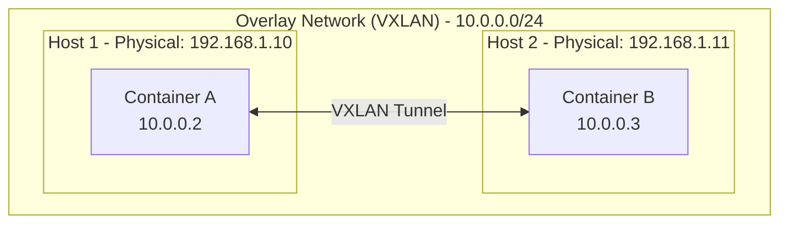

# How to Set Up Docker Overlay Networks for Multi-Host Communication

Author: [nawazdhandala](https://github.com/nawazdhandala)

Tags: Docker, Overlay, Networking, Swarm, Multi-Host

Description: Learn how to set up Docker overlay networks for multi-host container communication in Swarm mode and standalone containers.

---

Overlay networks enable communication between Docker containers across multiple hosts. This guide covers setting up overlay networks in Swarm mode and for standalone containers.

## Understanding Overlay Networks



## Initialize Swarm Mode

```bash
# Initialize swarm on manager node
docker swarm init --advertise-addr 192.168.1.10

# Get join token for workers
docker swarm join-token worker

# Join workers (run on worker nodes)
docker swarm join --token SWMTKN-1-xxx 192.168.1.10:2377
```

## Create Overlay Network

```bash
# Create overlay network in swarm
docker network create \
  --driver overlay \
  --subnet 10.0.0.0/24 \
  --gateway 10.0.0.1 \
  my-overlay

# Create with encryption
docker network create \
  --driver overlay \
  --opt encrypted \
  --subnet 10.0.1.0/24 \
  secure-overlay
```

## Deploy Services

```bash
# Create service on overlay network
docker service create \
  --name web \
  --network my-overlay \
  --replicas 3 \
  nginx

# Create another service
docker service create \
  --name api \
  --network my-overlay \
  --replicas 2 \
  myapi:latest
```

## Docker Compose with Swarm

```yaml
version: '3.8'

services:
  web:
    image: nginx:alpine
    deploy:
      replicas: 3
      placement:
        constraints:
          - node.role == worker
    networks:
      - frontend
      - backend

  api:
    image: myapi:latest
    deploy:
      replicas: 2
    networks:
      - backend

  database:
    image: postgres:15
    deploy:
      replicas: 1
      placement:
        constraints:
          - node.labels.type == database
    networks:
      - backend
    volumes:
      - pgdata:/var/lib/postgresql/data

networks:
  frontend:
    driver: overlay
  backend:
    driver: overlay
    internal: true  # No external access

volumes:
  pgdata:
```

```bash
# Deploy stack
docker stack deploy -c docker-compose.yml myapp
```

## Overlay for Standalone Containers

```bash
# Create attachable overlay network
docker network create \
  --driver overlay \
  --attachable \
  --subnet 10.0.2.0/24 \
  standalone-overlay

# Run standalone container on overlay
docker run -d \
  --name standalone-app \
  --network standalone-overlay \
  myapp:latest
```

## Service Discovery

```yaml
version: '3.8'

services:
  web:
    image: nginx:alpine
    networks:
      - app-net
    # Access api service as 'api' or 'tasks.api' for all replicas

  api:
    image: myapi:latest
    deploy:
      replicas: 3
    networks:
      - app-net
    # DNS: api -> VIP (load balanced)
    # DNS: tasks.api -> all container IPs

networks:
  app-net:
    driver: overlay
```

```bash
# Test service discovery
docker exec <web-container> nslookup api
docker exec <web-container> nslookup tasks.api
```

## Network Segmentation

```yaml
version: '3.8'

services:
  # Public-facing tier
  nginx:
    image: nginx:alpine
    deploy:
      replicas: 2
    networks:
      - public
      - app-internal
    ports:
      - "80:80"

  # Application tier
  api:
    image: myapi:latest
    deploy:
      replicas: 3
    networks:
      - app-internal
      - db-internal

  # Database tier
  postgres:
    image: postgres:15
    deploy:
      replicas: 1
    networks:
      - db-internal

networks:
  public:
    driver: overlay
  app-internal:
    driver: overlay
    internal: true
  db-internal:
    driver: overlay
    internal: true
    driver_opts:
      encrypted: "true"
```

## Custom MTU and Options

```bash
# Create overlay with custom MTU
docker network create \
  --driver overlay \
  --opt com.docker.network.driver.mtu=1400 \
  custom-overlay

# Create with specific VXLAN ID
docker network create \
  --driver overlay \
  --opt com.docker.network.driver.overlay.vxlanid_list=4097 \
  vxlan-overlay
```

## Load Balancing

```yaml
version: '3.8'

services:
  web:
    image: nginx:alpine
    deploy:
      replicas: 5
      endpoint_mode: vip  # Default: Virtual IP load balancing
    networks:
      - frontend
    ports:
      - "80:80"  # Ingress routing mesh

  api:
    image: myapi:latest
    deploy:
      replicas: 3
      endpoint_mode: dnsrr  # DNS round-robin
    networks:
      - backend

networks:
  frontend:
    driver: overlay
  backend:
    driver: overlay
```

## Ingress Network

```bash
# Inspect default ingress network
docker network inspect ingress

# Create custom ingress network
docker network create \
  --driver overlay \
  --ingress \
  --subnet 10.11.0.0/16 \
  --gateway 10.11.0.1 \
  --opt com.docker.network.driver.mtu=1200 \
  custom-ingress
```

## Complete Multi-Host Setup

```yaml
version: '3.8'

services:
  traefik:
    image: traefik:v2.10
    command:
      - "--providers.docker.swarmMode=true"
      - "--entrypoints.web.address=:80"
    deploy:
      placement:
        constraints:
          - node.role == manager
    ports:
      - "80:80"
    volumes:
      - /var/run/docker.sock:/var/run/docker.sock:ro
    networks:
      - public

  frontend:
    image: myfrontend:latest
    deploy:
      replicas: 3
      labels:
        - "traefik.enable=true"
        - "traefik.http.routers.frontend.rule=Host(`app.example.com`)"
        - "traefik.http.services.frontend.loadbalancer.server.port=80"
    networks:
      - public
      - internal

  backend:
    image: mybackend:latest
    deploy:
      replicas: 3
    networks:
      - internal
      - database

  postgres:
    image: postgres:15
    deploy:
      replicas: 1
    environment:
      POSTGRES_PASSWORD_FILE: /run/secrets/db_password
    secrets:
      - db_password
    networks:
      - database
    volumes:
      - pgdata:/var/lib/postgresql/data

  redis:
    image: redis:7-alpine
    deploy:
      replicas: 1
    networks:
      - internal

networks:
  public:
    driver: overlay
  internal:
    driver: overlay
    internal: true
  database:
    driver: overlay
    internal: true
    driver_opts:
      encrypted: "true"

volumes:
  pgdata:

secrets:
  db_password:
    external: true
```

## Troubleshooting

```bash
# Check overlay network
docker network inspect my-overlay

# List services on network
docker network inspect my-overlay --format '{{range .Containers}}{{.Name}} {{end}}'

# Check service connectivity
docker service logs web

# Test DNS resolution
docker exec <container> nslookup api

# Check VXLAN interface
ip -d link show | grep vxlan

# Debug network namespace
docker run --rm --net container:<container-id> nicolaka/netshoot tcpdump -i eth0
```

## Summary

| Feature | Overlay | Macvlan |
|---------|---------|---------|
| Multi-host | Yes | No |
| Encryption | Optional | No |
| Service Discovery | Built-in | No |
| Load Balancing | Built-in | No |
| External LAN access | Via ingress | Direct |

Overlay networks are essential for multi-host Docker deployments. They provide built-in service discovery, load balancing, and optional encryption. For direct LAN access, see our post on [Docker Macvlan Networks](https://oneuptime.com/blog/post/2026-01-16-docker-macvlan-networks/view).

