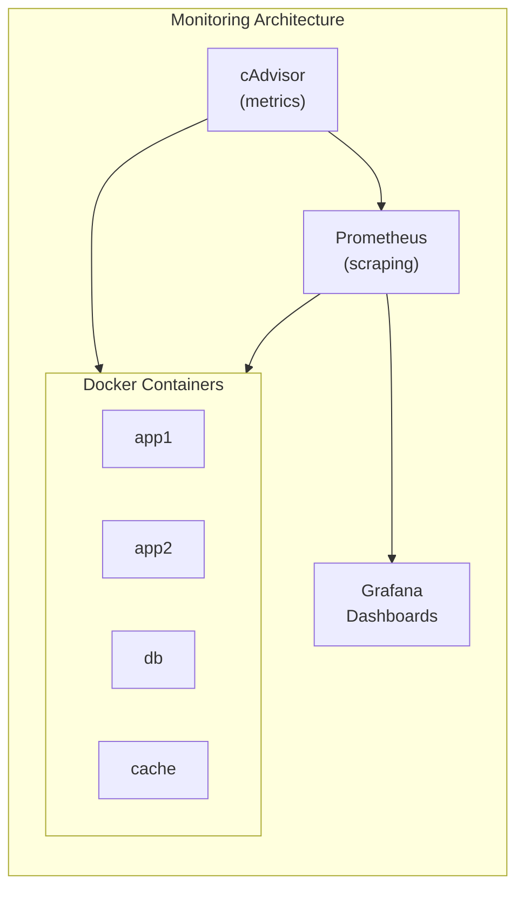

# How to Set Up Prometheus and Grafana for Docker Monitoring

Author: [nawazdhandala](https://github.com/nawazdhandala)

Tags: Docker, Prometheus, Grafana, Monitoring, Observability

Description: Learn how to set up Prometheus and Grafana for monitoring Docker containers, including cAdvisor integration, custom dashboards, and alerting.

---

Prometheus and Grafana provide a powerful monitoring stack for Docker environments. This guide covers setting up complete container monitoring with metrics collection, visualization, and alerting.

## Architecture Overview



## Basic Setup

### Docker Compose Stack

```yaml
version: '3.8'

services:
  prometheus:
    image: prom/prometheus:v2.47.0
    volumes:
      - ./prometheus.yml:/etc/prometheus/prometheus.yml
      - prometheus_data:/prometheus
    command:
      - '--config.file=/etc/prometheus/prometheus.yml'
      - '--storage.tsdb.path=/prometheus'
      - '--web.enable-lifecycle'
    ports:
      - "9090:9090"

  grafana:
    image: grafana/grafana:10.2.0
    volumes:
      - grafana_data:/var/lib/grafana
    environment:
      - GF_SECURITY_ADMIN_PASSWORD=${GRAFANA_PASSWORD}
    ports:
      - "3000:3000"
    depends_on:
      - prometheus

  cadvisor:
    image: gcr.io/cadvisor/cadvisor:v0.47.2
    volumes:
      - /:/rootfs:ro
      - /var/run:/var/run:ro
      - /sys:/sys:ro
      - /var/lib/docker/:/var/lib/docker:ro
    ports:
      - "8080:8080"

  node-exporter:
    image: prom/node-exporter:v1.6.1
    volumes:
      - /proc:/host/proc:ro
      - /sys:/host/sys:ro
      - /:/rootfs:ro
    command:
      - '--path.procfs=/host/proc'
      - '--path.sysfs=/host/sys'
      - '--collector.filesystem.mount-points-exclude=^/(sys|proc|dev|host|etc)($$|/)'

volumes:
  prometheus_data:
  grafana_data:
```

### Prometheus Configuration

```yaml
# prometheus.yml
global:
  scrape_interval: 15s
  evaluation_interval: 15s

scrape_configs:
  - job_name: 'prometheus'
    static_configs:
      - targets: ['localhost:9090']

  - job_name: 'cadvisor'
    static_configs:
      - targets: ['cadvisor:8080']

  - job_name: 'node-exporter'
    static_configs:
      - targets: ['node-exporter:9100']

  - job_name: 'docker'
    static_configs:
      - targets: ['host.docker.internal:9323']
```

## Docker Daemon Metrics

### Enable Docker Metrics

```json
// /etc/docker/daemon.json
{
  "metrics-addr": "0.0.0.0:9323",
  "experimental": true
}
```

```yaml
# prometheus.yml
scrape_configs:
  - job_name: 'docker'
    static_configs:
      - targets: ['host.docker.internal:9323']
```

## Alerting Rules

### Prometheus Alerts

```yaml
# alerts.yml
groups:
  - name: docker
    rules:
      - alert: ContainerDown
        expr: absent(container_last_seen{name=~".+"}) == 1
        for: 1m
        labels:
          severity: critical
        annotations:
          summary: "Container down"

      - alert: HighCPUUsage
        expr: rate(container_cpu_usage_seconds_total[5m]) * 100 > 80
        for: 5m
        labels:
          severity: warning
        annotations:
          summary: "High CPU usage on {{ $labels.name }}"

      - alert: HighMemoryUsage
        expr: container_memory_usage_bytes / container_spec_memory_limit_bytes * 100 > 80
        for: 5m
        labels:
          severity: warning
        annotations:
          summary: "High memory usage on {{ $labels.name }}"
```

### Alertmanager

```yaml
services:
  alertmanager:
    image: prom/alertmanager:v0.26.0
    volumes:
      - ./alertmanager.yml:/etc/alertmanager/alertmanager.yml
    ports:
      - "9093:9093"
```

```yaml
# alertmanager.yml
route:
  receiver: 'slack'
  group_wait: 30s

receivers:
  - name: 'slack'
    slack_configs:
      - api_url: '${SLACK_WEBHOOK_URL}'
        channel: '#alerts'
```

## Grafana Dashboards

### Dashboard Provisioning

```yaml
services:
  grafana:
    volumes:
      - ./grafana/provisioning:/etc/grafana/provisioning
      - ./grafana/dashboards:/var/lib/grafana/dashboards
```

```yaml
# grafana/provisioning/datasources/datasources.yml
apiVersion: 1
datasources:
  - name: Prometheus
    type: prometheus
    access: proxy
    url: http://prometheus:9090
    isDefault: true
```

```yaml
# grafana/provisioning/dashboards/dashboards.yml
apiVersion: 1
providers:
  - name: 'default'
    folder: ''
    type: file
    options:
      path: /var/lib/grafana/dashboards
```

## Complete Production Setup

```yaml
version: '3.8'

services:
  prometheus:
    image: prom/prometheus:v2.47.0
    restart: unless-stopped
    volumes:
      - ./prometheus/prometheus.yml:/etc/prometheus/prometheus.yml
      - ./prometheus/alerts.yml:/etc/prometheus/alerts.yml
      - prometheus_data:/prometheus
    command:
      - '--config.file=/etc/prometheus/prometheus.yml'
      - '--storage.tsdb.path=/prometheus'
      - '--storage.tsdb.retention.time=15d'
      - '--web.enable-lifecycle'
    ports:
      - "9090:9090"
    networks:
      - monitoring

  grafana:
    image: grafana/grafana:10.2.0
    restart: unless-stopped
    volumes:
      - grafana_data:/var/lib/grafana
      - ./grafana/provisioning:/etc/grafana/provisioning
    environment:
      - GF_SECURITY_ADMIN_PASSWORD=${GRAFANA_PASSWORD}
      - GF_INSTALL_PLUGINS=grafana-piechart-panel
    ports:
      - "3000:3000"
    depends_on:
      - prometheus
    networks:
      - monitoring

  cadvisor:
    image: gcr.io/cadvisor/cadvisor:v0.47.2
    restart: unless-stopped
    privileged: true
    volumes:
      - /:/rootfs:ro
      - /var/run:/var/run:ro
      - /sys:/sys:ro
      - /var/lib/docker/:/var/lib/docker:ro
    networks:
      - monitoring

  node-exporter:
    image: prom/node-exporter:v1.6.1
    restart: unless-stopped
    volumes:
      - /proc:/host/proc:ro
      - /sys:/host/sys:ro
      - /:/rootfs:ro
    command:
      - '--path.procfs=/host/proc'
      - '--path.sysfs=/host/sys'
    networks:
      - monitoring

  alertmanager:
    image: prom/alertmanager:v0.26.0
    restart: unless-stopped
    volumes:
      - ./alertmanager/alertmanager.yml:/etc/alertmanager/alertmanager.yml
    ports:
      - "9093:9093"
    networks:
      - monitoring

networks:
  monitoring:

volumes:
  prometheus_data:
  grafana_data:
```

## Key Metrics

| Metric | Description |
|--------|-------------|
| container_cpu_usage_seconds_total | CPU usage |
| container_memory_usage_bytes | Memory usage |
| container_network_receive_bytes_total | Network in |
| container_network_transmit_bytes_total | Network out |
| container_fs_usage_bytes | Disk usage |

Prometheus and Grafana provide comprehensive Docker monitoring. Use cAdvisor for container metrics, node-exporter for host metrics, and Alertmanager for notifications. For log aggregation, see our post on [Docker Logging Drivers](https://oneuptime.com/blog/post/2026-01-16-docker-logging-drivers/view).

