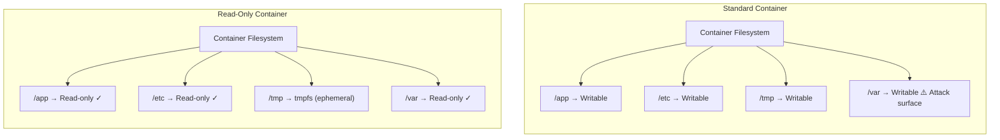

# How to Run Read-Only Docker Containers

Author: [nawazdhandala](https://github.com/nawazdhandala)

Tags: Docker, Security, Hardening, Immutable, Containers

Description: Learn how to run Docker containers with read-only root filesystems for improved security, handle writable directories with tmpfs, and troubleshoot common issues.

---

Running containers with read-only root filesystems prevents malicious code from modifying the container's filesystem, making it much harder for attackers to persist changes, install malware, or modify application binaries.

## Why Read-Only Containers?



## Basic Read-Only Container

### Command Line

```bash
# Run with read-only filesystem
docker run --read-only nginx

# This will likely fail because nginx needs to write
# Add tmpfs mounts for writable directories
docker run --read-only \
  --tmpfs /var/cache/nginx \
  --tmpfs /var/run \
  nginx
```

### Docker Compose

```yaml
services:
  app:
    image: myapp
    read_only: true
    tmpfs:
      - /tmp
```

## Handling Writable Directories

### Using tmpfs Mounts

tmpfs mounts store data in memory and are perfect for temporary files.

```yaml
services:
  nginx:
    image: nginx
    read_only: true
    tmpfs:
      - /var/cache/nginx:size=100M,mode=1777
      - /var/run:size=10M,mode=755
      - /tmp:size=50M,mode=1777
```

### tmpfs Options

```yaml
tmpfs:
  # With size limit and permissions
  - /tmp:size=100M,mode=1777

  # With uid/gid
  - /var/run:size=10M,uid=1000,gid=1000,mode=755
```

### Using Named Volumes for Persistent Data

```yaml
services:
  postgres:
    image: postgres:15
    read_only: true
    tmpfs:
      - /tmp
      - /run/postgresql
    volumes:
      - pgdata:/var/lib/postgresql/data

volumes:
  pgdata:
```

## Common Applications

### Nginx

```yaml
services:
  nginx:
    image: nginx:alpine
    read_only: true
    tmpfs:
      - /var/cache/nginx:size=100M
      - /var/run:size=10M
    volumes:
      - ./nginx.conf:/etc/nginx/nginx.conf:ro
      - ./html:/usr/share/nginx/html:ro
    ports:
      - "80:80"
```

### Node.js Application

```yaml
services:
  node-app:
    image: node:20-alpine
    read_only: true
    tmpfs:
      - /tmp:size=100M
    volumes:
      - ./app:/app:ro
    working_dir: /app
    command: node server.js
```

### Python Flask/Django

```yaml
services:
  python-app:
    image: python:3.11-slim
    read_only: true
    tmpfs:
      - /tmp:size=100M
      - /root/.cache:size=50M
    volumes:
      - ./app:/app:ro
    working_dir: /app
    command: gunicorn app:app
```

### PostgreSQL

```yaml
services:
  postgres:
    image: postgres:15
    read_only: true
    tmpfs:
      - /tmp
      - /run/postgresql:uid=999,gid=999
    volumes:
      - pgdata:/var/lib/postgresql/data
    environment:
      POSTGRES_PASSWORD: secret
```

### Redis

```yaml
services:
  redis:
    image: redis:7-alpine
    read_only: true
    tmpfs:
      - /tmp
    volumes:
      - redis-data:/data
    command: redis-server --appendonly yes
```

### Java Application

```yaml
services:
  java-app:
    image: openjdk:21-slim
    read_only: true
    tmpfs:
      - /tmp:size=200M
    volumes:
      - ./app.jar:/app/app.jar:ro
    command: java -jar /app/app.jar
```

## Identifying Required Writable Directories

### Method 1: Run and Check Errors

```bash
# Start container read-only
docker run --read-only myapp

# Check logs for write errors
# "Read-only file system" errors indicate needed tmpfs mounts
```

### Method 2: Use strace

```bash
# Run with strace to see write operations
docker run --cap-add=SYS_PTRACE myapp strace -f -e trace=write,open,openat ...
```

### Method 3: Inspect Dockerfile

```dockerfile
# Look for directories applications write to:
WORKDIR /app          # Probably read-only
RUN mkdir /var/log/app  # Needs tmpfs or volume
VOLUME /data          # Needs volume
```

### Method 4: Check with inotifywait

```bash
# Monitor filesystem writes
docker run -it myapp sh -c 'apk add inotify-tools && inotifywait -r -m /'
```

## Troubleshooting

### Common Error Messages

```bash
# "Read-only file system" - directory needs tmpfs
nginx: [emerg] mkdir() "/var/cache/nginx/client_temp" failed (30: Read-only file system)
# Solution: --tmpfs /var/cache/nginx

# PID file write failure
can't create /run/nginx.pid: Read-only file system
# Solution: --tmpfs /run
```

### Application-Specific Solutions

```yaml
# Nginx
tmpfs:
  - /var/cache/nginx
  - /var/run

# PostgreSQL
tmpfs:
  - /run/postgresql
  - /tmp

# Redis
tmpfs:
  - /tmp

# Python pip cache
tmpfs:
  - /root/.cache

# Node.js
tmpfs:
  - /tmp
  - /home/node/.npm
```

## Security Enhancements

### Combine with Other Security Options

```yaml
services:
  secure-app:
    image: myapp
    read_only: true
    tmpfs:
      - /tmp:size=100M,mode=1777
    cap_drop:
      - ALL
    security_opt:
      - no-new-privileges:true
    user: "1000:1000"
```

### Complete Hardened Configuration

```yaml
version: '3.8'

services:
  app:
    image: myapp:latest
    read_only: true
    tmpfs:
      - /tmp:size=100M,mode=1777,noexec,nosuid
    cap_drop:
      - ALL
    cap_add:
      - NET_BIND_SERVICE
    security_opt:
      - no-new-privileges:true
      - seccomp:default
    user: "65534:65534"
    deploy:
      resources:
        limits:
          memory: 512M
          cpus: '0.5'
    healthcheck:
      test: ["CMD", "curl", "-f", "http://localhost/health"]
      interval: 30s
      timeout: 5s
      retries: 3
```

### tmpfs Security Options

```yaml
tmpfs:
  # noexec: Prevent execution of binaries
  - /tmp:size=100M,noexec

  # nosuid: Ignore setuid bits
  - /tmp:size=100M,nosuid

  # nodev: Don't interpret character/block devices
  - /tmp:size=100M,nodev

  # Combined
  - /tmp:size=100M,mode=1777,noexec,nosuid,nodev
```

## Kubernetes Integration

### Pod Security Context

```yaml
apiVersion: v1
kind: Pod
metadata:
  name: secure-pod
spec:
  containers:
    - name: app
      image: myapp
      securityContext:
        readOnlyRootFilesystem: true
      volumeMounts:
        - name: tmp
          mountPath: /tmp
  volumes:
    - name: tmp
      emptyDir:
        medium: Memory
        sizeLimit: 100Mi
```

### Pod Security Standards

```yaml
apiVersion: v1
kind: Namespace
metadata:
  name: secure-namespace
  labels:
    pod-security.kubernetes.io/enforce: restricted
```

## Production Example

```yaml
version: '3.8'

x-security-defaults: &security-defaults
  read_only: true
  cap_drop:
    - ALL
  security_opt:
    - no-new-privileges:true

services:
  nginx:
    image: nginx:alpine
    <<: *security-defaults
    cap_add:
      - NET_BIND_SERVICE
    tmpfs:
      - /var/cache/nginx:size=100M
      - /var/run:size=10M
    volumes:
      - ./nginx.conf:/etc/nginx/nginx.conf:ro
      - ./html:/usr/share/nginx/html:ro
    ports:
      - "80:80"
      - "443:443"

  api:
    image: myapi:latest
    <<: *security-defaults
    tmpfs:
      - /tmp:size=50M,noexec
    user: "1000:1000"

  postgres:
    image: postgres:15
    <<: *security-defaults
    cap_add:
      - CHOWN
      - FOWNER
      - SETGID
      - SETUID
    tmpfs:
      - /tmp
      - /run/postgresql:uid=999,gid=999
    volumes:
      - pgdata:/var/lib/postgresql/data

  redis:
    image: redis:7-alpine
    <<: *security-defaults
    tmpfs:
      - /tmp
    volumes:
      - redis-data:/data
    command: redis-server --appendonly yes

volumes:
  pgdata:
  redis-data:
```

## Verifying Read-Only Status

```bash
# Check if container is read-only
docker inspect --format='{{.HostConfig.ReadonlyRootfs}}' container_name

# Test write access
docker exec container_name touch /test-write
# Should fail with "Read-only file system"

# Check mounted tmpfs
docker exec container_name mount | grep tmpfs
```

## Summary

| Application | Required tmpfs Directories |
|-------------|---------------------------|
| Nginx | /var/cache/nginx, /var/run |
| PostgreSQL | /run/postgresql, /tmp |
| Redis | /tmp |
| Node.js | /tmp, /home/node/.npm |
| Python | /tmp, /root/.cache |
| Java | /tmp |
| Generic | /tmp |

Read-only containers significantly improve security by preventing filesystem modifications. Combine with dropped capabilities, non-root users, and resource limits for comprehensive container hardening. For more on dropping capabilities, see our post on [Dropping Linux Capabilities in Docker Containers](https://oneuptime.com/blog/post/2026-01-16-docker-drop-capabilities/view).

