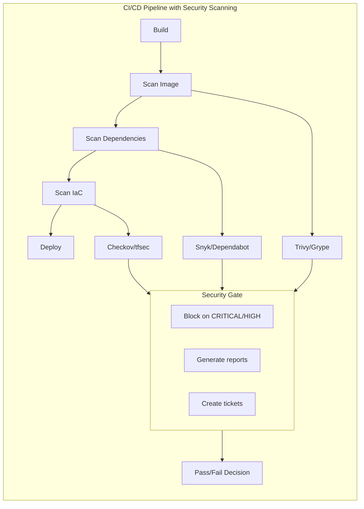

# How to Implement Docker Security Scanning in CI/CD

Author: [nawazdhandala](https://github.com/nawazdhandala)

Tags: Docker, Security, CI/CD, Scanning, DevSecOps

Description: Learn how to implement automated Docker security scanning in CI/CD pipelines using Trivy, Snyk, and other tools to catch vulnerabilities before deployment.

---

Integrating security scanning into CI/CD pipelines catches vulnerabilities early, before they reach production. This guide covers implementing automated container security scanning with various tools and platforms.

## Security Scanning Overview



## Trivy Integration

### GitHub Actions with Trivy

```yaml
name: Container Security Scan

on:
  push:
    branches: [main]
  pull_request:

jobs:
  scan:
    runs-on: ubuntu-latest
    steps:
      - uses: actions/checkout@v4

      - name: Build Image
        run: docker build -t myapp:${{ github.sha }} .

      - name: Run Trivy Vulnerability Scanner
        uses: aquasecurity/trivy-action@master
        with:
          image-ref: 'myapp:${{ github.sha }}'
          format: 'sarif'
          output: 'trivy-results.sarif'
          severity: 'CRITICAL,HIGH'

      - name: Upload Trivy Scan Results
        uses: github/codeql-action/upload-sarif@v3
        with:
          sarif_file: 'trivy-results.sarif'
```

### Trivy with Exit Code

```yaml
name: Security Gate

on: push

jobs:
  scan:
    runs-on: ubuntu-latest
    steps:
      - uses: actions/checkout@v4

      - name: Build Image
        run: docker build -t myapp:${{ github.sha }} .

      - name: Scan for Critical Vulnerabilities
        uses: aquasecurity/trivy-action@master
        with:
          image-ref: 'myapp:${{ github.sha }}'
          exit-code: '1'
          severity: 'CRITICAL'
          ignore-unfixed: true

      - name: Scan for High Vulnerabilities (Warning)
        uses: aquasecurity/trivy-action@master
        with:
          image-ref: 'myapp:${{ github.sha }}'
          exit-code: '0'
          severity: 'HIGH'
```

### GitLab CI with Trivy

```yaml
# .gitlab-ci.yml
stages:
  - build
  - scan
  - deploy

build:
  stage: build
  image: docker:latest
  services:
    - docker:dind
  script:
    - docker build -t $CI_REGISTRY_IMAGE:$CI_COMMIT_SHA .
    - docker push $CI_REGISTRY_IMAGE:$CI_COMMIT_SHA

trivy-scan:
  stage: scan
  image:
    name: aquasec/trivy:latest
    entrypoint: [""]
  variables:
    TRIVY_USERNAME: $CI_REGISTRY_USER
    TRIVY_PASSWORD: $CI_REGISTRY_PASSWORD
  script:
    - trivy image
        --exit-code 0
        --severity HIGH
        --format template
        --template "@/contrib/gitlab.tpl"
        --output gl-container-scanning-report.json
        $CI_REGISTRY_IMAGE:$CI_COMMIT_SHA
    - trivy image
        --exit-code 1
        --severity CRITICAL
        $CI_REGISTRY_IMAGE:$CI_COMMIT_SHA
  artifacts:
    reports:
      container_scanning: gl-container-scanning-report.json
  allow_failure: false
```

### Jenkins with Trivy

```groovy
pipeline {
    agent any

    environment {
        IMAGE_NAME = 'myapp'
        IMAGE_TAG = "${BUILD_NUMBER}"
    }

    stages {
        stage('Build') {
            steps {
                sh "docker build -t ${IMAGE_NAME}:${IMAGE_TAG} ."
            }
        }

        stage('Security Scan') {
            steps {
                sh """
                    docker run --rm \
                        -v /var/run/docker.sock:/var/run/docker.sock \
                        -v trivy-cache:/root/.cache/ \
                        aquasec/trivy image \
                        --exit-code 1 \
                        --severity CRITICAL,HIGH \
                        --ignore-unfixed \
                        ${IMAGE_NAME}:${IMAGE_TAG}
                """
            }
        }

        stage('Generate Report') {
            steps {
                sh """
                    docker run --rm \
                        -v /var/run/docker.sock:/var/run/docker.sock \
                        -v ${WORKSPACE}:/output \
                        aquasec/trivy image \
                        --format json \
                        --output /output/trivy-report.json \
                        ${IMAGE_NAME}:${IMAGE_TAG}
                """
                archiveArtifacts artifacts: 'trivy-report.json'
            }
        }
    }

    post {
        always {
            sh "docker rmi ${IMAGE_NAME}:${IMAGE_TAG} || true"
        }
    }
}
```

## Snyk Integration

### GitHub Actions with Snyk

```yaml
name: Snyk Container Scan

on:
  push:
    branches: [main]
  pull_request:

jobs:
  snyk:
    runs-on: ubuntu-latest
    steps:
      - uses: actions/checkout@v4

      - name: Build Image
        run: docker build -t myapp .

      - name: Run Snyk to check for vulnerabilities
        uses: snyk/actions/docker@master
        env:
          SNYK_TOKEN: ${{ secrets.SNYK_TOKEN }}
        with:
          image: myapp
          args: --severity-threshold=high

      - name: Upload Snyk Report
        uses: github/codeql-action/upload-sarif@v3
        if: always()
        with:
          sarif_file: snyk.sarif
```

### Snyk with Dockerfile Scanning

```yaml
name: Snyk Full Scan

on: push

jobs:
  scan:
    runs-on: ubuntu-latest
    steps:
      - uses: actions/checkout@v4

      # Scan Dockerfile for misconfigurations
      - name: Snyk IaC Scan
        uses: snyk/actions/iac@master
        env:
          SNYK_TOKEN: ${{ secrets.SNYK_TOKEN }}
        with:
          file: Dockerfile

      # Build and scan image
      - name: Build Image
        run: docker build -t myapp .

      - name: Snyk Container Scan
        uses: snyk/actions/docker@master
        env:
          SNYK_TOKEN: ${{ secrets.SNYK_TOKEN }}
        with:
          image: myapp
          args: --file=Dockerfile
```

## Grype Integration

### GitHub Actions with Grype

```yaml
name: Grype Vulnerability Scan

on: push

jobs:
  scan:
    runs-on: ubuntu-latest
    steps:
      - uses: actions/checkout@v4

      - name: Build Image
        run: docker build -t myapp .

      - name: Scan with Grype
        uses: anchore/scan-action@v3
        id: scan
        with:
          image: myapp
          fail-build: true
          severity-cutoff: high

      - name: Upload SARIF Report
        uses: github/codeql-action/upload-sarif@v3
        with:
          sarif_file: ${{ steps.scan.outputs.sarif }}
```

### Generate SBOM with Syft

```yaml
name: SBOM Generation

on: push

jobs:
  sbom:
    runs-on: ubuntu-latest
    steps:
      - uses: actions/checkout@v4

      - name: Build Image
        run: docker build -t myapp .

      - name: Generate SBOM
        uses: anchore/sbom-action@v0
        with:
          image: myapp
          format: spdx-json
          output-file: sbom.spdx.json

      - name: Upload SBOM
        uses: actions/upload-artifact@v4
        with:
          name: sbom
          path: sbom.spdx.json

      - name: Scan SBOM with Grype
        uses: anchore/scan-action@v3
        with:
          sbom: sbom.spdx.json
          fail-build: true
          severity-cutoff: critical
```

## Multi-Tool Pipeline

### Comprehensive Security Pipeline

```yaml
name: Full Security Pipeline

on:
  push:
    branches: [main]
  pull_request:

jobs:
  build:
    runs-on: ubuntu-latest
    outputs:
      image: ${{ steps.build.outputs.image }}
    steps:
      - uses: actions/checkout@v4

      - name: Build Image
        id: build
        run: |
          docker build -t myapp:${{ github.sha }} .
          echo "image=myapp:${{ github.sha }}" >> $GITHUB_OUTPUT

  dockerfile-lint:
    runs-on: ubuntu-latest
    steps:
      - uses: actions/checkout@v4

      - name: Hadolint
        uses: hadolint/hadolint-action@v3.1.0
        with:
          dockerfile: Dockerfile

  secrets-scan:
    runs-on: ubuntu-latest
    steps:
      - uses: actions/checkout@v4

      - name: Scan for Secrets
        uses: trufflesecurity/trufflehog@main
        with:
          path: ./
          base: ${{ github.event.repository.default_branch }}
          head: HEAD

  vulnerability-scan:
    needs: build
    runs-on: ubuntu-latest
    strategy:
      matrix:
        scanner: [trivy, grype]
    steps:
      - uses: actions/checkout@v4

      - name: Load Image
        run: docker build -t ${{ needs.build.outputs.image }} .

      - name: Trivy Scan
        if: matrix.scanner == 'trivy'
        uses: aquasecurity/trivy-action@master
        with:
          image-ref: ${{ needs.build.outputs.image }}
          exit-code: '1'
          severity: 'CRITICAL,HIGH'

      - name: Grype Scan
        if: matrix.scanner == 'grype'
        uses: anchore/scan-action@v3
        with:
          image: ${{ needs.build.outputs.image }}
          fail-build: true
          severity-cutoff: high

  deploy:
    needs: [dockerfile-lint, secrets-scan, vulnerability-scan]
    runs-on: ubuntu-latest
    if: github.ref == 'refs/heads/main'
    steps:
      - name: Deploy
        run: echo "Deploying secure image"
```

## Custom Scanning Policies

### Trivy Configuration

```yaml
# .trivy.yaml
severity:
  - CRITICAL
  - HIGH

vulnerability:
  ignore-unfixed: true

secret:
  config: trivy-secret.yaml

misconfiguration:
  config-data:
    DS002:
      severity: HIGH
```

### Ignore File

```yaml
# .trivyignore.yaml
vulnerabilities:
  - id: CVE-2023-12345
    statement: "Not exploitable in our configuration"
    expires: 2024-12-31

  - id: CVE-2023-67890
    statement: "Vendor patch pending"
    paths:
      - /usr/lib/libvuln.so
```

## Reporting and Notifications

### Slack Notification on Vulnerabilities

```yaml
name: Security Scan with Notifications

on: push

jobs:
  scan:
    runs-on: ubuntu-latest
    steps:
      - uses: actions/checkout@v4

      - name: Build and Scan
        id: scan
        run: |
          docker build -t myapp .
          docker run --rm \
            -v /var/run/docker.sock:/var/run/docker.sock \
            aquasec/trivy image \
            --format json \
            --output trivy-report.json \
            myapp

          CRITICAL=$(jq '[.Results[].Vulnerabilities[]? | select(.Severity=="CRITICAL")] | length' trivy-report.json)
          HIGH=$(jq '[.Results[].Vulnerabilities[]? | select(.Severity=="HIGH")] | length' trivy-report.json)

          echo "critical=$CRITICAL" >> $GITHUB_OUTPUT
          echo "high=$HIGH" >> $GITHUB_OUTPUT

      - name: Notify Slack
        if: steps.scan.outputs.critical > 0 || steps.scan.outputs.high > 0
        uses: slackapi/slack-github-action@v1.24.0
        with:
          payload: |
            {
              "text": "Security Scan Alert",
              "blocks": [
                {
                  "type": "section",
                  "text": {
                    "type": "mrkdwn",
                    "text": "*Security Vulnerabilities Found*\n• Critical: ${{ steps.scan.outputs.critical }}\n• High: ${{ steps.scan.outputs.high }}"
                  }
                }
              ]
            }
        env:
          SLACK_WEBHOOK_URL: ${{ secrets.SLACK_WEBHOOK }}
```

### Generate HTML Report

```yaml
- name: Generate HTML Report
  run: |
    docker run --rm \
      -v /var/run/docker.sock:/var/run/docker.sock \
      -v ${PWD}:/output \
      aquasec/trivy image \
      --format template \
      --template "@contrib/html.tpl" \
      --output /output/report.html \
      myapp

- name: Upload Report
  uses: actions/upload-artifact@v4
  with:
    name: security-report
    path: report.html
```

## Registry Scanning

### Scan Images in Registry

```yaml
name: Registry Scan

on:
  schedule:
    - cron: '0 6 * * *'  # Daily at 6 AM

jobs:
  scan-registry:
    runs-on: ubuntu-latest
    strategy:
      matrix:
        image:
          - myregistry/app1:latest
          - myregistry/app2:latest
          - myregistry/app3:latest
    steps:
      - name: Login to Registry
        uses: docker/login-action@v3
        with:
          registry: myregistry
          username: ${{ secrets.REGISTRY_USER }}
          password: ${{ secrets.REGISTRY_PASSWORD }}

      - name: Scan Image
        uses: aquasecurity/trivy-action@master
        with:
          image-ref: ${{ matrix.image }}
          format: 'sarif'
          output: 'trivy-${{ matrix.image }}.sarif'

      - name: Create Issue on Critical
        if: failure()
        uses: actions/github-script@v7
        with:
          script: |
            github.rest.issues.create({
              owner: context.repo.owner,
              repo: context.repo.repo,
              title: 'Critical vulnerability in ${{ matrix.image }}',
              body: 'A critical vulnerability was found. Check the scan results.'
            })
```

## Summary

| Tool | Best For | Exit Codes | SARIF Support |
|------|----------|------------|---------------|
| Trivy | Comprehensive scanning | Yes | Yes |
| Grype | Fast scanning | Yes | Yes |
| Snyk | Enterprise features | Yes | Yes |
| Clair | Registry integration | No | No |
| Anchore | Policy enforcement | Yes | Yes |

Implement security scanning early in your CI/CD pipeline to catch vulnerabilities before they reach production. Use multiple tools for comprehensive coverage, configure appropriate severity thresholds, and set up notifications for critical findings. For more on vulnerability scanning, see our detailed post on [Scanning Docker Images with Trivy](https://oneuptime.com/blog/post/2026-01-15-docker-trivy-vulnerability-scan/view).

