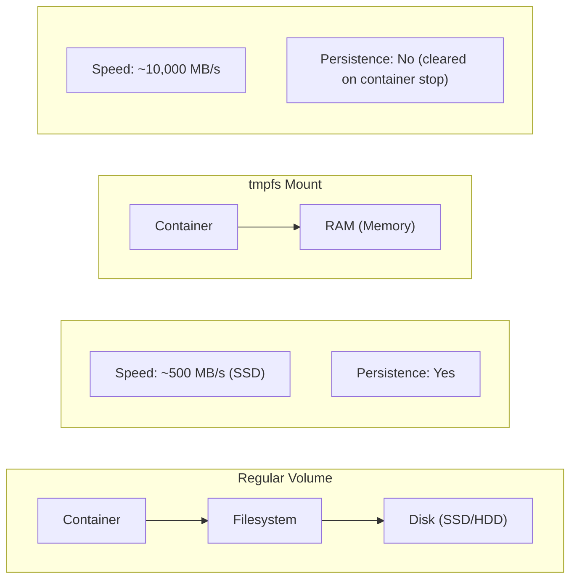

# How to Use Docker tmpfs Mounts for Faster I/O

Author: [nawazdhandala](https://github.com/nawazdhandala)

Tags: Docker, Performance, tmpfs, Memory, Optimization

Description: Learn how to use Docker tmpfs mounts to store data in memory for faster I/O, reduce disk wear, and improve application performance for temporary data.

---

tmpfs mounts store data in memory instead of disk, providing extremely fast I/O for temporary data. This guide covers when and how to use tmpfs mounts effectively in Docker containers.

## Understanding tmpfs



## Basic tmpfs Usage

### Command Line

```bash
# Simple tmpfs mount
docker run --tmpfs /tmp nginx

# With options
docker run --tmpfs /tmp:size=100M,mode=1777 nginx

# Multiple tmpfs mounts
docker run \
  --tmpfs /tmp:size=100M \
  --tmpfs /var/cache:size=200M \
  nginx
```

### Docker Compose

```yaml
services:
  app:
    image: myapp
    tmpfs:
      - /tmp
      - /var/cache
```

### With Options

```yaml
services:
  app:
    image: myapp
    tmpfs:
      - /tmp:size=100M,mode=1777
      - /var/cache:size=200M,uid=1000,gid=1000
```

## tmpfs Options

| Option | Description | Example |
|--------|-------------|---------|
| size | Maximum size | size=100M |
| mode | Permission mode | mode=1777 |
| uid | Owner user ID | uid=1000 |
| gid | Owner group ID | gid=1000 |
| noexec | Prevent execution | noexec |
| nosuid | Ignore setuid bits | nosuid |
| nodev | No device files | nodev |

## Use Cases

### Session and Cache Storage

```yaml
services:
  web:
    image: nginx
    tmpfs:
      # Session files in memory
      - /var/lib/php/sessions:size=50M,mode=1777
      # Cache in memory
      - /var/cache/nginx:size=100M
```

### Build Directories

```yaml
services:
  builder:
    image: node:20
    tmpfs:
      # Fast npm operations
      - /app/node_modules:size=1G
      # Fast build output
      - /app/dist:size=500M
    volumes:
      - ./src:/app/src:ro
```

### Database Temporary Files

```yaml
services:
  postgres:
    image: postgres:15
    tmpfs:
      # Temporary sort and hash files
      - /var/lib/postgresql/data/pg_stat_tmp:size=100M
    volumes:
      - pgdata:/var/lib/postgresql/data
```

### Test Databases

```yaml
services:
  test-db:
    image: postgres:15
    tmpfs:
      # Entire database in memory for testing
      - /var/lib/postgresql/data:size=1G
    environment:
      POSTGRES_PASSWORD: test
```

### Redis In-Memory

```yaml
services:
  redis:
    image: redis:7
    tmpfs:
      - /data:size=500M
    command: redis-server --appendonly no
```

## Performance Comparison

### Benchmarking Script

```bash
#!/bin/bash
# benchmark-storage.sh

# Test regular volume
docker run --rm -v testdata:/data alpine \
  sh -c 'time dd if=/dev/zero of=/data/test bs=1M count=100'

# Test tmpfs
docker run --rm --tmpfs /data:size=200M alpine \
  sh -c 'time dd if=/dev/zero of=/data/test bs=1M count=100'

# Clean up
docker volume rm testdata
```

### Results Example

```
Regular Volume (SSD):
100+0 records in
100+0 records out
real    0m0.189s

tmpfs Mount:
100+0 records in
100+0 records out
real    0m0.012s

# ~15x faster for sequential writes
```

## Application-Specific Configurations

### Nginx

```yaml
services:
  nginx:
    image: nginx:alpine
    tmpfs:
      - /var/cache/nginx:size=100M
      - /var/run:size=10M
    read_only: true
```

### PHP-FPM

```yaml
services:
  php:
    image: php:8.2-fpm
    tmpfs:
      - /tmp:size=100M,mode=1777
      - /var/lib/php/sessions:size=50M,mode=1777
```

### Node.js

```yaml
services:
  node:
    image: node:20
    tmpfs:
      - /tmp:size=100M
      - /home/node/.npm:size=200M
```

### Java

```yaml
services:
  java:
    image: openjdk:21
    tmpfs:
      - /tmp:size=500M
    environment:
      - JAVA_OPTS=-Djava.io.tmpdir=/tmp
```

### Elasticsearch

```yaml
services:
  elasticsearch:
    image: elasticsearch:8.11.0
    tmpfs:
      - /tmp:size=1G
    environment:
      - ES_TMPDIR=/tmp
```

## Security Considerations

### Secure tmpfs

```yaml
services:
  secure-app:
    image: myapp
    tmpfs:
      # No execution, no setuid, no devices
      - /tmp:size=100M,noexec,nosuid,nodev,mode=1777
    read_only: true
    security_opt:
      - no-new-privileges:true
```

### Sensitive Data in Memory

```yaml
services:
  secret-handler:
    image: myapp
    tmpfs:
      # Secrets disappear when container stops
      - /run/secrets:size=10M,mode=0700,uid=1000
```

## Memory Management

### Size Limits

```yaml
services:
  app:
    image: myapp
    tmpfs:
      - /tmp:size=100M
    deploy:
      resources:
        limits:
          # Ensure container has enough memory for tmpfs
          memory: 512M
```

### Monitoring tmpfs Usage

```bash
# Check tmpfs usage inside container
docker exec container df -h /tmp

# Check from host
docker exec container cat /proc/mounts | grep tmpfs
```

## Complete Production Example

```yaml
version: '3.8'

services:
  web:
    image: nginx:alpine
    read_only: true
    tmpfs:
      - /var/cache/nginx:size=100M,noexec
      - /var/run:size=10M,noexec
    volumes:
      - ./nginx.conf:/etc/nginx/nginx.conf:ro
      - ./html:/usr/share/nginx/html:ro
    deploy:
      resources:
        limits:
          memory: 256M

  api:
    image: myapi
    read_only: true
    tmpfs:
      - /tmp:size=100M,noexec,nosuid,nodev
    deploy:
      resources:
        limits:
          memory: 512M

  worker:
    image: myworker
    tmpfs:
      # Large processing cache
      - /cache:size=2G
    deploy:
      resources:
        limits:
          memory: 4G

  test-postgres:
    image: postgres:15
    profiles:
      - test
    tmpfs:
      - /var/lib/postgresql/data:size=1G
    environment:
      POSTGRES_PASSWORD: test
```

## Kubernetes Equivalent

```yaml
apiVersion: v1
kind: Pod
metadata:
  name: app-with-tmpfs
spec:
  containers:
    - name: app
      image: myapp
      volumeMounts:
        - name: tmpfs-volume
          mountPath: /tmp
  volumes:
    - name: tmpfs-volume
      emptyDir:
        medium: Memory
        sizeLimit: 100Mi
```

## Troubleshooting

### Check tmpfs Mounts

```bash
# List mounts in container
docker exec container mount | grep tmpfs

# Check available space
docker exec container df -h

# Check memory usage
docker stats container
```

### Common Issues

```bash
# Error: "no space left on device"
# Solution: Increase size or check memory limits
docker run --tmpfs /tmp:size=500M myapp

# Error: "permission denied"
# Solution: Set appropriate mode
docker run --tmpfs /tmp:mode=1777 myapp
```

## Summary

| Use Case | Recommended Size | Options |
|----------|------------------|---------|
| /tmp general | 100M-500M | mode=1777,noexec |
| Session storage | 50M-100M | mode=1777 |
| Build cache | 500M-2G | default |
| Test database | 1G-4G | default |
| Sensitive secrets | 10M | mode=0700 |

tmpfs mounts provide dramatic I/O improvements for temporary data but consume RAM. Use them for caches, session storage, and test databases. Always set size limits and consider security options like noexec for production. For more on container performance, see our post on [Docker Daemon Tuning](https://oneuptime.com/blog/post/2026-01-16-docker-daemon-tuning/view).

